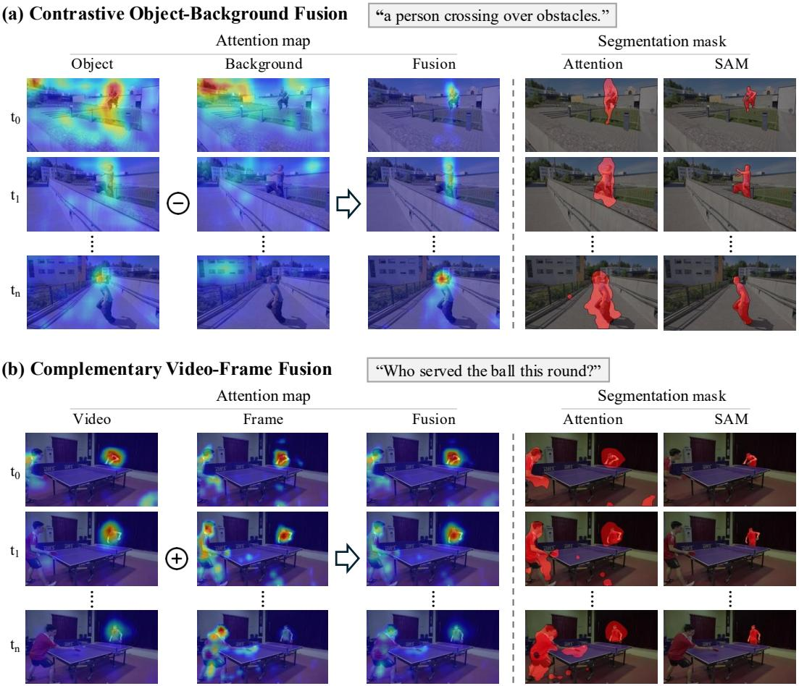
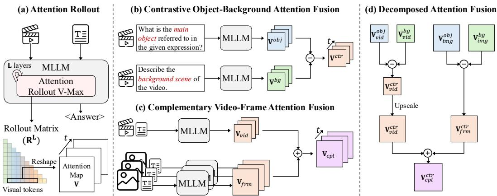
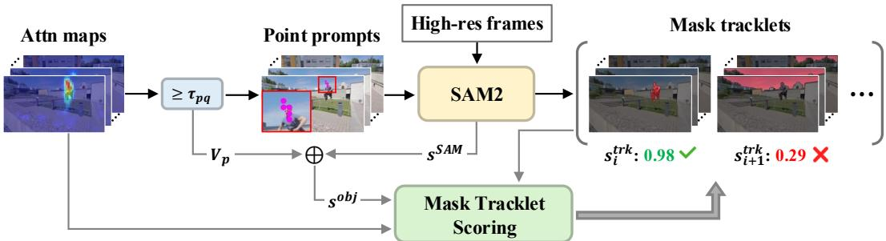
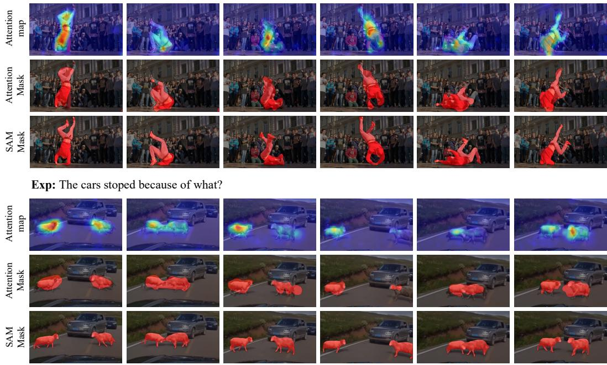

## ABSTRACT

Multimodal large language models (MLLMs) demonstrate strong video understanding by attending to visual tokens relevant to textual queries. To directly adapt this for localization in a training-free manner, we cast video reasoning segmentation as a video QA task and extract attention maps via rollout mechanism. However, raw attention maps are noisy and poorly aligned with object regions. We propose Decomposed Attention Fusion (DecAF), which refines these maps through two mechanisms: (1) contrastive object-background fusion and (2) complementary video-frame fusion. This method suppresses irrelevant activations and enhances object-focused cues, enabling direct conversion of attention maps into coarse segmentation masks. In addition, we introduce attention-guided SAM2 prompting for obtaining fine-grained masks. Unlike existing methods that jointly train MLLMs with SAM, our method operates entirely without retraining. DecAF outperforms training-free methods and achieves performance comparable to training-based methods on both referring and reasoning VOS benchmarks.

## 1 INTRODUCTION

In recent years, Multimodal Large Language Models (MLLMs) (Lin et al., 2023; Chen et al., 2024; Zhang et al., 2024; Bai et al., 2025; Wang et al., 2024a) have rapidly advanced, demonstrating strong performance on challenging video QA benchmarks (Mangalam et al., 2023; Fu et al., 2025). These advances reveal their ability to process temporal visual cues and perform complex reasoning over natural language queries. Such capabilities imply that MLLMs may also possess inherent localization ability in videos, enabling training-free video reasoning segmentation, a task that localizes objects corresponding to text-based queries requiring complex reasoning.

Recent studies (Yan et al., 2024; Bai et al., 2024; Gong et al., 2025b; Lin et al., 2025) have attempted to adapt MLLMs and segmentation foundation models (e.g., SAM (Lin et al., 2024), SAM2 (Ravi et al., 2024)) for video reasoning segmentation by joint training through efficient fine-tuning methods such as LoRA (Hu et al., 2022). However, these methods require model-specific training and joint optimization of two foundation models, resulting in significant computation cost and limited generalization capability.

Meanwhile, a training-free approach, Loc-Head (Kang et al., 2025a), explores the localization ability of MLLMs in the image domain by selecting attention heads responsible for grounding. However, it assumes the presence of a single object referring object and selects heads based on spatial entropy, making extension to multi-object and temporal video data difficult. Moreover, it relies on heuristics to mitigate the visual attention sink phenomenon (Kang et al., 2025b), where certain regions consistently receive dominant attention scores regardless of the instruction, limiting its generalization across MLLMs. These observations motivate us to directly examine how attention mechanisms within MLLMs contribute to localization, without model-specific modification or training.

To obtain attention maps for object localization without relying on model- or task-specific design, we start with attention rollout (Abnar & Zuidema, 2020). Rollout aggregates attention weights across layers, revealing visual cues to which the MLLM attends when producing answers. Its applicability across attention-based MLLMs makes it a plausible approach to probing localization ability. However, since the rollout integrates signals from all heads, irrelevant regions and visual attention sinks often dominate, reducing the relative strength of object cues.

  
Figure 1: Visualization of our method. (a) Noise in irrelevant regions is suppressed by contrastive fusion with the background attention map. As shown in the first frame, background activations are removed, and the target object is emphasized. (b) Video attention map captures temporal cues, while frame attention map highlights object-centric details. Their fusion resolves conflicts (e.g., identifying the server vs. the hitting player) and produces more consistent localization. The attention mask is obtained directly from the attention map while the SAM mask is generated by SAM2.

To overcome these limitations, we introduce Decomposed Attention Fusion (DecAF), which suppresses noise and enhances object-focused signals by decomposing and fusing attention maps in two distinct ways. First, contrastive object-backgroundfusion combines the object and background attention maps through a simple subtraction. The object attention map is obtained with a prompt focusing on the target object, while the background attention map is derived from a contrastive prompt excluding this object. This design effectively suppresses irrelevant activations and highlights the target object signal, as illustrated in Fig. 1 (a). Second, complementary video-framefusion leverages the distinct strengths of video and frame attention in a multi-scale manner. Video attention captures temporal context, which is essential when the object is temporarily absent or requires temporal reasoning, but its coarse granularity limits performance on small objects. In contrast, frame attention provides object-centric, fine-grained cues but lacks temporal coherence. By combining these two attentions, this fusion maintains clearer object focus while also leveraging temporal context, resulting in more robust attention maps that accurately localize the target object across the video.

With the object localization attention map obtained from our two fusion methods, we first generate video object masks through simple thresholding, which provides reliable localization of the target object but remains coarse due to the low granularity of attention. To obtain denser masks, we extract point prompts from the attention map and apply SAM2 (Ravi et al., 2024). However, these coarse prompts, derived from spurious activations in the attention map, often produce false positives. To address this issue, we propose an attention consistency score that evaluates the alignment between the predicted mask and the underlying attention map, enabling unreliable segmentation masks to be filtered out. As shown in Fig. 1, this process transforms a noisy attention map into a precise and reliable segmentation mask.

We evaluate DecAF across three MLLM families and five datasets, including three referring VOS datasets (Khoreva et al., 2018; Seo et al., 2020; Ding et al., 2023) and two reasoning VOS datasets (Yan et al., 2024; Bai et al., 2024). DecAF consistently outperforms prior training-free approaches (Li et al., 2025; Kang et al., 2025a), both with and without SAM. In addition, the dense video object masks achieve performance comparable to training-based methods (Lai et al., 2024; Yan et al., 2024; Bai et al., 2024; Lin et al., 2025; Gong et al., 2025b;a). These results highlight that decomposed attention fusion offers a simple and effective framework for training-free video reasoning segmentation.

## 2 RELATED WORK

Multimodal Large Language Models. LLMs demonstrate powerful reasoning and cognition capabilities (Brown et al., 2020; Dubey et al., 2024; Yang et al., 2024), leading to the development of MLLMs (Wang et al., 2024b; Google, 2024; Team, 2024; Liu et al., 2024). These models, built on the transformer architecture (Vaswani et al., 2017), rely on the attention mechanism. Due to the quadratic cost of attention, some MLLMs firstly compress video tokens into a fixed number of tokens via a lightweight modules (Jin et al., 2024; Song et al., 2024; Maaz et al., 2024). However, this token compression inevitably sacrifices fine-grained spatial information, unlike LLaVA-style models (Liu et al., 2023), which use a linear projector to preserve dense spatial features. More recently, Qwen2VL (Wang et al., 2024b) further advances this line by supporting native-resolution video inputs, maintaining both aspect ratio and fine-grained visual details. In this work, we build on such models and focus on exploring the inherent localization ability of MLLMs.

Text-conditioned Video Object Segmentation. Early research on referring VOS (RVOS) focuses on localizing the target object from simple textual expressions, typically describing appearance. Datasets such as Ref-DAVIS (Khoreva et al., 2018) and Ref-YouTube-VOS (Seo et al., 2020) were designed for this setting and only cover single-object cases. More recently, MeViS (Ding et al., 2023) introduces motion-centric and more challenging scenarios, including cases where the referred object is absent or where multiple candidates match the expression.

With the advent of powerful MLLMs (Liu et al., 2023), video reasoning segmentation has emerged, targeting complex expressions that extend beyond appearance or motion cues and require reasoning over world knowledge and temporal context (Yan et al., 2024; Bai et al., 2024). To address this, existing approaches adapt pretrained MLLMs to RVOS via lightweight finetuning strategies such as LoRA (Hu et al., 2022), and integrate them with segmentation model such as SAM (Kirillov et al., 2023) for precise mask generation, often requiring full finetuning of the mask decoder (Gong et al., 2025b; Lin et al., 2025). In contrast, we leverage MLLMs and SAM in a training-free manner.

Training-free Text-to-Visual Grounding with MLLMs. Recently, MLLMs have been studied for training-free visual grounding tasks (Lin et al., 2024; Li et al., 2025; Kang et al., 2025a). VL-SAM (Lin et al., 2024) and TAM (Li et al., 2025) leverage the attention rollout mechanism (Abnar & Zuidema, 2020) to localize objects in images, with VL-SAM further refining the masks using SAM. Both methods identify all objects by enumerating categories during MLLM decoding. In contrast, Kang et al. (2025a) proposed a method that selects specific attention heads responsible for localization, enabling direct grounding of the object referred to by the given expression. However, this head-selection method shows poor generalization: attention heads identified on referring datasets transfer poorly and yield low accuracy on reasoning-intensive datasets.

  
Figure 2: Overview of DecAF. (a) Attention rollout with our V-Max normalization produces a rollout matrix that accumulates attention across layers, from which visual-token scores for the final query token are extracted as attention maps for grounding. (b) Contrastive fusion suppresses attention scores on background regions. (c) Complementary fusion integrates video- and frame-level cues. (d) These fusion methods are combined into the full pipeline to refine noisy attention maps.

## 3 METHODOLOGY

## 3.1 OVERVIEW

Given a video and a text instruction referring to an object, our framework produces segmentation masks of the target object(s). The pipeline consists of two stages. First, coarse segmentation masks are obtained from attention score maps computed in an MLLM. Second, fine-grained dense segmentation masks are generated using SAM conditioned on these attention maps. In the first stage, we propose Decoupled Attention Fusion (DecAF), illustrated in Fig. 2, which integrates contrastive and complementary fusion strategies with tailored prompting methods. To obtain the attention scores, we adopt attention rollout (Abnar & Zuidema, 2020) with a new normalization technique designed for MLLMs. In the second stage, we introduce a training-free SAM2 prompting pipeline guided by attention maps (Fig. 3). Point queries are first selected by thresholding the attention maps, and SAM2 generates mask tracklets for each query. These tracklets are then evaluated with the proposed attention consistency score, which measures whether the predicted masks consistently overlap with high-attention regions across frames. The resulting scores are used to rank and tracklet candidates.

## 3.2 ATTENTION ROLLOUT WITH VISION-AWARE NORMALIZATION

We trace the influence of visual tokens on the model’s output by propagating attention scores through the transformer layers of MLLMs. To better capture language-conditioned grounding, we modify the standard attention rollout (Abnar & Zuidema, 2020) with a vision-aware normalization scheme.

Standard rollout. Given the attention tensor $\mathbf { A } ^ { ( l ) } \in \mathbb { R } ^ { h \times N \times N }$ from the l-th transformer layer, where h is the number of heads and N is the total number of tokens, the head-wise averaged attention matrix is computed as Eq. 1, and the residual connection is incorporated by adding the identity matrix as Eq. 2. This reflects that a token can either propagate its own representation through the skip connection or attend to other tokens via the attention mechanism. The rollout matrix is then recursively accumulated across layers as Eq. 3, starting from the initialization $\mathbf { R } ^ { ( 1 ) } = \hat { \mathbf { A } } ^ { ( 1 ) }$ and producing $\mathbf { R } ^ { ( L ) }$ , which encodes how information flows from each token to every other token throughout the network.

$$
\bar {\mathbf {A}} ^ {(l)} = \frac {1}{h} \sum_ {i = 1} ^ {h} \mathbf {A} _ {i} ^ {(l)}.\tag{1}
$$

$$
\hat {\mathbf {A}} ^ {(l)} = (\bar {\mathbf {A}} ^ {(l)} + \mathbf {I}) / 2.\tag{2}
$$

$$
\mathbf {R} ^ {(l)} = \hat {\mathbf {A}} ^ {(l)} \mathbf {R} ^ {(l - 1)}.\tag{3}
$$

Head-wise weighted aggregation. To reduce the effect of noisy heads, we assign a weight to each head based on the strength of its vision attention. For each layer l, let the original attention tensor before aggregation be denoted as $\mathbf { A } ^ { ( l ) } \in \mathbb { R } ^ { h \times N \times ( N _ { v } + N _ { t } ) }$ , where $N _ { v }$ and $N _ { t }$ indicate the number of visual and textual tokens, respectively. From $\mathbf { A } ^ { ( l ) }$ , the vision block is extracted: $\mathbf { A } _ { v } ^ { ( l ) } \in \mathbb { R } ^ { h \times N \times N _ { v } }$ The maximum value over the visual token dimension is then computed as:

$$
\mathbf {m} ^ {(l)} = \max _ {j = 1} ^ {N _ {v}} \mathbf {A} _ {v} ^ {(l)} [:,:, j ], \quad \mathbf {m} ^ {(l)} \in \mathbb {R} ^ {h \times N}.\tag{4}
$$

Averaging $\mathbf { m } ^ { ( l ) }$ over the token dimension finally produces the head-wise weight vector, $\mathbf { w } ^ { ( l ) } \in \mathbb { R } ^ { h }$ The weights are normalized so that maxh $( w _ { h } ^ { ( l ) } ) = 1$ , and these normalized weights are used to aggregate the heads, resulting in the final attention weights $\hat { \mathbf { A } } ^ { ( l ) } \in \mathbb { R } ^ { N \times ( N _ { v } + N _ { t } ) }$

## 3.3 DECOMPOSED ATTENTION FUSION

The attention rollout mechanism quantifies token-to-token influence. To perform text-conditioned video reasoning segmentation, we cast the task as video question answering, where the goal is to identify a category of the object in a video referred to by the text instruction. We then exploit the rollout matrix values with the last token as query and visual tokens as keys, using them as attention scores that indicate how visual tokens contribute to answering the video QA, as shown in Fig. 2 (a).

However, the rollout matrix aggregates signals across all heads and layers and is too noisy to serve directly as a segmentation score map. In addition to pervasive noise, we observe strong activations in irrelevant regions, known as the visual attention sink phenomenon. To address this, we introduce Decomposed Attention Fusion (DecAF) to obtain cleaner, object-focused attention maps. As shown in Fig. 2 (d), DecAF applies contrastive fusion within each modality (video and frame) in parallel, followed by complementary fusion after upscaling the video-level attention maps to match the frame-level size. The resulting attention maps are then converted into coarse segmentation masks via thresholding. Here, we explain with shortened prompts, but the full prompts are in the Appendix.

Contrastive Object–Background Attention Fusion. A key challenge of using attention maps for segmentation is that irrelevant regions often receive very high scores, which cannot be suppressed by simple thresholding. Such visual attention sinks frequently appear regardless of the given instruction. To address this issue, we introduce contrastivefusion, which contrasts attention maps obtained from object-focused and background-focused prompts. Subtracting background from object attention effectively highlights the target region while suppressing spurious responses.

The specific process follows Fig. 2 (b). The object attention map is obtained by prompting the model to identify the target object category from the referring expression using an object-focused prompt template, “What is the main object referred to in the given expression?” The rollout attention weights from this response form the positive map. For the background attention map, we first use a background-focused prompt such as “Describe the background scene of the video.” However, this may cause the target object to be mistakenly attended when it is not the main salient object but still appears in the background. To mitigate this, we additionally insert the identified category $O _ { \mathrm { n a m e } }$ into the template, to explicitly exclude the target object from the background attention map. The rollout attention map from this response serves as the negative map.

Both object and background attention maps are reshaped into $( T , H _ { p } , W _ { p } )$ , where T is the number of frames and $( H _ { p } , W _ { p } )$ is the patch grid. Before fusion, Gaussian smoothing is applied to both maps to mitigate the sparsity of raw attention weights. The contrastive map, $\mathbf { V } ^ { c t r }$ , is then computed by subtracting the background map from the object map, clamped to remove negative values. Finally, min–max normalization is applied to scale the values into the [0, 1] range.

Complementary Video–Frame Attention Fusion. The softmax operation in attention enforces that all token scores sum to one. With video inputs, this constraint spreads attention across a large number of tokens, yielding maps that are relatively sparse and shaped by temporal context. In contrast, with image inputs, attention is concentrated on fewer tokens and tends to emphasize object-centric spatial details. We therefore exploit these complementary properties of video- and frame-level attention maps to achieve more robust localization.

As shown in Fig. 2 (c), we apply the identical attention rollout pipeline individually to the video and frame modalities, where each frame in the image modality is processed along the batch axis. This mixed-modality design introduces two modifications in the contrastive fusion step. (1) Since background prompting requires an object category, we select a single prediction by aggregating outputs from both video- and frame-level inputs with object category choice prompt. (2) For min–max normalization, we normalize frame-level maps independently per frame, while video-level maps are normalized globally across all frames. Finally, the two sets of maps are fused by simple averaging, combining the global temporal context of video attention with the spatial precision of frame attention.

  
Figure 3: Overview of our SAM prompting pipeline with attention maps. (1) Point queries for SAM2 are obtained from attention maps via thresholding $( \tau _ { p q } )$ . (2) During mask propagation, highly overlapping masks are removed. (3) Spurious mask tracklets are removed using our scoring method.

Our video–frame decoupled prompting enables multi-scale processing, allowing higher-resolution inputs to be used for frame attention. Recent MLLMs, such as InternVL and LLaVA-NeXT, support dynamic image resolutions via tiling, whereas video inputs remain constrained to lower resolutions $( e . g .$ , 448). In contrast, QwenVL supports native resolutions for both video and image; in this case, we simply double the width and height for image inputs. To align modalities, low-res video attention maps are upsampled to match the frame-level resolution before fusion.

## 3.4 SAM2 PROMPTING WITH ATTENTION MAPS

After DecAF process, we obtain the spatio-temporal attention maps, $\mathbf { V } \in \mathbb { R } ^ { T _ { s } \times H _ { p } \times W _ { p } }$ , where $T _ { s }$ is the number of sampled frames and $( H _ { p } , W _ { p } )$ is spatial resolution of visual token grid. Since this resolution is coarse, we introduce a method to prompt SAM2 using the attention maps to produce fine-grained object masks, $\hat { \mathbf { M } } \in \mathbb { R } ^ { T \times H \times W }$ . Here, we use full frames at high-resolution, rather than the sampled frames used in the MLLM. The overall pipeline is illustrated in Fig. 3.

Point Query Generation. Since SAM requires spatial prompts, we generate point queries directly from attention maps to guide object mask prediction. We select visual tokens with attention scores above a threshold $\tau _ { p q }$ and use their center coordinates as point queries. The set of point queries is defined as in Eq. 5, where $o _ { x }$ and $o _ { y }$ denote half the token width and height, respectively, ensuring that each point corresponds to the token center.

$$
\mathcal {P} = \{p = (t, y + o _ {y}, x + o _ {x}) \mid \mathbf {V} _ {t, y, x} \geq \tau_ {p q} \}.\tag{5}
$$

Frame-wise Prompting and Propagation. Starting from the first frame, the point queries are fed sequentially to SAM2 which produces frame-level masks and propagates them through subsequent frames. This process generates a video mask for each point query (pi), denoted as $\mathbf { M } _ { i } \in \mathbb { R } ^ { T _ { s } \times H ^ { \bullet } W }$ together with its confidence score, $s _ { i } ^ { \mathrm { S A M } }$ , predicted by SAM2.

Naive thresholding may generate a large number of redundant masks. To reduce computation, we assign an object score $\overset { \cdot } { s _ { i } ^ { o b \bar { j } } } = \mathbf { V } _ { p _ { i } } + s _ { i } ^ { \mathrm { S A \bar { M } } }$ for each predicted mask, where $\mathbf { V } _ { p _ { i } }$ is attention score of $\dot { p } _ { i }$ We then apply non-maximum suppression (NMS) using this object score. Two masks are considered overlapping if their IoU exceeds a threshold (e.g., 0.7), and the one with the lower score is removed. If a propagated mask from previous frames highly overlaps with a new mask in the current frame, we retain only the one with the higher object score. Through this process, we obtain K video mask tracklets, where $K < < | \mathcal { P } |$ , effectively reducing redundancy while keeping high-quality candidates.

Mask Tracklet Scoring and Selection. Since attention maps are at low resolution, point queries are not spatially precise and may fall on background regions. Nevertheless, SAM often produces high-confidence masks from such queries (e.g., walls), leading to false positives. To suppress these cases, we evaluate each mask tracklet using an attention consistency score $( s ^ { a c } )$ , which measures whether the mask consistently overlaps with high-attention regions across frames.

Table 1: Comparison of MLLM-based text-conditioned VOS methods that directly compute masks from attention maps (Attn Mask). All methods are training-free and grouped by MLLM.

<table><tr><td rowspan="2">Method</td><td rowspan="2">MLLM</td><td colspan="3">Ref-DAVIS</td><td colspan="3">ReasonVOS</td><td colspan="3">ReVOS (Overall)</td><td colspan="3">ReVOS (Referring)</td><td colspan="3">ReVOS (Reasoning)</td></tr><tr><td>J&amp;F</td><td>J</td><td>F</td><td>J&amp;F</td><td>J</td><td>F</td><td>J&amp;F</td><td>J</td><td>F</td><td>J&amp;F</td><td>J</td><td>F</td><td>J&amp;F</td><td>J</td><td>F</td></tr><tr><td>Loc-Head [CVPR&#x27;25]</td><td>LLaVA-7B</td><td>18.9</td><td>23.2</td><td>14.5</td><td>12.2</td><td>14.1</td><td>10.2</td><td>12.6</td><td>15.0</td><td>10.2</td><td>14.1</td><td>17.4</td><td>10.8</td><td>11.1</td><td>12.7</td><td>9.5</td></tr><tr><td>Loc-Head [CVPR&#x27;25]</td><td>LLaVA-OV-7B</td><td>15.9</td><td>14.1</td><td>17.7</td><td>12.3</td><td>11.2</td><td>13.4</td><td>13.1</td><td>12.0</td><td>14.3</td><td>14.9</td><td>13.8</td><td>16.0</td><td>11.4</td><td>10.3</td><td>12.5</td></tr><tr><td>DecAF [Ours]</td><td>LLaVA-OV-7B</td><td>21.6</td><td>24.0</td><td>19.1</td><td>17.2</td><td>19.4</td><td>15.0</td><td>15.6</td><td>17.6</td><td>13.7</td><td>16.9</td><td>19.5</td><td>14.4</td><td>14.3</td><td>15.6</td><td>12.9</td></tr><tr><td>Loc-Head [CVPR&#x27;25]</td><td>InternVL3-8B</td><td>19.0</td><td>24.1</td><td>14.0</td><td>14.1</td><td>15.6</td><td>12.6</td><td>14.6</td><td>16.8</td><td>12.4</td><td>16.5</td><td>19.3</td><td>13.7</td><td>12.7</td><td>14.2</td><td>11.1</td></tr><tr><td>DecAF [Ours]</td><td>InternVL3-8B</td><td>20.7</td><td>26.0</td><td>15.3</td><td>18.4</td><td>21.8</td><td>14.9</td><td>16.7</td><td>20.4</td><td>13.0</td><td>18.2</td><td>22.5</td><td>13.9</td><td>15.2</td><td>18.3</td><td>12.1</td></tr><tr><td>TAM [ICCV&#x27;25]</td><td>Qwen2VL-7B</td><td>2.5</td><td>1.8</td><td>3.3</td><td>2.8</td><td>2.8</td><td>2.9</td><td>2.8</td><td>2.9</td><td>2.6</td><td>2.9</td><td>3.1</td><td>2.7</td><td>2.7</td><td>2.8</td><td>2.6</td></tr><tr><td>Loc-Head [CVPR&#x27;25]</td><td>Qwen2VL-7B</td><td>18.8</td><td>23.8</td><td>13.8</td><td>9.0</td><td>11.1</td><td>6.8</td><td>13.2</td><td>17.5</td><td>8.9</td><td>16.5</td><td>22.2</td><td>10.7</td><td>10.0</td><td>12.9</td><td>7.2</td></tr><tr><td>DecAF [Ours]</td><td>Qwen2VL-7B</td><td>20.0</td><td>24.8</td><td>15.2</td><td>13.8</td><td>17.5</td><td>10.0</td><td>15.2</td><td>19.8</td><td>10.7</td><td>17.5</td><td>23.2</td><td>11.8</td><td>13.0</td><td>16.4</td><td>9.6</td></tr><tr><td>TAM [ICCV&#x27;25]</td><td>Qwen2.5VL-7B</td><td>3.5</td><td>2.8</td><td>4.3</td><td>3.7</td><td>3.4</td><td>3.9</td><td>4.0</td><td>4.0</td><td>4.0</td><td>4.1</td><td>4.1</td><td>4.1</td><td>3.8</td><td>3.8</td><td>3.8</td></tr><tr><td>Loc-Head [CVPR&#x27;25]</td><td>Qwen2.5VL-7B</td><td>19.1</td><td>24.2</td><td>14.0</td><td>10.7</td><td>13.1</td><td>8.3</td><td>14.1</td><td>18.6</td><td>9.6</td><td>16.9</td><td>22.7</td><td>11.0</td><td>11.4</td><td>14.5</td><td>8.3</td></tr><tr><td>DecAF [Ours]</td><td>Qwen2.5VL-7B</td><td>25.3</td><td>32.0</td><td>18.6</td><td>20.6</td><td>26.0</td><td>15.3</td><td>20.2</td><td>26.0</td><td>14.5</td><td>22.1</td><td>28.8</td><td>15.4</td><td>18.3</td><td>23.1</td><td>13.5</td></tr></table>

For each tracklet i, we then compute a combined tracklet score, $s _ { i } ^ { t r k } \ = \ \mathrm { A v g } ( \mathbf { V } _ { p _ { i } } , s _ { i } ^ { \mathrm { S A M } } , s _ { i } ^ { a c } )$ Tracklets with $s _ { i } ^ { t r k } \geq \tau _ { t r k }$ are retained and propagated across all video frames via SAM2 to generate the final dense segmentation masks. This procedure naturally supports both single-object and multiobject localization by treating each high-confidence query as an independent object hypothesis.

The computation of $s ^ { a c }$ is as follows. First, we obtain a binary mask for each frame by thresholding the attention map at its mean score $\mu _ { t } ( \mathrm { E q . }  )$ . Second, we assign the negative maximum attention score per frame, $\delta _ { t } = - \operatorname* { m a x } ( \mathbf { V } _ { t , : , : } )$ , to regions below $\mu _ { t } , ( \mathrm { E q . ~ } 7 )$ , penalizing low-attention areas. Finally, each mask tracklet is downampled to the attention map resolution, $\tilde { \mathbf { M } } _ { i } \in \mathbb { R } ^ { T _ { s } \times H _ { p } \times W _ { p } } ,$ and $s ^ { a c }$ is computed as a ratio of inner products $( \mathrm { E q . } 8 )$ , where $\langle \cdot , \cdot \rangle$ denotes the tensor inner product.

$$
\mathbf {M} _ {t, y, x} ^ {A t t n} = \left\{ \begin{array}{l l} 1, & \mathbf {V} _ {t, y, x} \geq \mu_ {t}, \\ 0, & \text {otherwise.} \end{array} \right. \quad (6) \quad \hat {\mathbf {V}} _ {t, y, x} = \left\{ \begin{array}{l l} \mathbf {V} _ {t, y, x}, & \mathbf {V} _ {t, y, x} \geq \mu_ {t}, \\ \delta_ {t}, & \text {otherwise.} \end{array} \right. \quad (7) \quad s _ {i} ^ {a c} = \frac {\langle \tilde {\mathbf {M}} _ {i} , \hat {\mathbf {V}} \rangle}{\langle \mathbf {M} ^ {A t t n} , \hat {\mathbf {V}} \rangle}\tag{8}
$$

## 4 EXPERIMENTS

## 4.1 EVALUATION SETTING

Datasets and Evaluation Metrics. We evaluate our method on three referring VOS datasets: Ref-DAVIS (Khoreva et al., 2018), Ref-YouTube-VOS (Seo et al., 2020), and MeViS (Ding et al., 2023). In addition, we validate it on two reasoning VOS datasets: ReasonVOS (Bai et al., 2024) and ReVOS (Yan et al., 2024). Note that ReasonVOS provides only a test set and is used for zeroshot evaluation, whereas the other datasets include training data. For evaluation, we employ the standard VOS metrics: region similarity (J), contour accuracy $( { \mathcal { F } } )$ , and their mean $( \mathcal { I } \& \mathcal { F } )$

Implementation Details. For mask generation directly from attention maps, we apply Otsu’s adaptive thresholding method (Otsu et al., 1975). By default, attention rollout starts from the middle LLM layer (e.g., 14 for 28 layers of Qwen2.5VL-7B), and SAM prompting threshold values of $\tau _ { t r k } = 0 . 8$ and $\tau _ { p q } = 0 . 8$ . We use publicly released MLLM checkpoints and the SAM2-hiera-large.

## 4.2 COMPARISON WITH EXISTING METHODS USING MLLMS

Mask without SAM. We evaluate segmentation masks obtained directly from MLLM attention maps using simple upscaling and thresholding, and compare them with existing methods in Tab. 1. Uniformly sampled 16 frames are used here. TAM (Li et al., 2025) performs poorly due to its strong dependence on predicted word tokens, making it unable to reliably ground expressions under our object-focused prompt. Further analysis of TAM’s failure cases is provided in the Appendix. Loc-Head (Kang et al., 2025a) is also designed for text-conditioned segmentation, but operates in the image domain. Our method consistently outperforms Loc-Head across different MLLMs and datasets, with especially large margins on datasets require complex reasoning. This suggests that our method generalizes more effectively to reasoning-intensive scenarios, whereas localization heads rely on heuristic head selection and thus exhibit limited robustness.

Table 2: Comparison of MLLM-based text-conditioned VOS methods. The upper gray rows correspond to training-based methods, while the lower colored rows correspond to training-free methods.

<table><tr><td rowspan="2">Method</td><td rowspan="2">MLLM</td><td colspan="3">Ref-DAVIS</td><td colspan="3">ReasonVOS</td><td colspan="3">ReVOS (Overall)</td><td colspan="3">ReVOS (Referring)</td><td colspan="3">ReVOS (Reasoning)</td></tr><tr><td>J&amp;F</td><td>J</td><td>F</td><td>J&amp;F</td><td>J</td><td>F</td><td>J&amp;F</td><td>J</td><td>F</td><td>J&amp;F</td><td>J</td><td>F</td><td>J&amp;F</td><td>J</td><td>F</td></tr><tr><td>LISA [CVPR&#x27;24]</td><td>LLaVA-7B</td><td>64.8</td><td>62.2</td><td>67.3</td><td>31.1</td><td>29.1</td><td>33.1</td><td>40.9</td><td>39.1</td><td>42.7</td><td>45.7</td><td>44.3</td><td>47.1</td><td>36.1</td><td>33.8</td><td>38.4</td></tr><tr><td>VISA [ECCV&#x27;24]</td><td>ChatUniVi-7B</td><td>69.4</td><td>66.3</td><td>72.5</td><td>-</td><td>-</td><td>-</td><td>46.9</td><td>44.9</td><td>49.0</td><td>50.9</td><td>49.2</td><td>52.6</td><td>43.0</td><td>40.6</td><td>45.4</td></tr><tr><td>VideoLISA [NeurIPS&#x27;24]</td><td>LLaVA-Phi-3-V</td><td>68.8</td><td>64.9</td><td>72.7</td><td>47.5</td><td>45.1</td><td>49.9</td><td>-</td><td>-</td><td>-</td><td>-</td><td>-</td><td>-</td><td>-</td><td>-</td><td>-</td></tr><tr><td>GLUS [CVPR&#x27;25]</td><td>LLaVA-7B</td><td>-</td><td>-</td><td>-</td><td>49.9</td><td>47.5</td><td>52.4</td><td>54.9</td><td>52.4</td><td>57.3</td><td>58.3</td><td>56.0</td><td>60.7</td><td>51.4</td><td>48.8</td><td>53.9</td></tr><tr><td>VRS-HQ [CVPR&#x27;25]</td><td>ChatUniVi-7B</td><td>76.0</td><td>72.6</td><td>79.4</td><td>54.9</td><td>52.6</td><td>57.3</td><td>59.1</td><td>56.6</td><td>61.6</td><td>62.1</td><td>59.8</td><td>64.5</td><td>56.1</td><td>53.5</td><td>58.7</td></tr><tr><td>Veason-R1 [arxiv&#x27;25.08]</td><td>Qwen2.5VL-7B</td><td>-</td><td>-</td><td>-</td><td>59.9</td><td>56.0</td><td>63.8</td><td>61.3</td><td>58.2</td><td>64.4</td><td>63.6</td><td>60.7</td><td>66.5</td><td>59.0</td><td>55.8</td><td>62.2</td></tr><tr><td>Loc-Head [CVPR&#x27;25]</td><td>LLaVA-7B</td><td>55.6</td><td>51.5</td><td>59.6</td><td>37.1</td><td>32.9</td><td>41.4</td><td>35.3</td><td>31.1</td><td>39.6</td><td>39.2</td><td>35.0</td><td>43.4</td><td>31.5</td><td>27.2</td><td>35.7</td></tr><tr><td>Loc-Head [CVPR&#x27;25]</td><td>LLaVA-OV-7B</td><td>24.2</td><td>21.3</td><td>27.1</td><td>32.6</td><td>29.7</td><td>35.4</td><td>31.7</td><td>28.3</td><td>35.1</td><td>32.8</td><td>29.2</td><td>36.5</td><td>30.6</td><td>27.4</td><td>33.7</td></tr><tr><td>DecAF [Ours]</td><td>LLaVA-OV-7B</td><td>59.4</td><td>54.8</td><td>64.0</td><td>52.8</td><td>49.3</td><td>56.3</td><td>40.0</td><td>35.8</td><td>44.1</td><td>43.4</td><td>39.1</td><td>47.6</td><td>36.6</td><td>32.6</td><td>40.7</td></tr><tr><td>Loc-Head [CVPR&#x27;25]</td><td>InternVL3-8B</td><td>66.3</td><td>62.4</td><td>70.2</td><td>44.3</td><td>41.0</td><td>47.5</td><td>43.7</td><td>39.9</td><td>47.5</td><td>46.7</td><td>42.9</td><td>50.6</td><td>40.7</td><td>36.9</td><td>44.5</td></tr><tr><td>DecAF [Ours]</td><td>InternVL3-8B</td><td>62.8</td><td>56.9</td><td>68.6</td><td>58.9</td><td>55.1</td><td>62.7</td><td>47.4</td><td>43.7</td><td>51.2</td><td>51.7</td><td>47.9</td><td>55.5</td><td>43.2</td><td>39.5</td><td>46.8</td></tr><tr><td>Loc-Head [CVPR&#x27;25]</td><td>Qwen2VL-7B</td><td>61.9</td><td>58.0</td><td>65.8</td><td>34.0</td><td>31.8</td><td>36.2</td><td>44.0</td><td>40.8</td><td>47.2</td><td>52.7</td><td>49.1</td><td>56.2</td><td>35.4</td><td>32.6</td><td>38.2</td></tr><tr><td>DecAF [Ours]</td><td>Qwen2VL-7B</td><td>64.1</td><td>59.4</td><td>68.9</td><td>52.5</td><td>49.0</td><td>56.0</td><td>45.3</td><td>41.6</td><td>49.0</td><td>52.7</td><td>48.9</td><td>56.4</td><td>37.9</td><td>34.3</td><td>41.5</td></tr><tr><td>Loc-Head [CVPR&#x27;25]</td><td>Qwen2.5VL-7B</td><td>64.6</td><td>60.2</td><td>68.9</td><td>41.1</td><td>37.9</td><td>44.3</td><td>47.0</td><td>43.3</td><td>50.7</td><td>53.1</td><td>49.3</td><td>56.9</td><td>40.8</td><td>37.2</td><td>44.4</td></tr><tr><td>DecAF [Ours]</td><td>Qwen2.5VL-7B</td><td>75.2</td><td>70.9</td><td>79.5</td><td>63.9</td><td>60.5</td><td>67.2</td><td>54.2</td><td>50.1</td><td>58.2</td><td>58.7</td><td>54.8</td><td>62.6</td><td>49.7</td><td>45.4</td><td>53.9</td></tr></table>

Table 3: Comparison on additional datasets.

<table><tr><td rowspan="2">Method</td><td rowspan="2">MLLM</td><td colspan="3">MeViS</td><td colspan="3">Ref-YTVOS</td></tr><tr><td> $\mathcal{J}\&\mathcal{F}$ </td><td> $\mathcal{J}$ </td><td> $\mathcal{F}$ </td><td> $\mathcal{J}\&\mathcal{F}$ </td><td> $\mathcal{J}$ </td><td> $\mathcal{F}$ </td></tr><tr><td>VISA [ECCV&#x27;24]</td><td>Chat-UniVi-7B</td><td>44.5</td><td>41.8</td><td>47.1</td><td>61.5</td><td>59.8</td><td>63.2</td></tr><tr><td>VideoLISA [NeurIPS&#x27;24]</td><td>LLaVA-Phi-3-V</td><td>44.4</td><td>41.3</td><td>47.6</td><td>63.7</td><td>61.7</td><td>65.7</td></tr><tr><td>GLUS [CVPR&#x27;25]</td><td>LLaVA-7B</td><td>51.3</td><td>48.5</td><td>54.2</td><td>67.3</td><td>65.5</td><td>69.0</td></tr><tr><td>VRS-HQ [CVPR&#x27;25]</td><td>Chat-UniVi-7B</td><td>50.6</td><td>47.6</td><td>53.7</td><td>70.4</td><td>68.3</td><td>72.5</td></tr><tr><td>Veason-R1 [arxiv&#x27;25.08]</td><td>Qwen2.5VL-7B</td><td>52.2</td><td>48.4</td><td>56.0</td><td>-</td><td>-</td><td>-</td></tr><tr><td>Loc-Head [CVPR&#x27;25]</td><td>Qwen2.5VL-7B</td><td>39.4</td><td>35.2</td><td>43.6</td><td>51.0</td><td>46.8</td><td>55.2</td></tr><tr><td>DecAF [Ours]</td><td>Qwen2.5VL-7B</td><td>48.1</td><td>44.0</td><td>52.1</td><td>59.9</td><td>56.2</td><td>63.5</td></tr></table>

Despite these relative improvements, attention maps remain very low resolution, and the resulting scores are still below those of conventional segmentation models. In particular, contour accuracy (F) is much lower than region similarity (J), reflecting the inability of low-resolution attention maps to capture fine-grained boundaries – opposite to the trend observed in segmentation-specialized models. These findings suggest that attention masks alone are too coarse for precise segmentation, but they provide a sufficient coarse localization signal to guide SAM prompting (Ravi et al., 2024).

Mask with SAM. We evaluate dense segmentation masks for all video frames using SAM2, and report the results in Tabs. 2 and 3, including both training-based and training-free methods. Loc-Head proposes its own SAM prompting method, but it is developed under a single-object assumption: the largest bounding box (bbox) is obtained using the convex hull algorithm. Also, prompting with an imprecise bbox may result in segmenting non-target objects. On Ref-DAVIS with LLaVA-7B, Loc-Head’s bbox prompting achieves 30.3, whereas our prompting achieves 55.6. This large gap highlights the advantage of our prompting method; thus, we adopt for all subsequent comparisons.

In regards to training-free methods, our method outperforms Loc-Head across different MLLMs and datasets, including the additionally presented MeViS and Ref-YTVOS (Tab. 3). Although Loc-Head achieves slightly higher scores on Ref-DAVIS with InternVL3-8B, its performance drops substantially on ReasonVOS, which requires handling more complex expressions.

Compared with training-based methods, our method achieves comparable or even superior performance. On Ref-DAVIS, our method with Qwen2.5VL-7B outperforms VISA and VideoLISA by 5.8 and 6.4 J&F, respectively. On MeViS, our method achieves 48.1, outperforming both VISA (44.5) and VideoLISA (44.4), and reaching performance close to VRS-HQ (50.6). It is worth noting that recent state-of-the-art models (GLUS, VRS-HQ, Veason-R1) leverage trained keyframe selection modules, whereas our method simply employs uniform sampling. Even with this difference, our approach surpasses all training-based methods on ReasonVOS, despite Veason-R1 additionally training the same MLLM (Qwen2.5VL) with an RL-based algorithm. This clearly manifests the effectiveness of our method.

Table 4: Ablation study of decomposed attention fusion.  
(a) Object-background contrasting

<table><tr><td rowspan="2">MLLM</td><td rowspan="2">Obj</td><td rowspan="2">Bg</td><td colspan="2">Attn Mask</td><td colspan="2">SAM Mask</td></tr><tr><td>Ref-D</td><td>ReasV</td><td>Ref-D</td><td>ReasV</td></tr><tr><td rowspan="2">IVL3</td><td>√</td><td></td><td>12.4</td><td>13.2</td><td>50.8</td><td>54.7</td></tr><tr><td>√</td><td>√</td><td>20.7</td><td>18.4</td><td>62.8</td><td>58.9</td></tr><tr><td rowspan="2">QVL2.5</td><td>√</td><td></td><td>14.5</td><td>13.8</td><td>61.9</td><td>58.4</td></tr><tr><td>√</td><td>√</td><td>25.3</td><td>20.6</td><td>75.2</td><td>63.9</td></tr></table>

(b) Video-frame complementing (c) Multi-scale complementing

<table><tr><td>MLLM</td><td>Vid</td><td>Frm</td><td>Ref-D</td><td>ReasV</td></tr><tr><td rowspan="3">IVL3</td><td>√</td><td></td><td>46.0</td><td>50.2</td></tr><tr><td></td><td>√</td><td>60.0</td><td>50.8</td></tr><tr><td>√</td><td>√</td><td>62.8</td><td>58.9</td></tr><tr><td rowspan="3">QVL2.5</td><td>√</td><td></td><td>65.9</td><td>58.6</td></tr><tr><td></td><td>√</td><td>67.4</td><td>58.2</td></tr><tr><td>√</td><td>√</td><td>75.2</td><td>63.9</td></tr></table>

<table><tr><td>MLLM</td><td>MS</td><td>Ref-D</td><td>ReasV</td></tr><tr><td rowspan="2">IVL3</td><td rowspan="2">√</td><td>54.0</td><td>53.7</td></tr><tr><td>62.8</td><td>58.9</td></tr><tr><td rowspan="2">QVL2.5</td><td rowspan="2">√</td><td>72.4</td><td>60.5</td></tr><tr><td>75.2</td><td>63.9</td></tr></table>

Table 7: Ablation study of computing attention consistency score $( s ^ { a c } )$ .

Table 5: Ablation study of attention rollout. (a) Rollout method  
Table 6: SAM prompting threshold values.

<table><tr><td>Method</td><td>Ref-D</td><td>ReasV</td></tr><tr><td>Rollout (Abnar &amp; Zuidema, 2020)</td><td>68.4</td><td>56.8</td></tr><tr><td>Rollout Max (Lin et al., 2024)</td><td>72.9</td><td>60.9</td></tr><tr><td>Rollout V-Max (Ours)</td><td>75.2</td><td>63.9</td></tr></table>

(b) Starting LLM layer for rollout

<table><tr><td> $\tau_{trk}$ </td><td> $\tau_{pq}$ </td><td>Ref-D</td><td>ReasV</td></tr><tr><td>0.7</td><td>0.7</td><td>71.0</td><td>59.9</td></tr><tr><td>0.7</td><td>0.8</td><td>75.0</td><td>62.1</td></tr><tr><td>0.7</td><td>0.9</td><td>74.3</td><td>65.7</td></tr><tr><td>0.8</td><td>0.7</td><td>70.6</td><td>61.1</td></tr><tr><td>0.8</td><td>0.8</td><td>75.2</td><td>63.9</td></tr><tr><td>0.8</td><td>0.9</td><td>74.3</td><td>65.9</td></tr><tr><td>0.9</td><td>0.7</td><td>71.6</td><td>61.7</td></tr><tr><td>0.9</td><td>0.8</td><td>74.5</td><td>64.9</td></tr><tr><td>0.9</td><td>0.9</td><td>74.2</td><td>66.4</td></tr></table>

<table><tr><td rowspan="2">Layer index</td><td colspan="2">Qwen2.5VL-7B</td><td colspan="2">InternVL3-8B</td></tr><tr><td>Ref-D</td><td>ReasV</td><td>Ref-D</td><td>ReasV</td></tr><tr><td>7 (1/4)</td><td>69.2</td><td>62.8</td><td>62.1</td><td>56.8</td></tr><tr><td>14 (2/4)</td><td>75.2</td><td>63.9</td><td>62.8</td><td>58.9</td></tr><tr><td>21 (3/4)</td><td>73.6</td><td>64.1</td><td>55.8</td><td>60.1</td></tr></table>

<table><tr><td>Thresh (μ)</td><td>Penalty (δ)</td><td>Ref-D</td><td>ReasV</td></tr><tr><td colspan="2">Not Use</td><td>60.0</td><td>52.9</td></tr><tr><td>Otsu</td><td></td><td>68.3</td><td>59.6</td></tr><tr><td>Otsu</td><td>√</td><td>67.9</td><td>61.1</td></tr><tr><td>Mean</td><td></td><td>65.1</td><td>56.0</td></tr><tr><td>Mean</td><td>√</td><td>75.2</td><td>63.9</td></tr></table>

Table 8: Evaluation on other sizes of MLLMs.

<table><tr><td rowspan="2">MLLM</td><td rowspan="2">Size</td><td colspan="3">Ref-DAVIS</td><td colspan="3">ReasonVOS</td><td colspan="3">ReVOS (Overall)</td><td colspan="3">ReVOS (Referring)</td><td colspan="3">ReVOS (Reasoning)</td></tr><tr><td>J&amp;F</td><td>J</td><td>F</td><td>J&amp;F</td><td>J</td><td>F</td><td>J&amp;F</td><td>J</td><td>F</td><td>J&amp;F</td><td>J</td><td>F</td><td>J&amp;F</td><td>J</td><td>F</td></tr><tr><td rowspan="3">InternVL3</td><td>2B</td><td>53.5</td><td>48.1</td><td>58.9</td><td>54.1</td><td>50.7</td><td>57.6</td><td>38.1</td><td>34.0</td><td>42.2</td><td>42.3</td><td>38.2</td><td>46.5</td><td>33.9</td><td>29.9</td><td>38.0</td></tr><tr><td>8B</td><td>62.8</td><td>56.9</td><td>68.6</td><td>58.9</td><td>55.1</td><td>62.7</td><td>47.4</td><td>43.7</td><td>51.2</td><td>51.7</td><td>47.9</td><td>55.5</td><td>43.2</td><td>39.5</td><td>46.8</td></tr><tr><td>14B</td><td>63.3</td><td>58.3</td><td>68.4</td><td>65.6</td><td>62.2</td><td>68.9</td><td>47.0</td><td>43.0</td><td>51.0</td><td>51.3</td><td>47.2</td><td>55.4</td><td>42.7</td><td>38.8</td><td>46.6</td></tr><tr><td rowspan="2">Qwen2VL</td><td>2B</td><td>41.8</td><td>37.1</td><td>46.6</td><td>47.6</td><td>44.4</td><td>50.8</td><td>30.2</td><td>26.4</td><td>34.0</td><td>37.1</td><td>33.0</td><td>41.2</td><td>23.3</td><td>19.8</td><td>26.8</td></tr><tr><td>7B</td><td>64.1</td><td>59.4</td><td>68.9</td><td>52.5</td><td>49.0</td><td>56.0</td><td>45.3</td><td>41.6</td><td>49.0</td><td>52.7</td><td>48.9</td><td>56.4</td><td>37.9</td><td>34.3</td><td>41.5</td></tr><tr><td rowspan="2">Qwen2.5VL</td><td>3B</td><td>58.1</td><td>53.6</td><td>62.6</td><td>52.9</td><td>49.6</td><td>56.2</td><td>39.7</td><td>35.6</td><td>43.8</td><td>46.5</td><td>42.1</td><td>50.9</td><td>32.9</td><td>29.1</td><td>36.7</td></tr><tr><td>7B</td><td>75.2</td><td>70.9</td><td>79.5</td><td>63.9</td><td>60.5</td><td>67.2</td><td>54.2</td><td>50.1</td><td>58.2</td><td>58.7</td><td>54.8</td><td>62.6</td><td>49.7</td><td>45.4</td><td>53.9</td></tr></table>

## 4.3 ABLATION STUDY

We use Qwen2.5-VL-7B (QVL2.5) and InternVL3-8B (IVL3) as models, and Ref-DAVIS (Ref-D) and ReasonVOS (ReasV) as datasets. By default, results are reported with QVL2.5 and J&F.

Decoupled Attention Fusion. We evaluate the effectiveness of DecAF. First, we examine objectbackground contrastive fusion (Tab. 4a), which substantially improves attention mask accuracy on both referring and reasoning VOS datasets (e.g., 12.4 → 20.7 and 14.5 → 25.3 on Ref-D) by suppressing the irrelevant regions. Similar improvements are also observed for SAM mask accuracy.

Second, video-frame complementary fusion (Tab. 4b) further enhances accuracy. For Qwen2.5VL, video-only and frame-only inputs yield 65.9 and 67.4 on Ref-D, respectively, whereas combining both achieves 75.2. Consistent gains are also observed on ReasV and with InternVL3.

For video-frame fusion, we adopt a multi-scale scheme that leverages higher resolution inputs at the frame level. While Qwen2.5VL supports native resolutions, InternVL and LLaVA-OV models require a fixed input size but can handle dynamic high resolution image inputs through tiling. As shown in Tab. 4c, this multi-scale fusion brings additional improvements, particularly for InternVL, whose attention map resolution is very low without tiling.

Attention Rollout. Tab. 5a compares our method with previous attention rollout methods. Our vision-aware head-weighted normalization further improves accuracy over the method of Lin et al. (2024). We also evaluate different LLM layers for rollout (Tab. 5b), and observe that selecting a middle layer yields the best overall performance.

SAM Prompting. Tab. 6 reports the results with different threshold values to filter point queries $( \tau _ { p q } )$ and tracklets $( \tau _ { t r k } )$ used in the SAM prompting process. Increasing $\tau _ { p q }$ helps filter out nontarget objects or background regions, but a too high value may result in missing points. While the optimal threshold combination varies across datasets, our method remains substantially robust to threshold choices, and we use $\tau _ { p q } = 0 . 8$ and $\tau _ { t r k } = 0 . 8$ across all datasets and models.

Exp: a man performing a headspin.  
  
Figure 4: Qualitative results of DecAF. Visualization of refined attention maps, coarse attention masks, and dense SAM masks obtained through attention-guided prompting.

Mask Tracklet Scoring. As shown in Tab. 7, we ablate the attention consistency score $( s ^ { a c } )$ , which contributes to the mask tracklet score $( s ^ { t r k } )$ . Omitting $s ^ { a c }$ and relying only on the object score $s ^ { o b j }$ leads to a significant accuracy drop. For $\mathbf { M } ^ { A t t n }$ , we compare Otsu thresholding and simple averaging to obtain $\mu ,$ and for $\hat { \textbf { V } }$ , we evaluate both with and without the penalty term (δ). Without $\delta ,$ Otsu thresholding yields higher accuracy than mean thresholding, as it produces tighter object masks. In contrast, with $\delta ,$ mean thresholding performs better, as it tends to cover the entire object region, while any included background has low attention scores and low $s ^ { a c }$

MLLM Scalability. Tab. 8 shows that larger MLLMs generally yield better performance. InternVL3 improves from 53.5 to 63.3 on Ref-D and 54.1 → 65.6 on ReasV while Qwen2.5VL also scales effectively, with its 7B model achieving the best results across all datasets.

Qualitative Results. Fig. 4 illustrates the qualitative results of DecAF. Our method consistently produces refined attention maps that are precisely aligned with the referred target objects. These results demonstrate that DecAF effectively leverages the inherent localization capabilities of MLLMs without any additional training. Furthermore, our attention-guided SAM2 prompting successfully produces fine-grained dense masks. Detailed visualizations for diverse scenarios, including failure cases, are provided in the Appendix.

## 5 CONCLUSION

We explore the intrinsic localization ability of MLLMs by casting video reasoning segmentation as video QA. Based on the attention signals used for answering, we propose Decomposed Attention Fusion (DecAF), which produces robust attention maps convertible into coarse segmentation masks. To obtain fine-grained dense masks, we further introduce an attention-guided SAM2 prompting pipeline. Without training, our method surpasses training-based methods on ReasonVOS, demonstrating that MLLMs’ reasoning capability directly translates into stronger localization for complex expressions. More broadly, since DecAF is agnostic to the underlying modality, it can be extended to localization tasks beyond vision – a promising direction with emerging Omni-MLLMs.