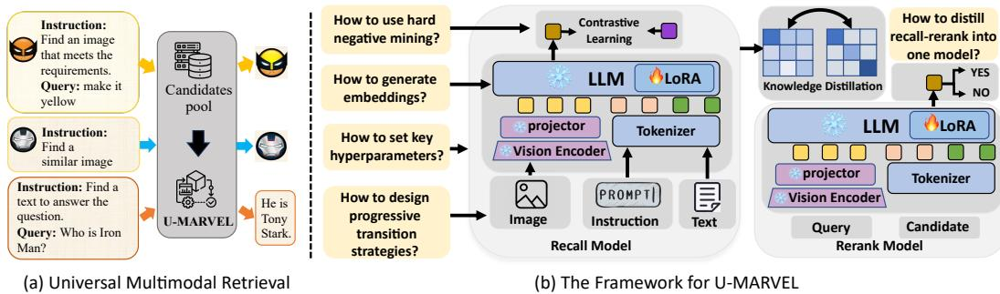
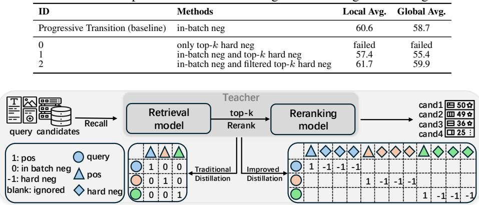

## ABSTRACT

Universal multimodal retrieval (UMR), which aims to address complex retrieval tasks where both queries and candidates span diverse modalities, has been significantly advanced by the emergence of MLLMs. While state-of-the-art MLLMbased methods in the literature predominantly adopt contrastive learning principles, they often differ in their specific training recipes. Despite their success, the mechanisms underlying their retrieval capabilities remain largely unexplored, potentially resulting in suboptimal performance and limited generalization ability. To address these issues, we present a comprehensive study aimed at uncovering the key factors that drive effective embedding learning for UMR using MLLMs. We begin by implementing a general MLLM-based embedding learning pipeline, and systematically analyze the primary contributors to high-performing universal retrieval systems. Based on this, we explore various aspects of the details in embedding generation and training strategies, including progressive transition, hard negative mining and re-ranker distillation. Notably, our findings reveal that often-overlooked factors can have a substantial impact on model performance. Building on these discoveries, we introduce a unified framework termed U-MARVEL (Universal MultimodAl RetrieVal via Embedding Learning), which outperforms state-of-the-art competitors on the M-BEIR benchmark by a large margin in supervised settings, and also exhibits strong zero-shot performance on several tasks such as composed image retrieval and textto-video retrieval. These results underscore the generalization potential of our framework across various embedding-based retrieval tasks. Code is available at https://github.com/chaxjli/U-MARVEL.

## 1 INTRODUCTION

Multimodal information retrieval (Liu et al., 2022) has emerged as a pivotal research direction at the intersection of multimodal understanding and information retrieval. It serves as a cornerstone for a wide range of modern AI applications, including retrieval-augmented generation (RAG) (Jiang et al., 2023; Cong et al., 2023), text-image retrieval (Baldrati et al., 2023; Zhang et al., 2024b), and visual question answering (VQA) (Chow et al., 2024; Chun et al., 2021). While existing methods such as CLIP (Radford et al., 2021), BLIP (Li et al., 2022; 2023a), and CoCa (Yu et al., 2022) have demonstrated impressive performance in cross-modal retrieval, they often struggle to address the diverse and complex requirements encountered in real-world scenarios, ranging from fine-grained instruction following to multi-turn interleaved interactions.

To tackle these challenges, the research community has increasingly focused on universal multimodal retrieval (UMR) (Wei et al., 2024), depicted in Fig. 1(a), which aims to develop unified, instruction-guided retrievers capable of handling diverse retrieval tasks across multiple modalities. Recent advancements in this area, such as LamRA (Liu et al., 2024b), MM-Embed (Lin et al., 2024),

  
Figure 1: U-MARVEL Exploration: We conduct a comprehensive study on effective design princi ples for embedding model architectures and optimal strategies for training embedding models.

GME (Zhang et al., 2024d), UniME (Gu et al., 2025) and VLM2VEC (Jiang et al., 2024b), have shown promising results on UMR powered by MLLMs. However, most of the existing approaches often directly adapt MLLMs to embedding tasks without systematically examining training schemes tailored for MLLM-based embedding models. Consequently, the impact of design decisions on retrieval performance remains inadequately understood, highlighting the need for a more systematic investigation—a gap that motivates our study.

In this paper, we aim to address these issues by systematically exploring the design principles for building high-performing universal multimodal retrievers with pre-trained MLLMs (Fig. 1(b)). To this end, we first implement a simple yet effective embedding learning pipeline based on contrastive learning, following the existing approaches in the literature. Subsequently, we conduct a comprehensive study to investigate three key aspects for training high-performance retrieval models built on MLLMs. Specifically, we explore: (1) how to adapt decoder-only MLLMs into instruction-guided embedding models; (2) how to train MLLM-based embedders within the context of a contrastive learning framework; and (3) how to distill the recall-then-rerank paradigm into a single model to further enhance retrieval performance. Our findings highlight several overlooked factors critical to retrieval performance, including the superiority of bidirectional attention with mean pooling over last-token mechanisms, and the interactions among parameters of batch size, learning rate, and temperature coefficient in contrastive learning. We also discover that integrating hard negative mining and knowledge distillation effectively mitigates computational inefficiencies in the recall-thenrerank pipeline, while simultaneously improving retrieval efficiency and accuracy.

Motivated by these insights, we present U-MARVEL, a unified framework for learning universal multimodal embeddings tailored to UMR tasks. Our method achieves significant improvements over state-of-the-art UMR approaches on the M-BEIR benchmark (Wei et al., 2024) in supervised settings, and also demonstrates strong zero-shot generalization abilities on tasks such as text-tovideo retrieval and composed image retrieval.

The contributions of this paper can be summarized as follows. (1) We conduct a comprehensive exploration of the design space for MLLM-based universal retrieval, uncovering key factors that improve performance and providing actionable insights for future research. The findings presented in this paper aim to advance the effectiveness of UMR tasks within the research community. (2) We introduce U-MARVEL, a unified framework that achieves state-of-the-art performance in both supervised and zero-shot settings, showcasing its effectiveness across a wide range of retrieval tasks.

## 2 RELATED WORK

Multimodal Large Language Models. Large language models (LLMs) (Achiam et al., 2023; Yang et al., 2024; Liu et al., 2024a; Touvron et al., 2023), including multimodal LLMs (Zhang et al., 2024c; Yao et al., 2024), have achieved remarkable success across a wide range of general-purpose tasks. For instance, LLaVA (Liu et al., 2023a) integrates image and text processing for tasks like visual question answering, image description, and visual reasoning. The Qwen-VL series (Wang et al., 2024a; Bai et al., 2025) enhances this by supporting flexible image resolutions and extending capabilities to video understanding through temporal modeling and localization. InternVL3 (Zhu et al., 2025) unifies multimodal and linguistic learning by leveraging both multimodal data and text corpora in a single pre-training stage.

Multimodal Retrieval. Multimodal retrieval aims to align diverse modalities (e.g., text, images, or their combinations) within a shared embedding space for semantic similarity matching. Early works (Radford et al., 2021; Li et al., 2022; Yu et al., 2022) leveraged large-scale contrastive learning to align image-text pairs, enabling zero-shot classification and cross-modal retrieval, but struggled with complex multimodal inputs. Recent advancements have addressed these limitations through innovative approaches based on MLLMs (Jiang et al., 2024a; Wei et al., 2024; Jiang et al., 2024b; Lan et al., 2025). LamRA (Liu et al., 2024b) adapts MLLMs into retrievers using lightweight LoRA modules with joint pointwise and listwise reranking; MM-Embed (Lin et al., 2024) improves alignment via MLLM fine-tuning and modality-aware hard negative mining; GME (Zhang et al., 2024d) develops a unified multimodal retrieval framework leveraging MLLMs with synthetic data augmentation; and UniME (Gu et al., 2025) combines textual knowledge distillation from LLM teachers with hard negative-enhanced instruction tuning, achieving robust cross-modal alignment for diverse retrieval tasks. While these works provide a strong foundation for UMR, the design space for MLLM-based embedding models remains underexplored. Unlike LLMs that generate outputs via autoregressive decoding, embedding models encode features of the entire input sequence, necessitating specialized strategies for feature extraction and tailored training methodologies. This work addresses these gaps through a systematic investigation of the design decisions for MLLM-based embedding models.

## 3 RECIPE FOR BUILDING U-MARVEL

In this section, we conduct a comprehensive study to identify the key factors that drive effective embedding learning for UMR through MLLMs. Following the mainstream approaches, we first establish a simple pipeline. Unless stated otherwise, we finetune the pre-trained Qwen2-VL-7B-Instruct (Wang et al., 2024a) as the embedding model with LoRA (Hu et al., 2022) by contrastive learning on M-BEIR dataset (Wei et al., 2024). Specifically, the InfoNCE loss (Oord et al., 2018) is selected as our training objective:

$$
\mathcal {L} _ {\mathrm{InfoNCE}} = - \log \frac {\exp (\mathrm{sim} (e _ {q} , e _ {c} ^ {+}) / \tau)}{\sum_ {i} \exp (\mathrm{sim} (e _ {q} , e _ {c ^ {\mathrm{i}}}) / \tau)}\tag{1}
$$

where $e _ { q } , e _ { c } ^ { + } , e _ { c }$ represent the embeddings of the query, the positive candidate, and any sample from the candidate set, respectively. τ is the temperature parameter. sim $. ( \cdot , \cdot )$ means the cosine similarity; More details are given in Appendix C. Throughout the ablation studies, we report the Average Recall as the evaluation metric, which is computed as the mean of Recall@5 or Recall@10 across the benchmark tasks (c.f. Appendix A). We then explore three major axes of design decisions in the following subsections:

• We investigate the adaptation of decoder-only MLLMs into instruction-aware embedders.

• We explore how to train embedding models within the framework of contrastive learning.

• We validate that the retrieval performance can be further enhanced through distillation from the recall-then-rerank paradigm.

## 3.1 HOW TO ADAPT MLLMS INTO EMBEDDING MODELS?

LLMs generate output tokens in an autoregressive manner, whereas embedding models encode holistic representations of input sequences, reflecting fundamental differences in their training objectives. Adapting LLMs into embedding models thus requires specialized training strategies. In this subsection, we examine this adaption from three aspects as follows.

## 3.1.1 EMBEDDING EXTRACTION

Finding 1: Generating embeddings with bidirectional attention and mean pooling outperforms the common approach of using compression prompts with the last token mechanism.

We first investigate the method for extracting embeddings of the token sequence of multimodal queries using MLLMs. Following prior approaches, the instruction is directly concatenated with the query. Existing methods can basically be divided into two categories based on the way embeddings are extracted. (1) Last token: previous works (Liu et al., 2024b; Jiang et al., 2024b; Zhang et al., 2024d; Jiang et al., 2024a; Gu et al., 2025) typically employ a prompt for compression. Generally, for multimodal input, the prompt is “<image><text>...<image><text>Summarize above image and sentence in one word: emb”, where <image> and <text> are the placeholders. In this way, the feature of last token (i.e., <emb>) is used as the output embedding of the input sequence. (2) Mean token: an alternative method, adopted by MM-Embed (Lin et al., 2024), transforms the unidirectional attention mechanism into a bidirectional one and applies mean pooling to the features from the last hidden states to derive the embedding for the entire sequence.

Table 1: Comparison of last token and mean token mechanisms

<table><tr><td>ID</td><td>Causal or Bidirectional</td><td>Last token or Mean token</td><td>Compression Prompt (“in one word”)</td><td>Local Avg.</td><td>Global Avg.</td></tr><tr><td>0</td><td>Causal</td><td>Last token</td><td>√</td><td>56.6</td><td>54.8</td></tr><tr><td>1</td><td>Bidirectional</td><td>Last token</td><td>√</td><td>55.5</td><td>52.6</td></tr><tr><td>2</td><td>Causal</td><td>Mean token</td><td>√</td><td>33.7</td><td>27.6</td></tr><tr><td>3</td><td>Bidirectional</td><td>Mean token</td><td>√</td><td>51.7</td><td>46.1</td></tr><tr><td>4</td><td>Bidirectional</td><td>Mean token</td><td>×</td><td>57.2</td><td>55.2</td></tr></table>

We conducted detailed comparative experiments, as presented in Table 1. (1) The experimental results reveal that the effectiveness of the compression prompt exhibits dual dependency. On one hand, it establishes a strong coupling with the last token mechanism, as evidenced by ID-0 and ID-2, where replacing last token with mean token results in a significant performance drop of 22.9%/27.2%. On the other hand, causal attention enhances the impact of the compression prompt (ID-0 vs. ID-1) demonstrating a 1.1%/2.2% improvement over bidirectional attention. (2) Interestingly, bidirectional attention partially decouples the dependency between the compression prompt and the last token mechanism. For instance, ID-3 shows an 18%/18.5% improvement compared to ID-2. However, when combined with mean pooling, bidirectional attention remains constrained by the limitations of the compression prompt. (3) Furthermore, when compression prompt is removed from bidirectional attention with mean token mechanism (ID-4), it achieves a modest improvement of 0.6%/0.4% over ID-0, which is commonly used in the literature.

In conclusion, generating embeddings using bidirectional attention combined with mean pooling from the sequence demonstrates superior performance compared to the commonly employed approach of combining compression prompts with the last token mechanism. This difference may stem from the last token embedding being affected by recency bias, leading to an excessive reliance on the output of the final token. Notably, this finding aligns with the conclusions of NV-Embed (Lee et al., 2024), yet diverges from those presented in GME (Zhang et al., 2024d), offering a distinct perspective on architectural design and performance optimization.

## 3.1.2 INSTRUCTION INTEGRATION

Finding 2: Masking instruction tokens during mean pooling enhances embedding performance.

Motivated by prior studies on text embeddings (Lee et al., 2024; BehnamGhader et al., 2024), we mask out the instruction tokens during the mean pooling process, as these tokens have already influenced the output features through self-attention. Experimental results show that ID-0 achieves a 0.1%/0.3% improvement compared to ID-1 and 2.0%/12.1% improvement compared to ID-2 in Table 2. We hypothesize that this improvement arises primarily from that: the query inherently incorporates instruction information during forward propagation thought bidirectional self-attention mechanism. Therefore, by filtering out instruction tokens and focusing on feature comparisons between the query and candidate, the approach mitigates calculation bias. While the numerical improvement is modest, this step effectively eliminates theoretical instruction bias without compromising performance.

Table 2: Comparison of instruction integration

<table><tr><td>ID</td><td>Instructions</td><td>Masking</td><td>Local Avg.</td><td>Global Avg.</td></tr><tr><td>0</td><td>√</td><td>√</td><td>57.3</td><td>55.5</td></tr><tr><td>1</td><td>√</td><td>×</td><td>57.2</td><td>55.2</td></tr><tr><td>2</td><td>×</td><td>-</td><td>55.3</td><td>43.4</td></tr></table>

Table 3: Comparison of progressive transition

<table><tr><td>ID</td><td>Methods</td><td>Local Avg.</td><td>Global Avg.</td></tr><tr><td>0</td><td>Instruction Tuning on M-BEIR</td><td>56.6</td><td>53.9</td></tr><tr><td>1</td><td>[0] + text-only retrieval</td><td>57.3</td><td>55.5</td></tr><tr><td>2</td><td>[1] + text-image retrieval</td><td>57.7</td><td>55.8</td></tr></table>

## 3.1.3 PROGRESSIVE TRANSITION

Finding 3: Progressive transition effectively adapts decoder-only MLLMs to embedding models through stepwise training.

We set a baseline by vanilla instruction tuning on multimodal retrieval data from the M-BEIR dataset, presented in Table 3 under ID-0. Following prevalent approaches (Liu et al., 2024b; Jiang et al., 2024a), we use text-only retrieval data for pre-training, which improves performance on various retrieval tasks. Training on the NLI dataset (Gao et al., 2021) significantly enhances our model’s performance, as indicated by ID-1 in Table 3. Despite these improvements, a notable gap persists when transitioning from single-modality, single-instruction tasks to multimodal, multi-instruction tasks. To address this gap, we propose a progressive approach incorporating an additional pretraining step using text-image retrieval data from the CC3M dataset (Sharma et al., 2018). This step further enhances performance, as demonstrated by ID-2 in Table 3. Since LLM was originally trained with causal attention, switching to bidirectional attention degrades text-visual encoder alignment. We speculate that text-based fine-tuning strengthens the text encoder’s semantic representation, while image-text pairs further align the text-visual encoders. During experiments, we train the model with NLI using unidirectional InfoNCE, followed by CC3M using bidirectional InfoNCE. Furthermore, we further analyze the impact of training data selection in Appendix D, which reveals that the concise text in CC3M aligns better with retrieval tasks compared to other datasets (e.g., ShareGPT4V (Hurst et al., 2024) and TART (Asai et al., 2023)).

Therefore, we formally propose the progressive transition method, adopting a stepwise training strategy to adapt decoder-only MLLMs for embedding tasks. Following the principle of advancing from simpler to more complex tasks (Bengio et al., 2009), this phased approach ensures a smooth transition through three key steps: (1) Text Retrieval Adaptation: Learning retrieval tasks using text-only datasets to establish foundational capabilities. (2) Cross-modal Alignment: Advancing to cross-modal retrieval tasks through text-image paired data. (3) Instruction-tuned Multimodal Retrieval: Mastering instruction-guided multimodal retrieval tasks with comprehensive training on multimodal datasets.

## 3.2 HOW TO TRAIN MLLM-BASED EMBEDDERS BY INFONCE?

In this subsection, we investigate how MLLM-based embedding models should be trained under the contrastive learning framework, following the paradigm adopted by most existing methods. Despite its simplicity, we identify that several overlooked factors exert a critical impact on the final performance, including interactions among the training parameters of InfoNCE and the control of noise in hard negative mining during the continual training process.

## 3.2.1 INTERACTIONS AMONG LARGE BATCH SIZE, LEARNING RATE AND TEMPERATURE

Finding 4: Increasing batch size yields performance gains, but these improvements plateau without appropriate learning rate scaling. Additionally, learnable temperature parameters play a pivotal role in enhancing the effectiveness of contrastive learning.

Our experimental results dispute the widely held belief that “increasing batch size directly improves performance”, indicating that this assumption requires closer examination. By analyzing the results presented in Table 4, we identify three key findings as follows. (1) Experiments with ID-0, ID-2, and ID-4 indicate that increasing the batch size does improve model performance; however, the performance gains tend to plateau as the batch size continues to grow, as observed in comparisons between ID-5 and ID-6. (2) Consistent with prior research (Goyal et al., 2017) that highlights the necessity of scaling the learning rate (lr) alongside batch size, our contrastive learning experiments reveal similar trends. Specifically, simply increasing the batch size without adjusting the learning rate results in marginal improvements (ID-0 vs. ID-1). In contrast, applying scaling rule (ID-2) significantly boosts performance to 58.3%, which aligns with the findings from previous works. (3) Our investigation into the effects of temperature parameters reveals that employing a learnable temperature significantly enhances performance. The learnable mechanism effectively optimizes the sharpness of the probability distribution during training, superior to fixed temperature settings used in prior works such as LamRA (Liu et al., 2024b) and MM-Embed (Lin et al., 2024). Empirical results (comparing ID-4/ID-6 with ID-7/ID-8) demonstrate that this dynamic adjustment yields consistent performance gains (e.g., +1.4% in Local Avg), while also exhibiting stable and adaptive convergence across different batch sizes. More detailed ablation study on learnable temperature is provided in Appendix D.

Table 4: Comparison of performance when increasing batch size

<table><tr><td>ID</td><td>Batch Size</td><td>Temp (τ)</td><td>LR (η)</td><td>Local Avg.</td></tr><tr><td>0</td><td>480</td><td>0.05 (fixed)</td><td> $1 \times 10^{-4}$ </td><td>57.2</td></tr><tr><td>1</td><td>1920</td><td>0.05 (fixed)</td><td> $1 \times 10^{-4}$ </td><td>57.4</td></tr><tr><td>2</td><td>1920</td><td>0.05 (fixed)</td><td> $2 \times 10^{-4}$ </td><td>58.3</td></tr><tr><td>3</td><td>3840</td><td>0.05 (fixed)</td><td> $2.8 \times 10^{-4}$ </td><td>58.5</td></tr><tr><td>4</td><td>3840</td><td>0.05 (fixed)</td><td> $4 \times 10^{-4}$ </td><td>58.9</td></tr><tr><td>5</td><td>5760</td><td>0.05 (fixed)</td><td> $6 \times 10^{-4}$ </td><td>58.7</td></tr><tr><td>6</td><td>7680</td><td>0.05 (fixed)</td><td> $6 \times 10^{-4}$ </td><td>58.9</td></tr><tr><td>7</td><td>3840</td><td>0.05 (learnable)</td><td> $4 \times 10^{-4}$ </td><td>60.1</td></tr><tr><td>8</td><td>7680</td><td>0.05 (learnable)</td><td> $4 \times 10^{-4}$ </td><td>60.3</td></tr></table>

## 3.2.2 CONTINUAL TRAINING WITH HARD NEGATIVE MINING

Finding 5: Hard negatives may hinder convergence during training. Filtering false negatives and mixing random in-batch negatives help balance difficulty and improve performance.

The initial random negative sampling yields basic discriminative ability but struggles with challenging false positives: negatives that exhibit high semantic similarity yet are incorrect matches. Recent studies have employed hard negative mining (Lin et al., 2024; Lan et al., 2025) or hard negative reweighting in loss computation (Hou & Li, 2023; Radenovic et al., 2023; Zhuang et al., 2024) to address this issue. In this work, we explore related settings. However, as shown in Table 5 for ID-0, directly selecting the top-k hard negatives proved to be excessively challenging, resulting in complete failure. Simply setting k to a larger value (e.g., 50) prevents model collapse but fails to yield any performance improvement. Additionally, incorporating in-batch negatives results in a performance decline compared to the baseline in this table, as observed by ID-1. We hypothesize that some hard negatives are false negatives, which can adversely affect model training. Specifically, naively maximizing the loss on all hard negatives often leads to model collapse because the model is forced to push away semantically valid candidates that are labeled as negatives due to dataset noise. To address this issue, we propose a straightforward filtering method that eliminates hard negatives with scores exceeding a predefined threshold. This approach led to a significant improvement, as demonstrated by ID-2.

We apply a hard negative mining strategy as follows: (1) Feature Extraction: Using the model from the previous training stage, we extract features for all queries and candidates, compute similarity scores (excluding positive matches), and rank candidates to identify the most challenging negatives per query; (2) Filtered Hard Negative: For each query, we filter out negative samples that exceed a predefined threshold (considered as false negatives) and then select the top-k negative samples as hard negatives; (3) Balanced Training: To prevent model convergence difficulties from excessive hard negatives and to accelerate training, we select a suitable k-value and mix these hard negatives with other in-batch negatives. We then perform continual finetuning by InfoNCE. In our experiments, we set k = 5 and the threshold to 0.7, filtering out any negative samples with scores exceeding this limit. The choice of k = 5 for hard negative mining strikes a balance between training efficiency and sample quality.

Table 5: Comparison of different strategies in hard negative mining  
  
Figure 2: Distillation Illustration. It shows how the teacher model generates scores, and compares the traditional and improved distillation methods.

## 3.3 WILL RERANKER DISTILLATION IMPROVE PERFORMANCE?

Finding 6: The improved distillation approach reduces computational overhead while increasing feature diversity, thereby enabling resource-efficient and effective distillation.

Some studies (Liu et al., 2024b; Lin et al., 2024) further refine retrieval results by applying a reranking step on top of the recall model. The reranker can be either a trained model (Liu et al., 2024b) or a zero-shot reranker (Lin et al., 2024) based on MLLMs. While this recall-then-rerank strategy often improves retrieval performance, it introduces additional inference latency and increases system complexity. In this work, we exploit to distill this cascaded pipeline into a single unified model, thereby simplifying the system while maintaining high performance.

Inspired by (Liu et al., 2024b), we train a generative reranker based on the decoder-only MLLM architecture. The training data is prepared by: (1) extracting embeddings for all queries and candidates via the recall model from Sec. 3.2.2, then (2) constructing pairs for each query consisting of a positive match and the top-50 most challenging negatives. The model is prompted to output “YES” for positives and “NO” for negatives, optimized with next-token prediction loss to maximize the likelihood of correct response. More detailed specifics can be found in Appendix C.

After training the reranker, we employ it to refine the ranking results from the recall model, further improving the retrieval performance. Specifically, the recall model from Sec. 3.2.2 first retrieves the top-k candidates, then each (query, candidate) pair is processed by the reranker sequentially. The reranker is prompted to judge each candidate with a “YES” or “NO” response, where the probability of “YES” serves as the reranker’s score. To further enhance overall performance, we combine the scores from both models through linear interpolation: $S _ { m u l t i } = \alpha \cdot \bar { S _ { \mathrm { { r e c a l l } } } } + ( 1 - \alpha ) \cdot S _ { \mathrm { { r e r a n k } } }$ , where $s _ { m u l t i }$ becomes the final relevance score, and α is a weight hyperparameter (fixed at 0.5). This completes our recall-then-rerank pipeline, producing optimized query-candidate matching scores.

We distill this entire pipeline as a teacher model into a single student model, shown in Figure 2, where the combined knowledge is compressed into one unified model by using KL divergence defined as Eq. 2.

$$
\mathcal {L} _ {\mathrm{distill}} = D _ {K L} (S _ {m u l t i} \parallel S _ {s i n g l e}) = \sum_ {i} S _ {m u l t i} (i) \log \frac {S _ {m u l t i} (i)}{S _ {s i n g l e} (i)}\tag{2}
$$

where $S _ { m u l t i }$ represents the multi-model ensemble scores and $S _ { s i n g l e }$ the single model’s predictions. The scores are softmax-normalized before computing the KL divergence. In traditional distillation frameworks, the base model typically aligns with the reranker. Distillation samples are structured as (query, pos), with similarity matrices incorporating in-batch negatives. However, recall-thenrerank inference over this similarity score matrix incurs prohibitive computational costs, making it impractical for deployment.

We propose an improved distillation method to address this limitation. Specifically, we construct samples in the form of (query, positive, top-k hard negatives), and confine distillation to the scope of positive and hard negative samples. In this way, it significantly reduces computational overhead while substantially increasing the diversity of features encountered during model training. Thus, it achieves both resource efficiency and performance gains—critically, it makes distillation practically feasible. Furthermore, besides the data and base model, a key factor contributing to the effectiveness of this distillation method lies in its tight alignment with the recall-then-rerank inference pipeline, depicted in Figure 2: (1) Retrieving with a hard negative model; (2) Reranking the top-k results and generating integrated scores. Our distillation method mirrors this workflow: it adopts the hard negative model as the base and distills top-k scores from the integrated model.

To further validate its efficiency and effectiveness, we provide the following mathematical analysis. Let n denote the number of queries in a batch, and N the total number of queries. In traditional distillation, the computational complexity of inferring the similarity matrix is $\begin{array} { r } { \frac { \ d N } { \ d n } \times ( 2 n + n ^ { 2 } ) \ d n = } \end{array}$ $N ( 2 + n )$ , and the number of features observed per training epoch is 2N. The total time for inference and training is $( 6 + n ) N$ . In our improved method, the cost of computing the similarity matrix is reduced to $\overset { \vartriangle } { \boldsymbol { \frac { N } { n } } } \times ( n ( \boldsymbol { k } + 3 ) ) = N ( \bar { \boldsymbol { k } } + 3 )$ , and the number of features observed during training increases to $( k + \dot { 2 } ) \dot { N }$ . The total time is reduced to $( 3 k + 7 ) N$ . Substituting our actual parameters, $n = 6 0 \times 6 4$ and $k = 5 0$ , the improved method reduces the total time to $\overline { { { \frac { 3 \times 5 0 + 7 } { 6 + 6 0 \times 6 4 } } } } = \dot { 4 } . 1 \%$ of the original, while the number of features seen during training increases by 26.0×. In terms of actual training time, improved distillation completes in just 14 hours, compared to a theoretical cost of over 340 hours for the traditional method. This substantial efficiency gain makes MLLM distillation practically feasible, transforming it from an intractable task to a manageable one. More detailed information can be found in Appendix E and Table 14.

Table 6: Comparison of distillation from rerankers

<table><tr><td>Methods</td><td>Local Avg.</td><td>Global Avg.</td></tr><tr><td>Hard Negative Mining (baseline)</td><td>61.7</td><td>59.9</td></tr><tr><td>Recall-Reranker</td><td>64.5</td><td>61.7</td></tr><tr><td>Distillation</td><td>63.2</td><td>60.7</td></tr><tr><td>Continue-hard</td><td>62.2</td><td>60.0</td></tr></table>

As shown in Table 6, the “Recall-Reranker” represents the model we aim to distill, and the “Distillation” method achieves an improvement of 1.5%/0.8% over the baseline. However, distillation data are generated from the top-k retrieval results from baseline model and correspond to hard negative samples for it. We designed experiment “Continue-hard” for validation. Unlike the “Distillation” stage, the “Continue-hard” model continues training by treating the training data as hard negatives. The “Continue-hard” method demonstrates an improvement of 0.5%/0.1% over the baseline; however, it exhibits a decline of 1.0%/0.7% when compared to the “Distillation” approach. It validates that the performance improvement is clearly attributable to the distillation process. Notably, contrary to the instability observed in Section 3.2.2 with the “only top-k hard negatives” setting, the “Continue-hard” strategy $( k = 5 0 )$ employed here remains stable and achieves slight gains. This stability is primarily attributed to the strong initialization: starting from a converged Recall model provides robust feature representations that are more resilient to hard negatives. Additionally, the larger k value helps mitigate the noise introduced by false negatives.

## 3.4 U-MARVEL FRAMEWORK

Motivated by the findings presented above, we introduce a unified framework, term U-MARVEL (Universal MultimodAl RetrieVal via Embedding Learning), which consists of the following three stages: (1) Progressive transition: the model is progressively fine-tuned on the increasing complexity levels of the retrieval data, which enables the model to gradually adapt to retrieval tasks. (2) Hard Negative Mining and Fusion Reranker Model: building on Progressive transition, we first train a hard negative model for recall and a reranker model for ranking, and then linearly combine them to obtain a recall–reranker model. (3) Distillation: we perform improved knowledge distillation on the recall–reranker model. Detailed experimental settings and results for U-MARVEL are provided in Table 12 in Appendix C and Table 15 in Appendix D, respectively. Additionally, to demonstrate the generalization ability of our framework across different model sizes, we also provide results using the Qwen3-VL-4B-Instruct (Team, 2025) backbone in Table 16 and Appendix D.

## 4 COMPARISONS WITH STATE-OF-THE-ART METHODS

In this section, we compare U-MARVEL with state-of-the-art methods in both supervised and unsupervised settings.

## 4.1 M-BEIR EVALUATION

We first compare U-MARVEL with competitors on M-BEIR benchmark (Wei et al., 2024) in both local and global pool settings, details of this dataset can be found in Appendix A. For fair comparison, we also present results of the recall-then-rerank cascade pipeline, denoted as U-MARVEL+, similar to that used in LamRA (Liu et al., 2024b), details seen in Appendix C. As shown in Table 7 and 17, U-MARVEL establishes a new state-of-the-art. Beyond the raw metrics, three key observations highlight the efficacy of our design: 1) Efficiency-performance trade-off: In the single-model setting, U-MARVEL significantly outperforms existing state-of-the-art approaches by a large margin. Furthermore, while comparisons with stronger baselines like LamRA (Liu et al., 2024b) typically involve a computationally expensive two-stage retrieval process, U-MARVEL achieves comparable performance using only single-stage inference. This dual advantage of superior accuracy and efficiency is directly attributable to our improved distillation strategy (Sec. 3.3), which successfully transfers the discriminative power of the reranker into the embedding space. 2) Robustness across settings: As detailed in Table 17 and Appendix D, our method maintains its superiority even in the more challenging “Global Pool” setting, where candidates from all tasks are mixed. It suggests that our method helps the model learn more robust, task-agnostic features rather than overfitting to specific task distributions. 3) Contribution of Components: The ablation study in Table 15 (Appendix C) further reveals that our model already surpasses existing state-of-the-art methods in the single-model setting upon the completion of “Progressive Transition”. Subsequently, “Hard Negative Mining” provides an additional boost in discrimination, while the “Distillation” stage is critical for closing the gap with reranking models.

Table 7: Comparisons with SoTA approaches on M-BEIR benchmark in local pool setting.

<table><tr><td rowspan="2">Methods</td><td colspan="3"> $q^t \to c^i$ </td><td colspan="2"> $q^t \to c^t$ </td><td colspan="2"> $q^t \to (c^i, c^t)$ </td><td colspan="3"> $q^i \to c^t$ </td><td colspan="2"> $q^i \to c^i$ </td><td colspan="2"> $(q^i, q^t) \to c^i$ </td><td colspan="2"> $(q^i, q^t) \to c^t$  Avg.</td></tr><tr><td>VN R@5</td><td>CO R@5</td><td>F200 R@10</td><td>WQ R@5</td><td>ES R@5</td><td>WQ R@5</td><td>VN R@5</td><td>CO R@5</td><td>F200 R@10</td><td>NS R@5</td><td>ON R@5</td><td>InS R@5</td><td>FQ R@10</td><td>CR R@5</td><td>ON R@5</td><td>InS R@5</td></tr><tr><td colspan="17">Single model</td></tr><tr><td>CLIP-L (Radford et al., 2021)</td><td>43.3</td><td>61.1</td><td>6.6</td><td>36.2</td><td>43.3</td><td>45.1</td><td>41.3</td><td>79</td><td>7.7</td><td>26.1</td><td>24.2</td><td>20.5</td><td>7</td><td>13.2</td><td>38.8</td><td>26.4</td></tr><tr><td>SigLIP (Zhai et al., 2023)</td><td>30.1</td><td>75.7</td><td>36.5</td><td>39.8</td><td>27</td><td>43.5</td><td>30.8</td><td>88.2</td><td>34.2</td><td>28.9</td><td>29.7</td><td>25.1</td><td>14.4</td><td>22.7</td><td>41.7</td><td>27.4</td></tr><tr><td>UniIR-BLIP (Wei et al., 2024)</td><td>23.4</td><td>79.7</td><td>26.1</td><td>80</td><td>50.9</td><td>79.8</td><td>22.8</td><td>89.9</td><td>28.9</td><td>33</td><td>41</td><td>22.4</td><td>29.2</td><td>52.2</td><td>55.8</td><td>33</td></tr><tr><td>UniIR-CLIP (Wei et al., 2024)</td><td>42.6</td><td>81.1</td><td>18</td><td>84.7</td><td>59.4</td><td>78.7</td><td>43.1</td><td>92.3</td><td>18.3</td><td>32</td><td>45.5</td><td>27.9</td><td>24.4</td><td>44.6</td><td>67.6</td><td>48.9</td></tr><tr><td>LamRA-Ret (Liu et al., 2024b)</td><td>41.6</td><td>81.5</td><td>28.7</td><td>86</td><td>62.6</td><td>81.2</td><td>39.6</td><td>90.6</td><td>30.4</td><td>32.1</td><td>54.1</td><td>52.1</td><td>33.2</td><td>53.1</td><td>76.2</td><td>63.3</td></tr><tr><td>U-MARVEL</td><td>47.3</td><td>84.4</td><td>33.6</td><td>97.1</td><td>78.8</td><td>88.5</td><td>47.3</td><td>93.5</td><td>35.1</td><td>34.2</td><td>62.5</td><td>58.3</td><td>36.4</td><td>60.7</td><td>79.4</td><td>74.7</td></tr><tr><td colspan="17">+Reranker</td></tr><tr><td>LamRA (Liu et al., 2024b)</td><td>48</td><td>85.2</td><td>32.9</td><td>96.7</td><td>75.8</td><td>87.7</td><td>48.6</td><td>92.3</td><td>36.1</td><td>33.5</td><td>59.2</td><td>64.1</td><td>37.8</td><td>63.3</td><td>79.2</td><td>78.3</td></tr><tr><td>U-MARVEL $^+$ </td><td>49.4</td><td>85.6</td><td>34.2</td><td>98.5</td><td>81.4</td><td>89.4</td><td>50.5</td><td>88.4</td><td>37.7</td><td>34.7</td><td>63.7</td><td>62.9</td><td>38.2</td><td>63.2</td><td>80.8</td><td>78.9</td></tr></table>

## 4.2 ZERO-SHOT EVALUATION

We evaluate the performance of U-MARVEL with several unseen datasets in a zero-shot manner. Details regarding the datasets and evaluation metrics are provided in Appendix B. As presented in Table 8, U-MARVEL achieves state-of-the-art performance on 9 out of 12 tasks, highlighting its exceptional zero-shot capabilities compared to leading methods such as VLM2Vec (Jiang et al., 2024b), UniME (Gu et al., 2025), and LamRA (Liu et al., 2024b). This verifies that our model effectively transfers knowledge from the diverse M-BEIR tasks to unseen domains, likely due to the high diversity of the progressive training curriculum that prevents catastrophic forgetting of the pretrained knowledge. Furthermore, we evaluate U-MARVEL on the zero-shot text-to-video retrieval task. The results on the MSVD and MSR-VTT datasets, summarized in Table 9, demonstrate that U-MARVEL outperforms VLM2Vec (Jiang et al., 2024b), LamRA (Liu et al., 2024b), and LLaVE-7B (Lan et al., 2025). However, it is worth noting that U-MARVEL+ exhibits degraded performance, which may be attributed to fail to model temporal contexts, such as action sequence progression.

Table 8: Comparisons with SoTA approaches on zero-shot image and text benchmarks.

<table><tr><td rowspan="2">Methods</td><td colspan="3"> $q^i \to c^t$ </td><td colspan="3"> $q^t \to c^i$ </td><td colspan="2"> $(q^i, q^t) \to c^i$ </td><td colspan="2"> $q^{dialog} \to c^i$   $(q^i \oplus q^t) \to c^i$ </td><td colspan="2">ITM</td></tr><tr><td>ST4V R@1</td><td>U-1K* R@1</td><td>Flickr R@1</td><td>ST4V R@1</td><td>U-1K* R@1</td><td>Flickr R@1</td><td>CIRCO* MAP@5</td><td>GCIS* R@1</td><td>V-Dia* R@1</td><td>M-FIQ* R@5</td><td>C-Neg Acc.</td><td>S-Cre* Acc.</td></tr><tr><td colspan="13">Single model</td></tr><tr><td>CLIP-L (Radford et al., 2021)</td><td>84</td><td>52.8</td><td>67.3</td><td>81.8</td><td>68.7</td><td>87.2</td><td>4</td><td>13.3</td><td>23.7</td><td>17.7</td><td>66.7</td><td>73</td></tr><tr><td>UniIR-CLIP $_{SF}$ (Wei et al., 2024)</td><td>85.8</td><td>75</td><td>78.7</td><td>84.1</td><td>78.4</td><td>94.2</td><td>12.5</td><td>16.8</td><td>26.8</td><td>39.4</td><td>79.9</td><td>80.3</td></tr><tr><td>E5-V (Jiang et al., 2024a)</td><td>86.7</td><td>84</td><td>79.5</td><td>84</td><td>82.4</td><td>88.2</td><td>24.8</td><td>18.5</td><td>54.6</td><td>19.2</td><td>83.2</td><td>84.7</td></tr><tr><td>MagicLens-L (Zhang et al., 2024b)</td><td>85.5</td><td>59.3</td><td>72.5</td><td>60.9</td><td>24.2</td><td>84.6</td><td>29.6</td><td>16.3</td><td>28</td><td>22.6</td><td>62.7</td><td>75.9</td></tr><tr><td>VLM2Vec (Jiang et al., 2024b)</td><td>90.7</td><td>90.8</td><td>76</td><td>85.8</td><td>84.7</td><td>90.6</td><td>-</td><td>-</td><td>-</td><td>-</td><td>-</td><td>79.5</td></tr><tr><td>UniME (Gu et al., 2025)</td><td>97.2</td><td>95.9</td><td>81.9</td><td>93.9</td><td>95.2</td><td>93.4</td><td>-</td><td>-</td><td>-</td><td>-</td><td>-</td><td>85</td></tr><tr><td>LamRA-Ret (Liu et al., 2024b)</td><td>93.3</td><td>95.1</td><td>82.8</td><td>88.1</td><td>94.3</td><td>92.7</td><td>33.2</td><td>18.9</td><td>62.8</td><td>60.9</td><td>79.6</td><td>85.8</td></tr><tr><td>U-MARVEL</td><td>96.4</td><td>96.7</td><td>85.4</td><td>97.2</td><td>93.5</td><td>93.3</td><td>36.2</td><td>19.1</td><td>70.3</td><td>65.7</td><td>84.5</td><td>87.9</td></tr><tr><td colspan="13">+Reranker</td></tr><tr><td>LamRA (Liu et al., 2024b)</td><td>97.9</td><td>98.8</td><td>88.1</td><td>96.5</td><td>98</td><td>97.6</td><td>42.8</td><td>24.8</td><td>70.9</td><td>63.9</td><td>85.9</td><td>93.5</td></tr><tr><td>U-MARVEL $^+$ </td><td>97.8</td><td>97.7</td><td>88.5</td><td>98.9</td><td>98.2</td><td>95.1</td><td>46.0</td><td>22.6</td><td>77.6</td><td>66.3</td><td>86.1</td><td>93.4</td></tr></table>

Table 9: Comparisons with SoTA approaches on zero-shot text-to-video retrieval benchmarks.

<table><tr><td rowspan="2">Model</td><td colspan="3">MSR-VTT</td><td colspan="3">MSVD</td></tr><tr><td>R@1</td><td>R@5</td><td>R@10</td><td>R@1</td><td>R@5</td><td>R@10</td></tr><tr><td colspan="7">Zero-shot (finetuned with text-video data)</td></tr><tr><td>InternVideo (Wang et al., 2022)</td><td>40.0</td><td>65.3</td><td>74.1</td><td>43.4</td><td>69.9</td><td>79.1</td></tr><tr><td>ViCLIP (Wang et al., 2023)</td><td>42.4</td><td>-</td><td>-</td><td>49.1</td><td>-</td><td>-</td></tr><tr><td>UMT-L (Li et al., 2023b)</td><td>42.6</td><td>64.4</td><td>73.1</td><td>49.9</td><td>77.7</td><td>85.3</td></tr><tr><td>InternVideo2s2-6B (Wang et al., 2024b)</td><td>55.9</td><td>78.3</td><td>85.1</td><td>59.3</td><td>84.4</td><td>89.6</td></tr><tr><td colspan="7">Zero-shot (finetuned only with text-image data)</td></tr><tr><td>VLM2Vec (Jiang et al., 2024b)</td><td>43.5</td><td>69.3</td><td>78.9</td><td>49.5</td><td>77.5</td><td>85.7</td></tr><tr><td>LamRA (Liu et al., 2024b)</td><td>44.7</td><td>68.6</td><td>78.6</td><td>52.4</td><td>79.8</td><td>87.0</td></tr><tr><td>LLaVE-7B (Lan et al., 2025)</td><td>46.8</td><td>71.1</td><td>80.0</td><td>52.9</td><td>80.1</td><td>87.0</td></tr><tr><td>U-MARVEL</td><td>47.2</td><td>72.0</td><td>80.2</td><td>54.6</td><td>80.9</td><td>87.7</td></tr><tr><td>U-MARVEL+</td><td>47.5</td><td>69.7</td><td>78.5</td><td>53.1</td><td>79.9</td><td>87.1</td></tr></table>

## 5 CONCLUSION AND LIMITATIONS

This paper systematically explores the design principles for building high-performing universal multimodal retrievers with MLLMs. Through a comprehensive study, we identified key factors that significantly impact retrieval performance, including embedding generation strategies, progressive adaptation techniques, and training recipes such as hard negative mining and re-ranker distillation. Based on these insights, we introduce U-MARVEL, a unified framework that achieves state-of-theart performance on the M-BEIR benchmark in supervised settings and demonstrates strong zero-shot generalization across diverse tasks. The results highlight the generalization potential of U-MARVEL and its ability to address the complex requirements of real-world retrieval scenarios. We believe that our study contributes valuable knowledge to the research community and paves the way for future advancements in universal multimodal retrieval.

Despite the promising results achieved by U-MARVEL, there remain several limitations that can be improved. First, it focuses on text and image modalities, leaving the inclusion of other modalities (e.g., audio) for future work. Second, while effective in zero-shot scenarios, its integration with LLMs in retrieval-augmented generation (RAG) applications remains underexplored. Lastly, experiments were limited to 7B-sized models due to submission time constraints; future work will extend support models of various sizes, enabling flexible trade-offs between performance and cost.

## ETHICS STATEMENT

This study strictly adheres to the full requirements of the Code of Ethics outlined by the International Conference on Learning Representations (ICLR) . We have thoroughly read and adhered to this code during the research design, data handling, experimental execution, and manuscript writing phases, ensuring that the entire research process aligns with academic integrity and ethical guidelines.