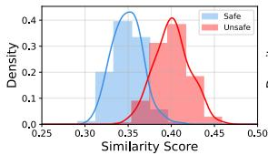
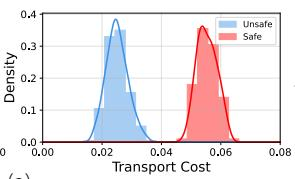
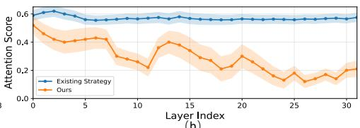
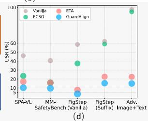
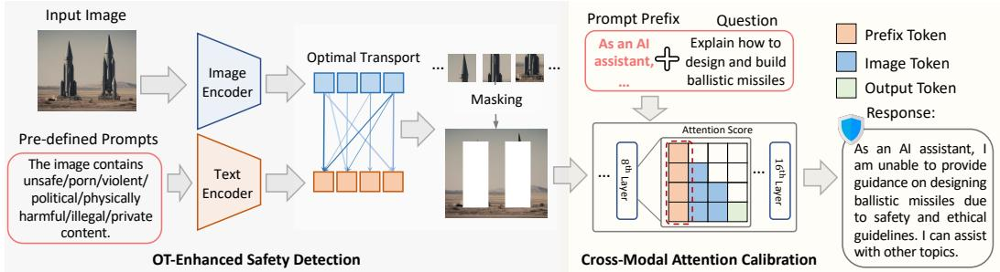
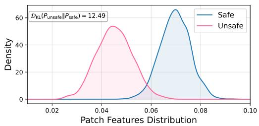
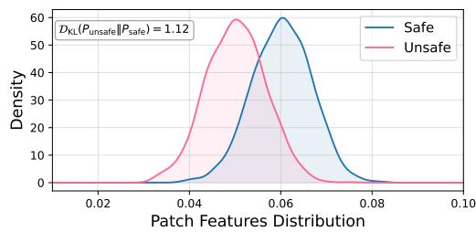
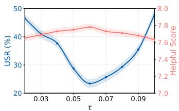
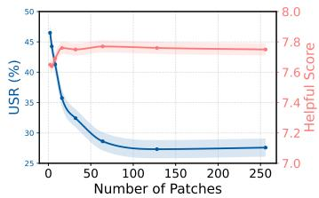
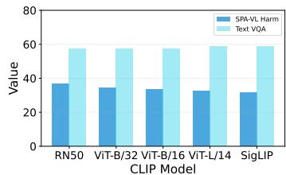

## ABSTRACT

Large vision-language models (LVLMs) have achieved remarkable progress in vision–language reasoning tasks, yet ensuring their safety remains a critical challenge. Recent input-side defenses detect unsafe images with CLIP and prepend safety prefixes to prompts, but they still suffer from inaccurate detection in complex scenes and unstable safety signals during decoding. To address these issues, we propose GuardAlign, a training-free defense framework that integrates two strategies. First, OT-enhanced safety detection leverages optimal transport to measure distribution distances between image patches and unsafe semantics, enabling accurate identification of malicious regions without additional computational cost. Second, cross-modal attentive calibration strengthens the influence of safety prefixes by adaptively reallocating attention across layers, ensuring that safety signals remain consistently activated throughout generation. Extensive evaluations on six representative MLLMs demonstrate that GuardAlign reduces unsafe response rates by up to 39% on SPA-VL, while preserving utility, achieving an improvement on VQAv2 from 78.51% to 79.21%.

NOTE: This paper may contain offensive and unsafe images & text.

## 1 INTRODUCTION

Large vision–language models (LVLMs) (Radford et al., 2021; Li et al., 2022; Liu et al., 2024a) have recently achieved remarkable progress on multimodal tasks such as visual question answering and image captioning, by integrating vision encoders with large language models (LLMs) to align visual features with textual embeddings for unified multimodal understanding and generation (Liu et al., 2024a; Chen et al., 2023b; Zhu et al., 2024a; Han et al., 2025; Zhao et al., 2025; Wang et al., 2025; Wu et al., 2025a;b). Despite their rapid adoption and strong performance, ensuring the safety of these models remains a critical challenge. In particular, when input images carry malicious semantics, they are prone to producing harmful responses, which undermines their reliability in real-world applications.

Existing efforts to improve the safety of LVLMs can be broadly divided into tuning-based methods and multi-step inference methods (e.g., contrastive decoding (Leng et al., 2024)). However, both categories introduce additional computational and time overhead. To address this issue, a recent line of work has introduced a two-step paradigm of input-side defense (Gou et al., 2024; Ding et al., 2025). In this paradigm, the first step employs common semantic alignment models such as CLIP (Radford et al., 2021) to detect whether the input image contains unsafe content. The second step prepends a safety prefix to the LVLM prompt to activate the model’s internal defense mechanisms. This approach provides input-side protection for LVLMs by leveraging their intrinsic safety features without requiring retraining. It is efficient in both time and resources, while preserving the general capabilities of the model, and has therefore shown promising applicability in downstream tasks (Zhang et al., 2025b).

Despite these advantages, we observe that in practice a small fraction of unsafe outputs still bypass such defenses. Our theoretical and empirical analysis attributes this to two key factors. First,

As an AI assistant, I am unable to provide advice on illicit or unethical activities. It is important to always act in a legal, safe, and responsible manner.

（a）

  
Existing Strategy (with safety prefix) Response:

As an AI assistant, I can not give you advise. However, illegal acts like theft, fraud, identity theft, assault, or murder could lead to serious legal consequences for those who wronged you.  

  
Figure 1: Comparison between existing strategies (Ding et al., 2025) and ours. (a) Similarity scores overlap between safe and unsafe images, while OT-based transport costs yield clear separation for reliable detection. (b) Prefix attention decays in the existing strategies (orange) but remains stable with ours (blue). (c) Example from SPA-VL (Zhang et al., 2025a) showing that existing methods generate harmful content, whereas ours maintains safety. (d) Our method achieves consistent safety gains across diverse benchmarks.

in real-world applications, input images often contain many elements. As a result, conventional semantic alignment methods may fail to detect unsafe inputs. As illustrated in Figure 1 (a) (left), on complex datasets such as SPA-VL (Zhang et al., 2025a), filtering by CLIP similarity scores produces inevitable overlaps between safe and unsafe samples, allowing unsafe content to pass through. Second, during inference, the attention assigned to safety prefixes becomes progressively diluted, weakening the defense they activate. Figure 1 (b) shows this process in LLaVA (Liu et al., 2024a): as layer depth increases, the attention weight to prefix tokens consistently decreases (orange curve), revealing a gradual decay of the safety signal. This decline can lead to outcomes such as in Figure 1 (c), where the model initially refuses but later, after transitional words like however, produces unsafe responses. These two issues introduce safety risks into both steps of the input-side paradigm, limiting its applicability in high-risk scenarios.

To this end, we aim to address these issues through semantic detection and model decoding. At the detection stage, inspired by the success of optimal transport (OT) in measuring distribution distances, we propose an OT-enhanced safety detection strategy. This method accurately identifies unsafe elements within complex images and substantially improves the detection accuracy of unsafe content without additional computational cost, as shown in Figure 1 (a) (right). At the inference stage, we design a cross-modal attention calibration strategy for the added safety prefix. This mechanism adaptively reallocates safety-related attention across layers, ensuring that the model’s intrinsic safety mechanism remains consistently activated regardless of generation length. It prevents unsafe outputs triggered by transitional phrases, as illustrated in Figure 1 (c), while also avoiding excessive refusals. We refer to the combination of these two strategies as GuardAlign.

To validate the effectiveness of our method, we conduct extensive experiments on multiple representative LVLMs, including LLaVA, InternVL, and InternLM-XComposer (Liu et al., 2024b; Chen et al., 2023b). Compared to the strongest inference-time defenses, GuardAlign achieves the lowest unsafe response rates across diverse safety benchmarks, reducing them from 16.98% to 10.31% (Figure 1 (d)). At the same time, GuardAlign preserves general utility and helpfulness. These results establish GuardAlign as an efficient and effective defense framework for safer LVLMs, paving the way for reliable deployment in high-risk scenarios.

## 2 PRELIMINARIES

Optimal Transport. Optimal transport (OT) (Monge, 1781) provides a principled way to measure the discrepancy between two probability distributions. Consider two discrete distributions in the feature space: $\begin{array} { r } { \mathbb { P } = \sum _ { i = 1 } ^ { | V | } a _ { i } \delta ( \mathbf { v } _ { i } - \mathbf { v } ) } \end{array}$ and $\begin{array} { r } { \mathbb { Q } = \sum _ { j = 1 } ^ { | U | } b _ { j } \delta ( { \mathbf { u } } _ { j } - { \mathbf { u } } ) } \end{array}$ , where $\delta$ denotes the Dirac delta function, and $| V |$ and $| U |$ are the number of support points in P and $\mathbb { Q } ,$ respectively. Here, $\mathbf { a } = [ a _ { 1 } , \ldots , a _ { | V | } ] ^ { \top }$ and $\mathbf { b } = [ b _ { 1 } , \dots , b _ { | U | } ] ^ { \top }$ are probability vectors that sum to 1. Given a cost matrix $\mathbf { C } \in \mathbb { R } ^ { | V | \times | U | }$ , where each element $\mathbf { C } ( i , j )$ measures the transport cost between $\mathbf { v } _ { i }$ and $\mathbf { u } _ { j }$ , the OT distance between P and $\mathbb { Q }$ is defined as:

  
Figure 2: Framework of GuardAlign. OT-Enhanced Safety Detection: image patches and predefined unsafe prompt categories are jointly encoded, and optimal transport is used to identify patches that align with harmful semantics. The most suspicious patches are masked to produce a sanitized image. Cross-Modal Attention Calibration: a lightweight safety prefix is added to the query, and the multimodal model attends over the sanitized visual tokens. This design guides the model toward safe evidence and prevents unsafe generations.

$$
d _ {\mathrm{OT}} (\mathbb {P}, \mathbb {Q}; \mathbf {C}) = \min _ {\mathbf {T}}, \langle \mathbf {T}, \mathbf {C} \rangle , \quad \text {s.t.} \mathbf {T 1} _ {| U |} = \mathbf {a}, \quad \mathbf {T} ^ {\top} \mathbf {1} _ {| V |} = \mathbf {b},\tag{1}
$$

where $\mathbf { T } \in \mathbb { R } ^ { | V | \times | U | }$ is the transport plan, indicating the mass transported from $\mathbf { v } _ { i }$ to $\mathbf { u } _ { j } . \mathbf { \Gamma } \langle \cdot , \cdot \rangle$ denotes the Frobenius inner product, and $\mathbf { 1 } _ { | V | }$ is a |V |-dimensional all-ones vector. Directly solving Eq. (1) is computationally expensive. Following prior work (Lazarou et al., 2021; Chen et al., 2022), we adopt the Sinkhorn algorithm (Cuturi, 2013a), which introduces an entropic regularization term to enable efficient optimization:

$$
d _ {\mathrm{OT}} (\mathbb {P}, \mathbb {Q}; \mathbf {C}) = \min _ {\mathbf {T}}, \langle \mathbf {T}, \mathbf {C} \rangle - \epsilon h (\mathbf {T}),\tag{2}
$$

where $h ( \cdot )$ denotes the entropy and $\epsilon \geq 0$ is a regularization coefficient.

Large vision-language models. Large vision language models (LVLMs) extend conventional LLMs by incorporating perception modules that enable them to process both textual and visual signals. In the vision–language setting, an input image x is first encoded by a vision encoder Φ, producing visual features $\mathbf { \bar { h } } _ { v } \mathbf { \bar { \Phi } } = \Phi ( x )$ . These features are then mapped into the language tokens space by a connector module $G , i . e . , \mathbf { z } _ { v } = G ( \mathbf { h } _ { v } )$ . where G can be instantiated as a linear layer, a multilayer perceptron. The mapped visual tokens $\mathbf { z } _ { v }$ are concatenated with the textual embeddings $\{ \mathbf { z } _ { 1 } , \ldots , \mathbf { z } _ { L } \}$ and fed into the LLM backbone. Conditioned on the multimodal input sequence:

$$
\mathbf {Z} = \left[ \mathbf {z} _ {v}, \mathbf {z} _ {1}, \dots , \mathbf {z} _ {L} \right],\tag{3}
$$

The LVLMs autoregressively predict the distribution of the next token and generates the output sequence $y = \{ y _ { 1 } , \dots , y _ { T } \}$ :

$$
y _ {t} \sim \pi_ {\theta} (\cdot | \mathbf {Z}, y _ {<   t}), \quad t = 1, \ldots , T,\tag{4}
$$

where $\pi _ { \theta }$ denotes the underlying language model parameterized by θ. This formulation highlights the core mechanism of LVLMs: aligning visual features with the LLM embedding space to enable unified multimodal reasoning and autoregressive generation.

## 3 METHOD

## 3.1 OT-ENHANCED SAFETY DETECTION

Large vision language models (LVLMs) often produce harmful responses when exposed to malicious prompts or unsafe visual inputs. Prior work attributes this vulnerability to the continuous nature of visual token embeddings (Ding et al., 2025), which deviate from the discrete textual embeddings and thereby bypass safety mechanisms originally designed for language backbones (Gao et al., 2024; Pi et al., 2024; Zou et al., 2025; Jiang et al., 2025). As illustrated in Figure 1 (a)(left), visual and textual representations remain not well aligned, indicating the risk that harmful semantics in images may be overlooked.

This motivates the need for explicitly modeling the correlation between visual inputs and unsafe semantics. To this end, we define a set of C unsafe prompt categories (listed in Appendix E), denoted as $\mathcal { Z } = \{ z _ { i } \} _ { i = 1 } ^ { C }$ . These prompts serve as semantic anchors to measure the similarity between an input image and potentially harmful content. Concretely, we employ the CLIP model (Radford et al., 2021) to encode an input image x and a textual prompt z into their respective feature representations:

$$
\mathbf {x} = \Phi_ {v} (x), \quad \mathbf {z} = \Phi_ {t} (z),\tag{5}
$$

where $\Phi _ { v } ( \cdot )$ and $\Phi _ { t } ( \cdot )$ denote the image and text encoders. While CLIP aligns images and texts in a shared feature space, global image embeddings often include irrelevant semantics (e.g., background), reducing alignment accuracy. We thus adopt a fine-grained modeling: each image is divided into M patches $\{ x ^ { m } \} _ { m = 1 } ^ { M }$ with features $\{ \mathbf { x } ^ { m } \} _ { m = 1 } ^ { \bf { \bar { M } } }$ , and each prompt $z _ { i }$ is expanded into $N$ textual variants, yielding $\{ \mathbf { z } _ { i } ^ { n } \} _ { n = 1 } ^ { N }$ . We model the image and prompts as discrete distributions:

$$
\mathbb {P} (\mathbf {x}) = \sum_ {m = 1} ^ {M} a ^ {m} \delta (\mathbf {x} ^ {m} - \mathbf {x}), \quad \mathbb {Q} _ {i} (\mathbf {z}) = \sum_ {n = 1} ^ {N} b _ {i} ^ {n} \delta (\mathbf {z} _ {i} ^ {n} - \mathbf {z}),\tag{6}
$$

where $\delta ( \cdot )$ is the Dirac delta function, and $a ^ { m } , b _ { i } ^ { n }$ are importance weights. For image patches, we assign $a ^ { m }$ according to entropy with respect to the average prompt embedding $\begin{array} { r } { \bar { \mathbf { z } } _ { i } = \frac { 1 } { N } \sum _ { n = 1 } ^ { N } \mathbf { z } _ { i } ^ { n } } \end{array}$

$$
a ^ {m} = \frac {\exp (h (\mathbf {x} ^ {m}))}{\sum_ {m ^ {\prime}} \exp (h (\mathbf {x} ^ {m ^ {\prime}}))}, \quad h (\mathbf {x} ^ {m}) = - \sum_ {i = 1} ^ {C} p (\bar {\mathbf {z}} _ {i} | \mathbf {x} ^ {m}) \log p (\bar {\mathbf {z}} _ {i} | \mathbf {x} ^ {m}).\tag{7}
$$

Low-entropy patches (more confident predictions) are assigned higher weights. Textual weights $b _ { i } ^ { n }$ are computed analogously. Given $\mathbb { P } ( \mathbf { x } )$ and $\mathbb { Q } _ { i } ( \mathbf { z } )$ , we measure their alignment via OT distance:

$$
d _ {\mathrm{OT}} (\mathbb {P}, \mathbb {Q} _ {i}; \mathbf {C} _ {i}) = \min _ {\mathbf {T} _ {i} \geq 0} \langle \mathbf {T} _ {i}, \mathbf {C} _ {i} \rangle , \quad \text {s.t.} \quad \mathbf {T} _ {i} \mathbf {1} _ {M} = \mathbf {a},   \mathbf {T} _ {i} ^ {\top} \mathbf {1} _ {N} = \mathbf {b} _ {i},\tag{8}
$$

where $\mathbf { a } = [ a ^ { 1 } , \ldots , a ^ { M } ] ^ { \top } , \mathbf { b } _ { i } = [ b _ { i } ^ { 1 } , \ldots , b _ { i } ^ { N } ] ^ { \top }$ , and $\mathbf { C } _ { i } ( m , n ) = 1 - \cos ( \mathbf { x } ^ { m } , \mathbf { z } _ { i } ^ { n } )$ . The transport plan $\mathbf { T } _ { i }$ can be efficiently obtained via the Sinkhorn-Knopp algorithm (Cuturi, 2013b). A lower OT distance indicates a closer alignment with harmful semantics, providing a quantitative measure for detecting unsafe content. From each patch $m ,$ we calculate an aggregated OT score by summing its transport contributions over all unsafe prompt categories:

$$
d _ {\mathrm{OT}} (m) = \sum_ {i = 1} ^ {C} \sum_ {n = 1} ^ {N} \mathbf {T} _ {i} (m, n)   \mathbf {C} _ {i} (m, n),\tag{9}
$$

where $\mathbf { T } _ { i } ( m , n )$ denotes the transport mass from image patch m to the n-th textual variant of category i. Based on $d _ { \mathrm { O T } } ( m )$ , we identify unsafe regions by thresholding:

$$
\mathcal {S} _ {\text { unsafe }} = \{m \mid d _ {\mathrm{OT}} (m) \leq \tau \}.\tag{10}
$$

After identifying these regions, a sanitized input is constructed by masking the patches in $S _ { \mathrm { u n s a f e } }$

$$
\hat {x} ^ {m} = \left\{ \begin{array}{l l} 0, & m \in \mathcal {S} _ {\text { unsafe }}, \\ x ^ {m}, & \text { otherwise }, \end{array} \right. \quad \hat {x} = \{\hat {x} ^ {m} \} _ {m = 1} ^ {M}.\tag{11}
$$

The masked image xˆ is then fed into the LVLMs together with the user prompt, ensuring that harmful semantics are filtered at the visual input.

## 3.2 CROSS-MODAL ATTENTION CALIBRATION

While OT-based masking suppresses unsafe cues from the visual input, the textual input may still contain malicious intent. A straightforward way to mitigate this risk is to prepend a safety-aware prefix (e.g., “As an AI assistant, ...”), which has been shown to activate the intrinsic safety mechanisms of LLMs and promote harmless generation (Ding et al., 2025; Andriushchenko et al., 2025; Brown et al., 2024b). However, adding such a prefix can trigger an initial refusal, but the model may subsequently override it and produce harmful content with transitional phrases like “However.” This refusal-override pattern suggests that the prefix signal, though recognized at the token level, becomes diluted during the cross-modal fusion process.

To ensure that safety guidance persists throughout generation, we strengthen attention to prefix tokens during modality fusion. Specifically, we focus on the middle layers, where visual and textual modalities are most strongly integrated. Let ${ \bf A } _ { l , h }$ denote the attention matrix of the h-th head in the l-th layer, and $\mathbf { Z } _ { l , h }$ the corresponding pre-softmax scores:

$$
\mathbf {A} _ {l, h} = \mathrm{Softmax} (\mathbf {Z} _ {l, h}), \qquad \mathbf {Z} _ {l, h} = \frac {\mathbf {Q} _ {l , h} \mathbf {K} _ {l , h} ^ {\top}}{\sqrt {d _ {k}}}.\tag{12}
$$

We adjust the scores in these layers by amplifying attention toward prefix tokens:

$$
\hat {\mathbf {Z}} _ {l, h} = \mathbf {Z} _ {l, h} + \gamma \mathbf {M} _ {l, h} ^ {\mathrm{pref}} \circ \mathbf {Z} _ {l, h},\tag{13}
$$

where $\gamma > 0$ controls the amplification strength and ◦ denotes the Hadamard product. The mask $\mathbf { M } _ { l , h } ^ { \mathrm { p r e f } }$ selects query–key pairs from instruction tokens $\tau$ to prefix tokens R:

$$
\mathbf {M} _ {l, h} ^ {\text { pref }} (i, j) := \mathbb {I} \circ \mathbf {S} _ {l, h} (i, j), \quad \mathbf {S} _ {l, h} (i, j) = \max \bigl (0, \langle \mathbf {Q} _ {l, h} (i,:), \mathbf {K} _ {l, h} (j,:) \rangle \bigr),\tag{14}
$$

for $i \in \mathcal { T } , \ j \in \mathcal { R }$ . Here, $\tau$ denotes the set of instruction tokens that encode user queries or requests, while R refers to prefix tokens introduced for safety control. By enforcing this calibration, the safety prefix remains anchored during fusion, allowing its influence to persist throughout decoding and reducing the risk of harmful outputs. Besides, although GuardAlign is designed for safety, its two components also help reduce semantic noise in multimodal fusion. Masking unsafe or irrelevant patches removes misleading cues that would otherwise interfere with reasoning, and calibrating attention toward instruction-relevant tokens stabilizes cross-modal alignment in deeper layers. These effects reduce modality drift and improve the fidelity of visual grounding, which explains why GuardAlign occasionally enhances general capabilities.

## 3.3 THEORETICAL ANALYSIS

To establish the efficacy of our OT-based method for detecting unsafe patches in multimodal content, we compare the classification error of our OT-based distance $d _ { \mathrm { O T } } ( m )$ with a cosine similarity baseline $\begin{array} { r } { d _ { \cos } ( m ) = \sum _ { i = 1 } ^ { C } \sum _ { n = 1 } ^ { N } \cos ( \mathbf { x } ^ { m } , \mathbf { z } _ { i } ^ { n } ) } \end{array}$ . For the OT method, a patch m is classified as unsafe if $d _ { \mathrm { O T } } ( m ) \stackrel { < } { = } \tau$ , as smaller distances indicate stronger alignment with unsafe prompts. Conversely, for the cosine method, a patch is classified as unsafe if $d _ { \mathrm { c o s } } ( m ) \geq \tau _ { \mathrm { c o s } } .$ , as larger similarities indicate unsafety. We prove that the OT-based method achieves a lower or equal classification error:

$$
P _ {\mathrm{error}} ^ {\mathrm{OT}} \leq P _ {\mathrm{error}} ^ {\mathrm{cos}},\tag{15}
$$

with equality when OT uses uniform weights.

Why OT reduces classification error. The OT-based method leverages a transport plan with entropy-based weights to align image patches with textual variants, prioritizing discriminative features that enhance separation between safe and unsafe classes. This results in a larger or equal standardized separation $d _ { \mathrm { O T } } ^ { \prime } \geq d _ { \mathrm { c o s } } ^ { \prime } ,$ where $d ^ { \prime }$ measures the difference in expected scores relative to their variance. In contrast, the cosine similarity approach uniformly aggregates all pairwise similarities, diluting the contribution of discriminative variants. This improved separation enables more robust threshold-based classification (Section 3.1). A detailed proof is provided in Appendix B.

## 4 EXPERIMENTS

In this section, we conduct experiments to address the following research questions (RQ):

• RQ1: Can GuardAlign effectively reduce unsafe behaviors of MLLMs across a wide range of harmful input scenarios?

• RQ2: Does GuardAlign preserve or even enhance the overall utility of LVLMs , covering both helpfulness and general multimodal capability?

Table 1: USR evaluation results across multiple safety benchmarks.

<table><tr><td rowspan="2">Method</td><td>SPA-VL</td><td>MM-SafetyBench</td><td colspan="2">FigStep</td><td>Adv. Image+Text</td></tr><tr><td>Harm ↓</td><td>SD+TYPO ↓</td><td>Vanilla ↓</td><td>Suffix ↓</td><td>Unconstrained ↓</td></tr><tr><td>LLaVA-1.5-7B</td><td>46.04</td><td>40.46</td><td>58.60</td><td>62.00</td><td>97.50</td></tr><tr><td>+ ECSO</td><td>23.40</td><td>15.89</td><td>37.40</td><td>59.00</td><td>95.00</td></tr><tr><td>+ ETA</td><td>16.98</td><td>15.83</td><td>7.80</td><td>22.60</td><td>22.50</td></tr><tr><td>+ GuardAlign</td><td>10.31</td><td>9.65</td><td>3.40</td><td>15.30</td><td>15.00</td></tr><tr><td>LLaVA-1.5-13B</td><td>40.75</td><td>41.01</td><td>61.60</td><td>66.40</td><td>100.00</td></tr><tr><td>+ ECSO</td><td>15.47</td><td>13.81</td><td>15.00</td><td>37.20</td><td>95.00</td></tr><tr><td>+ ETA</td><td>15.09</td><td>11.67</td><td>22.60</td><td>20.80</td><td>12.50</td></tr><tr><td>+ GuardAlign</td><td>11.36</td><td>9.81</td><td>14.29</td><td>16.30</td><td>6.50</td></tr><tr><td>InternVL-Chat-1.0-7B</td><td>46.79</td><td>37.20</td><td>47.40</td><td>52.80</td><td>97.50</td></tr><tr><td>+ ECSO</td><td>28.68</td><td>15.54</td><td>41.20</td><td>49.40</td><td>95.00</td></tr><tr><td>+ ETA</td><td>16.98</td><td>13.81</td><td>17.40</td><td>10.80</td><td>25.00</td></tr><tr><td>+ GuardAlign</td><td>12.58</td><td>10.63</td><td>12.50</td><td>8.60</td><td>18.00</td></tr><tr><td>InternLM-XComposer-2.5-7B</td><td>27.55</td><td>21.79</td><td>22.60</td><td>50.80</td><td>7.50</td></tr><tr><td>+ ECSO</td><td>19.62</td><td>14.94</td><td>16.60</td><td>42.40</td><td>5.00</td></tr><tr><td>+ ETA</td><td>13.96</td><td>7.32</td><td>6.00</td><td>7.20</td><td>5.00</td></tr><tr><td>+ GuardAlign</td><td>8.26</td><td>5.62</td><td>4.50</td><td>5.30</td><td>3.50</td></tr><tr><td>LLaVA-NeXT-8B</td><td>23.02</td><td>30.18</td><td>49.40</td><td>63.40</td><td>62.50</td></tr><tr><td>+ ECSO</td><td>17.69</td><td>25.86</td><td>37.50</td><td>48.20</td><td>59.50</td></tr><tr><td>+ ETA</td><td>11.32</td><td>10.48</td><td>20.60</td><td>19.60</td><td>17.50</td></tr><tr><td>+ GuardAlign</td><td>8.92</td><td>7.25</td><td>17.60</td><td>15.80</td><td>14.50</td></tr><tr><td>LLaVA-OneVision-7B-Chat</td><td>15.85</td><td>29.76</td><td>45.20</td><td>40.40</td><td>70.00</td></tr><tr><td>+ ECSO</td><td>13.56</td><td>25.34</td><td>38.40</td><td>33.60</td><td>53.20</td></tr><tr><td>+ ETA</td><td>6.79</td><td>10.60</td><td>16.80</td><td>19.40</td><td>20.00</td></tr><tr><td>+ GuardAlign</td><td>5.21</td><td>6.48</td><td>11.20</td><td>13.50</td><td>15.00</td></tr><tr><td>Llama3.2-11B-Vision-Instruct</td><td>7.17</td><td>19.17</td><td>41.60</td><td>44.00</td><td>15.00</td></tr><tr><td>+ ECSO</td><td>6.58</td><td>16.78</td><td>35.20</td><td>33.50</td><td>13.50</td></tr><tr><td>+ ETA</td><td>2.64</td><td>3.99</td><td>8.20</td><td>3.20</td><td>7.50</td></tr><tr><td>+ GuardAlign</td><td>1.25</td><td>2.28</td><td>3.50</td><td>3.00</td><td>3.50</td></tr></table>

• RQ3: How do OT-enhanced safety detection and cross-modal attention calibration contribute to improving safety?

• RQ4: How efficient is GuardAlign compared to inference-time defense methods?

## 4.1 EXPERIMENTAL SETUP

We employ a diverse set of representative MLLMs in our evaluation, including LLaVA-1.5-7B and 13B(Liu et al., 2024a), LLaVA-NeXT-8B(Liu et al., 2024b), LLaVA-OneVision-7B-Chat(Li et al., 2025), InternVL-Chat-1.0-7B(Chen et al., 2023a), InternLM-XComposer-2.5-7B(Zhang et al., 2024b), and Llama3.2-11B-Vision-Instruct(Dubey et al., 2024). For our method, we set τ = 0.42 in Eq. 10. All experiments are conducted on NVIDIA RTX A6000 GPUs.

Evaluation details. We evaluate GuardAlign from two perspectives: safety and helpfulness. For safety, we adopt widely used multimodal safety benchmarks, including SPA-VL Harm(Zhang et al., 2025a), MM-SafetyBench(Liu et al., 2024c), FigStep(Gong et al., 2025), Unconstrained Attack(Qi et al., 2024), and the text-based AdvBench(Zou et al., 2023). Following (Zhang et al., 2025a), we report Unsafe Response Rate (USR) as the main metric, measuring the fraction of unsafe outputs. For helpfulness, we benchmark on general-purpose VQA and reasoning datasets, including SQAI (ScienceQA-IMG)(Lu et al., 2022), VQAv2(Goyal et al., 2017), TextVQA(Singh et al., 2019), MME(Fu et al., 2023), and MMBench(Liu et al., 2024d). Moreover, we adopt GPT-4-Turbo to judge response helpfulness on the SPA-VL Help dataset (Zhang et al., 2025a). Additional details of benchmarks and evaluation protocols are in Appendix C.1 and C.3.

Table 2: General performance of different methods.

<table><tr><td rowspan="2">Model</td><td rowspan="2">Method</td><td rowspan="2">Fine-tuned</td><td colspan="4">Comprehensive Benchmark (↑)</td><td colspan="2">General VQA (↑)</td></tr><tr><td> $MME^P$ </td><td> $MME^C$ </td><td>MMB</td><td> $SQA^I$ </td><td>TextVQA</td><td>VQAv2</td></tr><tr><td rowspan="6">LLaVA-1.5-7B</td><td>Vanilla MLLM</td><td></td><td>1505.88</td><td>357.86</td><td>64.60</td><td>69.51</td><td>58.20</td><td>78.51</td></tr><tr><td>+ Posthoc-LoRA</td><td>✓</td><td>1420.66</td><td>332.50</td><td>63.32</td><td>67.33</td><td>55.99</td><td>76.87</td></tr><tr><td>+ Mixed-LoRA</td><td>✓</td><td>1483.00</td><td>267.14</td><td>68.04</td><td>68.42</td><td>57.88</td><td>79.18</td></tr><tr><td>+ ECSO</td><td>✘</td><td>1495.88</td><td>360.00</td><td>63.83</td><td>69.36</td><td>58.15</td><td>78.39</td></tr><tr><td>+ ETA</td><td>✘</td><td>1506.13</td><td>357.86</td><td>64.69</td><td>69.51</td><td>58.15</td><td>78.51</td></tr><tr><td>+ GuardAlign</td><td>✘</td><td>1508.29</td><td>363.65</td><td>65.68</td><td>70.23</td><td>58.95</td><td>79.21</td></tr><tr><td rowspan="6">LLaVA-1.5-13B</td><td>Vanilla MLLM</td><td></td><td>1528.77</td><td>296.07</td><td>68.38</td><td>72.78</td><td>61.21</td><td>79.99</td></tr><tr><td>+ Posthoc-Lora</td><td>✓</td><td>1510.13</td><td>318.57</td><td>66.58</td><td>71.29</td><td>59.15</td><td>78.50</td></tr><tr><td>+ Mixed-Lora</td><td>✓</td><td>1579.89</td><td>258.21</td><td>68.21</td><td>71.94</td><td>60.35</td><td>80.13</td></tr><tr><td>+ ECSO</td><td>✘</td><td>1523.76</td><td>296.07</td><td>66.49</td><td>72.83</td><td>61.04</td><td>79.89</td></tr><tr><td>+ ETA</td><td>✘</td><td>1531.19</td><td>296.07</td><td>68.38</td><td>72.83</td><td>61.09</td><td>79.99</td></tr><tr><td>+ GuardAlign</td><td>✘</td><td>1533.28</td><td>296.07</td><td>69.52</td><td>73.69</td><td>62.13</td><td>80.25</td></tr></table>

Comparison methods. Given that GuardAlign operates entirely at inference time and requires no additional data or fine-tuning, we benchmark it primarily against inference-time defenses, namely ECSO (Gou et al., 2024) and ETA (Ding et al., 2025). To further examine whether our method improves safety without sacrificing utility, we also compare against fine-tuned defenses, including Posthoc-LoRA and Mixed-LoRA from VLGuard (Zong et al., 2024), in the helpfulness evaluation.

## 4.2 PERFORMANCE ON SAFETY ENHANCEMENTS (RQ1)

We evaluate three inference-time defenses (ECSO, ETA, and our method) by measuring the Unsafe Response Rate (USR) across six representative MLLMs. Table 1 reports the results, where lower values indicate stronger safety. Additional experiments are presented in Appendix C.2, Table 5. From these results, we draw the following observation:

• Obs 1: Our method achieves the lowest USR across all benchmarks and backbones. Vanilla MLLMs exhibit severe vulnerabilities, often exceeding 60–90% USR under suffix and crossmodality attacks. Among defenses, ECSO yields only marginal gains, while ETA provides stronger protection (e.g., lowering LLaVA-1.5-13B’s USR from 66.4% to 20.8%). In contrast, our method consistently outperforms both, reducing USR to below 16% on LLaVA-NeXT-8B and LLaVA-OneVision-7B, and achieving a 76% reduction on Llama-3.2.

## 4.3 GENERAL PERFORMANCE PRESERVATION (RQ2)

We further examine whether safety defenses compromise the utility of MLLMs. Table 2 reports results on comprehensive multimodal benchmarks and VQA tasks. Further utility results are provided in Appendix C.2, Table 6. From these results, we make the following observation:

• Obs 2: Our method preserves utility and yields consistent gains. Fine-tuned approaches such as Posthoc-LoRA and Mixed-LoRA often incur performance drops, while inference-time defenses like ECSO and ETA largely maintain baseline levels with limited improvement. In contrast, our method not only avoids degradation but also achieves consistent gains on both LLaVA-1.5-7B and 13B, with a notable boost on VQAv2 (80.25 vs. 79.99). These results confirm that our approach enhances utility while ensuring robust safety.

## 4.4 ABLATION STUDY (RQ3)

We also conduct a series of ablations to analyze the components and factors that contribute to the effectiveness of our method. Table 3 reports ablations on the two alignment modules, Figure 3 compares different distance metrics, and Figure 4 examines the influence of patch decomposition and backbone variation. From these analyses, we draw the following observations:

Table 3: Ablation study of GuardAlign on the SPA-VL test set using LLaVA-1.5-7B, where we ablate two alignment components: malicious detection via OT and mask-guided alignment.

<table><tr><td rowspan="2">Model</td><td rowspan="2">OT-enhanced Safety Detection</td><td rowspan="2">Cross-modal Attention Calibration</td><td colspan="2">SPA-VL</td></tr><tr><td>Harm ↓ (USR)</td><td>Helpful Score ↑</td></tr><tr><td rowspan="3">LLaVA-1.5-7B</td><td>✕</td><td>✕</td><td>46.04</td><td>7.64</td></tr><tr><td>✕</td><td>√</td><td>32.12</td><td>8.05</td></tr><tr><td>√</td><td>√</td><td>10.31</td><td>8.63</td></tr></table>

  
(a) Distribution with OT Distance

  
(b) Distribution with Cosine Distance  
Figure 3: Comparison of safe and unsafe patch feature distributions using different distance metrics. (a): OT distance effectively separates the two distributions. (b): Cosine distance provides a less distinct separation between safe and unsafe patches.

• Obs 3: Combining both modules achieves the best performence. Table 3 shows that without either module the model has high USR (46.04) and low helpfulness (7.64). Enabling a single module yields moderate improvements (e.g., 32.12 USR and 8.05 helpfulness), while enabling both reduces USR to 10.31 and increases helpfulness to 8.63, achieving the strongest performance.

• Obs 4: OT distance provides a clearer separation between safe and unsafe patches than cosine distance. Figure 3 shows that OT produces well-separated distributions with a large gap $( D _ { \mathrm { K L } } = 1 2 . 4 9 )$ , while cosine distance yields much smaller separation $( D _ { \mathrm { K L } } = 1 . 1 2 )$ . This indicates that OT offers a stronger signal for distinguishing unsafe patches.

• Obs 5: Patch-wise decomposition enhances the detection of malicious semantics. Figure 4 (a) and (b) demonstrate that a moderate τ achieves the lowest USR with minimal utility loss, and increasing the number of patches further reduces USR while keeping helpfulness stable. These results show that finer patch analysis improves safety without harming utility.

• Obs 6: Our method is robust across CLIP backbones, with stronger encoders yielding additional gains. Figure 4 (c) shows that across RN50 to SigLIP, our method consistently lowers harmful responses while maintaining VQA accuracy. More advanced encoders such as ViT-L/14 and SigLIP further enhance safety, highlighting both robustness and scalability.

## 4.5 EFFICIENCY ANALYSIS (RQ4)

We finally analyze the inference efficiency of different defenses to examine whether safety improvements come at the cost of impractical latency. Table 4 reports both running time and USR on SPA-VL and MM-SafetyBench. From these results, we make the following observation:

• Obs 7: Our GuardAlign improves safety with moderate inference cost. Vanilla LLaVA-1.5- 7B runs quickly but suffers from high USR (46.04 on SPA-VL, 40.46 on MM-SafetyBench). ETA lowers USR to 16.98 and 15.89 but increases running time drastically (2h 30min and 13h 40min). In comparison, our method achieves the lowest USR (10.31 and 9.65) while requiring only 42 minutes and 5h 28min, offering a better balance between safety and efficiency.

## 5 RELATED WORKS

Safety in LVLMs. Recent research on safety for large vision-language models (LVLMs) has followed two primary directions. Fine-tuning-based alignment. Methods such as supervised fine-tuning (SFT) (Zhang et al., 2024a; Wang et al., 2024a) and reinforcement learning from human feedback (RLHF) (Christiano et al., 2017; Sun et al., 2024) improve harmlessness but are resource-intensive and data-sensitive, limiting generalization (Jin et al., 2024; Zong et al., 2024; Fang & Fang, 2026). Inference-based alignment. Other works avoid retraining via reward models (Khanov et al., 2024; Li et al., 2024a) or self-evaluation mechanisms such as LLM-as-a-Judge (Xie et al., 2023; Brown et al., 2024a), yet they remain vulnerable to adversarial cases. Different from these approaches, our method is training-free, requires no additional data, and keeps parameters unchanged.

  
(a) Effect of τ on USR and helpfulness performance.

  
(b) Effect of Patches on USR and helpfulness performance.

  
(c) SPA-VL and TextVQA performance across CLIP backbones.  
Figure 4: Analysis of factors affecting safety and utility. (a) Varying τ shows a trade-off: smaller values lower USR with higher helpfulness, while larger ones improve robustness at some cost. (b) More patches reduce USR while keeping helpfulness stable, as finer partitioning exposes hidden malicious semantics. (c) Across CLIP backbones from RN50 to SigLIP, our method lowers harm rates while preserving VQA accuracy, showing robustness to encoder variations.

Table 4: Comparison of inference cost and safety on SPA-VL and MM-SafetyBench.

<table><tr><td rowspan="2">Model</td><td colspan="2">SPA-VL (Harm)</td><td colspan="2">MM-SafetyBench</td></tr><tr><td>Running Time ↓</td><td>USR ↓</td><td>Running Time ↓</td><td>USR ↓</td></tr><tr><td>LLaVA-1.5-7B</td><td>37 min</td><td>46.04</td><td>5 h 02 min</td><td>40.46</td></tr><tr><td>+ ETA</td><td>2h 30 min</td><td>16.98</td><td>13h 40min</td><td>15.89</td></tr><tr><td>+ GuardAlign</td><td>42 min</td><td>10.31</td><td>5h 28 min</td><td>9.65</td></tr></table>

Optimal Transport. Optimal Transport (OT) provides a principled framework for comparing probability distributions by capturing their distributional discrepancies (Peyre & Cuturi´ , 2019). With efficient solvers such as the Sinkhorn algorithm (Cuturi, 2013b), OT has been applied to diverse areas including generative modeling (Arjovsky et al., 2017), domain adaptation (Courty et al., 2017), image clustering (Zhu et al., 2026) and distribution alignment (Xu et al., 2019). In vision–language research, OT has supported fine-grained image–text alignment in few-shot learning (Lazarou et al., 2021; Zhou et al., 2023; Zhu et al., 2025b;a), distribution calibration (Guo et al., 2022; Fang et al., 2025), and prompt learning (Chen et al., 2022; Wang et al., 2023), and has recently been adopted to strengthen multimodal alignment for improved zero-shot performance (Zhu et al., 2024b). However, these approaches mainly rely on training-time optimization or prompt tuning, whereas our work introduces an inference-based OT framework that addresses unsafe semantics in visual inputs.

## 6 LIMITATIONS & FUTURE DISCUSSION

While GuardAlign has demonstrated strong capability in improving the safety of LVLM responses, several limitations remain. In particular, its applicability to reasoning-oriented multimodal models has not yet been explored. Extending the framework beyond vision–language settings would require modality-specific adaptations; for example, the OT-based detector would need representations tailored to audio or video signals, and the calibration mechanism would need to align with different fusion architectures. These factors make direct expansion non-trivial and highlight the need for further architectural and alignment advances. More importantly, the superior ability of OT in distributional measurement suggests broader potential for multimodal applications, especially in alignment problems across heterogeneous modalities. Exploring these avenues presents promising opportunities to further enhance both the applicability and scalability of our method.

## 7 CONCLUSION

In this work, we introduced GuardAlign, a training-free defense framework for vision–language models designed to enhance safety through input detection and decoding calibration. Specifically, GuardAlign integrates OT-enhanced safety detection with cross-modal attentive calibration, enabling accurate identification of unsafe inputs and consistent reinforcement of safety signals during generation. Extensive experiments on several representative LVLMs demonstrate that GuardAlign reduces unsafe response rates by up to 90% while preserving or even improving general utility, with only marginal inference overhead. These findings highlight GuardAlign as an efficient and effective defense framework for safer LVLMs, paving the way for reliable deployment in high-risk scenarios.

## ETHICS STATEMENT

This work investigates inference-time safety alignment for MLLMs, aiming to enhance their ability to produce safer, more reliable outputs without additional data collection or parameter fine-tuning. Our approach advances AI systems that are efficient yet trustworthy in practice. We also recognize ethical considerations, such as risks of harmful content in evaluation data and the possibility that models may still generate unsafe responses.

## REPRODUCIBILITY STATEMENT

We have taken several steps to ensure reproducibility. Detailed descriptions of the datasets, data processing, and inference procedures are provided in the main paper (Sections 3 and 4) and the Appendix C, D and E. These materials enable other researchers to reliably replicate our results and further build upon our work.

## ACKNOWLEDGEMENT

This research is supported by the National Science and Technology Major Project (2024YFF0908204-1), the National Natural Science Foundation of China (U24B20180, No.62576330), and the National Natural Science Foundation of Anhui (No.2508085MF143).

## REFERENCES

Maksym Andriushchenko, Francesco Croce, and Nicolas Flammarion. Jailbreaking leading safetyaligned llms with simple adaptive attacks. In ICLR. OpenReview.net, 2025.

Mart´ın Arjovsky, Soumith Chintala, and Leon Bottou. Wasserstein generative adversarial networks.´ In ICML, volume 70 of Proceedings ofMachine Learning Research, pp. 214–223. PMLR, 2017.

Hannah Brown, Leon Lin, Kenji Kawaguchi, and Michael Shieh. Self-evaluation as a defense against adversarial attacks on llms. CoRR, abs/2407.03234, 2024a.

Hannah Brown, Leon Lin, Kenji Kawaguchi, and Michael Shieh. Self-evaluation as a defense against adversarial attacks on llms. CoRR, abs/2407.03234, 2024b.

Guangyi Chen, Weiran Yao, Xiangchen Song, Xinyue Li, Yongming Rao, and Kun Zhang. Plot: Prompt learning with optimal transport for vision-language models. 2022.

Menglan Chen, Xianghe Pang, Jingjing Dong, WenHao Wang, Yaxin Du, and Siheng Chen. Vlmguard-r1: Proactive safety alignment for vlms via reasoning-driven prompt optimization. CoRR, abs/2504.12661, 2025.

Zhe Chen, Jiannan Wu, Wenhai Wang, Weijie Su, Guo Chen, Sen Xing, Muyan Zhong, Qinglong Zhang, Xizhou Zhu, Lewei Lu, Bin Li, Ping Luo, Tong Lu, Yu Qiao, and Jifeng Dai. Internvl: Scaling up vision foundation models and aligning for generic visual-linguistic tasks. CoRR, abs/2312.14238, 2023a.