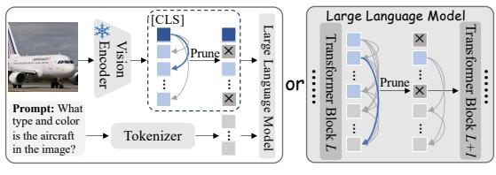
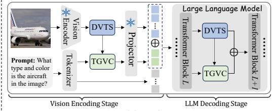
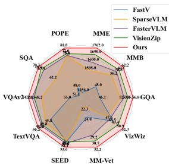
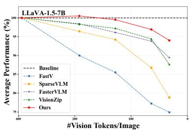
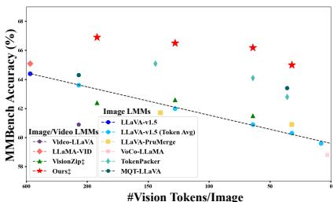
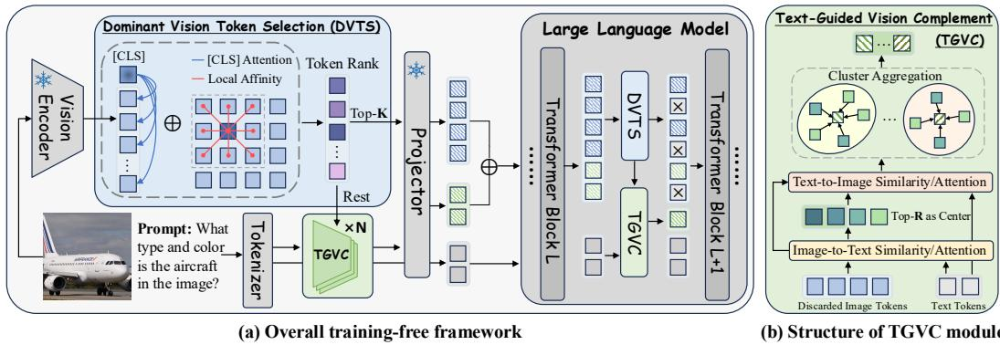
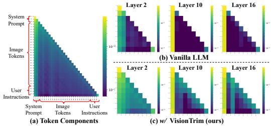
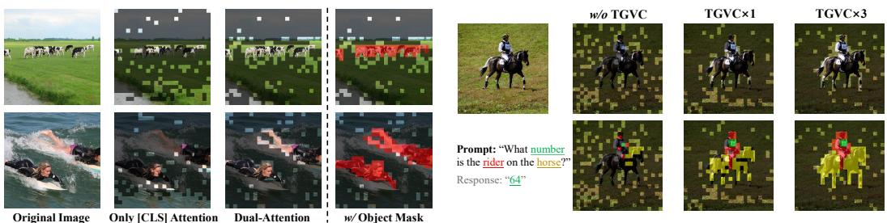

## ABSTRACT

Multimodal large language models (MLLMs) suffer from high computational costs due to excessive visual tokens, particularly in high-resolution and videobased scenarios. Existing token reduction methods typically focus on isolated pipeline components and often neglect textual alignment, leading to performance degradation. In this paper, we propose VisionTrim, a unified framework for training-free MLLM acceleration, integrating two effective plug-and-play modules: 1) the Dominant Vision Token Selection (DVTS) module, which preserves essential visual tokens via a global-local view, and 2) the Text-Guided Vision Complement (TGVC) module, which facilitates context-aware token merging guided by textual cues. Extensive experiments across diverse image and video multimodal benchmarks demonstrate the performance superiority of our VisionTrim, advancing practical MLLM deployment in real-world applications. The code is available at: https://github.com/hanxunyu/VisionTrim.

## 1 INTRODUCTION

With the recent advancements in large language models (LLMs) (Vicuna, 2023; Touvron et al., 2023; Bai et al., 2023a; Achiam et al., 2023), significant efforts (Bai et al., 2023b; Chen et al., 2024c; Reid et al., 2024) have been devoted to extending their impressive reasoning and interaction capabilities to vision-language tasks. Current multimodal large language models (MLLMs) typically integrate visual signals as sequential tokens, which are processed by an LLM to enable visual perception of the world.

Despite their promising performance, the extensive use of visual tokens, which dominate the input sequence of LLMs, substantially increases the computational complexity and cost associated with inference in MLLMs. This issue is particularly pronounced in high-resolution methods (Liu et al., 2024a;b; Chen et al., 2024c; Li et al., 2024b) and video-based models (Zhang et al., 2024b; Cheng et al., 2024; Shen et al., 2024), where the increased token length exacerbates computational overhead and severely restricts the practical deployment potential of VLMs (Jin et al., 2024b).

Recent studies (Wang et al., 2024a; 2025a; Ye et al., 2025; Zhong et al., 2024; Jin et al., 2025) have focused on accelerating the inference of MLLMs by reducing visual tokens while preserving essential information. For instance, FasterVLM (Zhang et al., 2024a) and VisionZip (Yang et al., 2025) perform global dominant visual token selection after vision encoding, whereas FastV (Chen et al., 2024a) and SparseVLM (Zhang et al., 2025b) prune tokens based on attention weights during LLM decoding. While these methods yield promising results, they tend to focus primarily on specific individual components of the MLLM framework, typically either the vision encoding or LLM decoding phases. Though the concurrent work VScan (Zhang et al., 2025a) adopts a two-stage pruning approach, it overlooks the essential role of the text query in aiding visual token selection during the vision encoding stage and directly uses the attention distribution between all visual tokens and the final instruction token for pruning during the LLM decoding stage, causing the potential loss of crucial text-related visual tokens. Furthermore, existing text-agnostic approaches like Pyramid-Drop (Xing et al., 2024) frequently overlook the necessity of aligning visual token selection with textual information. This oversight can result in the loss of textual context, which is essential for accurate LLM decoding, ultimately leading to a substantial degradation in performance.

  
(a) Previous methods

  
(b) VisionTrim (ours)  
Figure 1: Comparison of previous methods with VisionTrim. (a) Previous methods focus solely on a specific part of the MLLM framework, typically the vision encoding or LLM decoding stages. (b) In contrast, VisionTrim optimizes the entire MLLM pipeline by introducing two plug-and-play modules, Dominant Vision Token Selection (DVTS) and Text-Guided Vision Complement (TGVC), to effectively reduce visual tokens in both the vision encoding and LLM decoding phases.

To tackle these issues, we propose a unified vision token compression framework, named VisionTrim, for training-free acceleration of MLLMs. As illustrated in Figure 1, in contrast to previous methods that focus exclusively on visual token compression during either vision encoding or LLM decoding, our approach considers the entire forward propagation of the MLLM. We introduce two plug-and-play modules that effectively accelerate both the vision encoding and LLM decoding processes, which can be seamlessly inserted between any two layers of the vision encoder and the LLM. Specifically, our proposed method primarily consists of two key components: the Dominant Vision Token Selection (DVTS) and the Text-Guided Vision Complement (TGVC) modules.

Firstly, within the DVTS module, we consider both global semantics and local spatial continuity to filter visual tokens that convey essential visual information. Beyond utilizing [CLS] token’s attention scores for global semantic importance, we develop the Local Token Affinity Measurement (LTAM) algorithm to simultaneously capture feature similarity and spatial proximity among visual tokens. This approach ensures that critical visual details are retained while reducing redundancy. Secondly, in the TGVC module, we leverage textual information to guide the clustering and merging of pruned visual tokens relevant to the input text instructions. These tokens are then employed to complement the dominant visual tokens from the DVTS module. By integrating textual context into the visual token reduction process, our method enhances the implicit alignment between visual and textual representations, thereby improving the overall efficiency and performance of the pruned MLLM. As shown in Figure 2, our approach consistently surpasses previous techniques across a range of reduction ratios, offering significant advantages in both efficiency and accuracy for various image- and video-based MLLMs. In summary, the contributions of our work are threefold:

• We introduce VisionTrim, a unified framework for vision token compression that enables training-free MLLM acceleration, optimizing the entire MLLM pipeline.

• We present two effective plug-and-play modules, DVTS and TGVC, designed to accelerate the forward processes of both the vision encoder and the LLM backbone, seamlessly integrable between any two layers.

• Extensive experiments conducted on a variety of multimodal benchmarks, spanning both standard and high-resolution, as well as image- and video-based MLLMs, clearly demonstrate the superiority of our VisionTrim over previous state-of-the-art counterparts.

## 2 RELATED WORK

## 2.1 MULTIMODAL LARGE LANGUAGE MODELS

Large Language Models (LLMs) (Vicuna, 2023; Touvron et al., 2023; Bai et al., 2023a; Team, 2023; Achiam et al., 2023) have garnered significant attention due to their powerful capabilities in natural language processing tasks such as text understanding, generation, and question answering. Nonetheless, the reliance on purely textual data limits their applicability, as human perception is inherently multimodal. This has spurred the development of Multimodal LLMs (MLLMs) (Liu et al., 2023; Bai et al., 2023b; Chen et al., 2024c; Reid et al., 2024; Yu et al., 2025; Lin et al., 2024; Li et al., 2024a; Liu et al., 2024c; Wang et al., 2025b), which integrate LLMs with visual encoders to augment performance in multimodal tasks. The typical image- and video-based MLLMs (Liu et al., 2024a; Cheng et al., 2024; Lin et al., 2023) utilize an MLP to project visual information encoded by a Vision Transformer (ViT) (Dosovitskiy, 2020) into a space interpretable by LLMs, improving performance on visual-language tasks through visual instruction tuning. However, this paradigm requires a large number of visual tokens to represent visual information, particularly with highresolution images and long-context video inputs, which further exacerbates the issue. The resulting increase in computational demands and inference times poses significant challenges, hindering the practical deployment of MLLMs in real-world applications.

  
(a) Comparison on 10 benchmarks

  
(b) Comparison with other training-free methods

  
(c) Comparison with other fine-tuning methods  
Figure 2: Performance of VisionTrim. (a) Comparison across 10 benchmarks using the standard LLaVA-1.5-7B (Liu et al., 2024a), with an 88.9% reduction in visual tokens. (b) & (c) Performance vs. efficiency of various methods with a range of visual tokens, in both training-free and fine-tuning scenarios, respectively. The fine-tuning VisionTrim (Ours‡) demonstrates superior performance over previous image- and video-based MLLMs.

## 2.2 VISION TOKEN COMPRESSION FOR MLLMS

The quadratic complexity inherent in Transformer networks (Vaswani et al., 2017), which scales with the sequence length of input tokens in MLLMs, remains a widely acknowledged challenge. To address this issue, several methods (Li et al., 2023a; Bai et al., 2023b; Cha et al., 2024; Li et al., 2024b; Yao et al., 2024; Hu et al., 2024; Chu et al., 2023; 2024) explore efficient visual projectors that enable compact visual representations using fewer visual tokens before feeding them into the LLM. While these approaches have demonstrated promising performance, they often necessitate architectural modifications and extensive training. Alternatively, recent works (Shang et al., 2024; Chen et al., 2024a; Zhang et al., 2024a; 2025b; Yang et al., 2025) aim to reduce visual tokens in a training-free manner and mainly focus on either the vision encoding or LLM decoding stages. LLaVA-PruMerge (Shang et al., 2024) utilizes class-spatial similarity for pruning, and Faster-VLM (Zhang et al., 2024a) evaluates token importance via attention scores between the [CLS] token and image tokens, both operating before sending the vision tokens to the LLM. FastV (Chen et al., 2024a) and SparseVLM (Zhang et al., 2025b) prune redundant tokens at a specific layer of LLM based on attention scores solely during the LLM decoding stage. Additionally, most existing approaches overlook the alignment between visual token selection and textual information. While CrossGET (Shi et al., 2024) and Turbo (Ju et al., 2024) directly leverage text-visual attention to aid token selection, they place excessive emphasis on text tokens, which can lead to hallucinations and disrupt multi-round interactions. In contrast, our approach considers the entire MLLM pipeline and simultaneously integrates both global semantic significance and local spatial continuity to preserve visual integrity. Furthermore, we introduce a text-guided visual complement mechanism to ensure alignment with textual instructions, offering a more comprehensive and effective solution to the challenge of vision token compression.

## 3 METHODOLOGY

As illustrated in Figure 3, our approach comprehensively considers the entire pipeline of MLLM, comprising two key components that simultaneously accelerate the vision encoder and LLM forward processes. The first component, Dominant Vision Token Selection (DVTS) module, meticulously filters tokens to preserve vital visual information, focusing particularly on their significance for global semantics and local spatial continuity. The second component, Text-Guided Vision Complement (TGVC) module, leverages textual context to guide the clustering and merging of discarded visual tokens relevant to the input text instructions. This process complements the dominant visual tokens by integrating critical visual details. Both DVTS and TGVC are designed as plug-and-play modules that can be seamlessly integrated between any two layers of either the vision encoder or the LLM.

  
Figure 3: (a) Overview of VisionTrim featuring the detailed DVTS module, and (b) the structure of the TGVC module. Both DVTS and TGVC modules can be generally utilized in both the vision encoding stage and the LLM decoding stage.

## 3.1 DOMINANT VISION TOKEN SELECTION (DVTS)

To preserve visual integrity during visual token compression, we introduce a novel scoring mechanism for selecting dominant vision tokens. This mechanism thoroughly incorporates both global semantic significance and local spatial continuity. Initially, we utilize [CLS] token’s attention scores relative to other visual tokens to assess global semantic importance. Then, we develop the Local Token Affinity Measurement (LTAM) algorithm, which employs a dual-kernel method to capture feature similarity and spatial proximity, thereby ensuring local spatial continuity. These complementary metrics are subsequently integrated using an adaptive variance-based weighting scheme to prioritize the reliable visual tokens.

Global Semantic Importance. Motivated by previous methods (Yang et al., 2025; Zhang et al., 2024a), the [CLS] token’s attention distribution across all image tokens serves as a natural measure of global semantic significance. We extract the attention weights from the penultimate layer of the CLIP-based vision encoder and leverage the attention patterns from the [CLS] token. The selfattention computation for the [CLS] token is expressed as follows:

$$
\mathbf {Q} _ {[ \mathrm{CLS} ]} = \mathbf {W} _ {\mathbf {Q}} X _ {[ \mathrm{CLS} ]} ^ {L - 1}, \quad \mathbf {K} _ {i} = \mathbf {W} _ {\mathbf {K}} X _ {i} ^ {L - 1},\tag{1}
$$

$$
A _ {[ \mathrm{CLS} ], i} ^ {L - 1} = \operatorname{softmax} (\mathbf {Q} _ {[ \mathrm{CLS} ]} \mathbf {K} _ {i} ^ {T} / \sqrt {d _ {k}}), i \in [ 1, N ].\tag{2}
$$

Here, $X _ { \mathrm { [ C L S ] } } ^ { L - 1 }$ and $X _ { i } ^ { L - 1 }$ denote the hidden states of the [CLS] token and the i-th visual token at the $( L - 1 )$ -th layer, respectively. ${ \bf W _ { Q } }$ and $\mathbf { W _ { K } }$ are learnable projection matrices, and $d _ { k }$ is the dimension of key vector. N represents the total number of visual tokens. The global importance score $S _ { i } ^ { g }$ for the i-th visual token is the average attention score across all H heads:

$$
S _ {i} ^ {g} = \frac {1}{H} \sum_ {h = 1} ^ {H} A _ {[ \mathrm{CLS} ], i, h} ^ {L - 1}, \quad i \in [ 1, N ].\tag{3}
$$

This formulation effectively assesses each visual token’s contribution to the global semantic representation of the image based on the [CLS] token’s attention mechanism. The computed global scores $\{ S _ { i } ^ { g } \} _ { i = 1 } ^ { N }$ are then normalized to yield a probability distribution over all visual tokens, i.e. $\begin{array} { r } { \hat { S } _ { i } ^ { g } = \exp ( S _ { i } ^ { g } ) / \sum _ { j = 1 } ^ { N } \exp ( S _ { j } ^ { g } ) } \end{array}$

Local Spatial Continuity. Inspired by (Ru et al., 2022; Li et al., 2023b), we introduce the Local Token Affinity Measurement (LTAM) algorithm to effectively capture the local spatial continuity of visual tokens. LTAM utilizes a dual-kernel affinity mechanism to simultaneously account for feature similarity and positional proximity. For the i-th token at position $( x , y )$ , its local importance $S _ { i } ^ { l }$ is determined by computing the affinity with neighboring tokens within a local kernel $\bar { \mathcal { N } } ( \boldsymbol { x } , \boldsymbol { y } )$ of size $k \times k .$ For tokens positioned at $( x , y )$ and $( \overline { { u } } , v )$ , the affinity kernel $\kappa ^ { * }$ is defined as a weighted combination of a feature-based term $\kappa _ { f e a t }$ and a position-based term $\kappa _ { p o s }$

$$
\kappa_ {f e a t} ^ {x y, u v} = - \left(\frac {\| F _ {x y} - F _ {u v} \|}{w _ {1} \sigma_ {f}}\right) ^ {2}, \kappa_ {p o s} ^ {x y, u v} = - \left(\frac {\| P _ {x y} - P _ {u v} \|}{w _ {2} \sigma_ {p}}\right) ^ {2},\tag{4}
$$

$$
\kappa^ {* x y, u v} = \kappa_ {f e a t} ^ {x y, h w} + w _ {3} \kappa_ {p o s} ^ {x y, h w},\tag{5}
$$

where $F _ { x y } \in \mathbb { R } ^ { d }$ and $P _ { x y } \in \mathbb { R } ^ { 2 }$ denote the feature vector and spatial coordinates of the token at $( x , y )$ , respectively. $\sigma _ { f }$ and $\sigma _ { p }$ represent the standard deviations of the feature and positional differences. The pair $( h , w )$ is sampled from the neighborhood set $\textstyle { \mathcal { N } } ( x , y )$ , and $w _ { 1 } , w _ { 2 }$ , and $w _ { 3 }$ are balancing parameters. The local importance $S _ { i } ^ { l }$ of the i-th token at $( x , y )$ is then computed by averaging the affinity scores $\kappa ^ { * }$ over all neighboring tokens and converting to a probability distribution.

Adaptive Variance-based Weighting. To integrate global and local importance scores, we present an adaptive variance-based weighting mechanism:

$$
S _ {i} = \alpha \hat {S} _ {i} ^ {g} + (1 - \alpha) S _ {i} ^ {l}, \text {   where   } \alpha = \sigma_ {l} ^ {2} / (\sigma_ {g} ^ {2} + \sigma_ {l} ^ {2}).\tag{6}
$$

$\sigma _ { g } ^ { 2 }$ and $\sigma _ { l } ^ { 2 }$ denote the variances of the global and local importance scores, respectively. This adaptive weighting scheme automatically prioritizes more reliable signals based on their consistency, ensuring robust token selection. The final importance scores, $\{ { \check { S } } _ { i } \} _ { i = 1 } ^ { N } ,$ , are used to select the top-K informative tokens $\mathbf { V } _ { d o m } \in \mathbb { R } ^ { K \times d }$ from the complete set $\mathbf { V } \in \mathbb { R } ^ { N \times d }$ . This selection process ensures the preservation of both semantic relevance and spatial continuity.

## 3.2 TEXT-GUIDED VISION COMPLEMENT (TGVC)

Selected dominant tokens, while capturing primary visual information, may not fully reflect their relevance to the input instructions, potentially leading to misalignment with the textual information and loss of crucial visual elements. To address this issue, we introduce the Text-Guided Vision Complement (TGVC) module, which utilizes text instructions to complement the selected dominant vision tokens. By leveraging $\mathrm { C L I P } \ ' _ { \mathrm { s } }$ text encoder, we calculate the similarity between the remaining visual tokens and text tokens, identifying the top-R tokens as clustering centers. These centers then direct the allocation of remaining visual tokens to R clusters. Each cluster is merged to yield the final R visual tokens most relevant to the text, which we term the vision complement tokens.

Clustering Centers. Given the remaining visual tokens $\mathbf { V } _ { r } \in \mathbb { R } ^ { ( N - K ) \times d }$ after dominant token selection, we begin by calculating their similarity $S _ { t 2 v } \in \mathbb { R } ^ { L \times ( N - K ) }$ with the text features $T \in$ $\mathbb { R } ^ { L \times d }$ to identify potential clustering centers:

$$
S _ {t 2 v} = \operatorname{softmax} (T \mathbf {V} _ {r} ^ {T} / \sqrt {d}).\tag{7}
$$

Next, token-level importance scores $s \in \mathbb { R } ^ { N - K }$ are obtained by averaging the similarity scores across all text tokens, expressed as $\begin{array} { r } { s = \frac { 1 } { L } \sum _ { i = 1 } ^ { L } S _ { t 2 v _ { i } } } \end{array}$ . The top-R tokens are then selected as clustering centers, denoted as $C = \{ c _ { 1 } , . . . , c _ { R } \}$

Token Assignment. For each remaining token $v _ { i } \in \mathbf { V } _ { r } \ \backslash C$ , we compute its assignment score for each clustering center using text-guided similarity. Specifically, for a center $c _ { j }$ , the similarity scores are calculated as follows:

$$
S _ {v 2 t} ^ {i} = \operatorname{softmax} (v _ {i} T ^ {T} / \sqrt {d}), S _ {t 2 c} ^ {j} = \operatorname{softmax} (T c _ {j} ^ {T} / \sqrt {d}).\tag{8}
$$

The assignment score $a _ { i j }$ is then determined by $a _ { i j } = S _ { v 2 t } ^ { i } S _ { t 2 c } ^ { j }$ . Each token is assigned to the clustering center with the highest similarity score:

$$
\operatorname{cluster} (v _ {i}) = \arg \max _ {j} a _ {i j}.\tag{9}
$$

Cluster Aggregation. For each cluster centered at $c _ { j } .$ , we aggregate the assigned tokens through weighted averaging based on their text-guided similarities:

$$
v _ {j} ^ {\text { com }} = c _ {j} + \sum_ {v _ {i} \in \text { cluster } (j)} \frac {a _ {i j}}{\sum_ {v _ {k} \in \text { cluster } (j)} a _ {k j}} v _ {i}.\tag{10}
$$

Table 1: Comparison with other methods on LLaVA-1.5-7B. The vanilla visual token count is 576. The best results in each setting are bolded, and the second-best are underlined.

<table><tr><td>Method</td><td>GQA</td><td>MMB</td><td>MME</td><td>POPE</td><td>SQA</td><td> $VQA^{V2}$ </td><td> $VQA^{Text}$ </td><td>SEED</td><td>MMVet</td><td>VizWiz</td><td>Avg.</td></tr><tr><td colspan="12">Upper Bound, 576 Tokens (100%)</td></tr><tr><td>Vanilla</td><td>61.9</td><td>64.7</td><td>1862</td><td>85.9</td><td>69.5</td><td>78.5</td><td>58.2</td><td>58.6</td><td>31.1</td><td>50.1</td><td>100.0%</td></tr><tr><td colspan="12">Retain Averaged 192 Tokens (↓ 66.7%)</td></tr><tr><td>SparseVLM</td><td>57.6</td><td>62.5</td><td>1721</td><td>83.6</td><td>69.1</td><td>75.6</td><td>56.1</td><td>55.8</td><td>30.2</td><td>50.0</td><td>96.4%</td></tr><tr><td>VisionZip</td><td>59.3</td><td>63.0</td><td>1783</td><td>85.3</td><td>68.9</td><td>76.8</td><td>57.3</td><td>56.4</td><td>31.7</td><td>50.5</td><td>98.3%</td></tr><tr><td>PDrop</td><td>57.3</td><td>63.3</td><td>1797</td><td>84.8</td><td>69.2</td><td>76.4</td><td>56.5</td><td>57.2</td><td>30.8</td><td>50.0</td><td>97.6%</td></tr><tr><td>VScan</td><td>60.6</td><td>63.9</td><td>1806</td><td>86.2</td><td>68.6</td><td>77.8</td><td>57.7</td><td>-</td><td>-</td><td>50.4</td><td>98.9%</td></tr><tr><td>Ours</td><td>61.0</td><td>64.4</td><td>1798</td><td>86.8</td><td>70.8</td><td>78.4</td><td>58.4</td><td>58.3</td><td>33.2</td><td>51.3</td><td>100.6%</td></tr><tr><td colspan="12">Retain Averaged 128 Tokens (↓ 77.8%)</td></tr><tr><td>SparseVLM</td><td>56.0</td><td>60.0</td><td>1696</td><td>80.5</td><td>67.1</td><td>73.8</td><td>54.9</td><td>53.4</td><td>30.0</td><td>51.0</td><td>94.2%</td></tr><tr><td>VisionZip</td><td>57.6</td><td>62.0</td><td>1762</td><td>83.2</td><td>68.9</td><td>75.6</td><td>56.8</td><td>54.9</td><td>32.6</td><td>50.0</td><td>97.2%</td></tr><tr><td>PDrop</td><td>57.1</td><td>61.6</td><td>1761</td><td>82.6</td><td>68.4</td><td>76.0</td><td>56.6</td><td>56.2</td><td>31.0</td><td>49.6</td><td>96.5%</td></tr><tr><td>VScan</td><td>59.8</td><td>63.0</td><td>1792</td><td>86.1</td><td>68.9</td><td>77.1</td><td>57.3</td><td>-</td><td>-</td><td>51.7</td><td>98.6%</td></tr><tr><td>Ours</td><td>60.3</td><td>64.0</td><td>1788</td><td>86.6</td><td>69.7</td><td>78.2</td><td>58.2</td><td>57.5</td><td>32.7</td><td>51.4</td><td>99.9%</td></tr><tr><td colspan="12">Retain Averaged 64 Tokens (↓ 88.9%)</td></tr><tr><td>SparseVLM</td><td>52.7</td><td>56.2</td><td>1505</td><td>75.1</td><td>62.2</td><td>68.2</td><td>51.8</td><td>51.1</td><td>23.3</td><td>49.6</td><td>86.7%</td></tr><tr><td>VisionZip</td><td>55.1</td><td>60.1</td><td>1690</td><td>77.0</td><td>69.0</td><td>72.4</td><td>55.5</td><td>52.2</td><td>31.7</td><td>51.9</td><td>94.4%</td></tr><tr><td>PDrop</td><td>47.5</td><td>58.8</td><td>1561</td><td>76.2</td><td>69.0</td><td>73.3</td><td>50.6</td><td>53.0</td><td>30.5</td><td>50.2</td><td>90.8%</td></tr><tr><td>VScan</td><td>58.3</td><td>62.1</td><td>1698</td><td>85.0</td><td>69.1</td><td>75.4</td><td>55.6</td><td>-</td><td>-</td><td>51.8</td><td>96.8%</td></tr><tr><td>Ours</td><td>58.8</td><td>63.0</td><td>1780</td><td>86.2</td><td>71.0</td><td>76.8</td><td>56.8</td><td>54.8</td><td>32.2</td><td>52.3</td><td>98.8%</td></tr></table>

This process is repeated for T iterations to refine the clusters. The final vision complement tokens $\mathbf { \bar { V } } _ { c o m } = \{ v _ { 1 } ^ { c o m } , v _ { 2 } ^ { c o m } , . . . , v _ { R } ^ { c o m } \}$ are then concatenated with the dominant tokens to form the complete visual representation:

$$
\mathbf {V} _ {f i n a l} = [ \mathbf {V} _ {d o m}; \mathbf {V} _ {c o m} ] \in \mathbb {R} ^ {(K + R) \times d}.\tag{11}
$$

This text-guided complement mechanism ensures that visual tokens effectively capture key visual details of the image while remaining aligned with the textual instruction.

## 3.3 MULTI-STAGE PRUNING STRATEGY

Our Dominant Vision Token Selection (DVTS) and Text-Guided Vision Complement (TGVC) modules provide a versatile approach to token reduction that can be effectively applied at two stages of the MLLM pipeline.

1) Vision Encoding Stage: Before LLM processing, DVTS and TGVC can reduce the initial visual token sequence $\mathbf { V } \bar { = } \{ \mathbf { v } _ { 1 } , \mathbf { v } _ { 2 } , . . . , \mathbf { v } _ { N } \}$ to a more compact representation $\mathbf { V } ^ { \prime } = \{ \mathbf { v } _ { 1 } ^ { \prime } , \mathbf { v } _ { 2 } ^ { \prime } , . . . , \mathbf { v } _ { K + R } ^ { \prime } \}$ where $K + R < N$

2) LLM Decoding Stage: DVTS and TGVC can be integrated between any two transformer layers during LLM decoding, enabling dynamic token pruning while preserving cross-modal alignment. Specifically, instead of using the [CLS] token, we leverage the attention distribution of the first generated token as a natural measure of the global semantic significance over all image tokens. At layer l, global semantic scores ${ \bf S } ^ { g }$ for DVTS and cross-modal attention scores A between visual and textual tokens for TGVC are computed as follows:

$$
\mathbf {S} ^ {g} = \operatorname{softmax} \left(\frac {\mathbf {H} _ {g e n} ^ {l} \mathbf {H} _ {v} ^ {l}}{\sqrt {D}}\right) \in \mathbb {R} ^ {1 \times N _ {v}}, \quad \mathbf {A} = \operatorname{softmax} \left(\frac {\mathbf {H} _ {v} ^ {l} \mathbf {H} _ {t} ^ {l}}{\sqrt {D}}\right) \in \mathbb {R} ^ {N _ {v} \times N _ {t}}, \quad \alpha_ {i} = \frac {1}{N _ {t}} \sum_ {j = 1} ^ {N _ {t}} \mathbf {A} _ {i, j},\tag{12}
$$

where $\mathbf { H } _ { q e n } ^ { l } \in \mathbb { R } ^ { 1 \times D } , \mathbf { H } _ { v } ^ { l } \in \mathbb { R } ^ { N _ { v } \times D }$ and $\mathbf { H } _ { t } ^ { l } \in \mathbb { R } ^ { N _ { t } \times D }$ represent the first generated token, visual tokens, and textual tokens at layer l, respectively. $\alpha _ { i }$ denotes the average cross-modal attention score for the i-th visual token. Using these scores along with the local spatial affinity scores $\mathbf { S } ^ { l }$ from the LTAM mechanism, we first select the top-K tokens $\mathbf { V } _ { d o m }$ in DVTS and then perform top-R token complement $\mathbf { V } _ { c o m }$ in TGVC. Finally, we obtain $\mathbf { V } _ { f i n a l } = [ \mathbf { V } _ { d o m } ; \mathbf { V } _ { c o m } ]$ . The multistage application of our proposed DVTS and TGVC modules refines the visual representation, while ensuring both computational efficiency and effective cross-modal alignment.

Table 2: Performance comparisons across various token counts on LLaVA-NeXT-7B.

<table><tr><td>Method</td><td>GQA</td><td>MMB</td><td>MME</td><td>SQA</td><td> $VQA^T$ </td><td>POPE</td><td>Avg.</td></tr><tr><td colspan="8">Upper Bound, 2880 Tokens (100%)</td></tr><tr><td>Vanilla</td><td>64.2</td><td>67.9</td><td>1842</td><td>70.2</td><td>61.3</td><td>86.3</td><td>100%</td></tr><tr><td colspan="8">Retain 640 Tokens (↓77.8%)</td></tr><tr><td rowspan="2">SparseVLM</td><td>60.3</td><td>65.7</td><td>1772</td><td>67.7</td><td>57.8</td><td>85.2</td><td rowspan="2">96.1%</td></tr><tr><td>93.9%</td><td>96.8%</td><td>96.2%</td><td>96.4%</td><td>94.3%</td><td>98.7%</td></tr><tr><td rowspan="2">VisionZip</td><td>61.3</td><td>66.3</td><td>1787</td><td>68.1</td><td>60.2</td><td>87.7</td><td rowspan="2">97.8%</td></tr><tr><td>95.5%</td><td>97.6%</td><td>97.0%</td><td>97.0%</td><td>98.2%</td><td>101.6%</td></tr><tr><td rowspan="2">PDrop</td><td>62.9</td><td>66.5</td><td>1733</td><td>69.4</td><td>58.3</td><td>86.4</td><td rowspan="2">97.4%</td></tr><tr><td>98.0%</td><td>97.9%</td><td>94.1%</td><td>98.9%</td><td>95.1%</td><td>100.1%</td></tr><tr><td rowspan="2">Ours</td><td>63.2</td><td>67.2</td><td>1825</td><td>70.7</td><td>61.0</td><td>88.5</td><td>99.9%</td></tr><tr><td>98.4%</td><td>99.0%</td><td>99.1%</td><td>100.7%</td><td>99.5%</td><td>102.5%</td><td>↑(2.1%)</td></tr><tr><td colspan="8">Retain 320 Tokens (↓88.9%)</td></tr><tr><td rowspan="2">SparseVLM</td><td>57.7</td><td>64.3</td><td>1694</td><td>67.0</td><td>55.9</td><td>78.6</td><td rowspan="2">92.4%</td></tr><tr><td>89.9%</td><td>94.7%</td><td>92.0%</td><td>95.4%</td><td>91.2%</td><td>91.1%</td></tr><tr><td rowspan="2">VisionZip</td><td>59.3</td><td>63.1</td><td>1702</td><td>67.3</td><td>58.9</td><td>82.1</td><td rowspan="2">94.1%</td></tr><tr><td>92.4%</td><td>92.9%</td><td>92.4%</td><td>95.9%</td><td>96.1%</td><td>95.1%</td></tr><tr><td rowspan="2">PDrop</td><td>58.5</td><td>63.2</td><td>1667</td><td>66.8</td><td>58.2</td><td>81.9</td><td rowspan="2">93.3%</td></tr><tr><td>91.1%</td><td>93.1%</td><td>90.5%</td><td>95.2%</td><td>94.9%</td><td>94.9%</td></tr><tr><td rowspan="2">Ours</td><td>61.7</td><td>64.8</td><td>1795</td><td>69.6</td><td>59.6</td><td>83.6</td><td>97.0%</td></tr><tr><td>96.1%</td><td>95.4%</td><td>97.4%</td><td>99.1%</td><td>97.2%</td><td>96.9%</td><td>↑(2.9%)</td></tr><tr><td colspan="8">Retain 160 Tokens (↓94.4%)</td></tr><tr><td rowspan="2">SparseVLM</td><td>51.2</td><td>63.1</td><td>1542</td><td>67.5</td><td>46.4</td><td>77.3</td><td rowspan="2">86.3%</td></tr><tr><td>79.8%</td><td>92.9%</td><td>83.7%</td><td>96.2%</td><td>75.7%</td><td>89.6%</td></tr><tr><td rowspan="2">VisionZip</td><td>55.5</td><td>60.1</td><td>1630</td><td>68.3</td><td>56.2</td><td>79.4</td><td rowspan="2">90.7%</td></tr><tr><td>86.4%</td><td>88.5%</td><td>88.5%</td><td>97.3%</td><td>91.7%</td><td>92.0%</td></tr><tr><td rowspan="2">PDrop</td><td>56.1</td><td>60.3</td><td>1545</td><td>67.4</td><td>54.7</td><td>78.0</td><td rowspan="2">89.3%</td></tr><tr><td>87.4%</td><td>88.8%</td><td>83.9%</td><td>96.0%</td><td>89.2%</td><td>90.4%</td></tr><tr><td rowspan="2">Ours</td><td>57.2</td><td>63.3</td><td>1702</td><td>70.2</td><td>58.3</td><td>81.1</td><td>94.0%</td></tr><tr><td>89.1%</td><td>93.2%</td><td>92.4%</td><td>100.0%</td><td>95.1%</td><td>94.0%</td><td>↑(3.3%)</td></tr></table>

Table 3: Comparison with previous state-of-theart methods on Video-LLaVA-7B.

<table><tr><td rowspan="2">Method</td><td colspan="2">TGIF</td><td colspan="2">MSVD</td><td colspan="2">MSRVTT</td><td colspan="2">ActivityNet</td><td colspan="2">Avg.</td></tr><tr><td>Acc</td><td>Score</td><td>Acc</td><td>Score</td><td>Acc</td><td>Score</td><td>Acc</td><td>Score</td><td>Acc</td><td>Score</td></tr><tr><td>Vanilla</td><td>47.1</td><td>3.35</td><td>69.8</td><td>3.92</td><td>56.7</td><td>3.48</td><td>43.1</td><td>3.35</td><td>100.0%</td><td>+0.00</td></tr><tr><td rowspan="2">SparseVLM</td><td>44.7</td><td>3.29</td><td>68.2</td><td>3.90</td><td>31.0</td><td>2.68</td><td>42.6</td><td>3.32</td><td rowspan="2">86.5%</td><td rowspan="2">-0.23</td></tr><tr><td>94.9%</td><td>-0.06</td><td>97.7%</td><td>-0.02</td><td>54.7%</td><td>-0.80</td><td>98.8%</td><td>-0.03</td></tr><tr><td rowspan="2">VisionZip</td><td>42.0</td><td>3.16</td><td>63.5</td><td>3.58</td><td>49.6</td><td>3.34</td><td>42.0</td><td>3.21</td><td rowspan="2">91.3%</td><td rowspan="2">-0.20</td></tr><tr><td>89.2%</td><td>-0.19</td><td>91.0%</td><td>-0.34</td><td>87.5%</td><td>-0.14</td><td>97.4%</td><td>-0.14</td></tr><tr><td rowspan="2">Ours</td><td>45.2</td><td>3.32</td><td>68.6</td><td>3.93</td><td>54.9</td><td>3.42</td><td>43.5</td><td>3.31</td><td>98.0%</td><td>-0.03</td></tr><tr><td>96.0%</td><td>-0.03</td><td>98.3%</td><td>0.01</td><td>96.8%</td><td>-0.06</td><td>100.9%</td><td>-0.04</td><td> $\uparrow (6.7\%)$ </td><td> $\uparrow (0.17)$ </td></tr></table>

Table 4: Ablation of pruning at vision encoding and LLM decoding stages.

<table><tr><td>Stages</td><td>#Tokens</td><td>GQA</td><td>MMB</td><td>POPE</td><td> $VQA^{V2}$ </td><td>KV Cache (MB)</td></tr><tr><td>LLaVA-1.5-7B</td><td>576</td><td>61.9</td><td>64.7</td><td>85.9</td><td>78.5</td><td>303.6</td></tr><tr><td rowspan="2">Only in ViTw/ DVTSw/ DVTS+TGVC</td><td rowspan="2">64</td><td>52.8</td><td>56.9</td><td>76.1</td><td>68.6</td><td rowspan="2">25.4 (↓ 91.6%)</td></tr><tr><td>55.6</td><td>60.2</td><td>80.2</td><td>72.2</td></tr><tr><td rowspan="2">Only in LLMw/ DVTSw/ DVTS+TGVC</td><td rowspan="2">64</td><td>52.0</td><td>57.4</td><td>75.8</td><td>70.2</td><td rowspan="2">43.5 (↓ 85.7%)</td></tr><tr><td>54.7</td><td>61.1</td><td>79.2</td><td>73.6</td></tr><tr><td>Both in ViT and LLM</td><td>64</td><td>58.8</td><td>63.0</td><td>86.2</td><td>76.8</td><td>30.2 (↓ 90.1%)</td></tr></table>

Table 5: Ablation study of various ensemble strategies in the DVTS module.

<table><tr><td>Ensemble Strategy</td><td>GQA</td><td>MMB</td><td>MME</td><td>POPE</td><td>SQA</td><td>VQA $^{\text{Text}}$ </td></tr><tr><td>Only [CLS] token</td><td>52.8</td><td>55.3</td><td>1536</td><td>74.2</td><td>67.9</td><td>51.2</td></tr><tr><td>Element-wise Maximum</td><td>53.4</td><td>58.7</td><td>1702</td><td>77.6</td><td>70.0</td><td>52.4</td></tr><tr><td>Geometric Mean</td><td>55.2</td><td>56.5</td><td>1631</td><td>80.2</td><td>71.1</td><td>54.3</td></tr><tr><td>Adaptive Weighting</td><td>58.8</td><td>63.0</td><td>1780</td><td>86.2</td><td>71.0</td><td>56.8</td></tr></table>

## 4 EXPERIMENT

## 4.1 EXPERIMENTAL SETTINGS

Datasets and Benchmarks. We conduct a comprehensive evaluation across 10 widely-used image-based benchmarks to assess the multimodal understanding and reasoning capabilities of our proposed approach. These benchmarks include common visual question answering tasks, like GQA (Hudson & Manning, 2019), VQAV2 (Goyal et al., 2017) and VizWiz (Gurari et al., 2018), as well as other multimodal benchmarks such as POPE (Li et al., 2023c), MMBench (Liu et al., 2025), MME (Fu et al., 2023) and MM-Vet (Yu et al., 2023). Additionally, we experiment with 4 widely used video-based multimodal understanding tasks: TGIF-QA (Jang et al., 2017), MSVD-QA (Xu et al., 2017), MSRVTT-QA (Xu et al., 2017), and ActivityNet-QA (Yu et al., 2019).

Implementaion Details. We apply our approach to various open-source MLLMs, including the classic LLaVA-1.5 (Liu et al., 2024a) model for normal-resolution images, LLaVA-NeXT (Liu et al., 2024b) for high-resolution images, Video-LLaVA (Lin et al., 2023) for video-based tasks, and Qwen2-VL (Wang et al., 2024b) and Qwen2.5-VL (Bai et al., 2025) for broader validation. To ensure a fair comparison, we adopt the default settings and evaluation metrics as reported in their respective papers. We compare our approach with SparseVLM (Zhang et al., 2025b), VisionZip (Yang et al., 2025), PyramidDrop (Xing et al., 2024), and VScan (Zhang et al., 2025a). Following the same spirit, we design different algorithms for multiple stages of the MLLM pipeline.

## 4.2 MAIN RESULTS

Normal Resolution. As shown in Table 1, we first evaluate our approach on LLaVA-1.5-7B (Liu et al., 2024a) under the normal-resolution setting. VisionTrim consistently surpasses previous methods across all token configurations (192, 128, and 64). In benchmarks, such as POPE, SQA, and TextVQA, VisionTrim not only maintains its performance without degradation but also achieves improvements, highlighting the severe redundancy present in visual tokens fed to the LLM.

High Resolution. Our approach minimizes token count while maintaining performance on LLaVA-NeXT-7B (Liu et al., 2024b) with high-resolution inputs. As demonstrated in Table 2, VisionTrim retains 99.9% of the original performance using only 22.2% visual tokens. With nearly 95% token

Table 6: Experiment results of deploying VisionTrim on Qwen2-VL-7B and Qwen2.5-VL-7B over several benchmarks. For both models, approximately 1/3 of the original input tokens are used.

<table><tr><td>Method</td><td>MMB</td><td>MMStar</td><td>MME</td><td> $VQA^T$ </td><td>POPE</td></tr><tr><td>Qwen2-VL</td><td>80.7</td><td>60.7</td><td>2322</td><td>84.3</td><td>86.4</td></tr><tr><td>FastV</td><td>77.8</td><td>57.3</td><td>1859</td><td>77.6</td><td>82.0</td></tr><tr><td>SparseVLM</td><td>79.0</td><td>57.9</td><td>2019</td><td>79.2</td><td>84.2</td></tr><tr><td>PDrop</td><td>80.6</td><td>58.6</td><td>2053</td><td>80.2</td><td>82.5</td></tr><tr><td>Ours</td><td>82.8</td><td>60.6</td><td>2310</td><td>83.5</td><td>86.3</td></tr></table>

<table><tr><td>Method</td><td>MMB</td><td> $MMB^{CN}$ </td><td>MMMU</td><td>SEED</td><td>RefCOCO</td></tr><tr><td>Qwen2.5-VL</td><td>83.5</td><td>83.4</td><td>38.3</td><td>70.4</td><td>89.5</td></tr><tr><td>FastV</td><td>77.5</td><td>76.3</td><td>34.6</td><td>64.8</td><td>73.6</td></tr><tr><td>SparseVLM</td><td>79.6</td><td>80.3</td><td>36.0</td><td>67.5</td><td>78.4</td></tr><tr><td>PDrop</td><td>78.2</td><td>77.0</td><td>35.8</td><td>67.9</td><td>77.5</td></tr><tr><td>Ours</td><td>83.2</td><td>81.8</td><td>37.9</td><td>70.2</td><td>86.8</td></tr></table>

Table 7: Ablation study on TGVC module. This experiment, conducted before inputting data into the LLM, evaluates the effectiveness of the TGVC in reducing noise within text-visual attention during the LLM’s forward pass.

<table><tr><td rowspan="2">Benchmark</td><td colspan="4">Number of Tokens</td><td rowspan="2">Avg.</td></tr><tr><td>192</td><td>128</td><td>64</td><td>32</td></tr><tr><td>POPE</td><td>83.0</td><td>81.4</td><td>76.1</td><td>72.9</td><td>78.4</td></tr><tr><td>w/ TGVC</td><td>86.1 (↑ 3.1)</td><td>84.7 (↑ 3.3)</td><td>80.2 (↑ 4.1)</td><td>77.3 (↑ 4.4)</td><td>82.1 (↑ 3.7)</td></tr><tr><td>MMBench</td><td>61.1</td><td>60.5</td><td>56.9</td><td>54.9</td><td>58.4</td></tr><tr><td>w/ TGVC</td><td>63.4 (↑ 2.3)</td><td>62.9 (↑ 2.4)</td><td>60.2 (↑ 3.3)</td><td>59.1 (↑ 4.2)</td><td>61.4 (↑ 3.0)</td></tr><tr><td>Text-VQA</td><td>55.3</td><td>54.4</td><td>52.6</td><td>50.2</td><td>53.1</td></tr><tr><td>w/ TGVC</td><td>57.8 (↑ 2.5)</td><td>57.2 (↑ 2.8)</td><td>56.0 (↑ 3.4)</td><td>54.2 (↑ 4.0)</td><td>56.3 (↑ 3.2)</td></tr></table>

  
Figure 4: Comparison of attention maps during LLM forward processing, with and without our proposed VisionTrim.  
reduction, it achieves 94.0% performance without training, surpassing the previous state-of-the-art method, VisionZip (Yang et al., 2025), by 3.3%. These results validate the superior efficacy of VisionTrim for high-resolution inputs.

Video. To assess the generalization of our approach on video-based scenarios, we apply it to Video-LLaVA-7B (Lin et al., 2023), which processes 8 frames from a video and generates 2048 visual tokens. Following SparseVLM (Zhang et al., 2025b), we reduce the visual tokens to 136. As shown in Table 3, VisionTrim achieves 98.0% of the original performance with a 93.4% pruning ratio, outperforming all other methods across four benchmarks. Furthermore, VisionTrim consistently exceeds 96.0% in performance, demonstrating its effectiveness and robustness. Our method excels even with high pruning ratios, effectively balancing inference speed and accuracy in video tasks.

Broader Validation. To further evaluate the effectiveness of VisionTrim, we deploy it to the stateof-the-art open-source MLLMs, Qwen2-VL-7B (Wang et al., 2024b) and Qwen2.5-VL-7B (Bai et al., 2025), using approximately 1/3 of the original input tokens. As shown in Table 6, VisionTrim exhibits competitive performance with only about a 0.1% performance loss across several cases, and even occasionally outperforms the baseline MLLM. Notably, VisionTrim exceeds the vanilla Qwen2-VL (Wang et al., 2024b) by 2.1% on the MMBench dataset, confirming its effectiveness in reducing visual redundancy. Please refer to the Appendix for more experiments on other tasks to further assess VisionTrim’s generalization capabilities.

## 4.3 ABLATION STUDY

Component-wise Analysis. We conduct a thorough ablation study to evaluate our approach for both vision encoding and LLM decoding stages, as presented in Table 4. We reduce image tokens to 64 for an 88.9% reduction (the same below). Initially, applying DVTS and TGVC modules solely in the vision encoder improves multimodal processing and reduces KV cache memory by 91.6%. For a fair comparison, we also implement the DVTS and TGVC modules only in LLM’s decoding stage, yielding performance gains of 5.4% and 4.9% over SparseVLM (Zhang et al., 2025b) on $\mathrm { V Q } \bar { \mathrm { A } } ^ { \mathrm { v } 2 }$ and MMBech datasets, respectively. When applied to both vision encoding and LLM decoding stages, VisionTrim outperforms approaches that target only specific stages and achieves higher performance with a 90.1% reduction in memory usage, significantly surpassing existing state-of-the-art methods. Moreover, Figure 4 shows attention maps with and without VisionTrim, highlighting that the vanilla LLM exhibits high redundancy and suboptimal cross-modal alignment. In contrast, VisionTrim improves cross-modal alignment and reduces visual redundancy without performance compromise. Please refer to the Appendixfor more ablation studies and visualization results.

Ensemble Strategy in DVTS. In the DVTS module, we employ various ensemble strategies to combine global semantic information from the [CLS] token attention and local spatial affinity captured by the LTAM algorithm, as shown in Table 5. Specifically, we explore three ensemble methods: element-wise maximum, geometric mean, and adaptive variance-based weighting. Compared to the baseline that solely uses [CLS] token attention, incorporating both global semantic and local spatial continuity enhances performance significantly. Furthermore, as depicted in Figure 5, relying exclusively on [CLS] token results in the loss of crucial semantic information, while considering local spatial continuity helps retain better visual token coverage. Consequently, our proposed DVTS with a dual-attention filtering mechanism offers a more holistic approach to attention integration.

  
Figure 5: Visualization of retained visual patches with and without the dual-attention mechanism in the DVTS module. Black-masked areas indicate discarded visual tokens.  
Figure 6: Visualization of retained visual patches with and without TGVC module. We show the correspondence between the salient visual regions and text in different colors.

Visual Token Complement of TGVC. As shown in Table 7, incorporating the TGVC module significantly boosts performance across three multimodal tasks: POPE, MMBench, and Text-VQA. Notably, as the compression ratio increases and token count decreases, the TGVC module’s impact becomes more pronounced, resulting in performance gains exceeding 4%. Additionally, Figure 6 illustrates that the TGVC module retains essential visual tokens related to textual instructions, ensuring critical visual information is not pruned away. It can also be applied multiple times for enhanced visual completion, allowing textual tokens to better align with the corresponding visual information in the subsequent LLM decoding stage.

The Usage of Textual Prompts. In VisionTrim, token compression has two stages: dominant visual tokens are selected via a dual-attention mechanism, and discarded tokens are utilized with textguided cues. (1) Without textual prompts, VisionTrim runs in a text-agnostic mode using DVTS, which relies on global [CLS] attention and local affinity; as shown in Table 10 in Appendix D.3, this maintains most accuracy while improving efficiency. (2) When prompts are irrelevant or misleading, text–image similarities become uniformly low, making textual initialization effectively random. Due to the semantic redundancy of visual tokens, the system behaves like unsupervised visual clustering (similar to ToMe (Bolya et al., 2022)), naturally grouping meaningful tokens. Since VisionTrim merges rather than prunes tokens, essential semantics are preserved even under poor textual cues.

## 4.4 EFFICIENCY ANALYSIS

We evaluate the efficiency of our method by measuring CUDA time, FLOPs, and storage memory, and compare it with vanilla LLaVA-NeXT-7B (Liu et al., 2024b) and other techniques, as shown in Table 8. At an 88.9% reduction ratio, our method reduces CUDA time by

Table 8: Efficiency analysis of our method on LLaVA-NeXT-7B. The detailed metric includes latency (CUDA time), computation (FLOPs), and storage (cache memory).

<table><tr><td>Methods</td><td>#Tokens</td><td>SQA(%) ↑</td><td>CUDA Time(Min &amp; Sec) ↓</td><td> $\bigtriangleup$ </td><td>FLOPs(T) ↓</td><td> $\bigtriangleup$ </td><td>KV Cache(MB) ↓</td><td> $\bigtriangleup$ </td></tr><tr><td>Vanilla</td><td>2880</td><td>70.2</td><td>26:34</td><td>-</td><td>9.6</td><td>-</td><td>1512.1</td><td>-</td></tr><tr><td>SparseVLM</td><td>320</td><td>67.0</td><td>18:26</td><td>30.6%</td><td>1.5</td><td>84.4%</td><td>168.0</td><td>88.9%</td></tr><tr><td>VisionZip</td><td>320</td><td>67.3</td><td>17:53</td><td>32.7%</td><td>1.6</td><td>83.3%</td><td>180.4</td><td>88.1%</td></tr><tr><td>Ours</td><td>320</td><td>69.6</td><td>10:16</td><td>61.4%</td><td>0.8</td><td>91.7%</td><td>101.8</td><td>93.3%</td></tr></table>

61.4%, FLOPs by 91.7%, and storage memory by 93.3%, while maintaining 99.1% accuracy on SQA. Notably, when retaining the same token count, our method is 44.3% faster in inference time compared to SparseVLM (Zhang et al., 2025b) and requires 50.0% less computational budget than VisionZip (Yang et al., 2025), while also minimizing KV cache memory usage. These results demonstrate the high efficiency of our approach. Additionally, as shown in Table 9, we provide further efficiency analyses on the POPE benchmark, including both the overall end-to-end latency and prefill time, demonstrating that VisionTrim is highly effective at accelerating MLLM inference.

Table 9: Additional efficiency results on the POPE benchmark. We further report the end-to-end latency, prefill time, and the corresponding accuracy on a single NVIDIA A100 GPU.

<table><tr><td>Methods</td><td>#Tokens</td><td>Total Inference Time ↓</td><td>Prefill Time ↓</td><td>FLOPs ↓</td><td>Accuracy ↑</td></tr><tr><td>LLaVA-1.5-7B</td><td>576</td><td>1303 s (1.00×)</td><td>494 s (1.00×)</td><td>3.8 T</td><td>85.9</td></tr><tr><td>+ SparseVLM</td><td>64</td><td>1068 s (1.22×)</td><td>377 s (1.31×)</td><td>1.3 T</td><td>75.1</td></tr><tr><td>+ Ours</td><td>64</td><td>685 s (1.90×)</td><td>235 s (2.10×)</td><td>0.8 T</td><td>86.2</td></tr><tr><td>LLaVA-NeXT-7B</td><td>2880</td><td>2284 s (1.00×)</td><td>1062 s (1.00×)</td><td>12.6 T</td><td>86.3</td></tr><tr><td>+ SparseVLM</td><td>320</td><td>1872 s (1.22×)</td><td>644 s (1.65×)</td><td>2.5 T</td><td>78.5</td></tr><tr><td>+ Ours</td><td>320</td><td>921 s (2.48×)</td><td>360 s (2.95×)</td><td>1.2 T</td><td>84.8</td></tr></table>

## 5 CONCLUSION AND LIMITATIONS

In this paper, we proposed VisionTrim, a unified training-free framework for MLLM acceleration through comprehensive vision token compression. We presented two effective plug-and-play modules that accelerated both vision encoding and LLM decoding stages. By integrating the DVTS module, which selects tokens based on global semantics and local spatial continuity, with the TGVC module, which performs text-guided visual token complement, our approach consistently surpassed previous methods across various reduction ratios in both image and video understanding tasks.

Limitations. Although VisionTrim achieves 98.8% of the original performance with an 88.9% reduction ratio in token count without additional training costs, it is not entirely without loss. We are committed to advancing our research to further explore the redundancy of visual tokens and developing lossless methods to enhance the efficiency of visual understanding with MLLMs.

## ACKNOWLEDGEMENTS

This work is supported by the National Natural Science Foundation of China under Grant No.62376244. It is also supported by the Information Technology Center and State Key Lab of CAD&CG, Zhejiang University.

## REFERENCES

Josh Achiam, Steven Adler, Sandhini Agarwal, Lama Ahmad, Ilge Akkaya, Florencia Leoni Aleman, Diogo Almeida, Janko Altenschmidt, Sam Altman, Shyamal Anadkat, et al. Gpt-4 technical report. arXiv preprint arXiv:2303.08774, 2023.

Jinze Bai, Shuai Bai, Yunfei Chu, Zeyu Cui, Kai Dang, Xiaodong Deng, Yang Fan, Wenbin Ge, Yu Han, Fei Huang, Binyuan Hui, Luo Ji, Mei Li, Junyang Lin, Runji Lin, Dayiheng Liu, Gao Liu, Chengqiang Lu, Keming Lu, Jianxin Ma, Rui Men, Xingzhang Ren, Xuancheng Ren, Chuanqi Tan, Sinan Tan, Jianhong Tu, Peng Wang, Shijie Wang, Wei Wang, Shengguang Wu, Benfeng Xu, Jin Xu, An Yang, Hao Yang, Jian Yang, Shusheng Yang, Yang Yao, Bowen Yu, Hongyi Yuan, Zheng Yuan, Jianwei Zhang, Xingxuan Zhang, Yichang Zhang, Zhenru Zhang, Chang Zhou, Jingren Zhou, Xiaohuan Zhou, and Tianhang Zhu. Qwen technical report. arXiv preprint arXiv:2309.16609, 2023a.

Jinze Bai, Shuai Bai, Shusheng Yang, Shijie Wang, Sinan Tan, Peng Wang, Junyang Lin, Chang Zhou, and Jingren Zhou. Qwen-vl: A frontier large vision-language model with versatile abilities. arXiv preprint arXiv:2308.12966, 2023b.

Shuai Bai, Keqin Chen, Xuejing Liu, Jialin Wang, Wenbin Ge, Sibo Song, Kai Dang, Peng Wang, Shijie Wang, Jun Tang, et al. Qwen2. 5-vl technical report. arXiv preprint arXiv:2502.13923, 2025.

Daniel Bolya, Cheng-Yang Fu, Xiaoliang Dai, Peizhao Zhang, Christoph Feichtenhofer, and Judy Hoffman. Token merging: Your vit but faster. arXiv preprint arXiv:2210.09461, 2022.