## ABSTRACT

Reinforcement learning from verifiable rewards (RLVR) is an emerging paradigm for improving the reasoning ability of large language models. However, standard on-policy training discards rollout experiences after a single update, leading to computational inefficiency and instability. While prior work on RL has highlighted the benefits of reusing past experience, the role of experience characteristics in shaping learning dynamics of large reasoning models remains underexplored. In this paper, we are the first to investigate what makes a reasoning experience valuable and identify rollout correctness and entropy as effective indicators of experience value. Based on these insights, we propose ExGRPO (Experiential Group Relative Policy Optimization), a framework that organizes and prioritizes valuable experiences, and employs a mixed-policy objective to balance exploration with experience exploitation. Experiments on five backbone models (1.5B-8B parameters) show that ExGRPO consistently improves reasoning performance on mathematical/general benchmarks, with an average gain of +3.5/7.6 points over on-policy RLVR. Moreover, ExGRPO stabilizes training on both stronger and weaker models where on-policy methods fail. These results highlight principled experience management as a key ingredient for efficient and scalable RLVR.

Code: ExGRPO

Models: ExGRPO Models

## 1 INTRODUCTION

Reinforcement learning (RL) has become a pivotal technique for advancing the reasoning capabilities of language models on complex tasks (Guo et al., 2025; Yang et al., 2025). RL augments language models’ reasoning by modeling chain-of-thought (CoT) as action sequences optimized under verifiable rewards (RLVR), laying the groundwork for sophisticated downstream applications (Gridach et al., 2025). However, a significant yet overlooked challenge persists: due to the on-policy nature of most RLVR algorithms, the valuable experience generated during the rollout phase is often discarded after a single gradient update (Shao et al., 2024). This practice not only squanders substantial computational resources but also forfeits critical opportunities for the model to learn from prior successful explorations, thereby imposing a bottleneck on scaling RL for reasoning.

Experience replay (Lin, 1992) is a widely adopted technique in RL to address this issue and improve sample efficiency. As stated in Silver & Sutton (2025), AI is at the cusp of a new period in which experience will become the dominant medium of improvement. This idea, often referred to as experience-based RL, leverages the intuition that previously collected interactions (i.e., state-actionreward tuples) contain valuable information for learning, helping models stabilize training and accelerate convergence (Mnih et al., 2013). A non-trivial challenge lies in how to exploit past experiences based on their differing “values” (Schaul et al., 2016) and manage the replay process according to customized learning schedules (Sujit et al., 2023). However, efficient experience replay mechanisms remain largely underexplored in RLVR for building large reasoning models (LRMs;

Plaat et al. 2024). Given the vast quantity of experiences collected during rollouts, a fundamental question remains: How can the reasoning model effectively exploit its own stream ofexperience to maximize learning toward scaling RL computefor LRMs?

To address this gap, we begin by examining what constitutes a valuable reasoning experience for RLVR optimization1. We hypothesize that experience utility varies with measurable properties. RLVR experience generally consists of a question and its corresponding trajectories. Accordingly, we study experience properties from these two components. Through systematic analysis, we identify rollout correctness (for questions) and trajectory entropy (for trajectories) as effective online proxy metrics for characterizing experience quality. Specifically, tasks of intermediate difficulty and their associated low-entropy trajectories tend to be beneficial for RLVR optimization.

Building on these insights, we introduce Experiential Group Relative Policy Optimization (ExGRPO), a novel framework designed to strategically identify, manage, and replay valuable experiences. ExGRPO maintains a replay buffer of reasoning trajectories derived from partially correct rollouts and organizes them into buckets according to their correctness levels. To manage the buffer effectively, it uses a sampling strategy that prioritizes experiences from the most beneficial buckets, along with the corresponding trajectory with the lowest entropy. This approach allows the model to learn more efficiently from past experiences that align best with its current capabilities, guided by the principles of valuable experience concluded in our preliminary analysis. During mini-batch optimization, ExGRPO uses a mixed-policy optimization objective that balances between leveraging fresh exploration and reusing strategically selected past experiences, improving both sample efficiency and training stability.

Our experimental results demonstrate that ExGRPO delivers improvements over on-policy RLVR baselines. We evaluate across five backbone models, spanning the Qwen (Yang et al., 2024; Qwen et al., 2024) and Llama (Grattafiori et al., 2024) families from 1.5B to 8B parameters, on both mathematical reasoning benchmarks (AIME24/25, AMC, OlympiadBench, Minerva, MATH500) and out-of-distribution reasoning benchmarks (ARC-c, GPQA, MMLU-Pro). Averaged over all backbone models, ExGRPO achieves +3.5 and +7.6 point gains2 on in-distribution and out-of-distribution benchmark performance, respectively, compared to the on-policy RLVR. Notably, ExGRPO stabilizes RLVR training on the weaker Llama-3.1 8B model (Grattafiori et al., 2024) and continual learning on the stronger LUFFY model (Yan et al., 2025), where on-policy optimization collapses. Detailed anal ysis and ablations further confirm that improvements stem from ExGRPO’s experience management and optimization mechanisms, which amplify the utility of past explorations.

## 2 RELATED WORK

Reinforcement Learning with Verifiable Rewards. Reinforcement Learning with Verifiable Rewards (RLVR; Lambert et al. 2024) frames the language model as a policy that generates reasoning trajectories for verifiable tasks, with rewards provided by rule-based (Guo et al., 2025; Yu et al., 2025) or model-based verifiers (Su et al., 2025; Ma et al., 2025b; Chen et al., 2025a). Most RLVR methods adopt on-policy optimization (Schulman et al., 2017; Shao et al., 2024), which ensures stability but incurs high computational cost. Recent work has explored off-policy techniques (Kallus & Uehara, 2020; Meng et al., 2023) that incorporate historical or external data. Some approaches mix expert demonstrations with on-policy updates, e.g., off-policy policy gradients (Yan et al., 2025), SFT loss (Zhang et al., 2025b; Ma et al., 2025a), or knowledge distillation (Xu et al., 2025); others develop direct off-policy update rules for improved sample efficiency (Cohen et al., 2025; Roux et al., 2025; Arnal et al., 2025). However, they overlook the impact of data quality within the experience replay buffer, a factor that remains underexplored in RLVR and is the central focus of our work.

Experience-based Reinforcement Learning. Experience replay (Lin, 1992) is a classical RL technique to improve sample efficiency and stabilize training, later extended with prioritized replay (Schaul et al., 2016; Sujit et al., 2023) to emphasize informative transitions, enabling breakthroughs in control tasks (Mnih et al., 2013; 2015; Lillicrap et al., 2016). For LRMs, recent studies show that replaying successful trajectories accelerates convergence and improves reasoning capabili ties. ReMix (Liang et al., 2025) leverages off-policy experience replay to improve training efficiency; RePO adopts online replay (Li et al., 2025), collecting early on-policy rollouts and revisiting them asynchronously; RLEP (Zhang et al., 2025a) reuses trajectories from a well-trained policy; and

RRL (Dou et al., 2025) dynamically revisits promising early states; ARPO (Lu et al., 2025) extends this idea to GUI agents, combining GRPO with a replay buffer to enhance stability and sample efficiency. Among them, the last three methods overlook importance weighting to correct distribution mismatch in off-policy updates. In this work, we argue that not all stored experiences are equally valuable in zero RLVR for LRMs. We systematically analyze properties that determine the value of past experiences and design methods to better leverage high-value experiences, thereby improving efficiency and performance.

## 3 PRELIMINARIES

In this section, we briefly review the RL foundations underlying our method: RLVR and Group Relative Policy Optimization (GRPO), upon which ExGRPO is built. We then present a preliminary analysis of experience data, i.e., the model’s past successful rollouts, and examine how their characteristics influence performance.

## 3.1 REINFORCEMENT LEARNING WITH VERIFIABLE REWARD

Verifiable Reward Function. The verifiable reward compares the extracted answer from the model’s output with a predefined golden answer. For example, the model is instructed to output the final answer in a format such as \boxed{}, from which a verifier extracts the value. Formally, given a model output o for question q, the reward is:

$$
r (q, o) = \left\{ \begin{array}{l l} 1 & \text { if   } o \text {   contains   the   correct   final   answer   to   } q \\ 0 & \text { otherwise. } \end{array} \right.\tag{1}
$$

Group Relative Policy Optimization (GRPO). GRPO (Shao et al., 2024) is a strong baseline within the RLVR paradigm (Guo et al., 2025; Zeng et al., 2025; Liu et al., 2025), achieving effective scaling without requiring an additional value model. It estimates the advantage of each trajectory by normalizing rewards within a group of N sampled solutions. Given a group of K trajectories $\dot { \mathcal { G } _ { q } } = \{ o _ { i } \} _ { i = 1 } ^ { K }$ using the current reference policy $\pi _ { \theta _ { \mathrm { o l d } } }$ (i.e, rollout policy), GRPO estimates the advantage of each trajectory $o _ { i }$ by normalizing its reward against the empirical statistics of the group:

$$
\widehat {A} _ {i} = \frac {r (q , o _ {i}) - \mu_ {\mathcal {G} _ {q}}}{\sigma_ {\mathcal {G} _ {q}}}\tag{2}
$$

where $\begin{array} { r } { \mu _ { \mathcal { G } _ { q } } = \frac { 1 } { K } \sum _ { j = 1 } ^ { K } r ( q , o _ { j } ) } \end{array}$ and $\sigma _ { \mathcal { G } _ { q } }$ are the mean and standard deviation of rewards in the group $\mathcal { G } _ { q }$ . The on-policy objective maximizes a clipped surrogate function:

$$
\mathcal {J} _ {\mathrm{GRPO}} (\theta) = \mathbb {E} _ {q \sim \mathcal {D}, \{o _ {i} \} \sim \pi_ {\theta_ {\mathrm{old}}} (\cdot | q)} \left[ \frac {1}{K} \sum_ {i = 1} ^ {K} \operatorname{CLIP} (w _ {i} (\theta), \widehat {A} _ {i}) \right]\tag{3}
$$

where D is the training query set and the loss term is $\mathbf { C L I P } ( w , A )$ = $\textstyle { \frac { 1 } { | o | } } \sum _ { t = { \mathrm { i } } } ^ { | o | }$ min $( w _ { t } A , \mathrm { c l i p } ( w _ { t } , 1 - \varepsilon , 1 + \varepsilon ) A )$ . Since the trajectory o is generated by the rollout policy model before update, i.e., $\pi _ { \boldsymbol { \theta } _ { \mathrm { o l d } } } ,$ the per-token importance weight $w _ { i , t } ( \boldsymbol { \theta } )$ is the probability ratio between the current policy π and reference policy $\pi _ { \boldsymbol { \theta } _ { \mathrm { 0 i } } } \colon w _ { i , t } ( \boldsymbol { \theta } ) = \pi _ { \boldsymbol { \theta } } \big ( o _ { i , t } | q , o _ { i , < t } \big ) / \pi _ { \boldsymbol { \theta } _ { \mathrm { 0 i d } } } \big ( o _ { i , t } | q , o _ { i , < t } \big )$ Following Dr.GRPO (Liu et al., 2025), we remove the length normalization and standard deviation normalization of GRPO loss (Eqs. 2 and 3).

## 3.2 PRELIMINARY STUDY ON EXPERIENCE DATA

To motivate our experience management design, identifying which questions and trajectories are most valuable for experience-based learning, we begin by analyzing rollouts from on-policy RLVR. Our study is guided by two questions: (1) Are all questions equally useful for training, or do certain difficulty levels provide stronger learning signals? and (2) Does low entropy correlate with higher-quality trajectories that the model should prioritize?

Setup. We conduct experiments using Qwen2.5-Math 7B (Yang et al., 2024) backbone model, trained with vanilla on-policy RLVR following the Dr.GRPO setup on the OpenR1-Math dataset (Face, 2025). Implementation details and hyperparameters are provided in Section 5.1. The experimental setting is as follows: we train three models, each using training batches restricted to questions of a particular difficulty level, determined by rollout correctness of each question. During training, we collect the generated trajectories and analyze their characteristics, such as entropy and the quality (validity) of the underlying reasoning chains. The entropy refers to the average action entropy: $\begin{array} { r } { H ( o ) \stackrel { < } { = } - \frac { 1 } { | o | } \sum _ { t } \pi ( o _ { t } | \stackrel { \sim } { q } , \stackrel { \sim } { o } _ { < t } ) \log \pi ( \stackrel { \sim } { o } _ { t } | q , o _ { < t } ) } \end{array}$ , indicating the uncertainty of the model generating each action (token). Under this setting, three models are trained with a comparable number of samples, and detailed statistics are provided in Appendix F.1.

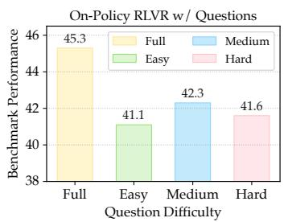  
(a) Test Performance.

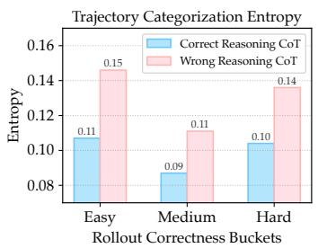  
(b) Reasoning Chain Validity.

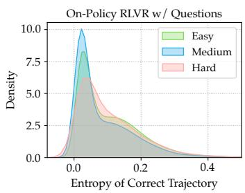  
(c) Entropy Distribution.  
Figure 1: Analysis of question difficulty and entropy in on-policy RLVR training: (a) Test performance of models trained on different question groups; (b) Entropy comparison between correct and incorrect trajectories; (c) Entropy distributions of logically correct trajectories across question groups;

Are all questions equally useful for training? During training, we categorize each question q into one of three difficulty buckets based on its online (rollout) correctness rate: Easy [75%, 100%), Medium (25%, 75%], and Hard (0, 25%]. This classification is computed online without additional decoding or offline annotation. We implement bucket-specific experiments by restricting each batch to questions from a single difficulty group, producing three models, along with one trained on the full set. Results in Figure 1a show that training on Medium questions yields the largest performance gains. In contrast, models trained exclusively on other questions perform substantially worse than the full-data baseline, yet they still provide complementary signals and should not be entirely discarded.

Does lower entropy imply better reasoning? We then test which metric can serve as an online proxy for reasoning quality. While outcome-based rewards check the final answer, they do not capture whether the reasoning CoT is logically correct or valid. To establish a reference, we follow previous work (Wen et al., 2025) to employ an LRM (Qwen3-32B; Yang et al. 2025) as an external judge, which inspects correct outputs and labels their reasoning validity (See Section F.2). As shown in Figure 1b, correct reasoning trajectories exhibit lower entropy than incorrect ones, indicating that selecting the lowest-entropy candidate generally yields higher CoT quality. We further examine the entropy distribution of correct trajectories across the three question groups in Figure 1c. Correct trajectories in the Medium group concentrate at lower entropy values, while Easy and Hard groups display broader distributions, with Hard problems peaking at higher entropy. This observation partly explains the marginal advantage of training on Medium-level questions compared to the other groups.

In summary, we highlight two guidelines: Medium-difficulty questions provide the most valuable optimization signals, and entropy minimization is an effective heuristic for trajectory selection.

Low-entropy trajectories mitigate misguided learning. Entropy magnitude (Chen et al., 2025b) is a key signal in RLVR training. Prior work shows that aggressively minimizing entropy can cause collapse (Cui et al., 2025b), motivating a more balanced exploration–exploitation strategy in experience management. While high-entropy policies encourage exploration, they can yield low-quality trajectories, many successes are merely lucky hits from incorrect reasoning chains.

Repeatedly sampling such misguided experiences from the replay buffer contaminates training, leading to systematic reasoning errors, we refer to a snowball effect. For instance, as illustrated in

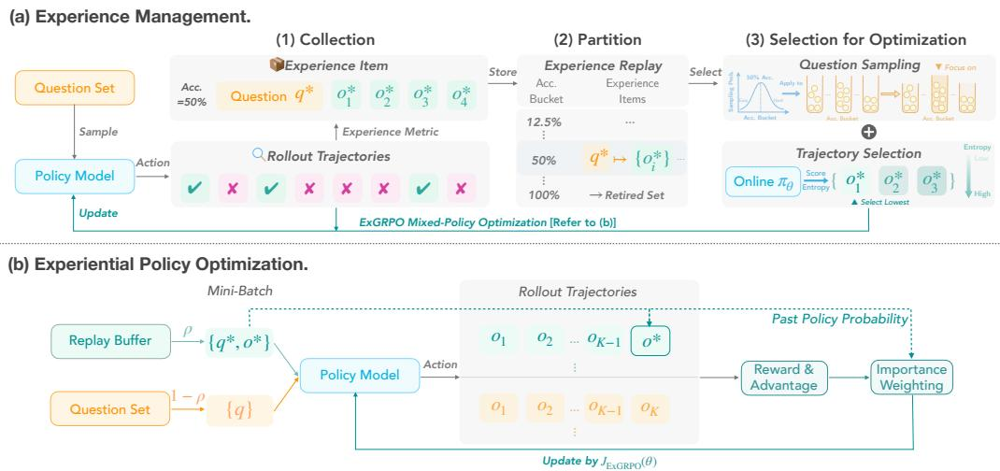  
Figure 2: Overview of Experiential Group Relative Policy Optimization (ExGRPO). ExGRPO operates in two phases: (a) Experience Management and (b) Policy Optimization (cf. Algorithm 1).

Section F.4, we observe models using invalid code blocks for math problems, traced to high-entropy trajectories in the buffer. Thus, entropy minimization should be a guiding principle for experience selection, especially early in training when stability matters most. However, balancing entropy reduction with exploration remains a non-trivial challenge, which we will detail in the methodology.

## 4 METHODOLOGY

Based on previous findings, we propose Experiential Group Relative Policy Optimization (ExGRPO) as shown in Figure 2, a method that leverages structured experience replay with entropy-based trajectory selection to enhance sample efficiency while preserving policy stability.

## 4.1 EXGRPO: EXPERIENCE MANAGEMENT

Problem Formulation. Given a dataset D and a reward model $r ( \cdot )$ , ExGRPO iteratively updates a policy model $\pi _ { \theta }$ by combining on-policy rollouts $\mathbb { E } _ { q \sim D , o \sim \pi _ { \theta _ { \mathrm { o l d } } } ( \cdot | q ) } \left[ r ( q , o ) \right]$ and experience replay $\mathbb { E } _ { q ^ { * } \sim \mathcal { E } , o ^ { * } \sim \pi _ { \theta _ { \mathrm { p a s t } } } ( \cdot | q ^ { * } ) } \left[ r ( q ^ { * } , o ^ { * } ) \right]$ . The $\pi _ { \theta _ { \mathrm { o l d } } }$ is the rollout policy model before gradient updates, while $\pi _ { \theta _ { \mathrm { p a s t } } }$ is the previous one which generates the corresponding experiential trajectories. The buffer E is maintained as a key-value structure $q ^ { * } \mapsto \{ o ^ { * } \}$ , where each question is associated with a set of candidate trajectories. We next describe the three-stage experience management pipeline.

Experience Collection. During training, we collect the model’s successful trajectories for each question in the batch. For a given question q sampled from the dataset, the rollout policy $\pi _ { \theta _ { \mathrm { o l d } } }$ generates K trajectories, denoted as $\mathcal { G } _ { q } ^ { * } = \{ o _ { i } ^ { * } \} _ { i = 1 } ^ { K }$ . We then compute the correctness rate $\operatorname { A c c } ( \stackrel { \cdots } { q ^ { * } } ) = k / K$ where k is the number of successful trajectories verified by the reward model. All successful rollouts are stored in the replay buffer $\mathcal { E } ,$ , recorded as a mapping $q ^ { * } \mapsto \{ o ^ { * } \}$ . The associated correctness rate is saved together with the query and later used for experience partition.

Experience Partition. The replay buffer E is partitioned into buckets by each question’s latest correctness rate $\operatorname { A c c } ( q ^ { * } )$ , with $q ^ { * }$ as the indexing key. Prior work (Zhang & Zuo, 2025) reweights advantages based on correctness rates, whereas we leverage them to bucket experiences by difficulty. To prevent overfitting on trivial cases, we introduce a Retired Set: questions solved in all rollouts are removed from E, ensuring optimization focuses on partially solved questions. Xiong et al. (2025) also filters prompts by online correctness. In contrast, our retired-set strategy excludes mastered experience items.

Experience Selection. During optimization, ExGRPO retrieves a mini-batch of experiential samples from partitioned buffer E in two steps:

(1) Question Sampling. To prioritize experiences described in Section 3.2, each bucket is sampled with probability $p \propto \mathcal { N } ( \operatorname { A c c } ( q ^ { * } ) ; \mu , \sigma = 1 )$ , where $\mu$ is set to 0.5 in practice. This ensures that medium-difficulty questions are sampled more often than trivially easy or mostly failed ones, allowing biases sampling towards the “sweet spot” questions.

(2) Trajectory Selection. For each sampled question, we select the trajectory with the lowest entropy under the current policy without relying on an external judge, i.e., $\begin{array} { r } { o ^ { * } \gets \arg \operatorname* { m i n } _ { o _ { i } \in \{ o ^ { * } \} } H ( o _ { i } ; \pi _ { \theta } ) } \end{array}$ thereby prioritizing trajectories which indicate better CoT quality as discussed in Section 3.2.

After three-stage management, selected experiences are used for mixed-policy optimization.

## 4.2 EXGRPO: EXPERIENTIAL POLICY OPTIMIZATION

The core idea of ExGRPO optimization is to unify on-policy exploration with off-policy replay under a joint objective, while correcting the distribution shift. At each step, a mini-batch B is constructed from: (1) on-policy samples $\scriptstyle B _ { \mathrm { o n } }$ from dataset D, and (2) experiential samples $B _ { \mathrm { e x p } }$ from buffer $\mathcal { E } .$ A hyperparameter $\rho \in [ 0 , 1 )$ determines the experiential proportion, with $| \hat { B } _ { \mathrm { e x p } } | = \mathrm { m i n } ( \lfloor \rho B \rfloor , \lvert \mathcal { E } \rvert )$ and $| \mathbf { \dot { \boldsymbol { B } } _ { \mathrm { o n } } } | = B - | \dot { B } _ { \mathrm { e x p } } |$ . This ensures a lower bound in cases where the experience replay buffer is depleted. The overall ExGRPO objective is a combination of two components:

The on-policy objective $\mathcal { I } _ { \mathrm { o n } } ( \theta )$ follows GRPO in Eq. 3: for each query $q \sim B _ { \mathrm { o n } } , K$ trajectories $\{ o _ { i } \} _ { i = 1 } ^ { K }$ are sampled from policy $\pi _ { \theta _ { \mathrm { o l d } } }$ to form an advantage group $\mathcal { G } _ { q }$ , with objective $\mathcal { I } _ { \mathrm { G R P O } } ( q , \mathcal { G } _ { q } ; \theta )$ For the experiential off-policy objective, given $q ^ { * } \sim B _ { \mathrm { e x p } } .$ , we form a mixed advantage estimation group $\mathcal { G } _ { q ^ { * } } = \{ o ^ { * } \} \cup \{ o _ { i } \} _ { i = 1 } ^ { K - 1 }$ , where $o ^ { * }$ is a replayed trajectory from past policy $\pi _ { \theta _ { \mathrm { p a s t } } }$ and $\left\{ o _ { i } \right\}$ are new rollouts from current reference policy $\pi _ { \theta _ { \mathrm { o l d } } }$ . To obtain an unbiased policy gradient estimate from the replayed trajectory, $o ^ { * }$ is reweighted by $\begin{array} { r } { \begin{array} { r } { \overline { { w _ { t } ^ { * } } } ( \theta ) = \frac { \pi _ { \theta } ( o _ { t } ^ { * } | q ^ { * } , o _ { < t } ^ { * } ) } { \pi _ { \theta _ { \mathrm { p a s t } } } ( o _ { t } ^ { * } | q ^ { * } , o _ { < t } ^ { * } ) } } \end{array} } \end{array}$ . All trajectories in $\mathcal { G } _ { q ^ { * } }$ use GRPO advantage estimates $\widehat { A }$ in Eq. 2. Finally, the unified objective is:

$$
\begin{array}{l} \mathcal {J} _ {\text {ExGRPO}} (\theta) = \underbrace {(1 - \rho) \cdot \mathbb {E} _ {q \sim \mathcal {B} _ {\text {on}}} \left[ \frac {1}{K} \sum_ {i = 1} ^ {K} \operatorname{CLIP} (w _ {i} (\theta) , \widehat {A} (o _ {i} , \mathcal {G} _ {q})) \right]} _ {\text {Expansion of On - policy objective} \mathcal {J} _ {\text {GRPO}} (q, \mathcal {G} _ {q}; \theta)} \\ + \underbrace {\rho \cdot \mathbb {E} _ {q ^ {*} \sim \mathcal {B} _ {\text {exp}}} \left[ \frac {1}{K} \left(\operatorname{CLIP} (w ^ {*} (\theta) , \widehat {A} (o ^ {*} , \mathcal {G} _ {q ^ {*}})) + \sum_ {i = 1} ^ {K - 1} \operatorname{CLIP} (w _ {i} (\theta) , \widehat {A} (o _ {i} , \mathcal {G} _ {q ^ {*}}))\right) \right]} _ {\text {Experiential Off - Policy objective}} \end{array}\tag{4}
$$

Directly optimizing on replayed trajectories, which are often selected for their low entropy, can hurt the exploration in the RLVR. We introduce two mechanisms to ensure stable and effective learning:

Policy Shaping for Entropy Preservation. Inspired by Yan et al. (2025), we modulate the gradient from experiential data using policy shaping. We replace $^ { \mathrm { \tiny ~ \cdot ~ } } \mathrm { C L I P ^ { \mathrm { \tiny ~ \cdot ~ } } }$ term of importance sampling for $o ^ { * }$ in Eq. 4 with $f ( w ^ { * } ( \theta ) ) \cdot \widehat { A } ( o ^ { * } , \mathcal { G } _ { q ^ { * } } )$ , where $\textstyle f ( x ) = { \frac { x } { x + \beta } }$ is a non-linear transformation with a small constant $\beta = 0 . 1$ . This amplifies low-probability signals and dampens high-probability ones within the replayed trajectory, encouraging the model to learn from its more novel aspects from experience.

Delayed Start Mechanism. To mitigate the collection of low-quality trajectories during the initial training stages when the model’s capabilities are still developing, we employ a delayed start. The on-policy RLVR process runs first, and ExGRPO is activated only after the Pass@1 metric for a training batch surpasses a predefined threshold, ensuring experiential samples are of higher quality.

## 5 EXPERIMENTS

## 5.1 EXPERIMENTAL SETUP

Data and Evaluation. We train on the OpenR1-Math 45k subset (Face, 2025; Yan et al., 2025) and evaluate on nine challenging reasoning benchmarks. Six are in-distribution math benchmarks:

Table 1: Overall in-distribution and out-of-distribution performance based on Qwen2.5-Math-7B. Bold and underline indicate the best and second-best results within a comparable group, respectively.

<table><tr><td rowspan="2">Model</td><td colspan="7">In-Distribution Performance</td><td colspan="4">Out-of-Distribution Performance</td></tr><tr><td>AIME24</td><td>AIME25</td><td>AMC</td><td>MATH-500</td><td>Minerva</td><td>Olympiad</td><td>Avg.</td><td>ARC-c</td><td>GPQA*</td><td>MMLU-Pro</td><td>Avg.</td></tr><tr><td>Qwen-Base</td><td>11.5</td><td>4.9</td><td>31.3</td><td>43.6</td><td>7.4</td><td>15.6</td><td>19.0</td><td>18.2</td><td>11.1</td><td>16.9</td><td>15.4</td></tr><tr><td>Qwen-Instruct</td><td>12.5</td><td>10.2</td><td>48.5</td><td>80.4</td><td>32.7</td><td>41.0</td><td>37.6</td><td>70.3</td><td>24.7</td><td>34.1</td><td>43.0</td></tr><tr><td colspan="12">Previous Zero RLVR Methods</td></tr><tr><td>PRIME-Zero</td><td>17.0</td><td>12.8</td><td>54.0</td><td>81.4</td><td>39.0</td><td>40.3</td><td>40.7</td><td>73.3</td><td>18.2</td><td>32.7</td><td>41.4</td></tr><tr><td>Oat-Zero</td><td>33.4</td><td>11.9</td><td>61.2</td><td>78.0</td><td>34.6</td><td>43.4</td><td>43.7</td><td>70.1</td><td>23.7</td><td>41.7</td><td>45.2</td></tr><tr><td>GPG-Zero</td><td>29.8</td><td>12.1</td><td>67.8</td><td>80.8</td><td>30.9</td><td>44.7</td><td>44.4</td><td>70.3</td><td>40.4</td><td>50.5</td><td>41.6</td></tr><tr><td>RePO-Zero</td><td>19.8</td><td>10.2</td><td>54.0</td><td>76.8</td><td>34.2</td><td>40.1</td><td>39.2</td><td>73.8</td><td>24.2</td><td>42.5</td><td>46.8</td></tr><tr><td colspan="12">Zero RLVR with ExGRPO</td></tr><tr><td>On-Policy</td><td>24.9</td><td>15.5</td><td>59.2</td><td>84.8</td><td>38.2</td><td>49.3</td><td>45.3</td><td>82.6</td><td>37.4</td><td>49.2</td><td>56.4</td></tr><tr><td>ExGRPO</td><td>31.6</td><td>18.7</td><td>66.3</td><td>87.4</td><td>36.0</td><td>50.1</td><td>48.3</td><td>84.7</td><td>37.4</td><td>52.9</td><td>58.3</td></tr><tr><td colspan="12">Off-policy Learning Methods</td></tr><tr><td>SFT</td><td>22.2</td><td>22.3</td><td>52.8</td><td>82.6</td><td>40.8</td><td>43.7</td><td>44.1</td><td>75.2</td><td>24.7</td><td>42.7</td><td>47.5</td></tr><tr><td>SFT+RL</td><td>25.8</td><td>23.1</td><td>62.7</td><td>87.2</td><td>39.7</td><td>50.4</td><td>48.2</td><td>72.4</td><td>24.2</td><td>37.7</td><td>44.8</td></tr><tr><td colspan="12">Continual RLVR with ExGRPO</td></tr><tr><td>LUFFY</td><td>29.4</td><td>23.1</td><td>65.6</td><td>87.6</td><td>37.5</td><td>57.2</td><td>50.1</td><td>80.5</td><td>39.9</td><td>53.0</td><td>57.8</td></tr><tr><td> $\hookrightarrow$  Continual LUFFY</td><td>30.7</td><td>22.5</td><td>66.2</td><td>86.8</td><td>41.2</td><td>55.3</td><td>50.4</td><td>81.8</td><td>49.0</td><td>54.7</td><td>61.8</td></tr><tr><td> $\hookrightarrow$  On-Policy</td><td>24.8</td><td>17.8</td><td>67.5</td><td>88.4</td><td>38.6</td><td>55.3</td><td>48.7</td><td>81.9</td><td>47.0</td><td>53.3</td><td>60.7</td></tr><tr><td> $\hookrightarrow$  ExGRPO</td><td>32.3</td><td>25.7</td><td>65.6</td><td>87.6</td><td>40.1</td><td>57.0</td><td>51.4</td><td>83.6</td><td>42.4</td><td>54.5</td><td>60.2</td></tr></table>

AIME 2024/2025, AMC (Li et al., 2024), MATH-500 (Hendrycks et al., 2021), Minerva (Lewkowycz et al., 2022), and OlympiadBench (He et al., 2024). To assess generalization, we include three out-of-distribution tasks: ARC-c (Clark et al., 2018), GPQA-Diamond (“GPQA∗”; Rein et al. 2024), and MMLU-Pro (Wang et al., 2024). For AIME, AMC benchmarks with a limited number of samples, we report Avg@32 over 32 independent runs; for others, we use Pass@1 metric, representing the proportion of solved problems on a single attempt. All evaluations use a sampling temperature of 0.6 and a top-p of 1.0, with answers extracted via the Oat-evaluator toolkit (Liu et al., 2025).

RLVR Setups. We use a rollout batch size of 128 and an update batch size of 64. During the rollout stage, we collect 8 sampled responses for on-policy questions and 7 for questions drawn from the replay buffer. The ratio ρ of experience data in each mini-batch is set to 50%. For most models, the ExGRPO algorithm is activated only after the batch Pass@1 exceeds 35%. An exception is the Llama model, where this criterion is not applied due to the collapse of on-policy RLVR. Our experiments were conducted using the verl framework3 on either 8×H100, with Math-Verify4 as the reward model. More detailed training and validation settings are provided in Section E.1.

Models and Baselines. Our primary testbed for zero RLVR is the Qwen2.5-Math 7B model, and we also extend our evaluation to its 1.5B variant and other models, including Llama-3.1 8B (Base and Instruct) and Qwen2.5 7B Instruct models. Details of all baselines can be found in Section E.2.

## 5.2 MAIN RESULTS

ExGRPO surpasses on-policy baselines on complex reasoning benchmarks. Our main results in Table 1 show that ExGRPO consistently outperforms on-policy RLVR baselines across multiple benchmarks. When applied to the Qwen2.5-Math 7B model, ExGRPO delivers a +3.0 point gain over on-policy RLVR on math reasoning tasks. This advantage becomes more pronounced on challenging datasets such as AIME24/25, highlighting its effectiveness on difficult reasoning problems, and also holds on out-of-distribution benchmarks. A detailed comparison with the relevant replay-enhanced method in Section E.4 further shows that ExGRPO outperforms vanilla experiential RL baselines.

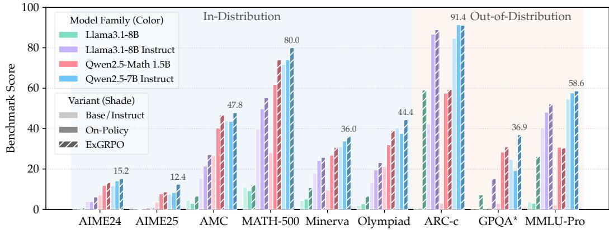  
Figure 3: A comparison of benchmark performance for different backbone models and training variants, showing performance on both in-distribution and out-of-distribution tasks (cf. Section E.3).

ExGRPO is robust across diverse model architectures and initializations. We validate that the benefits of ExGRPO are not limited to a single model in Figure 3 and Appendix Table 5. ExGRPO has consistent improvements over baselines when applied to models of varying scales, including 1.5B and 8B parameter models, as well as models initialized from instruction-tuned checkpoints. For these models, ExGRPO achieves in-distribution improvements of up to +5.3 points on Qwen2.5-Math 1.5B Base and +4.1 points on Qwen2.5-7B Instruct. Notably, ExGRPO addresses a critical instability issue observed in on-policy RLVR, enabling successful training of Llama-3.1 base model on our data where the on-policy baseline method collapses. In a further experiment using the LUFFY model, which was trained with external off-policy data, we find that continual RLVR with model own experience yields greater performance gains than relying on external data. However, applying on-policy training to LUFFY still resulted in a degradation, highlighting the advantage of ExGRPO. We observe that ExGRPO underperforms on certain out-of-distribution tasks under continual RLVR setting, which we attribute to reduced on-policy exposure during joint mini-batch optimization with experience replay.

## 5.3 EXTENSION TO RL WITH CONTINUOUS REWARDS

Beyond the binary-reward RLVR setup, extending ExGRPO to standard RLHF with continuous preference-model rewards is a vital next step. In this setting, we replace rollout success rates with the within-query reward variance computed over multiple rollouts. Reward variance serves as a natural signal of difficulty, and trajectory entropy remains applicable as a measure of reasoning validity.

For each query q with K rollouts, we compute the reward standard deviation $\sigma _ { q } .$ Since $\sigma _ { q }$ has no intrinsic scale, we map it to a discrete difficulty bucket using relative, batchwise normalization. Given all variances $\left\{ \sigma _ { 1 } , \dots , \sigma _ { M } \right\}$ within the current batch, we apply a linear min-max normalization $\begin{array} { r l r } { \tilde { \sigma } _ { q } } & { = } & { \frac { \sigma _ { q } - \sigma _ { \mathrm { m i n } } } { \mathrm { m a x } ( \sigma _ { \mathrm { m a x } } - \sigma _ { \mathrm { m i n } } , \varepsilon ) } } \end{array}$ , where ε prevents degeneracy when the batch variance collapses. We then discretize $\tilde { \sigma } _ { q } ~ \in ~ [ 0 , 1 ]$ into $\{ 0 , \ldots , K _ { \mathrm { r o l l o u t } } \}$ via round $( \tilde { \sigma } _ { q } \cdot K _ { \mathrm { r o l l o u t } } )$ . Each query is then assigned to its corresponding bucket and updated using the ExGRPO mechanism originally developed for the binary-correctness setting.

Table 2: Preliminary results extending ExGRPO to RL with continuous rewards.

<table><tr><td>Method</td><td>ArenaHardV2</td><td>IFEval</td><td>IFBench</td><td>Avg.</td></tr><tr><td>GRPO</td><td>15.1</td><td>26.1</td><td>18.7</td><td>20.0</td></tr><tr><td>ExGRPO</td><td>16.4</td><td>27.9</td><td>20.7</td><td>21.7</td></tr></table>

Under this formulation, buckets still preserve the nature of discrete difficulty levels. As a result, ExGRPO’s sampling mechanism, which was previously centered around medium success rates, now preferentially selects queries with moderate reward variance, i.e., those that are neither overly stable nor excessively noisy. where learning gains are often most substantial.

These correspond to intermediate-difficulty queries where learning gains are often most substantial.

To validate feasibility, we conducted a study on 7k WildChat-IF samples (Zhao et al., 2025; Bhaskar et al., 2025) with on-policy RL training (2 epochs), using Qwen2.5-7B-Base as the base model and Skywork-Reward-Llama-3.1-8B-v0.2 (Liu et al., 2024) as the reward model. Results on chat and instruction-following benchmarks show a improvement of ExGRPO extension.

## 6 ANALYSIS AND DISCUSSION

To understand the effectiveness of ExGRPO, we investigate the following research questions: 1) How does experience replay influence training dynamics, especially for different models? 2) What is the impact of experience selection on overcoming performance bottlenecks? 3) How do the components of ExGRPO, e.g., experience management, contribute to overall performance?

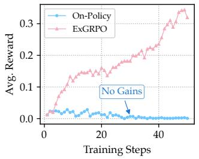

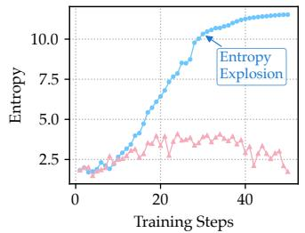

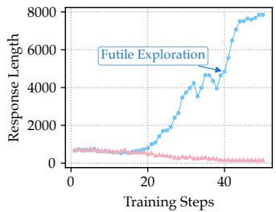  
Figure 4: Learning dynamics of On-Policy vs. ExGRPO during training Llama-3.1 8B. ExGRPO stabilizes training and achieves higher rewards, while on-policy suffers from training collapse.

## 6.1 TRAINING DYNAMICS

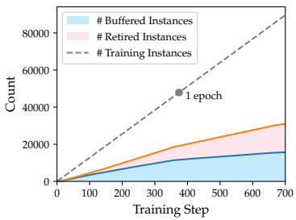  
Figure 5: Dynamics of experience replay buffer and retried set.

Experience replay helps stabilize training for weaker models. Figure 4 depicts the training dynamics of the Llama3.1-8B base model. Due to its limited capacity, this model struggles to solve most problems, resulting in low rewards under on-policy training. Consequently, the exploration signal collapses, and the model finally encountered entropy explosion on challenging training data. In contrast, experience replay allows the model to exploit the “lucky hits” of correct solutions encountered early on. By replaying these successes, the model receives meaningful reward signals and is guided toward an exploration trajectory that matches its current capability, thereby stabilizing learning and preventing premature collapse.

Experience replay improves data efficiency. For stronger model, Figure 5 shows the evolution of the replay buffer and retired set. Their sum reflects the number of examples on which the model eventually succeeds. By the later stages, about half of the dataset achieves at least one successful trajectory (Pass@8), validating the promise of experiential learning: the model retains strong reasoning potential, and revisiting past successes enhances data utilization. The retired set further enhances efficiency: although initially small, it grows rapidly as capability improves and eventually matches the buffer in size. Retiring solved problems shifts training toward harder ones, reducing redundancy and explaining the slower buffer growth in later phases.

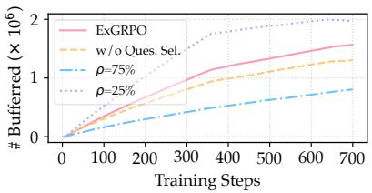

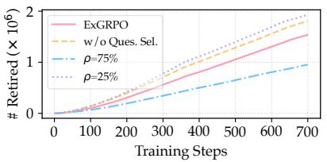

## The efficiency of experience utilization, rather than its sheer volume, is the primary driver of model performance. Figure 6 illustrates the dynamics of the experience

Figure 6: Dynamics of experience under different data conditions.

buffer and the retired set under different data conditions. When trained on the same amount of data, the absence of question selection mechanisms (e.g., ExGRPO vs. w/o Ques. Sel.) leads to growth of the retired set and a corresponding reduction in buffer size (primarily due to repeated exposure to easy questions). As a result, experience replay becomes inefficient, with high consumption of samples but low return in terms of performance gains. We further examine the scaling effects of the experience replay ratio, ρ. A high ratio $( \rho = 7 5 \% )$ leads to over-exploitation, stifling exploration and degrading performance below the on-policy baseline. Conversely, a low ratio $( \rho = 2 5 \% )$ prioritizes fresh on-policy learning; however, while it enlarges the experience buffer, the retired set grows only marginally. This indicates that accumulating more experiences does not guarantee improved capabilities. Ultimately, effective replay relies on balancing exploration with efficient sample reuse rather than simply maximizing buffer size, with optimal performance achieved at a balanced $\rho = 5 0 \%$ (see results in Appendix Table 6).

## 6.2 ABLATION STUDIES

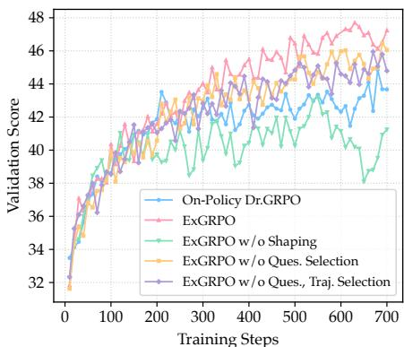  
Figure 7: Comparison of validation performance of different ExGRPO variants.

Empirical ablation supports ExGRPO’s selection heuristics. We conduct an ablation study to assess the contributions of core components of ExGRPO. Figure 7 shows performance dynamics of validation set (see Section E.1). For both question and trajectory selection, our analytically derived heuristics consistently outperform random selection, while random selection itself offers marginal gains over the on-policy baseline. Policy shaping mitigates this by ensuring exploitation does not hinder exploration. It is also noteworthy that applying shaping alone in on-policy RLVR yields no improvement (Yan et al., 2025), confirming that ExGRPO’s gains cannot be attributed to naive shaping. The above results and additional ablations on test set (see Section E.4) provide empirical support for our design of ExGRPO.

Sensitivity to difficulty sampling strategies. Our method employs a probabilistic sampling scheme based on a Gaussian distribution $p \propto \mathcal { N } ( \operatorname { A c c } ( q ) ; \mu = 0 . 5 , \sigma )$ . To assess the sensitivity of ExGRPO to the width of this distribution, we vary $\sigma \in \{ 0 . 5 , 1 . 5 \}$ . A smaller σ corresponds to a narrower medium-difficulty band, whereas a larger σ approaches a near-uniform sampling distribution. We also evaluate a Hard-Biased variant by shifting the mean to $\mu = 0 . 2 5$ , which emphasizes harder samples (25% accuracy) while reducing the chance of revisiting easier ones (75% accuracy). As shown in Table 3, the asymmetric sampling strategies yield inferior performance compared with the symmetric medium-difficulty focus $( \mu = 0 . 5 )$ , confirming that balanced uncertainty regions provide the most effective signal.

Table 3: Sensitivity analysis of the Gaussian sampler with varying sampling focus and bias. Bold indicates the best results across settings for each column.

<table><tr><td rowspan="2">Sampling Strategy</td><td colspan="7">In-Distribution Performance</td><td colspan="4">Out-of-Distribution Performance</td></tr><tr><td>AIME24</td><td>AIME25</td><td>AMC</td><td>MATH</td><td>Minerva</td><td>Olympiad</td><td>Avg.</td><td>ARC-c</td><td>GPQA*</td><td>MMLU-P</td><td>Avg.</td></tr><tr><td>On-Policy</td><td>24.9</td><td>15.5</td><td>59.2</td><td>84.8</td><td>38.2</td><td>49.3</td><td>45.3</td><td>82.6</td><td>37.4</td><td>49.2</td><td>56.4</td></tr><tr><td>ExGRPO, (μ=0.5, σ=1)</td><td>31.6</td><td>18.7</td><td>66.3</td><td>87.4</td><td>36.0</td><td>50.1</td><td>48.4</td><td>84.7</td><td>37.4</td><td>52.9</td><td>58.3</td></tr><tr><td>Wider Focus (σ=1.5)</td><td>22.0</td><td>19.2</td><td>62.3</td><td>85.4</td><td>38.2</td><td>49.9</td><td>46.2</td><td>81.7</td><td>44.4</td><td>48.6</td><td>58.2</td></tr><tr><td>Narrower Focus (σ=0.5)</td><td>24.9</td><td>17.4</td><td>64.9</td><td>86.6</td><td>34.2</td><td>49.0</td><td>46.2</td><td>72.9</td><td>40.4</td><td>51.1</td><td>54.8</td></tr><tr><td>Hard-Biased (μ=0.25)</td><td>22.4</td><td>19.6</td><td>61.9</td><td>86.0</td><td>38.2</td><td>49.8</td><td>46.3</td><td>83.6</td><td>41.4</td><td>49.4</td><td>58.2</td></tr></table>

## 7 CONCLUSION

While experiential RL offers a promising approach to mitigate sample inefficiency in RLVR for large reasoning models, this area still lacks systematic exploration of experience value and management. In this work, we address this gap by first examining what constitutes a valuable reasoning experience, then introducing ExGRPO, a framework that strategically manages, selects and replays high-quality experiences. Experiments across multiple backbones and benchmarks show that ExGRPO consistently improves performance and stabilizes training where on-policy RLVR fails.