## ABSTRACT

As single-center computing approaches power constraints, decentralized training becomes essential. However, traditional Reinforcement Learning (RL) methods, crucial for enhancing large model post-training, cannot adapt to decentralized distributed training due to the tight coupling between parameter learning and rollout sampling. For this, we propose HeteroRL, a heterogeneous RL architecture that decouples these processes, enabling stable training across geographically distributed nodes connected via the Internet. The core component is Group Expectation Policy Optimization (GEPO), an asynchronous RL algorithm robust to latency caused by network delays or heterogeneity in computational resources. Our study reveals that high latency significantly increases KL divergence, leading to higher variance of importance weights and training instability. GEPO mitigates this issue by using group expectation weighting to exponentially reduce the variance of importance weights, with theoretical guarantees. Experiments show GEPO achieves superior stability—only a 3% performance drop from online to 1800s latency—and reduces the best-to-last gap by 85% versus GSPO ( $\Delta=1.8$ vs. 12.0) while attaining the highest scores, highlighting its effectiveness in decentralized, resource-heterogeneous environments. Code is available at https://github.com/HanlardResearch/Hetero-RL.

$$
\hat {A} _ {i, t} = \frac {R (x , y ^ {i}) - \mathrm{mean} \{R (x , y ^ {1}) , \ldots , R (x , y ^ {G}) \}}{\mathrm{std} \{R (x , y ^ {1}) , \ldots , R (x , y ^ {G})}
$$

$$
\mathcal {L} _ {\mathrm{GRPO} _ {i, t}} = \min \left[ \frac {\pi_ {\theta} (y _ {t} ^ {i} \mid x , y _ {<   t} ^ {i})}{\pi_ {\theta_ {\mathrm{old}}} (y _ {t} ^ {i} \mid x , y _ {<   t} ^ {i})} \hat {A} _ {i, t}, c l i p _ {1 \pm \epsilon} \left[ \frac {\pi_ {\theta} (y _ {t} ^ {i} \mid x , y _ {<   t} ^ {i})}{\pi_ {\theta_ {\mathrm{old}}} (y _ {t} ^ {i} \mid x , y _ {<   t} ^ {i})} \right] \hat {A} _ {i, t} \right]
$$

$$
\boxed { \begin{array}{c} \hat {A} _ {i} = \frac {R (x , y ^ {i}) - \operatorname * {m e a n} \{R (x , y ^ {1}) , \ldots , R (x , y ^ {G}) \}}{\operatorname * {s t d} \{R (x , y ^ {1}) , \ldots , R (x , y ^ {G})} \quad \mathbf {G S P O} \\ \mathcal {L} _ {\mathrm{GSPO} _ {i}} = \min \left[ \frac {\pi_ {\theta} (y ^ {i} \mid x)}{\pi_ {\theta_ {\mathrm{old}}} (y ^ {i} \mid x)} \hat {A} _ {i}, c l i p _ {1 \pm \varepsilon} \left[ \frac {\pi_ {\theta} (y ^ {i} \mid x)}{\pi_ {\theta_ {\mathrm{old}}} (y ^ {i} \mid x)} \right] \hat {A} _ {i} \right] \end{array} }
$$

$$
\boxed { \begin{array}{c} \hat {A} _ {i} = \frac {R (x , y ^ {i}) - \text {mean} \{R (x , y ^ {1}) , \ldots , R (x , y ^ {G}) \}}{\underline {{\text {std} \{R (x , y ^ {1}) , \ldots , R (x , y ^ {G})}}}} \quad \mathbf {G E P O} \\ \mathcal {L} _ {\mathrm{GEPO} _ {i}} = \min \left[ \underbrace {\frac {\pi_ {\theta} (y ^ {i} \mid x)}{\mathbb {E} _ {\pi_ {\theta_ {\mathrm{old}}} (\cdot | x) \pi_ {\theta_ {\mathrm{old}}} (y | x)}} \hat {A} _ {i} , c l i p _ {1 \pm \varepsilon} \left[ \frac {\pi_ {\theta} (y ^ {i} \mid x)}{\mathbb {E} _ {\pi_ {\theta_ {\mathrm{old}}} (\cdot | x) \pi_ {\theta_ {\mathrm{old}}} (y \mid x)}} \right] \hat {A} _ {i}} _ {\text {Group Expectation}} \right] \end{array}
$$

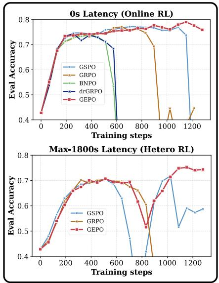  
Figure 1: Left: GEPO improves upon GRPO and GSPO by employing group-level importance weights to enhance training stability. Right: In both zero-delay (online) and high-delay (up to 1800 seconds) heterogeneous reinforcement learning scenarios, GEPO demonstrates superior stability and better evaluation performance.

## 1 INTRODUCTION

Training ever-larger AI models (Achiam et al., 2023; Dubey et al., 2024; Yang et al., 2025) is pushing the limits of single datacenters, making decentralized training across geographically distributed, heterogeneous nodes connected via the Internet an increasingly necessary pursuit (Team et al., 2025; Noukhovitch et al., 2024). Reinforcement Learning (RL), crucial for post-training LLMs on complex tasks like mathematical reasoning (Shao et al., 2024), faces a fundamental systemic challenge in this emerging paradigm: traditional RL frameworks (Guo et al., 2025; Stiennon et al., 2020; Bai et al., 2022; Wu et al., 2025; Dai et al., 2024; Fu et al., 2025) are architecturally incompatible with decentralized environments. Their tight coupling between rollout sampling and parameter learning demands strict synchronization — a requirement that becomes untenable under the high network latency and computational heterogeneity inherent in real-world distributed settings.

This architectural incompatibility manifests in two critical bottlenecks. First, synchronous frameworks force computational resources (e.g., GPUs) to idle while waiting for the slowest processes—such as generating long reasoning chains—severely constraining efficiency (Fu et al., 2025). Second, and more fundamentally, the inevitable network latency inherent in decentralized, Internet-connected environments creates a temporal gap (policy staleness) between the sampler (generating data) and the learner (updating parameters). Most existing RL algorithms, designed for homogeneous, low-latency clusters, are ill-equipped to handle this staleness. As our analysis reveals, high latency significantly inflates KL divergence, causing the variance of importance weights to explode—ultimately leading to training instability or reward collapse (Song et al., 2023). This renders conventional RL methods impractical for real-world, geographically distributed training scenarios.

To tackle these systemic bottlenecks, we introduce HeteroRL (Heterogeneous Reinforcement Learning), a novel RL framework explicitly architected for asynchronous, geographically distributed, and resource-heterogeneous environments. HeteroRL is designed to enable efficient and stable training of large language models for complex tasks such as mathematical reasoning, even under high network latency. At its core, HeteroRL decouples the two computationally intensive phases of the RL pipeline — rollout sampling and parameter learning — and deploys them on physically or logically independent nodes with potentially heterogeneous hardware (e.g., mixing NVIDIA and Ascend chips). The sampler nodes continuously generate reasoning trajectories without interruption, while the learner node asynchronously consumes this data to update model parameters. Critically, neither component waits for the other: communication occurs infrequently and tolerates high latency, with model checkpoints and rollout batches exchanged over the Internet.

To address the instability arising from KL divergence under high-latency conditions, we introduce Group Expectation Policy Optimization (GEPO), a novel policy gradient algorithm that stabilizes asynchronous RL under high latency by replacing fragile token/sample-level importance weights with robust group-level importance weights — allowing samplers and learners to operate independently, communicating infrequently and tolerating arbitrary delays. This shift fundamentally improves the quality of gradient estimation — transforming a high-variance, unstable estimator into a low-variance, robust one, especially under large policy divergence. As we prove in Theorem 1, GEPO exponentially reduces the variance of importance weights under high KL divergence — precisely the regime where traditional methods like GRPO and GSPO collapse. Crucially, GEPO is not an ad hoc fix — it is a principled algorithmic response to the root cause of instability: variance explosion under policy divergence.

In summary, our key contributions are as follows:

Framework: We propose HeteroRL, an asynchronous reinforcement learning framework designed for heterogeneous compute networks, enabling decentralized training of large language models (LLMs) on mathematical reasoning tasks.

Insight: We identify a strong correlation between latency and the KL divergence between the rollout sampler and the learner. High latency induces high KL divergence, leading to training instability and reward collapse.

Algorithm: We introduce Group Expectation Policy Optimization (GEPO), which improves upon the importance sampling mechanism in GRPO (Shao et al., 2024). We theoretically show that GEPO exponentially reduces the variance of importance weights, and empirically demonstrate its superior stability and efficiency — not only under high-latency conditions, but also in the ideal zero-latency setting.

This work provides both algorithmic and system-level advancements for scalable LLM RL-training and establishes a practical foundation for large-scale distributed AI training in future heterogeneous compute network environments.

## 2 BACKGROUND

## 2.1 PROBLEM DEFINITION AND NOTATION

Consider a standard policy gradient framework. Let $\pi_{\theta}$ denote the language model policy (i.e., the Actor) parameterized by $\theta$ , x be an input prompt of a Dataset D (e.g., math problems), and y be the output sequence generated by the model (e.g., a chain-of-thought solution). We define the following core notation:

\- $\pi_{\theta_k}$ (short for $q$ ): the policy used by the sampler at time step $k$ to generate rollout trajectories.

\- $\pi_{\theta_{k + \tau}}$ (short for $p$ ): the latest policy at the learner at time step $k + \tau$ , used for gradient updates.

\- $\tau (\geq 0)$ : policy staleness, representing the discrepancy in policy versions between the sampler and the learner, caused by network delays and computational asynchrony.

\- $y$ : a trajectory sampled from the stale policy $\pi_{\theta_k}$ . $y_t^i$ denotes the $t$ -th token of the $i$ -th response in a group.

\- $r(x, y)$ : the reward for response $y$ given input $x$ .

\- $A(x,y)$ : the advantage for response $y$ to input $x$ , typically defined as $A(x,y) = r(x,y) - b(x)$ , where $b(x)$ is a baseline reward computed for input $x$ . In this paper, we use the within-group average reward (Shao et al., 2024) as the baseline $b(x) = \frac{1}{G} \sum_{i=1}^{G} r(x,y^i)$ where $G$ is the group size.

The goal of HeteroRL is to optimize the policy $\pi_{\theta}$ to maximize the expected cumulative reward. To reduce gradient variance, an advantage function is used, leading to the objective:

$$
\mathcal {L} (\theta) = \mathbb {E} _ {x \sim \mathcal {D}, y \sim \pi_ {\theta_ {k}} (\cdot | x)} \left[ \frac {\pi_ {\theta_ {k +} \boxed {\tau}} (y | x)}{\pi_ {\theta_ {k}} (y | x)} \cdot A (x, y) \right],\tag{1}
$$

where $\tau$ is a random variable. For online RL, $\tau \equiv 0$ .

## 3 GEPO: GROUP EXPECTATION POLICY OPTIMIZATION

Our method builds upon the group-based policy optimization paradigm of GRPO and introduces the group expectation importance sampling mechanism. We emphasize a paradigm shift from token-level to group-level importance weighting, which significantly reduces the variance of importance weights and alleviates gradient instability during training.

## 3.1 GROUP EXPECTATION IMPORTANCE WEIGHTING

To enhance the stability of importance weights, we propose the Group Expectation Importance Weight (GEIW), which replaces the individual proposal probability $q(y|x)$ in the standard importance weight $\frac{p(y|x)}{q(y|x)}$ with its group-wise expected value under the current prompt x, denoted as $\widehat{\mathbb{E}}_{q}[q(y|x)]$ . Inspired by GRPO, for each input x, we generate a group of G responses $\{y^{1},\ldots,y^{G}\}\sim q(\cdot|x)$ to form a sampling group. Since G is typically much smaller than the full policy space and top-P/top-K sampling leads to $\sum_{i=1}^{G}q(y^{i}|x)\gg1$ , the vector $(q(y^{1}|x),\ldots,q(y^{G}|x))$ does not constitute a valid probability distribution. Simply using the arithmetic mean $\frac{1}{G}\sum_{i=1}^{G}q(y^{i}|x)$ would introduce bias due to ignoring the relative sampling probabilities. To obtain a more accurate estimate, we employ a weighted expectation:

$$
\widehat {\mathbb {E}} _ {q} [ q (y | x) ] \approx \sum_ {i = 1} ^ {G} \widehat {q (y ^ {i} | x)} \cdot q (y ^ {i} | x) = \frac {\sum_ {i = 1} ^ {G} q (y ^ {i} | x) ^ {2}}{\sum_ {i = 1} ^ {G} q (y ^ {i} | x)},\tag{2}
$$

where $\widehat{q(y^{i}|x)}=\frac{q(y^{i}|x)}{\sum_{i=1}^{G}q(y^{i}|x)}$ is the within-group normalized probability, serving as an empirical estimate of the sampling likelihood of each $y_{i}$ . We define the GEIW importance weight as:

$$
w _ {\mathrm{GEIW}} (y | x) = \frac {p (y | x)}{\widehat {\mathbb {E}} _ {q} [ q (y | x) ]}.\tag{3}
$$

The key advantages of this mechanism are as follows:

Numerically stable and gradient-effective: The denominator is decoupled from any single $q(y|x)$ , avoiding extreme weight values when individual proposal probabilities approach zero. Although $\text{clip}(1\pm\epsilon)$ can also improve numerical stability, the gradients of the clipped tensors will be set to zero, effectively skipping this data point (ineffective gradient).

Biased yet low-variance: By leveraging within-group statistical information, GEIW provides a more reliable scale estimate. Even under large divergence between p and q, $\widehat{\mathbb{E}}_{q}[q(y|x)]$ remains well-conditioned, effectively preventing gradient explosion. Although this estimator introduces a small bias ( $w_{GEIW}$ is a biased estimator), both theoretical analysis (see Theorem 1) and empirical results demonstrate that it significantly reduces variance under high KL divergence, yielding more stable gradient directions and improved training convergence.

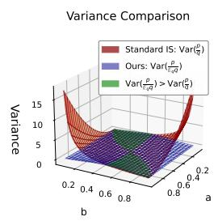

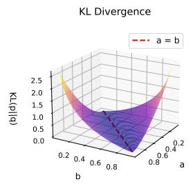

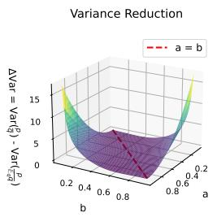

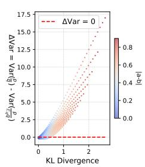

(a) Variance comparison of $\frac{p}{q}$ and $\frac{p}{\mathbb{E}_q[q]}$ under Bernoulli distributions, where $p\sim$ Bernoulli(a) and $q\sim$ Bernoulli(b).  
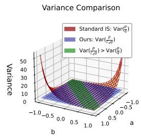

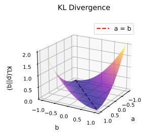

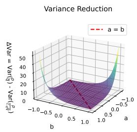

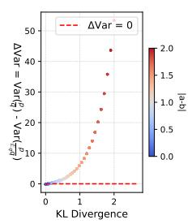  
(b) Variance comparison of $\frac{p}{q}$ and $\frac{p}{\mathbb{E}_q[q]}$ under Gaussian distributions, where $p \sim \mathcal{N}(a,1)$ and $q \sim \mathcal{N}(b,1)$ .  
Figure 2: In high-KL regions, $\mathrm{Var}[\frac{p(y|x)}{\widehat{\mathbb{E}}_q[q(y|x)]}\ll \mathrm{Var}[\frac{p(y|x)}{q(y|x)} ].$

Theorem 1. Let $p, q$ be discrete probability distributions. Then there exists a constant $C$ such that:

$$
\mathrm{Var} \left[ \frac {p (y | x)}{q (y | x)} \right] - \mathrm{Var} \left[ \frac {p (y | x)}{\widehat {\mathbb {E}} _ {q} [ q (y | x) ]} \right] \geq \boxed {\exp \left(D _ {\mathrm{KL}} (p \| q)\right)} - C.\tag{4}
$$

In particular, when $D_{\mathrm{KL}}(p||q) > \log C$ , it holds that $\operatorname{Var}\left[\frac{p(y|x)}{q(y|x)}\right] > \operatorname{Var}\left[\frac{p(y|x)}{\overline{\mathbb{E}}_q[q(y|x)]}\right]$ .

Theorem 1 shows that GEPO can exponentially reduce the variance of importance weights, making it particularly well-suited for heterogeneous RL training under high KL divergence. The full mathematical proof is provided in Appendix A. As shown in Figure 2, we visualize the relationship between KL divergence and importance weight variance when both p and q are Bernoulli or Gaussian distributions with varying parameters. The results indicate that in the high-KL regime, the group expectation approach significantly reduces the variance of importance weights, which benefits training stability under high network latency. Nevertheless, there exist regimes—such as the green regions in the plots—where our method incurs a slight increase in variance.

The difference across all GRPO-like algorithms lies in the computation of the importance weights, as detailed in Listing 1:

```python
if self.loss_type in ["grupo", "dr_grpo", "bnpo']: # Token level
    coef_1 = learner_token_p / sampler_token_p
elif self.loss_type == "gspo": # Sequence level
    coef_1 = learner_seq_p / sampler_seq_p
elif self.loss_type == "gepo": # Group level
    hat_q = sampler_seq_p.detach() / (sampler_seq_p.sum().detach())
    coef_1 = learner_seq_p / (hat_q * sampler_seq_p).sum()
```

Listing 1: Coefficient computation for different policy optimization methods

## 3.2 GRADIENT COMPARISON ACROSS TOKENS

What does the GEPO update do? For a mechanistic understanding of GEPO, it is useful to analyze the gradient of the loss function $L_{GEPO}$ . The equivalent gradient of each token in a group with respect to the parameters $\theta$ of GRPO, GSPO and GEPO can be written as:

$$
\frac {\partial \mathcal {L} (\boldsymbol {\theta})}{\partial \boldsymbol {\theta}} = \mathbf {A} \odot \underbrace {\left[ \begin{array}{c c c} \frac {p _ {1 , 1} ^ {\prime} (\boldsymbol {\theta})}{q _ {1 , 1}} & \ldots & \frac {p _ {1 , T} ^ {\prime} (\boldsymbol {\theta})}{q _ {1 , T}} \\ \vdots & \ddots & \vdots \\ \frac {p _ {G , 1} ^ {\prime} (\boldsymbol {\theta})}{q _ {G , 1}} & \ldots & \frac {p _ {G , T} ^ {\prime} (\boldsymbol {\theta})}{q _ {G , T}} \end{array} \right]} _ {\text {GRPO}} \text {or} \underbrace {\left[ \begin{array}{c c c} \frac {p _ {1 , 1} ^ {\prime} (\boldsymbol {\theta})}{q _ {1}} & \ldots & \frac {p _ {1 , T} ^ {\prime} (\boldsymbol {\theta})}{q _ {1}} \\ \vdots & \ddots & \vdots \\ \frac {p _ {G , 1} ^ {\prime} (\boldsymbol {\theta})}{q _ {G}} & \ldots & \frac {p _ {G , T} ^ {\prime} (\boldsymbol {\theta})}{q _ {G}} \end{array} \right]} _ {\text {GSPO}} \text {or} \underbrace {\left[ \begin{array}{c c c} \frac {p _ {1 , 1} ^ {\prime} (\boldsymbol {\theta})}{\mathbb {E} _ {q} q} & \ldots & \frac {p _ {1 , T} ^ {\prime} (\boldsymbol {\theta})}{\mathbb {E} _ {q} q} \\ \vdots & \ddots & \vdots \\ \frac {p _ {G , 1} ^ {\prime} (\boldsymbol {\theta})}{\mathbb {E} _ {q} q} & \ldots & \frac {p _ {G , T} ^ {\prime} (\boldsymbol {\theta})}{\mathbb {E} _ {q} q} \end{array} \right]} _ {\text {GEPO (ours)}},\tag{5}
$$

where $A \in R^{G \times T}$ is token-level advantages matrix, $\odot$ denotes Hadamard product, $q_{i,t} = q(y_{t}^{i} \mid x^{i}, y_{<t}^{i})$ , $q_{i} = q(y^{i} \mid x)$ , and $E_{q}q = \widehat{E}_{q}[q(y|x)]$ . From the perspective of gradient stability, GSPO uses a shared denominator $q(y^{i} \mid x)$ for all tokens in sequence i, while GEPO further aggregates across the entire group by using a common denominator $E_{q}q$ . This progression—from token-level (GRPO) to sequence-level (GSPO) to group-level (GEPO) coefficients—demonstrates that coarser importance-weight granularity significantly reduces gradient variance. Empirically, leveraging group-level statistics enhances robustness and stabilizes training, especially under high policy divergence.

## 4 EXPERIMENTS

## 4.1 EXPERIMENTAL SETUP

Model, Dataset and Benchmarks We conduct reinforcement learning training and evaluation on the Qwen3-1.7B/8B model. The models are trained by strong-to-weak distillation (Yang et al., 2025), but have not been tuned with any RL. We train the model on 8,290 samples from the MATH level 3–5 dataset (Zeng et al., 2025) and evaluate it by reporting average Pass@1 over 8 sampled responses on the MATH500 (Hendrycks et al., 2021), AMC23 (Li et al., 2024), AIME24 (AIME, 2024), and AIME25 (AIME, 2025) benchmarks. To better evaluate the inherent stability of policy optimization algorithms, we remove KL divergence constraints during training under online RL scenario, and use the same KL coefficient under the heterogeneous RL scenario. We compare our method against baseline methods GRPO (Shao et al., 2024), GSPO (Zheng et al., 2025), BNPO (Xiao et al., 2025) and Dr.GRPO (Liu et al., 2025) under both zero-delay and high-delay settings. More experimental details can be found in Section B.1.

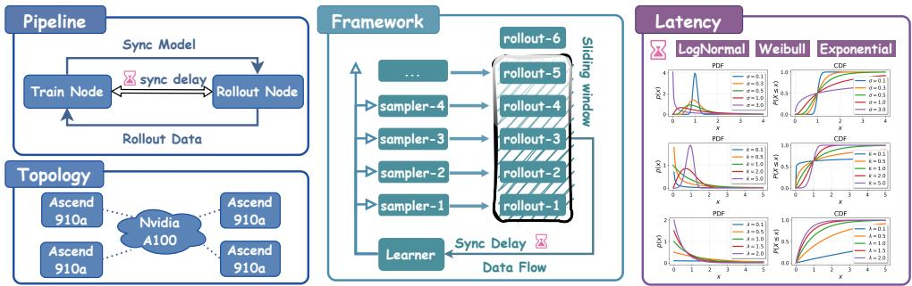  
Figure 3: The Overview of HeteroRL. By decoupling sampling and training, HeteroRL enables decentralized distributed RL training of LLMs across five compute nodes: one parameter update node (learner) and four data generation nodes (sampler), forming a star-shaped network topology. Network delays between the sampler and learner nodes are explicitly modeled and can be simulated using stochastic distributions such as the log-normal or Weibull distribution.

Heterogeneous Computing Environment As shown in Figure 3, we perform heterogeneous training across five compute nodes: one learner node and four sampler nodes, forming a star-shaped topology centered at the learner. During training, the sampler nodes generate rollout data, which is transmitted over the network to the learner node in a streaming fashion. The learner updates the model parameters and periodically broadcasts the updated weights back to the sampler nodes. The learner processes incoming rollouts in the order they arrive, operating within a fixed time window for data eligibility. Since data is transmitted in batch units—each containing text, generation probabilities, and rewards—a maximum delay of 1800 seconds is sufficient for typical network conditions. Within this window, the iteration gap (in terms of gradient updates) between the learner and samplers remains within 64 steps.

## 4.2 MAIN EXPERIMENTAL RESULTS

Table 1: Performance comparison using Qwen3-1.7B/8B under Online RL (4k limitation).

<table><tr><td rowspan="2">Method</td><td colspan="2">AMC2023</td><td colspan="2">AIME2024</td><td colspan="2">AIME2025</td><td colspan="2">MATH500</td><td colspan="2">Average</td></tr><tr><td>1.7B</td><td>8B</td><td>1.7B</td><td>8B</td><td>1.7B</td><td>8B</td><td>1.7B</td><td>8B</td><td>1.7B</td><td>8B</td></tr><tr><td>Qwen3-1.7/8B</td><td>44.6</td><td>70.6</td><td>10.9</td><td>32.4</td><td>14.0</td><td>26.1</td><td>72.4</td><td>87.1</td><td>35.5</td><td>54.1</td></tr><tr><td colspan="11">Max Tolerable Delay 0</td></tr><tr><td>BNPO</td><td>59.4</td><td>78.8</td><td>27.7</td><td>44.1</td><td>23.4</td><td>29.3</td><td>83.7</td><td>91.4</td><td>48.6</td><td>60.9</td></tr><tr><td>Dr.GRPO</td><td>61.6</td><td>77.5</td><td>24.6</td><td>41.0</td><td>22.7</td><td>27.7</td><td>82.9</td><td>91.6</td><td>48.0</td><td>59.4</td></tr><tr><td>GRPO</td><td>60.9</td><td>81.3</td><td>30.9</td><td>42.6</td><td>24.2</td><td>31.3</td><td>83.7</td><td>92.0</td><td>49.9</td><td>61.8</td></tr><tr><td>GSPO</td><td>60.3</td><td>77.8</td><td>28.5</td><td>41.8</td><td>25.0</td><td>31.3</td><td>83.9</td><td>90.9</td><td>49.4</td><td>60.5</td></tr><tr><td>GEPO (ours)</td><td>62.2</td><td>85.6</td><td>31.6</td><td>44.1</td><td>25.8</td><td>37.5</td><td>84.7</td><td>92.6</td><td>51.1</td><td>65.0</td></tr></table>

In this section, we compare GEPO with baselines under online RL and Hetero RL settings. The experimental results in Tables 1 and 2 demonstrate that GEPO not only achieves superior performance but also exhibits exceptional stability across both online and Hetero RL settings. Below, we dissect these findings in depth.

Table 2: Performance comparison using Qwen3-8B under Hetero RL (4k limiation).

<table><tr><td rowspan="2">Method</td><td colspan="2">AMC2023</td><td colspan="2">AIME2024</td><td colspan="2">AIME2025</td><td colspan="2">MATH500</td><td colspan="2">Average</td></tr><tr><td>best</td><td>last</td><td>best</td><td>last</td><td>best</td><td>last</td><td>best</td><td>last</td><td>best</td><td>last</td></tr><tr><td>Qwen3-8B</td><td>70.6</td><td>-</td><td>32.4</td><td>-</td><td>26.1</td><td>-</td><td>87.1</td><td>-</td><td>54.1</td><td>-</td></tr><tr><td colspan="11">Max Tolerable Delay 64</td></tr><tr><td>BNPO</td><td>73.2</td><td>72.6</td><td>37.7</td><td>35.9</td><td>25.3</td><td>24.5</td><td>87.4</td><td>86.1</td><td>55.9</td><td>54.8</td></tr><tr><td>Dr.GRPO</td><td>73.1</td><td>72.9</td><td>38.1</td><td>37.3</td><td>24.8</td><td>22.3</td><td>88.1</td><td>86.7</td><td>56.0</td><td>54.8</td></tr><tr><td>GRPO</td><td>71.6</td><td>71.6</td><td>38.7</td><td>35.9</td><td>27.3</td><td>27.0</td><td>88.8</td><td>88.8</td><td>56.6</td><td>55.8</td></tr><tr><td>GSPO</td><td>76.2</td><td>60.0</td><td>37.9</td><td>16.4</td><td>28.9</td><td>27.3</td><td>90.7</td><td>81.9</td><td>58.4</td><td>46.4</td></tr><tr><td>GEPO (ours)</td><td>83.4</td><td>82.8</td><td>42.6</td><td>37.5</td><td>33.2</td><td>32.0</td><td>91.3</td><td>90.9</td><td>62.6</td><td>60.8</td></tr></table>

In the online RL setting (Table 1), GEPO consistently outperforms all baselines across both model sizes and all benchmarks. On Qwen3-8B, it achieves an average score of 65.0, surpassing GRPO (61.8) and GSPO (60.5) by 3.2 and 4.1 points, respectively. The gain is most notable on AIME2025 (+6.2 points over GRPO/GSPO, 20% relative improvement). Even on the 1.7B model, GEPO sets a new SOTA, exceeding the best baseline by 1.5 points in average, confirming that group-level importance weighting improves gradient quality even without asynchrony.

In the Hetero RL setting (Table 2), GEPO's stability advantage becomes decisive. We find that BNPO and Dr.GRPO exhibit little performance difference compared to vanilla GRPO, and both employ token-level importance weights; therefore, we only analyze the performance differences among GRPO, GSPO, and GEPO. Both GEPO and GSPO improve over GRPO in best performance (+10.6% and +3.2%, respectively). However, GEPO further surpasses GSPO by 7.2% in accuracy while reducing its best-to-last degradation by 85% versus GSPO ( $\Delta=1.8$ vs. 12.0), achieving both higher performance and far greater stability. While GSPO's last scores collapse dramatically, GEPO maintains near-peak performance throughout training.

These results validate GEPO's core design: by replacing token or sequence-level importance weights with group-level expectations, it exponentially reduces importance weight variance under high KL divergence (Theorem 1), enabling stable, scalable decentralized RL. GEPO thus sets a new frontier in both performance and stability across ideal and real-world distributed settings. In the HeteroRL setting, the training process recorded in Figure 4 shows

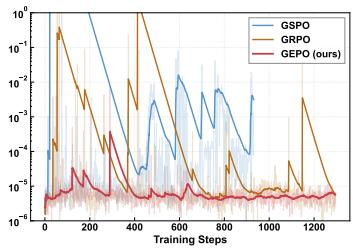  
(a) Variance of IW

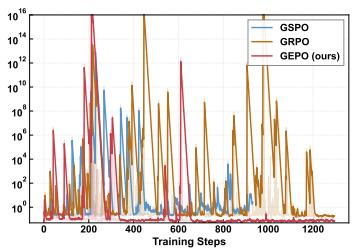  
(b) Gradient Norm

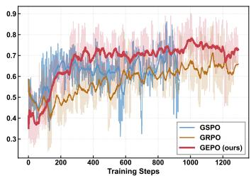  
(c) Training Reward

Figure 4: Curves of importance sampling variance, training gradient norm, and train/eval reward under max delay 64. Compared to GRPO and GSPO, GEPO maintains more stable importance weight variance, resulting in less drastic gradient changes, more stable training, and no decline in training reward.

that GRPO stably improves the reward at a slower pace, while GSPO rapidly increases the reward in the first 200 steps but becomes unstable between 500 and 700 steps. As seen in Figure 4a, GEPO exhibits significantly lower variance in importance weights compared to

GRPO and GSPO, which experience sharp spikes and fluctuations. These unstable weight variances lead to erratic gradient updates, as evidenced by the large oscillations in gradient norm (Figure 4b) for GRPO and GSPO, especially during early and mid-training phases. In contrast, GEPO's gradient norms remain relatively smooth and bounded, contributing to stable learning progress. Consequently, the training reward curve (Figure 4c) shows consistent improvement for GEPO without any noticeable decline, whereas GRPO and GSPO exhibit periods of stagnation or even degradation.

## 4.3 LATENCY ANALYSIS

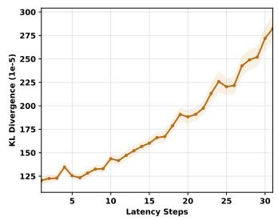  
(a) KL-divergence

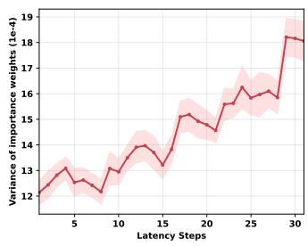  
(b) Variance of IW

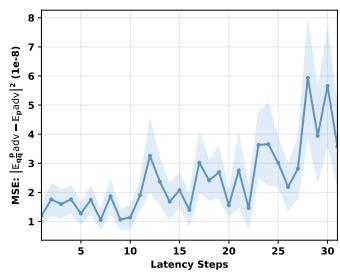  
(c) Estimation error  
Figure 5: KL-divergence, Variance of IW, and Estimation error are all positively correlated with the number of delay steps.

Impact of Latency As shown in Figure 5, we analyze the changes in KL divergence between the trainer and sampler, variance of importance weights, and estimation error of the expected value of the advantage function (optimization objective) during heterogeneous RL training as latency increases. We observe that latency leads to increased KL divergence (Figure 5a), which in turn causes an increase in the variance of importance weights (Figure 5b), ultimately resulting in increased estimation error of the expected advantage function (Figure 5c). Since the optimization objective is to maximize the estimated expectation of the advantage function, large estimation errors will cause significant fluctuations in gradients, thereby affecting training stability and performance. To show that high latency harms training stability, we compare max delays of 8 and 64 steps. As Figure 6 shows, with 64-step delay—especially near step 800—the KL divergence spikes and evaluation accuracy drops sharply, confirming that latency induces instability. Although GEPO improves stability, it still suffers a performance dip around step 900, highlighting that heterogeneous RL under high latency remains challenging.

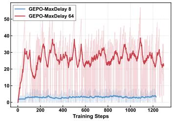  
(a) Latency steps

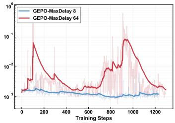  
(b) KL divergence

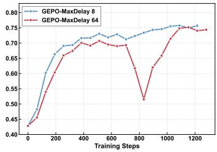  
(c) Evaluation accuracy  
Figure 6: Training processes under different latency conditions

Correlation and Causality. Figure 7 quantifies the pairwise correlations among KL-divergence, variance of importance weights, and estimation error of the expected advantage function. The correlation coefficients range from 0.76 to 0.96 ( $\alpha = 0.05$ ), confirming a strong statistical association between these variables. This observation empirically supports our hypothesis (illustrated in Figure 5) that increased latency induces higher KL divergence, which in turn amplifies the variance of importance weights and the estimation error, ultimately threatening training stability. However, correlation does not imply strict causation.

While latency is a significant contributing factor to KL divergence, it is not the sole determinant — the model's internal state and the statistical properties of the sampled data also play crucial roles. This explains the observed variance in training outcomes under identical latency: sometimes collapse occurs, sometimes not. Critically, what determines survival versus collapse is not latency itself, but the algorithm's capacity to mitigate the downstream instability caused by high KL divergence. As demonstrated in Figure 4 and Table 2, GEPO's group expectation mechanism effectively suppresses the explosion of importance weight variance even when KL divergence is high. This allows GEPO to maintain stable training and avoid collapse in many scenarios where baseline methods (like GRPO and GSPO) fail — thereby establishing algorithmic robustness to policy divergence as a core contribution of this work.

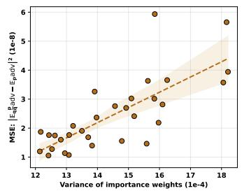  
(a) The correlation between importance weight variance and estimation error of $\mathbb{E}_{p}[adv(x,y)]$ is 0.76.

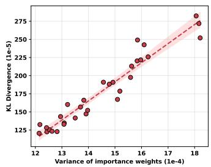  
(b) The correlation between importance weight variance and KL divergence is 0.96.

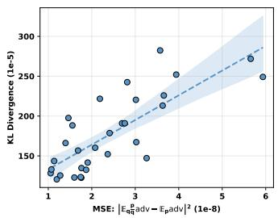  
(c) The correlation between KL divergence and $\mathbb{E}_{p}[adv(x,y)]$ estimation error is 0.78.

Figure 7: Correlation analysis (95% CI) of training delay steps, importance sampling variance, and estimation error of expected advantage function.

## 4.4 HYPERPARAMETER ANALYSIS

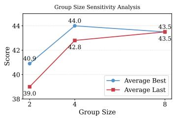  
(a) Group size

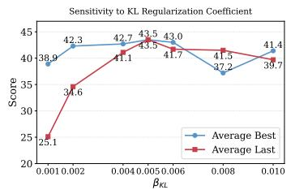  
(b) $\beta_{KL}$

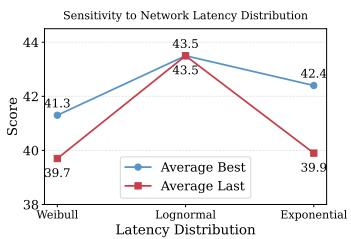  
(c) Latency distribution

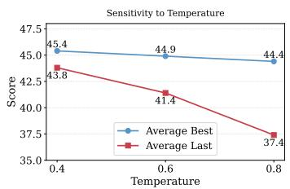  
(d) Temperature

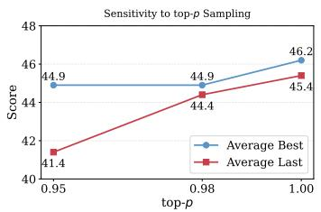  
(e) Top-p

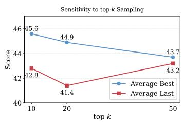  
(f) Top-k  
Figure 8: Sensitivity analysis of key hyperparameters in the Hetero/Online RL setting. All plots show the Average Best and Average Last performance across four benchmarks (AMC2023, AIME2024, AIME2025, MATH500).

We conduct comprehensive hyperparameter studies to analyze the sensitivity of GEPO to key hyperparameters under hetero RL and online RL setting, including group size G, sampling strategies (top-k, top-p, and temperature), the KL regularization coefficient $\beta_{KL}$ , and the choice of latency simulation distribution (e.g., exponential, Weibull, or lognormal). All experiments in the hyperparameter analysis section are based on the Qwen3-1.7B model with a maximum context length of 2,048 tokens. Figure 8 plots the best and last performance curves across six hyperparameters. More detailed experimental results are provided in Appendix B.5.

In summary, our comprehensive hyperparameter analysis reveals that group size 8 ensures optimal stability in heterogeneous RL settings with consistently high final performance (Figure 8a), while a KL regularization coefficient of $\beta_{KL} = 0.005$ maximizes both peak and final scores (Figure 8b). An excessively low KL coefficient reduces training stability. The Weibull latency distribution proves more challenging than lognormal or exponential alternatives (Figure 8c), and a temperature of 0.4 enhances stability by maintaining higher final performance (Figure 8d). For sampling strategies, top-p = 1.0 and top-k = 10 achieve the best trade-off between peak and final results (Figures 8e, 8f), confirming their effectiveness across diverse training scenarios. These findings validate our design choices in the main experiments and provide practical guidance for deploying GEPO in diverse distributed training environments.

## 5 RELATED WORK

Asynchronous Reinforcement Learning Framework. In recent years, reinforcement learning has become central to post-training LLMs (Ziegler et al., 2019). Researchers have identified efficiency bottlenecks in traditional synchronous RL frameworks. Wu et al. (2025) first theoretically explored asynchronous RLHF, proposing to decouple generation and training across GPU clusters, enabling scalable and efficient RL fine-tuning of LLMs with provable speedup over synchronous baselines. To address practical efficiency, AREAL (Fu et al., 2025) fully decouples generation and training, using staleness thresholds and a decoupled PPO objective (Hilton et al., 2022) to handle outdated samples. Prime Intellect (Team et al., 2025) offers a decentralized, asynchronous framework for community compute, ensuring trust via verifiable inference, stability via two-sided GRPO clipping, and controllable reasoning with length-aware rewards. Nevertheless, these approaches all assume centralized, low-latency infrastructure and support only limited degrees of asynchrony, making them not suited for distributed RL in high-latency, decentralized, and heterogeneous compute environments.

Asynchronous Reinforcement Learning Algorithm. Major of asynchronous or off-policy RL algorithms for LLMs post-training typically adopt two primary strategies to ensure training stability: (1) Gradient Truncation, wherein updates are suppressed for tokens whose importance weight lie beyond a specified trust interval—Decoupled PPO (Hilton et al., 2022) exemplifies this approach; (2) Importance Weight Truncation, which retains contributions from all samples but mitigates variance by bounding or reshaping the importance weights—methods such as Truncated IS (Espeholt et al., 2018), CISPO (Chen et al., 2025), and TOPR (Roux et al., 2025) fall into this category. Our method diverges from prior studies in its underlying perspective: by embracing the notion of intra-group expectation, we broaden the tolerance for token importance weight ranges, thereby improving training stability.

## 6 CONCLUSION

We propose HeteroRL, a heterogeneous reinforcement learning framework designed for training LLMs across geographically distributed and resource-heterogeneous nodes, paired with GEPO—a novel policy optimization algorithm that stabilizes training under high latency. By decoupling rollout sampling from parameter updates, HeteroRL eliminates synchronization bottlenecks inherent in traditional RL pipelines. GEPO addresses the explosion of variance of importance weight caused by stale policies through group expectation importance weight, provably reducing variance exponentially, particularly under large KL divergence between the sampling and learning policies. This work establishes a practical foundation for scalable, delay-tolerant decentralized RL, making it well-suited for real-world LLM post-training in heterogeneous, wide-area network environments.