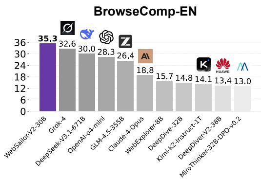
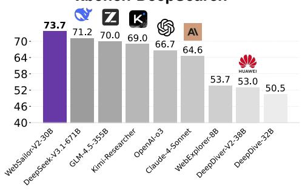
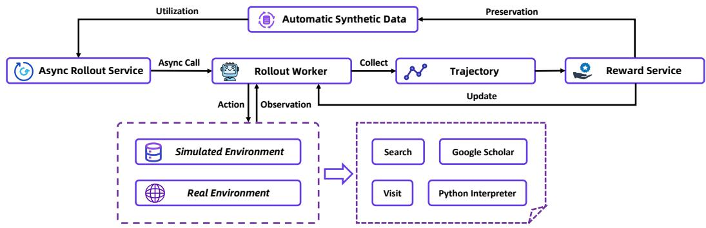
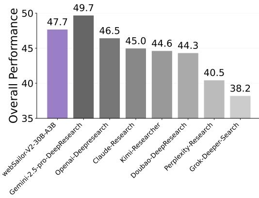
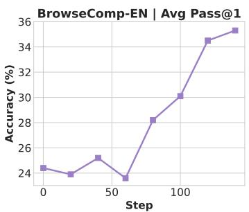
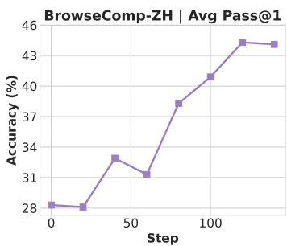
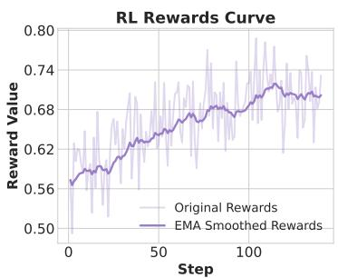
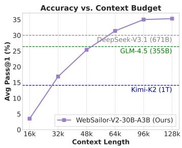
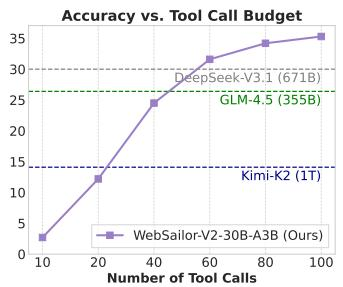
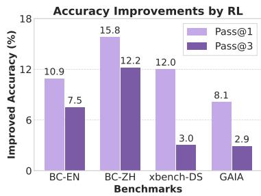

BrowseComp-EN

## ABSTRACT

To significantly advance the capabilities of open-source web agents, we present WebSailor-V2, a complete post-training pipeline encompassing data construction, Supervised Fine-Tuning (SFT), and Reinforcement Learning (RL). Our methodology features two key innovations: (1) On the data front, we developed SailorFog-QA-2, a novel dataset built from a densely interconnected knowledge graph that introduces a wide variety of uncertainties beyond simple obfuscation, fostering more sophisticated reasoning. (2) For training, we engineered a dualenvironment RL framework, combining a high-fidelity simulator for rapid, low-cost algorithmic iteration with a robust, managed real-world environment for stable final policy training, all integrated within a symbiotic data-policy feedback loop. Trained on the Qwen3-30B-A3B model, WebSailor-V2 achieves state-of-the-art results, scoring 35.3 on BrowseComp-EN, 44.1 on BrowseComp-ZH, and 30.6 on Humanity’s Last Exam (HLE). Notably, our 30B-A3B MOE agent significantly outperforms all existing open-source agents and surpasses even the 671B DeepSeek V3.1, demonstrating performance competitive with leading proprietary systems.

## 1 INTRODUCTION

  
xbench-DeepSearch

  
Figure 1: Performance on the BrowseComp-EN and xbench-DeepSearch benchmarks.

In the pursuit of Artificial General Intelligence (AGI), autonomous AI agents represent a critical milestone, with “Deep Research” emerging as a core paradigm for achieving more generalized capabilities. By leveraging external tools like search engines and web browsers, these agents can autonomously conduct systematic and in-depth analyses to tackle complex, multi-step research tasks through dynamic reasoning and iterative information retrieval (OpenAI, 2025a; AI, 2025). Despite recent advancements across the research community, spanning improvements from both perspectives of data and training (Wu et al., 2025b; Li et al., 2025b; Liu et al., 2025a; Nguyen et al., 2025; Li et al., 2025c; Wu et al., 2025a; Tao et al., 2025), a considerable performance gap still persists between opensource solutions and proprietary systems (e.g., OpenAI DeepResearch (OpenAI, 2025a)), leading to a bottleneck in democratizing powerful research capabilities.

This performance disparity primarily stems from fundamental challenges in two of the most critical stages for developing powerful agents: data and training. (1) Data: insufficient diversity and monolithic definitions of uncertainty. Information-seeking relies on the agent’s ability to leverage existing information and logical relationships to infer or acquire new, reliable knowledge. If the training data lacks a sufficiently broad and complex range of logical structures, the model will struggle to generalize to novel and intricate problems. Existing methodologies often rely on a narrow set of uncertainty definitions, such as obfuscation (Li et al., 2025b; Gao et al., 2025; Shi et al., 2025). A wider variety of uncertainty types is needed to elicit more diverse and sophisticated reasoning behaviors from the base model, better preparing it for the ambiguity inherent in real-world research. (2) Training: lack of scalable reinforcement learning (RL) training environment. Creating a scalable and robust RL training environment for agentic systems poses a significant challenge, which typically demands massive rollouts, each potentially involving numerous tool calls. The high cost and engineering complexity of high-concurrency requests to external APIs can lead to practical issues like tool latency, API failures, and inconsistent outputs. These issues would contaminate the training data, degrade the model’s learned policies, and severely hinder iteration of RL training algorithms.

In this paper, we present WebSailor-V2, a comprehensive framework designed to overcome these barriers through topological data synthesis and environmental stabilization. (1) Topological Strategy for Reasoning: To resolve the insufficient diversity inherent in linear or tree-like training data, we introduce SailorFog-QA-V2, an enhanced dataset built upon SailorFog-QA (Li et al., 2025b). Unlike conventional “easy-to-hard” expansion, our method constructs densely interconnected knowledge graphs. By specifically sampling trajectories that require resolving cyclic dependencies and traversing critical “cut vertices”, we force the agent to learn abstract graph-search patterns. This mechanism ensures the model acquires robust reasoning capabilities that generalize beyond simple information retrieval. (2) Stabilization Strategy for RL: To mitigate the “signal-to-noise” ratio issue caused by real-world volatility, we propose a Symbiotic Dual-Environment framework. By utilizing a high-fidelity simulator as an algorithmic “Wind Tunnel”, we decouple policy learning from environmental stochasticity. This allows for high-frequency, stable policy iteration, ensuring that the agent establishes a robust policy before adapting to the noisy, managed real-world interface. First, we develop a dedicated simulated environment from the ground up, based on a large-scale offline Wikipedia knowledge base (Vrandeciˇ c & Krötzsch, 2014). This environment is designed for´ high-frequency algorithmic experimentation and data curation, providing a low-cost, exceptionally fast, and fully controllable platform. Through meticulous design, it achieves high fidelity, ensuring that the agent’s interaction dynamics, state transitions, and reward mechanisms closely mirror those of a real-world setting. Second, recognizing that RL training in a real environment is a complex engineering problem—especially concerning the consistency of tool returns after toolset expansion, the reproducibility of trajectory sampling, and the need for high concurrency and fault tolerance, we build a unified tool execution interface that utilizes a scheduling and management layer to incorporate different tools’ quality measures and protocols. Finally, our data construction and RL training pipelines are integrated into a symbiotic feedback loop. This dynamic mechanism allows the system to synthesize and filter high-quality data based on training dynamics, enabling the model to continually refine its policies and learn from a stream of relevant information. This co-evolution of data and policy therefore promotes building deep research agents more effectively and efficiently.

To demonstrate the efficacy of SailorFog-QA-V2 and training strategies, we build our agent upon the foundational ReAct framework (Yao et al., 2023). Trained on Qwen3-30B-A3B (Yang et al., 2025), our WebSailor-V2-30B-A3B achieves scores of 35.3 on BrowseComp-EN (Wei et al., 2025) and 44.1 on BrowseComp-ZH (Zhou et al., 2025a), alongside a score of 30.6 on HLE (Phan et al., 2025), significantly outperforming all existing agents built on open-source models. Remarkably, our 30B-sized agent outperforms the previous best-performing agentic 671B-sized LLM DeepSeek V3.1 (Team, 2025b), which achieves 30.0 on BrowseComp-EN and 29.8 on HLE, respectively.

## 2 AGENTIC FRAMEWORK

ReAct. We adopt the ReAct framework as the foundation for our agent’s architecture (Yao et al., 2023):

$$
\mathcal {H} _ {T} = \big (\tau_ {0}, a _ {0}, o _ {0}, \dots , \tau_ {i}, a _ {i}, o _ {i}, \dots , \tau_ {T}, a _ {T} \big),\tag{1}
$$

where $\tau _ { i } , a _ { i } , o _ { i }$ represent thought, action, and observation in the i-th iteration, respectively. At step t, the agent’s thought $\tau _ { t }$ and subsequent action $a _ { t }$ are sampled from a policy π conditioned on the complete preceding context, defined as $\pi ( a _ { t } , \tau _ { t } | \mathcal { H } _ { t - 1 } )$

While more complex single and multi-agent paradigms have emerged, our choice of ReAct is a deliberate one, rooted in its simplicity and alignment with fundamental principles. This decision is heavily informed by “The Bitter Lesson” (Sutton, 2019), which posits that general methods leveraging scalable computation ultimately outperform approaches that rely on complex, human-engineered knowledge and intricate designs. Frameworks that require extensive, specialized prompt engineering or possess rigid operational structures risk becoming obsolete as the intrinsic capabilities of models scale (Li et al., 2025a).

Action space. The action space is composed of four primary tools: search, visit, Google Scholar, and Python interpreter, along with the terminal action final answer. Details of tools are provided in the Appendix C.

## 3 SAILORFOG-QA-V2

This section focuses on the data construction of SailorFog-QA-v2, where we introduce how we construct a dense knowledge graph containing real internet information and how we generate question answer (QA) pairs based on this data structure.

## 3.1 GRAPH CONSTRUCTION

An information retrieval problem, at its core, can be conceptualized as navigating a complex web of entities and their interrelationships. To effectively address such problems, especially in the context of advanced AI agents performing “Deep Research”, it is crucial for models to comprehend and leverage these underlying structural connections. Therefore, to ensure our generated QA pairs encompass a rich and diverse spectrum of logical relationships, our foundational approach involves constructing a comprehensive knowledge graph. This graph serves as a robust substrate from which we can sample various structurally distinct subgraphs, each forming the basis for generating questions that probe different reasoning patterns.

Recent advancements in data construction for web agents have also aimed at acquiring such structured information. These methods typically initiate from a simple “seed” question, progressively expanding the graph by employing external tools (e.g., search or browsing) to discover related entities and facts (Gao et al., 2025; Liu et al., 2025a; Tao et al., 2025). However, a significant drawback of this “easy-to-hard” or iterative expansion strategy is its inherent tendency to produce predominantly tree-like or acyclic logical structures. While effective for certain types of information retrieval, this approach inherently struggles to capture or generate scenarios involving complex cyclic relationships, feedback loops, or intricate interdependencies that are common in real-world knowledge graphs.

Building upon the foundational framework of SailorFog-QA (Li et al., 2025b), V2 still starts with a seed entity and leverages web tools to discover related entities and extract their corresponding information. However, to achieve a more comprehensive topological coverage to overcome the limitations of acyclic graphs,we introduce significant enhancements to the graph expansion phase. Specifically, we actively seek out and establish more dense connections between nodes, intentionally creating cyclic structures. This ensures that the resulting graph is not merely a sprawling tree but a richly interconnected web, more accurately reflecting the complex, non-linear nature of real-world knowledge. Beyond these structural improvements, we now preserve more complete procedural information, such as the specific search queries used and the source URLs that led to a new discovery. Furthermore, we compute and store various statistical features for each entity, which are instrumental for the subsequent QA generation phase, enabling us to craft more nuanced and challenging questions.

## 3.2 SUBGRAPH EXTRACTION

In the previous version, our subgraph sampling strategy relied on random sampling, with an attempt to enumerate all possible substructures of a fixed edge count. However, as the graph in V2 has become substantially denser, such an exhaustive enumeration is computationally infeasible due to combinatorial explosion. To overcome this scalability issue, we adopt a random-walk based approach for subgraph extraction. Ultimately, this strategy enables us to efficiently gather a sufficient quantity of non-isomorphic (verified by Weisfeiler-Leman algorithm (Weisfeiler & Leman, 1968)), connected subgraphs that collectively represent the full spectrum of structural complexities, without the prohibitive cost of a brute-force search.

## 3.3 QA GENERATION

When generating QA, we do not directly feed the subgraph into the LLM end-to-end to produce the result. Instead, we first analyze how many non-isomorphic nodes exist in a given topology, so that the QA focus can be evenly distributed across all orbit nodes (i.e., nodes that occupy different structural roles). Moreover, obfuscation has become one of the most common methods for introducing uncertainty and eliciting high-order reasoning patterns in the construction of challenging information seeking tasks (Li et al., 2025b; Gao et al., 2025; Shi et al., 2025; Liu et al., 2025a; Geng et al., 2025). Specifically, obfuscation corresponds to the reasoning behavior required when a query’s key elements—such as specific entities, dates, or values—are replaced with more general or ambiguous descriptions. Answering such questions compels the model to move beyond simple keyword matching, engaging in contextual inference to disambiguate underspecified entities, generating and verifying hypotheses through iterative information gathering, and synthesizing evidence from multiple sources to converge on a conclusive answer. However, this set of skills, while crucial, represents only a subset of the capabilities required for a truly super-human web agent. To this end, we introduce a wider array of defined uncertainties beyond simple obfuscation. These include: (1) Semantic Ambiguity: We deliberately under-specify key entities (e.g., “the mathematician who generalized this result” instead of the specific name) or dates. This forces the agent to reason over the graph structure to disambiguate entities via context rather than keyword matching. (2) Distractor Noise: We inject plausible but factually incorrect distractors into the context (e.g., a publication year of a related paper by the same author). This requires the agent to perform active cross-verification and contradiction detection. (3) Structural Constraints: By analyzing non-isomorphic nodes—nodes occupying distinct structural roles—we identify critical paths (e.g., bridges or cut vertices). We generate questions that require traversing these specific “cut” edges, ensuring the agent engages in global graph exploration rather than local greedy search.

## 3.4 DATASET STATISTICS

The resulting SailorFog-QA-V2 dataset used for SFT and RL consists of over 30,000 high-quality instruction-tuning pairs. The underlying knowledge graphs are densely connected, with an average of approximately 30 nodes and an average degree of 2.5 per connected component. The randomwalk sampling strategy, verified by the Weisfeiler-Leman algorithm, ensures a diverse coverage of topological structures, ranging from simple chains to complex cycles and dense clusters.

## 4 AGENTIC POST-TRAINING

## 4.1 SFT COLD START

The initial phase of our agentic post-training pipeline is a Supervised Fine-Tuning (SFT) stage, designed to provide the base model with a robust initial policy before the commencement of reinforcement learning. To ensure a controlled and high-quality training regimen, our SFT dataset is constructed entirely from synthetic data derived from the SailorFog-QA-V2 generator. The training trajectories are produced by high-performing, open-source models solving the generated QA tasks, with quality maintained via rejection sampling. In a key architectural decision, and a departure from prior work like WebSailor, our agent is built upon the Qwen3-30B-A3B-Thinking-2507 foundation model (Yang et al., 2025), with the context length deliberately extended to 128k.

  
Figure 2: An overview of our Reinforcement Learning framework. The agent is trained in a closed loop where the policy is continuously updated through interactions with simulated or real-world environments. A key component is the automated data synthesis and filtering pipeline, which dynamically curates training data based on the training dynamics.

## 4.2 AGENTIC REINFORCEMENT LEARNING

Our RL strategy employs a dual-environment approach, leveraging the benefits of both controlled simulation and real-world deployment.

Simulated Environment. The practice of training in simulation for subsequent policy transfer or algorithm validation is a common and essential strategy in research and development (Da et al., 2025), successfully applied across domains like robotics and perception (Osinski et al., 2020; Haiderbhai´ et al., 2024; Ho et al., 2021). Reliance on commercial real-world web APIs (e.g., SerpAPI (SerpAPI, 2025) or Jina (Jina.ai, 2025)) introduces significant practical constraints, including high operational costs, restricted Queries Per Second (QPS), and output inconsistencies. During the critical initial stages of algorithm research and data curation, these real-world limitations can severely decelerate the development cycle and compromise the reliability of ablation studies.

To circumvent these issues, we constructed a fully controllable simulated environment utilizing an offline Wikipedia database and a corresponding suite of simulated web tools. We adapted the SailorFog-QA-V2 generation pipeline to operate exclusively on this offline corpus, thereby synthesizing a dedicated, structurally complex training and testing dataset that is perfectly aligned with the simulation’s capabilities. This methodology provides a cost-efficient and fully observable platform, significantly accelerating our algorithmic experimentation and iteration process.

We utilize this simulator not as a direct content replica of the live web, but as a “wind tunnel” for algorithmic stability. Our internal validation demonstrates a high correlation in training dynamics (specifically Reward and Pass@1 trends) between the simulator and the real environment. Algorithmic improvements that stabilize learning in the simulator consistently translate to stability in the real world. Consequently, we adopt a staged training strategy: we perform high-frequency hyperparameter tuning and reward shaping validation in the simulator, and then execute the final production training run in the managed real-world environment using the validated configuration.

Real Environment. While simulation is invaluable for rapid prototyping, the ultimate objective is real-world performance. Transitioning to a real environment, however, introduces considerable engineering challenges. Our agent relies on a multifaceted toolkit integrating various search sources, diverse webpage parsers, and a code execution sandbox. The inherent volatility of external APIs (e.g., latency, failure, or inconsistent returns) within this composite system poses a significant risk of data contamination, which can obscure the true source of performance degradation—making it difficult to isolate algorithmic deficiencies from environmental instability. To ensure stability, we architected a robust, unified tool execution interface. This interface includes a scheduling and management layer that orchestrates tool execution and incorporates sophisticated concurrency handling and fault tolerance mechanisms. These include QPS constraints, result caching, automated timeout-and-retry protocols, service degradation strategies for non-critical failures, and seamless switching to backup data sources. This multi-layered design effectively abstracts the tool invocation process into a deterministic and stable interface from the agent’s perspective, successfully insulating the training loop from real-world stochasticity while simultaneously optimizing operational costs.

Data Curation. Data quality is the central driver of enhanced model capability; its importance often surpasses that of the algorithm itself. The quality of the training data directly establishes the upper bound for the model’s ability to generalize to out-of-distribution scenarios through self-exploration. To address this, we implemented a data optimization loop guided by real-time training dynamics. This optimization is achieved via a fully automated data synthesis and filtering pipeline that dynamically curates the training set. By establishing this closed loop between data generation and model training, our approach not only ensures training stability but also yields substantial performance gains by continually feeding the model with the most informative trajectories.

RL algorithm. Our RL algorithm is a tailored adaptation of GRPO (Shao et al., 2024):

$$
\begin{array}{r l} \mathcal {J} (\theta) = & \mathbb {E} _ {(q, y) \sim \mathcal {D}, \{o _ {i} \} _ {i = 1} ^ {G} \sim \pi_ {\theta_ {\mathrm{old}}} (\cdot | c o n t e x t)} \\ & \left[ \frac {3}{\sum_ {i = 1} ^ {G} | o _ {i} |} \sum_ {i = 1} ^ {G} \sum_ {t = 1} ^ {| o _ {i} |} \min \Big (r _ {i, t} (\theta) \hat {A} _ {i, t}, \operatorname{clip} \Big (r _ {i, t} (\theta), 1 - \varepsilon_ {l o w}, 1 + \varepsilon_ {h i g h} \Big) \hat {A} _ {i, t} \Big) \right], \end{array}\tag{2}
$$

where $( q , y )$ is the question-answer pair, $r _ { i , t } ( \boldsymbol { \theta } )$ is the importance sampling ratio, and $\hat { A } _ { i , t }$ is an estimator of the advantage at time step t:

$$
r _ {i, t} (\theta) = \frac {\pi_ {\theta} (o _ {i , t} \mid c o n t e x t)}{\pi_ {\theta_ {\text { old}}} (o _ {i , t} \mid c o n t e x t)}, \quad \hat {A} _ {i, t} = R _ {i} - \text { mean } (\{R _ {i} \} _ {i = 1} ^ {G}).\tag{3}
$$

We employ a strictly on-policy training regimen, where trajectories are continuously sampled using the most up-to-date policy, ensuring that the learning signal is always relevant to the model’s current capabilities. Following DeepSwe (Luo et al., 2025) and DAPO (Yu et al., 2025b), the training objective is optimized using a token-level policy gradient loss. Second, to further reduce variance in the advantage estimation, we adopt a leave-one-out strategy (Chen et al., 2025). Furthermore, we employ a conservative strategy for negative samples, having observed that an unfiltered set of negative trajectories significantly degrades training stability. This can manifest as a “format collapse” phenomenon after extended training. To mitigate this, we employ a targeted filtering strategy. We selectively mask the loss for trajectories that exceed the length limit without yielding a final answer, as these provide ambiguous learning signals. In contrast, trajectories containing explicit format errors or invalid tool calls are assigned negative rewards rather than being masked, allowing the model to actively learn to avoid such behaviors. This strategy effectively prevents format collapse while maintaining training stability. For the sake of efficiency, we do not employ dynamic sampling. We instead leverage larger batch and group sizes, which serve to maintain smaller variance and provide adequate supervision.

However, we consider that the algorithm is important but not the only decisive factor in the success of Agentic RL. We have experimented with many different algorithms and tricks, and find that data and stability of the training environment are likely the more critical components in determining whether the RL works. Interestingly, we have tested to train the model directly on the BrowseComp testing set, but the results are substantially poorer than when using our synthetic data. We hypothesize that this disparity arises because the synthetic data offers a more consistent distribution, which allows the model to be more effectively tailored. Conversely, the human-annotated data (such as BrowseComp) is inherently noisier. Given its limited scale, it is difficult to approximate a learnable underlying distribution, which consequently hinders the model to learn and generalize from it.

## 5 EXPERIMENTS

## 5.1 SETUP

Research Questions To verify our methodological claims, our evaluation is designed to answer two core scientific questions:

• (RQ1) Topological Generalization: Does training on data derived from dense, cyclic knowledge graphs (SailorFog-QA-V2) yield stronger reasoning capabilities compared to standard linear or tree-like data expansion used by baselines?

• (RQ2) Environmental Stability: Does decoupling training into a dual-environment (Simulation-to Real) framework effectively mitigate the instability of real-world RL and lead to better convergence?

Models and Benchmarks We perform SFT and RL training on Qwen3-30B-A3B-2507 (Yang et al., 2025). We mainly evaluate our method on six representative and challenging benchmarks:

• BrowseComp-EN (Wei et al., 2025): One of the most challenging benchmarks introduced by OpenAI to evaluate the proficiency of AI agents in locating hard-to-find, often multi-faceted, information across the internet, which demands sophisticated browsing strategies and reasoning capabilities.

• BrowseComp-ZH (Zhou et al., 2025a): Similar to BrowseComp-EN, but the QAs are in Chinese.

• GAIA (Mialon et al., 2023): A benchmark that requires multi-modality and tool-use abilities. We only use a subset of 103 cases from the text-only validation subset (Li et al., 2025c; Wu et al., 2025a).

• xbench-DeepSearch (Xbench-Team, 2025): A new, dynamic, professionally-aligned benchmark that focuses on evaluating AI agents’ tool usage capabilities, specifically in deep information retrieval and complex search tasks.

• Humanity’s Last Exam (HLE) (Phan et al., 2025): HLE is a global collaborative effort, with questions from nearly 1,000 subject expert contributors affiliated with over 500 institutions across 50 countries – comprised mostly of professors, researchers, and graduate degree holders.

• DeepResearch Bench (Du et al., 2025): This benchmark is comprised of numerous PhD-level research tasks designed to evaluate the performance of deep-research agents, specifically focusing on the quality of their generated research reports and their proficiency in information retrieval and collection.

Baselines For proprietary models accessed via API or manual testing, we maintained consistent evaluation conditions to ensure fairness, enforcing a 128k context token limit and a maximum budget of 100 tool calls, consistent with our agent’s settings. We compare our method with the following paradigms:

• Proprietary Browsing Agents: We test Gemini-2.5-pro-DeepResearch (Team, 2025c), Claude-Research (Team, 2025a), Doubao-Deepresearch (Doubao, 2025), Perplexity-Research (Team, 2025g), Grok-Deeper-Search (Team, 2025d), Claude-4-Sonnet (anthropic, 2025), OpenAIo3 (OpenAI, 2025b), OpenAI DeepResearch (OpenAI, 2025a); however, as not all of them are fully accessible via API, they were not tested across all benchmarks and experiments.

• Open-Source Agents: We compare our method with recent open-source web/search agents, including ASearcher-Web-QwQ (Gao et al., 2025), MiroThinker-32B-DPO-v0.2 (Team, 2025e), WebSailor-72B, WebExplorer-8B, DeepDiver-V2-38B (Team, 2025f), DeepDive-32B (Lu et al., 2025), Kimi-K2-Instruct (Team et al., 2025), GLM-4.5 (Zeng et al., 2025), DeepSeek-V3.1 (Team, 2025b).

Training Data Our training data is primarily composed of SailorFog-QA (Li et al., 2025b) and SailorFog-QA-V2. In addition, we supplement this data with IterBench (Qiao et al., 2025) to bolster the model’s proficiency in mathematical and academic reasoning. Qualitatively, we observe that distinct data sources target different capabilities. SailorFog-QA provides the foundational scaffold for web navigation; SailorFog-QA-V2, with its dense cyclic structures and injected uncertainties, is critical for the complex reasoning and error-correction observed in BrowseComp tasks; and the supplementary IterBench data specifically bolsters the mathematical and academic reasoning required for benchmarks like HLE.

Metric and Hyper-parameters We default to pass@k evaluation (Chen et al., 2021) and report pass@1, and temperature and top-p are set to 0.85 and 0.95. For accuracy, we use LLM as a judge (Liu et al., 2024; Wang et al., 2024), strictly utilizing the official evaluation prompts and designated model versions to ensure comparability. The pass@1 is computed as:

Table 1: Graph-based training data enables superior reasoning generalization (Evidence for RQ1). WebSailor-V2 outperforms baselines trained on linear/tree-like synthetic data by a significant margin on complex benchmarks like BrowseComp. ‡ indicates that these proprietary methods are manually evaluated through their websites (some are reported in the corresponding papers). - means that we do not have the results due to cost constraints.

<table><tr><td>Backbone</td><td>BrowseComp-EN</td><td>BrowseComp-ZH</td><td>xbench-DeepSearch</td><td>GAIA</td><td>HLE</td></tr><tr><td colspan="6">Proprietary Agents</td></tr><tr><td>Claude-4-Sonnet</td><td>12.2</td><td>29.1</td><td>64.6</td><td>68.3</td><td>20.3</td></tr><tr><td>Claude-4-Opus $^{\ddagger}$ </td><td>18.8</td><td>-</td><td>-</td><td>-</td><td>-</td></tr><tr><td>OpenAI-o3</td><td>49.7</td><td>58.1</td><td>66.7</td><td>70.5</td><td>20.2</td></tr><tr><td>OpenAI DeepResearch $^{\ddagger}$ </td><td>51.5</td><td>42.9</td><td>-</td><td>67.4</td><td>26.6</td></tr><tr><td>Kimi-Researcher $^{\ddagger}$ </td><td>-</td><td>-</td><td>69.0</td><td>-</td><td>26.9</td></tr><tr><td colspan="6">Open-Source Agents</td></tr><tr><td>ASearcher-Web-32B</td><td>5.2</td><td>15.6</td><td>42.1</td><td>52.8</td><td>12.5</td></tr><tr><td>MiroThinker-32B-DPO-v0.2</td><td>13.0</td><td>17.0</td><td>-</td><td>64.1</td><td>11.8</td></tr><tr><td>WebSailor-72B</td><td>12.0</td><td>30.1</td><td>55.0</td><td>55.4</td><td>-</td></tr><tr><td>WebExplorer-8B</td><td>15.7</td><td>32.0</td><td>53.7</td><td>50.0</td><td>17.3</td></tr><tr><td>DeepDiver-V2-38B</td><td>13.4</td><td>34.6</td><td>53.0</td><td>-</td><td>-</td></tr><tr><td>DeepDive-32B</td><td>14.8</td><td>25.6</td><td>50.5</td><td>-</td><td>-</td></tr><tr><td>Kimi-K2-Instruct-1T $^{\ddagger}$ </td><td>14.1</td><td>28.8</td><td>50.0</td><td>57.7</td><td>18.1</td></tr><tr><td>GLM-4.5-355B $^{\ddagger}$ </td><td>26.4</td><td>37.5</td><td>70.0</td><td>66.0</td><td>21.2</td></tr><tr><td>DeepSeek-V3.1-671B $^{\ddagger}$ </td><td>30.0</td><td>49.2</td><td>71.2</td><td>63.1</td><td>29.8</td></tr><tr><td>WebSailor-V2-30B-A3B (SFT)</td><td>24.4</td><td>28.3</td><td>61.7</td><td>66.0</td><td>23.9</td></tr><tr><td>WebSailor-V2-30B-A3B (RL)</td><td>35.3</td><td>44.1</td><td>73.7</td><td>74.1</td><td>30.6</td></tr></table>

$$
\mathrm{pass@1} = \frac {3}{n} \sum_ {i = 1} ^ {n} p _ {i},\tag{4}
$$

where $p _ { i }$ denotes the correctness of the i-th response. For pass@k that $k > 1$ we repeatedly generate for k times.

## 5.2 MAIN RESULTS

Our main experimental results, summarized in Table 1, unequivocally demonstrate the superior performance of WebSailor-V2-30B-A3B. Across a diverse suite of web-agent benchmarks, our model consistently achieves state-of-the-art results among open-source solutions and proves highly competitive with top-tier proprietary agents. On the extremely complex BrowseComp-EN and BrowseComp-ZH benchmarks, which demand sophisticated, multi-step reasoning and information synthesis, WebSailor-V2 scores 35.3 and 44.1 respectively, significantly outperforming all other open-source agents. On relatively more straightforward but still challenging benchmarks like xbench DeepSearch and GAIA, our agent not only leads the open-source field but surpasses even the strongest proprietary systems.

Another compelling result is on HLE, a benchmark designed to test deep academic and logical reasoning. Here, WebSailor-V2 achieves a score of 30.6, establishing a new state-of-the-art. This is particularly noteworthy as it exceeds the performance of much larger and more powerful models, including the 671B parameter DeepSeek-V3.1 and proprietary models like OpenAI-o3. This result strongly validates our core hypothesis: equipping a model with exceptionally strong information retrieval and synthesis capabilities can profoundly enhance its logical reasoning abilities, allowing it to effectively “reason over” externally acquired knowledge and overcome the limitations of its intrinsic scale. We believe agentic paradigm is a good way to close the gap between strong and weak models.

These results highlight the indispensable role of the SFT cold-start stage, especially for relatively small-scale models. As evidenced in Table 1, our model after SFT alone already exhibits formidable capabilities, achieving a score of 24.4 on BrowseComp-EN and 23.9 on HLE, surpassing many fully-trained open-source agents. This strong initial policy is not merely an intermediate checkpoint but a critical prerequisite for the success of reinforcement learning. The complex, open-ended nature of these tasks means that rewards are often sparse. Without a competent initial policy from SFT, an agent would struggle to conduct meaningful exploration, rarely completing tasks successfully and thus failing to receive the positive feedback needed for learning. The SFT phase ensures the agent starts with a robust enough policy to explore the problem space effectively, providing a sufficiently dense reward signal for the RL algorithm to stabilize and converge towards a superior final policy.

## 5.3 MORE COMPARISON WITH PROPRIETARY AGENTS IN DEEP-RESEARCH TASK

Evaluating proprietary agents is inherently challenging, particularly for those available exclusively through web interfaces. To validate that WebSailor-V2 (based on Qwen3-30B-A3B) performs on par with much larger proprietary models, we select the DeepResearch Bench. This benchmark is ideal as its leaderboard provides direct comparisons to leading closedsource agents and assesses key capabilities in both information retrieval and report generation. The results (Figure 3) underscore our model’s competitive performance. WebSailor-V2 achieves a score of 47.7, ranking second only to the state-of-the-art Gemini-2.5-pro-DeepResearch (49.7). We attribute this narrow gap to our training strategy, which prioritizes core information retrieval and reasoning over the stylistic polish of the final report. Therefore, this gap reflects a targeted area for improvement in the presentation layer, rather than a fundamental limitation in its research capabilities.

  
Figure 3: Comparisons with proprietary agents. The metric here is the overall score defined in DeepResearch Bench.

## 5.4 DETAILED ANALYSES

Training dynamics. The training dynamics of our RL process are depicted in Figure 4. As illustrated, stabilized environments lead to consistent policy improvement (Evidence for RQ2). The clear upward trend in reward (left) confirms that our dual-environment approach successfully mitigates the “destructive updates” often seen in noisy real-world RL. The agent is effectively learning and refining its policy within the training distribution. This improvement successfully translates to our validation benchmarks, where performance on both BrowseComp-EN and BrowseComp-ZH shows a corresponding, albeit oscillating, upward trajectory.

However, we observe a noteworthy divergence in learning patterns between difficult and simpler benchmarks. On challenging benchmarks like BrowseComp, both pass@1 and pass@3 scores demonstrate a distinct and concurrent rise (shown in Fig. 6). This suggests that for complex tasks, RL is genuinely expanding the model’s fundamental problem-solving capabilities, increasing the overall likelihood of finding a correct solution path within a few attempts. In contrast, for simpler benchmarks such as xbench-DeepSearch and GAIA, we see a significant improvement in pass@1, while the gains in pass@3 are marginal. This indicates that for tasks already well within the model’s base capabilities, the primary role of RL is to enhance sampling efficiency—teaching the agent to more reliably select the optimal path on its first attempt (Yue et al., 2025). For these simpler problems, the model is already likely to find a solution, so RL’s main contribution is making that initial attempt more robust. This also implies that for truly difficult problems, even pass@3 may not be sufficient to fully reflect the upper bounds of the model’s enhanced capabilities.

Context scaling of WebSailor-V2. Figure 5 illustrates the relationship between accuracy, context length, and the number of tool calls on the BrowseComp-EN. In this setup, cases where the context length or the tool call budget exceeds the predefined limit are all counted as incorrect answers. The results show a clear positive correlation: as the available context length increases, the agent’s accuracy progressively rises before gradually converging. We observe that nearly 90% of the correctly solved instances are completed within a context of 64k. Notably, at a 32k context limit, WebSailor-V2 achieves an accuracy of around 16 on BrowseComp-EN. This marks a significant improvement over its predecessor, WebSailor-V1. The advancement is particularly compelling given that WebSailor-V1 is built on a 72B dense model, which, in principle, possesses greater intrinsic capacity than the 30B MoE model used here. This highlights the profound impact of our improved data and training pipeline on the agent’s fundamental reasoning and tool-use capabilities, allowing a smaller model to achieve superior performance.

  
Figure 4: Training dynamics of rewards curve and performance on testing benchmarks.

  
Figure 5: Effects of context and tool call budget for agent.

  
Figure 6: Accuracy improvements by RL across four benchmarks.

## 6 CONCLUSION

In this work, we present WebSailor-V2, a framework that bridges the gap between open-source models and proprietary deep research agents. Beyond achieving state-of-the-art performance with a 30B model, our work validates two critical scientific insights regarding agentic learning: (1) Topological Generalization: We demonstrate that the logical structure of training data is as critical as its scale. By shifting from standard linear data expansion to cyclic, graph-based synthesis (SailorFog-QA-V2), we show that forcing agents to navigate dense, interdependent relationships during training significantly enhances their ability to generalize to complex, multi-step reasoning tasks. (2) Environmental Stability in RL: We identify environmental stochasticity as a primary bottleneck for on-policy reinforcement learning. Our results confirm that a symbiotic dual-environment framework—decoupling algorithmic learning in a high-fidelity simulator from adaptation in the managed real world—is essential for mitigating destructive updates and ensuring stable convergence. Ultimately, WebSailor-V2 proves that with high-density data topology and a stabilized training environment, moderately sized open-source models can rival significantly larger proprietary systems, offering a reproducible path toward democratizing deep research capabilities.