## ABSTRACT

Reinforcement learning (RL) algorithms are highly sensitive to reward function specification, which remains a central challenge limiting their broad applicability. We present ARM-FM: Automated Reward Machines via Foundation Models, a framework for automated, compositional reward design in RL that leverages the high-level reasoning capabilities of foundation models (FMs). Reward machines (RMs) – an automata-based formalism for reward specification – are used as the mechanism for RL objective specification, and are automatically constructed via the use of FMs. The structured formalism of RMs yields effective task decompositions, while the use of FMs enables objective specifications in natural language. Concretely, we (i) use FMs to automatically generate RMs from natural language specifications; (ii) associate language embeddings with each RM automata-state to enable generalization across tasks; and (iii) provide empirical evidence of ARM-FM’s effectiveness in a diverse suite of challenging environments, including evidence of zero-shot generalization.

## 1 INTRODUCTION

A central challenge in reinforcement learning (RL) is the design of effective reward functions for complex tasks. The shape of the reward influences the complexity of the problem at hand (Gupta et al., 2022); for instance, sparse rewards provide an insufficient learning signal, making it difficult for agents to improve (Devidze et al., 2022). Even hand-crafted dense rewards are susceptible to unintended loopholes or "reward hacking", where an agent exploits the specification without achieving the true objective (Fu et al., 2025). The unifying challenge is thus how to communicate complex objectives to an agent in a manner that provides structured, actionable guidance (Rani et al., 2025).

While Foundation Models (FMs) excel at interpreting and decomposing tasks from natural language, a critical gap exists in translating this abstract understanding into the concrete structured reward signals necessary for RL. Consequently, high-level plans generated by FMs often fail to ground effectively, leaving the agent without the granular feedback required for learning. To bridge this gap, we turn to Reward Machines (RMs), an automata-based formalism. By decomposing tasks into a finite automaton of sub-goals, RMs provide a compositional structure for both rewards and policies that is inherently more structured and verifiable than monolithic reward functions (Icarte et al., 2022). While theoretically principled, their practical application has been confined to task-specific applications due to the complexity of their manual, expert-driven design. We posit that the reasoning and codegeneration capabilities of modern FMs are well-suited to automate the design and construction of RMs, thereby unlocking their potential to solve the broader challenge of communicating complex objectives in RL; the resulting RMs can thus translate abstract human intent into a concrete learning signal for solving complex tasks.

This work makes three primary contributions. First, we develop a novel framework for automatically generating complete task specifications directly from natural language using foundation models, introducing language-aligned reward machines (LARMs) which include the automaton structure, executable labeling functions, and natural language instructions for each subtask. Second, we introduce a method that leverages the language-aligned nature of the resulting automata to create a shared skill space, enabling effective experience reuse and policy transfer across related tasks. Finally, we provide extensive empirical validation demonstrating that our approach solves complex, long-horizon tasks across multiple domains that are generally intractable for standard RL methods. Specifically, our results show that the framework (i) dramatically improves sample-efficiency by converting sparse rewards into dense, structured learning signals; (ii) scales to a diverse set of environments, including grid worlds, complex 3D environments, and robotics with continuous control; and (iii) enables efficient multi-task training and zero-shot generalization.

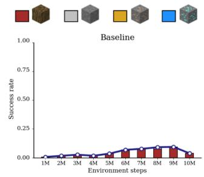

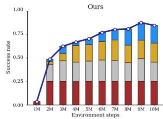

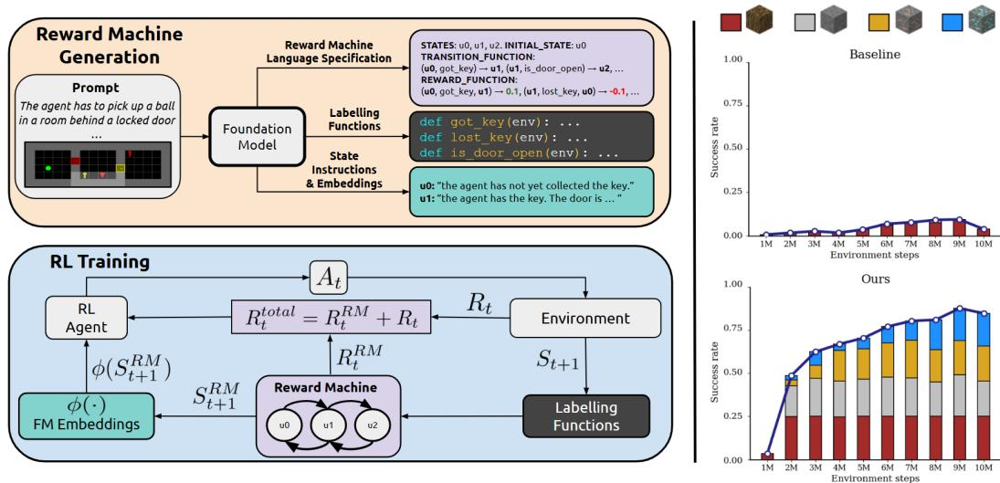  
Figure 1: An overview of our framework (left) and results in a complex sparse-reward environment (right). Reward Machine Generation (top-left): Given a high-level natural language prompt and a visual observation of the environment, a FM automatically generates the formal specification of the Reward Machine, the executable Python code for the labeling functions, and the natural language descriptions for each RM state. RL training (bottom-left): During the RL training loop, the labeling functions evaluate environment observations to update the Reward Machine’s state, which provides a dense reward signal $R _ { t } ^ { \mathrm { R M } }$ . The RL agent’s policy receives the environment observation along with the embedding ϕ(·) of the current RM state’s language description, making it aware of its active sub-goal. Empirical results (right): Results in a complex sparse-reward Minecraft-based resource-gathering task from Craftium (Malagón et al., 2024), where an RL agent is unable to make progress (top), while our agent, guided by an FM-generated LARM, learns to solve the task efficiently (bottom).

## 2 AUTOMATED REWARD MACHINES VIA FOUNDATION MODELS

We now present Automated Reward Machines via Foundation Models (ARM-FM), a framework for automated reward design in RL that leverages the reasoning capabilities of foundation models to automatically translate complex, natural-language task descriptions into structured task representations for RL training. Figure 1 illustrates an overview of ARM-FM, which comprises two major components: (i) the introduction of Language-Aligned RMs (LARMs), which are automatically constructed using FMs; and (ii) their integration into RL training by conditioning policies on language embeddings of RM states, enabling structured rewards, generalization, and skill reuse. Figure 2 shows a high-level task description, consisting of a natural language prompt and a visual observation (left), along with its corresponding RM (right). The RM is a finite-state automaton that guides an agent by providing incremental rewards for completing sub-goals, such as collecting keys and opening doors, on the way to the final objective. In the following section, we describe how our ARM-FM framework automates the creation of these reward machines directly from high-level task descriptions.

## 2.1 LANGUAGE-ALIGNED REWARD MACHINES

We assume the standard RL formalism, which defines an environment as a Markov Decision Processes (Puterman, 1994, ; MDPs) $\langle S , A , { \mathcal { R } } , { \mathcal { P } } \rangle$ , where S is the set of MDP states, A is the set of possible actions, $\mathcal { R } : S \times A \to \mathbb { R }$ is the MDP reward function, and $\mathcal { P } : S \times A  \Delta ( S )$ is a probabilistic MDP transition function. A Reward Machine (RM) is a finite-state automaton that encodes complex, temporally extended, and potentially non-Markovian RL tasks (Icarte et al., 2022). We formally define an RM by the tuple $\langle U , u _ { I } , \Sigma , \delta , \dot { R } , F , \mathcal { L } \rangle$ . Here, U is the finite set of RM states; $u _ { I }$ the initial state

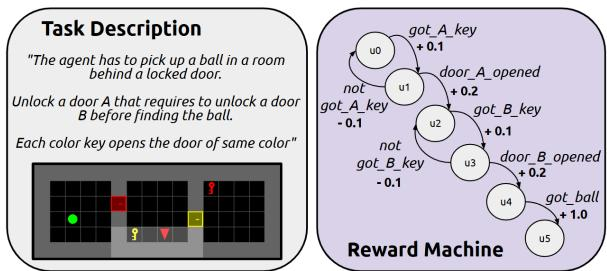  
Figure 2: ARM-FM leverage FMs to automatically construct RMs: using the UnlockToUnlock task description from MiniGrid (left), an RM is automatically constructed to solve the task (right).

of the RM; Σ is the finite set of symbols representing events that cause transitions in the RM; $\delta : U \times \Sigma \to U$ is the deterministic RM transition function; $R : U \times S \times A \times S $ R is the RM reward function; $F \subseteq U$ is the set of final RM states; and $\mathcal { L } : S \times A \to \Sigma$ is the labeling function that connects MDP states $s \in S$ and actions $a \in A$ to the RM event symbols $\sigma \in \Sigma$ . Intuitively, RMs are useful for describing tasks at an abstract level, especially when said tasks require multiple steps over long time horizons. Each RM state $u \in U$ can be thought of as representing a subtask, and the transitions $u ^ { \prime } = \delta ( u , \sigma )$ denote progress to a new stage of the overall objective after a particular event $\sigma \in \Sigma$ occurs in the environment. The RM reward function $R ( u , s , a , \bar { s } ^ { \prime } )$ assigns a reward based on the current RM state u and the underlying MDP transition $( s , a , s ^ { \prime } )$ . Meanwhile, the set of final RM states F defines the conditions under which the task described by the RM is complete. Finally, the labeling function L is required to connect the RM’s events, transitions, and rewards to states and actions from the underlying MDP.

We define LARMs as RMs that are additionally equipped with natural-language instructions $l _ { u }$ for each RM state $u ,$ and with an embedding function $\phi ( \cdot )$ that maps such language instructions to an embedding vector $\overline { { z _ { u } } } ~ \overline { { = ~ \phi ( l _ { u } ) ~ \in ~ \mathbb { R } ^ { d } } }$ We note that by equipping RM states with embedding vectors $z _ { u }$ that encode language-based descriptions of the corresponding subtasks, we provide the first mechanism for constructing a semantically grounded skill space in RMs: policies conditioned on these embeddings can naturally share knowledge across related subtasks, enabling transfer, compositionality, and zero-shot generalization.

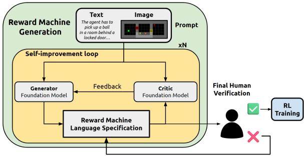  
Figure 3: A self-improvement loop where a generator and critic FMs iteratively refine LARMs, with optional human verification.

We present a framework to automatically construct LARMs from language-and-image-based task descriptions by iteratively prompting an FM, as is illustrated in Figure 3. More specifically, to progressively refine the RM specification, we employ N rounds of self-improvement using paired generator and critic FMs (Tian et al., 2024). A human may optionally intervene by approving the output or providing corrective feedback (see Appendix A.4 for details). In practice, we find that FM-generated reward machines are both interpretable and easily modifiable, as they follow a natural language specification. Figure 4 illustrates an automatically-constructed LARM for the UnlockToUnlock task, including a text-based description of the RM (left), FM-generated labeling functions L (middle), and natural RM state instructions and embeddings $l _ { u }$ (right). All RMs and labeling functions used in this work are shown in Appendix A.9 and A.10. While we use code to define labeling functions in this work, the ARM-FM framework is general, supporting any boolean predicate (e.g. formal logic, or queries to other FMs).

## 2.2 REINFORCEMENT LEARNING WITH LARMS

The introduction of the LARM uses an augmented state space that is the cross-product of the MDP and RM states $( S \times \mathcal { U } )$ , and a reward function that is the sum of the MDP and RM rewards; we will refer to this augmented MDP as $\mathcal { M } ^ { \prime }$ , and it is illustrated in Figure 1 (Bottom). At timestep t, the agent selects actions conditioned on the environment state and the language embedding of the current LARM state: $\intercal ( s _ { t } , z _ { u _ { t } } )$ This language-based policy conditioning is the central mechanism enabling generalization in our framework, creating a semantically grounded skill space where instructions like “pick up a blue $\mathrm { k e y " }$ and "pick up a red key" are naturally close in the embedding space, unlocking a pathway for broad experience reuse and efficient policy transfer.

During training, after the agent executes an action $a _ { t } \sim \pi ( s _ { t } , z _ { u _ { t } } )$ , the underlying MDP transitions to $s _ { t + 1 }$ and returns a reward $R _ { t }$ . The labeling function $\mathcal { L } ( s _ { t + 1 } , a _ { t } )$ determines if a symbolic event has occurred, which may induce a LARM transition $u _ { t + 1 } = \delta ( u _ { t } , \mathcal { L } ( s _ { t + 1 } , a _ { t } ) )$ ), as well as an additional reward $\dot { R } _ { t } ^ { \mathrm { R M } }$ . The sum of the MDP and RM rewards are then used for learning: $R _ { t } ^ { \mathrm { t o t a l } } ~ = ~ R _ { t } + R _ { t } ^ { \mathrm { R M } }$ This complete training procedure, adapted for a DQN agent, is formalized in Appendix A.3. The effectiveness of well-designed LARMs yields theoretical guarantees (see Appendix A.5), ensuring that the generated reward structure preserves the optimal policy of the original sparse task.

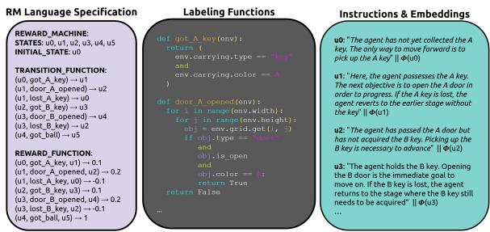  
Figure 4: The three core components generated by our method for the UnlockToUnlock environment: (Left) the RM specification, (Center) the labeling functions that drive the state transitions, and (Right) the instructions and embeddings for each RM state.

## 3 EMPIRICAL RESULTS

We present a series of experiments designed to evaluate the effectiveness and scalability of our method: we test generalization and long-horizon planning in sparse-reward settings with the MiniGrid and BabyAI suites (Chevalier-Boisvert et al., 2023) (Section 3.1), we evaluate scalability with a resource gathering task in a 3D, procedurally generated Minecraft world from Craftium (Malagón et al., 2024) (Section 3.2), and we demonstrate the applicability of our approach to create RMs that work in continuous control in challenging robotics tasks from Meta-World (McLean et al., 2025) (Section 3.3). Finally, we use XLand-MiniGrid (Nikulin et al., 2024) to evaluate the generalization capabilities of RL agents trained with LARMs (Section 3.4). Screenshots of these environments are shown in Figure 5 and environment-specific details in Appendix A.2. We used GPT-4o (Hurst et al., 2024) to generate all LARM components for all tasks, with the exception of the 1,000 LARMs for XLand-MiniGrid. These were generated using various open-source FMs of different scales for our ablation study.

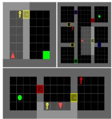  
(a) MiniGrid

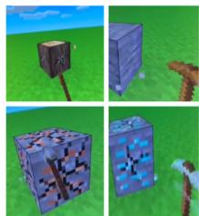  
(b) Craftium

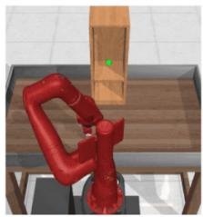  
(c) Meta-World

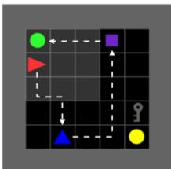  
(d)  
XLand-MiniGrid  
Figure 5: Evaluation environments. (a) MiniGrid: tests long-horizon planning with sparse rewards. (b) Craftium: scaling complexity in a 3D Minecraft-inspired world. (c) Meta-World: continuous robotic manipulation. (d) XLand-MiniGrid: tests multi-task generalization.

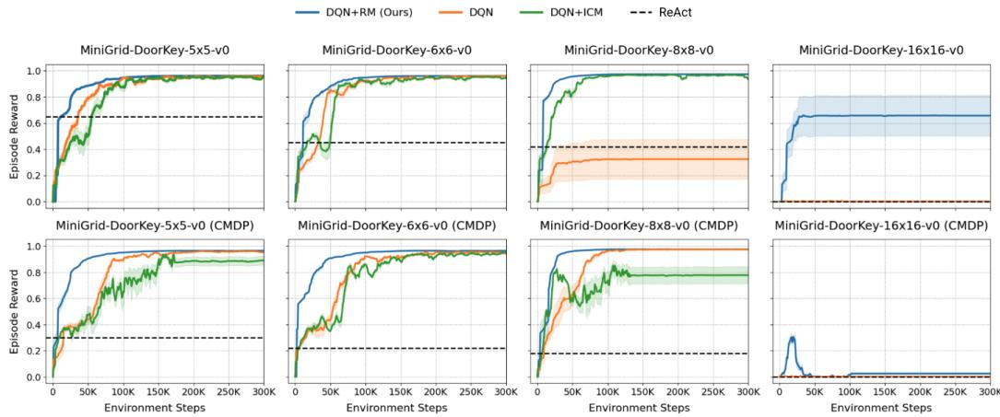  
Figure 6: Performance on MiniGrid-DoorKey environments of increasing size. The top row shows performance on a fixed map layout, while the bottom row shows performance on procedurally generated layouts. Our method consistently achieves higher rewards across all tasks.

We report results averaged over 3 independent random seeds, with shaded regions and error bars indicating one standard deviation. Comprehensive details for all environments as well as additional results are presented in Appendix A.2, details on the baselines used and additional ablations in A.7, and hyperparameters in A.11.

## 3.1 SPARSE REWARD TASKS

We first evaluate our method on the MiniGrid suite of environments, which are challenging due to sparse rewards. For these experiments, we use DQN (Mnih et al., 2013) as the base agent and compare our method (DQN+RM) with a baseline with intrinsic motivation (DQN+ICM) (Pathak et al., 2017), ReAct (Yao et al., 2023) – an LLM-as-agent baseline which generates reasoning traces as it acts in the environment (Paglieri et al., 2024) – as well as an unmodified DQN. In Appendix A.7.4 we include results comparing to a VLM-as-reward-model baseline proposed by Rocamonde et al. (2023). The LARMs used to train our DQN+RM agent are shown in Appendix A.9.

Our agent successfully solves a suite of challenging exploration tasks where all baselines fail. We first present results on the DoorKey task in Figure 6, showing performance across increasing grid sizes. Our method consistently outperforms the baselines in all settings, including fixed maps (top row) and procedurally generated maps where the layout is randomized each episode (bottom row). We provide an additional analysis of our method’s success in Appendix A.7.2. To further test our agent, we select three significantly harder tasks that require longer planning horizons: UnlockToUnlock, BlockedUnlockPickup, and KeyCorridor. As demonstrated in Figure 7, our agent is the only one capable of solving all three tasks and achieving near-perfect reward, while all other baselines fail to make any progress.

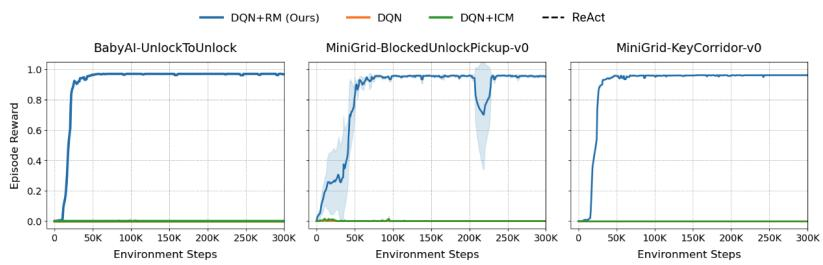  
Figure 7: Performance on complex, long-horizon MiniGrid tasks. Our method successfully solves all three, while baselines show no learning.

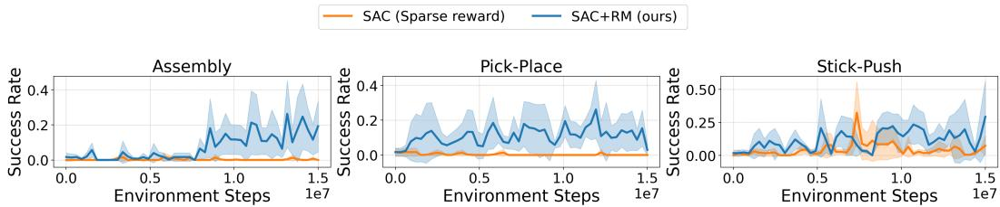  
Figure 8: Performance on Meta-World manipulation tasks. In most tasks, our method achieves high success rates compared to the sparse reward agent.

## 3.2 SCALING TO COMPLEX 3D ENVIRONMENTS

We assess our method’s performance in a complex, procedurally generated 3D environment using Craftium (Malagón et al., 2024), which is a Minecraft-based resource-gathering task. Here, the agent’s goal is to mine a diamond by first navigating the world to gather the required wood, stone, and iron. The environment provides a sparse reward only upon collecting the final diamond. For this set of experiments we use PPO (Schulman et al., 2017) as the base agent.

As shown in Figure 1 (right), PPO augmented with our generated LARM consistently completes the entire task sequence, while the baseline PPO agent makes minimal progress. This result is particularly significant, as RMs often require manual, expert-driven design which can become challenging in complex, open-ended environments (Icarte et al., 2022). In contrast, we demonstrate the successful application of a RM that is not only automatically generated by a FM but is also highly effective in a complex 3D, procedurally generated environment. The LARM achieves this by effectively decomposing the high-level goal into progressive subtasks and providing crucial intermediate rewards. This experiment highlights our framework’s ability to handle increased action dimensionality and visual complexity, and it showcases the capability of FMs to leverage their knowledge to automate task decomposition.

## 3.3 ROBOTIC MANIPULATION

Our framework can automate the complex task of reward engineering for robotic manipulation, providing dense supervision with a FM-generated LARM. We evaluate this capability in continuous control domains using the Meta-World benchmark (McLean et al., 2025), where designing dense reward functions typically requires extensive hand-engineering of low-level signals (e.g., joint angles). Our approach bypasses this difficulty entirely. The resulting reward machine offers richer learning signals than sparse rewards, enabling the agent to make more progress. As demonstrated in Figure 8, our method achieves higher success rates than learning from sparse rewards alone, using SAC (Haarnoja et al., 2018) as the base agent. Additional experiments on Meta-World are provided in Appendix A.2.3.

## 3.4 GENERALIZATION THROUGH LANGUAGE EMBEDDINGS

A key design choice in our framework is to condition the agent’s policy on the language embeddings of the current RM state, which contrasts with prior work that uses separate policies that do not permit knowledge sharing (Alsadat et al., 2025). In the following, we (i) ablate the roles of the LARM rewards and state embeddings in enabling an RL agent to learn robust, multi-task policies; and (ii) demonstrate how the compositional structure of LARMs leads to zero-shot generalization on unseen tasks. For clarity, we refer here to zero-shot generalization across novel task compositions within the same domain, rather than cross-domain transfer.

Both structured rewards and language-based state conditioning are essential for learning a robust, multi-task policy. To disentangle the benefits of the LARM’s reward structure from the state embeddings, we conduct an ablation study in a multi-task setting. We train a single Rainbow DQN (Hessel et al., 2018) agent on an increasing number of simultaneous XLand-MiniGrid tasks and measure its average success rate. As shown in Figure 9, the baseline agent fails to generalize as the number of tasks increases. Providing the policy with only the state embeddings gives it a weak learning signal that degrades quickly. Conversely, providing only the LARM rewards enables multi-task learning, but the policy struggles as it is unaware of the active sub-goal. Our full method, which uses both the dense rewards from the LARM and the state embeddings to condition the policy, is robust and maintains high performance even when trained on 10 simultaneous tasks.

The compositional structure of LARMs enables zero-shot generalization to novel tasks composed of previously seen sub-goals. The ultimate test of our compositional approach is whether the trained policy, $\pi ( a _ { t } | s _ { t } , z _ { u _ { t } } )$ , can solve a novel task without any additional training. We design an experiment where π is trained on a set of tasks, $\{ \bar { \mathcal { T } _ { A } } , \mathcal { T } _ { B } \}$ , each with an associated LARM, $\mathcal { R } _ { A }$ and $\mathcal { R } _ { B }$ . During training, the policy learns skills corresponding to the union of all sub-goal embeddings, $\{ z _ { u } | \bar { u } \in U _ { A } \cup U _ { B } \}$ At evaluation time, we introduce a new, unseen task, ${ \mathcal { T } } _ { C } .$ , with a novel LARM, $\mathcal { R } _ { C }$ , generated by the FM. Zero-shot success is possible if the set of sub-goals in the new task is composed of elements semantically familiar from training, i.e., if for any state $u ^ { \prime } \in U _ { C }$ , its embedding $z _ { u ^ { \prime } }$ is close to an embedding seen during training.

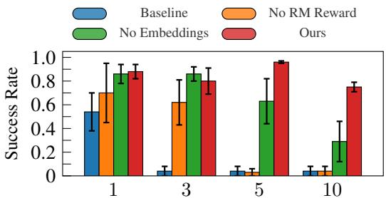  
Number of Simultaneous Environments

Figure 9: Ablation study of the components of ARM-FM. A Rainbow agent is trained on an increasing number of tasks. While baselines fail to generalize, only our full method (combining LARM rewards and state embeddings) maintains high success as the number of tasks grows.

As illustrated in Figure 10, the agent successfully solves Task C. When the LARM for Task C transitions to a state $u _ { t } ^ { \prime } .$ , the policy receives the input $\left( { { s } _ { t } } , { { z } _ { u _ { t } ^ { \prime } } } \right)$ . Because the embedding $z _ { u _ { t } ^ { \prime } }$ (e.g., for "Pick up a blue key, Position yourself to the right of the blue pyramid") is already located in a familiar region of the skill space, the policy can reuse the relevant learned behavior to make progress and solve the unseen composite task.

## 4 ARM-FM: IN-DEPTH ANALYSIS

We now conduct a fine-grained analysis of our method’s key components by evaluating (i) the quality of the LARMs generated by different FMs; and (ii) the semantic structure of the state embeddings.

Larger foundation models generate syntactically correct task structures with significantly higher reliability. To evaluate the FM’s generation capabilities, we sampled 1,000 diverse tasks from the XLand-MiniGrid environment (Nikulin et al., 2024) and prompted various open-source models to generate the corresponding reward machines, Python labeling functions, and natural language instructions. We compare models of different scales from the Qwen (Qwen, 2025), Gemma (Gemma, 2025), Llama (Dubey et al., 2024) and Mistral families. We employed an LLM-as-judge protocol to score the correctness of the generated artifacts (Gu et al., 2024), using Qwen3-30B-A3B-Instruct-

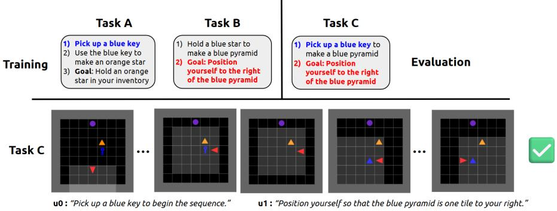  
Figure 10: Demonstration of zero-shot generalization. An agent is trained on a set of tasks (A, B). At evaluation, it is given a new LARM for an unseen composite task (C). Because the sub-tasks in C (e.g., "Pick up a blue key") are semantically familiar from training, the agent can reuse learned skills to solve the novel task without any fine-tuning.

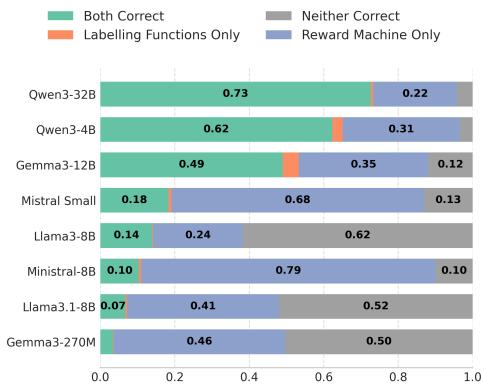  
(a) FM generation correctness.

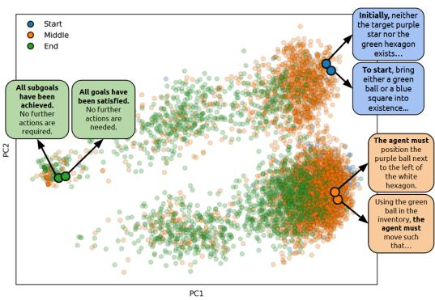  
(b) Semantic structure of state embeddings.  
Figure 11: Analysis of FM-generated task components. (a) An LLM-as-judge evaluation across 1,000 tasks reveals a strong scaling trend, where larger foundation models more reliably generate correct RM structures and verifier code. (b) PCA visualization of thousands of state instruction embeddings shows a clear semantic structure, with start, middle, and end states forming distinct clusters.

2507 as the judge (a FM not used to generate the LARMs). Figure 11a shows a clear scaling trend: larger models like Qwen3-32B are significantly more capable of generating fully correct task specifications. Interestingly, some models exhibit different strengths; for instance, Mistral-Small is more adept at generating a valid RM structure than correct labeling code, highlighting the distinct reasoning and coding capabilities required.

The FM-generated state instructions produce a semantically coherent embedding space that clusters related sub-goals. Beyond syntactic correctness, the agent’s ability to generalize depends on the semantic quality of the state instruction embeddings. A well-structured embedding space should group semantically similar sub-tasks together, regardless of the overarching task. We analyze this by visualizing the embeddings of state instructions from the 1,000 generated XLand-MiniGrid tasks using PCA (Abdi & Williams, 2010), as shown in Figure 11b. We used Qwen3-30B-A3B-Instruct-2507 to obtain the embeddings. The embeddings form distinct and meaningful clusters, with instructions corresponding to the start, middle, and end of a task occupying different regions of the space. Notably, instructions with similar meanings from different tasks cluster together, confirming that the FM produces a coherent representation. This underlying semantic structure is what enables a shared policy to treat related sub-tasks in a similar manner, forming the foundation for skill transfer.

## 5 RELATED WORK

Reward Machines in Reinforcement Learning. RMs are a formal language representation of reward functions that expose the temporal and logical structure of tasks, thus enabling decomposition, transfer, and improved sample efficiency in learning (Icarte et al., 2018; 2022). For these reasons, RMs and related formal methods for task specification have been applied to address diverse challenges, from multiagent task decomposition (Neary et al., 2021; Smith et al., 2023) to robotic manipulation and task planning (Camacho et al., 2021; He et al., 2015; Cai et al., 2021). Recent work continues to broaden their applicability, by studying extensions that increase their expressivity (Varricchione et al., 2025), and by addressing uncertainty in symbol grounding and labeling functions (Li et al., 2024; 2025). While RMs can be difficult to design for non-experts, Toro Icarte et al. (2019) and Xu et al. (2020) propose methods that simultaneously learn RMs and RL policies, if the RM is unknown a priori.

Recent work also explores FM-driven automata. While some approaches treat RM states as isolated symbols Alsadat et al. (2025), requiring careful state mapping for policy re-use, others use FMs with classic algorithms for automaton discovery Vazquez-Chanlatte et al. (2025), which requires expert demonstrations. Our work differs by generating RMs directly from language descriptions, without behavioral examples. Concurrently, methods like RAD embeddings Yalcinkaya et al. (2024) have been proposed to condition the policy on the automaton’s topology. We take a complementary, language-first approach: our FM generates language-aligned embeddings for the meaning of each state, which our results show effectively grounds the policy.

By contrast, ARM-FM not only generates RMs from natural language task descriptions, but also introduces a natural mechanism for connecting RM states by embedding their associated subtask descriptions in a shared latent space. Conditioning the policy on these language embeddings can thus enable knowledge transfer across similar subtasks, even when they occur in different RMs.

Foundation Models in Decision-Making. The emergence of FMs has inspired two main lines of work in sequential decision-making. The first uses FMs directly as autonomous agents (Paglieri et al., 2024). Approaches such as ReAct, (Yao et al., 2023) Voyager (Wang et al., 2023) and SayCan Ahn et al. (2022) employ large language models (LLMs) to perform reasoning, planning, and acting. While these systems demonstrate strong capabilities in complex domains, they heavily depend on environment abstractions (e.g., textual interfaces or code as actions) that bypass many of the low-level perception and control challenges central to RL. In contrast, we use RMs to structure policies for learning agents, solving complex sparse reward tasks beyond the reach of non-learning, in-context methods like ReAct which additionally require high-level textual interfaces.

A second line of research integrates FMs with RL training by using them to provide auxiliary signals such as high-level goals or reward feedback. For example, Motif (Klissarov et al., 2023) elicits trajectory-level preferences from FMs and distills them into a reward model. ONI (Zheng et al., 2024) aggregates asynchronous LLM feedback into a continuously updated reward function. Eureka (Ma et al., 2023) leverages evolutionary strategies to generate programmatic reward functions, which are then used to train downstream policies. ELLM uses pretrained LLMs to suggest plausibly useful goals and trains RL agents with goal-reaching rewards. These approaches illustrate the potential of injecting FM knowledge to shape RL objectives. However, the outputs are typically limited to an opaque reward model, rather than a structured, compositional representation of the task.

Our work differs in the structure of the FM–RL interface. We employ FMs to generate languagealigned RMs: structured, compositional, and interpretable representations of task reward functions. This formulation combines the expressivity of FMs with the explicit, modular decomposition, and human-in-the-loop refinement enabled by RMs, offering a principled path toward hierarchical and interpretable RL. Additionally, our method does not depend on specific environment abstractions (Wang et al., 2023) or the availability of a natural language interface (Klissarov et al., 2023). We provide a detailed comparison with existing methods in Section A.6 (see Table 4).

## 6 CONCLUSION

In this work, we introduce Automated Reward Machines via Foundation Models (ARM-FM), a framework that bridges the critical gap between the semantic reasoning of foundation models and the low-level control of reinforcement learning agents. Our central contribution is a method for automatically generating Language-Aligned Reward Machines (LARMs) from natural language. We demonstrated that by conditioning a single policy on the embeddings of the LARM’s natural language state descriptions, we transform the reward machine from a static plan into a compositional library of reusable skills. Our experiments confirmed the effectiveness of this approach. We showed that ARM-FM solves a suite of long-horizon, sparse-reward tasks across diverse domains – from 2D grid worlds to a procedurally generated 3D crafting environment – that are intractable for strong RL baselines. Our analysis revealed that this performance is underpinned by a coherent semantic structure in the state embedding space and that both the structured rewards and the state embeddings are critical for robust multi-task learning. The ultimate validation of our compositional approach was the demonstration of zero-shot generalization to a novel, unseen task without any additional training.

Ultimately, this work establishes language-aligned reward machines as a powerful and versatile framework connecting foundation models, RL agents, and human operators. The modular, languagebased structure allows FMs to generate accurate plans, agents to learn generalizable skills, and humans to easily inspect and refine the task specifications. While this paradigm is promising, one tradeoff of our approach is the human verification step during RM generation. On one hand, this step may be viewed as a feature – the language-based reward structures output by ARM-FM provide an interface for humans to interpret and refine task specifications. On the other hand, this step presupposes access to human verifiers. We note, however, that such verifiers are not strictly required, although they can improve output quality when available. Furthermore, future work may reduce or eliminate this dependence by exploiting the automaton-based structure of RMs to enable automated self-correction, for example, through formal verification. More broadly, we believe this work paves the way for a new class of RL agents that can translate high-level human intent and FM-generated plans into competent, generalizable, and interpretable behavior.

## ACKNOWLEDGEMENTS

We want to acknowledge funding support from Natural Sciences and Engineering Research Council (NSERC) of Canada, Google Research, and The Canadian Institute for Advanced Research (CIFAR) and compute support from Digital Research Alliance of Canada, Mila IDT, and NVidia.

## REFERENCES

Hervé Abdi and Lynne J Williams. Principal component analysis. Wiley interdisciplinary reviews: computational statistics, 2(4):433–459, 2010.

Michael Ahn, Anthony Brohan, Noah Brown, Yevgen Chebotar, Omar Cortes, Byron David, Chelsea Finn, Chuyuan Fu, Keerthana Gopalakrishnan, Karol Hausman, et al. Do as i can, not as i say: Grounding language in robotic affordances. arXiv preprint arXiv:2204.01691, 2022.

Shayan Meshkat Alsadat, Jean-Raphaël Gaglione, Daniel Neider, Ufuk Topcu, and Zhe Xu. Using large language models to automate and expedite reinforcement learning with reward machine. In 2025 American Control Conference (ACC), pp. 206–211. IEEE, 2025.

Mingyu Cai, Mohammadhosein Hasanbeig, Shaoping Xiao, Alessandro Abate, and Zhen Kan. Modular deep reinforcement learning for continuous motion planning with temporal logic. IEEE robotics and automation letters, 6(4):7973–7980, 2021.

Alberto Camacho, Jacob Varley, Andy Zeng, Deepali Jain, Atil Iscen, and Dmitry Kalashnikov. Reward machines for vision-based robotic manipulation. In 2021 IEEE International Conference on Robotics and Automation (ICRA), pp. 14284–14290. IEEE, 2021.

Maxime Chevalier-Boisvert, Bolun Dai, Mark Towers, Rodrigo De Lazcano Perez-Vicente, Lucas Willems, Salem Lahlou, Suman Pal, Pablo Samuel Castro, and J K Terry. Minigrid & miniworld: Modular & customizable reinforcement learning environments for goal-oriented tasks. In Thirtyseventh Conference on Neural Information Processing Systems Datasets and Benchmarks Track, 2023. URL https://openreview.net/forum?id=PFfmfspm28.

Rati Devidze, Parameswaran Kamalaruban, and Adish Singla. Exploration-guided reward shaping for reinforcement learning under sparse rewards. Advances in Neural Information Processing Systems, 35:5829–5842, 2022.

Yuqing Du, Olivia Watkins, Zihan Wang, Cédric Colas, Trevor Darrell, Pieter Abbeel, Abhishek Gupta, and Jacob Andreas. Guiding pretraining in reinforcement learning with large language models. In International Conference on Machine Learning, pp. 8657–8677. PMLR, 2023.

Abhimanyu Dubey, Abhinav Jauhri, Abhinav Pandey, Abhishek Kadian, Ahmad Al-Dahle, Aiesha Letman, Akhil Mathur, Alan Schelten, Amy Yang, Angela Fan, et al. The llama 3 herd of models. arXiv e-prints, pp. arXiv–2407, 2024.

Jiayi Fu, Xuandong Zhao, Chengyuan Yao, Heng Wang, Qi Han, and Yanghua Xiao. Reward shaping to mitigate reward hacking in rlhf. arXiv preprint arXiv:2502.18770, 2025.

Gemma. Gemma 3 technical report. arXiv preprint arXiv:2503.19786, 2025.

Jiawei Gu, Xuhui Jiang, Zhichao Shi, Hexiang Tan, Xuehao Zhai, Chengjin Xu, Wei Li, Yinghan Shen, Shengjie Ma, Honghao Liu, et al. A survey on llm-as-a-judge. arXiv preprint arXiv:2411.15594, 2024.