## ABSTRACT

Accurate estimation of the Q-function is a central challenge in offline reinforcement learning. However, existing approaches often rely on a shared global Q-function, which is inadequate for capturing the compositional structure of tasks that consist of diverse subtasks. We propose In-context Compositional Q-Learning (ICQL), an offline RL framework that formulates Q-learning as a contextual inference problem and uses linear Transformers to adaptively infer local Q-functions from retrieved transitions without explicit subtask labels. Theoretically, we show that, under two assumptions—linear approximability of the local Q-function and accurate inference of weights from retrieved context—ICQL achieves a bounded approximation error for the Q-function and enables near-optimal policy extraction. Empirically, ICQL substantially improves performance in offline settings, achieving gains of up to 16.4% on kitchen tasks and up to 8.8% and 6.3% on MuJoCo and Adroit tasks, respectively. These results highlight the underexplored potential of in-context learning for robust and compositional value estimation and establish ICQL as a principled and effective framework for offline RL.

## 1 INTRODUCTION

Offline reinforcement learning (Offline RL) aims to learn effective policies from fixed datasets without further interaction with the environment (Fujimoto et al., 2019; Lange et al., 2012). This setting is especially important in real-world domains such as robotics (Kalashnikov et al., 2018), logistics (Wang et al., 2021), and operations research (Hubbs et al., 2020; Mazyavkina et al., 2021), where environment access is limited, data collection is expensive or risky, and historical data is often the only available resource. A central challenge is distributional shift: when a learned policy queries state-action pairs outside the dataset support, value extrapolation can cause severe overestimation and degenerate performance. (Fu et al., 2020; Kumar et al., 2020)

Contemporary methods primarily employ policy constraints (Chen et al., 2021) or value regularization (Kumar et al., 2020; Kostrikov et al., 2022) to address this challenge. However, policy-constraint methods are largely limited by the behavior policies used to collect the offline data and exhibit a trade-off between generalization and safe adherence to the constraint. Recent value-regularization methods aim to provide conservative estimates that impose softer penalties on out-of-distribution actions. Nevertheless, the optimality of the learned value function is not guaranteed when the static dataset is limited and potentially biased.

We observe that, in many RL control tasks, the state space can often be naturally divided into multiple subtasks. Although an expressive action-value function may in principle capture stateaction values accurately, the knowledge learned from one subtask may not be fully transferable to another. For example, in MuJoCo locomotion tasks, knowledge for increasing walking speed may not help with recovery from unexpected non-nominal states. A visualization of this phenomenon is provided in Figure 1, which shows the distribution of states after dimensionality reduction, with colors indicating their actual future returns in the offline dataset. Moreover, although states in the dataset can often be grouped into coherent clusters, each of which typically corresponds to a specific subtask, two clusters that are geometrically similar may nevertheless correspond to semantically different behaviors and exhibit distinct long-horizon returns. When offline data are insufficient and exploration is unavailable, this property is not naturally captured by an offline value-learning algorithm that fits a shared global value function.

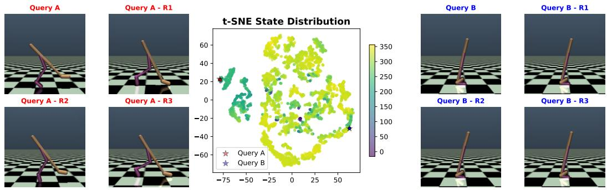  
Figure 1: Center: dimension-reduced states and SAC value estimates on Walker2d-Medium-Expert. Left and right: two groups of similar states.

To address these challenges, we propose to cast value learning in offline reinforcement learning as a contextual inference problem, thereby enabling local Q-function approximation through incontext learning. Specifically, we introduce In-context Compositional Q-Learning (ICQL), a general framework for offline RL that leverages the in-context learning capability of linear Transformers to infer local Q-functions from small retrieved sets of transitions. Rather than fitting a global approximator of the value function, ICQL leverages the compositional nature and local structure of the task to learn a family of value functions, thereby enabling flexible local adaptation of value estimation within context windows. Our key contributions are summarized as follows:

• To the best of our knowledge, we introduce the first offline RL framework ICQL that formulates Q-learning as a contextual inference problem, leveraging in-context learning with linear Transformers to adaptively infer local Q-functions without requiring explicit subtask labels or predefined subtask structure.

• We provide a theoretical analysis showing that ICQL achieves bounded approximation error under two assumptions—linear approximability of the local Q-function and accurate inference of the weights from retrieved context—and prove that the greedy policy with respect to the inferred Q-function is near-optimal.

• ICQL improves performance in offline settings through in-context local approximation, and we demonstrate the effectiveness of ICQL in both offline Q-learning and offline actor-critic frameworks. On Gym and Adroit tasks, ICQL yields score improvements of 8.8% and 6.3%, respectively. Notably, on Kitchen tasks, ICQL achieves a 16.4% performance improvement over the second-best baseline. We further show that ICQL yields more accurate value estimation than strong baselines. These results highlight the underexplored potential of linear attention for robust and compositional value estimation in offline RL.

• We conduct extensive ablation studies to isolate the contributions of in-context learning and localized value inference. In addition, we investigate the impact of different retrieval strategies, including similarity metrics and context selection criteria, on overall performance and stability.

## 2 RELATED WORK

Offline Reinforcement Learning. Offline RL aims to learn effective policies from static datasets without further interaction with the environment. A central challenge in this setting is distributional shift, which can lead to severe value overestimation and degraded policy performance when the learned policy queries out-of-distribution actions. Several influential approaches address this issue by modifying Q-learning objectives or introducing conservative regularization. Representative examples include CQL (Kumar et al., 2020), IQL (Kostrikov et al., 2022), and TD3+BC (Fujimoto & Gu, 2021). CQL introduces a conservative penalty on Q-values for out-of-distribution actions to mitigate overestimation. TD3+BC combines TD3 with a behavior cloning loss to bias policy updates toward actions in the dataset while retaining value-based learning. IQL removes explicit policy optimization and learns value-weighted regression targets to implicitly extract high-value actions from offline data. More recent work has continued to improve offline RL from several complementary directions. ReBRAC (Tarasov et al., 2023) revisits the minimalist actor-critic design in offline RL and shows that strong performance can be obtained through careful regularization and implementation choices. DMG (Mao et al., 2024) studies how to obtain better generalization in offline RL under mild assumptions. FQL (Park et al., 2025) introduces a flow-based perspective for Q-learning, while QC (Li et al., 2025) explores temporally structured action representations through action chunking. In addition, retrieval-augmented sequence-modeling approaches such as RA-DT (Schmied et al., 2024) enrich decision-transformer-style policies with external memory for in-context RL. Despite their differences, these methods still mainly rely on global value or policy models trained over the entire dataset. Such global modeling can be limiting in compositional environments, where local transition structure and subtask-specific value patterns may vary substantially across the state space. In contrast, our approach casts value learning as a collection of local estimation problems and uses in-context inference to adapt Q-functions to retrieved local transition dynamics without requiring additional supervision.

In-context Learning in RL. Recent work has applied Transformers to offline RL, often through sequence modeling for return-conditioned policy learning (Zhao et al., 2025). For example, Decision Transformer (Chen et al., 2021) and Gato (Reed et al., 2022) treat trajectories as sequences, while replay-based in-context RL (Chen et al., 2021; Reed et al., 2022) uses Transformers for behavior cloning and reward learning. These approaches leverage the ability of pre-trained Transformers to adapt through prompt conditioning or in-context learning. In-context learning has both a strong theoretical foundation (Von Oswald et al., 2023; Shen et al., 2024; Wang et al., 2025b) and strong empirical performance across tasks (Hollmann et al., 2023; Micheli et al., 2023), and it is increasingly studied in supervised settings (Laskin et al., 2023; Lee et al., 2023; Mukherjee et al., 2025). (Laskin et al., 2023) proposes Algorithm Distillation (AD) to mimic the data-collection policy, but this approach is constrained by the quality of the original algorithm. DPT (Lee et al., 2023) improves regret in contextual bandits through in-context learning, but it assumes access to optimal actions, which is often unrealistic in offline RL. PreDeToR (Mukherjee et al., 2025) adds reward prediction to Decision Transformer models, yet it still focuses on action generation. While these approaches focus on directly generating actions or policies from trajectories, they do not explicitly target value estimation, which is outside the scope of this paper. Therefore, we do not include these methods as baselines. Although recent work has explored Transformers in offline RL primarily for trajectory modeling or return-conditioned generation (Chen et al., 2021; Laskin et al., 2023; Mukherjee et al., 2025), we instead study linear attention as a tool for in-context value learning. Our results suggest that linear attention, when used for local Q-function estimation, provides strong performance and generalization benefits. To our knowledge, this is the first work to demonstrate the potential of linear attention for compositional value-based offline RL.

## 3 METHODOLOGY

In this section, we introduce the proposed ICQL framework, including its local value modeling, retrieval mechanism, learning procedure, and theoretical properties.

## 3.1 LOCAL Q-FUNCTIONS

In this section, we define local Q-functions for offline RL based on the local neighborhood associated with each state. We let D denote the dataset containing all offline transitions.

Definition 3.1. (Local Q-function Approximation) Given a transition $( s , a , r , s ^ { \prime } , a ^ { \prime } ) \in \mathcal { D }$ , for some $d , \bar { d } > 0$ , a nearby transition $( \bar { s } , \bar { a } , \bar { r } , \bar { \bar { s } ^ { \prime } } , \bar { a } ^ { \prime } ) \in \mathcal { D }$ is defined as

$$
(\bar {s}, \bar {a}, \bar {r}, \bar {s} ^ {\prime}, \bar {a} ^ {\prime}) \in \left\{(s _ {i}, a _ {i}, r _ {i}, s _ {i} ^ {\prime}, a _ {i} ^ {\prime}) \in \mathcal {D} \Big | \| s _ {i} - s \| _ {2} ^ {2} \leq d ^ {2} \text {and} \| s _ {i} ^ {\prime} - s _ {i} \| _ {2} ^ {2} \leq \bar {d} ^ {2} \right\} \triangleq \Omega_ {s} ^ {(d, \bar {d})}.\tag{1}
$$

For any transition $( \bar { s } , \bar { a } , \bar { r } , \bar { s } ^ { \prime } , \bar { a } ^ { \prime } ) \in \Omega _ { s } ^ { ( d , \bar { d } ) }$ , there exists an optimal uniform local weight vector $\boldsymbol { w _ { s } ^ { * } }$ such that the local Q-function approximation is defined as

$$
\hat {Q} _ {\Omega_ {s} ^ {(d, \bar {d})}} (\bar {s}, \bar {a}) \triangleq w _ {s} ^ {* T} \phi (\bar {s}, \bar {a}), \quad \forall (\bar {s}, \bar {a}, \bar {r}, \bar {s} ^ {\prime}, \bar {a} ^ {\prime}) \in \Omega_ {s} ^ {(d, \bar {d})},\tag{2}
$$

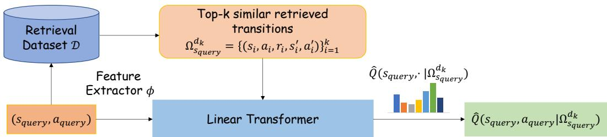  
Figure 2: An overview of In-Context Compositional Q-Learning (ICQL). Given a query state-action pair $( s _ { \mathrm { q u e r y } } , a _ { \mathrm { q u e r y } } )$ , the model embeds it with the feature extractor $\phi ,$ retrieves the top-k most similar transitions from the offline dataset D, and forms a local context set. A local linear Q-function $\hat { Q } ( s , a | \Omega _ { s _ { \mathrm { q u e r y } } } ^ { d _ { k } } )$ is then estimated from the retrieved context and used to update the actor.

where the function $\phi : \mathcal { S } \times \mathcal { A } \to \mathbb { R } ^ { d }$ is the feature function of the state-action pair $( { \bar { s } } , { \bar { a } } )$ . The best approximation to the local Q-function $Q _ { \Omega _ { s } ^ { ( d , \bar { d } ) } } \left( \bar { s } , \bar { a } \right)$ is $\hat { Q } _ { \Omega _ { s } ^ { ( d , \bar { d } ) } } ( \bar { s } , \bar { a } )$ , that is, there exists some $\varepsilon _ { \mathrm { a p p r o x } } ^ { s } > 0$ such that

$$
\left| Q _ {\Omega_ {s} ^ {(d, \bar {d})}} (\bar {s}, \bar {a}) - w _ {s} ^ {* ^ {\top}} \phi (\bar {s}, \bar {a}) \right| \leq \varepsilon_ {\text {approx}} ^ {s}, \quad \forall (\bar {s}, \bar {a}, \bar {r}, \bar {s} ^ {\prime}, \bar {a} ^ {\prime}) \in \Omega_ {s} ^ {(d, \bar {d})}.\tag{3}
$$

In the remainder of this paper, we omit ¯d from the notation of $\Omega _ { s } ^ { ( d , \bar { d } ) }$ in Equation (1), because the condition $\begin{array} { r } { \| \bar { s } ^ { \prime } - \bar { s } \| _ { 2 } ^ { 2 } \leq \bar { d } ^ { 2 } } \end{array}$ for some $\bar { d } > 0$ can be readily satisfied in continuous domains. We use $\Omega _ { s } ^ { d }$ to denote $\Omega _ { s } ^ { ( d , \bar { d } ) }$ instead. The local Q-function defined in Equation (2) can be viewed as a localized formulation of general linear Q-function approximation, which has been widely used in prior work (Yin et al., 2022; Du et al., 2020; Poupart et al., 2002; Parr et al., 2008). We assume that each local domain $\Omega _ { s } ^ { d }$ admits its own state-dependent local structure. This perspective has been studied both theoretically and empirically and has been shown to yield improved $Q \cdot$ -function approximation and strong performance on complex tasks; see Section B for additional discussion. In practice, the radius d is not directly tunable: it depends on the underlying density and geometry of the dataset and is unknown to the algorithm. Therefore, we adopt a retrieval mechanism with size parameter k to control locality in practice.

## 3.2 RETRIEVAL METHODS

In this section, we introduce the methods used to retrieve transitions from the offline dataset D. We focus on three strategies: state-similar retrieval, random retrieval, and state-similar-with-high-reward retrieval. Each retrieval strategy provides a different level of coverage of the local neighborhood $\Omega _ { s _ { \mathrm { q u e r y } } } ^ { d _ { k } }$ associated with the query state $s _ { \mathrm { q u e r y } }$ . Both state-similar retrieval and state-similar-with-high reward retrieval are expected to capture more accurate and comprehensive local information from the local neighborhood $\Omega _ { s } ^ { \dot { d } }$ . The difference is that state-similar retrieval can preserve greater diversity in the action space, whereas state-similar-with-high-reward retrieval is intended to recover higher-quality transitions. We define state-similar retrieval in this section. See Section C for additional details and the definitions of the other two retrieval methods.

Definition 3.2 (State-Similar Retrieval). Given the query state $s _ { \mathrm { q u e r y } }$ , ICQL retrieves k transitions with the smallest l -distance between the retrieved state $s _ { i }$ and $s _ { \mathrm { q u e r y } } , i . e .$

$$
\overline {{\Omega}} _ {s _ {\mathrm{query}}} \triangleq \Big \{(s _ {i}, a _ {i}, r _ {i}, s _ {i} ^ {\prime}, a _ {i} ^ {\prime}) \in \mathcal {D} \Big | s _ {i} \in \arg \operatorname{top-k} \big \{- \| s _ {\mathrm{query}} - s _ {i} \| _ {2} ^ {2} \big \} \Big \}.\tag{4}
$$

Let us define $\begin{array} { r } { d _ { k } ^ { s _ { \mathrm { q u e r y } } } \ \triangleq \ \operatorname* { m a x } _ { ( s _ { i } , a _ { i } , r _ { i } , s _ { i } ^ { \prime } , a _ { i } ^ { \prime } ) \in \overline { { \Omega } } _ { s _ { \mathrm { q u e r y } } } } \{ \| s _ { \mathrm { q u e r y } } - s _ { i } \| ^ { 2 } \} } \end{array}$ . Then, we have $\overline { { \Omega } } _ { s _ { \mathrm { q u e r y } } } ^ { k } ~ =$ $\Omega _ { s _ { \mathrm { q u e r y } } } ^ { d _ { k } ^ { s _ { \mathrm { q u e r y } } } }$ . The quantity $\boldsymbol d _ { k } ^ { s _ { \mathrm { q u e r y } } }$ depends on the query state $s _ { \mathrm { q u e r y } }$ , but for ease of presentation, we use $d _ { k }$ to denote $\boldsymbol { d } _ { k } ^ { s _ { \mathrm { q u e r y } } }$ . Because the main version of ICQL uses the fixed state-similar retrieval method, we use $\Omega _ { s _ { \mathrm { q u e r y } } } ^ { d _ { k } }$ to denote the retrieved context provided to ICQL for notational consistency. In the next section, we explain how the transitions in $\Omega _ { s _ { \mathrm { q u e r y } } } ^ { d _ { k } }$ are used to learn the best local Q-function approximation $\hat { Q } _ { \Omega _ { s _ { \mathrm { q u e r y } } } ^ { d _ { k } } } ( s , a )$ for all $( s , a , r , s ^ { \prime } , a ^ { \prime } ) \in \Omega _ { s _ { \mathrm { q u e r y } } } ^ { d _ { k } }$ through in-context learning.

## 3.3 IN-CONTEXT COMPOSITIONAL Q-LEARNING

We now describe how compositional Q-functions are learned through contextual inference. We first define a context-dependent weight function for estimating the optimal local weight vector $\boldsymbol { w _ { s } ^ { * } }$ defined in Definition 3.1 for each state s.

Definition 3.3 (Context-dependent Weights). The local weight function $w _ { s } : \mathscr { P } ( \Omega ) \to \mathbb { R } ^ { d }$ is a context-dependent function inferred through in-context learning or retrieval-based adaptation, where $\mathcal { P } ( \Omega ) = \{ \dot { A } | A \subseteq \Omega \}$ is the power set of Ω and Ω contains all possible transitions for a given task.

We emphasize that the offline dataset $\mathcal { D } \subseteq \Omega$ . Based on Definition 3.3, there exists some $\Omega _ { s } ^ { * } \subseteq \Omega$ such that $\boldsymbol { w } _ { s } ( \Omega _ { s } ^ { * } ) = \boldsymbol { w } _ { s } ^ { * }$ . It is not necessary that $\Omega _ { s } ^ { * } \subseteq { \mathcal { D } }$ . Different retrieval methods can be used to cover $\Omega _ { s } ^ { * }$ as much as possible, thereby improving weight approximation. Then, for any query state $s _ { \mathrm { q u e r y } }$ and action $a _ { \mathrm { q u e r y } }$ , suppose $\Omega _ { s _ { \mathrm { q u e r y } } } ^ { d _ { k } }$ is the set of size N containing the k retrieved transitions from D obtained by the state-similarity criterion defined in Section 3.2. Inspired by Wang et al. (2025b), the input “prompt” matrix for linear Transformer is constructed as

$$
Z _ {0} = \left[ \begin{array}{c c c c} \phi_ {0} & \dots & \phi_ {N - 1} & \phi_ {\mathrm{query}} \\ \gamma \phi_ {0} ^ {\prime} & \dots & \gamma \phi_ {N - 1} ^ {\prime} & 0 \\ r _ {0} & \dots & r _ {N - 1} & 0 \end{array} \right],\tag{5}
$$

where $\phi$ is the state-action-pair feature extractor, $\phi _ { i } \triangleq \phi ( s _ { i } , a _ { i } )$ and $\phi _ { i } ^ { \prime } \triangleq \phi ( s _ { i } ^ { \prime } , a _ { i } ^ { \prime } )$ and $\phi _ { \mathrm { q u e r y } } \triangleq$ $\phi ( s _ { \mathrm { q u e r y } } , a _ { \mathrm { q u e r y } } )$ for any $a _ { \mathrm { q u e r y } } \in { \mathcal { A } }$ . Assume an L-layer linear Transformer, for $\bar { \ell } = \mathrm { { 0 } } , 1 , \cdots , \bar { L } - 1$ each layer ℓ has weight matrices $P _ { \ell }$ and $G _ { \ell }$ defined as

$$
P _ {\ell} \triangleq \left[ \begin{array}{c c} 0 _ {2 d \times 2 d} & 0 _ {2 d \times 1} \\ 0 _ {1 \times 2 d} & 1 \end{array} \right], G _ {\ell} \triangleq \left[ \begin{array}{c c c} - C _ {\ell} ^ {T} & C _ {\ell} ^ {T} & 0 _ {d \times 1} \\ 0 _ {d \times d} & 0 _ {d \times d} & 0 _ {d \times 1} \\ 0 _ {1 \times d} & 0 _ {1 \times d} & 0 \end{array} \right],\tag{6}
$$

where all the matrices $\{ C _ { \ell } \} _ { \ell = 0 } ^ { L - 1 } \in \mathbb { R } ^ { d \times d }$ are trainable parameters and d is the dimension of hidden feature. By feeding $Z _ { 0 }$ through the linear Transformer ${ T F } _ { \theta } ^ { Q }$ with linear attention layers $L i n A t t n ( Z ; P , G ) \triangleq P Z M \left( Z ^ { \top } G Z \right)$ and take the bottom-right element on index $[ 2 d + 1 , k + 1 ]$ we obtain a context-dependent Q-function approximation denoted as

$$
\hat {Q} (s _ {\mathrm{query}}, a _ {\mathrm{query}} | \Omega_ {s _ {\mathrm{query}}} ^ {d _ {k}}) = w _ {s _ {\mathrm{query}}} ^ {L} (\Omega_ {s _ {\mathrm{query}}} ^ {d _ {k}}) ^ {T} \phi (s _ {\mathrm{query}}, a _ {\mathrm{query}}),\tag{7}
$$

which approximates $\hat { Q } _ { \Omega _ { s _ { \mathrm { q u e r y } } } ^ { d _ { k } } } ( s , a )$ defined in Equation (2). Each linear attention layer updates $w _ { s _ { \mathrm { q u e r y } } } ^ { L } ( \Omega _ { s _ { \mathrm { q u e r y } } } ^ { d _ { k } } )$ iteratively for each retrieved transition $( s , a , r , s ^ { \prime } , a ^ { \prime } ) \in \Omega _ { s _ { \mathrm { q u e r y } } } ^ { d _ { k } } \mathrm { : }$

$$
\begin{array}{r l} & w _ {s _ {\mathrm{query}}} ^ {l + 1} (\Omega_ {s _ {\mathrm{query}}} ^ {d _ {k}}) \\ & = w _ {s _ {\mathrm{query}}} ^ {l} (\Omega_ {s _ {\mathrm{query}}} ^ {d _ {k}}) + \alpha \Big (r + \gamma \hat {Q} (s ^ {\prime}, a ^ {\prime} | \Omega_ {s _ {\mathrm{query}}} ^ {d _ {k}}) - \hat {Q} (s, a | \Omega_ {s _ {\mathrm{query}}} ^ {d _ {k}}) \Big) \nabla_ {w} \hat {Q} (s, a | \Omega_ {s _ {\mathrm{query}}} ^ {d _ {k}}) \\ & = w _ {s _ {\mathrm{query}}} ^ {l} (\Omega_ {s _ {\mathrm{query}}} ^ {d _ {k}}) + \alpha \Big (r + \gamma w _ {s _ {\mathrm{query}}} (\Omega_ {s _ {\mathrm{query}}} ^ {d _ {k}}) ^ {T} \phi (s ^ {\prime}, a ^ {\prime}) - w _ {s _ {\mathrm{query}}} ^ {l} (\Omega_ {s _ {\mathrm{query}}} ^ {d _ {k}}) ^ {T} \phi (s, a) \Big) \phi (s, a), \end{array}\tag{8}
$$

where α is the learning rate, l denotes the index of linear attention layer, the first equality follows from SARSA (Sutton & Barto, 2018), and the second equality follows from Equation (7). See Section D for details on the theorem showing that the proposed ICQL can implement in-context TD learning.

For training ICQL, we follow IQL (Kostrikov et al., 2022) by performing value iteration via expectile regression and policy extraction via advantage-weighted regression. Specifically, the critic loss is defined using our local Q-function approximation:

$$
\mathcal {L} _ {\text { critic }} = \mathbb {E} _ {(s, a, r, s ^ {\prime}) \sim \mathcal {D}} \left[ \rho_ {\tau} \left(\hat {Q} (s, a | \Omega_ {s} ^ {d _ {k}}) - y\right) \right],\tag{9}
$$

where $y = r + \gamma V ( s ^ { \prime } | \Omega _ { s ^ { \prime } } ^ { d _ { k } } ) , V ( s ^ { \prime } | \Omega _ { s ^ { \prime } } ^ { d _ { k } } ) = \mathbb { E } _ { a ^ { \prime } \sim \pi } \left[ \hat { Q } ( s ^ { \prime } , a ^ { \prime } | \Omega _ { s ^ { \prime } } ^ { d _ { k } } ) \right]$ , V is also a context-dependent value estimator, and $\rho _ { \tau } ( \cdot )$ denotes the expectile regression error. The policy is optimized via advantage-weighted regression, using an advantage defined by local value estimation conditioned on the current state and its retrieved similar states:

$$
\mathcal {L} _ {\text { policy }} = \mathbb {E} _ {s \sim \mathcal {D}} \left[ \mathbb {E} _ {a \sim \pi} \left[ \exp \left(\beta \cdot (\hat {Q} (s, a | \Omega_ {s} ^ {d _ {k}}) - V (s | \Omega_ {s} ^ {d _ {k}}))\right) \log \pi (a | s) \right] \right].\tag{10}
$$

After training, the extracted policy can be evaluated independently without any additional retrieval or contextual inference. The pseudocode of training is provided in Algorithm 1.

## 3.4 THEORETICAL ANALYSIS ON ICQL

In this section, we analyze the theoretical properties of our algorithm ICQL. ICQL captures the compositional and local structures of complex decision-making tasks by enabling the Q-function to vary flexibly across different state regions. However, the performance of such local approximators depends critically on two factors:

(i) the expressiveness of the feature representation $\phi ( s , a )$

(ii) the accuracy of the learned weight function $w _ { s } ( \Omega _ { s } ^ { d _ { k } } )$ in approximating the optimal local weight $\boldsymbol { w _ { s } ^ { * } }$ corresponding to the state s and the retrieved offline transition set $\bar { \Omega } _ { s } ^ { d _ { k } }$

To show that the greedy policy induced by ICQL is near-optimal, we first derive pointwise and expected bounds on the local Q-function approximation error, highlighting how both approximation error and weight estimation error contribute to the total error. Building on these results, we further characterize how the approximation error propagates to policy sub-optimality through the performance difference lemma. These analyses provide theoretical justification for the importance of accurate local value estimation in achieving strong policy performance in offline RL settings. In this section, we present only the assumptions required for the analysis and the main near-optimality theorem for ICQL. See Section E for more detailed and comprehensive proofs.

Assumption 3.1. Let $\phi : \mathcal { S } \times \mathcal { A }  \mathbb { R } ^ { d }$ be a fixed feature map. We assume that for all $( s , a ) \in S \times A .$ the feature norm is bounded as $\| \phi ( s , a ) \| \leq B _ { \phi }$

Remark 3.2. Assumption 3.1 is commonly adopted in prior work (Wang & Zou, 2020; Bhandari et al., 2018; Shen et al., 2023). In our experiments, we use a tanh activation function in the last layer of our feature extractor $\phi ,$ , which implies that each component of the feature vector $\phi ( s , a )$ is bounded by 1. Hence, we can conclude that $\begin{array} { r } { \mathbf { \hat { \phi } } \| \phi ( s , a ) \| \leq d . } \end{array}$ , where d is the feature dimension. This remark supports Assumption 3.1.

Assumption 3.3 (Set Coverage). For each query state $s _ { \mathrm { q u e r y } } \in S$ , let $\Omega _ { s _ { \mathrm { q u e r y } } } ^ { * }$ denote the ideal local transition set defined in Section 3.3. Suppose the retrieved set $\Omega _ { s _ { \mathrm { q u e r y } } } ^ { d _ { k } }$ satisfies

$$
\kappa_ {s _ {\mathrm{query}}} \triangleq \frac {\left| \Omega_ {s _ {\mathrm{query}}} ^ {d _ {k}} \cap \Omega_ {s _ {\mathrm{query}}} ^ {*} \right|}{\left| \Omega_ {s _ {\mathrm{query}}} ^ {*} \right|} \geq \sigma ,\tag{11}
$$

for some coverage ratio $\sigma \in ( 0 , 1 ]$ . Equivalently, at least $m = \sigma | \Omega _ { s _ { \mathrm { q u e r y } } } ^ { * } |$ transitions from $\Omega _ { s _ { \mathrm { q u e r } \mathrm { y } } } ^ { \ast }$ are contained in $\Omega _ { s _ { \mathrm { q u e r y } } } ^ { d _ { k } }$

Remark 3.4. Assumption 3.3 quantifies how many transitions from $\Omega _ { s _ { \mathrm { q u e r y } } } ^ { * }$ are covered by the retrieved set $\Omega _ { s _ { \mathrm { q u e r y } } } ^ { d _ { k } }$ . This type of coverage condition is standard in nonparametric regression (Györfi et al., 2002; Devroye et al., 1996; Cover & Hart, 1967; Kpotufe, 2011) and has also been widely adopted in the analysis of offline RL through concentrability or coverage coefficients (Munos, 2003; 2007; Antos et al., 2008; Chen et al., 2019; Xie et al., 2021). The value of $d _ { k }$ and the choice of retrieval method both affect $\kappa _ { s }$ . We present an ablation study on the number of retrieved transitions and the retrieval method in Section 4.3.

We now present our main theorem, which shows that the performance of the greedy policy with respect to the learned local Q-function approximation $\hat { Q } ( s , a | \Omega _ { s _ { \mathrm { q u e r v } } } ^ { d _ { k } } )$ is near-optimal.

Theorem 3.5 (Policy Performance Gap). Suppose Assumptions 3.1 and 3.3 hold, and the learned policy π is greedy with respect to $\hat { Q } ( s , a | \Omega _ { s } ^ { d _ { k } } )$ . Then, with probability at least $1 - \delta ,$ , the performance gap is bounded as

$$
J (\pi^ {*}) - J (\pi) \leq \frac {2}{1 - \gamma} \mathbb {E} _ {s \sim d ^ {\pi}} \left[ \varepsilon_ {a p p r o x} ^ {s} (1 + B _ {\phi}) + C B _ {\phi} \sqrt {\frac {d + \log (1 / \delta)}{\sigma | \Omega_ {s} ^ {d _ {k}} |}} \right],\tag{12}
$$

where $C > 0$ depends on $B _ { \phi } , B _ { \eta }$ and the conditioning ofthe local Gram matrix.

Proof. See Section E.1 for details.

## 4 EXPERIMENTS

In this section, we evaluate ICQL on standard offline RL benchmarks and analyze its empirical behavior. We first describe the benchmark environments and datasets used in our experiments. Then we present the results and analyze the performance of ICQL across tasks and variants.

## 4.1 ENVIRONMENTS AND DATASETS

We evaluate our method on a diverse set of continuous control benchmarks from the D4RL suite (Fu et al., 2020), which includes three types of offline reinforcement learning environments:

MuJoCo tasks (e.g., HalfCheetah-Medium) are standard locomotion environments based on MuJoCo (Todorov et al., 2012), featuring smooth dynamics and dense rewards. These tasks are commonly used to assess sample efficiency and stability.

Adroit tasks (e.g., Pen-Human) involve high-dimensional dexterous manipulation using a 24-DoF robotic hand. The action spaces are complex and the datasets are collected from human demonstration or behavior imitation, making them challenging due to limited action coverage.

Kitchen tasks (e.g., Kitchen-Complete) are long-horizon goal-conditioned tasks that require solving compositional subtasks (e.g., turning on lights, opening cabinets). These tasks emphasize multi-stage behavior and compositional reasoning.

## 4.2 MAIN RESULTS

We compare our method against five widely adopted offline RL algorithms: BC, DT (Chen et al., 2021), TD3+BC (Fujimoto & Gu, 2021), CQL (Kumar et al., 2020) and IQL (Kostrikov et al., 2022). These baselines represent two complementary paradigms: the first three represent policy constraints, and the last two represent value regularization. The experiment results are shown in Table 1.

Table 1: Performance comparison across Mujoco, Adroit, and Kitchen tasks. Average and standard deviation of scores are reported over 5 random seeds.

<table><tr><td>Mujoco Tasks</td><td>BC</td><td>DT</td><td>TD3+BC</td><td>CQL</td><td>IQL</td><td>ICQL(Ours)</td><td>Gain(%)</td></tr><tr><td>Walker2d-Medium-Expert-v2</td><td>107.5</td><td>70.7</td><td>109.2</td><td>98.7</td><td>109.8</td><td> $113.3_{\pm 2.0}$ </td><td>3.1%</td></tr><tr><td>Walker2d-Medium-v2</td><td>75.3</td><td>70.2</td><td>77.0</td><td>79.2</td><td>71.5</td><td> $80.3_{\pm 5.2}$ </td><td>1.4%</td></tr><tr><td>Walker2d-Medium-Replay-v2</td><td>26.0</td><td>54.8</td><td>41.5</td><td> $\overline{77.2}$ </td><td>61.0</td><td> $81.9_{\pm 5.4}$ </td><td>6.1%</td></tr><tr><td>Hopper-Medium-Expert-v2</td><td>52.5</td><td>57.5</td><td>78.2</td><td> $\overline{105.4}$ </td><td>98.5</td><td> $111.0_{\pm 0.6}$ </td><td>5.3%</td></tr><tr><td>Hopper-Medium-v2</td><td>52.9</td><td>57.1</td><td>53.5</td><td> $\overline{58.0}$ </td><td>63.3</td><td> $62.6_{\pm 7.9}$ </td><td>-1.5%</td></tr><tr><td>Hopper-Medium-Replay-v2</td><td>18.1</td><td>65.8</td><td>59.4</td><td>95.0</td><td>82.4</td><td> $\overline{96.4_{\pm 4.9}}$ </td><td>1.5%</td></tr><tr><td>HalfCheetah-Medium-Expert-v2</td><td>55.2</td><td>70.8</td><td>62.8</td><td> $\overline{62.4}$ </td><td>83.4</td><td> $89.1_{\pm 4.2}$ </td><td>6.8%</td></tr><tr><td>HalfCheetah-Medium-v2</td><td>42.6</td><td>42.8</td><td>43.1</td><td>44.4</td><td>42.5</td><td> $45.9_{\pm 0.3}$ </td><td>3.5%</td></tr><tr><td>HalfCheetah-Medium-Replay-v2</td><td>36.6</td><td>39.5</td><td>41.8</td><td> $\overline{45.5}$ </td><td>38.9</td><td> $44.7_{\pm 0.1}$ </td><td>-1.8%</td></tr><tr><td>Average</td><td>51.9</td><td>58.8</td><td>62.9</td><td> $\underline{74.0}$ </td><td>72.4</td><td>80.6</td><td>8.8%</td></tr><tr><td>Adroit Tasks</td><td>BC</td><td>DT</td><td>TD3+BC</td><td>CQL</td><td>IQL</td><td>ICQL</td><td>Gain(%)</td></tr><tr><td>Pen-Human-v1</td><td>63.9</td><td>79.5</td><td>64.6</td><td>37.5</td><td>89.5</td><td> $85.6_{\pm 5.6}$ </td><td>-4.3%</td></tr><tr><td>Pen-Cloned-v1</td><td>37.0</td><td>74.0</td><td>76.8</td><td>39.2</td><td>4.9</td><td> $\overline{89.4_{\pm 4.8}}$ </td><td>5.4%</td></tr><tr><td>Hammer-Human-v1</td><td>1.2</td><td>1.7</td><td>1.5</td><td> $\underline{4.4}$ </td><td>7.2</td><td> $3.7_{\pm 3.2}$ </td><td>-49.4%</td></tr><tr><td>Hammer-Cloned-v1</td><td>0.6</td><td> $\underline{3.7}$ </td><td>1.8</td><td> $\underline{2.1}$ </td><td>0.5</td><td> $4.5_{\pm 5.5}$ </td><td>23.4%</td></tr><tr><td>Door-Human-v1</td><td>2.0</td><td> $\underline{5.5}$ </td><td>0.2</td><td> $\underline{9.9}$ </td><td>9.8</td><td> $17.1_{\pm 5.5}$ </td><td>73.1%</td></tr><tr><td>Door-Cloned-v1</td><td>0.0</td><td>3.2</td><td>-0.1</td><td> $\underline{0.1}$ </td><td> $\underline{7.6}$ </td><td> $11.7_{\pm 4.4}$ </td><td>53.6%</td></tr><tr><td>Average</td><td>17.45</td><td>27.9</td><td>24.2</td><td>15.5</td><td> $\underline{33.2}$ </td><td>35.3</td><td>6.3%</td></tr><tr><td>Kitchen Tasks</td><td>BC</td><td>DT</td><td>TD3+BC</td><td>CQL</td><td>IQL</td><td>ICQL</td><td>Gain(%)</td></tr><tr><td>Kitchen-Complete-v0</td><td>65.0</td><td>52.5</td><td>57.5</td><td>43.8</td><td>59.2</td><td> $79.3_{\pm 2.1}$ </td><td>22.0%</td></tr><tr><td>Kitchen-Mixed-v0</td><td> $\underline{51.5}$ </td><td> $\underline{60.0}$ </td><td>53.5</td><td>51.0</td><td>53.3</td><td> $\underline{59.5_{\pm 6.0}}$ </td><td>-0.8%</td></tr><tr><td>Kitchen-Partial-v0</td><td>38.0</td><td> $\underline{55.0}$ </td><td>46.7</td><td>49.8</td><td>45.8</td><td> $\overline{61.5_{\pm 5.8}}$ </td><td>11.8%</td></tr><tr><td>Average</td><td>51.5</td><td> $\underline{55.8}$ </td><td>52.6</td><td>48.2</td><td>52.8</td><td>66.8</td><td>16.4%</td></tr></table>

Results demonstrate that, on MuJoCo tasks, ICQL outperforms second best baseline CQL by 8.8% on average. On Adroit tasks, ICQL improves IQL by 6.3%. Notably, on Kitchen task, ICQL achieves a 16.4% improvement over DT on Kitchen tasks, highlighting the importance of compositional value estimation in environments with complex, multi-stage structure. However on Hammer-Human dataset, ICQL is inferior to two baseline methods, which may relate to the dataset quality issue. In Hammer-Human, the size of the dataset is smaller and the distance between query states and retrieved similar states are larger than those of Hammer-Cloned, making it harder for in-context learning. The detailed analysis on this issue is provided in Section H.4. Although ICQL improves performance through in-context learning, the additional computational overhead remains moderate; a detailed analysis is provided in Section H.3.Overall, these results validate the general applicability of ICQL across both value-learning and actor-critic paradigms.

For investigating whether ICQL can produce more accurate value estimation than baseline methods, we conduct analysis on the learned Q function by comparing the Q prediction among ICQL, IQL and online RL method SAC. We plot their Q estimations of the same set of offline dataset entries, and leverage t-SNE for showing their respective Q-estimate distribution over the same state space. Figure 3 shows the results on Walker2d-Medium dataset, where ICQL shares similarity score of 0.69 with SAC on Q estimation, while IQL can only achieve a similarity score about 0.29. This indicates that the superior performance of ICQL on IQL comes from a better Q estimation, ensured by local Q function estimation, over the noisy dataset.

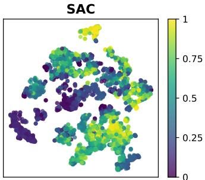

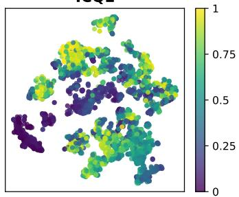

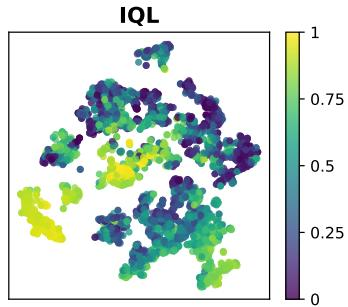  
Figure 3: Q-value distribution on states after t-SNE dimension reduction, of Walker2d-Medium dataset. The partitioned value patterns support our hypothesis that Q-functions are inherently compositional, motivating localized value modeling.

## 4.3 ABLATION STUDIES

In this section, we study how different design choices affect the performance of ICQL, including the number of in-context learning layers, the context length, retrieval strategy and in-context learning module architecture.

## 4.3.1 NUMBER OF IN-CONTEXT LEARNING LAYERS

In this experiment, we investigate the effect of in-context learning steps, which is controlled by the number of layers in the in-context critic network. The number of layers is selected from {4, 8, 16, 20}. The experiments are conducted on MuJoCo tasks. Figure 4 displays the experiment outcomes and detailed numerical results are provided in Appendix Table 8. From Figure 4, the normalized scores generally increase as the number of layers increase in most of the tasks, indicating that a larger number of layers may lead to more sufficient in-context value-learning. While the phenomenon is not obvious in Hopper tasks, one possible reason is the significant distribution shift in Hopper environment due to the high variance of transition dynamics.

## 4.3.2 INFLUENCE OF CONTEXT LENGTH

In this experiment, we investigate the effect of context lengths in ICQL. The context lengths are selected from {10, 20, 30, 40}. As shown in Figure 5, a context length of 20 yields the generally best performance for in-context TD-learning in Gym tasks, where too long or too short context lengths lead to sub-optimal results. These results provide evidence that the “locality” of context is crucial for in-context learning performance. As the context length increases, the distance between query state and context transitions also gets larger, which may break the “local” definition and bring noise into the in-context learning process. Detailed numerical results are shown in Table 8.

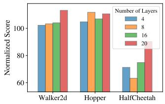  
(a) Medium-Expert

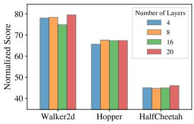  
(b) Medium

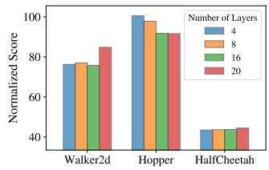  
(c) Medium-Replay

Figure 4: Normalized scores of different number of in-context learning layers on Mujoco tasks. Each color represents different number of layers, and the y-axis represents the normalized score.  
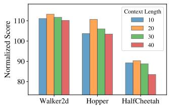  
(a) Medium-Expert

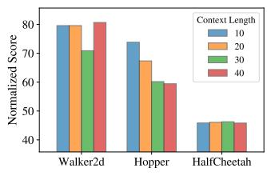  
(b) Medium

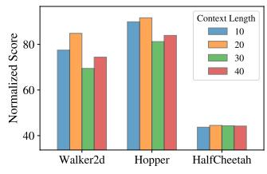  
(c) Medium-Replay  
Figure 5: Normalized scores of context lengths on Mujoco tasks. Each color represents different context lengths, and the y-axis represents the normalized score.

## 4.3.3 CONTEXT RETRIEVAL STRATEGIES

In this experiment, we investigate the impact of retrieval quality by applying different context retrieval strategies to ICQL. In addition to the standard State-Similar Retrieval, we compare two additional retrieval strategies: (1) Random Retrieval, which selects transitions uniformly at random from the offline dataset; and (2) State-Similar-with-High-Rewards Retrieval, which further filters similarstate candidates by selecting those with higher rewards. The definitions of these three retrieval methods are provided in Section 3.2 and Section C.

Table 2: Ablation study on retrieval strategies of ICQL. We compare three variants: Random Retrieval, State-Similar Retrieval, and State-Similar-with-High-Rewards Retrieval.

<table><tr><td>Dataset</td><td>Random</td><td>State-Similar</td><td>State-Similar-with-High-Rewards</td></tr><tr><td>Walker2d-Medium-v2</td><td>78.1</td><td>80.3</td><td>83.9</td></tr><tr><td>Walker2d-Medium-Replay-v2</td><td>67.5</td><td>81.9</td><td>75.1</td></tr><tr><td>Hopper-Medium-v2</td><td>74.1</td><td>62.6</td><td>59.9</td></tr><tr><td>Hopper-Medium-Replay-v2</td><td>81.0</td><td>96.4</td><td>90.8</td></tr><tr><td>HalfCheetah-Medium-v2</td><td>45.5</td><td>45.9</td><td>46.4</td></tr><tr><td>HalfCheetah-Medium-Replay-v2</td><td>43.4</td><td>44.7</td><td>43.2</td></tr><tr><td>Pen-Human-v1</td><td>75.1</td><td>85.6</td><td>84.8</td></tr><tr><td>Hammer-Human-v1</td><td>1.4</td><td>3.7</td><td>4.4</td></tr><tr><td>Door-Human-v1</td><td>12.0</td><td>17.1</td><td>15.6</td></tr><tr><td>Kitchen-Complete-v0</td><td>70.0</td><td>79.3</td><td>71.3</td></tr><tr><td>Kitchen-Mixed-v0</td><td>53.8</td><td>59.5</td><td>60.0</td></tr><tr><td>Kitchen-Partial-v0</td><td>47.5</td><td>61.5</td><td>50.0</td></tr></table>

Our results show that State-Similar Retrieval provides the strongest overall performance and is the best-performing strategy on most tasks, demonstrating the benefit of constructing context from locally similar states. Random Retrieval is generally less effective and often yields inferior performance, which highlights the importance of context relevance in local value estimation. Meanwhile, State-Similar-with-High-Rewards Retrieval outperforms the other strategies on several tasks, including walker2d-medium, halfcheetah-medium, hammer-human, and kitchen-mixed. This suggests that incorporating reward information into retrieval can be beneficial when high-value transitions are especially informative, while pure state similarity remains the most robust choice overall.

## 4.3.4 COMPARISON ACROSS DIFFERENT IN-CONTEXT MODELING CHOICES

We compare different architectural choices for the in-context module in ICQL, including a linear Transformer, a small linear MLP, and a standard self-attention-based Transformer. The results are shown in Table 3. Overall, the linear Transformer achieves the best performance on the large majority of tasks and shows especially clear advantages on replay-style and long-horizon datasets, such as Walker2d-Medium-Replay, Hopper-Medium-Replay, and the Kitchen benchmarks. The standard Transformer is generally less stable and performs substantially worse on several tasks, while the linear MLP is more competitive but still underperforms the linear Transformer in most cases. Although the linear MLP performs best on Hammer-Human and Hammer-Cloned, this advantage does not transfer consistently to other domains. These results suggest that the proposed linear in-context mechanism is not only theoretically convenient, but also empirically important for stable and effective local Q-function estimation across diverse offline RL environments.

Table 3: Performance comparison across different local modeling choices: linear attention-based Transformer, linear MLP, and standard self-attention-based Transformer.

<table><tr><td>Task</td><td>Linear Transformer</td><td>Linear MLP</td><td>Standard Transformer</td></tr><tr><td>Walker2d-Medium-Expert</td><td>113.3</td><td>109.5</td><td>108.8</td></tr><tr><td>Walker2d-Medium</td><td>80.3</td><td>76.7</td><td>77.4</td></tr><tr><td>Walker2d-Medium-Replay</td><td>81.9</td><td>60.2</td><td>42.9</td></tr><tr><td>Hopper-Medium-Expert</td><td>111.0</td><td>109.9</td><td>70.3</td></tr><tr><td>Hopper-Medium</td><td>62.6</td><td>55.7</td><td>61.9</td></tr><tr><td>Hopper-Medium-Replay</td><td>96.4</td><td>89.9</td><td>42.1</td></tr><tr><td>HalfCheetah-Medium-Expert</td><td>89.1</td><td>83.0</td><td>72.5</td></tr><tr><td>HalfCheetah-Medium</td><td>45.9</td><td>43.3</td><td>42.0</td></tr><tr><td>HalfCheetah-Medium-Replay</td><td>44.7</td><td>39.2</td><td>36.1</td></tr><tr><td>Pen-Human</td><td>85.6</td><td>66.6</td><td>72.7</td></tr><tr><td>Pen-Cloned</td><td>89.4</td><td>80.7</td><td>83.8</td></tr><tr><td>Hammer-Human</td><td>3.7</td><td>6.1</td><td>4.2</td></tr><tr><td>Hammer-Cloned</td><td>4.5</td><td>7.9</td><td>1.8</td></tr><tr><td>Door-Human</td><td>17.1</td><td>6.9</td><td>8.9</td></tr><tr><td>Door-Cloned</td><td>11.7</td><td>3.5</td><td>3.4</td></tr><tr><td>Kitchen-Complete</td><td>79.3</td><td>70.0</td><td>78.3</td></tr><tr><td>Kitchen-Mixed</td><td>59.5</td><td>57.5</td><td>55.8</td></tr><tr><td>Kitchen-Partial</td><td>61.5</td><td>48.3</td><td>55.8</td></tr></table>

## 5 CONCLUSION AND FUTURE WORK

We introduced ICQL, a novel offline RL framework that casts value estimation as an in-context inference problem using linear attention. By retrieving local transitions and fitting context-dependent local Q-functions, ICQL enables compositional reasoning without requiring subtask supervision. We provide theoretical guarantees showing that greedy action extraction based on ICQL yields a near-optimal policy. Experiments show that ICQL achieves strong performance gains and produces value estimates that are closer to those of online RL algorithms. These results highlight the potential of in-context learning as a powerful inductive bias for offline reinforcement learning. Although the methodology of ICQL is agnostic to the choice of distance metric, retrieval quality remains a practical concern in complex, high-dimensional state spaces. An important and promising direction for future work is to combine ICQL with more sophisticated retrieval methods, such as pre-trained state encoders or value-aware learnable retrievers.