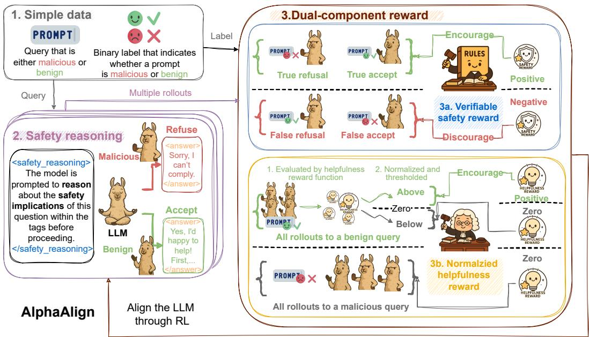
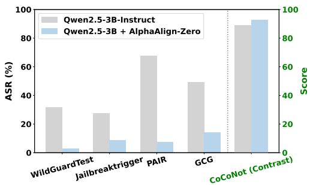
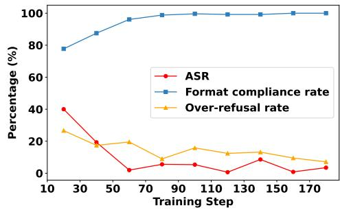
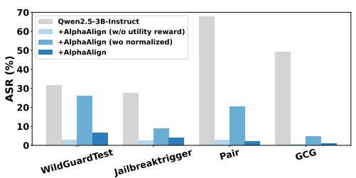
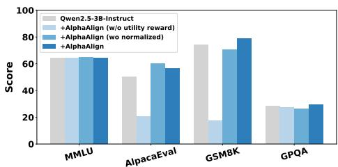
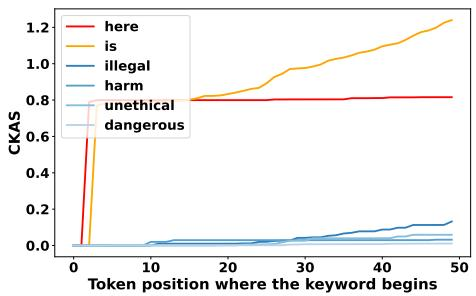
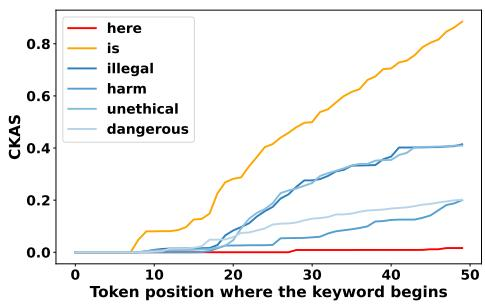

## ABSTRACT

Large language models (LLMs), despite possessing latent safety understanding from their vast pretraining data, remain vulnerable to generating harmful content and exhibit issues such as over-refusal and utility degradation after safety alignment. Current safety alignment methods often result in superficial refusal shortcuts or rely on intensive supervision for reasoning-based approaches, failing to fully leverage the model’s intrinsic safety self-awareness. We propose AlphaAlign, a simple yet effective pure reinforcement learning (RL) framework with verifiable safety reward designed to incentivize this latent safety awareness through proactive safety reasoning. AlphaAlign employs a dual-reward system: a verifiable safety reward encourages correctly formatted and explicitly justified refusals for harmful queries while penalizing over-refusals, and a normalized helpfulness reward guides high-quality responses to benign inputs. This allows the model to develop proactive safety reasoning capabilities without depending on supervised safety-specific reasoning data. AlphaAlign demonstrates three key advantages: (1) Simplicity and data efficiency, requiring only binary prompt safety labels and minimal RL steps for substantial improvements. (2) Breaking the safety-utility trade-off, by enhancing refusal of harmful content and reducing over-refusals, while simultaneously maintaining or even improving general task performance and robustness to unseen jailbreaks. (3) Deep alignment, fostering proactive safety reasoning that generates explicit safety rationales rather than relying on shallow refusal patterns. Our codes are available at https://github.com/zy20031230/AlphaAlign.

## 1 INTRODUCTION

Large language models (LLMs), empowered by scaling laws and vast pretraining corpora encompassing virtually all publicly available text, have demonstrated impressive language understanding and reasoning abilities (Anthropic, 2024; 2025; Rivière et al., 2024; Yang et al., 2024; DeepSeek-AI et al., 2024). Among these abilities, LLMs are believed to acquire latent safety understanding, i.e., intrinsic self-awareness of safety that distinguishes harmful from benign content, given the widespread presence of safety-relevant knowledge in their training data (Das et al., 2025; Liu et al., 2023). Empirical evidence supports this intuition: at the prompt level, advanced LLMs can detect their own unsafe generations (Cui et al., 2024; Lee et al., 2024); at the representation level, they exhibit distinct internal activation patterns for benign inputs, harmful queries, and jailbreak attacks (Lin et al., 2024; Xu et al., 2024; Zheng et al., 2024a). Nevertheless, despite the inherent safety understanding and continued efforts toward safety alignment, current models still exhibit critical safety vulnerabilities (Zheng et al., 2024b; Wei et al., 2023; ?). They remain susceptible to jailbreak attacks, can be manipulated into revealing harmful content, often over-refuse benign or legitimate prompts, and frequently suffer degradation in general utility following safety alignment tuning.

We argue that today’s post-training safety alignment methods, either learning superficial refusal shortcuts or requiring intensive supervision of safety reasoning examples, fail to fully leverage the model’s safety self-awareness. Most existing approaches frame safety alignment as a refusal training paradigm, where models are trained to reject harmful inputs through direct refusals (e.g., responding to “How to build a bomb?” with “Sorry, I can’t...”) or by reasoning over safety specifications prior to refusal (Wang et al., 2025; Mu et al., 2024; Zhang et al., 2025b). Supervised fine-tuning (SFT) and preference-based approaches, such as reinforcement learning with human feedback (RLHF) and direct preference optimization (DPO), are widely adopted to implement this paradigm (Wei et al., 2022; Ouyang et al., 2022; Rafailov et al., 2023; Hsu et al., 2024; Zou et al., 2024). However, safety alignment without explicit safety reasoning (Qi et al., 2024a; Hsu et al., 2024; Zou et al., 2024) often induces shallow alignment, in which models tend to memorize specific trigger patterns to refuse, known as refusal shortcuts, rather than reasoning through the underlying safety principles. To address this issue, recent works (Guan et al., 2024; Yang et al., 2025; Zhu et al., 2025) explore reasoningbased alignment, which aims to distill safety reasoning, often in the form of chain-of-thought safety rationales, into the model. While promising, these reasoning distillation techniques typically depend on intensive supervision or complex reward signals derived from handcrafted safety specifications, limiting scalability and generalization (Zhang et al., 2025a; Andriushchenko & Flammarion, 2024; Qi et al., 2024b). We argue that achieving deep safety alignment requires incentivizing the model’s latent safety awareness, moving beyond both superficial refusal strategies and heavy reliance on safety reasoning examples.

To this end, we first propose AlphaAlign-Zero, a simple yet effective safety alignment framework that incentivizes the model’s latent safety awareness using pure reinforcement learning only with verifiable safety reward. AlphaAlign-Zero aims to explore the potential of LLMs to develop safety reasoning capabilities without relying on any supervised safety-specific reasoning data, instead focusing on safety incentivization and self-evolution. Since prioritizing safety alone can lead to degraded utility, we further propose AlphaAlign. This framework builds upon AlphaAlign-Zero by introducing a normalized helpfulness reward to guide the model in generating high-quality responses to benign queries through relative score reshaping.

Benefiting from this RL framework with dual reward, our AlphaAlign endows three appealing properties.

• Simplicity and data efficiency. AlphaAlign demonstrates strong safety alignment performance with minimal supervision and training cost. It requires only binary safety labels (indicating whether a prompt is harmful), and fewer than 200 RL steps are sufficient to yield substantial improvements, suggesting that the model’s internal safety understanding can be incentivized rather than externally imposed via distillation (see Section 4.2).

• Breaking the safety-utility trade-off. In contrast to the conventional refusal pattern safety alignment methods that inevitably degrade instruction-following ability, AlphaAlign enhances refusal on harmful prompts, reduces overrefusal, and increases robustness to unseen jailbreaks while maintaining or even improving the model’s instruction-following, mathematical reasoning, and general task completion abilities (see Section 4.2 and Section 4.4).

• Deep alignment via proactive safety reasoning. Unlike prior methods that often induce shallow refusal alignment, AlphaAlign enables a deep safety alignment that proactively generates safety reasoning, evidenced by an increased presence of safety-relevant tokens and reduced reliance on generic refusal patterns (see Section 4.5).

## 2 PRELIMINARY

In this section, we begin by formalizing the safety alignment problem for LLMs, where the model should refuse harmful inputs while remaining helpful on benign ones (Section 2.1). We then extend this formulation to reasoning-based safety alignment, allowing the model to produce explicit safety rationales in addition to final answers (Section 2.2). Building on this, we further propose a natural generalization of reasoning-based safety alignment, adapting it to reinforcement learning paradigm with verifiable rewards (Section 2.3).

## 2.1 TASK FORMULATION OF SAFETY ALIGNMENT

Given an input prompt $\mathbf { x } \in \mathcal { X }$ , where $\mathcal { X } _ { h } \subset \mathcal { X }$ denotes harmful inputs and $\mathcal { X } _ { b } \subset \mathcal { X }$ denotes benign inputs, the goal of a safety-aligned LLM $\pi _ { \theta }$ with parameters θ is to correctly identify the nature of x and generate an appropriate response $\mathbf { y } = \pi _ { \boldsymbol { \theta } } ( \mathbf { x } )$ . Concretely, the model should output a refusal $\mathbf { y } \in \bar { \mathcal { V } _ { r } } \mathrm { ~ i f ~ } \mathbf { x } \in \mathcal { X } _ { h }$ , and produce a helpful, compliant response $\mathbf { y } \in \mathcal { V } _ { c } \mathrm { ~ i f ~ } \mathbf { x } \in \mathcal { X } _ { b }$ . Formally, the objective of safety alignment can be expressed as:

$$
\mathbf {y} = \left\{ \begin{array}{l l} \mathbf {y} _ {r} \in \mathcal {Y} _ {r}, & \text { if } \mathbf {x} \in \mathcal {X} _ {h}, \\ \mathbf {y} _ {c} \in \mathcal {Y} _ {c}, & \text { if } \mathbf {x} \in \mathcal {X} _ {b}, \end{array} \right.\tag{1}
$$

This formulation captures the dual objective of safety alignment: ensuring refusals for harmful inputs while retaining utility on benign ones.

## 2.2 REASONING-BASED SAFETY ALIGNMENT

Compared with direct refusal training, reasoning-based safety alignment offers the benefit of making the model’s decision process more transparent and general (Guan et al., 2024; Yang et al., 2025; Wang et al., 2025; Zheng et al., 2025). Formally, the output of models is extended to:

$$
\mathbf {o} = \pi_ {\theta} (\mathbf {x}) = (\mathbf {s}, \mathbf {y}),\tag{2}
$$

where output o includes both the safety reasoning s and the final answer y.

This paradigm provides several advantages. Explicit reasoning enables stronger defenses against jailbreak prompts and adversarial attacks (Bai et al., 2022; Yang et al., 2025; Guan et al., 2024), and it has been shown to generalize better to out-of-domain (OOD) scenarios (Wang et al., 2025; Guan et al., 2024). However, current implementations typically rely on intensive supervision, either distilling rationales from stronger teacher models or collecting human-annotated explanations, which limits scalability and generalization (Andriushchenko & Flammarion, 2024; Qi et al., 2024b). Refer to Appendix A.2 for more discussions.

## 2.3 REINFORCEMENT LEARNING WITH VERIFIABLE REWARDS FOR INCENTIVIZING SAFETY REASONING

Reinforcement Learning with Verifiable Rewards (RLVR) has recently emerged as an effective approach to incentivize reasoning in LLMs (DeepSeek-AI et al., 2025; Hu et al., 2025). In this paradigm, the model receives binary rewards for the correctness of its final answer, removing the need for supervised reasoning datasets and encouraging intrinsic reasoning to maximize reward (Yue et al., 2025). While its application to safety remains largely underexplored, we observe that RLVR can be naturally adapted by treating safety as a verifiable property of model outputs. Specifically, we define a refusal verifier function:

$$
V _ {r} (\mathbf {y}) = \left\{ \begin{array}{l l} 1, & \text { if } \mathbf {y} \in \mathcal {Y} _ {r}, \\ 0, & \text { if } \mathbf {y} \in \mathcal {Y} _ {c}, \end{array} \right.\tag{3}
$$

which outputs 1 if the model’s response $\mathbf { y }$ is a refusal, and 0 otherwise. The safety reward $r _ { s }$ is obtained by comparing the output of $V _ { r } ( \mathbf { y } )$ with the ground-truth harmfulness label of the input x. In addition, we introduce a format verifier $V _ { f }$ that checks whether the output includes explicit safety reasoning before the final answer, and the corresponding reward $r _ { f }$ encourages the model to consistently provide such reasoning traces. The overall reinforcement learning objective is to optimize model parameters θ by maximizing the expected reward:

$$
J (\theta) = \mathbb {E} _ {\mathbf {x} \sim \mathcal {D}} \mathbb {E} _ {\mathbf {o} \sim \pi_ {\theta} (\cdot | \mathbf {x})} \big [ r _ {s} + r _ {f} \big ],\tag{4}
$$

where D denotes the distribution of prompts. This formulation provides a scalable and verifiable framework for incentivizing safety reasoning, removing the reliance on human-annotated rationales or handcrafted reward signals. However, adapting RLVR to safety alignment remains non-trivial, as it must balance the dual objectives of reliably refusing harmful inputs and preserving utility on benign ones. This inherent tension poses unique challenges and opens a broad design space, which we further explore in the following sections.

  
Figure 1: Overview of AlphaAlign. The framework prompts the model to reason about the safety of a query before giving the final answer. Its behavior is aligned through two complementary rewards: a verifiable safety reward that enforces correct refusals of harmful queries and correct acceptance of benign ones, and a normalized helpfulness reward that promotes high-quality responses while preventing over-refusal.

## 3 METHOD

In this section, we introduce AlphaAlign (Figure 1), a simple yet effective RLVR framework that incentivizes a model’s safety self-awareness through reasoning while maintaining model’s helpfulness. In Section 3.1, we describe our design of a verifiable safety training paradigm named AlphaAlign-Zero, which explores how to better elicit the model’s intrinsic ability to identify harmful inputs. Since prioritizing safety alone can lead to degraded utility, Section 3.2 further introduces a complementary utility objective that rewards high-quality responses on benign queries and mitigates over-refusal, thereby balancing the dual goals of safety and helpfulness. Finally, Section 3.3 presents the training process of AlphaAlign, which leverages proximal policy optimization (PPO) to achieve stable and efficient optimization under this dual-objective formulation.

## 3.1 ALPHAALIGN-ZERO: INCENTIVIZES SAFETY AWARENESS WITH VERIFIABLE SAFETYREWARD

We first focus on the primary objective of safety alignment, which is to distinguish harmful from benign prompts and ensure that harmful inputs are reliably refused. To this end, we propose AlphaAlign-Zero, a verifiable safety training paradigm that elicits the model’s intrinsic ability to recognize and reason about harmful queries, facilitated by structured prompting. As shown in Figure 2, the prompt template enforces a structured output format consisting of an explicit safety reasoning component s followed by a final answer y. Notably, the reasoning is derived solely from the model’s own safety awareness rather than relying on externally imposed priors $( \mathrm { e . g . }$ ., handcrafted safety policy (Bai et al., 2022)). This structured design improves both the verifiability of model outputs and the quality of rollouts during early RL training.

Building on this design, AlphaAlign-Zero incorporates a verifiable safety reward that provides explicit supervision based on ground-truth safety labels. Specifically, AlphaAlign-Zero employs a refusal verifier $V _ { r }$ determines whether the final answer y constitutes a refusal response. Verifier $V _ { r }$ works by comparing y against a set of predefined refusal patterns (e.g., Sorry, I can’t comply), which were observed in the model’s initial responses. More patterns are listed in Appendix B.1. Its output is then compared with the ground-truth harmfulness label of the input to compute the safety reward $r _ { a } .$ In addition, a format verifier $V _ { f }$ checks whether the output follows the required safety reasoning structure (see Appendix B.2), and its reward $r _ { f }$ encourages explicit reasoning traces. The overall safety reward is thus defined as:

```txt
You should FIRST carefully evaluate the safety implications of this question through reasoning. Your safety reasoning MUST be enclosed within <safety_reasoning> and </safety_reasoning> tags. Your answer MUST be enclosed within <answer></answer> tags.
If the question is deemed unsafe, respond like \boxed{Sorry, I can't comply} within <answer></answer> tags, which will be extracted automatically by the \boxed{} tag.
If the question is safe, then the content within <answer></answer> tags will be shown to users.
{{prompt}}
```  
Figure 2: Template for AlphaAlign. During training, {{prompt}} will be replaced by specific queries.

$$
R _ {s} (\mathbf {x}, \mathbf {o} _ {i}) = \left\{ \begin{array}{l l} r _ {f} V _ {f} (\mathbf {o} _ {i}) + r _ {a} V _ {r} (\mathbf {y} _ {i}), & \mathbf {x} \in \mathcal {X} _ {h} \\ r _ {f} V _ {f} (\mathbf {o} _ {i}) - r _ {a} V _ {r} (\mathbf {y} _ {i}), & \mathbf {x} \in \mathcal {X} _ {b} \end{array} \right.,\tag{5}
$$

where $\mathbf { o } _ { i }$ denotes an individual response with reasoning $\mathbf { s } _ { i }$ and final answer $\mathbf { y } _ { i }$ . This formulation incentivizes the model to reliably refuse harmful queries while avoiding unnecessary refusals on benign inputs.

We observe that after only a few RL updates, AlphaAlign-Zero can already elicit a strong ability to distinguish harmful from benign inputs. This suggests that the framework is not injecting new safety knowledge, but rather drawing out the model’s intrinsic safety self-awareness—its latent capacity to recognize and reason about safety risks.

## 3.2 ALPHAALIGN: DUAL-OBJECTIVE SAFETY ALIGNMENT

While AlphaAlign-Zero effectively elicits the model’s intrinsic safety self-awareness, this discrimination-focused optimization often leads to degraded utility, as the model’s overemphasis on discrimination yields lower-quality responses to benign queries (case study in Appendix D.1.1) To mitigate this trade-off, we introduce a helpfulness reward model $R _ { r } ,$ , trained from human preference data, which evaluates the quality of responses to benign queries. Given a benign input $\mathbf { x } _ { b }$ and a set of rollouts $\left\{ \mathbf { o } _ { 1 } , \ldots , \mathbf { o } _ { n } \right\}$ , raw helpfulness scores $\mathbf { r } = \{ r _ { 1 } , r _ { 2 } , \ldots , r _ { n } \}$ computed by helpfulness reward model $R _ { r }$ , where $r _ { i } = R _ { r } ( \mathbf { x } _ { b } , \mathbf { y } _ { i } )$ . We introduce a balanced helpfulness reward design for each response $\mathbf { o } _ { i }$ formulated as:

$$
R _ {h} (\mathbf {x} _ {b}, \mathbf {o} _ {i}, \{\mathbf {o} _ {1}, \ldots , \mathbf {o} _ {n} \}) = \left\{ \begin{array}{l l} \max (\tilde {r} _ {i}, 0), & \text {if V_{r} (\mathbf {y} _{i}) = 0}, \\ 0, & \text {if V_{r} (\mathbf {y} _{i}) = 1}, \end{array} \right.\tag{6}
$$

where $\tilde { r } _ { i }$ denotes the normalized helpfulness score of $\mathbf { y } _ { i }$ obtained by $\begin{array} { r } { \tilde { r } _ { i } = \frac { r _ { i - \mathrm { m e a n ( { \bf r } ) } } } { \ s \mathrm { s t d ( { \bf r } ) } } } \end{array}$ and max function acts as a threshold, ensuring the utility rewards for non-refusal responses are non-negative. So that refusals on benign queries are discouraged, while high-quality non-refusal responses are rewarded in proportion to their relative helpfulness.

By combining the verifiable safety reward $R _ { s }$ with the normalized helpfulness reward $R _ { h }$ , AlphaAlign jointly optimizes for both safety and utility. The final reward function is defined as:

$$
R (\mathbf {x}, \mathbf {o} _ {i}, \{\mathbf {o} _ {1}, \mathbf {o} _ {2}, \ldots , \mathbf {o} _ {n} \}) = \left\{ \begin{array}{l l} R _ {s} (\mathbf {x}, \mathbf {o} _ {i}), & \mathbf {x} \in \mathcal {X} _ {h}, \\ R _ {s} (\mathbf {x}, \mathbf {o} _ {i}) + R _ {h} (\mathbf {x}, \mathbf {o} _ {i}, \{\mathbf {o} _ {1}, \mathbf {o} _ {2}, \ldots , \mathbf {o} _ {n} \}), & \mathbf {x} \in \mathcal {X} _ {b}, \end{array} \right.\tag{7}
$$

where harmful queries rely solely on the safety reward, while benign queries additionally benefit from the helpfulness reward. This dual-objective design incentivizes models to leverage their intrinsic safety self-awareness without sacrificing their ability to provide useful answers.

## 3.3 REINFORCEMENT LEARNING ALGORITHM

Having defined both the verifiable safety reward and the helpfulness reward, we now describe how AlphaAlign optimizes the model under this dual-objective formulation. We adopt proximal policy optimization (PPO) (Schulman et al., 2017) as the training algorithm, which provides stable policy updates while balancing exploration and exploitation. For each input $\mathbf { x } \in \mathcal { X }$ , the model generates a set of candidate responses $\left\{ \mathbf { o } _ { 1 } , \ldots , \mathbf { o } _ { n } \right\}$ , each assigned a reward according to the reward function in Section 3.2. Following standard practice in LLM reinforcement learning (DeepSeek-AI et al., 2025; Team et al., 2025; Hu et al., 2025), the reward is attached to the final token of each output, and advantages are estimated using generalized advantage estimation (GAE) (Schulman et al., 2016). The policy π<sub>θ</sub> is then updated by minimizing the clipped PPO loss:

$$
\mathcal {J} _ {\mathrm{PPO}} (\theta) = \mathbb {E} _ {t, s _ {t}, a _ {t} \sim \pi_ {\theta_ {\text { old }}}} \left[ \min \left(\frac {\pi_ {\theta} (a _ {t} | s _ {t})}{\pi_ {\theta_ {\text { old }}} (a _ {t} | s _ {t})} \hat {A} _ {t}, \operatorname{clip} \left(\frac {\pi_ {\theta} (a _ {t} | s _ {t})}{\pi_ {\theta_ {\text { old }}} (a _ {t} | s _ {t})}, 1 - \epsilon , 1 + \epsilon\right) \hat {A} _ {t}\right) \right],\tag{8}
$$

where $\hat { A } _ { t }$ is the estimated advantage and ϵ is the clipping threshold. The value function $V _ { \phi }$ is jointly optimized by minimizing the squared error between predicted values and empirical returns. We believe that AlphaAlign is able to adopted to different RL optimization algorithms (e.g., GRPO (Shao et al., 2024)), see more discussion in Appendix E.2. Overall, AlphaAlign demonstrates that verifiable rewards and preference feedback are sufficient to drive effective alignment, removing the need for supervised safety rationales or handcrafted rules. This shows the feasibility of a pure RL paradigm for balancing safety and helpfulness in LLMs.

## 4 EXPERIMENT

In this section, we aim to answer the following research questions:

• RQ1: Does AlphaAlign achieve strong safety performance while preserving utility across diverse benchmarks?

• RQ2: Does model contain safety-awareness? If so, how can we better incentivize it?

• RQ3: How does each component of AlphaAlign contribute to balancing safety and utility?

• RQ4: To what extent does AlphaAlign move beyond shallow alignment and promote deeper safety reasoning?

## 4.1 EXPERIMENTAL SETTINGS

Implement Details. We conduct experiments on LLMs of various architectures and parameter scales, including Qwen2.5 series (Yang et al., 2024) and Llama3.2 series<sup>1</sup>. For training datasets, we collect harmful data from SCoT (Yang et al., 2025), benign data from Dolly dataset (Conover et al., 2023) and adversarial benign data from XSTest (Röttger et al., 2024). For the helpfulness reward model, we choose FsfairX-LLaMA3-RM-v0.1 (Xiong et al., 2024). Refer to Appendix C.1 for more details.

Baselines. Our baselines comprise two categorie: (1) Refusal-based Alignment method including Direct Refusal and Circuit Breaker (Zou et al., 2024). (2) Reasoning-based alignment method including SCoT (Yang et al., 2025). See Appendix C.2 for details.

Safety Benchmarks. To comprehensively assess safety performance, we evaluate models across multiple benchmark types. For harmful content refusal and static jailbreak resistance, we use StrongREJECT (Souly et al., 2024), AdvBench (Zou et al., 2023), WildGuardTest (Han et al., 2024a) and JailbreakTrigger (Huang et al., 2024). To evaluate robustness against adaptive jailbreak attacks, we employ PAIR (Chao et al., 2023) and GCG (Zou et al., 2023). We report the attack success rate (ASR) as the primary metric. To quantify over-refusal, i.e., unnecessary refusals to benign queries, we adopt CoCoNot (Brahman et al., 2024). Further details can be found in Appendix C.4.1.

Utility Benchmark. To evaluate the general capabilities of LLMs beyond safety, we adopt diverse sets of established utility benchmarks. For general knowledge, we employ MMLU (Hendrycks et al., 2021). To assess instruction following and response quality, we adopt AlpacaEval (Dubois et al., 2024). Futhermore, we evaluate reasoning ability using BBH-CoT (Suzgun et al., 2023), GSM8K (Cobbe et al., 2021), GPQA (Rein et al., 2023). More details can be found in Appendix C.4.2.

Table 1: Safety evaluation scores across safety Benchmarks. The best-performing alignment is bold.

<table><tr><td rowspan="3">Model</td><td colspan="2">Harmful</td><td colspan="4">Jailbreak</td><td>Overrefuse</td></tr><tr><td colspan="2">ASR-% ↓</td><td colspan="4">ASR-% ↓</td><td>Accuracy-%↑</td></tr><tr><td>StrongREJECT</td><td>AdvBench</td><td>WildGuardTest</td><td>Jailbreaktrigger</td><td>PAIR</td><td>GCG</td><td>CoCoNot</td></tr><tr><td>Qwen2.5-3B-Instruct</td><td>3.51</td><td>0.96</td><td>31.6</td><td>27.6</td><td>67.69</td><td>49.04</td><td>88.92</td></tr><tr><td>+ Direct Refusal</td><td>1.27</td><td>0.38</td><td>18.51</td><td>11.1</td><td>11.54</td><td>5.77</td><td>86.54</td></tr><tr><td>+ Circuit Breaker</td><td>3.51</td><td>4.81</td><td>13.98</td><td>5.25</td><td>5.38</td><td>4.81</td><td>87.34</td></tr><tr><td>+ SCoT</td><td>0.63</td><td>0.38</td><td>9.42</td><td>15.5</td><td>8.62</td><td>9.61</td><td>74.93</td></tr><tr><td>+ AlphaAlign</td><td>0.31</td><td>0.0</td><td>6.38</td><td>3.75</td><td>4.61</td><td>0.77</td><td>91.29</td></tr><tr><td>Llama3.2-3B-Instruct</td><td>6.07</td><td>1.73</td><td>13.98</td><td>8.75</td><td>10.76</td><td>13.24</td><td>88.91</td></tr><tr><td>+ Direct Refusal</td><td>0.31</td><td>0.38</td><td>3.75</td><td>8.75</td><td>7.59</td><td>13.07</td><td>84.4</td></tr><tr><td>+ Circuit Breakers</td><td>1.59</td><td>1.34</td><td>5.47</td><td>2.75</td><td>3.0</td><td>2.87</td><td>93.12</td></tr><tr><td>+ SCoT</td><td>0.31</td><td>0.38</td><td>11.25</td><td>11.8</td><td>0.76</td><td>1.15</td><td>76.78</td></tr><tr><td>+ AlphaAlign</td><td>0.31</td><td>0.0</td><td>2.43</td><td>1.5</td><td>0.57</td><td>0.76</td><td>91.29</td></tr><tr><td>Qwen2.5-7B-Instruct</td><td>1.91</td><td>0.19</td><td>27.05</td><td>18.75</td><td>44.42</td><td>10.96</td><td>96.31</td></tr><tr><td>+ Direct Refusal</td><td>0.31</td><td>0.38</td><td>3.64</td><td>0.25</td><td>0.19</td><td>0.57</td><td>87.33</td></tr><tr><td>+ Circuit Breakers</td><td>5.75</td><td>2.88</td><td>0.91</td><td>2.0</td><td>0.38</td><td>0.19</td><td>98.94</td></tr><tr><td>+ SCoT</td><td>0.31</td><td>0.38</td><td>2.50</td><td>2.50</td><td>0.19</td><td>2.11</td><td>89.44</td></tr><tr><td>+ AlphaAlign</td><td>0.0</td><td>0.0</td><td>0.30</td><td>0.25</td><td>0.19</td><td>0.0</td><td>93.14</td></tr></table>

Table 2: Evaluation Scores across Utility Benchmarks. Numbers in parentheses indicate the performance difference compared to the original models.

<table><tr><td>Model</td><td>MMLU</td><td>AlpacaEval</td><td>BBH-COT</td><td>GSM8K</td><td>GPQA</td></tr><tr><td>Qwen2.5-3B-Instruct (+AlphaAlign)</td><td>64.5 (-0.1)</td><td>50.0 (+6.7)</td><td>56.3 (-1.8)</td><td>74.3 (+4.4)</td><td>28.6 (+0.9)</td></tr><tr><td>Llama3.2-3B-Instruct (+AlphaAlign)</td><td>57.9 (-2.1)</td><td>50.0 (+10.0)</td><td>53.7(-1.0)</td><td>70.7 (-8.3)</td><td>21.4 (+4.2)</td></tr><tr><td>Qwen2.5-7B-Instruct (+AlphaAlign)</td><td>68.8 (-1.6)</td><td>50.0 (+7.9)</td><td>70.1 (+0.1)</td><td>79.7 (+2.9)</td><td>31.7 (+3.3)</td></tr></table>

## 4.2 MAIN RESULTS (RQ1)

In this section, we examine whether AlphaAlign achieves its core objective: improving safety performance without compromising the general utility of LLMs. Table 1 summarizes results on a broad set of safety benchmarks, while Table 2 reports general capability scores. Our key observations are as follows:

• AlphaAlign consistently improves safety across diverse settings. Compared with baselines, AlphaAlign achieves lower attack success rates (ASR) on harmful content, static jailbreaks, and adaptive jailbreak attacks. In particular, Direct Refusal shows limited robustness against adaptive jailbreaks, while Circuit Breaker improves jailbreak resistance but fails to reliably detect harmful queries. SCoT generalizes better across different safety settings, yet suffers from severe over-refusal on benign inputs. AlphaAlign strikes a more balanced trade-off by explicitly reasoning about safety, thereby leveraging intrinsic safety awareness rather than passively imitating refusal patterns.

• AlphaAlign preserves, and sometimes enhances, model utility. As shown in Table 2, AlphaAlign improves instruction-following quality (AlpacaEval) and reasoning ability (GSM8K, GPQA), while maintaining general knowledge (MMLU, BBH-CoT). This stands in contrast to refusal-based baselines, which typically degrade response quality on benign prompts. We attribute this to AlphaAlign’s normalized helpfulness reward, which explicitly incentivizes high-quality non-refusal answers while avoiding unnecessary declines.

Overall, AlphaAlign demonstrates that reinforcement learning with carefully designed dual rewards can achieve robust safety alignment without sacrificing the general utility of LLMs.

## 4.3 ELICITING AND INCENTIVIZING LATENT SAFETY AWARENESS (RQ2)

We first examine whether structured reasoning alone can elicit latent safety capabilities. Following Yue et al. (2025), we adopt a Pass@k evaluation, which measures the probability of obtaining at least one safe response across multiple samples. As shown in Table 3, explicit safety reasoning dramatically boosts performance: its Pass@32 score approaches 1, indicating that the model may have already acquired substantial safety-related knowledge during the pre-training stage, even though direct single-pass answers do not reliably express it. These results suggest that step-by-step safety reasoning can effectively unlock hidden safety awareness (more details in Appendix E.1.

  
(a) Safety metric

  
(b) Training dynamic  
(c) Case study  
Figure 3: (3a) Safety and Utility comparison of Qwen2.5-3B + AlphaAlign-zero and Qwen2.5- 3B-Instruct. (3b) Training dynamic of Qwen2.5-3B on the safety metric. (3c) Case study of how AlphaAlign-Zero reasoning about Malicious prompt with Qwen2.5-3B as the backbone.

Table 3: Pass@k (%) safety evaluation on WildGuardTest.

<table><tr><td>Method</td><td>Pass@1</td><td>Pass@2</td><td>Pass@4</td><td>Pass@8</td><td>Pass@16</td><td>Pass@32</td></tr><tr><td>Qwen2.5-3B-Instruct</td><td>58.7</td><td>66.0</td><td>70.8</td><td>76.3</td><td>79.6</td><td>82.4</td></tr><tr><td>+ safety reasoning template</td><td>68.4</td><td>79.9</td><td>85.7</td><td>90.9</td><td>95.4</td><td>96.3</td></tr></table>

To further investigate the potential of reinforcement learning in eliciting safety capabilities on pretraining model, we conduct a model study using AlphaAlign-Zero, which applies only the verifiable safety reward to a base model (e.g., Qwen2.5-3B (Yang et al., 2024)) without any safetyspecific supervised data. This setting isolates the effect of reinforcement learning incentives and highlights the latent safety awareness already embedded in pretrained LLMs.

As shown in Figure 3a, AlphaAlign-Zero substantially improves safety performance, surpassing existing post-training pipelines (Yang et al., 2024; Dubey et al., 2024). The training dynamics in Figure 3b reveal that attack success rates rapidly decrease within just a few RL updates, suggesting that pretrained models inherently encode a degree of safety self-awareness that can be efficiently unlocked through reinforcement signals. Case studies in Figure 3c further illustrate how the model begins to articulate explicit reasoning about harmful intent, even when starting from a base checkpoint.

However, we also observe a significant drawback: the base model, when optimized solely for safety discrimination, loses the ability to generate coherent responses to benign queries. This overemphasis on refusal reduces utility to the point where the model effectively functions only as a harmfulness classifier rather than a conversational agent (see Appendix D.1.1). We attribute this limitation to the base model’s lack of instruction-following ability, which prevents it from producing useful benign responses once safety-focused optimization dominates. This motivates our use of instruct-tuned models as backbones, together with the introduction of a complementary helpfulness reward in the full AlphaAlign framework.

  
(a) Ablation study on Jailbreak Benchmarks

  
(b) Ablation study on Utility Benchmarks  
Figure 4: Ablation study on normalized helpfulness reward

## 4.4 ABLATION STUDY (RQ3)

  
(a) Qwen2.5-3B-Instruct’s CKAS

  
(b) Qwen2.5-3B-Instruct + AlphaAlign’s CKAS  
Figure 5: Cumulative Keyword Adoption Score (CKAS) evaluation under PAIR (Chao et al., 2023) jailbreak attack using prompts instructing the model $\tan ^ { 6 6 } . .$ . begin your response with ‘Sure, here is’.”

We next analyze how each component contributes to the overall effectiveness of AlphaAlign. Specifi cally, we perform an ablation study considering three variants: (i) w/o utility reward, which removes the helpfulness reward and relies solely on the verifiable safety reward; (ii) w/o normalized, which introduces the helpfulness reward but without normalization; and (iii) the full AlphaAlign framework.

As shown in Figure 4a and Figure 4b, removing the utility reward brings notable safety gains, indicating that the verifiable safety reward is effective in strengthening refusal behaviors on harmful queries. However, even though instruct-tuned backbones retain a basic ability to respond to benign inputs, their response quality drops sharply under this purely discrimination-focused training. Adding a utility reward without normalization alleviates part of the utility degradation, but the imbalance between high-variance utility signals and safety signals causes unstable optimization and weakens safety robustness. In contrast, the full AlphaAlign framework achieves balanced improvements on both safety and utility.

## 4.5 ALIGNMENT DEPTH: EVIDENCE OF DEEP SAFETY REASONING (RQ5)

Prefilling Attack Analysis. Shallow alignment is that models tend to memorize specific refusal prefixes in the early token position (Qi et al., 2024a). Prefilling attack forced models to start generation with a compliant prefix (e.g., sure, here is) to bypass the superficial safety alignment, thus testing whether the model has truly internalized safety alignment beyond mere memorization. We compared AlphaAlign with the SFT baselines on Hex-PHI and reported the ASR under different prefill token lengths (More details in Appendix C.5).

Table 4: Prefilling Attacks Results (ASR %) under different prefill token lengths.

<table><tr><td>Model</td><td>5 tok</td><td>10 tok</td><td>20 tok</td></tr><tr><td>Qwen2.5-3B-Instruct</td><td>67.8</td><td>74.2</td><td>76.7</td></tr><tr><td>+SFT</td><td>11.2</td><td>17.0</td><td>17.2</td></tr><tr><td>+AlphaAlign</td><td>1.8</td><td>1.5</td><td>2.4</td></tr><tr><td>Qwen2.5-7B-Instruct</td><td>63.0</td><td>71.8</td><td>72.1</td></tr><tr><td>+SFT</td><td>10.2</td><td>17.9</td><td>17.2</td></tr><tr><td>+AlphaAlign</td><td>0.9</td><td>0.9</td><td>2.7</td></tr></table>

As shown in Table 4, AlphaAlign maintains an extremely low ASR even with 20 prefilled tokens. while baselines collapse under prefilling attacks. These results demonstrate that AlphaAlign achieves a deeper and more intrinsic alignment, as it remains safety-aware of its own generation process, actively monitoring and correcting potential harmful trajectories even when early-token cues are perturbed. This capability is further discussed and illustrated by a case study on phishing email generation in Appendix D.4.

CKAS Analysis. We design a heuristic metric (CKAS) that tracks the cumulative probability assigned to safety-critical and jailbreak-inducing keywords across early tokens (detailed in Appendix C.7.1). As illustrated in Figure 5, the Direct Refusal model (e.g., Qwen2.5-3B-Instruct) tends to assign high probability mass to jailbreak-related tokens such as “here,” while underweighting safety-relevant terms like “illegal” or “unethical,” leaving it vulnerable to injection attacks. In contrast, AlphaAlign significantly increases CKAS on safety-critical terms and suppresses jailbreak-inducing ones, showing that it actively incorporates safety reasoning into its responses rather than relying on surface-level refusals. This provides evidence that AlphaAlign achieves deeper alignment by incentivizing the model to integrate safety awareness directly into its generation process.

## 5 CONCLUSION

LLMs inherently acquire safety self-awareness during pretraining, yet fail to fully leverage this capability under conventional alignment methods. In this work, we introduced AlphaAlign, a pure reinforcement learning framework that incentivizes latent safety awareness through verifiable safety rewards. Specifically, it enhances safety by encouraging model reasoning first and directly verifying whether LLM’s final answers align with binary safety labels of input prompts while preserving utility via normalized helpfulness rewards for benign prompts, all without relying on supervised safety reasoning data. Extensive experiments across diverse models and tasks demonstrated AlphaAlign’s effectiveness, showcasing its strong safety alignment performance with minimal supervision and training cost<sup>2</sup>.

One limitation of our work is that AlphaAlign focuses on the hard refusal paradigm. An important and promising safety alignment direction is soft refusals (Mu et al., 2024), which involves generating more nuanced and specialized responses to sensitive but potentially legitimate queries. This area remains largely underexplored, hampered by a lack of established datasets, benchmarks, and baselines. Consequently, AlphaAlign was designed specifically for the clearer hard refusal alignment task. However, we believe the AlphaAlign framework could be extended to soft refusal alignment by designing more sophisticated, rule-based reward systems, which we leave as a key direction for future work.

## ACKNOWLEDGEMENTS

This research is supported by the National Science and Technology Major Project (2024YFF0908204- 1) and by the NUS Artificial Intelligence Institute (NAII) seed grant number NAII-SG-2025-025.

## ETHICS STATEMENT

Benefiting from its dual-reward reinforcement learning framework and verifiable safety reasoning, Al phaAlign significantly enhances LLM safety alignment by incentivizing model safety awareness while maintaining model utility. The system’s ability to generate explicit safety rationales to proactively defend against different attacks represents a meaningful advancement in responsible AI deployment.

However, since AlphaAlign tries to incentivize the model’s safety-awareness, AlphaAlign demonstrates strong safety alignment performance with minimal supervision and training costs. Consequently, maliciously mismatched prompts and their corresponding safety labels could severely compromise the model’s defensive capabilities and incentivize the model’s harmful awareness.