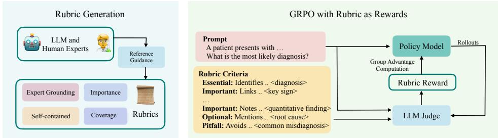
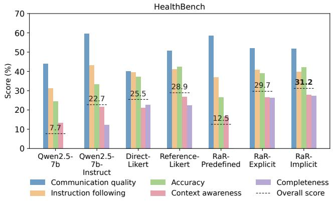
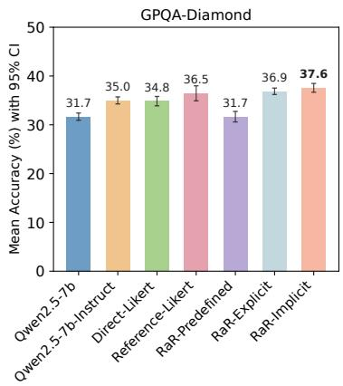
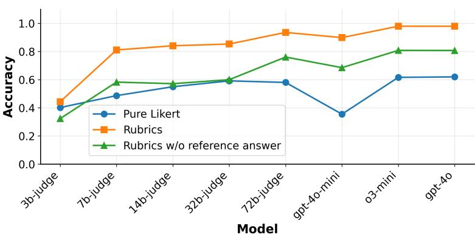

## ABSTRACT

Reinforcement Learning with Verifiable Rewards (RLVR) has proven effective for complex reasoning tasks with clear correctness signals such as math and coding. However, extending it to real-world reasoning tasks is challenging, as evaluation depends on nuanced, multi-criteria judgments rather than binary correctness. Instance-specific rubrics have recently been used in evaluation benchmarks to capture such judgments, but their potential as reward signals for on-policy posttraining remains underexplored. We introduce Rubrics as Rewards (RaR), an on-policy reinforcement learning method that extends RLVR beyond verifiable domains by using rubric-based feedback. Across both medical and science domains, we evaluate multiple strategies for aggregating rubric feedback into rewards. The best RaR variant achieves relative improvements of up to 31% on HealthBench and 7% on GPQA-Diamond over popular LLM-as-judge baselines that rely on direct Likert-based rewards. These results demonstrate that RaR-trained policies adapt well to diverse evaluation formats, performing strongly on both rubric-based and multiple-choice tasks. Moreover, we find that using rubrics as structured reward signals yields better alignment for smaller judges and reduces performance variance across judge scales.

## 1 INTRODUCTION

Reinforcement Learning with Verifiable Rewards (RLVR) has enabled large language models to elicit complex reasoning on tasks with clear verifiable outcomes. This is especially effective in domains like math and code, where reward models can be replaced by scoring functions or test cases that automatically verify correctness (Lambert et al., 2024; Guo et al., 2025a; Cui et al., 2025). However, extending RLVR to unstructured, real-world reasoning is challenging because such tasks lack easily verifiable answers. A common workaround is to use preference-based reward models, but they tend to overfit superficial artifacts (e.g. response length, formatting quirks, annotator biases) (Singhal et al., 2023; Wang et al., 2024a; Chen et al., 2024b; Ye et al., 2024; Gudibande et al., 2023) and require large volumes of pairwise comparisons (Ouyang et al., 2022). Instance-specific rubrics have recently emerged for nuanced evaluation in expert domains (Arora et al., 2025), yet their application in on-policy training for expert-level reasoning is largely unexplored.

To address this gap, we explore a paradigm shift that introduces a middle ground between the simplicity of verifiable rewards and the expressiveness of preference rankings, which often come with human artifacts and operational overhead. We introduce Rubrics as Rewards (RaR), a framework for on-policy Reinforcement Learning that uses structured criteria or rubrics as the core reward mechanism. Rather than using rubrics only for evaluation (Arora et al., 2025; Sirdeshmukh et al., 2025), we treat them as checklist-style supervision that produces reward signals for on-policy RL. Each rubric is composed of modular, interpretable subgoals that provide automatable feedback aligned with expert intent. By decomposing “what makes a good response” into tangible, humaninterpretable criteria, rubrics offer a middle ground between binary correctness signals and coarse preference rankings.

  
Figure 1: Overview of Rubrics as Rewards (RaR). (i) Rubric Generation: We synthesize promptspecific, self-contained rubric criteria using a strong LLM guided by four core design principles, with reference answers serving as proxies for expert supervision. (ii) GRPO Training: These rubrics are used to prompt an LLM judge for reward estimation, which drives policy optimization via the GRPO on-policy learning loop.

Previous works train generative reward models that learn to evaluate reasoning or final outputs with interpretable scores (Chen et al., 2025; Whitehouse et al., 2025; Anugraha et al., 2025; Guo et al., 2025b), and some have even used a model’s internal confidence estimates as a proxy for reward (Zhao et al., 2025). More recent efforts have extended verifiable datasets beyond STEM domains, broadening the applicability of RLVR methods to a wider range of tasks (Su et al., 2025b; Ma et al., 2025). Yet a general-purpose approach for specifying reliable reward signals remains elusive, particularly in tasks without a single ground truth where both subjective and objective criteria must be considered. In contrast, we treat rubrics as instance-specific, reusable reward functions. Once generated, rubrics provide interpretable and automatable supervision that can be applied consistently across new rollouts, offering a scalable and transparent alternative to opaque reward modeling in onpolicy learning.

Recent concurrent works explore checklists and principled rubric criteria for preference tuning and LLM safety (Gallego, 2025; Viswanathan et al., 2025; Dineen et al., 2025), highlighting a growing trend toward structured supervision. In contrast, we convert rubrics into reward functions for onpolicy RL, targeting expert reasoning and applied real-world domains. This closes the rubric-tolearning loop and improves performance on both rubric-guided evaluations and tasks with verifiable answers. Figure 1 illustrates our framework.

Our key contributions are as follows: (i) We introduce Rubrics as Rewards (RaR), an on-policy reinforcement learning framework that uses checklist-style rubrics for multi-criteria supervision in reasoning and real-world domains. (ii) We synthesize instance-specific rubrics for medicine and science and release the corresponding training sets, RaR-Medicine and RaR-Science. 1 (iii) RaRtrained models consistently outperform strong baselines and yield a stable, generalizable training signal, with gains on both rubric-scored and verifiable multiple-choice evaluation settings. (iv) Our results demonstrate that rubric-based rewards provide stable supervision across judge sizes, helping smaller models align effectively with human preferences and maintaining robust evaluation performance from small to large judges.

## 2 RUBRICS AS REWARDS

## 2.1 PROBLEM FORMULATION

Let x denote an input prompt and ${ \hat { y } } \sim \pi _ { \theta } ( \cdot \mid x )$ be a sampled response from a model parameterized by θ. In domains without single ground-truth answers or automatic correctness signals, we define a structured reward function using instance-specific rubric criteria.

Each prompt x is associated with a set of k rubric items $\{ ( w _ { j } , c _ { j } ) \} _ { j = 1 } ^ { k }$ , where $w _ { j } \in \mathbb { R }$ denotes the weight of criterion $j ,$ and $c _ { j } : ( x , { \hat { y } } ) \mapsto \{ 0 , 1 \}$ is a binary correctness function that indicates whether the response $\hat { y }$ satisfies that criterion given the prompt.

## 2.2 REWARD AGGREGATION STRATEGIES

We investigate two complementary approaches for combining rubric feedback into scalar rewards:

Explicit Aggregation. Each criterion is independently evaluated using an LLM-as-judge, and the final normalized reward is computed as:

$$
r (x, \hat {y}) = \frac {\sum_ {j = 1} ^ {k} w _ {j} \cdot c _ {j} (x , \hat {y})}{\sum_ {j = 1} ^ {k} w _ {j}}\tag{1}
$$

Normalization makes rewards comparable across prompts that differ in rubric count or weights. Although we use binary checks for $c _ { j }$ in our experiments, the formulation can be extended to continuous-valued scores.

Implicit Aggregation. All rubric criteria along with categorical weights are passed to an LLMas-judge, delegating the aggregation to the model itself to produce a single scalar reward:

$$
r _ {\text { implicit }} (x, \hat {y}) = f _ {\phi} (x, \hat {y}, \{d _ {j} \} _ {j = 1} ^ {k})\tag{2}
$$

Here, $f _ { \phi }$ denotes an LLM-based judge that takes the prompt x, the response $\hat { y } ,$ and the set of rubric criteria $\{ d _ { j } \}$ as input. This formulation allows the model to compute a holistic reward score directly, avoiding the need to manually tune rubric weights.

The prompts used for each method are detailed in Appendix A.7.

## 2.3 GENERALIZATION OF RLVR WITH RUBRICS AS REWARDS

Rubric-based reinforcement learning extends the standard RLVR (Reinforcement Learning with Verifiable Rewards) setting by supporting multi-dimensional, prompt-specific evaluation criteria. We formalize this relationship below.

Remark 1 (Rubrics as Rewards subsumes RLVR). The RLVR setting is a special case of rubricbased rewards defined in Equation 1, where $k = 1 , w _ { 1 } = 1$ , and $c _ { 1 } ( x , \hat { y } )$ reduces to a single verifiable correctness function that compares the model output yˆ against the known correct answer y. For example, this could involve exact match or test case execution. Formally:

$$
r _ {\mathrm{RLVR}} (x, \hat {y}) = \mathrm{match} (y, \hat {y})\tag{3}
$$

where match $( y , \hat { y } ) \in \{ 0 , 1 \}$ indicates whether the response satisfies the verifiable correctness condition.

Rubric-based reward functions thus generalize RLVR by enabling multi-dimensional supervision, flexible weighting across criteria, and the incorporation of both objective and subjective aspects of response quality. This formalization highlights that RLVR can be seen as a restricted instance of rubric-guided RL with a single essential criterion. In contrast, rubric-based rewards further enable structured supervision in settings where correctness is multifaceted and may not be strictly verifiable.

## 3 RUBRIC GENERATION

## 3.1 DESIDERATA

A rubric specifies criteria for high-quality responses and provides human-interpretable supervision. We identify four desiderata for effective rubric generation:

Grounded in Expert Guidance. Rubrics should reflect domain expertise by capturing the essential facts, reasoning steps, and conclusions necessary for correctness. Ideally, this grounding comes from human experts or their high-quality proxies.

Comprehensive Coverage. Rubrics should span multiple dimensions of response quality, including factual accuracy, logical coherence, completeness, style, and safety. Negative criteria (pitfalls) help identify frequent or high-risk errors that undermine overall quality.

Criterion Importance. Rubrics should reflect that some dimensions of response quality are more critical than others. For example, factual correctness must outweigh secondary aspects such as stylistic clarity. Assigning weights to criteria ensures this prioritization, whether through simple categorical tags, explicit numeric values, or learned weighting schemes.

Self-Contained Evaluation. Each rubric item should be independently actionable, allowing either human annotators or automated judges to assess it in isolation without requiring external context or domain-specific knowledge.

## 3.2 RUBRICS CREATION

We apply these desiderata to datasets for reasoning tasks in medicine and science. Given the scarcity of human-annotated rubric datasets in these domains, we use LLMs to generate instance-specific rubrics from golden reference answers at scale, enabling the study of structured rewards without costly human annotation.

For each prompt, an LLM generates a rubric of 7–20 self-contained items. Each item is assigned both a numeric and a categorical weight reflecting its relative importance. While numeric weights provide fine-grained prioritization, in our experiments we adopt categorical labels (Essential, Important, Optional, Pitfall) for ease of implementation and interpretability in controlled settings. The resulting rubrics are then used directly as reward functions through either explicit aggregation (Eq. 1) or implicit aggregation (Sec. 2.2).

In practice, we generate rubrics using OpenAI’s o3-mini and GPT-4o (OpenAI o3-mini, 2025; Jaech et al., 2024; Hurst et al., 2024), conditioning generation on reference answers from the underlying datasets to approximate expert grounding. The resulting collections—RaR-Medicine and RaR-Science—are released publicly. These rubric sets supervise policy models with GRPO using both explicit and implicit reward aggregation.

## 4 EXPERIMENTS

## 4.1 DATASETS

We investigate the utility of rubrics as rewards across two reasoning domains, medicine and science.

• RaR-Medicine: A dataset of 20k prompts drawn from diverse medical reasoning sources, including medical-o1-reasoning-SFT (Chen et al., 2024a), natural reasoning (Yuan et al., 2025), SCP-116K (Lu et al., 2025), and GeneralThought-430K (General Reasoning, 2025). Instancespecific rubrics for this dataset are generated with GPT-4o (see Appendix A.2).

• RaR-Science: A dataset of ∼20k prompts curated to align with GPQA-Diamond categories. Prompts are sourced from natural reasoning (Yuan et al., 2025), SCP-116K (Lu et al., 2025), and GeneralThought-430K (General Reasoning, 2025), covering a broad range of scientific reasoning tasks (Appendix A.3). Rubrics for this dataset are synthesized with o3-mini.

## 4.2 TRAINING DETAILS

We conduct all experiments using on-policy reinforcement learning with the GRPO algorithm (Shao et al., 2024), taking Qwen2.5-7B as the base policy. Models are trained with a batch size of 96, a learning rate of $5 \times 1 0 ^ { - 6 }$ , and a constant schedule with 10% linear warmup. Complete hyperparameter settings are listed in Appendix A.4. Training runs are executed on a single compute node equipped with 8 NVIDIA H100 GPUs.

Our training pipeline consists of the following key components:

Response Generation: For each prompt q, we sample k = 16 responses from the current policy πθ, using a context length of 3584 and a sampling temperature of 1.0.

Reward Computation with Rubrics: We use gpt-4o-mini as the judge model to assign rewards $R _ { q }$ to the sampled responses. We experiment with various reward computation and aggregations strategies further described in Sections 4.3 and 4.4.

Policy Update: The policy weights are updated using GRPO based on the computed rewards.

<table><tr><td>Category</td><td>Method/Baseline</td><td>Trained</td><td>Aggregation Type</td><td>Reward Grounding</td></tr><tr><td>Rubric-Free</td><td>OFF-THE-SHELF</td><td>×</td><td>N/A</td><td>N/A</td></tr><tr><td>Rubric-Free</td><td>DIRECT-LIKERT</td><td>√</td><td>Single Likert score</td><td>N/A</td></tr><tr><td>Rubric-Free</td><td>REFERENCE-LIKERT</td><td>√</td><td>Single Likert score</td><td>Reference answer</td></tr><tr><td>Rubric-Based</td><td>RaR-PREDEFINED</td><td>√</td><td>Explicit aggregation</td><td>Instance-agnostic rubrics</td></tr><tr><td>Rubric-Based</td><td>RaR-EXPLICIT</td><td>√</td><td>Explicit aggregation</td><td>Instance-specific rubrics</td></tr><tr><td>Rubric-Based</td><td>RaR-IMPLICIT</td><td>√</td><td>Implicit aggregation</td><td>Instance-specific rubrics</td></tr></table>

Table 1: Overview of rubric-free and rubric-based methods and baselines.

## 4.3 RUBRIC-FREE BASELINES

We consider various rubric-free baselines and off-the-shelf post-trained models. Rubric-free baselines are trained with Qwen2.5-7B as the base policy.

OFF-THE-SHELF: For off-the-shelf baselines we evaluate performance on Qwen2.5-7B. We also include the performance of Qwen2.5-7B-Instruct to compare with instruction-tuned variant of the base policy.

DIRECT-LIKERT: An LLM-as-judge provides a direct assessment for each response–prompt pair on a 1–10 Likert scale (Zheng et al., 2023; Kim et al., 2024), normalized to [0, 1]. The resulting score is used directly as the reward signal for training.

REFERENCE-LIKERT: An LLM-as-judge compares the generated response against a reference answer (written by experts or stronger LLMs) and assigns a 1–10 Likert score (Zheng et al., 2023), normalized to [0, 1]. This reference-guided score is used as the reward signal for policy updates. The reward for each (prompt, response, reference) triplet is defined as:

$$
R _ {\text { ref }} (q, x) = \text { Norm } (\text { LikertScore } (q, x, x ^ {*}))
$$

where $x ^ { * }$ denotes the reference answer.

## 4.4 RUBRIC-GUIDED METHODS

RaR-PREDEFINED: This method uses a fixed set of generic rubrics for all prompts (e.g. response is concise, response contains correct information). It employs the Explicit Aggregation method (Equation 1) with all criteria weighted uniformly (see Appendix A.6).

RaR-EXPLICIT: This variant also uses Explicit Aggregation using a weighted sum (Equation 1) but applies it to instance-specific rubrics from Section 3. We manually assign numerical weights based on the generated categorical labels: {"Essential": 1.0, "Important": 0.7, "Optional": 0.3, "Pitfall": 0.9}2.

RaR-IMPLICIT: This variant uses the Implicit Aggregation method (Equation 2). It leverages promptspecific rubrics, where a judge model evaluates the response as a whole to assign a single Likert rating (1–10), avoiding the need for hand-tuned weights. The reward is normalized to the [0, 1] range during training.

An overview of all baselines and methods is summarized in Table 1.

## 4.5 EVALUATION SETUP

Rubric-Based Evaluation We evaluate models trained with RaR-Medicine on Health-Bench (Arora et al., 2025), a benchmark of 5,000 clinical conversations designed to assess model safety and helpfulness in realistic medical scenarios. Performance is measured using detailed, physician-authored rubrics. We generate responses with greedy decoding (temperature = 0) and report both overall scores and per-axis scores following the original setup. For ablation studies, we sample a subset of 1,000 prompts (hereafter referred as HealthBench-1k) and use the rest for training.

  
Figure 2: Performance of baselines and RaR (Rubrics as Rewards) variants for the medicine and science domains. HealthBench (left): shows per-axis scores across five core axes, with a thin dashed gray line indicating the overall score (all values shown as percentages). GPQA-Diamond (right): mean accuracy over 10 runs; error bars represent 95% confidence intervals. All policies are evaluated using gpt-4o-mini as the LLM-as-Judge. Across both domains, RaR-Implicit consistently outperforms Direct-Likert and demonstrates a competitive advantage over Reference-Likert.

Multiple-Choice Evaluation Each model is evaluated across 10 independent runs, using greedy decoding (temperature=0) to sample one response per prompt. Answer choices are permuted per example to reduce positional bias, and outputs are parsed for boxed answer formats (e.g., boxed{A}). If extraction fails, we fall back to a GPT-4o verifier that checks whether the response contains the correct option letter or text (see Appendix A.5). Final accuracy is reported as the mean over 10 runs, and we include 95% confidence intervals to account for run-to-run variance.

LLM-Judge Alignment Evaluation To measure how well LLM judges align with human preferences, we build a paired evaluation set from roughly 3,000 HealthBench prompts. For each prompt, we take the practitioner-approved answer as the preferred response and create a perturbed alternative via controlled edits (see Appendix A.10 for method used for perturbation and prompt selection). The metric is pairwise preference accuracy i.e. the fraction of pairs where the preferred response scores higher reported across judge models of varying sizes.

## 5 RESULTS

We now present the main findings of our study.

Rubrics as Rewards shows strong gains across evaluation settings. Table 2 reports results on HealthBench (rubric-based, free-form) and GPQA-Diamond (multiple-choice). RaR-Implicit consistently outperforms Direct-Likert, with relative gains up to 31% on HealthBench and 7% on GPQA. Both rubric-guided variants achieve higher scores than the base and instruction-tuned policies. Gains on GPQA-Diamond show that rubric-induced skills generalize beyond rubric-based evaluation. The RaR-Predefined variant, which applies a fixed list of generic rubrics to every prompt (no instance-specific synthesis), underperforms because generic criteria miss prompt-specific requirements and common failure modes, producing misaligned reward signals. Hence, effective training requires instance-specific rubric synthesis as they better capture task context and typical failure modes.

LLM Judge Alignment Across Model Scales  
  
Figure 3: Alignment Study of LLM Judges across Model Scales. Rubrics as Rewards (orange) consistently improves alignment with human preferences across LLM judge sizes compared to direct Likert-based scoring (blue). Judge Alignment using synthetic rubrics without expert grounding (green) outperform the direct Likert baseline, but still fall short of expert-grounded rubrics (orange). The rubric structure especially benefits smaller judge models, helping them close the gap with larger models when guided by checklist-style criteria.

Beyond these gains, RaR-Implicit also shows small but consistent gains over Reference-Likert. In our setup, rubrics are generated with stronger LLMs using reference answers as proxies for expert supervision, so rubric quality is impacted by reference quality. Even so, converting open-ended answers into explicit criteria yields effective, well-aligned reward signals.

Between the two rubric-guided methods, RaR-Implicit attains the strongest results overall; fixed weighted sums in RaR-Explicit offer more control but can be brittle. Explicit weighting can be difficult to tune but offers greater interpretability; we view the choice as application-dependent and leave it to practitioners. Future work could explore learned or dynamic weighting strategies that maintain interpretability while improving adaptability.

Rubrics enhance alignment with human preferences across model scales We evaluate alignment with humans by having LLM judges of varying sizes score chosen vs. rejected HealthBench-1k responses on a 1–10 scale under two settings: (i) rubric-guided (RaR-IMPLICIT), where the instancespecific rubric is provided, and (ii) rubric-free (DIRECT-LIKERT), where only the prompt and answers are shown. Figure 3 reports pairwise preference accuracy (the fraction of pairs where the preferred response receives the higher score). Rubric guidance improves accuracy for every judge size, with the largest gains for smaller judges, narrowing the gap to larger models. This indicates that explicit, context-specific criteria help judges distinguish subtle quality differences better than direct Likert scoring. Further analysis of judge-scale effects on GRPO training is detailed in Appendix A.9.

Expert guidance is crucial for synthetic rubric generation Human guidance significantly influences the effectiveness of rubrics in capturing subtle human preferences. Figure 3 highlights performance differences between rubric-based evaluations that include reference answers and those without them. The data shows that rubrics developed with reference answers achieve higher accuracy, emphasizing that human insights integrated during rubric generation enable granular criteria and improved alignment with human preferences.

## 6 ABLATIONS AND ADDITIONAL ANALYSES

Impact of Rubric Generation Strategies in Real-World Domains How does the method of rubric generation affect downstream training in challenging, real-world settings? To investigate this, we hold out HealthBench-1k for evaluation and use 3.5k prompts from the remaining Health-Bench pool to generate rubrics for training as it has access to human generated rubrics. Results are summarized in Table 2.

<table><tr><td>Training Method</td><td>Overall Score</td></tr><tr><td>Expert-Answer-SFT</td><td>20.4%</td></tr><tr><td>Simple-Likert</td><td>23.9%</td></tr><tr><td>Reference-Likert</td><td>31.7%</td></tr><tr><td>RaR-Implicit-Synthetic-NoRef</td><td>32.0%</td></tr><tr><td>RaR-Implicit-Synthetic</td><td>35.9%</td></tr><tr><td>RaR-Implicit-Human</td><td>34.8%</td></tr></table>

Table 2: Evaluation on HealthBench: Comparison of human- vs. synthetic-generated rubrics (with and without reference answers). RaR methods trained with GRPO significantly outperform Likertonly, Reference-based-likert and SFT baselines. Synthetic rubrics generated without access to reference answers perform notably worse, highlighting the importance of human-grounded guidance. Notably, human-authored rubrics and synthetic rubrics with access to references yield comparable performance.

<table><tr><td>Ablation Setting</td><td>Overall Score</td></tr><tr><td>Essential-Only Rubrics</td><td>34.9%</td></tr><tr><td>No Categorical Labels</td><td>38.8%</td></tr><tr><td>No Pitfall Criteria</td><td>37.2%</td></tr><tr><td>All Rubrics</td><td>37.2%</td></tr></table>

Table 3: Ablation results for elements of rubric design on HealthBench-1k (trained on HealthBench-3.5k subset with Qwen2.5-7B base policy). Rubrics generated using o3-mini with access to reference answers.

In-domain testing on HealthBench-1k amplifies RaR’s gains: every instance-specific rubric-based method outperforms rubric-free baselines. Notably, even the weakest RaR variant significantly surpasses Reference-Likert, underscoring the advantage of structured supervision in subjective, open-ended domains like healthcare. We attribute this to the finer granularity and clarity rubrics provide in assigning rewards-especially when correctness is not binary and answers may vary in tone, completeness, or safety relevance.

Moreover, we find that rubric quality is crucial: synthetic rubrics generated with reference-answer guidance consistently outperform those generated without it. This highlights the importance of incorporating expert signal, whether via human-in-the-loop annotations or high-quality reference completions, for generating effective and aligned rubrics. Purely synthetic rubrics, while scalable, currently fall short in capturing the subtle criteria required for robust training in high-stakes domains.

Elements of Rubric Design This ablation study examines how the structure and weighting of synthetic rubrics affect downstream performance on HealthBench-1k. As shown in Table 3, rubrics that include a broader range of criteria outperform those limited to essential checks, suggesting that richer evaluation signals lead to better learning. Interestingly, we observe minimal performance differences when including rubric weights or pitfall criteria during training. One possible explanation is that synthetically generating effective pitfall criteria is inherently difficult, as it requires anticipating the most common or critical failure modes of the model, a task that often demands human intuition and domain expertise. As a result, these synthetic negative criteria may lack the specificity or relevance needed to meaningfully penalize undesirable responses.

Impact of LLM Expertise on Rubric Quality To assess how the capabilities of rubric-generating LLMs affect downstream performance, we generate synthetic rubrics without access to reference answers and use them to train policies on HealthBench. This isolates the effect of LLM quality on reference-free rubric utility. Specifically, we evaluate on the HealthBench-1k subset, using models trained on rubrics generated for the remaining 4k training examples from HealthBench.

As shown in Table 4, larger or more capable LLMs generally produce more effective rubrics, with GPT-4o yielding the best performance among reference-free models. However, all remain below the performance of rubrics generated with reference guidance (e.g., O3-mini with access to reference answers). Additionally, model attributes such as instruction tuning and reasoning capabilities play a key role in the effectiveness of rubric generation.

<table><tr><td>Rubric Generation Model</td><td>Overall Score</td></tr><tr><td>O3-mini (Rubrics with reference)</td><td>35.9%</td></tr><tr><td>GPT-4o</td><td>34.2%</td></tr><tr><td>GPT-4o-mini</td><td>32.7%</td></tr><tr><td>O3-mini</td><td>32.4%</td></tr><tr><td>Qwen-72B-Instruct</td><td>32.7%</td></tr><tr><td>Qwen-32B-Instruct</td><td>31.1%</td></tr><tr><td>Qwen-7B-Instruct</td><td>31.9%</td></tr></table>

Table 4: Policy performance on HealthBench-1k when trained with GRPO using rubrics generated by different LLMs without reference answers. GPT-4o-generated rubrics yield the strongest performance, though they still fall short of rubrics generated with expert (reference-guided) supervision. Smaller aligned models (e.g., GPT-4o-mini, O3-mini) remain competitive with larger open-weight models, underscoring the importance of alignment and reasoning ability in rubric generation.

<table><tr><td>Baseline/Method</td><td>Overall Score</td></tr><tr><td>Qwen2.5-3B (Base Policy)</td><td>4.13%</td></tr><tr><td>Direct-Likert</td><td>13.74%</td></tr><tr><td>Reference-Likert</td><td>17.95%</td></tr><tr><td>RaR-Implicit (ours)</td><td>21.55%</td></tr></table>

Table 5: Performance on HealthBench-1k comparing methods trained on an alternative policy model (Qwen2.5-3B) shows that rubric-based reward training (RaR-Implicit) continues to outperform Likert-based baselines.

Robustness to policy model choice To assess whether our findings on rubrics as rewards remain agnostic to policy models, we repeat the training procedure using a smaller base model, Qwen2.5-3B. We train this model on the HealthBench-3k prompts using Direct-Likert, Reference-Likert, and RaR-Implicit, and evaluate on the held-out HealthBench-1k set. As shown in Table 5, the relative performance trends are consistent with the 7B model: RaR-Implicit achieves the strongest performance among the compared methods. This provides an additional data point suggesting that rubric-based rewards remain effective when applied to a smaller policy models.

## 7 RELATED WORK

RLVR across domains Reinforcement learning with verifiable rewards (RLVR) is expanding beyond math and code. GENERAL-REASONER trains on a 200k mixed corpus spanning physics, finance, and policy, and reports a ten-point gain on MMLU-Pro after GRPO fine-tuning (Ma et al., 2025). A follow-up extends RLVR to medicine, chemistry, psychology, and economics, showing that a single cross-domain reward model can supervise all four without task-specific tweaks (Su et al., 2025a). In healthcare, MED-RLVR applies similar methods to multiple-choice clinical QA, improving accuracy over supervised baselines while eliciting chain-of-thought from a 3B base model (Zhang et al., 2025). These results indicate steady progress, yet sparse signals, verifier reliability, and limited benchmark coverage remain open challenges.

Rubrics for evaluation and training Task-specific rubrics are increasingly used to evaluate LLMs in difficult-to-verify domains (Arora et al., 2025; Ruan et al., 2025; Hashemi et al., 2024; Pathak et al., 2025). Pathak et al. show that rubric-prompted LLM graders are more accurate and consistent than a question-agnostic checklist (Pathak et al., 2025). HEALTHBENCH scales this idea in medicine, pairing 48k clinician-written criteria with GPT-4 judges to score various axes (Arora et al., 2025). Beyond evaluation, rubrics are used to condition preference pairs for DPO (CPT; (Gallego, 2025)) and to guide checklist-based preference tuning in safety, instruction-following, and creativewriting settings (Viswanathan et al., 2025; Dineen et al., 2025; Kim et al., 2025). These lines of work primarily use rubrics to grade outputs or to condition preference data, often in non-reasoning domains such as safety, instruction following, or creative writing. In contrast, we use rubric criteria directly as reward signals for on-policy RL in expert-reasoning and real-world domains.

Learning from feedback signals RLHF trains policies with large numbers of human comparisons, which introduces subjectivity and can lead to reward hacking (Ouyang et al., 2022). RLVR reduces these issues by using programmatic checks, from exact matches on GSM8K and MATH to mixed-domain verifiers in GENERAL-REASONER and CROSS-DOMAIN RLVR (Ma et al., 2025; Su et al., 2025a), although signals can be sparse. Process supervision (Lightman et al., 2023) provides denser guidance via step-level labels, and MCTS-generated annotations or generative reward models such as THINKPRM improve performance, but with high annotation cost (Li et al., 2025; Khalifa et al., 2025). Rubric-based RL finds a middle ground by turning multiple rubric criteria into structured verifiers and using their scalar scores as denser rewards.

## 8 CONCLUSION

We introduced Rubrics as Rewards (RaR), a framework for post-training language models using structured, checklist-style rubrics as reward signals. By decomposing response evaluation into transparent, multi-criteria objectives—both subjective and objective—RaR provides a modular and interpretable alternative to preference-based methods. Our experiments demonstrate that rubricguided training achieves strong performance across domains, significantly outperforming Likertbased baselines and matching or exceeding the performance of reference-based reward generation. Additionally, we show that RaR improves alignment with human preferences while reducing dependence on large judge models.

## 9 LIMITATIONS AND FUTURE WORK

Our work focuses on medicine and science to enable controlled experiments. This choice allows us to run controlled experiments, but broader validation across dialogue, tool use, or other agentic tasks remains an important direction. We evaluate only two reward aggregation strategies, implicit and explicit, since they capture complementary extremes of flexibility and control; future work could explore more advanced ways of combining rubric criteria, such as learning continuous weights for each criterion or dynamically adjusting weights over the course of training to mimic a curriculum (e.g., prioritizing essential correctness early, then gradually emphasizing more subtle qualities like style or safety). Finally, we use off-the-shelf LLMs as judges for accessibility and reproducibility; exploring specialized evaluators with stronger reasoning or generative reward models may yield further gains.

## REPRODUCIBILITY STATEMENT

Our datasets RaR-Medicine and RaR-Science datasets with per-prompt rubrics are released at https://huggingface.co/collections/ScaleAI/rar. We document data construction and rubric synthesis in Sections 2 and 3, with full prompt templates in Appendices A.6, A.8, and A.10. Training settings for on-policy GRPO (model, batch size, schedule, hardware) appear in Section 4.2 and Table 12. All judge prompts used to compute rewards for rubric-guided and Likert baselines are in Appendix A.7. Evaluation protocols, metrics, and prompts are detailed in Section 4.5 and Appendix A.5; we report means with 95% confidence intervals and use the open-source simple-evals framework for evaluation.

## ACKNOWLEDGMENTS

We thank Qin Lyu, Nikhil Barhate, and Zijian Hu for supporting this research through the development of the in-house post-training platform RLXF. We also thank Robert Vacareanu for valuable early feedback and discussions.