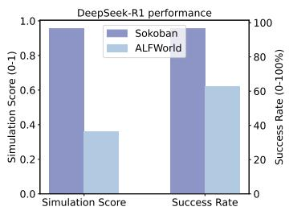
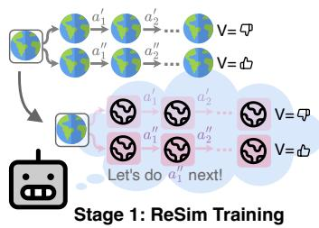
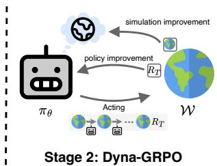
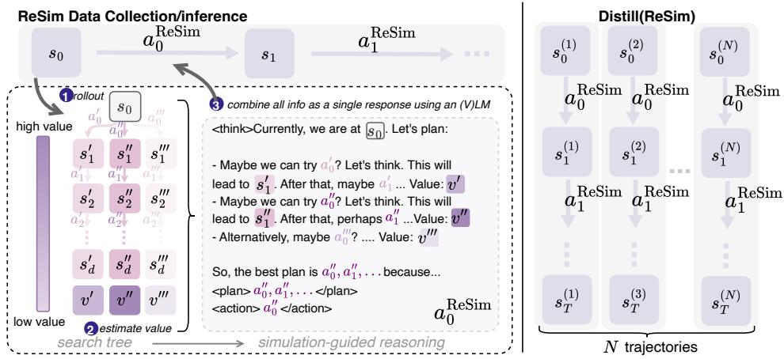
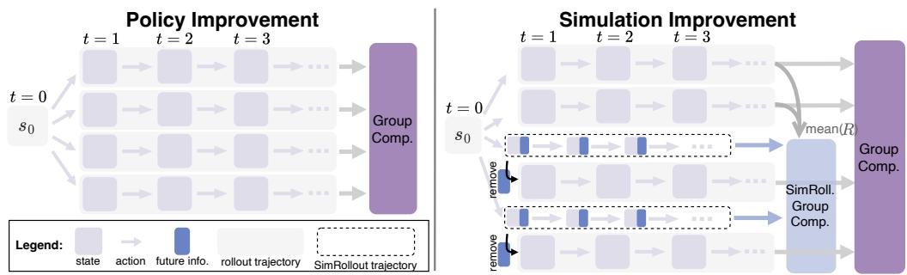
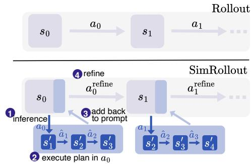

## ABSTRACT

Reasoning models have recently shown remarkable progress in domains such as math and coding. However, their expert-level abilities in math and coding contrast sharply with their performance in long-horizon, interactive tasks such as web navigation and computer/phone-use. Inspired by literature on human cognition, we argue that current AI agents need “vicarious trial and error”—the capacity to mentally simulate alternative futures before acting—in order to enhance their understanding and performance in complex interactive environments. We introduce Dyna-Mind, a two-stage training framework that explicitly teaches (V)LM agents to integrate such simulation into their reasoning. In stage 1, we introduce Reasoning with Simulations (RESIM), which trains the agent to generate structured reasoning traces from expanded search trees built from real experience gathered through environment interactions. RESIM thus grounds the agent’s reasoning in faithful world dynamics and equips it with the ability to anticipate future states in its reasoning. In stage 2, we propose Dyna-GRPO, an online reinforcement learning method to further strengthen the agent’s simulation and decision-making ability by using both outcome rewards and intermediate states as feedback from real rollouts. Experiments on two synthetic benchmarks (Sokoban and ALFWorld) and one realistic benchmark (AndroidWorld) demonstrate that (1) RESIM effectively infuses simulation ability into AI agents, and (2) Dyna-GRPO leverages outcome and interaction-level signals to learn better policies for long-horizon, planning intensive tasks. Together, these results highlight the central role of simulation in enabling AI agents to reason, plan, and act more effectively in the ever more challenging environments.

## 1 INTRODUCTION

Recent advances in language models have unlocked impressive reasoning capabilities in domains such as mathematics and programming (Shao et al., 2024; Jimenez et al., 2024). However, many emerging applications unfold in complex environments that require multi-step reasoning, such as web navigation (Zhou et al., 2024b; Deng et al., 2023), deep research (Gou et al., 2025a; Du et al., 2025), and computer/phone-use tasks (Xie et al., 2024; Rawles et al., 2025). Success in these domains depends not only on the ability to decompose goals and reflect on past progress, but also on AI agents ability to construct accurate world models that capture the structure and dynamics of increasingly complex environments (Shao et al., 2024; Jimenez et al., 2024).

Insights from human cognition indicate why such ability to model and simulate complex environments is critical. Neuroscience research (Tolman, 1948; Daw et al., 2005; Daw & Dayan, 2014; Bennett, 2023) highlights the emergence of the neocortex as a turning point in intelligence, enabling early mammals to engage in “vicarious trial and error”: mentally simulating possible futures, evaluating their consequences, and selecting advantageous actions without directly experiencing each option. This ability greatly enhanced adaptability and decision-making, which we argue is equally essential for reasoning in long-horizon AI agent tasks.

  
(a) Simulation ability v.s. performance

  
(b) Dyna-Mind

  
Figure 1: We find the performance of strong reasoning models is heavily affected by its ability to simulate in different environments (left). We introduce Dyna-Mind, a two-stage training framework to integrate and improve simulation ability of AI agents (right).

Empirical evidence supports this view. In Figure 1a, we observe that while strong reasoning models such as DeepSeek-R1 can simulate and solve structured environments like Sokoban, their performance drops sharply in more complex domains such as ALFWorld—both in simulation accuracy and overall task success (also see Section 4.1.2). Initial attempts to address this limitation, such as Dyna-Think (Yu et al., 2025b), integrate simulation into reasoning through distilling simplified traces and adding auxiliary next-state prediction tasks. However, these methods rely on the strong capability of reasoning models to directly generate synthetic simulation data, which can embed errors and biases.

To overcome this limitation, we present Dyna-Mind, an improved two-stage training framework to teach (V)LM agents to simulate the environment by directly learning from real experiences. In stage 1 training, we propose Reasoning with Simulations (RESIM) to algorithmically construct reasoning traces using expanded search trees obtained from real environment interactions, and train a policy model using these reasoning traces. In stage 2 training, we further improve the policy and its simulation ability using online reinforcement learning (RL). We introduce Dyna-GRPO, a novel algorithm that utilizes both outcome rewards and intermediate states from rollouts to improve the simulation ability of the policy. Extensive experiments on two widely used synthetic benchmarks (Sokoban and ALFWorld) and one realistic benchmark (AndroidWorld) show the effectiveness of each stage of the framework. Our results indicate that (1) RESIM’s reasoning traces effectively teach AI agents to simulate; and (2) Dyna-GRPO, by leveraging both outcome rewards and intermediate interactions, learns better policies for long-horizon, planning-intensive tasks. These findings highlight the importance of world simulation ability for reasoning in long-horizon tasks. 1

## 2 RELATED WORK

(V)LM as decision making agents The use of (visual) language models as autonomous agents has been explored in a wide range of applications such as interactive game playing (Wang et al., 2023; Feng et al., 2025), computer, phone, and browser uses (Xie et al., 2024; Zhou et al., 2024b; Rawles et al., 2025), software engineering (Jimenez et al., 2024; Yang et al., 2024), and more. Early works include reactive agents (Yao et al., 2023b) that directly prompts an (V)LM to make decisions on immediate observations without simulation or planning approaches, hindering performance on complex long-horizon tasks. Recent advances include: (1) search-based methods (Yao et al., 2023a; Zhou et al., 2024a; Koh et al., 2024; Yu et al., 2023; 2025a) that augments (V)LM agents with algorithms such as BFS, DFS, and MCTS; and (2) hierarchical, multi-agent methods (Zheng et al., 2024; Agashe et al., 2024; 2025; Liu et al., 2025; Gou et al., 2025b) that orchestrate multiple specialized agents to complete long-horizon tasks. While these methods show improvements, they often introduce substantial overheads during inference, such as requiring additional interactions with the environments or designing complex heuristics to orchestrate multiple agents. We focus on enhancing a single (V)LM agent by integrating simulation into its reasoning via training.

Training (V)LM agents Early methods in training (V)LM agents mostly rely on supervised learning (SFT) with human annotations or data synthesized by state-of-the-art (reasoning) models (Zeng et al., 2023; Chen et al., 2024; Zhang et al., 2024; Xu et al., 2025). Recently, many methods such as Feng et al. (2025); Wang et al. (2025b); Wei et al. (2025a;b) leverage reinforcement learning (RL) with verifiable rewards to directly train agents to complete tasks by prompting them to reason before taking actions, following the success of DeepSeek-R1 (DeepSeek-AI et al., 2025a). However, it remains unclear whether extensive reasoning is necessary for all scenarios (Shojaee et al., 2025), and what aspects of such reasoning is essential for long-horizon tasks (Yu et al., 2025b). In this work, we specialize in integrating and improving the simulation ability of (V)LM agents during reasoning, and show that planning with world simulation is crucial for long-horizon tasks.

World models and Dyna algorithms Beyond task completion, real-world interaction data contains rich information that can be used to help decision making. Early examples include Dyna algorithms (Sutton, 1991), which combine model-based and model-free methods to efficiently learn optimal policies. Given a set of real-world rollout data, Dyna (1) separately train a world model using these rollouts; (2) perform additional simulated rollouts with the world model; and (3) update the policy using both real and simulated rollouts. Applications of world model training have been explored in work such as Chae et al. (2025); Gu et al. (2025), facilitating search algorithms such as MCTS to improve performance; and applications of Dyna include Deep Dyna-Q (Peng et al., 2018), Switch-DDQ (Wu et al., 2018), and more (Zou et al., 2020; Yu et al., 2025b). However, these approaches either result in modular systems (a separate policy and world model) or require accessing state-of-the-art reasoning models (e.g., DeepSeek-R1). Our work does not rely on strong reasoning models, and focuses on integrating and improving simulation as part of an agent’s reasoning process.

## 3 DYNA-MIND

Research in human cognition (Daw et al., 2005; Daw & Dayan, 2014; Bennett, 2023) as well as in games like chess, go, and othello (Schrittwieser et al., 2020; Li et al., 2024; Nanda et al., 2023; Chae et al., 2025) suggests that strong agents implicitly store and use a (compressed) representation of the world to enhance their decision-making. This perspective highlights two key questions in existing approaches to improve (V)LM agents for long-horizon tasks: (1) how to synergize world simulations with reasoning; and (2) how to improve the simulation ability to help improve the policy.

To address these questions, we introduce Dyna-Mind, a two-stage training framework to teach (V)LM agents to plan with simulations during their reasoning and improve their task performance. We detail these two training stages next in Section 3.2 and Section 3.3, respectively.

## 3.1 NOTATION

Completing tasks in complex, realistic environments is typically formulated as a Markov Decision Process of $( \mathcal { S } , \mathcal { A } , \mathcal { T } , \mathcal { R } )$ . In the generic setting of multi-step tasks, an agent $\pi _ { \theta }$ receives an instruction and observation2 from the environment $s _ { t } \sim S$ at time step $t ,$ generates an action $a _ { t } \sim \pi _ { \theta } ( \cdot | s _ { t } )$ , and transitions to the next state $s _ { t + 1 } \sim \mathcal { T } ( s _ { t } , a _ { t } )$ . This process is repeated until the task is completed or until reaching a maximum number of steps, upon which a terminal reward $r _ { T } \sim \mathcal { R } ( s _ { T } , a _ { T } )$ is provided based on whether the task is completed successfully or not. In the context of simple text games such as Sokoban Schrader (2018), a state $s _ { t }$ can represent the complete game state, and an action $a _ { t }$ is one of “left”, “right”, “up”, “down” (after some reasoning process). In more complex environments such as AndroidWorld (Rawles et al., 2025), a state $s _ { t }$ is the current screenshot of the android device, and an action $a _ { t }$ can be “tapping on a coordinate $\mathbf { \Phi } ( \mathbf { x } , \mathbf { y } ) ^ { \flat }$ , “swiping up”, “swiping down”, etc. We note that since we aim to train agents to generate simulations within their reasoning process, any text that represents simulation is always part of the response $\boldsymbol { a _ { t } . } ^ { 3 }$ Any variant of the symbol s represents real states from environment interactions, unless explicitly stated otherwise.

## 3.2 REASONING WITH SIMULATIONS (RESIM)

To enable an agent to simulate during its reasoning, we first construct imitation learning data where the reasoning process consists of explicitly planning with simulations. Different from prior work such as Yu et al. (2025b) that leverages superior LLMs such as DeepSeek-R1 which already shows world modeling capability in its reasoning traces (see Section 4.1.1 for more details), we construct simulation-guided reasoning traces using search trees built from real environment interactions.

  
Figure 2: RESIM integrates simulation into reasoning $( a _ { t } ^ { \mathrm { R e S i m } } )$ by using expanded search trees built through real environment interactions (left). RESIM then trains an agent to directly generate such simulation-guided reasoning trace $a _ { t } ^ { \mathrm { R e S i m } }$ without any algorithm support (right).

RESIM Data Collection To construct reasoning data with rich simulations, we leverage algorithms such as depth first search (DFS) to construct search trees based on environment interactions, and then use an (V)LM to aggregate the entire search tree into a single reasoning response $a ^ { \mathrm { R e S i m } }$ for later training. Specifically, given a state $s ,$ RESIM first uses a rollout model $\pi _ { \theta }$ to generate b rollouts from s up to depth d. This rollout model can be a specialized/finetuned LLM (see Section 4.1) or simply prompting a generic LLM (see Section 4.2). Then, RESIM uses a value function $V _ { \nu }$ to provide an estimate of the quality of each of the partial rollouts, where the $V _ { \nu }$ can be implemented as either a finetuned value model (see Section 4.1) or using LLM-as-a-judge (see Section 4.2). Finally, we use a generic (V)LM to aggregate all these rollouts and their values into a single response $a ^ { \mathrm { { \acute { R e S i m } } } }$ by prompting the (V)LM to 1) first independently summarize each partial rollout, which contains ground truthfuture states informationfrom the environment; and 2) then aggregate all these summaries into a coherent response conditioned on the current state s and previous h actions and states, and choose the best plan and the next immediate action for execution. The final chosen action from aReSim is then executed in the environment, and this process is repeated until the task is solved or until a maximum number of steps is reached. We illustrate this process in Figure 2 Left and Algorithm 3. We note that since RESIM essentially converts real search trees into a single reasoning trace, it is not limited to (1) agent-environment interactions; (2) specific search algorithms used in this work. We believe other domains such as agent-user-environment interactions or other algorithms such as MCTS are also applicable, which we leave for future work.

RESIM Distillation Since each response $a ^ { \mathrm { R e S i m } }$ encapsulates an entire search tree in its reasoning, we directly use $a ^ { \mathrm { R e S i m } }$ as the training target given an input s to teach the model to perform simulationguided reasoning without any algorithm support. We illustrate this in Figure 2 Right. Specifically, given a collection of trajectories $\ l _ { 7 } ^ { \infty } = \{ s _ { 0 } , a _ { 0 } ^ { \mathrm { R e S i m } } , s _ { 1 } , a _ { 1 } ^ { \mathrm { R e S i m } } , \ l , \cdot \cdot \ , s _ { T } , a _ { T } ^ { \mathrm { R e S i m } } \}$ produced by RESIM inference, we use SFT to train the model to directly generate each $a _ { t } ^ { \mathrm { R e S i m } }$ given the current state $s _ { t }$ as well as a maximum history of h previous actions and states in the trajectory (i.e., the same input used by other inference methods such as REACT).

## 3.3 DYNA-GRPO

While RESIM provides a principled way to synergize simulation with reasoning, it is computationally expensive and relies on multiple modules (a rollout model, a value function, and a (V)LM to aggregate the search tree into a single response) to construct training data. Additionally, such offline training may limit models’ generalization ability to new tasks. To address this, we propose DYNA-GRPO, a modification of GRPO (Shao et al., 2024) to further improve the model’s simulation ability during online RL without using any search or additional modules. The standard GRPO objective JGRPO is:

  
Figure 3: DYNA-GRPO iterates between policy improvement (left) and world model improvement (right), optimized by GRPO. During policy improvement, we perform grouped policy rollouts with GRPO. During simulation improvement, we perform both policy rollouts and simulation refinement rollouts (see Figure 4), and trains the model to directly generate an improved policy as well as to better perform simulation refinement when provided with future-states information.

$$
\mathbb {E} _ {\tau \sim \pi_ {\theta_ {\mathrm{old}}}} \left[ \frac {1}{G T} \sum_ {i = 1} ^ {G} \sum_ {t = 1} ^ {T} \min \left(\rho_ {\theta} (a _ {t} ^ {(i)}) A (a _ {t} ^ {(i)}), \mathsf {c l i p} (\rho_ {\theta} (a _ {t} ^ {(i)}), 1 \pm \epsilon) A (a _ {t} ^ {(i)})\right) - \beta D _ {\mathrm{KL}} (\pi_ {\theta} | | \pi_ {\theta_ {\mathrm{ref}}}) \right],
$$

where $\begin{array} { r } { \rho _ { \theta } ( a ) = \frac { \pi _ { \theta } ( a | s ) } { \pi _ { \theta _ { \mathrm { r e f } } } ( a | s ) } } \end{array}$ is the importance sampling ratio, β is the KL regularization coefficient, and $A = A _ { \mathrm { G R P O } }$ is the episode-level advantage function (Wang et al., 2025b; Feng et al., 2025):

$$
A (a _ {t} ^ {(i)}) = A _ {\mathrm{GRPO}} (\tau^ {(i)}) = \frac {R (\tau^ {(i)}) - \mathrm{mean} (\{R (\tau^ {(j)}) \} _ {j = 1} ^ {G})}{\mathrm{std} (\{R (\tau^ {(j)}) \} _ {j = 1} ^ {G})}, R (\tau^ {(i)}) = \sum_ {t = 1} ^ {T} R (s _ {t}, a _ {t}),
$$

where G is the group size, $R ( \cdot )$ is the reward provided by the environment, with $R ( s _ { t } , a _ { t } ) = - 0 . 1$ 1 for non-terminal steps and $R ( s _ { T } , a _ { T } ) = 1 0 . 0$ or $R ( s _ { T } , a _ { T } ) = 0 . 0$ for terminal steps when task succeeded or failed, respectively.

However, RL algorithms such as GRPO aim to optimize a policy only using scalar rewards $R _ { T }$ but do not provide any direct training signal on refining the reasoning process or world model simulations. We propose DYNA-GRPO to address this, by additionally incorporating future state(s) information $s _ { t + 1 } , s _ { t + 2 } , \cdots$ as textual signals to help improve the model’s response $a \sim \pi _ { \theta } ( \cdot | s _ { t } )$ during RL training. Since textual signals cannot be directly “optimized”, we propose SIMROLLOUT to instead prompt the underlying model to refine its simulation in $a \sim \pi _ { \theta } ( \cdot | s _ { t } )$ utilizing real future state(s) $s _ { t + 1 } , s _ { t + 2 } , \cdot \cdot \cdot$ during RL rollouts. Then, during optimization we train the policy to both directly generate the refined action and also to improve its “simulation refinement” ability (DYNA-GRPO). We detail these two modifications below. Rollout

SIMROLLOUT In simulation refinement rollout (SIMROLLOUT), at each state $s _ { t }$ we first sample a response $a \sim \pi _ { \theta } ( \cdot | s _ { t } ) ;$ then extract the final chosen plan $\{ \hat { a } _ { 1 } , \hat { a } _ { 2 } , \cdot \cdot \cdot , \hat { a } _ { d } \}$ up to depth d from a and execute them in the environment to obtain ground truth next-states $\{ s _ { t + 1 } ^ { \prime } , s _ { t + 2 } ^ { \prime } , \cdot \cdot \cdot , s _ { t + d } ^ { \prime } \} ;$ and finally prompt πθ again to refine its response a given these real future states $a ^ { \mathrm { r e f i n e } } \sim$ $\begin{array} { r } { \stackrel { \bullet } { \pi _ { \theta } } ( \cdot | s _ { t } ^ { \mathrm { r e f i n e } } ) , s _ { t } ^ { \mathrm { r e f i n e } } \equiv \{ s _ { t } \oplus a \oplus s _ { t + 1 } ^ { \prime } \oplus \widehat { a } _ { 2 } \oplus \cdot \cdot \cdot \oplus } \end{array}$ $s _ { t + d } ^ { \prime } \} . ^ { 4 }$ We illustrate this rollout process in $\mathrm { F i g \mathrm { - } }$ ure 4 and provide the pseudo-code in Algorithm $2 .$ We note that this is different from methods such

  
Figure 4: SIMROLLOUT generates refined action per state $s _ { t }$ using real environment interactions

as Reflexion (Shinn et al., 2023), which performs reflection at the end of the episode utilizing success/failure information, and is also not intended for any training purposes. Empirically, we find the resulting $a ^ { \mathrm { { r e f i n e } } }$ indeed improves the policy’s simulation and performance (see Appendix D.4).

DYNA-GRPO Training To utilize refined trajectories from SIMROLLOUT during RL, we follow Dyna algorithms to improve the model’s policy and simulation ability iteratively. Specifically, DYNA-GRPO iterates between (1) simulation improvement where models learn from refined policies that use future states information from SIMROLLOUT to improve its simulation ability; and (2) direct policy improvement where models are trained on standard rollouts without future-state access, allowing it to better integrate simulation ability into decision-making. We illustrate both training processes in Figure 3, and detail the overall algorithm in Algorithm 1.

During simulation improvement, for each task we (1) first perform SIMROLLOUT with a group

Algorithm 1 DYNA-GRPO
Require: policy  $\pi_{\theta}$ , environment T, group size G
Require: hyperparameters G, N,  $n_{T}$ ,  $n_{\pi}$ 
1: for N training iterations do
2:    // simulation improvement
3:    for  $n_{T}$  steps do
4:    // see Algorithm 2
5:    $\{\tau'\}, \{\tau'_{refine}\} \leftarrow SimRollout(\pi_{\theta}, T, G/2)$ 
6:    $\{\tau\} \leftarrow Rollout(\pi_{\theta}, T, G/2)$ 
7:    Update  $\pi_{\theta}$  with GRPO( $\{\tau\} \cup \{\tau'\}$ )
8:    Update  $\pi_{\theta}$  with GRPO( $\{\tau'_{refine}\}$ ) using  $A_{refine}$ 
9:    end for
10:    // policy improvement
11:    for  $n_{\pi}$  steps do
12:    $\{\tau\} \leftarrow Rollout(\pi_{\theta}, T, G)$ 
13:    Update  $\pi_{\theta}$  with GRPO( $\{\tau\}$ )
14:    end for
15: end for
16: return  $\pi_{\theta}$

size of $G / 2 ,$ collecting refined trajectories with and without future-state information removed: $\tau ^ { \prime } =$ $\{ s _ { 0 } , a _ { 0 } ^ { \mathrm { r e f i n { \stackrel { \cdot } { e } } } } , s _ { 1 } , a _ { 1 } ^ { \mathrm { r e f i n e } } , \cdot \cdot \cdot \}$ and $\tau _ { \mathrm { r e f i n e } } ^ { \prime } = \{ s _ { 0 } ^ { \mathrm { r e f i n e } } , a _ { 0 } ^ { \mathrm { r e f i n e } } , s _ { 1 } ^ { \mathrm { r e f i n e } } , a _ { 1 } ^ { \mathrm { r e f i n e } } , \cdot \cdot \cdot \} ; ( 2 )$ then perform standard rollouts with group size of $G / 2 ; ( 3 )$ combine these standard rollouts τ with refined trajectories $\tau ^ { \prime }$ into a single group of size G and perform GRPO on this combined group; (4) finally utilize $\tau _ { \mathrm { r e f i n e } } ^ { \prime }$ to also improve the model’s simulation refinement ability, using the following modified advantage to reward refinements that both correctly solves the task and improves upon (the mean reward of) standard policy rollouts which does not access future states:

$$
A _ {\text { refine }} (\tau_ {\text { refine }} ^ {(i)}) = \left\{ \begin{array}{l l} 1. 0, & \text { if   } \tau_ {\text { refine }} ^ {(i)} \text {   is   correct   and   } R (\tau_ {\text { refine }} ^ {(i)}) > \max (\bar {R}, \bar {R} ^ {\text { refine }}) \\ 0. 0, & \text { otherwise } \end{array} \right.,
$$

where $\begin{array} { r } { \bar { R } = \frac { 1 } { { G } / { 2 } } \sum _ { i = 1 } ^ { { G } / { 2 } } R ( \tau ^ { ( i ) } ) } \end{array}$ is the mean reward of the standard policy rollouts (line 6 of Algorithm 1); $\begin{array} { r } { \bar { R } ^ { \mathrm { r e f i n e } } = \frac { 1 } { G / 2 } \sum _ { i = 1 } ^ { G / 2 } R ( \tau _ { \mathrm { r e f i n e } } ^ { ( i ) } ) } \end{array}$ is mean reward from SIMROLLOUT (line 5 of Algorithm 1). During policy improvement, we perform standard policy rollouts without future state information, optimized by GRPO using episode-level advantage (Feng et al., 2025; Wang et al., 2025b).

## 4 EXPERIMENTS

We first evaluate Dyna-Mind on two “synthetic” environments (Sokoban and ALFWorld) that require efficient planning for successful task completion. These lightweight environments allow us to provide detailed analysis of the different reasoning styles as well as different RL algorithms. Then, we extend our methods to a more complex and realistic environment (AndroidWorld).

## 4.1 TEXT GAMES

Benchmarks Sokoban (Schrader, 2018) is a grid-world game where the agent needs to push boxes to target destinations while avoiding obstacles, and successful task completion requires spatial planning to avoid deadlock situations. ALFWorld (Shridhar et al., 2021) is a text-based embodied environment where the agent needs to locate/interact with objects to complete household tasks using natural language instructions. To evaluate the agent’s generalization ability, we construct training set, an in-distribution (ID) test set, and an out-of-distribution (OOD) test set. For Sokoban, we use training set with 6x6 room layouts with 1 box and 1 destination; ID test set with different 6x6 room layouts than training; and OOD test set with 8x8 room layouts with 1 box and 1 destination. For ALFWorld, we directly use the official training, ID, and OOD test splits from Shridhar et al. (2021).

Baselines setup To evaluate RESIM, we compare against (1) ReACT based prompting methods with models such as GPT-4o (OpenAI, 2024), Claude-3.7 (Anthropic, 2025), DeepSeek-V3 (DeepSeek-AI et al., 2025b), and DeepSeek-R1 (DeepSeek-AI et al., 2025a); and (2) training methods that distill the reasoning traces from strong policy models such as DeepSeek-R1. To evaluate stage 2 DYNA-GRPO training, we compare against other popular group-based RL algorithms such as RLOO (Kool et al.,

Table 1: Performance on text game environments such as Sokoban and ALFWorld. “Gen. Token” denotes the average number of tokens generated per turn relative to that of Qwen2.5-7B-Instruct. All training in stage-1 and stage-2 are based on Qwen2.5-7B-Instruct. All results are averaged over 3 runs. Our methods are highlighted in gray.

<table><tr><td rowspan="2">Method</td><td rowspan="2">Gen. Token</td><td colspan="3">Sokoban</td><td colspan="3">ALFWorld</td></tr><tr><td>ID</td><td>OOD</td><td>AVG</td><td>ID</td><td>OOD</td><td>AVG</td></tr><tr><td>REACT(Qwen2.5-7B-Instruct)</td><td>1.0x</td><td> $25.8 \pm 1.8$ </td><td>-</td><td>-</td><td> $35.4 \pm 1.9$ </td><td>-</td><td>-</td></tr><tr><td>REACT(Qwen2.5-32B-Instruct)</td><td>2.7x</td><td> $36.7 \pm 4.2$ </td><td>-</td><td>-</td><td> $36.2 \pm 3.3$ </td><td>-</td><td>-</td></tr><tr><td>REACT(GPT-4o)</td><td>1.5x</td><td> $37.8 \pm 1.0$ </td><td>-</td><td>-</td><td> $51.3 \pm 2.1$ </td><td>-</td><td>-</td></tr><tr><td>REACT(Claude-3.7-Sonnet)</td><td>2.3x</td><td> $70.3 \pm 1.2$ </td><td>-</td><td>-</td><td> $46.1 \pm 1.0$ </td><td>-</td><td>-</td></tr><tr><td>REACT(DeepSeek-V3)</td><td>2.5x</td><td> $57.0 \pm 1.6$ </td><td>-</td><td>-</td><td> $55.2 \pm 1.0$ </td><td>-</td><td>-</td></tr><tr><td>REACT(DeepSeek-R1)</td><td>14.5x</td><td> $\textbf{96.6} \pm 0.2$ </td><td>-</td><td>-</td><td> $62.5 \pm 0.5$ </td><td>-</td><td>-</td></tr><tr><td>RESIM</td><td>2.0x</td><td> $96.4 \pm 0.2$ </td><td>-</td><td>-</td><td> $\textbf{87.7} \pm 1.1$ </td><td>-</td><td>-</td></tr><tr><td>Dyna-Think</td><td></td><td></td><td></td><td></td><td></td><td></td><td></td></tr><tr><td>DIT(R1)+DDT( $\hat{T}$ )</td><td>24.2x</td><td> $74.0 \pm 1.4$ </td><td> $57.5 \pm 1.2$ </td><td> $65.8 \pm 1.9$ </td><td> $63.2 \pm 1.5$ </td><td> $56.7 \pm 2.8$ </td><td> $58.9 \pm 2.3$ </td></tr><tr><td>Dyna-Mind Stage 1 (SFT)</td><td></td><td></td><td></td><td></td><td></td><td></td><td></td></tr><tr><td>DISTILL(V3)</td><td>2.1x</td><td> $49.2 \pm 1.1$ </td><td> $34.4 \pm 1.3$ </td><td> $41.8 \pm 1.1$ </td><td> $58.9 \pm 1.1$ </td><td> $56.7 \pm 1.0$ </td><td> $57.8 \pm 1.2$ </td></tr><tr><td>DISTILL(R1)</td><td>24.0x</td><td> $\textbf{72.5} \pm 2.9$ </td><td> $\textbf{57.0} \pm 1.9$ </td><td> $\textbf{64.8} \pm 2.5$ </td><td> $59.4 \pm 1.5$ </td><td> $54.2 \pm 3.9$ </td><td> $56.8 \pm 3.5$ </td></tr><tr><td>DISTILL(RESIM)</td><td>2.0x</td><td> $71.9 \pm 1.5$ </td><td> $55.5 \pm 1.6$ </td><td> $63.7 \pm 1.9$ </td><td> $\textbf{78.9} \pm 2.1$ </td><td> $\textbf{69.3} \pm 1.3$ </td><td> $\textbf{74.1} \pm 1.8$ </td></tr><tr><td>Dyna-Mind Stage 2 (RL)</td><td></td><td></td><td></td><td></td><td></td><td></td><td></td></tr><tr><td>DISTILL(RESIM) + RLOO</td><td>2.2x</td><td> $78.1 \pm 1.8$ </td><td> $65.1 \pm 1.3$ </td><td> $71.3 \pm 0.9$ </td><td> $85.9 \pm 1.3$ </td><td> $85.4 \pm 2.0$ </td><td> $85.5 \pm 2.0$ </td></tr><tr><td>DISTILL(RESIM) + GRPO</td><td>2.1x</td><td> $79.1 \pm 1.3$ </td><td> $67.8 \pm 0.6$ </td><td> $73.1 \pm 1.4$ </td><td> $87.0 \pm 3.2$ </td><td> $87.1 \pm 1.1$ </td><td> $87.0 \pm 1.8$ </td></tr><tr><td>DISTILL(RESIM) + DYNA-GRPO</td><td>1.9x</td><td> $\textbf{82.5} \pm 1.5$ </td><td> $\textbf{70.1} \pm 1.6$ </td><td> $\textbf{77.1} \pm 1.7$ </td><td> $\textbf{92.5} \pm 0.8$ </td><td> $\textbf{89.1} \pm 1.3$ </td><td> $\textbf{90.8} \pm 0.9$ </td></tr></table>

2019) and GRPO (Shao et al., 2024). Overall, we also compare against Dyna-Think (Yu et al., 2025b), which similarly uses two-stage training (DIT and DDT) to improve model’s simulation ability.

Dyna-Mind setup To instantiate RESIM, we use Qwen2.5-32B-Instruct (Qwen et al., 2025) as rollout and value function models, finetuned on rollouts obtained by using DeepSeek-V3 (see Appendix D.3 for more details) and use DeepSeek-V3 as the LLM to aggregate the search tree into a single response. For Sokoban, we use $d = 5 , b = 1 6 , b _ { \mathrm { t r a i n } } = 2 ;$ for ALFWorld, we use $d = 2 , b \stackrel {  } { = } 2 4 , b _ { \mathrm { t r a i n } } = 4$ . We note that all models used by RESIM are by themselves much weaker than other models such as DeepSeek-R1 as well as RESIM itself. Since DeepSeek-R1 and RESIM have a higher success rate than DeepSeek-V3, to isolate improvement from better reasoning from simply training with more (diverse) data, we thus only used trajectories where all methods correctly solved the task for stage 1 training. This results in a total of 207 trajectories in Sokoban and 200 trajectories in ALFWorld from each method (DeepSeek-R1, DeepSeek-V3, and RESIM) in the subsequent stage 1 training.

To instantiate DYNA-GRPO, we continue training the best model from stage 1 distillation. To ensure a fair comparison, we use identical hyperparameters for all methods (RLOO, GRPO, and DYNA-GRPO), when applicable. For DYNA-GRPO, we use $n \tau = 1 0$ and $n _ { \pi } = 1 0$ for Sokoban and $n \tau = 1 0$ and $n _ { \pi } = 2 0$ for ALFWorld. For more setup details, please see Appendix D.5.

## 4.1.1 MAIN RESULTS

In the upper section of Table 1, we first evaluate RESIM’s performance against other strong reasoning models such as DeepSeek-R1. Then, we compare different training methods to integrate/improve the simulation ability of the policy model. In Table 1, we first find that RESIM achieves near-perfect performance on Sokoban (96.4% success) and a strong performance on ALFWorld (87.7% success), significantly outperforming all other methods. On Sokoban, we find strong reasoning models such as DeepSeek-R1 also achieves near-perfect performance, which we attribute to R1’s ability to correctly simulate Sokoban game states (but not on ALFWorld) during its reasoning process (see Section 4.1.2 for empirical results). In contrast, RESIM utilizes ground-truth simulations from search trees, and hence was able to achieve strong performance in both environments.

In stage 1 training, we find DISTILL(RESIM) achieves a similar performance to DISTILL(R1) on Sokoban but significantly outperforms both DISTILL(V3) and DISTILL(R1) on ALFWorld. Additionally, since RESIM constructs reasoning traces consists almost entirely of only planning via simulation (see Figure 2 Left), DISTILL(RESIM) outputs 11x less tokens on average compared to DISTILL(R1).

Table 2: Measuring simulation ability of different models across different training stages. We report the average success rate and the simulation ability (Sim Score $\in [ 0 , 1 ] )$ averaged across all trajectories. We also report the correlation coefficient r between the success rate and the simulation score.

<table><tr><td rowspan="2">Method</td><td colspan="2">Sokoban</td><td colspan="2">ALFWorld</td></tr><tr><td>Success</td><td>Sim Score</td><td>Success</td><td>Sim Score</td></tr><tr><td>REACT(Qwen2.5-7B-Instruct)</td><td> $25.8 \pm 1.8$ </td><td> $0.21_{(r=0.64)}$ </td><td> $35.4 \pm 1.9$ </td><td> $0.18_{(r=0.46)}$ </td></tr><tr><td>REACT(DeepSeek-V3)</td><td> $57.0 \pm 1.6$ </td><td> $0.54_{(r=0.81)}$ </td><td> $55.2 \pm 1.0$ </td><td> $0.35_{(r=0.68)}$ </td></tr><tr><td>REACT(DeepSeek-R1)</td><td> $96.6 \pm 0.2$ </td><td> $0.93_{(r=0.96)}$ </td><td> $62.5 \pm 0.5$ </td><td> $0.36_{(r=0.70)}$ </td></tr><tr><td>RESIM</td><td> $96.4 \pm 0.2$ </td><td> $\mathbf{1.00}_{(-)}$ </td><td> $\mathbf{87.7} \pm 1.1$ </td><td> $\mathbf{1.00}_{(-)}$ </td></tr><tr><td>Dyna-Think</td><td></td><td></td><td></td><td></td></tr><tr><td>DIT(R1)+DDT( $\hat{T}$ )</td><td> $74.0 \pm 1.4$ </td><td> $0.62_{(r=0.74)}$ </td><td> $63.2 \pm 1.5$ </td><td> $0.36_{(r=0.76)}$ </td></tr><tr><td>Dyna-Mind Stage 1 (SFT)</td><td></td><td></td><td></td><td></td></tr><tr><td>DISTILL(R1)</td><td> $\mathbf{72.5} \pm 2.9$ </td><td> $0.61_{(r=0.75)}$ </td><td> $59.4 \pm 1.5$ </td><td> $0.34_{(r=0.77)}$ </td></tr><tr><td>DISTILL(RESIM)</td><td> $71.9 \pm 1.5$ </td><td> $\mathbf{0.62}_{(r=0.78)}$ </td><td> $\mathbf{78.9} \pm 2.1$ </td><td> $\mathbf{0.37}_{(r=0.74)}$ </td></tr><tr><td>Dyna-Mind Stage 2 (RL)</td><td></td><td></td><td></td><td></td></tr><tr><td>DISTILL(RESIM) + GRPO</td><td> $79.1 \pm 1.3$ </td><td> $0.62_{(r=0.65)}$ </td><td> $87.0 \pm 3.2$ </td><td> $0.38_{(\rho=0.48)}$ </td></tr><tr><td>DISTILL(RESIM) + DYNA-GRPO</td><td> $\mathbf{82.5} \pm 1.5$ </td><td> $\mathbf{0.67}_{(r=0.64)}$ </td><td> $\mathbf{92.5} \pm 0.8$ </td><td> $\mathbf{0.43}_{(r=0.55)}$ </td></tr></table>

These results indicate that that strong performance from RESIM can be learned by SFT, and that the ability to model and simulate the environment is crucial for long-horizon, planning-intensive tasks.

In stage 2 training, we continue from the best model (DISTILL(RESIM)) with online RL. In Table 1, we find that DYNA-GRPO improves upon both GRPO, RLOO, as well as Dyna-Think, while maintaining a similar output token length compared to its base model DISTILL(RESIM). This indicates that DYNA-GRPO is effective at improving the model’s simulation ability during online RL training (also see Section 4.1.2 for empirical results), and that improving such simulation ability helps improve task performance. For a more detailed ablation study comparing the effect of search algorithm used by RESIM as well as DYNA-GRPO, please see Table A1 and Appendix D.1.

## 4.1.2 MEASURING SIMULATION ABILITY

Dyna-Mind aims to integrate and improve the simulation ability of agents. To measure this simulation ability, we evaluate the Simulation Score (Sim Score) of different models and the Spearman Correlation Coefficient $( r _ { s } )$ between sim score and success rate. Given a state $s _ { t }$ and generated response $a _ { t } \sim \pi _ { \theta } ( \cdot | s _ { t } )$ , we evaluate the simulation score of $a _ { t }$ by 1) first prompting an LLM to extract the final action plan $( \hat { a } _ { 1 } , \hat { a } _ { 2 } , \cdots , \hat { a } _ { d } )$ and the natural language description (i.e., simulation) of the corresponding imagined next-states $\left( \hat { s } _ { t + 1 } , \hat { s } _ { t + 2 } , \cdot \cdot \cdot , \hat { s } _ { t + d } \right)$ from the response $a _ { t } ; 2 )$ then execute the action plan in the environment to obtain ground truth next-states $\{ s _ { t + 1 } , s _ { t + 2 } , \cdot \cdot \cdot , s _ { t + d } \} ; 3 )$ finally, prompt an LLM to judge (Zheng et al., 2023) the correctness of these simulated next-states $\hat { s } _ { i }$ by comparing them against the ground truth $s _ { i } ,$ , returning a score ∈ [0, 1]. Finally, we averaged the score for each turn to obtain an overall simulation score for the trajectory. To ensure a fair judgment, we used a different LLM from all of our experiments (Qwen3-235B-A22B-Instruct (Qwen Team, 2025)). For judgment prompts, please see Appendix D.6.

We present the results in Table 2. In Table 2, we find that 1) RESIM maintains its strong success rates across both Sokoban and ALFWorld due to its perfect simulation ability (by construction), whereas DeepSeek-R1 struggled in ALFWorld as it struggles to model the environment layout; and 2) both DISTILL(RESIM) and DYNA-GRPO improve the simulation ability alongside task performance compared to their baselines. These results show that our methods helped improve the simulation ability of the model beyond simply improving task performance.

## 4.2 ANDROIDWORLD

Next, we extend our Dyna-Mind to AndroidWorld (Rawles et al., 2025) - a highly challenging benchmark that evaluates the agent’s ability control and complete tasks on a virtual Android device.

Benchmarks AndroidWorld (Rawles et al., 2025) provides a fully functional Android environment that requires the agent to interact with Android’s GUI to complete tasks across 20 real-world Android apps. Since tasks in AndroidWorld are parameterized by task types (116), we construct a training set with 81 task types with in total 1946 tasks, an ID test set with 128 different tasks from the same task types, and an OOD test set with 128 tasks from the remaining 35 held-out task types. We use a maximum number of 15 steps and the screenshot-only modality as input. We provide an example task and action in Appendix E.1.

Table 3: Performance on AndroidWorld. All training are based on Qwen2.5-VL-7B/32B-Instruct. We exclude Dyna-Think since (most) VLMs cannot predict images, as required by DDT(Tˆ ) training. “Gen. Token” denotes the average number of tokens generated per turn relative to that of Qwen2.5- 7B-Instruct. All results are averaged over 3 runs. Our methods are highlighted in gray.

<table><tr><td rowspan="2">Method</td><td rowspan="2">Gen. Token</td><td colspan="3">AndroidWorld</td></tr><tr><td>ID</td><td>OOD</td><td>AVG</td></tr><tr><td>REACT(GPT-4o)</td><td>1.0x</td><td> $5.1 \pm 0.2$ </td><td>-</td><td>-</td></tr><tr><td>REACT(Qwen2.5-VL-7B-Instruct)</td><td>1.0x</td><td> $5.3 \pm 0.2$ </td><td>-</td><td>-</td></tr><tr><td>REACT(Qwen2.5-VL-72B-Instruct)</td><td>1.1x</td><td> $19.5 \pm 0.4$ </td><td>-</td><td>-</td></tr><tr><td>RESIM</td><td>2.1x</td><td> $\mathbf{34.4} \pm 0.4$ </td><td>-</td><td>-</td></tr><tr><td colspan="5">Dyna-Mind Stage 1 (SFT)</td></tr><tr><td>DISTILL-7B(Qwen2.5-VL-72B-Instruct)</td><td>1.0x</td><td> $13.1 \pm 0.4$ </td><td> $8.6 \pm 0.2$ </td><td> $10.8 \pm 0.6$ </td></tr><tr><td>DISTILL-7B(RESIM)</td><td>2.1x</td><td> $21.1 \pm 0.4$ </td><td> $10.2 \pm 0.6$ </td><td> $15.7 \pm 0.8$ </td></tr><tr><td>DISTILL-32B(RESIM)</td><td>2.0x</td><td> $\mathbf{32.8} \pm 0.4$ </td><td> $\mathbf{15.6} \pm 0.7$ </td><td> $\mathbf{24.2} \pm 0.6$ </td></tr><tr><td colspan="5">Dyna-Mind Stage 2 (RL)</td></tr><tr><td>DISTILL-32B(RESIM) + GRPO</td><td>2.1x</td><td> $35.3 \pm 0.4$ </td><td> $20.3 \pm 0.6$ </td><td> $27.8 \pm 0.4$ </td></tr><tr><td>DISTILL-32B(RESIM) + DYNA-GRPO</td><td>1.9x</td><td> $\mathbf{40.7} \pm 1.0$ </td><td> $\mathbf{22.9} \pm 1.0$ </td><td> $\mathbf{31.8} \pm 1.0$ </td></tr></table>

Baselines setup Since our methods consider end-to-end training, we compare against models that are capable of directly generating executable actions given an GUI screenshot, and exclude modular systems such as Gou et al. (2025b); Agashe et al. (2025). We thus mainly compare against (1) REACT based prompting method with Qwen2.5-VL-72B/7B (Bai et al., 2025), and GPT-4o; and (2) distillation from Qwen2.5-VL-72B5. To evaluate stage 2 DYNA-GRPO, we compare against GRPO following Section 4.1. We exclude comparison against Dyna-Think in this experiment, because DDT(Tˆ ) trains the model to predict next-state (in this case, screenshot images), which cannot be implemented using most VLMs as they can only generate text.

Dyna-Mind setup Since AndroidWorld is a highly challenging and compute-intensive environment (each episode on average takes 15-20 minutes to complete), we do not perform any rollout/value function training for RESIM. Instead, we directly prompt Qwen2.5-VL-72B as the rollout model, prompt GPT-4o as a judge to approximate the value function, and also use GPT-4o as the VLM to aggregate the rollouts into a single response in RESIM. We use $d = 1 , b = 1 6 , b _ { \mathrm { t r a i n } } = 4$ for RESIM, and a total of 128 trajectories for distillation/stage 1 training. To instantiate $\mathrm { \Delta D Y N A  – G R P O }$ , we generally followed the same recipe as Section 4.1, but used less training steps (60) as AndroidWorld is highly compute-intensive and time-consuming. For more details, please see Appendix E.2.

## 4.2.1 MAIN RESULTS

Results We present the results in Table 3. In general, we observe similar results compared to Section 4.1.1. First, we find that RESIM inference significantly improves performance, and that the improved performance can be transferred to Qwen2.5-VL-7B and 32B via DISTILL(RESIM). Next, in both training stages of Dyna-Mind, we find improved performance in both ID and OOD test sets compared to baselines, including Qwen2.5-VL-72B and even RESIM. These results highlight the effectiveness of our method to improve agent’s performance in complex environments.

Error Analysis Compared to synthetic text games (Section 4.1.1) where RESIM achieves nearperfect performance, we find RESIM struggles in AndroidWorld despite improvements compared to baselines. After analyzing trajectories produced by RESIM, we find performance is bottlenecked by the rollout model (Qwen2.5-VL-72B), mainly due to: (1) incomplete understanding of some GUI interfaces and certain button functions, and (2) inability to recover after making multiple mistakes. We believe methods to improve the foundation model’s capability could mitigate these problems (Wang et al., 2025a; Qin et al., 2025), which we leave for future work.

## 5 CONCLUSION

In this work, we propose Dyna-Mind to synergize reasoning with simulations for autonomous AI agents. We empirically show that an agent’s ability to model and simulate the environment strongly correlates with its ability to correctly reason and complete long-horizon, planning-intensive tasks. We introduce Dyna-Mind, a two-stage training method to explicitly teach (V)LM agents to integrate and improve such simulation a part of their reasoning. In stage 1 training, we propose RESIM to train a model to simulate future states by learning to predict an expanded search tree in their reasoning. In stage 2 training, we propose DYNA-GRPO to further refine the agent’s reasoning and simulation ability using online RL. Empirical results on three benchmarks show that (1) RESIM effectively teaches AI agents to simulate; and (2) DYNA-GRPO, by leveraging both outcome rewards and intermediate interactions, learns better policies for long-horizon, planning-intensive tasks.

## REFERENCES

Saaket Agashe, Jiuzhou Han, Shuyu Gan, Jiachen Yang, Ang Li, and Xin Eric Wang. Agent s: An open agentic framework that uses computers like a human, 2024. URL https://arxiv.org/ abs/2410.08164.

Saaket Agashe, Kyle Wong, Vincent Tu, Jiachen Yang, Ang Li, and Xin Eric Wang. Agent s2: A compositional generalist-specialist framework for computer use agents, 2025. URL https: //arxiv.org/abs/2504.00906.

Anthropic. Claude 3.7 Sonnet and Claude Code. https://www.anthropic.com/news/ claude-3-7-sonnet, 2025. Accessed: 2025-05-13.

Shuai Bai, Keqin Chen, Xuejing Liu, Jialin Wang, Wenbin Ge, Sibo Song, Kai Dang, Peng Wang, Shijie Wang, Jun Tang, Humen Zhong, Yuanzhi Zhu, Mingkun Yang, Zhaohai Li, Jianqiang Wan, Pengfei Wang, Wei Ding, Zheren Fu, Yiheng Xu, Jiabo Ye, Xi Zhang, Tianbao Xie, Zesen Cheng, Hang Zhang, Zhibo Yang, Haiyang Xu, and Junyang Lin. Qwen2.5-vl technical report, 2025. URL https://arxiv.org/abs/2502.13923.

M.S. Bennett. A BriefHistory ofIntelligence: Evolution, AI, and the Five Breakthroughs That Made Our Brains. HarperCollins, 2023. ISBN 9780063286368. URL https://books.google. com/books?id=tymCEAAAQBAJ.

Hyungjoo Chae, Namyoung Kim, Kai Tzu iunn Ong, Minju Gwak, Gwanwoo Song, Jihoon Kim, Sunghwan Kim, Dongha Lee, and Jinyoung Yeo. Web agents with world models: Learning and leveraging environment dynamics in web navigation, 2025. URL https://arxiv.org/abs/ 2410.13232.

Zehui Chen, Kuikun Liu, Qiuchen Wang, Wenwei Zhang, Jiangning Liu, Dahua Lin, Kai Chen, and Feng Zhao. Agent-flan: Designing data and methods of effective agent tuning for large language models, 2024. URL https://arxiv.org/abs/2403.12881.

Nathaniel D Daw and Peter Dayan. The algorithmic anatomy of model-based evaluation. Philosophi cal Transactions ofthe Royal Society B: Biological Sciences, 369(1655):20130478, 2014.

Nathaniel D. Daw, Yael Niv, and Peter Dayan. Uncertainty-based competition between prefrontal and dorsolateral striatal systems for behavioral control. Nature Neuroscience, 8:1704–1711, 2005. URL https://api.semanticscholar.org/CorpusID:16385268.

DeepSeek-AI, Daya Guo, Dejian Yang, Haowei Zhang, Junxiao Song, Ruoyu Zhang, Runxin Xu, Qihao Zhu, Shirong Ma, Peiyi Wang, Xiao Bi, Xiaokang Zhang, Xingkai Yu, Yu Wu, Z. F. Wu, Zhibin Gou, Zhihong Shao, Zhuoshu Li, Ziyi Gao, Aixin Liu, Bing Xue, Bingxuan Wang, Bochao Wu, Bei Feng, Chengda Lu, Chenggang Zhao, Chengqi Deng, Chenyu Zhang, Chong Ruan,