## ABSTRACT

Offline reinforcement learning (RL) faces a critical challenge of overestimating the value of out-of-distribution (OOD) actions. Existing methods mitigate this issue by penalizing unseen samples, yet they fail to accurately identify OOD actions and may suppress beneficial exploration beyond the behavioral support. Although several methods have been proposed to differentiate OOD samples with distinct properties, they typically rely on restrictive assumptions about the data distribution and remain limited in discrimination ability. To address this problem, we propose DOSER (Diffusion-based OOD Detection and SElective Regularization), a novel framework that goes beyond uniform penalization. DOSER trains two diffusion models to capture the behavior policy and state distribution, using singlestep denoising reconstruction error as a reliable OOD indicator. During policy optimization, it further distinguishes between beneficial and detrimental OOD actions by evaluating predicted transitions, selectively suppressing risky actions while encouraging exploration of high-potential ones. Theoretically, we prove that DOSER is a γ-contraction and therefore admits a unique fixed point with bounded value estimates. We further provide an asymptotic performance guarantee relative to the optimal policy under model approximation and OOD detection errors. Across extensive offline RL benchmarks, DOSER consistently attains superior performance to prior methods, especially on suboptimal datasets.

## 1 INTRODUCTION

Offline reinforcement learning (RL) has emerged as a powerful paradigm for learning policies exclusively from static datasets, eliminating the need for potentially costly or risky online interactions (Levine et al., 2020). This capability renders it particularly appealing for real-world domains where exploration is constrained, such as robotics, healthcare and autonomous systems. However, directly applying standard off-policy RL algorithms to offline dataset pose a fundamental challenge of distribution shift. When the learned policy generates actions that deviate substantially from the training data distribution, value functions tend to extrapolate erroneously, leading to severe value overestimation and ultimately catastrophic performance degradation (Fujimoto et al., 2019).

Existing approaches fall into two categories: 1) Policy constraint methods enforce the learned policy remain close to the behavior policy to avoid OOD actions (Kumar et al., 2019; Wu et al., 2019; Fujimoto & Gu, 2021; Kostrikov et al., 2021), typically relying on variational auto-encoders (VAEs) (Kingma & Welling, 2013) for behavior modeling. While effective in principle, these methods struggle to capture the multi-modal nature of real-world behaviors, often collapsing diverse action distributions into suboptimal averaged outputs within low-density regions (Wang et al., 2022). 2) Value regularization methods offer an alternative by learning conservative Q-functions that penalize OOD actions (Kumar et al., 2020; Wu et al., 2021; Bai et al., 2022; Mao et al., 2023). Their effectiveness depends on the underlying OOD identification mechanism, which is a challenging task due to the limited representation capacity of the models used to characterize data distribution. Furthermore, they usually apply uniform penalties across the entire out-of-support region, without considering valuable explorations that could enhance policy performance (Figure 1, left).

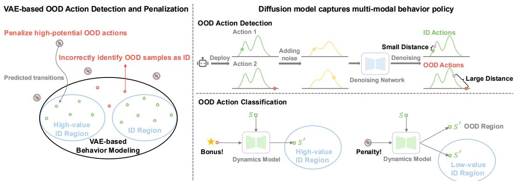  
Figure 1: VAE-based behavior modeling methods (left) misidentify OOD actions, whereas uniform penalties suppress high-potential OOD actions. DOSER (right) models multi-modal behavior policy via diffusion model and uses reconstruction error as an OOD indicator, further distinguishing detrimental from beneficial actions for selective regularization.

Recent efforts have sought to mitigate excessive pessimism by controlling the level of conservatism in a fine-grained manner. CCVL (Hong et al., 2022) conditions the Q-function on a confidence level to learn a spectrum of conservative value estimates, enabling adaptive policies that dynamically adjust pessimism during online evaluation. ACL-QL (Wu et al., 2024) models the behavior policy as a Gaussian distribution and introduces learnable weighting functions to adaptively modulate conservatism at the state-action level. DoRL-VC (Huang et al., 2024) employs a VAE-based detector to separate OOD from ID actions, and further distinguish OOD actions with different properties. Nevertheless, such approaches either rely on Q-ensemble learning to achieve varying degrees of conservatism, incurring additional training overhead, or inherits strong Gaussian assumptions regarding the behavior policy, which fundamentally limit their ability to reliably identify OOD samples.

To address these challenges, we present DOSER (Diffusion-based OOD Detection and SElective Regularization), advancing OOD handling through two key innovations (Figure 1, right). First, we utilize diffusion models to achieve OOD detection. By deploying two diffusion models for behavior policy approximation and state distribution modeling, we establish reconstruction errors as theoretically rigorous metrics, avoiding strong Gaussian assumptions while maintaining well-calibrated detection performance. Second, we introduce an adaptive discrimination mechanism that goes beyond binary classification of in-distribution (ID) and OOD. By integrating a learned dynamics model, we distinguish between beneficial OOD actions (those with potential to improve performance while staying within state distribution) and detrimental OOD actions (those likely to induce state distribution shift or value degradation). This fine-grained discrimination enables selective regularization, discouraging hazardous actions while encouraging promising explorations, which yields a robust framework that maintains necessary conservatism while facilitating policy improvement.

The key contributions of this paper are as follows: 1) We propose a diffusion-based approach for OOD detection in offline RL, using reconstruction error as a theoretically grounded metric. 2) We introduce a dual regularization strategy that adaptively adjusts its treatment of OOD actions based on predicted outcomes, suppressing detrimental actions while encouraging beneficial ones. 3) Extensive experiments on D4RL benchmarks demonstrate superior or competitive performance compared to prior methods, with detailed ablations verifying the effectiveness of each component.

## 2 PRELIMINARY

Offline RL. We consider the RL problem formulated by the Markov Decision Process (MDP), which is defined as a tuple $( S , \mathcal { A } , \mathcal { P } , \dot { R } , \gamma , d _ { 0 } )$ , with state space S, action space A, transition dynamics

$P : \mathcal { S } \times \mathcal { A } \times \mathcal { S }  [ 0 , 1 ]$ , reward function $R : S \times \mathcal { A }  \lvert R _ { \mathrm { m i n } } , R _ { \mathrm { m a x } } \rvert$ , discount factor $\gamma \in [ 0 , 1 )$ and initial state distribution $d _ { 0 } : { \mathcal { S } }  [ 0 , 1 ]$ (Sutton et al., 1998). The goal of RL is to learn a policy $\pi : S  \Delta ( { \mathcal { A } } )$ that maximizes the expected discounted return $\begin{array} { r } { J ( \pi ) \stackrel {  } { = } \mathbb { E } [ \sum _ { t = 0 } ^ { \infty } \gamma ^ { t } R ( s _ { t } , \pmb { a } _ { t } ) ] } \end{array}$ ]. For any policy π, we define the value function as $\begin{array} { r } { V ^ { \pi } ( s ) = \mathbb { E } [ \sum _ { t = 0 } ^ { \infty } \gamma ^ { t } R ( s _ { t } , \overline { { a _ { t } } } ) \rvert s _ { 0 } = s ] . } \end{array}$ , and the $\mathrm { Q } \mathrm { - }$ function as $\begin{array} { r } { Q ^ { \pi } ( s ) = \mathbb { E } [ \sum _ { t = 0 } ^ { \infty } \gamma ^ { t } R ( s _ { t } , { a } _ { t } ) | s _ { 0 } = s , { a } _ { 0 } = { a } ] . } \end{array}$ . Given that rewards are bounded, the Q-function must lie between $\breve { Q } _ { \mathrm { m i n } } = R _ { \mathrm { m i n } } / ( 1 - \gamma )$ and $Q _ { \operatorname* { m a x } } = R _ { \operatorname* { m a x } } / ( 1 - \gamma )$ . In offline RL, the agent is limited to learn from a static dataset $\boldsymbol { \mathcal { D } } = \{ ( \boldsymbol { s } , \boldsymbol { a } , r , \boldsymbol { s } ^ { \prime } ) \}$ collected by a behavior policy $\pi _ { \beta } .$ without any interaction with the environment (Lange et al., 2012). We denote the empirical behavior policy as $\hat { \pi } _ { \beta }$ , which depicts the conditional action distribution observed in D.

Diffusion Models. Diffusion models (Sohl-Dickstein et al., 2015; Ho et al., 2020; Song et al., 2020) have emerged as a powerful class of generative models that excel in capturing complex data distributions. The core idea revolves around a forward diffusion process that gradually perturbs data into noise and a reverse process that learns to reconstruct the original data. Given a clean sample $\pmb { x } _ { 0 } \sim p _ { \mathrm { d a t a } } ( \pmb { x } _ { 0 } )$ with standard deviation $\sigma _ { \mathrm { d a t a } } .$ , the forward process constructs a sequence of increasingly noisy samples $\pmb { x } _ { t } \sim p ( \pmb { x } _ { t } ; \sigma _ { t } )$ by adding i.i.d. Gaussian noise with standard deviation $\sigma _ { t }$ that increases along the schedule $\sigma _ { \mathrm { m i n } } = \sigma _ { 0 } < \sigma _ { 1 } < \cdots < \sigma _ { \mathrm { N } } = \sigma _ { \mathrm { m a x } }$ . Commonly, $\sigma _ { \mathrm { m i n } }$ is chosen sufficiently small that $p _ { \mathrm { m i n } } ( \pmb { x } ) \approx p _ { \mathrm { d a t a } } ( \pmb { x } )$ , while $\sigma _ { \mathrm { m a x } }$ is large enough that the final distribution approximates isotropic Gaussian noise, i.e., pmax(x) ≈ $\mathcal { N } ( \pmb { x } ; 0 , \sigma _ { \mathrm { m a x } } ^ { 2 } \bar { I } )$

In the original DDPM (Ho et al., 2020) formulation, this process is modeled as a discrete Markov chain. Subsequent works reinterpret it through the lens of stochastic differential equations (SDEs) (Song et al., 2020), describing the evolution of $\mathbf { \Delta } _ { \mathbf { \mathcal { X } } _ { t } }$ over continuous time $t \in [ 0 , T ]$ as:

$$
d \boldsymbol {x} _ {t} = f (\boldsymbol {x} _ {t}, t) d t + g (t) d \boldsymbol {w} _ {t}\tag{1}
$$

where $f ( \cdot , t )$ and $g ( t )$ are the drift and diffusion coefficients, and ${ \pmb w } _ { t }$ is a standard Wiener process.

The EDM framework (Karras et al., 2022) refines this paradigm by reparameterizing the diffusion path with differentiable noise schedules $\sigma ( t )$ . The reverse process is governed by a corresponding probability-flow ODE derived from the forward SDE, which is formulated as:

$$
d \pmb {x} _ {t} = - \dot {\sigma} (t) \sigma (t) \nabla_ {\pmb {x} _ {t}} \log p _ {t} (\pmb {x} _ {t}) d t\tag{2}
$$

where $\begin{array} { l } { { \dot { \sigma } } ( t ) ~ = ~ { \frac { d \sigma } { d t } } } \end{array}$ is the time derivative of noise schedule controlling the noise change rate, $\nabla _ { \pmb { x } _ { t } } \log p _ { t } ( \pmb { x } _ { t } )$ is the score function of the marginal distribution $p _ { t } ( \pmb { x } _ { t } )$ . The score is approximated by a neural network $\epsilon _ { \theta } ( \boldsymbol { x } _ { t } ; \boldsymbol { \sigma } _ { t } )$ trained via denoising score matching (Vincent, 2011). The denoising model $\epsilon _ { \theta }$ is trained to predict the true clean sample $\scriptstyle { \pmb x } _ { 0 }$ from its noisy version ${ \pmb x } _ { t } = { \pmb x } _ { 0 } + \sigma _ { t } { \pmb \epsilon }$ by minimizing the reweighted $L _ { 2 }$ loss:

$$
\mathcal {L} (\boldsymbol {\theta}) = \mathbb {E} _ {\sigma_ {t}, \pmb {x} _ {0} \sim p (\pmb {x} _ {0}), \pmb {\epsilon} \sim \mathcal {N} (0, \pmb {I})} \left[ \lambda (\sigma_ {t}) | | \pmb {x} _ {0} - \pmb {\epsilon} _ {\boldsymbol {\theta}} (\pmb {x} _ {t}, \sigma_ {t}) | | _ {2} ^ {2} \right],\tag{3}
$$

where $\lambda ( \sigma _ { t } )$ is the loss weight. Compared to the original DDPM that requires thousands of denoising steps, EDM accelerates sampling by introducing optimized noise schedules and higher-order ODE solvers, achieving high-quality generation within only a few dozen steps.

## 3 DIFFUSION-BASED OOD DETECTION AND SELECTIVE REGULARIZATION

In this section, we present the technical framework of DOSER. We begin by introducing three main components that enable precise detection and classification of OOD actions, then demonstrate the complete integration of these components into a unified algorithmic framework, detailing the practical implementation. Figure 2 provides an overview of the proposed method. For comprehensive theoretical analysis, please refer to Appendix A.

## 3.1 DIFFUSION-BASED BEHAVIOR AND STATE MODELING

The foundation of our approach is to establish two diffusion models that jointly capture the underlying distributions of the offline dataset. We first construct a conditional diffusion model that learns the empirical behavior policy distribution ${ \hat { \pi } } _ { \beta } ( { \pmb a } | { \pmb s } )$ by training a denoising network $\epsilon _ { \theta _ { a } } ( a _ { t } , \sigma _ { t } , s )$ to reconstruct the original action $\mathbf { \delta } _ { \mathbf { a } _ { 0 } }$ through the following optimization objective:

$$
\mathcal {L} (\theta_ {a}) = \mathbb {E} _ {\sigma_ {t}, (\boldsymbol {s}, \boldsymbol {a} _ {0}) \sim \mathcal {D}, \epsilon \sim \mathcal {N} (0, I)} \left[ \lambda (\sigma_ {t}) | | \boldsymbol {a} _ {0} - \epsilon_ {\theta_ {a}} (\boldsymbol {a} _ {t}, \sigma_ {t}, \boldsymbol {s}) | | _ {2} ^ {2} \right].\tag{4}
$$

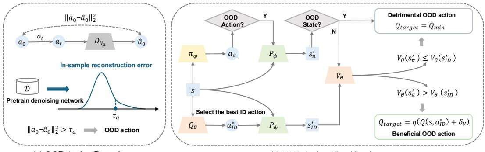  
(b) OOD Action Classification  
Figure 2: Overview of the proposed method: (a) Diffusion-based OOD action detection, (b) Integrating the detector to achieve OOD action classification.

where $\mathbf { \boldsymbol { a } } _ { t } = \mathbf { \boldsymbol { a } } _ { 0 } + \sigma _ { t } \mathbf { \boldsymbol { \epsilon } }$ is the noisy action with noise scale $\sigma _ { t } , \lambda ( \sigma _ { t } )$ balances loss scales across noise levels and $\epsilon \sim \mathcal { N } ( 0 , I )$ .

In parallel, we develop a diffusion model to capture the state distribution $d _ { 0 } ( s )$ of the dataset. The corresponding denoising network $\epsilon _ { \theta _ { s } } ( s _ { t } , \sigma _ { t } )$ is trained to recover the original states $s _ { 0 }$ from its noisy version $s _ { t } ,$ using the following reconstruction objective:

$$
\mathcal {L} (\boldsymbol {\theta} _ {s}) = \mathbb {E} _ {\sigma_ {t}, \boldsymbol {s} \sim \mathcal {D}, \boldsymbol {\epsilon} \sim \mathcal {N} (0, \boldsymbol {I})} \left[ \lambda (\boldsymbol {\sigma} _ {t}) | | \boldsymbol {s} _ {0} - \boldsymbol {\epsilon} _ {\theta_ {s}} (\boldsymbol {s} _ {t}, \boldsymbol {\sigma} _ {t}) | | _ {2} ^ {2} \right].\tag{5}
$$

## 3.2 OOD DETECTION VIA RECONSTRUCTION ERROR

Our detection mechanism leverages the denoising capabilities of pretrained diffusion models to identify OOD samples based on reconstruction errors. Given a state-action pair $( \pmb { s } , \pmb { a } _ { 0 } )$ encountered during policy optimization, we compute its OOD score through a two-step procedure.

First, we sample a noise scale $\sigma _ { t }$ from the training noise schedule and perturb the action as $\mathbf { \delta } _ { \mathbf { { \delta } } ^ { a _ { t } } } =$ $\mathbf { \boldsymbol { a } } _ { 0 } + \sigma _ { t } \mathbf { \boldsymbol { \epsilon } }$ , where $\epsilon \sim \mathcal { N } ( 0 , I )$ . The OOD score is then defined as the $L _ { 2 }$ reconstruction error between the original action and its denoised counterpart:

$$
\mathcal {E} _ {a} (\boldsymbol {s}, \boldsymbol {a} _ {0}) = \| \boldsymbol {a} _ {0} - \epsilon_ {\theta_ {a}} (\boldsymbol {a} _ {t}, \sigma_ {t}, \boldsymbol {s}) \| _ {2}.\tag{6}
$$

Analogously, for state inputs, we measure the reconstruction error between the original state $\scriptstyle { \pmb { s } } _ { 0 }$ and its denoised version:

$$
\mathcal {E} _ {s} (\boldsymbol {s} _ {0}) = \left\| \boldsymbol {s} _ {0} - \epsilon_ {\theta_ {s}} (\boldsymbol {s} _ {t}, \sigma_ {t}) \right\| _ {2},\tag{7}
$$

where $\mathbf { \boldsymbol { s } } _ { t }$ denotes the noise-corrupted state.

Formally, the OOD indicator functions are given by:

$$
\mathbb {I} _ {\mathrm{ood}} (\boldsymbol {a} _ {0}) = \{\mathcal {E} _ {a} (\boldsymbol {s}, \boldsymbol {a} _ {0}) > \tau_ {a} \}, \quad \mathbb {I} _ {\mathrm{ood}} (\boldsymbol {s} _ {0}) = \{\mathcal {E} _ {s} (\boldsymbol {s} _ {0}) > \tau_ {s} \},\tag{8}
$$

where the thresholds $\tau _ { a }$ and $\tau _ { s }$ are set as the p-th percentiles of the reconstruction errors on the training dataset D, with p controlling the level of conservatism.

This reconstruction-based method offers three key advantages: 1) Reconstruction error provides a likelihood-free surrogate for distributional alignment, directly measuring conformity to the data manifold without explicit density estimation. 2) Diffusion models naturally capture multi-modal distributions, avoiding the restrictive unimodal Gaussian assumptions of conventional approaches. 3) Detection is efficient, requiring only a single forward pass per sample. Moreover, evaluating errors across multiple randomly sampled diffusion timesteps rather than a fixed noise level improves robustness, since different noise scales correspond to varying levels of information bottleneck in the data distribution.

## 3.3 ADAPTIVE OOD ACTION CLASSIFICATION

Building on the detection framework, we introduce an adaptive classification mechanism to handle OOD actions during policy optimization. Unlike conventional methods that indiscriminately penalize all deviations, our approach distinguishes between beneficial and detrimental OOD actions through a two-stage assessment process.

Algorithm 1 Diffusion-Based OOD Detection with selective regularization (DOSER)

Initialize Q-network $Q_{\theta}$, V-network $V_{\theta}$, diffusion behavior model $\epsilon_{\theta_a}$, diffusion state model $\epsilon_{\theta_s}$, policy network $\pi_{\phi}$, dynamics model $p_{\psi}$, and target networks $Q_{\theta'}, V_{\theta'}, \pi_{\phi'}$

# Model Pretraining

Pretraining dynamics model $p_{\psi}$ by minimizing (13)

Pretraining diffusion models $\epsilon_{\theta_a}$ and $\epsilon_{\theta_s}$ by minimizing (4) and (5)

Calculate OOD detection thresholds $\tau_a$ and $\tau_s$ based on in-sample reconstruction error

for each iteration do

Sample transition minibatch $\{(\boldsymbol{s}, \boldsymbol{a}, r, \boldsymbol{s}')\}$ from $\mathcal{D}$

# Critic Learning

Generate action $\boldsymbol{a}_{\pi} \sim \pi_{\phi}(\boldsymbol{s})$ and predict the next state $\boldsymbol{s}_{\pi}' = p_{\psi}(\boldsymbol{s}, \boldsymbol{a}_{\pi})$

Select the best ID action $\boldsymbol{a}_{\text{id}}^*$ and predict the next state $\boldsymbol{s}_{\text{id}}' = p_{\psi}(\boldsymbol{s}, \boldsymbol{a}_{\text{id}}^*)$

Calculate the reconstruction errors of policy action and next state by(6) and(7)

Calculate the adaptive bonus $\delta_V = V_\theta(\boldsymbol{s}_{\pi}') - V_\theta(\boldsymbol{s}_{\text{id}}')$

Update $Q_{\theta}$ and $V_{\theta}$ by minimizing (10) and (12)

# Actor Learning

Update $\pi_{\phi}$ by minimizing (14)

# Target Network Update

$\theta' \leftarrow \rho \theta + (1 - \rho) \theta', \phi' \leftarrow \rho \phi + (1 - \rho) \phi'$

end for

For each policy-generated OOD action $\mathbf { \delta } _ { a _ { 0 0 } \mathrm { d } }$ in state s, we first predict the subsequent state $\pmb { s } _ { \pi } ^ { \prime }$ using the learned dynamics model $p _ { \psi } ( s ^ { \prime } | s , a )$ , pretrained via supervised learning on the offline dataset D. Since value estimation for OOD states is inherently unreliable, we then evaluate the outcome of $\mathbf { \delta } _ { a _ { 0 0 } \mathrm { d } }$ along two dimensions: 1) Whether $\pmb { s } _ { \pi } ^ { \prime }$ lies outside the training distribution, determined by the proposed OOD detection mechanism; 2) If $\pmb { s } _ { \pi } ^ { \prime }$ is in-distribution, whether $V ( s _ { \pi } ^ { \prime } )$ exceeds $V ( s _ { \mathrm { i d } } ^ { \prime } )$ where $ { \boldsymbol { s } } _ { \mathrm { i d } } ^ { \prime }$ denotes the predicted next state after executing the optimal in-distribution action.

Formally, the classification rule for OOD actions is given in Definition 1.

Definition 1 (Beneficial and detrimental OOD action sets). Let the beneficial OOD action set $\mathcal { A } _ { \mathrm { o o d } } ^ { + }$ and the detrimental OOD action set $\mathcal { A } _ { \mathrm { o o d } } ^ { - }$ be subsets of the action space A. Then:

$$
\mathcal {A} _ {\text { ood }} ^ {+} := \left\{\boldsymbol {a} \in \mathcal {A} \mid \mathcal {E} _ {s} (\boldsymbol {s} _ {\pi} ^ {\prime}) \leq \tau_ {s} \wedge V (\boldsymbol {s} _ {\pi} ^ {\prime}) \geq V (\boldsymbol {s} _ {\text { id }} ^ {\prime}) \right\},
$$

$$
\mathcal {A} _ {\text { ood }} ^ {-} := \left\{\boldsymbol {a} \in \mathcal {A} \mid \mathcal {E} _ {s} (\boldsymbol {s} _ {\pi} ^ {\prime}) > \tau_ {s} \vee V (\boldsymbol {s} _ {\pi} ^ {\prime}) <   V (\boldsymbol {s} _ {\text { id }} ^ {\prime}) \right\},\tag{9}
$$

where $\begin{array} { r } { s _ { \pi } ^ { \prime } \sim p _ { \psi } ( \cdot | s , a _ { \mathrm { o o d } } ) , s _ { \mathrm { i d } } ^ { \prime } \sim p _ { \psi } ( \cdot | s , a _ { \mathrm { i d } } ^ { * } ) , a _ { \mathrm { i d } } ^ { * } = \arg \operatorname* { m a x } _ { a \sim \pi _ { \beta } ( \cdot | s ) } Q ( s , a ) } \end{array}$ is the optimal indistribution action at state s, $\mathcal { E } _ { s } ( \cdot )$ is the state reconstruction error defined in $( 7 ) ,$ , and $\tau _ { s }$ is the state OOD threshold.

Accordingly, detrimental OOD actions are penalized to mitigate overestimation. Conversely, to encourage exploration beyond dataset support, beneficial OOD actions receive an adaptive bonus $\delta _ { V } = \bar { V ( \pmb { s } _ { \pi } ^ { \prime } ) } ^ { \bot } - V ( \pmb { s } _ { \mathrm { i d } } ^ { \prime } )$ . This compensates for extrapolation errors in value estimation and guides the policy towards high-value regions, even when Q-value estimates for OOD actions remain imperfect.

Therefore, we minimize the following loss for policy evaluation:

$$
\begin{array}{r l} & {\mathcal {L} (\theta) = \mathbb {E} _ {(\boldsymbol {s}, \boldsymbol {a}, \boldsymbol {s} ^ {\prime}) \sim \mathcal {D}} \big [ \underbrace {\big (Q _ {\theta} (\boldsymbol {s} , \boldsymbol {a}) - \big (R (\boldsymbol {s} , \boldsymbol {a}) + \gamma \mathbb {E} _ {\boldsymbol {a} ^ {\prime} \sim \pi_ {\beta} (\cdot | \boldsymbol {s})} [ Q _ {\theta^ {\prime}} (\boldsymbol {s} ^ {\prime} , \boldsymbol {a} ^ {\prime}) ] \big) \big) ^ {2}} _ {\text {Standard Bellman error}} \big ]} \\ & {\qquad + \beta   \mathbb {E} _ {\boldsymbol {s} \sim \mathcal {D},   \boldsymbol {a} \sim \pi_ {\phi} (\cdot | \boldsymbol {s})} \big [ \underbrace {\mathbb {I} (\boldsymbol {a} \in \mathcal {A} _ {\mathrm{ood}} ^ {-}) \cdot (Q _ {\theta} (\boldsymbol {s} , \boldsymbol {a}) - Q _ {\min}) ^ {2}} _ {\text {Penalty for detrimental OOD actions}} \big ]} \\ & {\qquad + \lambda   \mathbb {E} _ {\boldsymbol {s} \sim \mathcal {D},   \boldsymbol {a} \sim \pi_ {\phi} (\cdot | s)} \big [ \underbrace {\mathbb {I} (\boldsymbol {a} \in \mathcal {A} _ {\mathrm{ood}} ^ {+}) \cdot (Q _ {\theta} (\boldsymbol {s} , \boldsymbol {a}) - \eta   (Q _ {\theta^ {\prime}} (\boldsymbol {s} , \boldsymbol {a} _ {\mathrm{id}} ^ {*}) + \delta_ {V})) ^ {2}} _ {\text {Penalty for detrimental OOD actions}} \big ]} \end{array}\tag{10}
$$

where $Q _ { \theta ^ { \prime } }$ is the target Q-network, $Q _ { \mathrm { m i n } } = R _ { \mathrm { m i n } } / ( 1 - \gamma )$ is the theoretical minimal Q-value of the MDP. In practical implementation, we approximate $\pmb { a } _ { \mathrm { i d } } ^ { * }$ as:

$$
\hat {\boldsymbol {a}} _ {\mathrm{id}} ^ {*} = \underset {\boldsymbol {a} _ {i} \sim \hat {\pi} _ {\beta} (\cdot | \boldsymbol {s})} {\arg \max} Q (\boldsymbol {s}, \boldsymbol {a} _ {i}) \quad \text { for } \quad i = 1, \ldots , N\tag{11}
$$

with $N = 1 0$ empirically balancing computational cost and performance across all tasks.

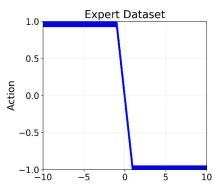

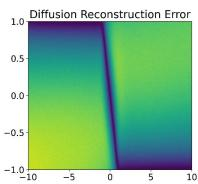

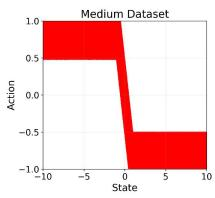  
(a)

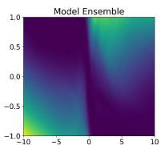

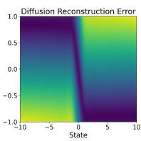  
(b)

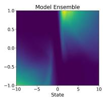

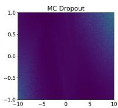

(c)  
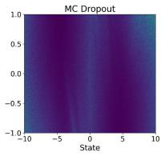  
(d)

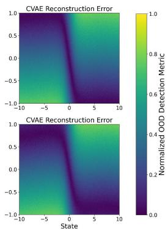  
(e)  
Figure 3: OOD detection experiments on 1D navigation task, where a higher OOD detection metric (reconstruction error or uncertainty estimation) indicates a greater likelihood of being OOD. (a) Two offline datasets with distinct data distributions: expert (top) and medium (bottom). (b) OOD scores across the entire state-action space, evaluated using diffusion-based reconstruction error. (c) OOD scores based on model ensemble uncertainty. (d) OOD scores based on MC dropout uncertainty. (e) OOD scores derived from CVAE-based reconstruction error.

## 3.4 PRACTICAL IMPLEMENTATION

In this section, we provide the practical implementation of our algorithm. 1

Value Learning. Similar to IQL, we perform expectile regression to train the value network.

$$
\mathcal {L} (\theta) = \mathbb {E} _ {(\boldsymbol {s}, r, \boldsymbol {s} ^ {\prime}) \sim \mathcal {D}} \left[ L _ {2} ^ {\tau} (r + \gamma V _ {\theta^ {\prime}} (\boldsymbol {s} ^ {\prime}) - V _ {\theta} (\boldsymbol {s}) \right]\tag{12}
$$

where $L _ { 2 } ^ { \tau } ( u ) = | \tau - \mathbb { I } ( u < 0 ) | u ^ { 2 }$ denotes the asymmetric $L _ { 2 }$ loss, and $V _ { \theta ^ { \prime } }$ is the target V-network. Dynamics Model. With the quadruples $( s , a , s ^ { \prime } )$ in offline dataset D, we train the dynamics model via supervised regression:

$$
\mathcal {L} (\psi) = \mathbb {E} _ {(\boldsymbol {s}, \boldsymbol {a}, \boldsymbol {s} ^ {\prime}) \sim \mathcal {D}} | | p _ {\psi} (\cdot | \boldsymbol {s}, \boldsymbol {a}) - \boldsymbol {s} ^ {\prime} | | _ {2} ^ {2}\tag{13}
$$

Policy Learning. To enhance exploration, we optimize the actor network with maximum entropy regularization:

$$
\mathcal {L} (\phi) = \mathbb {E} _ {\boldsymbol {s} \sim \mathcal {D}, \boldsymbol {a} \sim \pi_ {\phi} (\boldsymbol {s})} [ \alpha \log \pi_ {\phi} (\cdot | \boldsymbol {s}) - Q _ {\theta} (\boldsymbol {s}, \boldsymbol {a}) ]\tag{14}
$$

where α is dynamically adjusted to maintain target entropy.

Overall Algorithm. Putting everything together, we summarize our implementation in Algorithm 1.

## 4 EXPERIMENTS

In this section, we conduct a series of experiments to validate the effectiveness of our proposed method. We aim to answer the following key questions: 1) Is diffusion-based reconstruction error better than existing approaches in detecting OOD samples? 2) How does DOSER perform on standard offline RL benchmarks compared to prior SOTA methods? 3) Does each component in DOSER contribute meaningfully to the overall performance? 4) How sensitive is DOSER to its key hyperparameter? More experimental details and results are provided in Appendix B and C.

## 4.1 OOD DETECTION

To evaluate the effectiveness of diffusion-based reconstruction error for OOD detection, we design a simple 1D navigation task, the discrete state-action space is defined over position $s \in [ - 1 0 , \bar { 1 0 } ]$ and step size $\pmb { a } \in [ - 1 , 1 ]$ . The reward function is defined as the negative distance to the target state 0, such that rewards increase as the agent approaches the target. By perturbing optimal actions with noise of varying scales, we generate two offline datasets, expert and medium. We then compare our diffusion-based approach against three representative baselines:

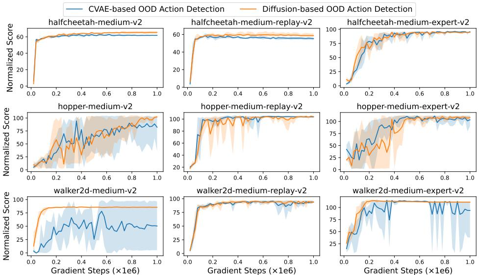  
Figure 4: Comparison of OOD action detection performance between CVAE-based reconstruction error and the proposed diffusion-based method in the D4RL MuJoCo domain.

1) Model ensemble. An ensemble of dynamics models is trained to capture epistemic uncertainty, with OOD samples identified based on high prediction variance across ensemble members.

2) MC dropout. Monte Carlo dropout is applied during inference to approximate model uncertainty, where actions with high estimated uncertainty are flagged as OOD.

3) CVAE-based reconstruction error. A conditional VAE (CVAE) is trained to model the behavior distribution, and the reconstruction error is used as the OOD indicator.

As shown in Figure 3, our diffusion-based method effectively separates ID and OOD samples across the entire state-action space, whereas baseline methods fail to achieve reliable identification even in this simple setting. In particular, the model ensemble approach frequently misclassifies OOD samples as in-distribution due to its inability to disentangle epistemic and aleatoric uncertainty. Similarly, MC dropout tends to conflate these two sources of uncertainty, while also introducing undesirable stochasticity at inference. Although the CVAE-based reconstruction error baseline shows stronger discrimination than the other two methods, its performance primarily stems from reconstruction ability, while its limited capacity to model multi-modal distributions remains a fundamental limitation (Wang et al., 2022). For more experimental details, please refer to Appendix B.4.

We further compare the OOD action detection performance using CVAE-based reconstruction error with our proposed diffusion-based approach in the D4RL MuJoCo domain (Fu et al., 2020), with results presented in Figure 4. Both methods rely solely on reconstruction error as the detection metric, without incorporating any additional classification or compensation. As illustrated, the CVAE-based method struggles to reliably identify OOD samples in high-dimensional continuous control tasks, which is attributed to its tendency to produce over-smoothed reconstructions, thus diminishing sensitivity to anomalous action inputs. In contrast, our proposed diffusion-based OOD detection consistently delivers superior performance across all evaluated datasets.

## 4.2 COMPARISONS ON D4RL BENCHMARKS

We evaluate the policy performance of DOSER on the standard D4RL benchmark, covering a diverse set of continuous control tasks with varying dataset qualities.

We compare DOSER against a broad range of baselines, including conventional algorithms and SOTA diffusion-based approaches. For policy constraint methods, we include TD3+BC (Fujimoto & Gu, 2021), IQL (Kostrikov et al., 2021) and A2PR (Liu et al., 2024). For value regularization methods, we compare against CQL (Kumar et al., 2020), SVR (Mao et al., 2023) and ACL-QL (Wu et al., 2024). For diffusion-based methods, we consider approaches that also leverage diffusion models for behavior cloning, such as DQL (Wang et al., 2022), SfBC (Chen et al., 2022), IDQL (Hansen-Estruch et al., 2023), QGPO (Lu et al., 2023), SRPO (Chen et al., 2023) and DTQL (Chen et al., 2024). Baseline performance is taken from original papers or recent literature. Some baselines did not report results on the pen tasks, and key hyperparameters for reproduction are unavailable, so we mark these entries as “-”.

Table 1: Evaluation results on D4RL benchmark. We report the average normalized scores at the last training iteration over 4 random seeds. Note that m=medium, m-r=medium-replay, m-e=mediumexpert. Bold indicates the values within 95% of the maximum value.

<table><tr><td rowspan="2">Dataset</td><td colspan="6">Conventional methods</td><td colspan="7">Diffusion-based methods</td></tr><tr><td>TD3+BC</td><td>IQL</td><td>A2PR</td><td>CQL</td><td>SVR</td><td>ACL-QL</td><td>DQL</td><td>SfBC</td><td>IDQL</td><td>QGPO</td><td>SRPO</td><td>DTQL</td><td>DOSER (Ours)</td></tr><tr><td>halfcheetah-m</td><td>48.3</td><td>47.4</td><td>68.6</td><td>44.0</td><td>60.5</td><td>69.8</td><td>51.5</td><td>45.9</td><td>51.0</td><td>54.1</td><td>60.4</td><td>57.9</td><td> $67.5 \pm 0.5$ </td></tr><tr><td>hopper-m</td><td>59.3</td><td>66.3</td><td>100.8</td><td>58.5</td><td>103.5</td><td>97.9</td><td>90.5</td><td>57.1</td><td>65.4</td><td>98.0</td><td>95.5</td><td>99.6</td><td> $104.0 \pm 0.5$ </td></tr><tr><td>walker2d-m</td><td>83.7</td><td>78.3</td><td>89.7</td><td>72.5</td><td>92.4</td><td>79.3</td><td>87.0</td><td>77.9</td><td>82.5</td><td>86.0</td><td>84.4</td><td>89.4</td><td> $86.7 \pm 1.2$ </td></tr><tr><td>halfcheetah-m-r</td><td>44.6</td><td>44.2</td><td>56.6</td><td>45.5</td><td>52.5</td><td>55.9</td><td>47.8</td><td>37.1</td><td>45.9</td><td>47.6</td><td>51.4</td><td>50.9</td><td> $63.0 \pm 1.1$ </td></tr><tr><td>hopper-m-r</td><td>60.9</td><td>94.7</td><td>101.5</td><td>95.0</td><td>103.7</td><td>99.3</td><td>101.3</td><td>86.2</td><td>92.1</td><td>96.9</td><td>101.2</td><td>100.0</td><td> $104.4 \pm 0.6$ </td></tr><tr><td>walker2d-m-r</td><td>81.8</td><td>73.9</td><td>94.4</td><td>77.2</td><td>95.6</td><td>96.5</td><td>95.5</td><td>65.1</td><td>85.1</td><td>84.4</td><td>84.6</td><td>88.5</td><td> $94.4 \pm 1.3$ </td></tr><tr><td>halfcheetah-m-e</td><td>90.7</td><td>86.7</td><td>98.3</td><td>91.6</td><td>94.2</td><td>87.4</td><td>96.8</td><td>92.6</td><td>95.9</td><td>93.5</td><td>92.2</td><td>92.7</td><td> $96.2 \pm 0.4$ </td></tr><tr><td>hopper-m-e</td><td>98.0</td><td>91.5</td><td>112.1</td><td>105.4</td><td>111.2</td><td>107.2</td><td>111.1</td><td>108.6</td><td>108.6</td><td>108.0</td><td>100.1</td><td>109.3</td><td> $111.5 \pm 1.6$ </td></tr><tr><td>walker2d-m-e</td><td>110.1</td><td>109.6</td><td>114.6</td><td>108.8</td><td>109.3</td><td>113.4</td><td>110.1</td><td>109.8</td><td>112.7</td><td>110.7</td><td>114.0</td><td>110.0</td><td> $110.9 \pm 0.2$ </td></tr><tr><td>MuJoCo-v2 Average</td><td>75.3</td><td>83.3</td><td>93.0</td><td>77.6</td><td>91.4</td><td>89.6</td><td>88.0</td><td>75.6</td><td>82.1</td><td>86.6</td><td>87.1</td><td>88.7</td><td>93.2</td></tr><tr><td>pen-human</td><td>54.9</td><td>71.5</td><td>-</td><td>35.2</td><td>73.1</td><td>-</td><td>72.8</td><td>-</td><td>-</td><td>73.9</td><td>-</td><td>64.1</td><td> $87.8 \pm 14.7$ </td></tr><tr><td>pen-cloned</td><td>63.8</td><td>37.3</td><td>-</td><td>27.2</td><td>70.2</td><td>-</td><td>57.3</td><td>-</td><td>-</td><td>54.2</td><td>-</td><td>81.3</td><td> $79.3 \pm 8.9$ </td></tr><tr><td>Adroit-v1 Average</td><td>59.4</td><td>54.4</td><td>-</td><td>31.2</td><td>71.7</td><td>-</td><td>65.1</td><td>-</td><td>-</td><td>64.1</td><td>-</td><td>72.7</td><td>83.6</td></tr></table>

As shown in Table 1, DOSER consistently achieves strong performance, outperforming prior methods on both Gym-MuJoCo and Adroit tasks. Its advantage is particularly pronounced in the more challenging “medium” and “medium-replay” settings, where the datasets contain a significant proportion of suboptimal and heterogeneous behaviors. This highlights the effectiveness of our proposed diffusion-based OOD detection mechanism and its ability of selective regularization. While existing diffusion-based baselines already exhibit improved performance over traditional approaches due to their expressive modeling capacity, DOSER further improves upon them by explicitly classifying OOD actions, which allows for more refined value estimation and better policy improvement. Note that methods such as SVR and A2PR also incorporate behavior modeling into their frameworks, either for value regularization or policy constraint. Specifically, SVR employs a CVAE to approximate the support of the behavior policy and imposes uniform penalties to actions that fall outside this estimated support. Similar to the motivation of DOSER, A2PR introduces an action discrimination mechanism to guide policy optimization. However, A2PR’s discriminator is solely applied to in-distribution actions identified by an enhanced CVAE, thereby restricting policy learning to a potentially inaccurate approximation of the dataset support. In contrast to these CVAE-based approaches, DOSER leverages the expressive power of diffusion models for more accurate OOD detection and employs a selective regularization strategy targeted at OOD actions. This enables the learned policy to extrapolate to high-value regions beyond the offline dataset, ultimately contributing to superior empirical performance.

## 4.3 ABLATION STUDY ON COMPONENTS IN DOSER

To systematically validate the effectiveness of each component in the DOSER framework, we conduct ablation studies on two variants.

1) DOSER w/o AC and VC. This variant removes both OOD action classification (AC) and value compensation (VC). It relies solely on diffusion-based reconstruction error to detect OOD actions, applying a uniform penalty without distinguishing between beneficial and detrimental cases. This serves as a direct test of the core capability of diffusion models in OOD detection.

2) DOSER w/o VC. Building on the baseline above, this variant further differentiates OOD actions by incorporating both next-state distribution modeling and value estimation. Specifically, it identifies OOD actions that either (i) lead to OOD states or (ii) yield lower value outcomes than optimal ID actions as detrimental, penalizing only those. All other OOD actions are retained without regularization, enabling a more nuanced treatment of OOD behavior.

Table 2: Components ablation across MuJoCo-v2 tasks.

<table><tr><td rowspan="2">Method</td><td colspan="3">halfcheetah</td><td colspan="3">hopper</td><td colspan="3">walker2d</td></tr><tr><td>m</td><td>m-r</td><td>m-e</td><td>m</td><td>m-r</td><td>m-e</td><td>m</td><td>m-r</td><td>m-e</td></tr><tr><td>DOSER w/o AC and VC</td><td>65.4 ± 1.1</td><td>58.8 ± 1.6</td><td>94.9 ± 0.2</td><td>102.1 ± 1.7</td><td>104.2 ± 1.3</td><td>108.3 ± 2.5</td><td>85.4 ± 0.4</td><td>94.1 ± 1.5</td><td>110.8 ± 0.4</td></tr><tr><td>DOSER w/o VC</td><td>67.2 ± 0.9</td><td>61.9 ± 1.5</td><td>96.0 ± 0.2</td><td>99.4 ± 4.</td><td>103.2 ± 1.8</td><td>111.2 ± 3.2</td><td>85.8 ± 0.6</td><td>93.0 ± 1.0</td><td>111.1 ± 0.5</td></tr><tr><td>DOSER</td><td>67.5 ± 0.5</td><td>63.0 ± 1.1</td><td>96.2 ± 0.4</td><td>104.0 ± 0.5</td><td>104.4 ± 0.6</td><td>111.5 ± 1.6</td><td>86.7 ± 1.2</td><td>94.4 ± 1.3</td><td>110.9 ± 0.2</td></tr></table>

We keep all hyperparameters fixed across these variants and evaluate performance on MuJoCo locomotion tasks. Table 2 reports the average normalized scores of DOSER and its two ablated variants across nine datasets. The complete learning curves are provided in Appendix C.9.

The results show that even the baseline variant (DOSER w/o AC and VC) already performs competitively with existing SOTA methods, confirming the strong effectiveness of diffusion models for OOD action detection. However, its uniform penalization strategy excessively suppresses potentially beneficial OOD actions, leading to noticeable performance degradation. In contrast, the classification-based variant (DOSER w/o VC) alleviates this issue by selectively regularizing only detrimental OOD actions, resulting in smaller performance drops. Overall, these findings strongly validate the effectiveness of DOSER’s fine-grained classification and compensation mechanism in better balancing conservatism and exploration during policy optimization.

## 4.4 SENSITIVITY ANALYSIS

We compare different OOD detection thresholds in Figure 5(a), set as the p-th percentile of in-distribution reconstruction errors. A smaller threshold implies more samples will be identified as OOD, which is beneficial for narrow behavior distributions like in the “mediumexpert” dataset, where a larger threshold might overlook OOD samples. For more diverse datasets like “medium” and “medium-replay”, larger thresholds are preferred to prevent ID samples from being misclassified as OOD.

We also investigate the impact of the penalty coefficient $\beta ,$ varying it from $1 0 ^ { - 5 }$ to 1, as shown in Figure 5(b). Datasets with narrow distributions require a larger $\beta$ to prevent value overestimation, while more diverse datasets benefit from a smaller $\beta$ to avoid suppressing beneficial OOD actions.

An ablation study on the compensation coefficient λ in Figure 5(c) shows that DOSER performs well across a wide range of λ values on the more diverse datasets. Setting $\lambda = 0 . 0 0 1$ yields stable performance across datasets, while excessively large values can amplify the compensation effect, leading to value overestimation and disrupting the learning process.

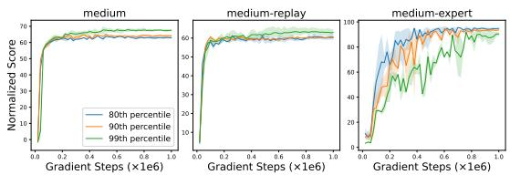

(a) OOD detection thresholds $\tau _ { a }$ and $\tau _ { s }$ .  
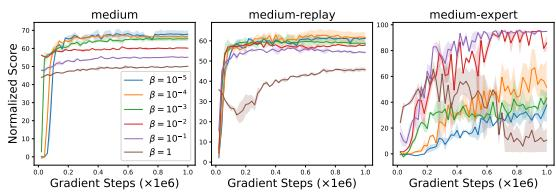  
(b) Penalty coefficient $\beta .$

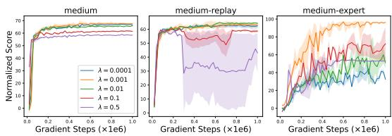  
(c) Compensation coefficient λ.  
Figure 5: Ablation study on hyperparameters for halfcheetah tasks.

## 5 RELATED WORKS

OOD Detection. Reliable identification of OOD samples is critical for the robustness of machine learning systems. Existing methods primarily fall into two categories: generative-based and reconstruction-based. Generative-based methods leverage probabilistic models to estimate the likelihood of test samples under the learned distribution (Ren et al., 2019), but models such as

Glow (Kingma & Dhariwal, 2018) and VAEs (Kingma & Welling, 2013) often assign higher likelihoods to OOD samples than to ID data (Hendrycks et al., 2018; Nalisnick et al., 2018). Although improvements like likelihood ratios (Ren et al., 2019) and typicality tests (Nalisnick et al., 2019) have been proposed, their reliance on likelihood estimation remains a fundamental limitation. In contrast, reconstruction-based methods (Denouden et al., 2018; Zong et al., 2018) directly measure reconstruction quality, based on the premise that models trained on ID data reconstruct familiar patterns well, while exhibiting significant errors on anomalous inputs. Traditional autoencoders (Lyudchik, 2016) and more recent diffusion-based models (Graham et al., 2023) have shown promising results in this regard, with diffusion models leveraging iterative refinement to further enhance ID reconstruction. Consequently, reconstruction error provides a more reliable signal of distribution shift than likelihood-based metrics, offering improved discriminability between ID and OOD samples.

OOD Detection in Offline RL. Offline RL presents additional challenges for OOD detection due to the lack of online interaction. To mitigate the risk of extrapolation error, BCQ (Fujimoto et al., 2019) and SVR (Mao et al., 2023) employ VAEs to approximate the behavior policy, constraining the learned policy to remain within behavior support. However, VAEs often fail to capture multimodal distributions accurately (Wang et al., 2024), resulting in oversimplified generations. Another line of work quantifies uncertainty to identify OOD samples. Model ensemble methods (Lakshminarayanan et al., 2017) identify OOD state-action pairs via predictive variance, with algorithms such as MOPO (Yu et al., 2020) incorporating this uncertainty as a penalty into the reward function. Similarly, Monte Carlo (MC) dropout offers a computationally efficient approximation to Bayesian inference (Gal & Ghahramani, 2016), and has been applied in offline RL for uncertainty-aware OOD detection (Wu et al., 2021). While effective to some extent, both approaches often conflate epistemic and aleatoric uncertainty, which may lead to erroneous identification of OOD actions (Zhang et al., 2023). Alternatively, CQL (Kumar et al., 2020) avoids explicit density estimation by regularizing the Q-function to assign lower values to all unseen actions. This implicit OOD detection eliminates the need for behavior modeling but risks being overly conservative, potentially suppressing valuable actions that lie outside the behavior support but could lead to improved performance.

Diffusion Models in Offline RL. Diffusion models have recently emerged as powerful paradigms in RL for modeling multi-modal distributions. This capability is particularly valuable in offline RL settings, where capturing the diversity of behaviors is essential for deriving robust policies. Methods such as Diffusion-QL (Wang et al., 2022) and DAC (Fang et al., 2024) incorporate Q-function guidance into the reverse diffusion process, shaping action generation toward higher-value regions. In contrast, IDQL (Hansen-Estruch et al., 2023) and SfBC (Chen et al., 2022) first pretrain a conditional diffusion model to generate multiple action candidates for a given state, and subsequently resample according to Q-values to select the best action for execution. Notably, while these approaches effectively integrate diffusion models with value functions for policy improvement, their use of diffusion remains largely limited to guiding or selecting actions, none of them fully exploit the inherent properties of diffusion models, such as reconstruction fidelity or noise sensitivity, to directly assess whether state-action pairs lie within the support of the training distribution.

## 6 CONCLUSION

In this work, we proposed DOSER, a framework that mitigates distribution shift through diffusionbased reconstruction error. Unlike prior methods that rely on heuristic uncertainty measures or unreliable likelihood estimates, DOSER leverages the expressive power of diffusion models to compute theoretically grounded reconstruction errors for both behavior policy and state distributions. This provides robust detection metrics that overcome the multi-modality limitations of Gaussianbased approximators. Crucially, DOSER introduces a selective regularization mechanism that classifies OOD samples into beneficial and detrimental actions, enabling suppression of detrimental extrapolations while compensating promising explorations via value-difference bonuses. Extensive experiments demonstrate that DOSER achieves superior or competitive performance compared to state-of-the-art methods, particularly on suboptimal datasets.

Nonetheless, DOSER has two key limitations: 1) its reliance on the accuracy of the diffusion-based reconstruction and the learned dynamics model, and 2) the computational overhead of the iterative diffusion sampling. Future work could focus on enhancing the robustness of dynamics model and improving efficiency via model distillation and accelerated sampling techniques.