## ABSTRACT

Offline-to-online reinforcement learning (O2O RL) aims to improve the performance of offline pretrained agents through online fine-tuning. Existing O2O RL methods have achieved advances in mitigating the overestimation of Q-value biases (i.e., biases of cumulative rewards), improving the performance. However, in this paper, we are the first to reveal that Q-value biases of these methods often follow a heavy-tailed distribution during online fine-tuning. Such biases induce high estimation variance and hinder performance improvement. To address this challenge, we propose a Laplace-based robust offline-to-online RL (LAROO) approach. LAROO introduces a parameterized Laplace-distributed noise and transfers the heavy-tailed nature of Q-value biases into this noise, alleviating heavy tailedness of biases for training stability and performance improvement. Specifically, (1) since Laplace distribution is well-suited for modeling heavy-tailed data, LAROO introduces a parameterized Laplace-distributed noise that can adaptively capture heavy tailedness of any data. (2) By combining estimated Q-values with the noise to approximate true Q-values, LAROO transfers the heavy-tailed nature of biases into the noise, reducing estimation variance. (3) LAROO employs conservative ensemble-based estimates to re-center Q-value biases, shifting their mean towards zero. Based on (2) and (3), LAROO promotes heavy-tailed Q-value biases into a standardized form, improving training stability and performance. Extensive experiments demonstrate that LAROO achieves significant performance improvement, outperforming several state-of-the-art O2O RL baselines.

## 1 INTRODUCTION

Offline-to-online reinforcement learning (O2O RL) has drawn considerable attention in recent research, concentrating on enhancing the performance of offline pretrained agents by online finetunings (Lee et al., 2021b; Nair et al., 2020; Zhao et al., 2022). Since the performance of pretrained agents is heavily limited by the quality and state-action space coverage of their offline datasets (Jin et al., 2021), O2O RL proposes to fine-tune pretrained agents in online environments. It has the appealing potential to achieve notable performance improvement within just a few online environmental interaction steps (Feng et al., 2024).

Recently, several O2O RL methods (Lee et al., 2021b; Feng et al., 2024) highlight that pretrained agents confront a significant state-action distribution shift between offline and online data during the fine-tuning process. This shift causes pretrained agents to inaccurately estimate Q-values in online data and misguide update directions, resulting in slow performance improvement and instability during online fine-tuning (Zhang et al., 2024). Therefore, the aforementioned methods employ various techniques to improve the Q-value estimation. Specifically, some methods incorporate a conservative penalty into the estimated Q-values (Zhao et al., 2022; Nakamoto et al., 2023) or employ ensemble models (Zhao et al., 2022; 2024) to enable conservative and stable Q-value estimation in

Q bias

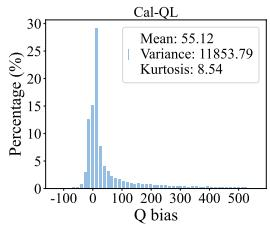

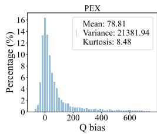

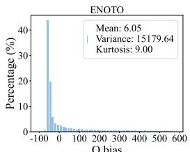  
Q bias

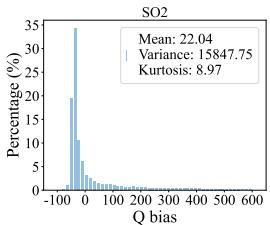  
Figure 1: The heavy-tailed Q bias distribution. We present Q bias distributions of four O2O RL methods (Cal-QL (Nakamoto et al., 2023), PEX (Zhang et al., 2023), ENOTO (Zhao et al., 2024), SO2 (Zhang et al., 2024)) for online fine-tuning at the 100k online step in the Walker2d-medium task. Please refer to Figure 5 and Figure 6 for more training steps and various tasks.

online data. Other methods (Feng et al., 2024; Zhang et al., 2024) propose to increase the update frequency of models to facilitate the accurate Q-value estimation.

In this paper, based on a comprehensive study of the Q-value estimation in O2O RL, we reveal that Q-value estimation bias (i.e., Q bias) often follows a heavy-tailed distribution during fine-tuning for the first time. In Figure 1, we illustrate the distribution of Q bias for several O2O RL methods. The results clearly show that the Q bias displays substantially heavier tails than the normal distribution, and exhibits positive skewness with notably high biases in the right tail. This heavy-tailed property of Q bias is inherently caused by distribution shift problem and persists throughout online finetuning. Consequently, the heavy-tailed Q bias challenges the widely adopted assumptions of finite variance or Gaussian modeling for such biases in prior research (Duan et al., 2021; D’Eramo et al., 2021b; Chen et al., 2021), thereby questioning their broad applicability.

In practice, the heavy-tailed Q bias significantly affects both Q-value estimation and policy updates in O2O RL. These heavy-tailed biases lead to extreme overestimation of Q-values and misguide agents to choose poor actions, causing large performance degradation during online fine-tuning. Meanwhile, high Q biases can lead to large fluctuations and even collapse of Q-value estimation (Zhang et al., 2024; Yang et al., 2024). It is widely recognized that heavy-tailed nature of bias induces large estimation variance and impedes the convergence of Q-values, resulting in slow performance improvement (Shao et al., 2018; Zhuang & Sui, 2021). Since the aforementioned O2O methods fail to account for these heavy-tailed Q biases and mitigate their impact, these methods continue to face challenges of instability and inefficiencies in performance improvement.

To tackle these challenges, we propose a novel Laplace-based robust offline-to-online RL (LAROO) approach. The central idea of LAROO is to explicitly model and mitigate heavy-tailed Q-value biases by transferring their heavy-tailed nature into a parameterized Laplace-distributed noise. Since the Laplace distribution is well-suited for modeling heavy-tailed data (Bai, 1995; Yang et al., 2019), this formulation accurately represent the nature of Q-value biases, thus enhancing the Q-value estimation. Specifically, LAROO is built upon three key components: (1) Adaptive laplace-distributed noise modeling. LAROO introduces a parameterized Laplace-distributed noise that adaptively captures heavy-tailed characteristics, providing a principled way to represent such heavy-tailed distributions. (2) Variance reduction via a learning process that incorporates noise. By combining estimated Q-values with the Laplace-distributed noise to approximate the true Q-values, LAROO transfers the heavy-tailed nature of biases into the noise distribution, effectively reducing the high estimation variance of Q values. (3) Bias Re-centering. For stability, LAROO further employs conservative ensemble-based estimates to re-center Q-value biases, shifting their mean toward zero. By jointly leveraging (2) and (3), LAROO promotes the heavy-tailed Q-value biases into a standardized form, thereby significantly enhancing training stability and performance.

This study incorporates the Laplace-distributed noise model and conservative Q-value ensemble models for robust Q-value estimation in O2O RL, facilitating efficient and stable performance improvement. It extends prior analysis of Q bias beyond the mean or variance, to the full distribution in O2O RL. Moreover, we theoretically show that LAROO reduces the single-step estimation bias compared with the $l _ { 2 }$ loss during training, thereby accumulating less bias over time. Experimental results show that LAROO represents a meaningful advancement by effectively mitigating the impact of heavy-tailed Q bias. We summarize our contributions as follows:

• To the best of our knowledge, for the first time, we reveal that the Q-value estimation bias in existing O2O methods often follows a heavy-tailed distribution during online fine-tuning, which leads to instability and inefficiencies in performance improvement in O2O RL.

• We propose LAROO, a Laplace-based robust offline-to-online RL approach that introduces Laplace-distributed noise to alleviate heavy-tailed biases and uses conservative ensemblebased estimates to re-center bias, improving training stability and performance.

• We provide a theoretical analysis demonstrating that LAROO reduces single-step estimation bias compared to the conventional $l _ { 2 }$ loss function used in Q-value updates.

• Extensive experiments demonstrate that LAROO achieves significant performance improvement, outperforming several state-of-the-art baselines across various tasks.

## 2 PRELIMINARIES

We follow the standard protocol that formulates a RL environment as a Markov decision process (MDP). The MDP M is often described as a tuple $\mathcal { M } = \langle \mathcal { S } , \mathcal { A } , \mathbb { P } , { R } , \gamma \rangle$ , where S is the state space, A is the action space, $\mathbb { P } : \mathcal { S } \times \mathcal { A }  \Delta ( \mathcal { S } )$ is the transition function, $R : \mathcal { S } \times \mathcal { A } $ R is the reward function and $\gamma \in [ 0 , 1 )$ is the discount factor. The agent aims to learn a policy $\pi ( a | s )$ that maximizes the expected return $\textstyle \mathbb { E } _ { \pi } [ \sum _ { t = 0 } ^ { \infty } \gamma ^ { t } r _ { t } ]$ , where $r _ { t } = R ( s _ { t } , a _ { t } )$

Off-policy RL methods employ a Q-value network $Q _ { \theta } ( s , a )$ to estimate the expected cumulative discounted return starting from the state-action pair $( s , a )$ , defined as $\mathbb { E } _ { \pi } \left[ \sum _ { t = 0 } ^ { \infty } \dot { \gamma } ^ { t } r _ { t } \mid s _ { 0 } = s , a _ { 0 } = a \right]$ which is also known as the true Q-value of $( s , a )$ . However, the Q-value network inevitably introduces estimation biases in estimated Q-values, i.e., Q biases. Off-policy RL employs policy evaluation (i.e., Q-learning) to update the Q-value network $Q _ { \theta } ( s , a )$

$$
J _ {\theta} (Q _ {\theta}) := \mathbb {E} _ {(s, a, r, s ^ {\prime}) \sim \mathcal {B}} \Big [ \big (Q _ {\theta} (s, a) - \mathcal {T} Q _ {\theta} (s, a) \big) ^ {2} \Big ]\tag{1}
$$

where B is the replay buffer, ${ \mathcal { T } } Q _ { \theta } ( s , a )$ is the Q-value update target defined as $R ( s , a ) ~ +$ $\gamma { \mathbb E } _ { s ^ { \prime } \sim T ( \cdot | s , a ) } \left[ \operatorname* { m a x } _ { a ^ { \prime } } Q _ { \hat { \theta } } \left( s ^ { \prime } , a ^ { \prime } \right) \right]$ , and the temporal difference (TD) error is denoted as $\delta _ { \theta } ( s , a ) =$ $Q _ { \theta } ( s , a ) - \mathcal { T } Q _ { \theta } ( s , a )$ . In this study, given a (s, a) pair, we denote the true Q-value as $\mathcal { Q } ( s , a )$

## 3 Q-VALUE ESTIMATION BIAS IN O2O RL

In this section, we reveal the heavy-tailed Q bias and analyze their influence. We further highlight the limitations of previous O2O methods in effectively mitigating their impact.

The estimation bias follows a heavy-tailed distribution in online data during fine-tuning. We evaluate several existing offline and O2O RL methods across various tasks and compute the Q bias in online data. Specifically, we collect online data into the replay buffer at every online step. For each data, we obtain its true Q-value using Monte Carlo strategy and the estimated Q-value with the Q network, then calculate their difference to get the Q bias. As shown in Figure 1, 5 and 6, these results present that Q biases exhibit a heavy-tailed nature in online data, and this heavy-tailed nature is universal across various tasks and persists throughout the online fine-tuning process.

We employ the metric Kurtosis $\textstyle \kappa = { \frac { 1 } { n } } \sum _ { i = 1 } ^ { n } ( x _ { i } - { \overline { { x } } } ) ^ { 4 } / \left( { \frac { 1 } { n } } \sum _ { i = 1 } ^ { n } ( x _ { i } - { \overline { { x } } } ) ^ { 2 } \right) ^ { 2 }$ to measure the degree of heavy-tailedness relative to a normal distribution (Mardia, 1970; Garg et al., 2021). Additionally, we compute the mean and variance of the Q bias. A positive mean indicates Q-value overestimation, whereas a negative mean indicates underestimation. Our observations reveal that in O2O RL, offline algorithms typically underestimate Q-values, whereas existing O2O RL methods tend to overestimate them during fine-tuning. Importantly, regardless of whether the Q-values are overestimated or underestimated, the Q bias consistently demonstrates high heavy-tailedness. We present detailed experiments for Q bias in Appendix A.2.

Explaining the Heavy-Tailed Q-Bias in Offline-to-Online RL. The heavy-tailed nature of Q-bias is attributed to two main factors: (i) the Q-function with Max operator amplifies overestimation by selecting a large bellman target, and (ii) a non-uniform distribution shift between online and offline data. Specifically, pretrained Q-value networks have large Q bias in online samples that lie far from the offline data distribution, which manifest as the Q bias distribution’s tails. In contrast, online samples closer to the offline distribution result in minor biases and constitute the central mass of Q bias distribution.

We validate factor (ii) through experiments by computing the shifted distance of online data from the offline distribution using two distance metrics. We validate a positive correlation between Q bias and shifted distance with Spearman’s rank correlation coefficient. As shown in Figure 2, the Q bias of online samples tends to increase as their distance from the offline data distribution grows. Please refer to Appendix A.3 for details.

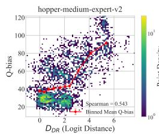

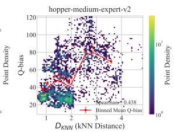

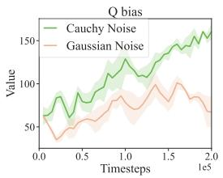

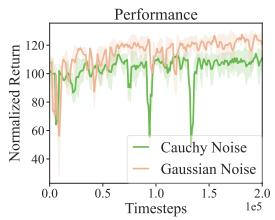  
Figure 2: Left figures: The non-uniform distribution shift contributes to heavy-tailed Q bias. The Q bias of online samples often increases as their distance (DKNN, DDR) from offline data distribution grows. Right figures: Validation of the instability caused by heavy-tailed Q biases. Heavy-tailed Cauchy noise causes greater training instability and lower performance.

The heavy-tailed Q bias could induce instability during the onlinefine-tuning process. When Q bias exhibits high heavy-tailedness, the back propagation of Q-learning amplifies these extreme biases over time, exacerbating this issue. Additionally, large Q biases result in inaccurately estimated Q-values, which may cause Q-value estimation collapse (Zhang et al., 2024). As a result, additional training steps are required to correct these inaccuracies, resulting in inefficient performance improvement. Furthermore, existing O2O RL methods often rely on the $l _ { 2 }$ loss function for Q-value updates. This reliance may cause heavy-tailed Q biases to disproportionately influence the Q-value loss and dominate the update gradients, further destabilizing Q-value updates.

We also validate the issues caused by the heavy-tailed Q bias through experiments. For approximating the heavy-tailed Q bias, we incorporate heavy-tailed noise into the estimated Q-values during Q-value updates. Specifically, for a fair comparison, we respectively introduce Gaussian noise and heavy-tailed Cauchy noise, both with the same mean and variance, into two agents from the same pretrained one. The results in Figure 9 show that the heavy-tailed Cauchy noise leads to more inaccuracies in Q-value estimation and lower final performance. See details in Appendix A.4.

It is necessary to take into account the heavy-tailed Q bias in Q-value estimation. Previous research mainly focuses on reducing the mean or variance of Q bias, neglecting its underlying distributional characteristics. For instance, Cal-QL (Nakamoto et al., 2023) employs conservative Qlearning to decrease positive Q bias. ENOTO (Zhao et al., 2024) introduces ensemble models with SUNRASE (Lee et al., 2021a) to reduce the mean and variance of Q bias. However, as results shown in Figure 5 and 6, while these methods can effectively reduce the mean of Q bias, they still struggle to decrease its variance, and the kurtosis values remain high. This phenomenon highlights that existing methods still struggle to mitigate heavy-tailed Q biases and reduce their impact. Therefore, it is crucial to address these biases in Q-value estimation to enhance training stability.

In summary, in offline-to-online RL, the Q bias exhibits high heavy-tailedness in online data during fine-tuning, regardless of whether the Q-value is overestimated or underestimated. These heavytailed Q biases arise from the non-uniform distribution shift and cause Q-value estimation to oscillate, further resulting in training instability and slow performance improvement. Therefore, it is essential to take into account the distribution of Q bias and enhance the training stability of agents under these heavy-tailed Q biases for stable fine-tuning.

## 4 METHOD

In Section 4.1, we introduces an adaptive noise following a Laplace distribution to explicitly capture the heavy-tailed nature of Q-value biases, improving Q-value estimation. We propose a robust O2O approach in Section 4.2 and provide a theoretical analysis for its effectiveness in Section 4.3.

## 4.1 LAPLACE-BASED Q BIAS DISTRIBUTION FOR Q-VALUE ESTIMATION

In robust regression research (Song et al., 2014; Lu & Chang, 2022), a promising approach to handle non-normal error distributions is modeling each error distribution as a Laplace distribution, which is known for its ability to model data with outliers and connection with the robust regression criteria.

Inspired by aforementioned approaches, we introduce an independent approximation noise term using the Laplace distribution to explicitly capture the heavy-tailed characteristic of Q bias. Then, we incorporate the Laplace-based noise into the Q-value loss for robust Q-value estimation.

Adaptive Laplace-distributed noise modeling for heavy-tailed Q bias. To facilitate the analysis of estimation bias, we begin with the assumption for the noise term following (Duan et al., 2021):

Assumption 4.1 For each $( s , a )$ pair, $\mathcal { Q } ( s , a )$ is the true but unknown Q-value, $\varepsilon _ { \hat { \theta } }$ and εθ are independent random variables, which denote the approximation noise in target Q-value and estimated Q-value respectively. The approximation noise is assumed to be independentfrom the $( s , a )$ and θ. Then we have:

$$
\begin{array}{r} \mathcal {T} Q _ {\theta} (s, a) = R (s, a) + \gamma \mathbb {E} _ {s ^ {\prime} \sim T (\cdot | s, a)} \left[ m a x _ {a ^ {\prime}} Q _ {\hat {\theta}} (s ^ {\prime}, a ^ {\prime}) \right] \\ \mathcal {Q} (s, a) = \mathcal {T} Q _ {\theta} (s, a) + \varepsilon_ {\hat {\theta}} \qquad \mathcal {Q} (s, a) = Q _ {\theta} (s, a) + \varepsilon_ {\theta} \end{array}\tag{2}
$$

The noise characterizes the discrepancy between true Q-values and their estimates, arising from system noises and function approximation (Duan et al., 2021). Based on the definition of Q-value bias, Bias $( Q _ { \theta } ( s , a ) ) = \mathbb { E } [ Q _ { \theta } \bar { ( s , a ) } ] - \mathcal { Q } ( s , a )$ , we obtain the relationship Bias $( Q _ { \theta } ( s , a ) ) = - \mathbb { E } [ \varepsilon _ { \theta } ]$ Then, to better capture the heavy-tailed Q bias, we model the noise using the Laplace distribution as follows, and update it adaptively.

Assumption 4.2 (Laplace-based noise). $\varepsilon _ { \hat { \theta } }$ and $\varepsilon _ { \theta }$ follow Laplace distributions with the same mean $\mu , i . e . , \varepsilon _ { \hat { \theta } } \sim \mathrm { L a p l a c e } ( \mu , b _ { 1 } ) , \varepsilon _ { \theta } \sim \mathrm { L a p l a c e } ( \mu , b _ { 2 } ) , \mu \in \mathbb { R } , b _ { 1 } , b _ { 2 } \in \mathbb { R } ^ { + }$

Here, $\mu$ is the mean parameter and b is the scale parameter. Specifically, larger values of b correspond to heavier tails and higher variance in the Laplace-based noise. We introduce the adaptive updates of noise in next section. Based on the assumption above, we can derive the Laplace-based likelihood of $\mathcal { Q } ( s , a )$ given $Q _ { \theta } ( s , a )$ , and the Laplace-based likelihood of $\mathcal { Q } ( s , a )$ given ${ \mathcal { T } } Q _ { \theta } ( s , a )$

$$
\begin{array}{c} q \Big (\mathcal {Q} (s, a) \big | Q _ {\theta} (s, a); \theta \Big) = \frac {1}{2 b _ {2}} \exp \left(- \frac {| \mathcal {Q} (s , a) - Q _ {\theta} (s , a) - \mu |}{b _ {2}}\right) \\ p \left(\mathcal {Q} (s, a) \Big | \mathcal {T} Q _ {\theta} (s, a); \hat {\theta}\right) = \frac {1}{2 b _ {1}} \exp \left(- \frac {| \mathcal {Q} (s , a) - \mathcal {T} Q _ {\theta} (s , a) - \mu |}{b _ {1}}\right) \end{array}\tag{3}
$$

The Laplace likelihood incorporates the distributional information of Q bias for robust Q-value updates. Then, we discuss how to update the Q-value network and how to reduce the impact of extreme biases under the Assumption 4.2. Since the likelihood $p \left( \mathcal { Q } ( s , a ) \mid \mathcal { T } Q _ { \theta } ( s , a ) \right)$ incorporates true environmental return information (i.e., future rewards), it serve as a closer approximation to the Bayes-optimal posterior $( \mathrm { i . e . , } \ p ( \mathscr { Q } _ { \theta } ( s , a )$ |all environmental evidence)), compared with the $q \left( \mathcal { Q } ( s , a ) \ | \ Q _ { \theta } ( { s } , a ) \right)$ . We explain this process in detail at Appendix B.2. Therefore, we can train Q-network by minimizing the Kullback-Leibler (KL) divergence between likelihoods of the true Q-value, i.e., $\mathbf { \bar { \boldsymbol { p } } } \left( \mathcal { Q } ( \mathcal { s } , a ) \mid \mathcal { T } \boldsymbol { Q } _ { \theta } ( \mathcal { s } , a ) \right)$ ) and $q \left( \mathcal { Q } ( s , a ) \mid Q _ { \theta } ( s , \mathbf { \bar { a } } ) \right)$ ).

Given a dataset $\mathcal { D } = \{ ( s _ { i } , a _ { i } , s _ { i } ^ { \prime } , r _ { i } ) \} _ { i = 0 } ^ { N } ,$ the Q-value network $Q _ { \theta _ { t } }$ and the target Q-network $Q _ { \hat { \theta } _ { t } }$ at the t-th training step, we can estimate $\theta _ { t + 1 }$ as Equation 4:

$$
\theta_ {t + 1} = \arg \min _ {\theta} \sum_ {i = 0} ^ {N} D \left(p \left(\mathcal {Q} (s _ {i}, a _ {i}) \mid \mathcal {T Q} _ {\theta_ {t}} (s _ {i}, a _ {i})\right) \| q \left(\mathcal {Q} (s _ {i}, a _ {i}) \mid Q _ {\theta_ {t}} (s _ {i}, a _ {i})\right)\right)\tag{4}
$$

By integrating over all values of $\mathcal { Q } ( s _ { i } , a _ { i } )$ , the KL divergence can be transformed as Equation (5). See proof in Appendix B.2. Based on the Bellman equation, the Q-network progressively approximate the true Q-value.

$$
\begin{array}{l} D _ {K L} \bigg (p \Big (\mathcal {Q} (s _ {i}, a _ {i}) \big | \mathcal {T} Q _ {\theta} (s _ {i}, a _ {i}) \Big) \Big \| q \Big (\mathcal {Q} (s _ {i}, a _ {i}) \big \| Q _ {\theta} (s _ {i}, a _ {i}) \Big) \bigg) \\ = \frac {b _ {1} \exp \left(- \frac {| \mathcal {T} Q _ {\theta} (s _ {i} , a _ {i}) - Q _ {\theta} (s _ {i} , a _ {i}) |}{b _ {1}}\right)}{b _ {2}} + \frac {| \mathcal {T} Q _ {\theta} (s _ {i} , a _ {i}) - Q _ {\theta} (s _ {i} , a _ {i}) |}{b _ {2}} + \log \frac {b _ {2}}{b _ {1}} - 1 \end{array}\tag{5}
$$

We now discuss how the KL divergence addresses the issue of heavy-tailed Q bias, leading to a more robust training process. When using a Laplace likelihood $q ( \mathcal { Q } ( s , a ) \mid Q _ { \theta } ( s , a ) )$ ), the resulting negative log-likelihood is proportional to $| \mathcal { Q } ( \dot { s } , a ) - Q _ { \theta } ( s , a ) |$ , which grows linearly rather than quadratically with the Q bias. This down-weights outliers and drives optimization using the central mass of the Q bias, rather than being influenced by rare, extreme biases in the tails.

The Laplace likelihood also better preserves the distributional information of Q bias compared to other robust functions $( \mathrm { e } . \mathrm { g } , l _ { 1 }$ loss). If the heavy-tailed bias in bellman target is ignored, $\mathrm { i . e . }$ , the $p ( \mathcal { Q } ( s , a ) \mid \mathcal { T } Q _ { \theta } ( s , a ) )$ is a Dirac delta function centered on ${ \mathcal { T } } Q _ { \theta } ( s , a )$ , the KL divergence reduces to the negative log likelihood $- q ( \mathcal { T } Q _ { \hat { \theta } } ( s , a ) | Q _ { \theta } ( s , a ) )$ , which is exactly equivalent to applying an $l _ { 1 }$ loss under a Laplace-noise assumption. Detailed analysis is provided in Appendix B.2.

Robust Q-value lossfunction with Laplace noise modeling. We propose a robust function $D _ { b } ( x )$ in replace of $l _ { 2 }$ function for Q-value updates. Compared with Equation $5 ,$ we set $b = b _ { 1 } = b _ { 2 }$ for practical implementation with fewer hyperparameters. This setting imply states that the $\varepsilon _ { \boldsymbol { \theta } }$ and $\varepsilon _ { \hat { \theta } }$ follow the same distribution. We conduct the Mann-Whitney U test (Hettmansperger & McKean, 2010) to validate it in C.2.1. Furthermore, we show the derivatives of $D _ { b } ( x )$ even at $x = 0$ and provide its more details in B.3.

$$
D _ {b} (x) = \exp \left(- \frac {| x |}{b}\right) + \frac {| x |}{b} - 1\tag{6}
$$

Finally, we demonstrate the robustness of $D _ { b } ( x )$ in the context of online fine-tuning through two properties: (1) the exponential term $\exp ( - | x | / b )$ down-weights large Q-value losses in the heavy tails, reducing their impact. (2) the gradient is bounded within the range $[ - \frac { 1 } { b } , \frac { 1 } { b } ]$ and does not increase with $x ,$ in contrast to the $l _ { 2 }$ function, where the gradient increases linearly with x. These properties validate the effectiveness of the KL divergence in Equation 4.

We observe that the robust property of $D _ { b } ( x )$ is inherently connected with the Laplace distribution: as the heavy-tailed Q biases become more frequent, the Laplace-based noise capture the heavytailedness by increasing its scale parameter, the gradient bound of $D _ { b } ( x )$ tightens. Consequently, these mechanisms alleviate heavy-tailedness of Q biases, reduce the high estimation variance with noise model, and improve training stability with $D _ { b } ( x )$ function.

## 4.2 A ROBUST O2O RL METHOD WITH LAPLACE DISTRIBUTED Q BIAS

We develop a complete O2O method with the Laplace modeling for Q bias in this section.

Adaptively Updating the Laplace-Distributed Noise with Robust Statistics. To effectively capture the heavy-tailed nature of Q biases with our Laplace noise model, it must adapt to the changing distribution of these biases during online fine-tuning. This requires continuously updating the parameters of the Laplace distribution, particularly the scale (variance) parameter b. However, estimators of unbiased sample variance are highly sensitive to kurtosis and unreliable in the presence of significant outliers (Yuan et al., 2005). Robust variance estimators that account for kurtosis have been proposed in prior work (Searls & Intarapanich, 1990; Wencheko & Chipoyera, 2009). Among these, we adopt the MSE-best biased estimator (MBBE) (Wencheko & Chipoyera, 2009), defined as follows.

Lemma 4.3 (MBBE of variance). $s ^ { 2 }$ is the unbiased sample variance $\begin{array} { r } { s ^ { 2 } = \frac { 1 } { n - 1 } \sum _ { i = 1 } ^ { n } ( X _ { i } - \bar { X } ) ^ { 2 } } \end{array}$ n is the sample size and κ is the population kurtosis. Then, MSE-best biased estimator $s _ { \omega } ^ { 2 }$ is:

$$
s _ {\omega^ {*}} ^ {2} = \left(\frac {\kappa}{n} + \frac {n + 1}{n - 1}\right) ^ {- 1} s ^ {2}\tag{7}
$$

In practice, the true Q biases are not accessible during training. We use the readily available TDerror as a statistical surrogate to approximate the variance of Q-bias. This surrogate is reasonable for variance approximation, because we have $\mathcal { T } Q _ { \hat { \theta } } ( s , a ) - Q _ { \theta } ( s , a ) = \big ( \mathcal Q ( s , a ) - \bar { \varepsilon _ { \hat { \theta } } } \big ) - \big ( \mathcal Q ( s , a ) - \varepsilon _ { \theta } \big ) =$ $\varepsilon _ { \theta } - \varepsilon _ { \hat { \theta } }$ under Assumption 4.1. Then the variance of TD-errors twice the variance of Q bias. We then compute the scale parameter using the MBBE of the TD-errors within a batch $( b = s _ { w ^ { * } } / \sqrt { 2 } )$ . Our empirical experiments confirm that the scale parameter b estimated from TD-errors closely tracks the one estimated from true Q biases, as shown in Figure 17. Crucially, we can adaptively update our noise model to capture the heavy-tailedness of Q bias and improve Q-value estimation according to Section 4.1.

Re-centering Heavy-Tailed Q Bias through Ensemble Models. In our empirical analysis, we observed that large-magnitude Q biases in the heavy tails persist under standard training. To mitigate this, we adopt ensemble models known for effectively reducing estimation bias, and compute the target Q-value by taking the minimum over a random subset of Q-function estimators (Chen et al., 2021). This strategy effectively reduces highly positive biases and re-centers the Q bias distribution because: (1) different Q-functions are approximately independent, positive errors and negative errors are independently sampled across different heads. (2) the probability of selecting the most overoptimistic head is reduced. Then, we integrate the ensemble model with $D _ { b } ( x )$ and derive the loss function for robust Q-value estimation as Equation 8, where K is the ensemble size and M is the subset size.

$$
\begin{array}{l} \mathcal {L} _ {b} (\theta_ {t}) = \mathbb {E} _ {(s, a, r, s ^ {\prime}) \sim \mathcal {B}} \left[ \frac {1}{K} \sum_ {k = 1} ^ {K} D _ {b} \Big (Q _ {\theta_ {t}} ^ {(k)} (s, a) - y _ {\min} (s, a, r, s ^ {\prime}) \Big) \right] \\ y _ {\min} (s, a, r, s ^ {\prime}) = r + \gamma \max _ {a ^ {\prime} \in \mathcal {A}} \left[ \min _ {1 \leq k \leq M} Q _ {\hat {\theta} _ {t}} ^ {(k)} (s ^ {\prime}, a ^ {\prime}) \right]. \end{array}\tag{8}
$$

LAROO mainly consists of two components: the noise model and the ensemble models, which together tackle heavy-tailed biases through two primary effects: (1) By selecting a lower Q-value from the ensemble models, LAROO explicitly re-centers the Q bias distribution, shifting its mean towards zero and mitigating the strong overestimation introduced by large Q biases. (2) Based on the Laplace-based noise model, LAROO alleviates the heavy-tailed Q biases and reduces their impact with robust function $D _ { b } ( x )$ on training stability, as discussed in Section 4.1.

In summary, LAROO transforms the poorly-behaved, heavy-tailed Q-bias distribution into a more standardized form during Q-value updates. As a result, LAROO effectively reduces the estimation variance and mitigates heavy-tailed Q biases, improving training stability and efficiency without the need for exploration constraints under distribution shifts. Additionally, we compare it with the standard batch normalization in Appendix B.7 and summarize the complete framework of LAROO in Algorithm 1.

## 4.3 THE THEORETICAL ANALYSIS

We further provide a theoretical analysis to prove that LAROO can reduce estimation bias compared with the $l _ { 2 }$ loss function for Q-value updates. We begin to introduce the estimate bias in single update step, following prior research (Duan et al., 2021). For simplicity, we denote the greedy target $\begin{array} { r } { \hat { R ( s , a ) } + { \hat { \gamma } \mathbb { E } _ { s ^ { \prime } \sim T ( \cdot | s , a ) } } \left[ \operatorname* { m a x } _ { a ^ { \prime } } Q _ { \hat { \theta } } \left( s ^ { \prime } , a ^ { \prime } \right) \right] } \end{array}$ as y. Conventionally, the Q-value network $Q _ { \theta }$ is updated by minimizing the mean square loss $\left( y - Q _ { \theta } ( s , a ) \right) ^ { 2 } / 2$ using gradient descent methods, resulting in $Q _ { \theta _ { n e w } }$ . Then, the post-update Q-value $Q _ { \theta _ { n e w } } ( s , a )$ can be approximated by linearizing around $\theta _ { n e w }$ using Taylor’s expansion, as shown in Equation 9, where $\bar { \boldsymbol { \beta } }$ is the learning rate and is sufficiently small.

$$
\theta_ {n e w} = \theta + \beta (y - Q _ {\theta} (s, a)) \nabla_ {\theta} Q _ {\theta} (s, a)\tag{9}
$$

$$
Q _ {\theta_ {n e w}} (s, a) \approx Q _ {\theta} (s, a) + \beta \big (y - Q _ {\theta} (s, a) \big) \| \nabla_ {\theta} Q _ {\theta} (s, a) \| _ {2} ^ {2}
$$

Similarly, let $\theta _ { i d }$ represent the ideal post-update parameter obtained based on true target $\tilde { y } \ =$ $R ( s , a ) \dot { + } \gamma \mathbb { E } _ { s ^ { \prime } } \bigl [ \operatorname* { m a x } _ { a ^ { \prime } } \mathcal { Q } ( s ^ { \prime } , a ^ { \prime } ) \bigr ]$ , and we can approximate the ideal post-update Q-value $\bar { Q _ { \theta _ { i d } } } ( { \boldsymbol s } , { \boldsymbol a } )$ as:

$$
Q _ {\theta_ {i d}} (s, a) \approx Q _ {\theta} (s, a) + \beta (\tilde {y} - Q _ {\theta} (s, a)) \| \nabla_ {\theta} Q _ {\theta} (s, a) \| _ {2} ^ {2}\tag{10}
$$

Then, in expectation, we can define the single-step estimation bias of the $l _ { 2 }$ update, denoted as:

$$
\Delta_ {l _ {2}} (s, a) = \mathbb {E} _ {\varepsilon_ {\hat {\theta}}} \left[ Q _ {\theta_ {n e w}} (s, a) - Q _ {\theta_ {i d}} (s, a) \right] \approx \beta \big (\mathbb {E} _ {\varepsilon_ {\hat {\theta}}} [ y ] - \tilde {y} \big) \| \nabla_ {\theta} Q _ {\theta} (s, a) \| _ {2} ^ {2}
$$

where $\varepsilon _ { \hat { \theta } }$ is the approximation noise in target $y .$ . Moreover, previous research (Duan et al., 2021; Hasselt, 2010) has verified that the estimate Q-value is usually overestimated due to the max operator and it is clear that: $\mathbb { E } _ { \varepsilon _ { \hat { \theta } } } [ y ] - \tilde { y } \geq 0 , \quad \Delta _ { l _ { 2 } } ( s , a ) \geq 0$

Building on definitions above, we now demonstrate the robustness of LAROO in Q-value estimation. When the Q-value network is updated with $D _ { b } ( x )$ function, the following theorem holds:

Theorem 4.4 When $b > 1$ , the single-step estimation bias ofpost-update $Q \mathrm { . }$ -value $Q _ { \theta _ { n e w } }$ withfunction $D _ { b } ( x )$ is smaller than that with $l _ { 2 }$ loss function, i.e., $\Delta _ { D _ { b } } < \Delta _ { l _ { 2 } }$

Table 1: Normalized returns before and after the online fine-tuning. Each result is averaged with five seeds. $\delta _ { \mathrm { s u m } } ( 0 . 1 \mathrm { M } )$ denotes the sum of performance improvement on all tasks within 0.1M steps. The best results are highlighted in bold, while the second-best results are underlined. The gray ”offline” refers to the offline performance of both BOORL and LAROO, which use the same offline backbones. Please refer to Appendix C.2.2 for more results and training curves.

<table><tr><td>Task</td><td>Type</td><td>PEX</td><td>SO2</td><td>Cal-QL</td><td>ENOTO</td><td>Offline</td><td>BOORL</td><td>LAROO</td></tr><tr><td rowspan="5">Hopper</td><td>random</td><td>6.6→17.5</td><td>12.9→87.3</td><td>7.3→6.9</td><td>7.4→66.5</td><td>7.9</td><td>88.3</td><td> $100.6 \pm 10.3$ </td></tr><tr><td>medium</td><td>49.1→78.5</td><td>59.7→94.4</td><td>70.5→90.8</td><td>57.1→96.6</td><td>56.6</td><td> $\underline{102.1}$ </td><td> $106.7 \pm 2.6$ </td></tr><tr><td>medium-replay</td><td>60.0→87.5</td><td>98.9→100.3</td><td>89.2→92.8</td><td>78.2→102.7</td><td>80.5</td><td> $\underline{105.1}$ </td><td> $109.5 \pm 1.8$ </td></tr><tr><td>medium-expert</td><td>85.4→80.2</td><td>99.3→98.7</td><td> $104.9 \rightarrow \underline{108.3}$ </td><td>94.5→100.2</td><td>93.6</td><td>107.5</td><td> $112.3 \pm 0.7$ </td></tr><tr><td>expert</td><td>65.7→73.8</td><td>86.7→84.7</td><td> $106.0 \rightarrow \underline{110.0}$ </td><td>111.3→85.6</td><td>109.2</td><td>103.2</td><td> $112.0 \pm 1.3$ </td></tr><tr><td rowspan="5">Walker2d</td><td>random</td><td>7.9→37.0</td><td>4.7→20.8</td><td>9.7→1.6</td><td> $0.9 \rightarrow \underline{38.3}$ </td><td>1.5</td><td>6.4</td><td> $71.6 \pm 6.8$ </td></tr><tr><td>medium</td><td>60.5→42.5</td><td>91.7→100.6</td><td>83.3→83.7</td><td>83.6→ $\underline{110.2}$ </td><td>83.6</td><td>98.6</td><td> $120.4 \pm 2.9$ </td></tr><tr><td>medium-replay</td><td>32.8→40.5</td><td>53.7→92.0</td><td>75.1→80.7</td><td> $78.0 \rightarrow \underline{110.2}$ </td><td>76.8</td><td>104.6</td><td> $124.8 \pm 2.0$ </td></tr><tr><td>medium-expert</td><td>106.1→78.0</td><td>109.7→110.8</td><td>106.0→110.2</td><td> $110.6 \rightarrow \underline{118.0}$ </td><td>110.0</td><td>109.1</td><td> $126.7 \pm 1.0$ </td></tr><tr><td>expert</td><td>102.1→90.8</td><td>93.2→102.6</td><td>109.0→110.1</td><td> $110.0 \rightarrow \underline{120.5}$ </td><td>111.2</td><td>110.5</td><td> $128.9 \pm 2.7$ </td></tr><tr><td rowspan="5">Halfcheetah</td><td>random</td><td>15.8→39.8</td><td>29.6→62.9</td><td>19.9→12.2</td><td>9.8→82.4</td><td>10.4</td><td> $\underline{90.6}$ </td><td> $87.4 \pm 1.5$ </td></tr><tr><td>medium</td><td>48.7→55.3</td><td>71.3→84.4</td><td>47.6→52.2</td><td>48.2→84.8</td><td>47.5</td><td> $\underline{89.7}$ </td><td> $92.5 \pm 1.2$ </td></tr><tr><td>medium-replay</td><td>44.5→52.1</td><td>66.1→76.2</td><td>45.8→47.9</td><td>44.7→ $78.5$ </td><td>45.5</td><td>74.0</td><td> $84.7 \pm 1.9$ </td></tr><tr><td>medium-expert</td><td>91.4→90.3</td><td>90.6→85.6</td><td>51.3→91.2</td><td>93.8→89.8</td><td>92.6</td><td> $\underline{95.5}$ </td><td> $99.5 \pm 1.8$ </td></tr><tr><td>expert</td><td>91.9→73.4</td><td> $65.3 \rightarrow \underline{100.8}$ </td><td>85.8→93.3</td><td>97.4→89.3</td><td>96.4</td><td>93.5</td><td> $101.1 \pm 3.8$ </td></tr><tr><td> $\delta_{\text{sum}}(0.1\text{M})$ </td><td></td><td>68.7</td><td>268.7</td><td>80.5</td><td>349.4</td><td></td><td>355.4</td><td>550.4</td></tr></table>

Theorem 4.5 With Assumption 4.1 and 4.2, when $b > 1$ , the variance ofpost-update Q-value $Q _ { \theta _ { n e w } }$ with $D _ { b } ( x )$ function is smaller than that with $l _ { 2 }$ lossfunction.

We show the detailed proof in Appendix B.4 and B.5. The theorems above confirm that using $D _ { b } ( x )$ to update the Q-value, instead of the $l _ { 2 }$ function, reduces both the overestimated bias and estimation variance at each update step. This leads to a smaller accumulated bias and more robust Q-value estimation, theoretically reinforcing the effectiveness of LAROO.

## 5 EXPERIMENTS

We present experimental results to evaluate the effectiveness of LAROO. In Section 5.2, we demonstrate how LAROO significantly outperforms existing state-of-the-art O2O methods across various tasks. Finally, we conduct ablation studies to further evaluate the effectiveness of LAROO.

## 5.1 EXPERIMENT SETTING

Benchmark. We conduct our experiments on the D4RL benchmark (Fu et al., 2020), which provides various continuous control tasks and training datasets. We choose MuJoCo and the more challenging sparse-reward environment, AntMaze, as our testing tasks. We compare LAROO with several stateof-the-art baselines in O2O RL, including PEX (Zhang et al., 2023), Cal-QL (Nakamoto et al., 2023), SO2 (Zhang et al., 2024), ENOTO (Zhao et al., 2024), BOORL (Hu et al., 2024). We also compare with the RLPD (Ball et al., 2023), which effectively leverages offline datasets to train agents from scratch in online environments. We rerun these baselines with their official implementations. We provide LAROO’s codes in https://github.com/USTC-AI4EEE/LAROO.

Experimental implement details. In our experiments, we first offline pretrain agents for one million gradient steps and then online fine-tune agents for 100K steps, this training setup is also adopted by (Feng et al., 2024). For Mujoco tasks, LAROO adopts TD3BC (Fujimoto & Gu, 2021) and TD3 (Fujimoto et al., 2018) with ensemble Q-functions as the backbone algorithms for the offline and online phases, respectively. Since TD3BC cannot handle with sparse-reward tasks, LAROO uses LAPO (Chen et al., 2022) as the backbone for Antmaze tasks. These choices of backbone algorithms follow those in the ENOTO baseline (Zhao et al., 2024). Please refer to Appendix C for more details and parameter settings.

## 5.2 MAIN RESULTS

The performance of LAROO. We evaluate both the final fine-tuning performance and the performance improvement $\delta _ { s u m }$ during online fine-tuning. Each experimental result is averaged over five seeds. As shown in Table 1, LAROO achieves superior final performance and notable performance improvement compared with other O2O RL methods, with an average score improvement of +54.8% over the second-best method BOORL (Hu et al., 2024). In Figure 12, we present the online training curves of different methods in Mujoco and Antmaze tasks. It is evident that LAROO consistently exhibits significant sample efficiency and training stability across various tasks.

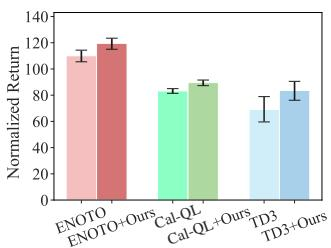

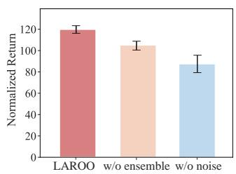

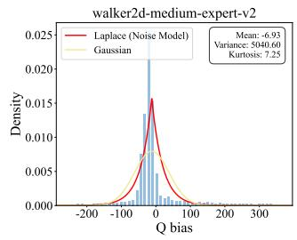  
Figure 3: (a) Normalized returns of existing O2O RL methods combining with LAROO on the walker2d tasks. (b) Ablation for components in LAROO: the performance without ensemble models or without noise model respectively in the walker2d-medium-replay task. (c) Laplace-based noise model: we plot the Laplace-based noise against the empirical Q bias.

Compatibility of LAROO with other O2O methods. To demonstrate the compatibility of LAROO with previous O2O RL methods for further performance improvement, we replace the $l _ { 2 }$ loss function in previous methods with $D _ { b } ( x )$ for Q-learning and evaluate the performance improvement. We select TD3, Cal-QL (Nakamoto et al., 2023) and ENOTO (Zhao et al., 2024) for evaluation, as these three methods exhibit varying levels of performance in O2O RL. As shown in Figure 3 (a) and Table 10, the experimental results validate that our proposed robust loss function is highly effective and can serve as a plug-in method to further enhance the performance of existing methods.

Training stability of LAROO. We evaluate training stability in O2O RL based on two metrics: (1) the variance, (2) the Normalized Cumulative Performance Drop (NCD), which quantifies the degree of performance degradation during training (Feng et al., 2024). Lower values of variance and NCD indicate better training stability. The results are shown in Table 7. Specially, LAROO generally achieves a superior balance between performance improvement and training stability.

Empirical validation for Laplace-distributed noise model. We plot the Laplace-distributed noise against the empirical Q bias, as shown in Figure 3(c) and Figure 10. We note that the Laplace assumption better fits the empirical data than the Gaussian. We further discuss the advantages and limitations of using Laplace distribution to capture heavy-tailed nature of Q bias in Appendix B.1.

## 5.3 ABLATION STUDIES

Ablationfor components of LAROO. We present distributions of Q bias without ensemble models or without the noise model, respectively, in Figure 15. Ensemble models effectively reduce overestimated Q bias, shifting its mean toward zero, but still suffers from high heavy-tailedness. The noise model alleviates heavy-tailedness of Q biases but remains prone to overestimation. By combining these two components, LAROO promotes the heavy-tailed Q bias into a more standardized form.

We further compare the contribution of ensemble models with Laplace noise model in LAROO. We assess their contributions by plotting training curves and computing related metrics. As shown in Figure 16 and Table 12, the results indicate that the Laplace noise model plays a more critical role in LAROO. Please refer to Appendix C.4 for detailed ablation studies.

Ablation for UTD ratio and ensemble size. We conduct ablation experiments for the update frequency of data (UTD) and the ensemble size. A higher UTD has been widely used for improving sample efficiency, while the ensemble of Q function can help mitigate Q bias and improve training stability in O2O RL (Zhao et al., 2024). For a fair comparison, we set the UTD = 1 and the ensemble size N = 1 in LAROO, then compare it with Cal-QL and PEX. Other baselines, which also leverage high UTD or ensemble models (i.e., BOORL, ENOTO and SO2), are excluded from the comparison. As shown in Table 10, LAROO outperforms Cal-QL in 10 out of 13 experiments, demonstrating its effectiveness even without the benefits of high UTD or ensemble models.

Ablationfor the Q-value lossfunction. We evaluate the performance with and without the proposed Q-value loss function $\mathcal { L } _ { b } ( x )$ . Additionally, we compare $\mathcal { L } _ { b } ( x )$ with other commonly used robust loss functions, such as the Huber loss and the Cauchy loss functions, which prior studies have shown to effectively handle outliers in training data (Zahra et al., 2014). The results in Table 9 demonstrate that $\mathcal { L } _ { b } ( x )$ outperforms these alternatives for better capturing these heavy-tailed Q biases.

## 6 RELATED WORK

Offline-to-online RL. Offline-to-Online RL primarily faces the challenge of a significant distribution shift between offline and online data during the fine-tuning process. This shift leads to inaccurate Q-value estimation—typically overestimated—for out-of-distribution online data, which results in performance degradation during fine-tuning (Lee et al., 2021b; Zhang et al., 2024; Zhou et al., 2025). Various strategies have been proposed to improve training stability. Specifically, some methods retain constraints from offline stage or introduce additional conservative techniques to ensure training stability. For example, Off2OnRL (Lee et al., 2021b) leverages a balanced replay buffer and utilizes pessimistic Q-ensemble networks. Cal-QL (Nakamoto et al., 2023) employs calibrated Q-learning to learn a conservative Q-value function. However, Feng et al. (2024) argue that these constrained methods improve training stability at the cost of sufficient performance improvement. FineTuneRL (Wagenmaker & Pacchiano, 2023) proposes the actor-critic alignment step to bridge the gap between online and offline Q-value learning, mitigating performance drop. Some studies (Feng et al., 2024; Zhang et al., 2024) increase the update frequency of Q-value networks to enhance Q-value estimation. ENOTO (Zhao et al., 2024) uses Q-ensemble models to reduce the Q-value estimation bias. BOORL (Hu et al., 2024) introduces a Bayesian approach to guide agent’s online fine-tuning.

Distributional modeling of Q-values. Distributional reinforcement learning aims to model and predict the full distribution of returns, for more robust and risk-sensitive decision-making (Bellemare et al., 2017; 2023). Duan et al. (2021) propose the distributional soft actor-critic (DSAC) algorithm, which learns a Gaussian distribution function of state-action returns (i.e., Q-values) to effectively mitigate Q-value overestimation. However, these methods may face incompatibility issues in O2O RL with offline pretrained models, which usually estimate Q-values in expectation rather than the full distribution (Fujimoto et al., 2018; Kumar et al., 2020). In this paper, we model the heavy-tailed Q bias with Laplace distribution instead of directly modeling the Q-values, thereby capturing the heavy-tailed characteristics ofQ bias while maintaining expected estimates ofQ-values.

Extreme Q-learning. Garg et al. (2023) apply the Gumbel distribution to estimate the maximum Q-value. This work builds on the extreme value theorem which states that the maximal values drawn from any exponential-tailed distribution follow a Gumbel distribution (Fisher & Tippett, 1928). However, the training objective of extreme Q-learning differs from that of other offline algorithms, which could disrupt well-pretrained Q-value networks during online fine-tuning.

## 7 CONCLUSION

In this paper, we focus on the Q-value estimation in online data for O2O RL. Through extensive experiments, we reveal for the first time that the Q bias follows a heavy-tailed distribution in O2O RL, a phenomenon unexplored in previous research. These heavy-tailed Q biases lead to instability and inefficiencies in performance improvement. To mitigate their influence, we propose LAROO for robust Q-value estimation. LAROO captures the heavy-tailed property with Laplace-distributed noise models, and mitigates the overestimation with conservative ensemble-based estimates. LA-ROO alleviates the heavy-tailedness of Q bias and promotes it into a standardized form, improving training stability and performance. Future work could explore more robust techniques to mitigate the heavy-tailed Q bias. We look forward to the continued development of robust O2O RL methods that improve online fine-tuning for pretrained agents. These advancements could significantly facilitate the deployment of well pretrained agents in various real world scenarios.