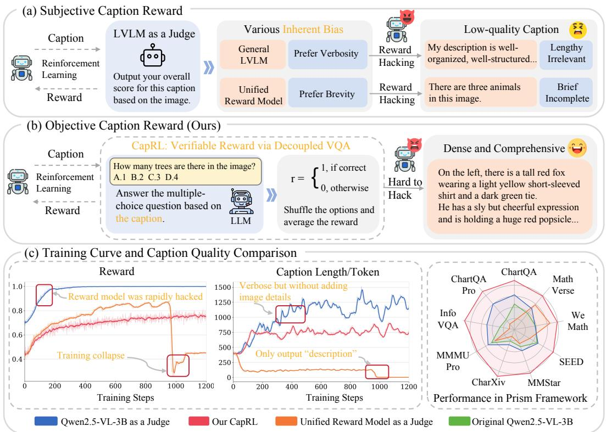
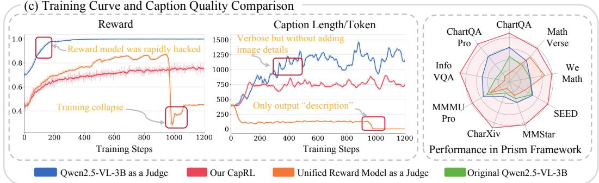
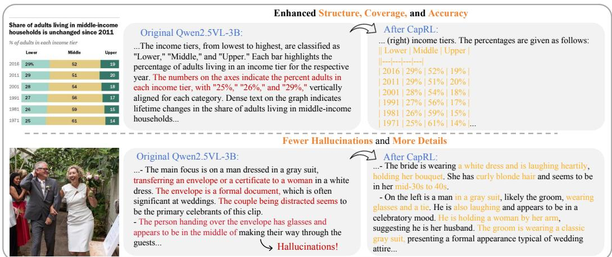
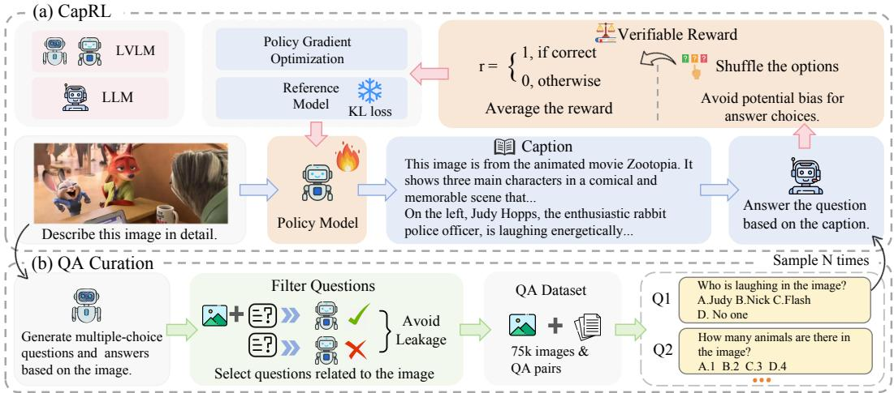
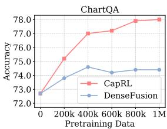
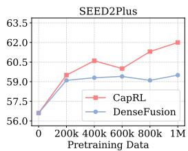
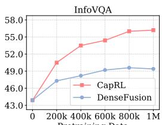
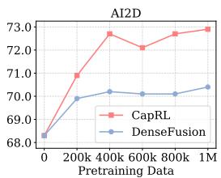
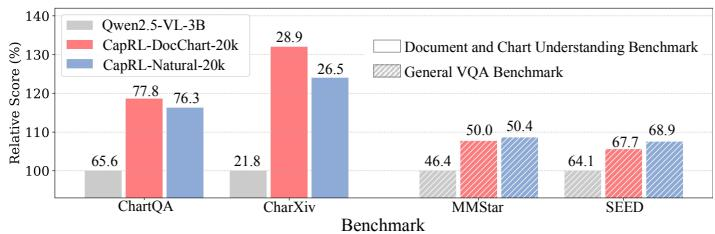
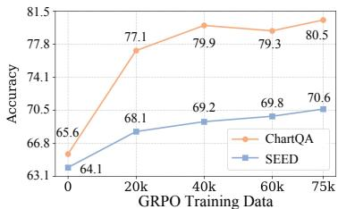

## ABSTRACT

Image captioning is a fundamental task that bridges the visual and linguistic domains, playing a critical role in pre-training Large Vision-Language Models (LVLMs). Current state-of-the-art captioning models are typically trained with Supervised Fine-Tuning (SFT), a paradigm that relies on expensive, non-scalable data annotated by humans or proprietary models. This approach often leads to models that memorize specific ground-truth answers, limiting their generality and ability to generate diverse, creative descriptions. To overcome the limitation of SFT, we propose applying the Reinforcement Learning with Verifiable Rewards (RLVR) paradigm to the open-ended task of image captioning. A primary challenge, however, is designing an objective reward function for the inherently subjective nature of what constitutes a “good” caption. We introduce Captioning Reinforcement Learning (CapRL), a novel training framework that redefines caption quality through its utility: a high-quality caption should enable a non-visual language model to accurately answer questions about the corresponding image. CapRL employs a decoupled two-stage pipeline where an LVLM generates a caption, and the objective reward is derived from the accuracy of a separate, vision-free LLM answering Multiple-Choice Questions based solely on that caption. As the first study to apply RLVR to the subjective image captioning task, we demonstrate that CapRL significantly enhances multiple settings. Pretraining on the CapRL 5M caption dataset annotated by CapRL-3B results in substantial gains across 12 benchmarks. Moreover, within the Prism Framework for caption quality evaluation, CapRL achieves performance comparable to Qwen2.5-VL-72B, while exceeding the baseline by an average margin of 8.4%. Results validate that our CapRL ef fectively trains models to produce more general and accurate image descriptions, moving beyond the limitations of traditional SFT-based image captioning models.

## 1 INTRODUCTION

The image captioning task (Karpathy & Fei-Fei, 2015; Vinyals et al., 2015), which generates a natural language description for a given image, bridges the gap between the visual and linguistic worlds. The captioning capability is fundamental to various applications, including vision-language models like CLIP (Radford et al., 2021), which learn a shared embedding space for images and text. Furthermore, captions are often a core component in the pre-training stage of Large Vision-Language Models (LVLMs) (Liu et al., 2023), where the model learns to align visual information with linguistic descriptions on a massive scale before being fine-tuned for other downstream tasks.

Given the importance of image captioning, there is a strong need for captioning models that can provide dense and accurate descriptions. Most modern captioning models Chen et al. (2024b);

  
Figure 1: (a) Existing Reward Models: Current LVLM-as-a-judge/reward models suffer from limitations like rewarding verbosity or brevity, leading to low-quality captions and reward hacking. (b) Our CapRL: CapRL uses a decoupled two-stage VQA approach to provide subjective rewards for captions. (c) CapRL’s Advantage: CapRL outperforms previous subjective reward methods, as shown by training curves and higher performance in the Prism (Qiao et al., 2024) evaluation setting.

Rotstein et al. (2024); Vasu et al. (2025) are trained based on LVLMs using Supervised Fine-Tuning (SFT). While effective, SFT requires large datasets annotated by humans or proprietary models, which are expensive and not scalable. Furthermore, image captioning is an inherently open-ended problem, where a single image can be accurately described by a wide variety of captions. Since SFT models are trained to match a single ground-truth description for each image, they tend to memorize specific answers rather than learning the underlying concepts. As a result, the SFT models become less general and struggle to generate the diverse range of valid captions possible for a single image.

The limitations of SFT have led to a recent paradigm shift in the post-training of LVLMs toward Reinforcement Learning with Verifiable Rewards (RLVR) (Lambert et al., 2024). RLVR is the paradigm that trains models by providing clear and objective reward from the verifier, such as a binary signal of correctness for mathematical reasoning (e.g., DeepSeek-R1 (Guo et al., 2025)). Unlike SFT, which teaches a model to mimic a single ground-truth response, RLVR encourages the model to generate more diverse and robust outputs that meet the verifiable criteria. Our objective is to design a powerful and scalable RLVR training paradigm for the image captioning task to generate more creative and more general variety of accurate descriptions.

However, applying RLVR to open-ended tasks like image captioning is challenging, primarily due to the difficulty of designing an objective reward function. A good caption can be subjective, with multiple valid descriptions possible for the same image. As shown in Fig. 1 (a), these early studies fail to provide accurate reward signals for RL training. Using reward models (Liu et al., 2025b; Su et al., 2025; Lu, 2025) or LLM-as-a-judge (Gunjal et al., 2025) to provide feedback is vulnerable to reward hacking. The captioning model learns to exploit weaknesses in the reward models (e.g., verbosity or brevity outputs) rather than producing a high-quality response. Moreover, it is difficult to create effective rubrics or evaluation prompts for LVLM-as-a-judge methods because captions are free-form and encode substantial information. Using reference answer as rewards (Gurung & Lapata, 2025; Yu et al., 2025) like ROUGE (Lin, 2004) and BLEU (Papineni et al., 2002) is constrained when evaluating complex and long-form captions. Fig. 1 (c) further demonstrates the limitations of previous subjective caption rewards, showing reward hacking and unstable training curves.

  
Figure 2: Illustration of the captioning capability improvement CapRL brings to Qwen2.5-VL-3B.

To design the objective RLVR reward function for the subjective image captioning task, we introduce a novel perspective, where a caption’s quality is proportional to its utility. When the image caption is detailed and accurate, a text-based LLM that can’t directly “see” the image can still answer Visual Question Answering (VQA) questions about the image. For example, for the question “What color is the frisbee?”, the LLM finds the phrase “red frisbee” in the caption and correctly answers “red.” Driven by this motivation, we present an effective decoupled two-stage pipeline, dubbed as Captioning Reinforcement Learning (CapRL), as shown in Fig. 1 (b). Specifically, the reward of our CapRL framework is determined by how well a caption generated by an LVLM enables a separate non-visual LLM to answer Multiple-Choice Questions (MCQs) about the source image. The LLM’s resulting accuracy serves as the objective reward for the RLVR training. To ensure the high-quality MCQs data that present enough knowledge required for VQA has been examined, we also developed a specific QA curation pipeline. The images are sampled from various sources, including natural images, charts, and documents. The questions and answers are filtered to ensure the questions can only be answered by analyzing the image content itself.

We conduct a comprehensive evaluation of the significant benefits brought by CapRL. From a qualitative perspective, as shown in Fig. 2, applying the CapRL framework to Qwen2.5-VL-3B makes its outputs more well-organized and accurate. Further illustrative cases for various charts, infographics, or natural images can be found in Appendix A. From a quantitative perspective: (i) We employ CapRL-3B to annotate the CapRL-5M caption dataset, and LVLM pretraining on this dataset yields substantial improvements across 12 benchmarks. (ii) Furthermore, using the Prism Framework (Qiao et al., 2024) for caption quality evaluation, we observed that CapRL-3B remarkably achieves performance comparable to the 72B model, and outperforms the baseline by an average margin of 8.4%. These results demonstrate that our CapRL framework, by leveraging objective reward design as a reliable optimization signal, effectively drives the model to produce dense and accurate captions.

## Our contributions are summarized as follows:

1) We contribute the first study of applying Reinforcement Learning with Verifiable Rewards for the open-ended and subjective image captioning task. Unlike traditional Supervised Fine-Tuning, which can lead to models memorizing a limited set of annotated captions, our method allows the model to explore and generate a broader range of creative and general descriptions.

2) We present CapRL, a new training paradigm featuring a decoupled two-stage pipeline. The initial stage uses LVLMs to generate rich and accurate captions. Subsequently, the second stage evaluates caption quality by using a vision-free LLM to perform the QA task. We also created a specific QA curation pipeline to ensure the quality of the questions and answers used for the second stage.

3) We carry out extensive experiments to verify the effectiveness of CapRL. Notably, both in the LVLM Pretraining setting for modality alignment and the Prism setting for caption informativeness evaluation, CapRL consistently exhibits superior performance compared to the baselines.

  
Figure 3: Overview of CapRL. Unlike the standard single-stage RLVR, our CapRL performs a decoupled two-stage process. Captions generated by the LVLM, paired with curated MCQs (b), are used to query an LLM, whose resulting accuracy becomes the objective reward for the LVLM (a). Our CapRL offers a scalable framework for applying RLVR to the open-ended image captioning task.

## 2 RELATED WORK

Image Captioning. Early Large-scale image–text corpora (Schuhmann et al., 2022; Changpinyo et al., 2021; Thomee et al., 2016) have driven vision–language pretraining. To scale and improve captions, researchers design advanced captioning pipelines: BLIP-LAION (Li et al., 2022) generates short synthetic captions, LaCLIP (Fan et al., 2023) uses ChatGPT to rewrite them, and CapsFusion (Yu et al., 2024) consolidates and refine information with fine-tuned models. Besides, there are many research projects which use GPT-4V and human-in-the-loop pipelines to produce richer, fine-grained annotations such as ShareGPT4V (Chen et al., 2024b) and ALLaVA (Chen et al., 2024a). Recent studies (Li et al., 2024; Sun et al., 2024) have explored multi-expert approaches to compensate for LVLM limitations. In summary, some works rely on complex pipelines with multiple models, training-free but costly at inference, while others require lots of expensive labeled data for SFT. In contrast, our CapRL achieves strong performance with remarkable data efficiency through RLVR.

Reinforcement Learning with Verifiable Rewards (RLVR). RLVR (Lambert et al., 2024) represents a promising paradigm for training Large Language Models (LLMs) to tasks that have an objective, easily verifiable reward signal. For example, in mathematical problem-solving, the reward can be a binary signal of correctness (Shao et al., 2024), and for code generation, it can be whether the code passes unit tests (Team et al., 2025). Compared to the traditional Supervised Fine-Tuning (SFT), RLVR offers a more robust and scalable approach. While SFT trains models to imitate a set of provided ground-truth answers, often leading to models that memorize specific phrasings (Chu et al., 2025), RLVR encourages the model to explore and discover optimal solutions. This is particularly beneficial for problems with multiple valid answers or reasoning paths.

## 3 METHODOLOGY

An overview of our CapRL is shown in Fig. 3. The CapRL framework consists of a novel, decoupled two-stage process. In the first stage, an LVLM generates a caption for an input image. In the second stage, this caption, along with a series of MCQs, is provided as input to an LLM. In the following, we will describe how to apply RLVR on the image captioning task via our CapRL in Section 3.1. Then we use the model trained with CapRL to construct the CapRL-5M dataset in Section 3.2.

## 3.1 CAPRL

The design of the reward function is a pivotal factor in the success of RLVR-based approaches, since the reward function directly guides the optimization direction of the policy model. Although designing reward functions for objective tasks (Shao et al., 2024; Liu et al., 2025c; Luo et al.,

2025) is straightforward, developing the reward function for the subjective image captioning task is challenging. While reward models (Liu et al., 2025b; Su et al., 2025; Lu, 2025) or the “LLM-as-ajudge” approach (Gunjal et al., 2025) have been explored for RL training on open-ended tasks, these models are still vulnerable to exploitation in captioning task, primarily owing to their intrinsic biases, which may unintentionally encourage the captioning model to produce verbose or brief results.

To design a reliable verifiable reward module, we leverage a perception-reasoning decoupled VQA task as a proxy to evaluate the quality of captions. The overall process of our proposed method CapRL, is illustrated in Fig. 3. During the GRPO training process, an image and an instruction are first provided as input to the policy model to sample a set of candidate captions. Each caption is then paired with corresponding questions and fed to a Large Language Model (LLM). We assign each caption a reward score based on the accuracy of answers generated by the LLM. Subsequently, we calculate the mean and variance of rewards across the group to derive the advantage for each caption. To ensure training stability, and consistent with the original GRPO framework, we incorporate a KL-divergence penalty. The policy model is then updated via policy gradient optimization.

To prepare the data for GRPO training, we constructed a VQA dataset composed exclusively of multiple-choice questions. This multiple-choice format facilitates the computation of verifiable rewards. Throughout this curation process, we utilized an LVLM to filter the data and prevent data leakage. Further details regarding our reward design and QA curation are provided below.

Reward Design. Specifically, given an instruction and an image, the policy model $\mathcal { M } _ { V }$ generates a set of captions $\{ c _ { 1 } , c _ { 2 } , \ldots , c _ { G } \}$ . Each caption is then paired with questions related to the image and passed to a large language model (LLM), denoted as $\mathcal { M } _ { L } .$ , for answering. Since the $\mathcal { M } _ { L }$ does not have access to the image directly, its ability to answer the question correctly depends entirely on how comprehensive and accurate the caption is. Captions that include more relevant objects and detailed descriptions, are more likely to provide the necessary information for the LLM to answer a question correctly. In contrast, less informative captions are more likely to lead to incorrect answers. Since LLMs exhibit high stability in answering multiple-choice questions, and the evaluation of their responses only requires exact matching, the accuracy of the LLM’s responses can therefore serve as a reliable indicator of caption quality. This question-answering process can be formulated as:

$$
a _ {m} = \mathcal {M} _ {L} (c _ {i}, q _ {m}),\tag{1}
$$

where $q _ { m }$ denotes the m-th question associated with current image I, and $a _ { m }$ is the LLM’s answer to that question. Then the reward for a single question is computed using a simple exact-match criterion:

$$
r (a _ {m}) = \left\{ \begin{array}{l l} 1, & \text { if } a _ {m} = \mathrm{GT} _ {m}, \\ 0, & \text { otherwise }. \end{array} \right.\tag{2}
$$

Here, $\mathrm { G T } _ { m }$ is the ground-truth answer to question $q _ { m }$

To eliminate potential bias in the LLM’s preference for specific answer choices, we randomly shuffle the options each time a question is presented. Additionally, relying on a single answer to evaluate a caption lacks robustness. To ensure the stability of caption scoring, we sample N times from all the questions related to the image and let $\mathcal { M } _ { L }$ answer them independently. The final reward for a caption is computed as the average accuracy over these N sampled questions. Formally:

$$
R _ {c _ {i}} = \frac {1}{N} \sum_ {k = 1} ^ {N} r \Big (\mathcal {M} _ {L} \big (c _ {i}, \mathrm{Shuffle} (q _ {m _ {k}}) \big) \Big), \quad m _ {k} \sim \{1, \ldots , M \}.\tag{3}
$$

Here, M denotes the number of questions associated with the current image $I .$ Since we compute the caption reward directly from the original caption, there is no need to perform intermediate reasoning steps as in DeepSeek-R1, which first carries out a thinking process before formatting an answer. As a result, our method avoids the need for any format-specific rewards and retains a clean, flexible reward computation process that fully respects the free-form nature of the policy model’s output. It is important to note that, in our GRPO training setup, Qwen2.5-3B-Instruct is used as $\mathcal { M } _ { L }$ by default, which makes the overall training highly efficient.

QA Curation. To train CapRL effectively, a high-quality VQA dataset $( q , a )$ with question $q$ and answer a is required to provide reliable reward signals. We construct this VQA dataset using a structured three-stage curation pipeline. (1) Image Collection. We begin by sourcing diverse images from the web and existing open-source datasets, including natural scenes, charts, and documents, to maximize variety. (2) QA Generation. For each image, we then use Qwen2.5-VL-72B (Bai et al., 2025) to automatically generate multiple question-answer pairs. (3) QA Filtering. Finally, we implement a stringent QA filtering process to ensure the quality of the generated QA pairs. The QA filtering stage is to verify that all questions are strictly visually-grounded and answerable exclusively through analysis of the image content. The final QA filtering stage is crucial to prevent information leakage and guarantees that the model must perform true visual understanding, rather than relying on external knowledge or cues within the question itself to answer the generated questions.

Specifically, the filtered set of QA pairs, denoted as $\mathcal { Q } ,$ is then defined as:

$$
\mathcal {Q} = \{(q, a) \in \mathcal {D} \mid \mathcal {M} _ {V _ {f}} (q, I) = a \wedge \mathcal {M} _ {V _ {f}} (q) \neq a \},\tag{4}
$$

where $( q , a )$ is a question-answer pair from the initial generated dataset D, I is the corresponding input image, $\mathcal { M } _ { V _ { f } }$ is the LVLM used in QA Filtering, $\mathcal { M } _ { V _ { f } } ( q , I )$ represents the answer generated when conditioned on both the question q and the image I, and $\mathcal { M } _ { V _ { f } } ( q )$ is the answer generated when the image is omitted. According to Eq. (4), the QA filtering step ensures that each selected QA pair requires the image context to be answered correctly. To manage computational costs effectively, the QA filtering step is performed using the Qwen2.5-VL-3B model (Bai et al., 2025) as $\mathcal { M } _ { V _ { f } }$

After filtering, we retain approximately 75k images along with their corresponding QA pairs to train the CapRL captioning model. Please refer to Appendix E and H for the curation details.

## 3.2 CAPRL-5M DATASET

By employing our carefully designed CapRL training scheme, we obtained CapRL-3B, and further used this powerful captioner to annotate 5M images, ultimately forming CapRL-5M.

Image Collection and Processing. In collecting images, we primarily considered diversity, quality, and safety. Among the currently high-quality open-source image datasets, ShareGPT4V-1M (Chen et al., 2024b) and DenseFusion-1M (Li et al., 2024) are relatively large in scale. Since both datasets have already undergone extensive filtering and clustering to ensure image quality, we directly incorporated all images from them. To further enhance dataset diversity, we also gathered a large number of images from the web, spanning natural photographs, documents, charts, and user interfaces. However, the quality of web images is highly uneven, and they pose potential safety risks, which could severely impact both model training and deployment safety. To address this, we applied rigorous filtering and ultimately retained 3M high-quality images. Combined with the two open-source datasets, this yielded a total of 5M images. The detailed filtering process is described in Appendix G.

Caption Model selection. In typical multimodal pretraining scenarios, the pretraining dataset often requires a massive number of image-text pairs, making annotation costs substantial. Considering practical applications, we decide to train a highly lightweight yet powerful captioner to keep annotation costs more acceptable. Specifically, we initialize the policy model with Qwen2.5-VL-3B and employ our CapRL framework, resulting in the powerful CapRL-3B model as the captioner.

## 4 EXPERIMENTS

## 4.1 PRETRAINING SETTING

To thoroughly evaluate the quality of the CapRL-5M dataset, we conduct comprehensive comparisons with widely used caption datasets from the open-source community.

Implementation Details. In our setup, the language model is initialized with a pretrained LLM, the visual encoder with a pretrained ViT, and the MLP projector randomly, following a standard multimodal pretraining scheme. We conduct experiments under three settings: Qwen2.5-3B + Qwen2.5-ViT, Qwen2.5-7B + Qwen2.5-ViT, and InternLM2.5-7B + CLIP-ViT-L. Training follows the ShareGPT4V paradigm in three stages: Initial Alignment with BLIP-558K dataset (Li et al., 2022); Further Pretraining with diverse high-quality image-caption datasets; and SFT with Open-LLaVA-NeXT-1M (Chen & Xing, 2024). For comparison, we adopt strong baselines including Vanilla, which skips Further Pretraining, ShareGPT4V-1M, DenseFusion-1M, and CapRL-1M (randomly sampled from CapRL-5M). Detailed training details are provided in Appendix I.

Main Results. As shown in Table 1, when using CapRL-1M as the further pretraining dataset, performance on the vast majority of benchmarks surpasses both ShareGPT4V-1M and DenseFusion

Table 1: Performance comparison using different pretraining datasets. CapRL-1M significantly outperforms other datasets across all 3 settings, and further improvements are observed when scaling the data to 5M. The best results are bold and the second-best results are underlined.

<table><tr><td>Pretraining Dataset</td><td>Info VQA</td><td>Doc VQA</td><td>Chart QA</td><td>Real WorldQA</td><td>Math Vista</td><td>SEED2 Plus</td><td>MME RW</td><td>MMB</td><td>MMStar</td><td>MMVet</td><td>AI2D</td><td>GQA</td><td>Average</td></tr><tr><td colspan="14">Qwen2.5-3B + Qwen2.5-ViT</td></tr><tr><td>Vanilla</td><td>43.9</td><td>81.0</td><td>72.7</td><td>55.1</td><td>41.6</td><td>56.6</td><td>30.5</td><td>68.6</td><td>44.7</td><td>41.0</td><td>68.3</td><td>61.5</td><td>55.5</td></tr><tr><td>ShareGPT4V-1M</td><td>46.1</td><td>82.4</td><td>74.2</td><td>55.0</td><td>44.7</td><td>60.5</td><td>29.8</td><td>68.9</td><td>45.2</td><td>42.4</td><td>70.1</td><td>61.4</td><td>56.7</td></tr><tr><td>DenseFusion-1M</td><td>49.4</td><td>84.6</td><td>74.4</td><td>54.1</td><td>44.6</td><td>59.1</td><td>30.7</td><td>69.0</td><td>45.6</td><td>40.2</td><td>70.4</td><td>62.5</td><td>57.1</td></tr><tr><td>CapRL-1M</td><td>56.2</td><td>87.3</td><td>78.0</td><td>55.1</td><td>45.5</td><td>62.0</td><td>30.3</td><td>70.5</td><td>47.0</td><td>50.0</td><td>72.9</td><td>61.6</td><td>59.7</td></tr><tr><td>CapRL-5M</td><td>61.5</td><td>90.0</td><td>80.5</td><td>57.6</td><td>48.1</td><td>63.2</td><td>30.9</td><td>73.1</td><td>50.4</td><td>52.6</td><td>74.7</td><td>62.6</td><td>62.0</td></tr><tr><td colspan="14">Qwen2.5-7B + Qwen2.5-ViT</td></tr><tr><td>Vanilla</td><td>47.6</td><td>83.7</td><td>77.1</td><td>55.9</td><td>47.4</td><td>60.4</td><td>29.4</td><td>72.1</td><td>48.1</td><td>47.1</td><td>72.4</td><td>62.7</td><td>58.7</td></tr><tr><td>ShareGPT4V-1M</td><td>49.8</td><td>85.1</td><td>75.7</td><td>56.8</td><td>46.6</td><td>60.9</td><td>31.8</td><td>71.9</td><td>48.4</td><td>45.9</td><td>72.2</td><td>62.7</td><td>59.0</td></tr><tr><td>DenseFusion-1M</td><td>53.5</td><td>87.8</td><td>76.7</td><td>58.6</td><td>46.3</td><td>61.0</td><td>31.1</td><td>72.6</td><td>48.6</td><td>49.7</td><td>72.5</td><td>63.1</td><td>60.2</td></tr><tr><td>CapRL-1M</td><td>59.9</td><td>89.5</td><td>80.6</td><td>58.9</td><td>50.4</td><td>63.1</td><td>32.2</td><td>72.1</td><td>51.3</td><td>50.5</td><td>75.3</td><td>63.2</td><td>62.2</td></tr><tr><td>CapRL-5M</td><td>63.4</td><td>91.4</td><td>81.5</td><td>61.4</td><td>50.8</td><td>63.2</td><td>34.9</td><td>72.7</td><td>52.6</td><td>52.6</td><td>76.9</td><td>63.8</td><td>63.8</td></tr><tr><td colspan="14">InternLM2.5-7B + CLIP-ViT-L</td></tr><tr><td>Vanilla</td><td>37.4</td><td>73.2</td><td>68.7</td><td>56.9</td><td>44.2</td><td>58.2</td><td>30.7</td><td>70.7</td><td>47.0</td><td>43.1</td><td>71.8</td><td>64.9</td><td>55.6</td></tr><tr><td>ShareGPT4V-1M</td><td>38.9</td><td>73.8</td><td>69.8</td><td>56.3</td><td>44.8</td><td>59.9</td><td>33.2</td><td>72.6</td><td>46.2</td><td>43.3</td><td>72.7</td><td>65.0</td><td>56.4</td></tr><tr><td>DenseFusion-1M</td><td>39.3</td><td>76.4</td><td>70.8</td><td>59.7</td><td>44.5</td><td>60.3</td><td>34.1</td><td>72.2</td><td>47.9</td><td>44.0</td><td>73.7</td><td>65.5</td><td>57.4</td></tr><tr><td>CapRL-1M</td><td>43.3</td><td>80.0</td><td>75.8</td><td>58.0</td><td>49.6</td><td>62.8</td><td>34.1</td><td>73.4</td><td>50.2</td><td>46.6</td><td>76.0</td><td>65.8</td><td>59.6</td></tr><tr><td>CapRL-5M</td><td>47.0</td><td>83.5</td><td>77.7</td><td>59.7</td><td>50.4</td><td>63.5</td><td>38.9</td><td>73.7</td><td>53.3</td><td>54.3</td><td>77.6</td><td>66.3</td><td>62.2</td></tr></table>

Table 2: Ablation on image sources. We annotate the images in ShareGPT4V-1M and DenseFusion-1M using CapRL-3B, and use them respectively as pretraining datasets for comparison.

<table><tr><td>Pretraining Dataset</td><td>Info VQA</td><td>Doc VQA</td><td>Chart QA</td><td>Real WorldQA</td><td>Math Vista</td><td>SEED2 Plus</td><td>MME RW</td><td>MMB</td><td>MMStar</td><td>MMVet</td><td>AI2D</td><td>GQA</td><td>Average</td></tr><tr><td colspan="14">Qwen2.5-3B + Qwen2.5-ViT</td></tr><tr><td>Vanilla</td><td>43.9</td><td>81.0</td><td>72.7</td><td>55.1</td><td>41.6</td><td>56.6</td><td>30.5</td><td>68.6</td><td>44.7</td><td>41.0</td><td>68.3</td><td>61.5</td><td>55.5</td></tr><tr><td>ShareGPT4V-1M</td><td>46.1</td><td>82.4</td><td>74.2</td><td>55.0</td><td>44.7</td><td>60.5</td><td>29.8</td><td>68.9</td><td>45.2</td><td>42.4</td><td>70.1</td><td>61.4</td><td>56.7</td></tr><tr><td>CapRL-ShareGPT4V-1M</td><td>52.1</td><td>85.9</td><td>75.2</td><td>56.3</td><td>45.6</td><td>60.0</td><td>30.9</td><td>70.9</td><td>46.7</td><td>47.5</td><td>71.4</td><td>61.7</td><td>58.7</td></tr><tr><td>DenseFusion-1M</td><td>49.4</td><td>84.6</td><td>74.4</td><td>54.1</td><td>44.6</td><td>59.1</td><td>30.7</td><td>69.0</td><td>45.6</td><td>40.2</td><td>70.4</td><td>62.5</td><td>57.1</td></tr><tr><td>CapRL-DenseFusion-1M</td><td>55.0</td><td>87.8</td><td>77.5</td><td>56.2</td><td>44.7</td><td>62.8</td><td>32.0</td><td>71.0</td><td>46.6</td><td>49.9</td><td>72.7</td><td>62.3</td><td>59.9</td></tr></table>

1M. Specifically, under the Qwen2.5-3B + Qwen2.5-ViT setting, it exceeds DenseFusion-1M by 6.8% on InfoVQA, and outperforms by 2.7% and 3.6% on DocVQA and ChartVQA. These remarkable results indicate that CapRL-3B is effective for domains such as documents, charts, and infographics, which demand fine-grained perception and structured description. The captions in CapRL-1M are highly detailed and accurate for such image types, enabling LVLMs to achieve better modality alignment and a deeper understanding of the corresponding visual features.

CapRL-5M further demonstrates consistently superior performance across all 12 benchmarks. These results highlight the strong scaling properties of the CapRL-3B-annotated dataset: as the training data size expands from 1M to 5M, model performance continues to improve steadily. This phenomenon underscores the practical value of CapRL for multimodal pretraining, as it enables the construction of high-quality, scalable datasets at very low annotation cost.

Ablations about Image Sources. In the previous comparisons, the images used in each dataset are not identical. To better control for this variable, we fix the set of images and instead compare the effect of caption quality of different datasets under the Qwen2.5-3B + Qwen2.5-ViT setting. As shown in Table 2, we compare CapRL with ShareGPT4V-1M and DenseFusion-1M. The results demonstrate that, when using the same set of images, further pretraining with the CapRL-3B-annotated dataset enables the LVLM to outperform the baselines by more than 2%. This finding indicates that the substantial advantage of the CapRL dataset over the baselines largely stems from the superior quality of its captions, rather than from differences in image diversity.

Scaling Trend Comparison of Different Datasets. We further compare the scaling trend of CapRL and DenseFusion under Qwen2.5-3B + Qwen2.5-ViT setting. Specifically, we sample different numbers of image-caption pairs from each dataset for pretraining. As shown in Figure 4, the CapRL dataset consistently outperforms the corresponding DenseFusion dataset across various scales of pretraining data. Moreover, the overall trend indicates that this performance gap continues to widen as the data size increases. This phenomenon highlights the strong scaling properties of the CapRL dataset, thanks to its high-quality captions, LVLMs continue to benefit as the dataset size grows.

  
Pretraining Data

  
Figure 4: The scaling performance comparison between CapRL-1M and DenseFusion-1M. We use different amounts of pretraining data from the two datasets to observe the scaling trend.

Table 3: Captioning ability comparison in Prism Framework. CapRL-3B achieves comparable performance to Qwen2.5-VL-72B, and significantly surpasses existing strategies that use LVLM-asa-Judge as the reward. The best results are bold and the second-best results are underlined.

<table><tr><td>Caption Model</td><td>GRPO Trained</td><td>Chart QA</td><td>ChartQA Pro</td><td>Info VQA</td><td>MMMU Pro</td><td>Math Verse</td><td>Char Xiv</td><td>We Math</td><td>Math Vision</td><td>MMStar</td><td>SEED</td><td>MMMU</td><td>Average</td></tr><tr><td>Qwen2.5-VL-3B</td><td> $\times$ </td><td>65.6</td><td>27.1</td><td>40.2</td><td>28.6</td><td>32.8</td><td>21.8</td><td>54.4</td><td>22.6</td><td>46.4</td><td>64.1</td><td>35.1</td><td>39.9</td></tr><tr><td>Qwen2.5-VL-7B</td><td> $\times$ </td><td>74.9</td><td>35.4</td><td>56.4</td><td>30.1</td><td>36.4</td><td>24.8</td><td>57.0</td><td>23.3</td><td>50.7</td><td>67.1</td><td>37.9</td><td>44.9</td></tr><tr><td>Qwen2.5-VL-72B</td><td> $\times$ </td><td>80.2</td><td>38.0</td><td>60.8</td><td>34.1</td><td>39.9</td><td>30.7</td><td>60.2</td><td>24.5</td><td>55.0</td><td>69.3</td><td>39.4</td><td>48.3</td></tr><tr><td>UnifiedRW-as-Judge-3B</td><td> $\checkmark$ </td><td>54.9</td><td>25.1</td><td>33.6</td><td>28.1</td><td>34.6</td><td>20.4</td><td>58.2</td><td>24.5</td><td>45.4</td><td>61.2</td><td>36.3</td><td>38.4</td></tr><tr><td>Qwen2.5VL-as-Judge-3B</td><td> $\checkmark$ </td><td>71.4</td><td>34.2</td><td>49.3</td><td>29.1</td><td>33.8</td><td>22.9</td><td>54.3</td><td>24.1</td><td>47.7</td><td>64.5</td><td>36.4</td><td>42.5</td></tr><tr><td>CapRL-3B</td><td> $\checkmark$ </td><td>80.5</td><td>39.9</td><td>64.8</td><td>30.7</td><td>36.4</td><td>32.4</td><td>60.1</td><td>23.4</td><td>55.0</td><td>70.6</td><td>38.1</td><td>48.3</td></tr></table>

  
Figure 5: (Left) CapRL demonstrates strong generalization even when trained on images from a single domain. CapRL-DocChart-20k refers to training conducted solely on document or chart images, while CapRL-Natural-20k is trained exclusively on natural images. Both models achieve significant improvements over the baseline on out-of-domain benchmarks, highlighting strong generalization capability. (Right) CapRL demonstrates promising scaling performance on QA training datasets.

## 4.2 PRISM SETTING

In the previous section, we demonstrated from the pretraining perspective that captions generated by CapRL are highly beneficial for modality alignment. In this section, we directly evaluate the informativeness of the captions produced by CapRL-3B through the lens of the Decoupled VQA in Prism Framework (Qiao et al., 2024), and compare our CapRL-3B against other captioning models.

Implementation details. Similar to our caption reward design, the Prism Framework decouples VQA into two stages. In Stage 1, the captioner generates captions about the input image. In Stage 2, an LLM answers questions based solely on the generated caption. We leverage the Prism framework primarily because it can evaluate caption quality in an objective and stable manner. In our setup, we fix Stage 2 with a fine-tuned Qwen2.5-3B-Instruct as the answering LLM, ensuring that benchmark performance directly reflects the quality of captions produced by the captioner. To assess the effect of different reward designs in GRPO, we include two other baseline models: one trained with UnifiedReward-2.0-qwen-3b (Wang et al., 2025), and the other with Qwen2.5-VL-3B as the judge for caption quality evaluation. The corresponding prompts are provided in Appendix E.

Comparison with Qwen2.5-VL series. As shown in Table 3, CapRL-3B significantly outperforms both the 3B and 7B models of the Qwen2.5-VL series, achieving performance comparable to that of the 72B model. In chart and infographic understanding, CapRL-3B surpasses Qwen2.5-VL-3B by 14.9%, 12.8%, and 24.6% on ChartQA, ChartQAPro, and InfoVQA, respectively. For natural image understanding, it leads Qwen2.5-VL-3B by 9.6% and 6.5% on MMStar and SEED. These results demonstrate that GRPO training has substantially unlocked the potential of Qwen2.5-VL-3B, enabling it to fully leverage its inherent knowledge to organize all objects and their attributes within an image into comprehensive and detailed captions. As a result, its perception capability is pushed to the limit, reaching a level comparable to that of the 72B model.

Table 4: Analysis of the number of QA per image.

<table><tr><td>Caption Model</td><td>ChartQA Pro</td><td>Info VQA</td><td>MMMU</td><td>MMStar</td><td>WeMath</td><td>Avg</td></tr><tr><td>Qwen2.5-VL-3B</td><td>27.1</td><td>40.2</td><td>35.1</td><td>46.4</td><td>54.4</td><td>40.6</td></tr><tr><td>CapRL-1QA-20k</td><td>35.5</td><td>59.8</td><td>36.6</td><td>50.8</td><td>57.3</td><td>48.0</td></tr><tr><td>CapRL-2QA-20k</td><td>36.8</td><td>60.2</td><td>37.6</td><td>51.1</td><td>56.6</td><td>48.5</td></tr><tr><td>CapRL-3QA-20k</td><td>36.9</td><td>60.3</td><td>36.9</td><td>51.3</td><td>56.8</td><td>48.5</td></tr></table>

Table 5: Ablations about Sampling Rounds N.

<table><tr><td>Sampling Rounds</td><td>ChartQA Pro</td><td>Info VQA</td><td>MMMU</td><td>MMStar</td><td>WeMath</td><td>Avg</td></tr><tr><td>N=1</td><td>35.4</td><td>58.1</td><td>36.5</td><td>50.2</td><td>56.1</td><td>47.3</td></tr><tr><td>N=2</td><td>36.2</td><td>59.1</td><td>36.3</td><td>49.3</td><td>56.9</td><td>47.6</td></tr><tr><td>N=4</td><td>36.7</td><td>59.9</td><td>37.1</td><td>50.9</td><td>57.3</td><td>48.4</td></tr><tr><td>N=8</td><td>36.9</td><td>59.6</td><td>36.5</td><td>50.8</td><td>57.7</td><td>48.3</td></tr></table>

Comparison with LVLM-as-a-Judge reward. In our comparison with other reward design methods, we observe that when using UnifiedReward-2.0-qwen-3b as the judge to evaluate caption quality, the model’s captioning ability actually deteriorates during GRPO training. We attribute this to the severe bias present in UnifiedReward-2.0-qwen-3b: during its training, it was exposed to a large number of captions from text-to-image datasets, which are typically short and only describe the main objects. As a result, the UnifiedReward model tends to favor shorter captions. As shown in Fig. 1, the average caption length during training continuously decreases and eventually collapses to producing only “:description”. Conversely, when using Qwen2.5-VL-3B as the judge, the bias is in the opposite direction: it prefers overly verbose captions. This makes the policy model prone to exploiting the bias by generating long passages of content irrelevant to the image, thereby satisfying the judge model’s preference. As shown in Table 3, the captioning ability under this reward shows significantly inferior to CapRL. Specific examples of such cases are illustrated in Fig. 9, Fig. 10, Fig. 11.

## 4.3 COMPREHENSIVE DISCUSSION ABOUT CAPRL

In this section, we provide a comprehensive analysis and discussion of CapRL. These results further confirm CapRL’s general applicability, robustness, and effectiveness.

CapRL demonstrates strong generalization even when trained on images from a single domain. We further investigate the effect of different image sources in the QA dataset used for GRPO training. To this end, we classify the images into two categories using Qwen2.5-VL-3B: (1) documents, charts, or infographics, and (2) natural images. From each category, we sample 20k images for comparison. As illustrated in Fig. 5 (Left), models trained exclusively on chart-type images via GRPO exhibit substantial gains over Qwen2.5-VL-3B, not only in document and chart understanding but also in general VQA tasks. This demonstrates the strong generalization of CapRL-induced captioning improvements beyond the domains encountered during training.

CapRL demonstrates promising scaling performance on training data. We conduct training on different amounts of QA data to evaluate the scaling behavior. As shown in Fig. 5 (Right), the model’s performance improves steadily as the amount of QA data increases. These results indicate that our CapRL framework exhibits highly promising scaling potential. With the continued expansion of the training data, the captioning ability can be further enhanced, unlocking additional potential of Qwen2.5-VL-3B. Given its relatively small parameter size and excellent scaling properties, this approach holds strong promise for application in industrial-scale multimodal pretraining.

Sparse QA supervision is sufficient for CapRL. We further examine the effect of varying the number of QA pairs per image. Specifically, we randomly sample 20k images that retain three QA pairs after filtering, obtain CapRL-3QA-20k after training. By controlling the number of QA pairs per image, we also construct CapRL-1QA-20k and CapRL-2QA-20k. The results, presented in Table 4, show that even with only a single QA pair per image, Qwen2.5-VL-3B achieves a substantial improvement in captioning performance, averaging 7.4% higher than the baseline and only 0.5% lower than CapRL-2QA-20k. This highlights the remarkable efficiency of CapRL: highly sparse QA supervision is sufficient to unlock significant gains in captioning ability.

Ablations about sampling rounds N. Results are shown in Table 5, performance improves steadily when N increases from 1 to 4, and reaches saturation at N = 8. The relatively poor performance at N = 1 can be explained by the fact that each question is answered by the LLM only once, without sufficient shuffling of the options. Due to inherent option biases in the LLM, the measured accuracy fails to serve as a reliable proxy for reward, thereby misdirecting the optimization of the policy model.

## 5 CONCLUSION

In this work, we introduce CapRL, a novel framework that successfully applies RLVR to the subjective task of image captioning. By redefining caption quality based on its utility in enabling a vision-free LLM to accurately answer questions, we create a robust, objective reward signal. Our results show that CapRL effectively encourages models to generate dense and precise image descriptions, which in turn substantially promote modality alignment in LVLM pretraining. This work marks a significant step away from the restrictive, data-hungry SFT paradigm for RLVR in open-ended tasks.

## ACKNOWLEDGMENTS

This project is funded in part by Shanghai Artificial Intelligence Laboratory, Shanghai Innovation Institute, the Centre for Perceptual and Interactive Intelligence (CPII) Ltd under the Innovation and Technology Commission (ITC)’s InnoHK. Dahua Lin is a PI of CPII under the InnoHK.