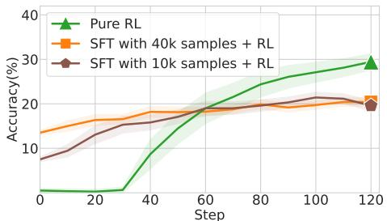
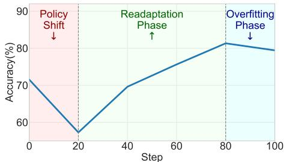
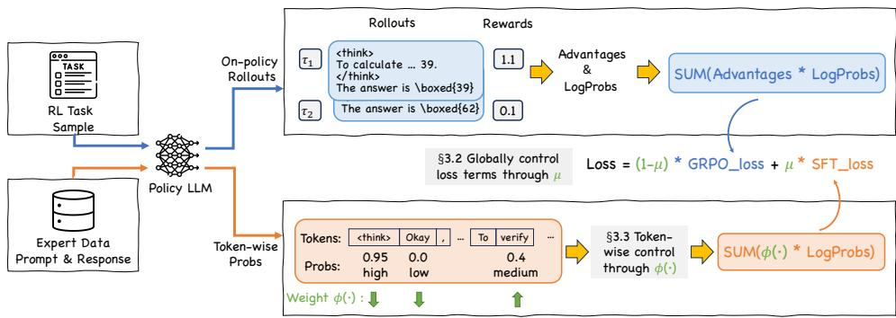
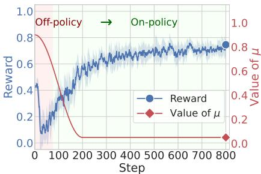
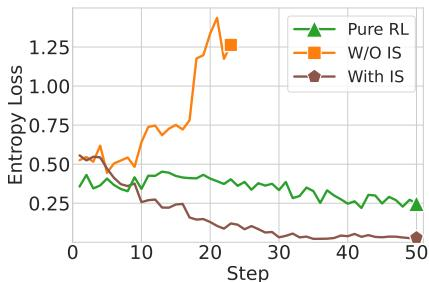
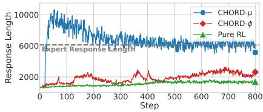
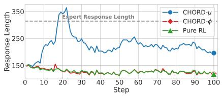
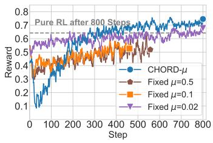
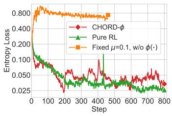
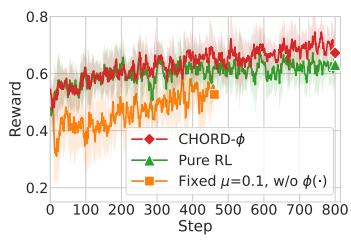

## ABSTRACT

Supervised Fine-Tuning (SFT) and Reinforcement Learning (RL) are two prominent post-training paradigms for refining the capabilities and aligning the behavior of Large Language Models (LLMs). Existing approaches that integrate SFT and RL often face the risk of disrupting established response patterns and inducing overfitting to expert data. To address this, we present a novel investigation into the unified view of SFT and RL through an off-policy versus on-policy lens. We propose CHORD, a framework for Controllable Harmonization of On- and Off-Policy Reinforcement Learning via Dynamic Weighting, which reframes SFT not as a separate stage but as a dynamically weighted auxiliary objective within the on-policy RL process. Based on an analysis of off-policy expert data’s influence at both holistic and granular levels, we incorporate a dual-control mechanism in CHORD. Specifically, the framework first employs a global coefficient to holisti cally guide the transition from off-policy imitation to on-policy exploration, and then applies a token-wise weighting function that enables granular learning from the expert, which promotes on-policy exploration and mitigates disruption from off-policy data. We conduct extensive experiments across various practical tasks, providing empirical evidence that CHORD achieves a stable and efficient learning process. By effectively harmonizing off-policy expert data with on-policy exploration, CHORD demonstrates significant improvements over baselines. We release the implementation to inspire further research.

## 1 INTRODUCTION

Large Language Models (LLMs) have demonstrated remarkable capabilities in a wide array of applications (Yang et al., 2024b; Zhang et al., 2025a; Mialon et al., 2023; Gao et al., 2024). Such significant progress can be largely attributed to two critical post-tuning paradigms that enhance the performance of LLMs in real-world scenarios, i.e., Supervised Fine-Tuning (SFT) (Taori et al., 2023; Zhou et al., 2023) and Reinforcement Learning (RL) (Ouyang et al., 2022; Shao et al., 2024).

These two paradigms present their pros and cons. SFT relies on high-quality expert trajectories to effectively mimic response patterns, which can be sensitive to the quality and quantity of expert data (Ye et al., 2025; Guha et al., 2025). Recent studies also point out that SFT may struggle to generalize beyond mere memorization (Chu et al., 2025) and is vulnerable to exposure bias (Zhang et al., 2019). In contrast, RL encourages LLMs to actively explore, which enables better generalization through learning from direct feedback on their on-policy generations (Chu et al., 2025; Chen et al., 2025b). However, such explorations can sometimes be inefficient, leading to policy degradation caused by entropy collapse (Yu et al., 2025) or over-exploitation of suboptimal strategies.

A prevalent and straightforward approach for integrating the strengths of SFT and RL while mitigating their weaknesses is the sequential SFT-then-RL paradigm (Liu et al., 2025b; Lambert et al., 2024). Intuitively, the expert’s reasoning patterns learned in SFT guide the RL exploration beyond local optima, and then the on-policy learning in RL mitigates exposure bias inherent in SFT and prevents overfitting to a limited set of static examples. However, empirical observations show that the SFTthen-RL paradigm does not consistently outperform the pure RL approach, as illustrated in Figure 1, which is also noted in recent studies (Zhang et al., 2025a; Chen et al., 2025b).

  
Figure 1: We train Qwen2.5-1.5B-Instruct on the Open-R1 dataset and evaluate the performance on a held-out validation set. These results show that the SFT-then-RL training paradigm can yield suboptimal performance compared to pure RL.

  
Figure 2: We perform SFT on Qwen2.5- 7B-Instruct using expert data generated by Deepseek-R1. The observed learning curve (measured by accuracy on MATH-500) demonstrates a “shift-readapt-overfit” progression.

In this study, we make a further investigation and demonstrate that such suboptimal performance may arise from training on expert data that significantly diverges from the model’s established patterns. As illustrated in Figure 2, the learning curve reveals a “shift-readapt-overfit” progression consisting of three distinct phases. Firstly, there is an initial disruption in capability due to the sudden policy shift, which is followed by a readaptation phase during which the model adapts to the expert’s patterns and recovers performance. Finally, we observe that the model eventually overfits the expert data. These observations highlight that while expert data can bring new capabilities, it may also disrupt established patterns and induce overfitting during the training process.

Drawing upon these insights, we unify SFT and RL through the lens of off-policy versus on-policy learning. The SFT process is reframed not as a separate tuning stage, but as a dynamically weighted auxiliary objective within the on-policy RL process. We further design CHORD, a framework for Controllable Harmonization of On- and Off-Policy Reinforcement Learning via Dynamic Weighting. CHORD features a global coefficient µ for controlling the overall influence of expert data throughout the training process, and a fine-grained weighting function ϕ(·) that helps maintain stability via down-weighting highly divergent tokens from off-policy data that could disrupt on-policy training.

Our contributions can be summarized as follows:

• We provide a systematic and in-depth analysis of the training dynamics when employing a separate SFT process to integrate off-policy expert knowledge into models with established policies. We identify the “shift-readapt-overfit” progression, revealing how off-policy data can disrupt the established response patterns of LLMs.

• We propose CHORD, a novel framework that unifies SFT and RL via a dynamically weighted auxiliary loss, which consists of a global coefficient µ and a token-wise weighting function ϕ(·). CHORD provides a fine-grained and flexible control of the influence of off-policy expert data while ensuring training stability, promoting a harmonious integration of learning from both off-policy expert demonstrations and the model’s on-policy exploration.

• Extensive experiments demonstrate that CHORD outperforms the SFT-then-RL paradigm and existing approaches. We provide both quantitative and qualitative analyses to show that CHORD strategically navigates training dynamics to selectively absorb expert knowledge without stifling the model’s reasoning capabilities, highlighting its superiority and effectiveness.

## 2 PRELIMINARIES

The post-tuning of Large Language Models (LLMs) involves optimizing their policy, denoted by πθ and parameterized by θ, to generate desirable responses. This typically follows two paradigms: Supervised Fine-Tuning (SFT), an off-policy paradigm driven by a static dataset of expert demonstrations; and Reinforcement Learning (RL), an on-policy paradigm guided by dynamic feedback.

Specifically, SFT adjusts the policy $\pi _ { \theta }$ to mimic a high-quality, static dataset of $N$ expert demonstrations, $\mathcal { D } _ { \mathrm { { S F T } } } = \{ ( \boldsymbol { x } _ { i } , \mathbf { \bar { y } } _ { i } ^ { * } ) \} _ { i = 1 } ^ { N }$ . Here, $x _ { i }$ is a prompt and $\bar { y } _ { i } ^ { * } = \bar { ( } y _ { i , 1 } ^ { * } , \ldots , y _ { i , | y _ { i } ^ { * } | } ^ { * } )$ is the corresponding expert response with $\lvert y _ { i } ^ { * }$ | tokens. The SFT objective is to minimize the negative log-likelihood of expert responses, typically optimized with an empirical estimate from a mini-batch of size B:

$$
\mathcal {L} _ {\mathrm{SFT}} (\theta) = - \frac {1}{\sum_ {i = 1} ^ {B} | y _ {i} ^ {*} |} \sum_ {i = 1} ^ {B} \sum_ {t = 1} ^ {| y _ {i} ^ {*} |} \log \pi_ {\theta} (y _ {i, t} ^ {*} | x _ {i}, y _ {i, <   t} ^ {*}).\tag{1}
$$

In contrast, RL optimizes policy $\pi _ { \theta }$ by maximizing expected reward $R ( \tau )$ from a generated trajectory ${ \boldsymbol { \tau } } = ( x , y ^ { * } )$ . Group Relative Policy Optimization (GRPO) (Shao et al., 2024) suggests sampling $\dot { K }$ responses $\{ \tau _ { 1 } , \dots , \tau _ { K } \}$ from a policy $\pi _ { \mathrm { s a m p l e } }$ when given a prompt x. Each response $\tau _ { k }$ is evaluated with the reward function $R ( \tau _ { k } )$ , and $\pi _ { \theta }$ is updated to maximize a PPO-style clipped surrogate objective. Consistent with recent studies (Hu et al., 2025a; Yu et al., 2025; Chen et al., 2025a), our formulation does not include the KL divergence term to avoid restricting performance of LLMs. The objective function can be formulated as:

$$
\mathcal {L} _ {\mathrm{GRPO}} (\theta) = - \frac {1}{\sum_ {i = 1} ^ {\hat {B}} \sum_ {k = 1} ^ {K} | \tau_ {i , k} |} \sum_ {i = 1} ^ {\hat {B}} \sum_ {k = 1} ^ {K} \sum_ {t = 1} ^ {| \tau_ {i, k} |} \min \left(r _ {i, k, t} (\theta) A _ {i, k}, \operatorname{clip} \left(r _ {i, k, t} (\theta), 1 - \epsilon , 1 + \epsilon\right) A _ {i, k}\right),\tag{2}
$$

where $\hat { B }$ is the number of prompts in the mini-batch and ϵ is the clipping hyper-parameter. The advantage $A _ { k }$ for each response is computed by $\begin{array} { r } { A _ { k } = \frac { R ( \tau _ { k } ) - \mu _ { \mathcal { R } } } { \sigma _ { \mathcal { R } } + \epsilon _ { z } } } \end{array}$ , where $\mu _ { \mathcal { R } }$ and $\sigma _ { \mathcal { R } }$ are the mean and standard deviation of rewards $\{ R ( \tau _ { k } ) \} _ { k = 1 } ^ { K }$ within the group, and $\epsilon _ { z }$ is a small constant for stability. Here $\begin{array} { r } { r _ { i , k , t } ( { \boldsymbol { \theta } } ) \triangleq \frac { \pi _ { { \boldsymbol { \theta } } } \left( \tau _ { i , k , t } | x , \tau _ { i , k , < t } \right) } { \pi _ { \mathrm { s a m p l e } } \left( \tau _ { i , k , t } | x , \tau _ { i , k , < t } \right) } } \end{array}$ denotes the token-wise Importance Sampling (IS) ratio, which re-weights the probability of actions sampled under $\pi _ { \mathrm { s a m p l e } }$ to simulate on-policy sampled distribution. For a “strict on-policy setup” (Liu et al., 2025b) that $\pi _ { \mathrm { s a m p l e } } = \pi _ { \theta }$ , this ratio should always be 1, and the gradient of $r _ { i , k , t } ( \theta )$ should be equivalent to $\nabla _ { \theta }$ log $\pi \dot { \rho } ( \tau _ { i , k , t } ^ { * } | x _ { i } , \tau _ { i , k , < t } ^ { * } )$

## 3 CHORD: HARMONIZING OFF-POLICY AND ON-POLICY LEARNING

## 3.1 THE SHIFT-READAPT-OVERFIT PROGRESSION WHEN UTILIZING OFF-POLICY DATA

Before introducing CHORD, we first take a close look at the training dynamics of the SFT process, revealing how training on off-policy expert data can disrupt the established response patterns of LLMs. Such disruption ultimately leads to the failure of the SFT-then-RL paradigm (Zhang et al., 2025a; Chen et al., 2025b), as evidenced by the results in Figure 1.

We train Qwen2.5-7B-Instruct (Yang et al., 2024a) on expert data generated by Deepseek-R1 (Guo et al., 2025) and monitor the changes in test accuracy on the MATH-500 dataset. From the experimental results shown in Figure 2, we observe that model performance declines during the first few epochs, followed by a continuous increase to a level higher than that before training, and then a slight subsequent decrease. The performance curve reveals a “shift-readapt-overfit” progression:

• Policy Shift: The performance initially declines since the model is forced to follow offpolicy expert demonstrations whose response patterns are significantly different, disrupting its established response patterns and causing a significant performance drop. Such degradation is further exacerbated by exposure bias (Zhang et al., 2019; Schmidt, 2019), as the model, trained exclusively on ground-truth expert data, struggles to navigate the self-generated contexts it encounters during inference.

• Readapt: As SFT continues, the model policy $\pi _ { \theta }$ begins to integrate the expert’s response patterns and generates responses similar to those of the expert. The exposure bias can be mitigated by reducing the reliance on the model’s response patterns, thereby allowing its performance to rise steadily as it adapts to the expert’s response patterns.

• Overfit: Extended training on the limited expert data ultimately leads to overfitting, resulting in a decline in generalization and a significant loss of output diversity. Such overfitting can also restrict the exploratory capacity that is crucial for the following RL optimization.

  
Figure 3: An overview of the proposed CHORD framework that unifies SFT and RL, featuring a $\mathbf { g }$ lobal coefficient $\mu$ and a token-wise weighting function ϕ(·).

The observed progression makes it challenging to control the influence of off-policy expert data. The SFT-then-RL paradigm demands careful timing for the SFT-to-RL transition, and even then, such a two-stage paradigm may still yield suboptimal solutions due to the inherent separation of the training phases. This highlights the limitations and fragility of the SFT-then-RL paradigm, especially when expert data’s response patterns significantly diverge from the model’s established response patterns.

Drawing upon the above insights, we propose CHORD, a novel framework that effectively unifies SFT and RL. The proposed framework consists of a dual-control mechanism. We first introduce a dynamic loss coefficient to balance learning from on- and off-policy data (refer to Section 3.2), then further design a token-wise weighting function that provides fine-grained stability control (refer to Section 3.3). The overall architecture of CHORD is shown in Figure 3.

## 3.2 CONTROLLING THE INFLUENCE OF OFF-POLICY EXPERT DATA VIA µ

Firstly, in order to control the influence of off-policy expert data, we propose to reframe SFT as a dynamically weighted auxiliary objective within the on-policy RL process, rather than a separate tuning stage as in the SFT-then-RL paradigm. Specifically, we design a combined loss function that minimizes a weighted sum of the RL and SFT losses:

$$
\mathcal {L} _ {\text { Hybrid }} (\theta) = (1 - \mu) \mathcal {L} _ {\text { GRPO }} (\theta) + \mu \mathcal {L} _ {\text { SFT }} (\theta),\tag{3}
$$

where ${ \mathcal { L } } _ { \mathrm { G R P O } } ( \theta )$ is the empirical GRPO loss defined in equation $2 , { \mathcal { L } } _ { \mathrm { S F T } } ( \theta )$ is the SFT loss defined in equation 1, and $\mu \in [ 0 , \bar { 1 } ]$ is a hyperparameter that governs the trade-off between SFT and RL.

If using a fixed value of $\mu ,$ the influence of the off-policy expert data remains unchanged throughout the entire post-tuning process. An advanced strategy, however, is to change $\mu$ for achieving a dynamic balance between off-policy and on-policy learning. For example, the SFT-then-RL pipeline can be regarded as a special case with a binary schedule (initially setting $\mu = 1$ and then transitioning to $\mu = 0 )$ . Moreover, previous studies (Ma et al., 2025; Gao et al., 2025) that utilize interleaved SFT and RL can be interpreted as employing a periodic $\mu$ schedule.

Moving a step forward, applying a decay schedule of $\dot { \mu }$ provides a more graceful and flexible transition from off-policy imitation to on-policy optimization compared to the rigid and binary switch. As shown in Figure 4, the training begins with a large $\mu$ value, encouraging the model to learn more from off-policy expert data. As training progresses, $\mu$ gradually decays to a smaller value, shifting the training focus towards on-policy exploration and annealing the influence of the off-policy expert data before overfitting on them. Such a decay schedule has also proven successful in mitigating exposure bias (Zhang et al., 2019). Inspired by scheduled sampling (Bengio et al., 2015), we generalize the principle of mixing expert and self-generated data from the token level to the loss formulation, effectively bridging the distributional gap between training on off-policy samples and performing on-policy rollouts.

Beyond the Loss Coefficient $\mu$ Empirical comparisons (refer to Section 4 for more details) demonstrate that applying a decay schedule to $\mu$ yields notable performance gains over the SFT-then-RL paradigm. At the same time, two key observations motivate us to extend beyond $\mu .$ .

  
Figure 4: Decaying the value of $\mu$ enables a smooth transition from off-policy imitation to on-policy optimization.

  
Figure 5: Comparisons of entropy loss between pure RL and mixed RL that integrates expert data (with or without the IS strategy).

Firstly, as shown in Figure 4, the learning curve still reveals a “shift-readapt” progress, where the reward initially declines before subsequently increasing. These observations indicate that, despite improvements in performance, learning from off-policy expert data might still disrupt established patterns and stifle the model’s capacity for genuine exploration during on-policy training.

Secondly, the response patterns of the model trained with CHORD- $- \mu$ (as shown in Appendix E) appear to converge to those of the expert model. Case studies reveal that CHORD-µ compels the model to adopt the expert’s verbose response pattern wholesale, hence overwriting its own inherent conciseness. This indicates that while $\mu$ controls the overall influence of expert data, it lacks fine-grained precision. As a result, it forces the model to indiscriminately adopt expert patterns, which can create conflicts with its own established style.

Towards the goal of utilizing off-policy data as an incentive and guidance for the model to explore novel and effective reasoning paths, rather than merely as a target to imitate, we further integrate CHORD with a token-wise, fine-grained weighting function $\phi ( \cdot )$ , forming a dual-control mechanism together with the global coefficient $\mu$ for controlling the influence of the off-policy expert data.

## 3.3 ENHANCING THE STABILITY OF OFF-POLICY LEARNING VIA $\phi ( \cdot )$

A feasible solution for controlling the influence of off-policy expert data from a fine-grained perspective is to differentiate the tokens based on their generation probabilities $\pi ( y _ { t } ^ { * } | x , y _ { < t } ^ { * } )$ . For example, Importance Sampling (IS) (Schulman et al., 2017) has been widely used for stably integrating offpolicy data in RL, which suggests re-weighting the objective by the probability ratio between the target policy $\pi _ { \theta }$ and the behavior policy $\pi _ { \mathrm { s a m p l e } }$ that generated the expert data. Formally, the objective function can be given as:

$$
\mathcal {L} _ {\mathrm{SFT-IS}} (\theta) = \mathbb {E} _ {(x, y ^ {*}) \sim \mathcal {D} _ {\mathrm{SFT}}} \left[ - \sum_ {t = 1} ^ {| y ^ {*} |} \mathrm{sg} \left(\frac {\pi_ {\theta} (y _ {t} ^ {*} | x , y _ {<   t} ^ {*})}{\pi_ {\mathrm{sample}} (y _ {t} ^ {*} | x , y _ {<   t} ^ {*})}\right) \cdot \log \pi_ {\theta} (y _ {t} ^ {*} | x, y _ {<   t} ^ {*}) \right],\tag{4}
$$

where $\operatorname { s g } ( \cdot )$ denotes the stop-gradient operator. Note that the probabilities $\pi _ { \mathrm { s a m p l e } } ( y _ { t } ^ { * } | \ldots )$ for the expert data $\mathcal { D } _ { \mathrm { S F T } }$ are often unknown. Following the common practice (Yan et al., 2025; Wu et al., 2025), we assume that the denominator is 1, treating the expert data as the ground-truth distribution.

From a token-wise perspective, IS enhances training stability by down-weighting low-probability tokens that could disrupt the established policy. As empirical observations shown in Figure 5, mixing off-policy data without IS leads to a sharp rise in entropy, which implies that the model’s established patterns are quickly disrupted by the unweighted off-policy data. However, we notice that IS can lead to a sharp collapse in policy entropy compared to pure RL, which implies that it can limit the exploration essential for the RL phase and trap the model in a stable but suboptimal solution. The underlying reason is that IS prevents disruptive shifts in the policy distribution by down-weighting low-probability tokens, but it also aggressively reinforces existing high-probability tokens while ignoring novel but low-probability ones, thus causing the policy to become overconfident.

Stabilize Off-policy Data Training with $\phi ( \cdot )$ To tackle this, we propose a fine-grained, per-token weighting function $\phi ( { \boldsymbol { y } } _ { t } ^ { * } ; { \boldsymbol { \pi } } _ { \boldsymbol { \theta } } )$ that down-weights the learning signal for tokens at both ends of the probability spectrum, i.e., down-weighting those tokens that are highly probable (to prevent entropy collapse) or extremely improbable (to avoid disruption). More specifically, the weight for a given expert token is defined based on the policy’s probability $p _ { t } = \pi _ { \theta } ( y _ { t } ^ { * } | x , y _ { < t } ^ { * } )$ , as follows:

$$
\phi (y _ {t} ^ {*}; \pi_ {\theta}) = p _ {t} (1 - p _ {t}),\tag{5}
$$

which naturally forms a parabolic curve that peaks at $p _ { t } = 0 . 5$ and decays to zero as $p _ { t }$ approaches 0 or 1. The SFT objective function can be updated as:

$$
\mathcal {L} _ {\mathrm{SFT-} \phi} (\theta) = - \mathbb {E} _ {(x, y ^ {*}) \sim \mathcal {D} _ {\mathrm{SFT}}} \left[ \sum_ {t = 1} ^ {| y ^ {*} |} \phi (y _ {t} ^ {*}; \pi_ {\theta}) \cdot \log \pi_ {\theta} (y _ {t} ^ {*} | x, y _ {<   t} ^ {*}) \right],\tag{6}
$$

where $\phi ( { \boldsymbol { y } } _ { t } ^ { * } ; { \boldsymbol { \pi } } _ { \boldsymbol { \theta } } )$ modulates the gradient contribution of each token in the expert trajectory.

From an information-theoretic perspective, the term $p _ { t } ( 1 - p _ { t } )$ can be viewed as a measure of the policy’s uncertainty (Wang et al., 2025) for the binary event of generating token ${ \boldsymbol y } _ { t } ^ { * }$ . Therefore, this approach biases learning towards tokens where the policy is most uncertain, and creates a “learning sweet spot” that focuses the off-policy learning on tokens that are novel enough to be informative but not so divergent as to disrupt the established policy.

By replacing the static ${ \mathcal { L } } _ { \mathrm { S F T } }$ in the proposed hybrid loss function (defined in equation 3) with LSFT-ϕ, we obtain the final objective function of CHORD, which applies a global coefficient $\mu$ for adjusting the overall influence of expert data and a fine-grained weighting function $\phi ( \cdot )$ that helps enhance the stability when learning from off-policy data.

## 4 EXPERIMENTS

## 4.1 SETUP

Datasets, Models, and Evaluations We conduct experiments on mathematical reasoning problems and practical tool-use tasks. (i) For mathematical reasoning problems, we utilize the OpenR1- Math-220k dataset (Hugging Face, 2025), from which we sample 5k instances for SFT and 20k for RL, ensuring no overlap. Our policy model is Qwen2.5-7B-Instruct, whose response patterns differ significantly from the expert (Deepseek-R1). We evaluate in-domain generalization performance on the AIME24, AIME25, and AMC benchmarks (Li et al., 2024), and use MMLU-Pro (Wang et al., 2024) to monitor the changes in general reasoning. (ii) For tool-use tasks, we conduct experiments on the single-turn instances of the ToolAce (Liu et al., 2024) dataset. We sample 5k instances for RL and 500 for SFT, for which the expert trajectories are generated by querying the Deepseek-R1 with the same system prompt. We use LLaMA3.2-3B-Instruct (Grattafiori et al., 2024) as our policy model, which also differs in response patterns from the expert (Deepseek-R1). We evaluate the model performance on BFCL (Patil et al., 2024).

Baselines We compare the proposed CHORD with a comprehensive set of baselines, including: (i) Original Model: The original Qwen2.5-7B-Instruct/LLaMA3.2-3B-Instruct model. (ii) SFT-only: The model fine-tuned on the SFT dataset. We focus on two specific configurations: SFT-light, trained for a single epoch, and SFT-best, the peak-performing checkpoint on the test set found by searching over different learning rates and training epochs. (iii) RL-only: The model fine-tuned directly on the RL dataset using the GRPO algorithm. (iv) SFT+RL: The sequential SFT-then-RL paradigm. (v) LUFFY1 (Yan et al., 2025): A method that integrates expert demonstrations within GRPO rollout groups and reshapes the importance sampling ratio. (vi) SASR (Chen et al., 2025c): A method that probabilistically interleaves SFT and RL steps. It prioritizes SFT when the model’s outputs are dissimilar to expert demonstrations, adapting the training focus dynamically.

For more details of the experimental setups, please refer to Appendix A.

## 4.2 COMPARISONS

The proposed approaches implemented based on CHORD include (i) CHORD-µ: We employ a decay schedule for the loss coefficient $\mu$ to gradually transition from off-policy to on-policy learning, as detailed in Section 3.2; and (ii) CHORD-ϕ: We fix the value of $\mu$ and further integrate the token-wise weighting function $\phi ( \cdot )$ to achieve a dual-control mechanism on the influence of off-policy expert data, as introduced in Section 3.3.

Table 1: Performance comparisons on reasoning problems and tool-use tasks.

<table><tr><td rowspan="2"></td><td colspan="4">Math &amp; General Reasoning Problems</td><td colspan="3">Tool-use Tasks</td></tr><tr><td>AMC</td><td>AIME24</td><td>AIME25</td><td>MMLU-Pro</td><td>BFCL Live</td><td>BFCL Non-live</td><td>BFCL Overall</td></tr><tr><td>Original Model</td><td>43.8</td><td>11.7</td><td>6.66</td><td>24.7</td><td>50.9</td><td>39.9</td><td>46.2</td></tr><tr><td>SFT-light</td><td>42.5</td><td>8.54</td><td>7.80</td><td>28.0</td><td>30.8</td><td>38.4</td><td>34.0</td></tr><tr><td>SFT-best</td><td>55.9</td><td>15.8</td><td>15.2</td><td>38.4</td><td>59.2</td><td>84.2</td><td>69.8</td></tr><tr><td>SFT-light + RL</td><td>52.5</td><td>11.9</td><td>11.6</td><td>44.6</td><td>68.2</td><td>89.4</td><td>77.2</td></tr><tr><td>SFT-best + RL</td><td>58.4</td><td>17.1</td><td>16.3</td><td>51.3</td><td>67.4</td><td>87.9</td><td>76.1</td></tr><tr><td>SASR</td><td>54.0</td><td>12.7</td><td>11.1</td><td>45.1</td><td>66.0</td><td>86.5</td><td>74.7</td></tr><tr><td>CHORD-μ</td><td>60.8</td><td>18.1</td><td>17.9</td><td>43.3</td><td>69.4</td><td>88.6</td><td>77.6</td></tr><tr><td>GRPO (Pure RL)</td><td>52.1</td><td>13.2</td><td>8.54</td><td>45.8</td><td>68.5</td><td>88.8</td><td>77.1</td></tr><tr><td>LUFFY</td><td>52.8</td><td>16.6</td><td>14.3</td><td>44.0</td><td>67.2</td><td>88.0</td><td>76.1</td></tr><tr><td>CHORD-φ</td><td>62.5</td><td>18.2</td><td>17.2</td><td>56.2</td><td>69.9</td><td>90.2</td><td>78.5</td></tr></table>

Model Performance Overall, the comparisons summarized in Table 1 demonstrate the effectiveness and superiority of CHORD on both reasoning problems and tool-use tasks.

Specifically, the experimental results reveal a challenge within the SFT-then-RL paradigm. We notice that minimal tuning on off-policy data (SFT-light) degrades performance, and a more thorough SFT phase (SFT-best) achieves better results. However, the optimal timing for transitioning from SFT to RL can vary across different scenarios. For example, initiating RL from SFT-best yields superior performance on math reasoning problems, while SFT-light+RL performs better on tool-use tasks. This divergence confirms that the SFT-RL balance is highly task-dependent and needs extensive efforts for careful adjustment.

These SFT-then-RL approaches are surpassed by CHORD-µ, which enables a smooth transition from off-policy to on-policy learning rather than a rigid switch. Specifically, CHORD-µ outperforms the strong SFT-best+RL baseline across all math reasoning benchmarks, achieving improvements of +2.4 on AMC, +1.0 on AIME24, and +1.6 on AIME25, respectively. Besides, CHORD-µ also achieves better overall results compared to these SFT-then-RL baselines on tool-use tasks. These results demonstrate the superiority of its unified learning design.

Further, CHORD-ϕ achieves consistent outperformance over the baselines. These results demonstrate the effectiveness of our dual-control mechanism in flexibly controlling the influence of off-policy expert data. CHORD-ϕ selectively applies the SFT loss to non-disruptive tokens, integrating expert knowledge without compromising foundational abilities. This enables robust learning from both off-policy expert data and on-policy exploration, leading to the best performance on both reasoning problems and tool-use tasks.

Response Patterns We further compare the influence of expert data (generated by DeepSeek-R1) on response patterns across different approaches. As shown in Table 2, expert responses are substantially longer than the original model’s on both math (6,132 vs. 659 tokens) and tool-use tasks (315 vs. 147 tokens). SFT models (SFT-light and SFT-best) initially mimic this verbosity. However, a subsequent RL can help mitigate the issues of overly lengthy responses by training the models to conduct on-policy exploration. The response length produced by SFT-light+RL is much shorter than that of SFT-best+RL (1,322/119 vs. 4,830/489 tokens), as fewer epochs of SFT allow the model to retain its original response patterns. Besides, from Figure 6, we can observe that CHORD-µ exhibits a similar trend, where the average response length initially increases to align with expert patterns and then gradually converges to a lower length as on-policy training progresses.

On the other hand, Pure RL on instruct-tuned models lengthens math responses (from 659 to 1,423 tokens) while shortening them for tool-use (from 147 to 118 tokens). This suggests that the response pattern changes can be task-dependent: math problems benefit from detailed step-by-step reasoning, whereas tool-use tasks favor shorter, concise action sequences. Such task-dependent property also affects the SFT/RL synergy dynamics, as MATH tasks benefit from imitating an expert’s long and verbose reasoning via SFT, while such patterns can be detrimental to tool-use performance, a distinction further detailed in Appendix D.2. The result shows that the proposed CHORD-ϕ strikes a more nuanced balance: while it also learns to produce more comprehensive mathematical reasoning (2,444 tokens), it generates concise and efficient responses for tool-use tasks (120 tokens). This suggests that the token-wise weighting in CHORD-ϕ enables the model to selectively integrate patterns from those of expert data in a task-specific manner. Qualitative analysis shown in Appendix E also confirms the effectiveness of such a flexible design, suggesting that the proposed CHORD-ϕ can go beyond simply mimicking the expert, and learn to selectively absorb reasoning patterns from the expert, while exploring its own response strategies.

Table 2: Average response length on math problems and tool-use tasks.

<table><tr><td rowspan="2"></td><td colspan="2">Average Length</td></tr><tr><td>Math</td><td>Tool-use</td></tr><tr><td>Expert Data</td><td>6,132</td><td>315</td></tr><tr><td>Original Model</td><td>659</td><td>147</td></tr><tr><td>SFT-light</td><td>9,966</td><td>259</td></tr><tr><td>SFT-best</td><td>8,442</td><td>527</td></tr><tr><td>SFT-light + RL</td><td>1,322</td><td>119</td></tr><tr><td>SFT-best + RL</td><td>4,830</td><td>489</td></tr><tr><td>CHORD-μ</td><td>6,081</td><td>197</td></tr><tr><td>Pure RL</td><td>1,423</td><td>118</td></tr><tr><td>CHORD-φ</td><td>2,444</td><td>120</td></tr></table>

  
Figure 6: Comparisons of average response length on math problems (top) and tool-use tasks (bottom).

## 4.3 ANALYSIS ON THE EFFECTS OF $\mu$ AND $\phi ( \cdot )$

We provide analysis on the effects of the coefficient $\mu$ and the token-wise weighting function $\phi ( \cdot )$

Dynamic $\mu$ Versus Fixed $\mu$ In Figure 7, we compare the model performance when applying a dynamic schedule for $\mu$ (decreasing from 0.9 to 0.05 over the first 200 training steps and keeping unchanged in the following steps) against several fixed schedules in CHORD. We observe that applying a fixed $\mu$ consistently results in poorer performance compared to dynamic $\mu .$ This indicates that naively incorporating off-policy SFT data with a static weight does not effectively serve as a solution for simultaneously learning from off-policy data and on-policy exploration. In fact, it might fail to match Pure RL, which directly encourages an instruction model to follow its own reasoning patterns, highlighting the importance and necessity of controlling the influence of off-policy data.

Besides, while using a smaller value of $\mu \ ( { \bf e . g . } , 0 . 0 2 )$ can mitigate the performance degradation compared to larger values (e.g., 0.1 and $0 . 5 )$ , it does not provide a significant improvement over pure on-policy RL. With a fixed $\mu ,$ the model is consistently required to accommodate two potentially divergent reasoning patterns, which might pull it in different directions and prevent it from converging to a stable and high-performance state. The decay schedule for $\mu$ effectively resolves this conflict by creating a smooth transition from off-policy supervision to on-policy exploration.

We also explore a natural extension to adaptively adjust the loss weight $\mu$ based on on-policy rewards. Specifically, the weight is computed as $\mu = \mathrm { m a x } ( 0 , \tau - \mathrm { r e w a r d \_ m e a n } )$ , which phases out the SFT loss on the expert data as performance improves. The experiment results in Appendix B.1 imply that an automated, reward-aware schedule for $\mu$ can work effectively but requires heavy hyper-parameter tuning, which further motivates the need for fine-grained control.

Training Curve of CHORD-ϕ In Figures 8 and 9, we compare the entropy loss and rewards of Pure RL with those of CHORD-ϕ (with fixed $\mu = 0 . 1 )$ , to illustrate their training dynamics.

From the changes in entropy loss, we can observe that by applying $\phi ( \cdot )$ , the model maintains a great balance between exploration and exploitation while performing off-policy and on-policy learning simultaneously. On one hand, CHORD-ϕ prevents the entropy from collapsing prematurely, which may occur when the SFT loss forces the model to become over-confident on high-probability tokens from the expert data. On the other hand, it avoids large entropy spikes and training instability that may occur if the off-policy expert data drastically conflict with the current policy’s predictions, as the performance curve remains stable throughout the training process. The rewards curve indicates that CHORD-ϕ achieves a stable and continuous increase in rewards, resulting in significantly better performance than Pure RL. These results demonstrate that the proposed token-wise weighting function is crucial for effectively unifying the SFT and RL phases.

  
Figure 7: Reward versus train- Figure 8: Entropy loss versus Figure 9: Reward versus training step for CHORD-µ and vari- training step for CHORD-ϕ and ing step for CHORD-ϕ and baseous fixed-µ strategies. baseline methods. line methods.

Tuning µ When Applying CHORD-ϕ Empirical observations show that, when $\phi ( \cdot )$ is used for fine-grained control over the influence of expert data, a complex and decaying schedule for $\mu$ is no longer essential. CHORD-ϕ is effective to work with a fixed value for $\mu ( \mathrm { e . g . , 0 . 1 } $ in this study) since it inherently prevents both token-level overfitting and the disruption of established response patterns. The design of ϕ(·) simplifies the practical usage of CHORD by making it robust to the specific choice of $\mu .$ In Appendix B.7, we provide experiments on tuning the schedule of $\mu$ in conjunction with ϕ(·).

Principle for Instantiating ϕ(·) It is worth noting that the proposed weight $\phi ( \cdot ) = p _ { t } * ( 1 - p _ { t } )$ serves as a concrete and interpretable instantiation following a general principle: stabilizing off-policy integration requires down-weighting the learning signal for tokens at both ends of the probability spectrum. This instantiation is computationally efficient, requiring only element-wise multiplication of existing forward-pass probabilities. As grounded in our empirical observations, by assigning negligible weight to tokens that the policy is already certain about (where $p _ { t }$ is close to 0 or 1), the proposed method prevents off-policy data from disrupting the model’s established reasoning patterns and focuses updates on tokens where the model is still uncertain. Beyond the specific formulation of $\phi ( \cdot )$ , this general principle that enables stable and selective learning from off-policy data can potentially inspire more advanced weighting schemes that are suitable for different scenarios.

We also experiment with several variants of the token-weighting function (such as entropy-based variants, clipping variants, and focal loss), with detailed experiment results and discussions presented in Appendix B.2. We acknowledge that this $\phi ( \cdot )$ token-wise weighting design primarily illustrates a generalizable principle. While it is unlikely that a single universally optimal design exists across all tasks, datasets, and models, our empirical results confirm that our design nonetheless serves as a highly effective and robust instantiation.

## 4.4 FURTHER ANALYSIS

Varying Expert Data Source We investigate the effect of using two different expert sources: the powerful DeepSeek-R1, and the weaker Qwen2.5-72B-Instruct, whose response pattern is closer to the LLaMA3.2-3B-Instruct policy model. Experimental results demonstrate that our proposed methods, CHORD-µ and CHORD-ϕ, outperform Pure RL and SFT+RL baselines regardless of the expert. We also observe that methods which rely more heavily on expert imitation (e.g., SFT+RL and $\mathbf { C H O R D - } \mu )$ can yield greater gains when the expert is stylistically similar to the policy model. This aligns with our insight: the effectiveness of unifying SFT and RL depends not only on expert data quality but also on the degree of pattern shift it introduces. For detailed results and discussion, please refer to Appendix B.3.

Extending to Non-verifiable Domains To test the generalizability of CHORD beyond verifiable tasks, we conduct experiments on RaR-Medicine, a medical question-answering dataset that lacks de terministic verification. The results show that both CHORD-µ and CHORD-ϕ significantly outperform pure RL. CHORD-ϕ achieves faster convergence and higher final rewards, while CHORD-µ exhibits a similar “shift-readapt” pattern as observed in the main experiments (Figure 10 in Appendix B.4). These findings validate that our approach successfully generalizes to more diverse, non-verifiable domains. Refer to Appendix B.4 for more details.

Training Weaker Policy Models While the effectiveness of on-policy exploration (RL) is often limited for weaker models, our experiments reveal that their capability to absorb knowledge from expert data simultaneously degrades. Our experiment on Qwen2.5-3B-Instruct shows that due to this dual limitation, a weaker model tends more to suffer from a performance collapse when training on the same off-policy expert data. In such a setting, naive imitation fails and a simple SFT+RL combination proves unstable, whereas our CHORD-ϕ provides a robust objective to navigate this trade-off and maintain learning stability. We acknowledge that with larger quantities of higher-quality expert data, a weaker model might overcome this imitation bottleneck, potentially making SFT-leaning methods more favorable. Conversely, this also suggests that our method becomes particularly advantageous when dealing with weaker models under limited expert data, highlighting its strong capability to flexibly balance this trade-off and create a robust synergy between SFT and RL. We defer detailed experiment results and analysis to Appendix B.5.

## 5 RELATED WORKS

Recent advancements in RL show significant success in complex reasoning tasks (Guo et al., 2025; Shao et al., 2024; Lambert et al., 2024). However, RL-based exploration is often constrained by the model’s initial knowledge, making it difficult for the model to discover superior reasoning pathways (Yue et al., 2025). Incorporating off-policy expert data into the on-policy RL loop is a promising strategy to address such exploration challenge. Some studies directly mix expert data with self-rollout generations, either through simple dataset mixing (Li & Khashabi, 2025), or mixing expert trajectories into on-policy rollout groups (Yan et al., 2025; Fu et al., 2025), while others use expert data to guide generation (Liu et al., 2025a; Zhang et al., 2025b; Huang et al., 2025). A third category interleaves RL updates with SFT steps on expert data, either on a predefined or adaptive schedule (Chen et al., 2025c), or for challenging examples (Ma et al., 2025). More recently, SRFT (Fu et al., 2025) proposed a unified framework that combines data mixing with a sample-level SFT loss. In this study, we focus on tuning an instruct model that already establishes its own response pattern, which can be a more challenging yet practical scenario compared to existing works that finetune a base model (Yan et al., 2025; Fu et al., 2025). For a more comprehensive literature review, please refer to Appendix C.

## 6 CONCLUSIONS AND FUTURE DIRECTIONS

In this study, we identify that the sequential SFT-then-RL paradigm often yields suboptimal performance by disrupting established patterns with off-policy expert data. To address this, we unify SFT and RL through the lens of on-policy versus off-policy learning and propose CHORD. By analyzing the influence of expert data at both the holistic and granular levels, CHORD first integrates a global coefficient µ to manage off-policy expert influence, enabling a smoother transition from imitation to exploration. CHORD then introduces a token-wise function ϕ(·) to selectively absorb expert knowledge by down-weighting tokens that are either already highly probable or extremely improbable. Extensive experiments demonstrate that this unified approach achieves notable improvements over existing sequential pipelines and various baselines.

Looking forward, our work highlights several avenues for future research. First, given the inherent high variance and parameter sensitivity typical of RL processes, exploring further algorithmic advancements to fully stabilize the training dynamics represents a promising direction. Specifically within our framework, since configurations for µ and ϕ(·) can vary across setups, discovering more effective adaptive tuning functions to reduce hyperparameter dependence remains a practical objective. Furthermore, while our analysis of pattern shifts is primarily empirical, a deeper understanding of how diverse CoT patterns influence learning would provide valuable insights for tracking training dynamics. Finally, we envision extending this unified paradigm to incorporate heterogeneous mixtures of expert data sources, enabling a comprehensive study of how different model-generated reasoning patterns emerge and evolve throughout the training process. We hope our work inspires the community to continue refining unified post-training paradigms across a broader spectrum of applications.