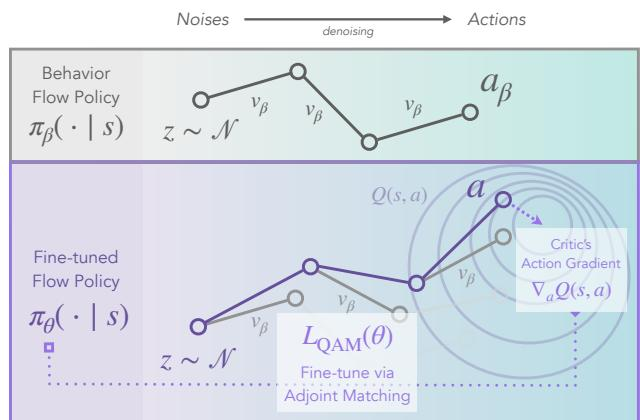
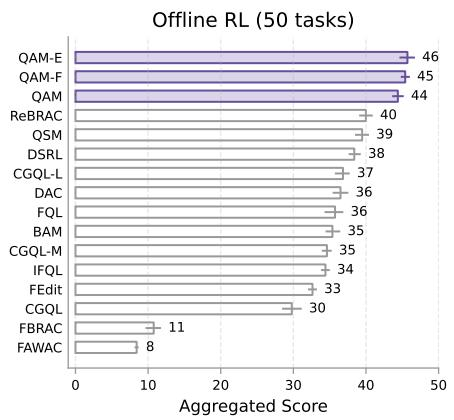
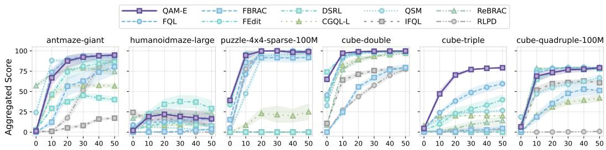
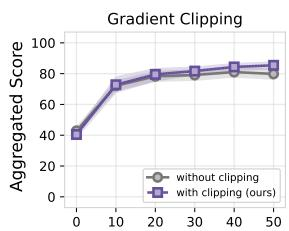
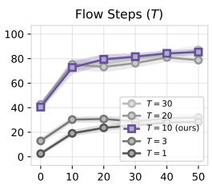
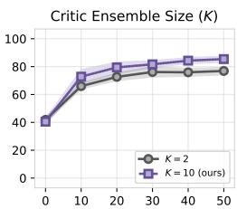
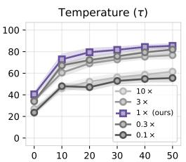

## ABSTRACT

We propose Q-learning with Adjoint Matching (QAM), a novel TD-based reinforcement learning (RL) algorithm that tackles a long-standing challenge in continuousaction RL: efficient optimization of an expressive diffusion or flow-matching policy with respect to a parameterized Q-function. Effective optimization requires exploit ing the first-order information of the critic, but it is challenging to do so for flow or diffusion policies because direct gradient-based optimization via backpropagation through their multi-step denoising process is numerically unstable. Existing methods work around this either by only using the value and discarding the gradi ent information, or by relying on approximations that sacrifice policy expressivity or bias the learned policy. QAM sidesteps both of these challenges by leveraging adjoint matching, a recently proposed technique in generative modeling, which transforms the critic’s action gradient to form a step-wise objective function that is free from unstable backpropagation, while providing an unbiased, expressive policy at the optimum. Combined with temporal-difference backup for critic learning, QAM consistently outperforms prior approaches on hard, sparse reward tasks in both offline and offline-to-online RL. Code: github.com/ColinQiyangLi/qam

## 1 INTRODUCTION

  
Figure 1: QAM: Q-learning with Adjoint Matching. Left: QAM uses adjoint matching (Domingo-Enrich et al., 2025) that leverages the critic’s action gradient directly to fine-tune a flow policy towards the optimal behavior-constrained policy: $\pi _ { \boldsymbol { \theta } } \big ( \cdot \mid s \big ) \^ { - } \propto \pi _ { \boldsymbol { \beta } } \big ( \cdot \mid s \big ) e ^ { \dot { Q ( s , \cdot ) } }$ . Right: Aggregated score for offline RL on 50 OGBench (Park et al., 2025a) tasks.

A long-standing tension in continuous-action reinforcement learning (RL) especially in the offline/offline-to-online setting, is between policy expressivity and optimization tractability with respect to a critic $( i . e . , Q ( s , a ) )$ . Simple policies, such as single-step Gaussian policies, are easy to train, since they can directly leverage the critic’s action gradient $( i . e . , \nabla _ { a } Q ( s , a ) )$ via the reparameter ization trick (Haarnoja et al., 2018). This optimization tractability, however, often comes at the cost of expressivity. Some of the most expressive policy classes today, such as flow or diffusion policies, generate actions through a multi-step denoising process. While this allows them to represent complex, multi-modal action distributions, leveraging the action gradient requires backpropagation through the entire denoising process, which often leads to instability (Park et al., 2025c). Prior work has therefore resorted to either (1) discarding the critic’s action gradient entirely and only using its value (Ren et al., 2025; Zhang et al., 2025; McAllister et al., 2025), or (2) distilling expressive, multi-step flow policies into one-step noise-conditioned approximations (Park et al., 2025c). The former sacrifices learning efficiency and often under-performs methods that use the critic’s action gradient (Park et al., 2024; 2025c), while the latter compromises expressivity. This raises a question: can we somehow keep the full expressivity of flow policies while incorporating the critic’s action gradient directly into the denoising process without backpropagation instability?

One might be tempted to directly apply the critic’s action gradient to intermediate noisy actions within the denoising process, as in diffusion classifier guidance (with the critic function being the classifier) (Dhariwal & Nichol, 2021). Intuitively, this blends two generative process together: one that generates a behavior action distribution, and another that hill-climbs the critic to maximize action value. While this approach bypasses the backpropagation instability and retains full policy expressivity, it relies on the assumption that the critic’s gradient at a noisy action is a good proxy for its gradient at the corresponding denoised action. In practice, this assumption often breaks down: when the offline dataset has limited action coverage, the critic is well-trained only on a narrow distribution of noiseless actions, rendering its gradients unreliable for intermediate noisy actions that are out of distribution.

We propose Q-learning with Adjoint Matching (QAM), a new RL algorithm that applies adjoint matching (Domingo-Enrich et al., 2025), a recently developed technique in generative modeling, to policy optimization. QAM leverages the critic’s action gradient for training flow policies to maximize returns subject to a prior constraint (e.g., behavior constraint) (Figure 1). In general, such a constrained optimization problem on a flow model can be formulated as a stochastic optimal control (SOC) objective, which can be solved by using the continuous adjoint method (Pontryagin et al., 1962). However, this standard formulation has the same loss landscape as directly backpropagating through the SOC objective, causing instability. Instead, we leverage a modified objective from Domingo-Enrich et al. (2025) that admits the same optimal solution, but does not suffer from the instability challenge. At a high level, the critic’s gradient at noiseless actions is directly transformed by a flow model constructed from the prior, independent from the possibly ill-conditioned flow model that is being optimized, to construct unbiased gradient estimates for optimizing the state-conditioned velocity field at intermediate denoising steps. This allows the flow policy’s velocity field to align directly with the optimal state-conditioned velocity field implied by the critic and the prior, without direct and potentially unstable backpropagation, while preserving the full expressivity of multi-step flow models. By combining this policy extraction procedure with a standard temporal-difference (TD) backup for critic learning, QAM enables the flow policy to efficiently converge to the optimal policy subject to the prior constraint. In contrast, approximation methods that rely on the critic’s gradients at noisy intermediate actions lack such convergence guarantees.

Our main contribution is a new TD-based RL algorithm that leverages adjoint matching to perform policy extraction effectively on a critic. Unlikely prior Q-learning methods with flow-matching that rely on approximations or throwing away the action gradient of the critic altogether, our algorithm directly uses the gradient to form an objective that at convergence recovers the optimal behaviorregularized policy. We conduct a comprehensive empirical study comparing policy extraction methods for flow/diffusion policies, including recent approaches and novel baselines, and show that QAM consistently achieves strong performance across both offline RL and offline-to-online RL benchmarks.

## 2 RELATED WORK

RL with diffusion and flow policies. Diffusion and flow policies have been explored in both policy gradient methods (Ren et al., 2025) and actor-critic methods (Fang et al., 2025b; Kang et al., 2023; Chen et al., 2024c;a; Lu et al., 2023b; Ding et al., 2024b; Wang et al., 2023; He et al., 2023; Ding & Jin, 2024; Ada et al., 2024; Zhang et al., 2024; Hansen-Estruch et al., 2023). The key challenge of leveraging diffusion/flow policies in TD-based RL methods is to optimize these policies against the critic function $( i . e . , Q ( s , \bar { a } ) ,$ ). Prior work can be largely put into three categories based on how the value function is used:

(1) Post-processing approaches refine the action distribution from a base diffusion/flow policy with rejection sampling based on the critic value (Hansen-Estruch et al., 2023; Mark et al., 2025; Li et al.,

2025; Dong et al., 2025), or using additional gradient steps to hill climb the critic (Mark et al., 2025) $( i . e . , a _ { t } \gets a _ { t } + \nabla _ { a } Q ( s , a ) )$ . These approaches often reliably improve the quality of extracted policy but at the expense of additional computation during evaluation or even training (i.e., rejection sampling for value backup target (Li et al., 2025; Dong et al., 2025)). Alternatively, one may train a residual policy that modifies a base behavior policy in either the noise space (Singh et al., 2021; Wagenmaker et al., 2025) or in the action space directly (Yuan et al., 2025; Ankile et al., 2025a;b; Dong et al., 2025).

(2) Backprop-based approaches perform direct backpropagation through both the critic and the policy (Wang et al., 2023; He et al., 2023; Ding & Jin, 2023; Zhang et al., 2024; Park et al., 2025c; Espinosa-Dice et al., 2025; Chen et al., 2025). While this is the most-straightforward implementationwise, it requires backpropagation through the diffusion/flow policy’s denoising process which has been observed to be unstable (Park et al., 2025c), or instead learns a distilled policy (Ding & Jin, 2023; Chen et al., 2024b; Park et al., 2025c; Espinosa-Dice et al., 2025; Chen et al., 2025), at the expense of policy expressivity.

(3) Intermediatefine-tuning approaches, which our method also belongs to, mitigate the need of the stability/expressivity trade-off in backprop-based approaches by leveraging the critic to construct an objective that provides direct step-wise supervision to the intermediate denoising process (Psenka et al., 2024a; Fang et al., 2025b; Ding et al., 2024a; Li et al., 2024b; Frans et al., 2025; Zhang et al., 2025; Ma et al., 2025; Koirala & Fleming, 2025). While these approaches remove the need for backpropagation through the denoising process completely, the challenge lies in carefully crafting the step-wise objective that does not introduce additional biases and learning instability. Compared to prior methods that either rely on approximations (Lu et al., 2023a; Fang et al., 2025b) that do not provide theoretical guarantees (see more discussions in Section C) or directly throwing away the critic’s action gradient (and use its value instead) (Ding et al., 2024a; Zhang et al., 2025; Ma et al., 2025; Koirala & Fleming, 2025), we leverage adjoint matching (Domingo-Enrich et al., 2025) which allows us to use the critic’s action gradient directly to construct an direct step-wise objective for our flow policy that recovers the optimal prior regularized policy at the optimum of the objective.

Offline-to-online reinforcement learning methods focus on leveraging offline RL to first pre-train on an offline dataset, and then use the pretrained policy and value function(s) as initialization to accelerate online RL (Xie et al., 2021; Song et al., 2023; Lee et al., 2022; Agarwal et al., 2022; Zhang et al., 2023; Zheng et al., 2023; Ball et al., 2023; Nakamoto et al., 2024; Li et al., 2024a; Wilcoxson et al., 2025; Zhou et al., 2025). While it is possible to skip the offline pre-training phase altogether and use online RL methods directly by treating the offline dataset as additional off-policy data that is pre-loaded into the replay buffer (Lee et al., 2022; Song et al., 2023; Ball et al., 2023), these methods often under-perform the methods that leverage explicit offline pre-training, especially on more challenging tasks (Nakamoto et al., 2024; Park et al., 2025c). Our method also operates in this regime where we first perform offline RL pre-training and then perform online fine-tuning from the offline pre-trained initialization. In addition, we follow a common design in prior work where the same offline RL objective is used for both offline pre-training and online fine-tuning (Kostrikov et al., 2022; Fujimoto & Gu, 2021; Tarasov et al., 2023; Park et al., 2025c). While we focus on evaluating our method in the offline-to-online RL setting, the idea of using adjoint matching to train an expressive flow policy can be applied to other settings such as online RL.

For additional related work on diffusion and flow-matching with guidance, see Section C.

## 3 PRELIMINARIES

Reinforcement learning and problem setup. We consider a Markov Decision Process (MDP), $\mathcal { M } = ( S , A , P , \gamma , R , \mu )$ , where $s$ is the state space, $\mathcal { A } = \mathbb { R } ^ { A } ( A \in \mathbb { Z } ^ { + } )$ is the action space, $P : \mathcal { S } \times \mathcal { A }  \Delta _ { \mathcal { S } }$ is the transition function, $\gamma \in [ 0 , 1 )$ is the discount factor, $R : { \mathcal { S } } \times \mathbb { R } ^ { A } \to$ R is the reward function, and $\mu \in \Delta _ { \mathcal { A } }$ is the initial state distribution. We have access to a dataset D consisting of a set of transitions $D = \{ ( s _ { i } , a _ { i } , s _ { i } ^ { \prime } , r _ { i } ) \} _ { i = 1 } ^ { | D | }$ , where $s ^ { \prime } \sim P ( \cdot \mid s , a )$ and $r = R ( s , a )$ . Our first goal (offline RL) is to learn a policy $\pi _ { \theta } : { \mathcal { S } }  \Delta _ { \mathcal { A } }$ from D that maximizes its expected discounted return,

$$
U _ {\pi} = \mathbb {E} _ {s _ {0} \sim \mu , s _ {k + 1} \sim P (\cdot | s _ {k}, a _ {k}), a _ {k} \sim \pi (\cdot | s _ {k})} \left[ \sum_ {k = 0} ^ {\infty} \gamma^ {k} R (s _ {k}, a _ {k}) \right].\tag{1}
$$

The second goal (offline-to-online $R L )$ is to fine-tune the offline pre-trained policy $\pi _ { \theta }$ by continuously interacting with the MDP through trajectory episodes with a task/environment dependent maximum episode length of $H \ ( i . e .$ , the maximum number of time steps before the agent is reset to $\mu )$ . The central challenge of offline-to-online RL is to maximally leverage the behavior prior in $D$ to learn as sample-efficiently (high return with few environment interactions) as possible online.

Flow-matching generative model. A flow model uses a time-variant velocity field $v : \mathbb { R } ^ { d } \times [ 0 , 1 ] \to$ $\mathbb { R } ^ { d }$ to estimate the marginal distribution of a denoising process from noise, $\mathbf { \bar { \boldsymbol { X } } } _ { 0 } = \mathcal { N } ( 0 , I _ { d } )$ , to data, $X _ { 1 } = D$ , at each intermediate time $t \in [ 0 , 1 ]$

$$
X _ {t} = (1 - t) X _ {0} + t X _ {1}.\tag{2}
$$

In particular, the flow model approximates the intermediate $X _ { t }$ via an ordinary differential equation (ODE) starting from the noise: $X _ { 0 } = \mathcal { N }$ :

$$
\mathrm{d} \hat {X} _ {t} = f (\hat {X} _ {t}, t) \mathrm{d} t.\tag{3}
$$

Flow models are typically trained with aflow matching objective (Liu et al., 2023):

$$
L _ {\mathrm{FM}} (\theta) = \mathbb {E} _ {t \sim \mathcal {U} [ 0, 1 ], x _ {0} \sim \mathcal {N}, x _ {1} \sim D} \left[ \| f _ {\theta} ((1 - t) x _ {0} + t x _ {1}, t) - x _ {1} + x _ {0} \| _ {2} ^ {2} \right],\tag{4}
$$

where any optimal velocity field, $v _ { \theta ^ { \star } }$ , results in $\hat { X } _ { t }$ where its marginal distribution $p _ { f } ( x _ { t } )$ exactly recovers the marginal distribution of the original denoising process $X _ { t } , p _ { D } ( x _ { t } )$ , for each $t \in$ [0, 1] (Lipman et al., 2024). Furthermore, one may use the Fokker-Planck equations to construct a family of stochastic differential equations (SDE) that admits the same marginals as well:

$$
\mathrm{d} \hat {X} _ {t} = \left(f (\hat {X} _ {t}, t) + \frac {\sigma_ {t} ^ {2} t}{2 (1 - t)} \left(f (\hat {X} _ {t}, t) + X _ {t} / t\right)\right) \mathrm{d} t + \sigma_ {t} \mathrm{d} B _ {t}\tag{5}
$$

with $B _ { t }$ being a Brownian motion and $\sigma _ { t } > 0$ being any noise schedule.

Adjoint matching is a technique developed by Domingo-Enrich et al. (2025) with the goal of modifying a base flow-matching generative model $f _ { \beta }$ such that the resulting flow model $f _ { \theta }$ generates the following tilt distribution:

$$
p _ {\theta} (X _ {1}) \propto p _ {\beta} (X _ {1}) e ^ {Q (X _ {1})}\tag{6}
$$

where $p _ { \theta }$ is the tilt distribution induced by $f _ { \theta }$ and $p _ { \beta }$ is the base distribution induced by $f _ { \beta } ,$ and $Q : \mathbb { R } ^ { d }  \mathbb { R } \mathrm { ~ i ~ }$ s any value function that up-weights or down-weights the probability of each example in the domain $\mathbb { R } ^ { d } .$ Domingo-Enrich et al. (2025) uses a marginal-preserving SDE with a ‘memoryless’ noise schedule $( i . e . , X _ { 0 }$ and $X _ { 1 }$ are independent), $\sigma _ { t } = \sqrt { 2 ( 1 - t ) / t } \colon$

$$
\mathrm{d} X _ {t} = (2 f (X _ {t}, t) - X _ {t} / t) \mathrm{d} t + \sqrt {2 (1 - t) / t} \mathrm{d} B _ {t},\tag{7}
$$

where the minimizer of the following stochastic optimal control equation (with $X _ { t }$ sampling from the joint distribution defined by the SDE in Equation (7)),

$$
L (\theta) = \mathbb {E} _ {\boldsymbol {X} = \{X _ {t} \} _ {t}} \left[ \int_ {0} ^ {1} \left(\frac {2}{\sigma_ {t} ^ {2}} \| f _ {\theta} (X _ {t}, t) - f _ {\beta} (X _ {t}, t) \| _ {2} ^ {2}\right) \mathrm{d} t - Q (X _ {1}) \right]\tag{8}
$$

gives the correct marginal tilt distribution for $X _ { 1 }$ (Domingo-Enrich et al., 2024):

$$
p (X _ {1}) \propto p _ {\beta} (X _ {1}) e ^ {Q (X _ {1})}.\tag{9}
$$

Let the adjoint state be the gradient of the tilt function applied at the denoised $X _ { 1 }$ :

$$
g (\boldsymbol {X}, t) = \nabla_ {X _ {t}} \left[ \int_ {t} ^ {1} \left(\frac {2}{\sigma_ {t ^ {\prime}} ^ {2}} \| f _ {\theta} (X _ {t ^ {\prime}}, t ^ {\prime}) - f _ {\beta} (X _ {t ^ {\prime}}, t ^ {\prime}) \| _ {2} ^ {2}\right) \mathrm{d} t ^ {\prime} - Q (X _ {1}) \right],\tag{10}
$$

where $X = \{ X _ { t } \}$ t is the random variable that represents the SDE trajectory, and g satisfies

$$
\frac {\mathrm{d} g (\boldsymbol {X} , t)}{\mathrm{d} t} = - \nabla_ {X _ {t}} \left[ 2 f _ {\theta} (X _ {t}, t) - X _ {t} / t \right] g (\boldsymbol {X}, t) - \frac {2}{\sigma_ {t} ^ {2}} \nabla_ {X _ {t}} \| f _ {\theta} (X _ {t}, t) - f _ {\beta} (X _ {t}, t) \| _ {2} ^ {2},\tag{11}
$$

with the boundary condition $g ( X , t = 1 ) = - \nabla _ { X _ { 1 } } Q ( X _ { 1 } )$ . We can compute the adjoint states by stepping through the reverse ODE (which can be efficiently computed with the vector-Jacobian product (VJP) in most modern deep learning frameworks). Then, it can be shown that the stochastic optimal control loss in Equation (8) is equivalent to the ‘basic’ adjoint matching objective below:

$$
L _ {\mathrm{BAM}} (\theta) = \mathbb {E} _ {\boldsymbol {X}} \left[ \int_ {0} ^ {1} \| 2 (f _ {\theta} (X _ {t}, t) - f _ {\beta} (X _ {t}, t)) / \sigma_ {t} + \sigma_ {t} g (\boldsymbol {X}, t) \| _ {2} ^ {2} \mathrm{d} t \right].\tag{12}
$$

The optimal $f _ { \theta }$ coincides with the optimal solution in the original SOC equation (Equation (8)), which gives the correct marginal distribution of $X _ { 1 }$ as a result. However, the objective is equivalent to the objective used in the continuous adjoint method (Pontryagin et al., 1962) with its gradient equal to that of backpropagation through the denoising process. Instead, Domingo-Enrich et al. (2025) derive the ‘lean’ adjoint state where all the terms in the adjoint state that are zero at the optimum are removed from the original adjoint state. The ‘lean’ adjoint state satisfies the following ODE:

$$
\mathrm{d} \tilde {g} (\boldsymbol {X}, t) = - \nabla_ {X _ {t}} \left[ 2 f _ {\beta} (X _ {t}, t) - X _ {t} / t \right] \tilde {g} (\boldsymbol {X}, t) \mathrm{d} t,\tag{13}
$$

with the same boundary condition $\tilde { g } ( X , 1 ) = - \nabla _ { X _ { 1 } } Q ( X _ { 1 } )$

Note that computing the ‘lean’ adjoint state only requires the base flow model $f _ { \beta } ( X _ { t } , t )$ and no longer needs to use $\bar { f } _ { \theta } ( X _ { t } , t )$ as needed in either the basic adjoint matching objective (Equation (12)) or naive backpropagation through the denoising process. The resulting adjoint matching objective is

$$
L _ {\mathrm{AM}} (\theta) = \mathbb {E} _ {\boldsymbol {X}} \left[ \int_ {0} ^ {1} \| 2 (f _ {\theta} (X _ {t}, t) - f _ {\beta} (X _ {t}, t)) / \sigma_ {t} + \sigma_ {t} \tilde {g} (\boldsymbol {X}, t) \| _ {2} ^ {2} \mathrm{d} t \right],\tag{14}
$$

where again X is sampled from the marginal preserving SDE in Equation (7). Because the terms omitted in the ‘lean’ adjoint state are zero at the optimum, and thus do not change the optimal solution for $f _ { \theta }$ . Thus, the optimal solution for the adjoint matching gives the correct tilt distribution.

## 4 Q-LEARNING WITH ADJOINT MATCHING (QAM)

In this section, we describe in detail how our method leverages adjoint matching to directly align the flow policy to prior regularized optimal policy without suffering from backpropagation instability.

To start with, we first define the optimal policy that we want to learn as the solution of the best policy under the standard KL behavior constraint:

$$
\arg \max _ {\pi} \mathbb {E} _ {a \sim \pi (\cdot | s)} [ Q (s, a) ] \quad \text { s.t. } \quad D _ {\mathrm{KL}} (\pi \parallel \pi_ {\beta}) \leq \epsilon (s).\tag{15}
$$

or equivalently, for an appropriate $\tau ( s )$ , Nair et al. (2020) show that

$$
\pi^ {\star} (a \mid s) \propto \pi_ {\beta} (a \mid s) e ^ {\tau (s) Q _ {\phi} (s, a)}\tag{16}
$$

where $\tau : S  \mathbb { R } ^ { + }$ is the inverse temperature coefficient that controls the strength of the behavior constraint at each state.

We approximate the behavior policy using a flow-matching behavior policy, $f _ { \beta } : \mathcal { S } \times \mathbb { R } ^ { A } \times [ 0 , 1 ] $ $\mathbb { R } ^ { A }$ that is optimized with the standard flow-matching objective:

$$
L _ {\mathrm{FM}} (\beta) = \mathbb {E} _ {(s, a) \sim D, t \sim [ 0, 1 ], z \sim \mathcal {N}} \left[ \| f _ {\beta} (s, (1 - t) z + t a, t) - a + z \| _ {2} ^ {2} \right]\tag{17}
$$

We then parameterize our approximation of the optimal policy as another flow model $f _ { \theta } : { \mathcal { S } } \times \mathbb { R } ^ { A } \times$ $[ 0 , 1 ] \to { \overline { { \mathbb { R } } } } ^ { A }$ and solve the following SOC equation:

$$
L (\theta) = \mathbb {E} _ {s \sim D, a _ {t}} \left[ \int_ {0} ^ {1} \frac {2}{\sigma_ {t} ^ {2}} \| f _ {\theta} (s, a _ {t}, t) - f _ {\beta} (s, a _ {t}, t) \| _ {2} ^ {2} - \tau (s) Q _ {\phi} (s, a _ {1}) \mathrm{d} t \right],\tag{18}
$$

where $a _ { t }$ is defined by the following ‘memory-less’ SDE $( e . g . , a _ { 0 }$ is independent from $a _ { 1 } )$ :

$$
\mathrm{d} a _ {t} = (2 f _ {\theta} (s, a _ {t}, t) - a _ {t} / t) \mathrm{d} t + \sqrt {2 (1 - t) / t} \mathrm{d} B _ {t}.\tag{19}
$$

Similar to the derivation by Domingo-Enrich et al. (2025), the memory-less property allows us to directly conclude that the SOC equation has the optimum at

$$
\pi_ {\theta} (\cdot \mid s) \propto \pi_ {\beta} (\cdot \mid s) e ^ {\tau (s) Q _ {\phi} (s, a)}\tag{20}
$$

where $\pi _ { \boldsymbol { \theta } } ( \cdot \mid s )$ and $\pi _ { \beta } ( \cdot \mid s )$ are the corresponding action distributions defined by $f _ { \theta }$ and $f _ { \beta }$ .

However, directly solving the SOC equation involves backpropagation through time that introduces additional instability. To circumvent this issue, we use the adjoint matching objective proposed by Domingo-Enrich et al. (2025) (Equation (14)) to construct a similar objective for policy optimization in our case:

$$
L _ {\mathrm{AM}} (\theta) = \mathbb {E} _ {s \sim D, \{a _ {t} \} _ {t}} \left[ \int_ {0} ^ {1} \| 2 (f _ {\theta} (s, a _ {t}, t) - f _ {\beta} (s, a _ {t}, t)) / \sigma_ {t} + \sigma_ {t} \tilde {g} _ {t} \| _ {2} ^ {2} \mathrm{d} t \right]\tag{21}
$$

where $\tilde { g } _ { t }$ is the ‘lean’ adjoint state defined by a reverse ODE constructed from $\textstyle { a _ { t } } ^ { \prime } \mathbf { s } \colon$

$$
\mathrm{d} \tilde {g} _ {t} = - \nabla_ {a _ {t}} \left[ 2 f _ {\beta} (s, a _ {t}, t) - a _ {t} / t \right] \tilde {g} _ {t} \mathrm{d} t.\tag{22}
$$

Unlike the original SOC objective (Equation (18)) from which calculating the gradient requires backpropagating through an SDE, which suffers from stability challenges, the adjoint matching objective is constructed without backpropagation. Instead, it uses the behavior velocity field $f _ { \beta }$ to calculate the ‘lean’ adjoint states $\{ \tilde { g } _ { t } \} _ { t }$ through a series of VJPs for every SDE trajectory $\{ a _ { t } \} _ { t }$ which are then used to form a squared loss in the adjoint matching objective. Mathematically, backpropagation can also be interpreted as calculating the adjoint states through a series of VJPs, with the key distinction that the VJPs are computed under the flow model that is being optimized $( i . e .$ $f _ { \theta } )$ . This is an important distinction because for direct backpropagation, any ill-conditioned action gradient in $f _ { \theta } \ ( i . e . , \nabla _ { a } f _ { \theta } ( s , a , t ) )$ would compound over the entire denoising process, contributing to the $^ { \circ } \mathrm { i l l } .$ -condition-ness’ of the overall gradient to the parameter $\theta ,$ which can in turn destabilize the whole optimization process. In contrast, in adjoint matching, the action gradient of $f _ { \theta }$ has no contribution to the overall gradient to $\theta ,$ which allows the optimization to be much more stable.

Finally, we combine the policy optimization with the standard TD-learning objective:

$$
L (\phi) = \mathbb {E} _ {s, a, s ^ {\prime}, r \sim D} \left[ (Q (s, a) - r - \gamma Q _ {\bar {\phi}} (s ^ {\prime}, a ^ {\prime}) \right], \quad a ^ {\prime} \gets \mathrm{ODE} (f _ {\theta} (s ^ {\prime}, \cdot , \cdot), a _ {0} ^ {\prime} \sim \mathcal {N})\tag{23}
$$

where $\begin{array} { r } { \mathrm { O D E } ( f _ { \theta } ( s ^ { \prime } , \cdot , \cdot ) , a _ { 0 } ^ { \prime } ) : = \int _ { 0 } ^ { 1 } f _ { \theta } ( s ^ { \prime } , a _ { t } ^ { \prime } , t ) \mathrm { d } \iota } \end{array}$ t (sampling an action sample from the velocity field $f _ { \boldsymbol { \theta } } ( s ^ { \prime } , \cdot , \cdot ) )$ and ϕ¯ is the exponential moving average of $\phi$ with a time-constant of $\lambda = 0 . 0 0 5 ( i . e .$ $\bar { \phi } _ { i + 1 }  ( 1 - \lambda ) \bar { \phi } _ { i } + \lambda \phi _ { i }$ for each training step i).

Practical considerations. In practice, following Domingo-Enrich et al. (2025), we solve both the SDE and the reverse ODE with discrete approximation and a fixed step size of $h = 1 / T$ , where $T$ is the number of discretization steps. In particular, with $a _ { 0 } \sim \mathcal { N }$ and $z _ { t } \sim \mathcal { N } , \forall t \in \{ 0 , h , \cdot \cdot \cdot ( T - 1 ) h \}$ the forward SDE process is approximated by

$$
a _ {t + h} \leftarrow a _ {t} + h \cdot (2 f _ {\theta} (s, a _ {t}, t) - a _ {t} / t) + \sqrt {2 h (1 - t) / t} z _ {t}.\tag{24}
$$

We set the boundary condition as $\tilde { g } _ { 1 } = - \tau \nabla _ { a _ { 1 } } Q _ { \phi } ( s , a _ { 1 } )$ , where we use a state-independent inverse temperature coefficient τ to modulate the influence of the prior $\pi _ { \beta }$ and we additionally clip the magnitude of the parameter gradient element-wise by 1 for numerical stability. The backward adjoint state calculation process is then approximated by

$$
\tilde {g} _ {t - h} \leftarrow \tilde {g} _ {t} + h \cdot \mathrm{VJP} (\nabla_ {a _ {t}} (2 f _ {\beta} (s, a _ {t}, t) - a _ {t} / t), \tilde {g} _ {t}),\tag{25}
$$

with $\mathrm { V J P } ( \nabla _ { \pmb { y } } b ( \pmb { y } ) , \pmb { x } ) = [ \nabla _ { \pmb { y } } b ( \pmb { y } ) ]$ x being the vector-Jacobian product and it can be practically implemented by carrying the ‘gradient’ x with backpropagation through $f .$ For the critic, we use an ensemble of $K = 1 0$ critic functions $\phi ^ { 1 } , \cdots , \phi ^ { \dot { K } }$ and use the pessimistic target value backup following Fang et al. (2025a) (originally inspired by Ghasemipour et al. (2022)). The loss function for each $\phi ^ { j } , j \in \{ 1 , 2 , \cdots , K \}$ is

$$
L (\phi^ {j}) = \left(Q _ {\phi^ {j}} (s, a) - r - \gamma \left[ \bar {Q} _ {\mathrm{mean}} (s ^ {\prime}, a ^ {\prime}) - \rho \bar {Q} _ {\mathrm{std}} (s ^ {\prime}, a ^ {\prime}) \right]\right) ^ {2},\tag{26}
$$

where $\begin{array} { r } { \bar { Q } _ { \operatorname* { m e a n } } ( s ^ { \prime } , a ^ { \prime } ) : = \frac { 1 } { K } \sum _ { k } Q _ { \bar { \phi } ^ { k } } ( s ^ { \prime } , a ^ { \prime } ) , \bar { Q } _ { \operatorname { s t d } } ( s ^ { \prime } , a ^ { \prime } ) = \frac { 1 } { K } \sqrt { \sum _ { k } ( Q _ { \bar { \phi } ^ { k } } ( s ^ { \prime } , a ^ { \prime } ) - \bar { Q } _ { \operatorname* { m e a n } } ( s ^ { \prime } , a ^ { \prime } ) ) ^ { 2 } } , } \end{array}$ and $a ^ { \prime }$ is the action sampled from the fine-tuned flow model: $f _ { \theta } ( s , \cdot , \cdot )$ . For all our experiments, we do not use a separate training process for $f _ { \beta }$ and instead training it at the same time as $f _ { \theta }$ and $Q _ { \phi }$ , following Park et al. (2025c); Li et al. (2025). For all our loss functions, the transition tuple $( s , a , s ^ { \prime } , r )$ is drawn from D uniformly. During offline training, D is the offline data. During online fine-tuning, D is combination of the offline and online replay buffer data without any re-weighting. A pseudocode of our algorithm is available in Algorithm 1 in the Appendix.

Theoretical guarantees. As our algorithm builds off from Domingo-Enrich et al. (2025), we can directly extend their theoretical results to our setting (see in Section G)—as long as the loss function $L _ { \mathrm { A M } }$ is optimized to convergence $( i . e .$ , with $\partial L / \partial f _ { \theta } = 0 )$ , the learned policy coincides with the optimal behavior-constrained policy $( i . e . , \pi ^ { \star } ( a \mid s ) \propto \pi _ { \beta } ( a \mid s ) \exp ( \tau Q ( s , a ) )$ in Equation (16)).

Expanding the constraint set beyond the KL behavior constraint. While our method, QAM, is guaranteed to converge to the optimal behavior-constrained policy $( i . e . , \propto \pi _ { \beta } \exp ( Q ) )$ , it can struggle to represent any policy that has a support mismatch with the behavior policy. For tasks where the optimal actions have extremely low probability under the behavior distribution, our algorithm may have trouble to represent an optimal policy for these tasks. In practice, we often find it to be beneficial to relax the behavior constraint in QAM to allow actions that are ‘close’ (in the action space) to the behavior actions. This amounts to optimizing the policy under the following constraint:

$$
\arg \max _ {\pi , \tilde {\pi}} \mathbb {E} _ {a \sim \pi (\cdot | s)} [ Q (s, a) ] \quad \text {s.t.} \quad D _ {\mathrm{KL}} (\tilde {\pi} \| \pi_ {\beta}) \leq \epsilon (s), W _ {q} (\pi , \tilde {\pi}) \leq \sigma_ {a},\tag{27}
$$

where $W$ is the $q { \mathrm { - } } \mathsf { W }$ asserstein distance between $\pi , { \tilde { \pi } }$ under some metric d : $: \mathcal { A } \times \mathcal { A } \mapsto \mathbb { R } _ { 0 } ^ { + }$ , and $\sigma _ { a }$ some constant that controls the strength of the constraint:

$$
W _ {q} (\pi (\cdot \mid s), \tilde {\pi} (\cdot \mid s)) := \inf _ {c \in \mathcal {C} (\pi , \tilde {\pi})} \left[ \mathbb {E} _ {a, \tilde {a} \sim c (a, \tilde {a} | s)} [ d (a, \tilde {a}) ^ {q} ] ^ {1 / q} \right],\tag{28}
$$

where $\mathcal { C } ( \pi , \tilde { \pi } )$ is the set of all couplings between π and π˜. With such design, π not only respects KL behavior constraint, but can also represent actions that are ‘close’ (in the geometry of the action space) to the behavior policy. While directly optimizing this objective is intractable, we approximate it by using the solution from QAM $( i . e . , \pi _ { \theta } )$ to approximate the optimal ${ \tilde { \pi } } ,$ , allowing us to transpose the problem into a behavior-constrained policy optimization problem with $\pi _ { \theta }$ being the base policy:

$$
\pi^ {\star} \approx \pi_ {\omega} = \arg \max _ {\pi} \mathbb {E} _ {a \sim \pi (\cdot | s)} [ Q (s, a) ] \quad \text { s.t. } \quad W _ {q} (\pi (a \mid s), \pi_ {\theta} (a \mid s)) \leq \sigma_ {a}.\tag{29}
$$

In practice, we explore two practical variants for optimizing π with different choices of q and d and approximations.

Thefirst variant, QAM-FQL: For our first variant, we use $q = 2$ and $d ( a , \tilde { a } ) = \lVert a - \tilde { a } \rVert _ { 2 }$ , which allows us to directly use a prior flow RL method, FQL (Park et al., 2025c). In particular, we learn a 1- step noise-conditioned policy, $\pi _ { \omega }$ (as represented by $\mu _ { \omega } ( s , z ) : \mathcal { S } \times \mathbb { R } ^ { A } \mapsto \mathbb { R } ^ { A } )$ , and optimize the following objective (with α being a tunable BC coefficient),

$$
L _ {\mathrm{QAM-FQL}} (\omega) = \mathbb {E} _ {z \sim \mathcal {N}} \left[ - Q _ {\phi} (s, \mu_ {\omega} (s, z)) + \alpha \| \mu_ {\omega} (s, z) - \mathrm{ODE} (f _ {\theta} (s, \cdot , \cdot), z) \| _ {2} ^ {2} \right].\tag{30}
$$

As a direct application of the theoretical result in Park et al. (2025c), the second term in the equation above is an upper-bound on squared Wasserstein distance $W _ { 2 } ^ { 2 } ( \pi _ { \omega } , \pi _ { \theta } )$ between the 1-step noiseconditioned policy $\pi _ { \omega }$ and the optimal behavior-constrained policy obtained via $\mathbf { Q A M } , \pi _ { \theta } .$ . This is exactly the desired constraint $( i . e . , W _ { 2 } ^ { 2 } ( \pi _ { \omega } , \pi _ { \theta } ) \leq \epsilon _ { W } )$ . We then use this 1-step policy $\pi _ { \omega }$ both to interact with the environment and to compute value targets $( i . e . , \bar { Q } ( s ^ { \prime } , a ^ { \prime } = \bar { \mu } ( s , \bar { z } \sim { \mathcal N } ) ) )$ Intuitively, the 1-step policy is optimized to remain close to the QAM-fine-tuned flow policy while also maximizing the action value under the current critic. We call this first variant of our method QAM-FQL.

The second variant, QAM-EDIT: Our second variant uses $q = 1$ and $d ( a , \tilde { a } ) = \| a - \tilde { a } \| _ { \infty }$ . To implement this, we learn an edit policy $\pi _ { \omega } ( \Delta _ { a } \mid s , a )$ that predicts an action edit $\Delta _ { a }$ to modify the action output from $\pi _ { \theta }$ by at most $\sigma _ { a }$ in the $L _ { \infty }$ distance $( i . e . , \| \Delta _ { a } \| _ { \infty } \leq \sigma _ { a } )$ . This ensures that the Wasserstein distance constraint $( i . e . , W _ { 1 } ( \pi _ { \omega } , \pi _ { \theta } ) \leq \sigma _ { a } )$ is enforced by construction. In practice, we train an edit policy (Dong et al., $2 0 2 5 ) , \pi _ { \omega } ( \cdot \mid s , \tilde { a } )$ , where it first predicts a Gaussian distribution, then squashed by a tanh function to between −1 and 1, and finally rescaled to be between $- \sigma _ { a }$ and $\sigma _ { a }$ as the action edit. To avoid the degenerate case where the edit policy always outputs the boundary action edits $( i . e . , - \sigma _ { a } \mathrm { o r } \sigma _ { a } )$ , we also include the standard entropy term from Haarnoja et al. (2018) with the automatic entropy tuning trick such that the policy’s entropy is close to a constant value of $\mathcal { H } ( \pi _ { \omega } ) = \mathcal { H } _ { \mathrm { t a r g e t } } = - A / 2$

$$
\begin{array}{r} L _ {\mathsf {Q A M - E D I T}} (\omega) = \mathbb {E} _ {\Delta_ {a} \sim \pi_ {\omega} (\cdot | s, a)} \left[ - Q _ {\phi} (s, \Delta_ {a} + a) + \eta \log \pi_ {\omega} (\Delta_ {a} \mid s, a) \right], \\ L (\eta) = \eta \left[ \mathbb {E} _ {\Delta_ {a} \sim \pi_ {\omega} (\cdot | s, a)} [ \log \pi_ {\omega} (\Delta_ {a} \mid s, a) ] - \mathcal {H} _ {\mathrm{target}} \right], \end{array}\tag{31}
$$

where $a \sim \pi _ { \theta } ( \cdot \mid s )$ for both losses and again $\Delta _ { a }$ is restricted to be $\| \Delta _ { a } \| _ { \infty } \leq \sigma _ { a }$ . Similarly to our first variant, we use $\pi _ { \omega }$ both to interact with the environment and to compute value targets. A potential side benefit of the entropy term is that it can also encourage action diversity that can be helpful for online exploration and fine-tuning. As we will show in our experiments, this QAM variant not only excels in offline RL but also fine-tunes effectively online.

## 5 EXPERIMENTS

We conduct experiments to evaluate the effectiveness of our method on a range of long-horizon, sparse-reward domains and compare it against a set of representative baselines.

Domains and datasets. We consider 10 domains (5 tasks each) from OGBench (Park et al., 2025a): scene, puzzle-3x3 (p33), puzzle-4x4 (p44), cube-double (c2), cube-triple (c3), cube-quadruple (c4), humanoidmaze-medium (hm), humanoidmaze-large (hl), antmaze-large (al), and antmaze-giant (ag). For antmaze-\* and humanoidmaze-\*, we use the default navigate datasets. For scene, puzzle-\*, and cube-\*, we use the default play datasets except for c4 and p44 where we use the larger 100M-size dataset from Park et al. (2025b), and use the sparse reward definition for {p33, p44, scene}, following Li et al. (2025). In addition, for all {cube-\*, scene-\*, p33-\*, p44-\*} domains, we follow Li et al. (2025) to learn action chunking policies with an action chunking size of $h = 5 .$ Action chunking policies output high-dimensional actions that exhibits a much more complex behavior distribution, where the policy extraction becomes critical. Since our approach primarily focuses on the policy extraction aspect, these domains make an ideal testbed us to compare our method to prior work. See Section D for more details on these domains.

Comparisons. We carefully select 13 representative, strong baselines that can be roughly categorized into the following 5 categories— (1) Gaussian: ReBRAC (Tarasov et al., 2023), (2) Backprop: FBRAC (Park et al., 2025c) (backprop through the flow policy’s denoising step directly), FQL (backprop through a 1-step distilled policy) (Park et al., 2025c); (3) Advantage-weighted: FAWAC (Park et al., 2025c) (advantage weighted actor critic, AWAC (Nair et al., 2020), with flow policy); (4) Guid ance with the critic’s action gradient: DAC (Fang et al., 2025b), QSM (Psenka et al., 2024a), and CGQL/CGQL-MSE/CGQL-Linex (three variants of classifier guidance-based methods inspired by Dhariwal & Nichol (2021)); (5) Post-processing-based: DSRL (Wagenmaker et al., 2025), FEdit (flow + Gaussian edit policy from Dong et al. (2025)), and IFQL (flow counterpart of IDQL (Hansen Estruch et al., 2023)). For offline-to-online evaluations we additionally compare with RLPD (Ball et al., 2023). Finally, we compare with BAM, a direct ablation from our method QAM where we use the ‘basic’ adjoint matching (and hence the abbreviation BAM) objective in Equation (12) instead of the adjoint matching objective in Equation (14), and keep the rest of the implementation exactly the same. We categorize it as a “backprop” method because its gradient is equivalent to that of backpropagating through the memory-less SDE as we discuss above in Section 3.

Among them, RLPD does not employ any behavior constraint, so we directly train from scratch online. To make the comparison fair, we use $K = 1 0$ critic networks, pessimistic value backup with $\rho = 0 . 5$ (except on humanoidmaze-large where we find $\rho = 0$ to work better), no best-of-N sampling (i.e., N = 1) for both our methods and our baselines except for IFQL where best-of-N is used for policy extraction. See Section E for detailed description and implementation detail for each of the baselines. We also include the domain-specific hyperparameters for each baseline in Section F.

## 6 RESULTS

In this section, we present our experimental results to answer the following three questions:

## (Q1) How effective is our method for offline RL?

Table 1 reports the offline RL performance across 10 different domains (50 tasks in total). QAM outperforms all prior methods with an aggregated score of 44. In particular, among all the baselines, FAWAC also converges to the optimal behavior-constrained distribution (Equation (16) but does not leverage the action gradient of the critic, resulting in a much worse aggregated score of 8; BAM also leverages the SOC objective but optimizes it with backpropagation through the SDE chain (without using the ‘lean’ adjoint), leading to a worse aggregated score of 35. It is worth noting that FBRAC also leverages backpropagation through time (BPTT) similar to BAM, but performs much worse than BAM. The main distinction between BAM and FBRAC is that BAM leverages the SOC formulation which enjoys the guarantee that the policy at the optimum recovers the optimal behavior-constrained policy, whereas FBRAC has not been found to enjoy such guarantee. This suggests that carefully designing the loss function where its optimum coincides with the optimal behavior-constrained policy can be influential to the algorithm’s performance. Furthermore, BAM ends up performing similarly to FQL, which addresses the BPTT instability issue by leveraging a 1-step distilled policy. This suggests that BPTT might not be as disadvantageous as previously reported in Park et al. (2025c) in the best case, but can be sensitive to implementation details. In addition, we find QSM, one of the earliest methods proposed in the literature of diffusion/flow-matching and RL can perform very well when augmented with a behavior cloning term. 2 We also find that a Gaussian baseline, ReBRAC, while worse on manipulation tasks, often outperforms other flow/diffusion-based methods on locomotion tasks. This makes ReBRAC the fifth-best method in terms of aggregated score, falling short compared to QSM and all three QAM variants. At last but not least, combining QAM with FQL and FEdit (QAM-F and QAM-E respectively) can push the performance even further, achieving an aggregated score of 45 and 46 respectively.

<table><tr><td colspan="2"></td><td>al5 tasks</td><td>ag5 tasks</td><td>hm5 tasks</td><td>hl5 tasks</td><td>scene5 tasks</td><td>p335 tasks</td><td>p445 tasks</td><td>c25 tasks</td><td>c35 tasks</td><td>c45 tasks</td><td>all50 tasks</td></tr><tr><td>GAUSSIAN</td><td>ReBRAC</td><td>[94,95]94</td><td>[53,60]57</td><td>[65,74]69</td><td>[15,19]17</td><td>[61,69]65</td><td>[73,84]79</td><td>[0,0]0</td><td>[8,10]9</td><td>[0,1]1</td><td>[6,13]9</td><td>[39,41]40</td></tr><tr><td rowspan="3">BACKPROP</td><td>FBRAC</td><td>[1,4]2</td><td>[0,0]0</td><td>[37,41]39</td><td>[0,0]0</td><td>[43,57]50</td><td>[0,1]0</td><td>[12,19]15</td><td>[0,0]0</td><td>[0,1]0</td><td>[0,0]0</td><td>[10,12]11</td></tr><tr><td>BAM</td><td>[62,85]84</td><td>[0,2]1</td><td>[58,62]60</td><td>[4,8]5</td><td>[97,99]98</td><td>[48,64]56</td><td>[0,0]0</td><td>[44,50]47</td><td>[2,5]3</td><td>[0,0]0</td><td>[34,36]35</td></tr><tr><td>FQL</td><td>[72,79]76</td><td>[0,0]0</td><td>[63,73]68</td><td>[7,11]9</td><td>[77,86]78</td><td>[60,79]70</td><td>[3,7]5</td><td>[43,49]46</td><td>[2,4]3</td><td>[1,5]2</td><td>[34,37]36</td></tr><tr><td>ADV. WEIGHTED</td><td>FAWAC</td><td>[15,19]17</td><td>[0,0]0</td><td>[22,26]24</td><td>[0,0]0</td><td>[25,41]38</td><td>[2,3]3</td><td>[0,0]0</td><td>[2,2]2</td><td>[0,0]0</td><td>[0,0]0</td><td>[8,9]8</td></tr><tr><td rowspan="5">GUIDANCE</td><td>CGQL</td><td>[73,86]76</td><td>[0,2]0</td><td>[17,62]60</td><td>[4,5]5</td><td>[26,46]38</td><td>[40,55]48</td><td>[14,33]24</td><td>[26,41]38</td><td>[7,9]8</td><td>[0,0]0</td><td>[20,31]30</td></tr><tr><td>CGQL-M</td><td>[69,73]71</td><td>[1,8]4</td><td>[40,43]42</td><td>[3,8]6</td><td>[72,79]74</td><td>[100,100]100</td><td>[0,0]0</td><td>[29,43]41</td><td>[7,9]8</td><td>[0,1]1</td><td>[34,35]35</td></tr><tr><td>CGQL-L</td><td>[62,67]65</td><td>[1,4]3</td><td>[17,66]62</td><td>[5,8]6</td><td>[85,91]88</td><td>[83,99]90</td><td>[0,0]0</td><td>[43,47]45</td><td>[7,9]8</td><td>[0,1]0</td><td>[36,38]37</td></tr><tr><td>DAC</td><td>[86,90]88</td><td>[11,20]16</td><td>[61,85]83</td><td>[0,0]0</td><td>[65,79]68</td><td>[62,75]68</td><td>[0,0]0</td><td>[33,36]35</td><td>[2,6]5</td><td>[1,5]3</td><td>[35,38]36</td></tr><tr><td>QSM</td><td>[69,92]90</td><td>[19,20]24</td><td>[79,84]82</td><td>[2,7]6</td><td>[77,86]78</td><td>[52,63]57</td><td>[0,0]0</td><td>[31,34]33</td><td>[2,6]6</td><td>[16,19]19</td><td>[36,40]39</td></tr><tr><td rowspan="3">POST-PROCESSING</td><td>DSRL</td><td>[56,66]61</td><td>[1,4]3</td><td>[48,58]53</td><td>[2,5]3</td><td>[99,100]99</td><td>[82,92]87</td><td>[0,0]0</td><td>[72,76]74</td><td>[1,2]1</td><td>[2,3]2</td><td>[38,39]38</td></tr><tr><td>FEdit</td><td>[54,62]58</td><td>[1,3]2</td><td>[30,23]22</td><td>[2,3]3</td><td>[60,65]62</td><td>[96,100]99</td><td>[30,37]34</td><td>[37,43]40</td><td>[2,3]2</td><td>[2,7]5</td><td>[32,33]33</td></tr><tr><td>IFQL</td><td>[32,39]36</td><td>[0,2]1</td><td>[65,87]86</td><td>[21,27]24</td><td>[83,85]84</td><td>[100,100]100</td><td>[0,0]0</td><td>[10,12]11</td><td>[0,0]0</td><td>[1,3]2</td><td>[34,35]34</td></tr><tr><td rowspan="3">ADJOINT MATCHING</td><td>QAM</td><td>[78,84]81</td><td>[14,22]18</td><td>[64,69]67</td><td>[9,14]11</td><td>[96,99]97</td><td>[99,100]100</td><td>[0,0]0</td><td>[62,66]64</td><td>[3,4]3</td><td>[2,4]3</td><td>[44,45]44</td></tr><tr><td>QAM-F</td><td>[81,84]83</td><td>[8,16]12</td><td>[62,69]65</td><td>[9,14]12</td><td>[92,97]95</td><td>[99,100]99</td><td>[5,8]6</td><td>[63,67]65</td><td>[2,3]3</td><td>[11,17]14</td><td>[45,46]45</td></tr><tr><td>QAM-E</td><td>[80,86]83</td><td>[0,3]1</td><td>[54,63]59</td><td>[1,3]2</td><td>[96,99]97</td><td>[100,100]100</td><td>[25,43]39</td><td>[63,66]65</td><td>[4,6]5</td><td>[4,9]6</td><td>[45,47]46</td></tr></table>

Table 1: Offline RL performance at 1M training steps (50 tasks, 12 seeds). Our method (QAM) and two of its variants, QAM-FQL (QAM-F) and QAM-EDIT (QAM-E) outperform all prior baselines. We use CGQL-M, CGQL-L, QAM-F, QAM-E as the abbreviations for CGQL-MSE, CGQL-Linex, QAM-FQL, and QAM-EDIT respectively. For results on individual tasks, see Table 2 in Section B.

## (Q2) How effective is our method for offline-to-online fine-tuning?

Next, we take the best performing variant of QAM, QAM-EDIT, and evaluate its ability to online finetune from its offline RL initialization. Figure 2 shows the sample efficiency curve (with x-axis being the number of environment steps). Our method outperforms all prior methods on cube-triple and is the most robust method across the board. For example, compared to ours, QSM fine-tunes better on ag but struggles on all other tasks except on c2 where it performs similar to our method. FQL fine-tunes slightly better on ag but much slower on both p44 and c3.

(Q3) How sensitive is our method to hyperparameters? We also conduct sensitivity analyses for various components of our best performing variant, QAM-EDIT, including gradient clipping, number of flow steps (T), critic ensemble size (K) and the temperature coefficient (τ). As we show in Figure 3, all of these components contribute to our method’s effectiveness. Among them, the temperature parameter (τ ) has the biggest impact on performance and need to be tuned. For the other components, we find enabling gradient clipping and having a large critic ensemble size (K = 10) also help. Lastly, we find that setting the number of flow steps to T = 10 works well enough and increasing it further does not improve performance.

  
Online Environment Steps (×104)  
Figure 2: QAM online fine-tunes more effectively than prior methods (50 tasks, 12 seeds). We use the QAM-EDIT (QAM-E) variant for QAM and the CGQL-Linex variant for CGQL (CGQL-L) because they work well for online fine-tuning. For full results, see Figure 5 in the Appendix.

  
Online Environment Steps (×104)

  
Figure 3: Sensitivity analysis of QAM-EDIT on the representative task from each domain (12 seeds). For all locomotions tasks, we use task1. For all manipulation tasks, we use task2. We report the aggregated performance across these 10 representative tasks. Gradient Clipping: whether to use gradient clipping in our optimizer; Flow Steps (T): this parameter indicates the number of numerical integration steps that we use for the flow model. Critic Ensemble Size (K): number of critic network in the ensemble; Temperature (τ): the parameter that modulates the influence of the prior. We rerun our method with 0.1×, 0.3×, 3×, and 10× the best τ from tuning. Full results in Figure 6.

## 7 DISCUSSION

We present Q-learning with Adjoint Matching (QAM), a new TD-based RL method that effectively leverages the critic’s action gradient to extract an optimal prior-constrained policy while circumventing common limitations of prior approaches (e.g., approximations that do not guarantee to converge to the desired optimal solution, learning instability, or reduced expressivity from distillation). Our empirical results suggest that QAM is an effective policy extraction method in both the offline RL setting and the offline-to-online RL setting, performing on par or better than prior methods. There are still practical challenges associated with QAM. While QAM’s effectiveness can be largely attributed to how well it is able to leverage the critic’s action gradient, this can be a double-edge sword—for cases where the critic function is ill-conditioned, it could lead to optimization stability issue. Gradient clipping (as done in our method) can alleviate this issue, but a more principled method that combines both value and gradient information could further improve robustness and performance. Another possible extension is to apply QAM in real-world robotic settings with action chunking policies. Our initial success (especially in the manipulation domains where we also leverage action chunking policies) may suggest that our method might work more effectively in complex real-world scenarios.