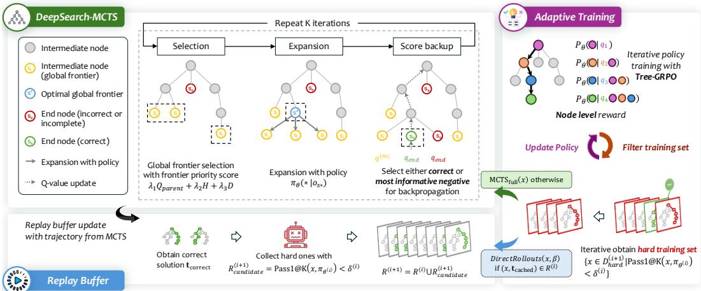
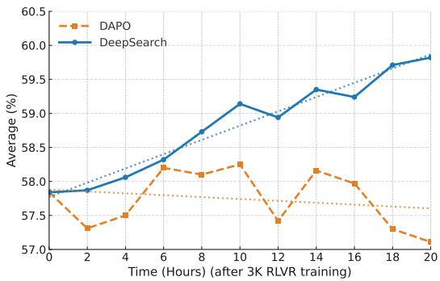

## ABSTRACT

Although Reinforcement Learning with Verifiable Rewards (RLVR) has become an essential component for developing advanced reasoning skills in language models, contemporary studies have documented training plateaus after thousands of optimization steps, i.e., notable decreases in performance gains despite increased computational investment. This limitation stems from the sparse exploration patterns inherent in current RLVR practices, where models rely on limited rollouts that often miss critical reasoning paths and fail to provide systematic coverage of the solution space. We present DeepSearch, a framework that integrates Monte Carlo Tree Search (MCTS) directly into RLVR training. In contrast to existing methods that rely on tree search only at inference, DeepSearch embeds structured search into the training loop, enabling systematic exploration and fine-grained credit assignment across reasoning steps. Through training-time exploration, DeepSearch addresses the fundamental bottleneck of insufficient exploration, which leads to diminishing performance gains over prolonged training. Our contributions include: (1) a global frontier selection strategy that prioritizes promising nodes across the search tree, (2) selection with entropy-based guidance that identifies confident paths for supervision, and (3) adaptive replay buffer training with solution caching for efficiency. Experiments on mathematical reasoning benchmarks show that DeepSearch achieves an average accuracy of 62.95% and establishes a new state-of-the-art reasoning model, while using 5.7x fewer GPU hours than extended training approaches. These results highlight the importance of strategic exploration over brute-force scaling and demonstrate the promise of algorithmic innovation for advancing RLVR methodologies. DeepSearch establishes a new direction for scaling reasoning capabilities through systematic search rather than prolonged computation.

https://github.com/smiles724/DeepSearch

https://huggingface.co/fangwu97/DeepSearch-1.5B

## 1 INTRODUCTION

Large language models (LLMs) have recently achieved notable progress on complex reasoning tasks (DeepSeek-AI, 2025; Yang et al., 2024; Wu et al., 2025a; Wang et al., 2026; Xia et al., 2025), driven in part by test-time computation scaling strategies (Li et al., 2023; Yao et al., 2023; Bi et al., 2024; Zhang et al., 2024a; Guan et al., 2025) such as tree search with process-level evaluation. While effective, these methods typically treat structured search as an inference-only mechanism, leaving untapped potential to integrate systematic exploration into the training process itself.

This separation between training and inference imposes fundamental limitations on the scalability of reinforcement learning with verifiable rewards (RLVR) for reasoning. Current RLVR approaches remain constrained by sparse exploration patterns during training (Wu et al., 2025b; Liu et al., 2025c; Tu et al., 2025), while models are expected to demonstrate sophisticated search behaviors only at inference time. Even recent advances in prolonged RL training (Liu et al., 2025a) have shown that performance plateaus after thousands of steps, with diminishing returns to allocating more compute to deeper training. This suggests that simply scaling the number of training steps, the primary axis explored in prior work, may not be sufficient to fully realize RLVR’s potential.

  
Figure 1: DeepSearch framework overview with three key components.

We address this gap by introducing DeepSearch, a framework that embeds Monte Carlo Tree Search (MCTS) (Metropolis & Ulam, 1949) directly into RLVR training, representing a fundamental shift from scaling training depth to scaling training breadth. By coupling structured search with verifiable rewards during training, DeepSearch enables models to learn not only from correct solutions but also from the systematic exploration process itself, providing richer supervision than outcome-based or direct rollout methods (Lyu et al., 2025; He et al., 2025b).

The core insight driving us is to focus on training-time exploration as the driver of improved reasoning. While traditional RLVR relies on limited rollouts that may miss critical reasoning paths, DeepSearch systematically expands the reasoning frontier during training through principled tree search. This design advances three key objectives: (i) expanding reasoning coverage beyond what direct policy rollouts can achieve, (ii) providing fine-grained credit assignment to intermediate reasoning steps through tree-structured backpropagation, and (iii) maintaining computational efficiency through intelligent node selection and solution caching strategies.

Towards these goals, DeepSearch introduces several key innovations. First, globalfrontier selection strategy prioritizes the most promising nodes across the entire search tree, moving beyond traditional root-to-leaf Upper Confidence Bounds for Trees (UCT) traversals that can be computationally wasteful and myopic. Second, selection with entropy-based guidance systematically identifies confident incorrect reasoning paths for supervision. Finally, an adaptive training strategy with replay buffers progressively filters challenging problems and caches verified solutions, thereby avoiding redundant computation across training iterations.

We evaluate DeepSearch on math reasoning benchmarks, where it significantly outperforms strong RLVR baselines (Liu et al., 2025a; Luo et al., 2025b). Our results show that DeepSearch achieves 62.95% average accuracy on challenging mathematical tasks, representing a new state-of-the-art for 1.5B reasoning models. Importantly, these gains are achieved while maintaining computational efficiency through progressive filtering and intelligent reuse of solutions, demonstrating that searchaugmented training can be both more effective and more practical than conventional approaches.

The implications extend beyond math reasoning: by bridging the gap between inference-time search capabilities and training-time learning, DeepSearch establishes a new approach for scaling RLVR that emphasizes systematic exploration over prolonged training. This work suggests that the future of reasoning model development lies not just in scaling model parameters or training steps, but in fundamentally rethinking how we structure the learning process to mirror the sophisticated reasoning patterns we expect at inference time.

## 2 RELATED WORKS

Search-based reasoning. Structured search has become a standard strategy for scaling test-time compute in LLMs (Snell et al., 2024; Wu et al., 2024; Zhang et al., 2024c), with diverse methods including tree-based (Yao et al., 2023; Zhang et al., 2024b; Qi et al., 2024) and random sampling approaches (Wang et al., 2022). Recently, search-based reasoning has evolved into sophisticated frameworks that integrate three core components: policy models, reward models, and search algorithms. Drawing inspiration from game-playing systems like AlphaGo (Silver et al., 2016), works have explored Monte Carlo Tree Search (MCTS) and beam search to guide LLMs through structured reasoning processes (Chen et al., 2024; Zhang et al., 2024a;c), particularly following OpenAI’s o1 release (Jaech et al., 2024). These frameworks enable exploration of multiple solution paths during inference, trading compute resources for improved accuracy on challenging tasks such as math reasoning. Key design considerations include outcome-supervised versus process-supervised reward models, discriminative versus generative reward architectures, and search strategies ranging from local selection to global exploration (Lightman et al., 2023; Wang et al., 2023). However, most methods restrict search to inference and do not integrate exploration signals into training, leaving the potential for jointly optimizing search and learning largely unexplored.

Reinforcement learning from verifiable rewards. RLVR has emerged as a transformative approach for aligning and enhancing LLMs by addressing critical challenges across instruction following (Su et al., 2025; Gunjal et al., 2025), ethical alignment (Wang et al., 2025a), and reasoning capabilities (Wang et al., 2025b). Recent extensions (Guo et al., 2025; Yu et al., 2025; Wan et al., 2025) have improved training stability and efficiency by incorporating critic-free optimization, dynamic sampling, and adaptive weighting mechanisms. While these approaches demonstrate the promise of RLVR, they predominantly rely on direct rollouts, which can constrain systematic exploration of the solution space (Wu et al., 2025b; Yue et al., 2025).

Monte Carlo Tree Search. MCTS is a powerful search paradigm for complex decision-making problems, extensively explored across diverse fields like games (Silver et al., 2016; Ye et al., 2021), robotics (Best et al., 2019; Dam et al., 2022), theorem proving (Lample et al., 2022), and matrix multiplication (Fawzi et al., 2022). Early work, such as AlphaGo, integrated MCTS with deep learning (Kemmerling et al., 2023), achieving superhuman performance in board and video games (Ye et al., 2021). Recently, MCTS has been applied to path finding and train timetabling problems (Pitanov et al., 2023; Yang, 2023), while Vagadia et al. (2024) integrated MCTS into physics-informed planning networks for robot control. Despite the demonstrated potential of MCTS for heuristic exploration, it remains unclear how to effectively employ it during RLVR training.

## 3 DEEPSEARCH WITH MCTS

Given a problem x and a policy model $\pi _ { \theta }$ , we adopt a modified MCTS framework to build a search tree for incremental step-by-step solution exploration. We replace traditional root-to-leaf selection with global frontier-based node selection. The root node represents the question $x ,$ and child nodes correspond to intermediate steps s generated by $\pi _ { \theta }$ . A root-to-leaf path ending at a terminal node $s _ { \mathrm { e n d } }$ forms a trajectory $\mathbf { t } = x \oplus s _ { 1 } \oplus s _ { 2 } \oplus . . . \oplus s _ { \mathrm { e n d } }$ , where each step $s _ { i }$ is assigned a $\mathrm { q } \cdot$ -value $q ( s _ { i } )$ Then we extract solution trajectories $\mathbb { T } = \left\{ \mathbf { t } ^ { 1 } , \mathbf { t } ^ { 2 } , \ldots , \mathbf { t } ^ { n } \right\} ( n \geq 1 )$ from the search tree $\tau _ { \ast }$ , where $\mathbf { t } ^ { i }$ can be correct, incorrect or incomplete. The depth of any node s is denoted as $d ( s ) \in \mathbb { Z } ^ { + } . \ : N ( s )$ and $\xi ( s )$ denote the number of visits to s and the number of children nodes of s, respectively. Starting from the root node $x ,$ our MCTS iterations are conducted through three subsequent components.

## 3.1 EXPANSION WITH ENTROPY-BASED GUIDANCE

In step $i ,$ we collect the latest reasoning trajectory $o _ { i } = x \oplus s _ { 1 } \oplus s _ { 2 } \oplus . . . \oplus s _ { i - 1 }$ as the current state, $\mathrm { i . e . }$ , observation. Based on this state, we prompt the policy model $\pi _ { \boldsymbol { \theta } } ( s _ { i } | \boldsymbol { o } _ { i } )$ to generate n candidates for the next-step reasoning trail $\{ s _ { i , j } \} _ { j = 1 } ^ { n }$ . We repeat this expansion behavior until we reach the terminal nodes $s _ { \mathrm { e n d } } \in S _ { \mathrm { e n d } } .$ , either by arriving at the final answers or by hitting the maximum depth of the tree $d _ { T }$ , which yields an ordered sequence $s _ { 1 } \to \cdots \to s _ { \mathrm { e n d } }$

During each expansion, let ${ \mathcal S } _ { \mathrm { e n d } } ^ { ( k ) }$ denote the set of newly generated terminal nodes at iteration $k .$ We evaluate the correctness of each terminal node using a verification function $\mathcal { V } : S _ { \mathrm { e n d } }  \{ 0 , 1 \}$ where $\gamma ( s ) = 1$ indicates a correct solution and $\bar { \mathcal { V } } ( s ) \bar { = } 0$ indicates an incorrect or incomplete solution. Then we partition the terminal nodes into correct and incorrect/incomplete subsets:

$$
\mathcal {S} _ {\text { correct }} ^ {(k)} = \{s \in \mathcal {S} _ {\text { end }} ^ {(k)} \mid \mathcal {V} (s) = 1 \}, \quad \mathcal {S} _ {\text { incorrect }} ^ {(k)} = \{s \in \mathcal {S} _ {\text { end }} ^ {(k)} \mid \mathcal {V} (s) = 0 \}.\tag{1}
$$

If $S _ { \mathrm { c o r r e c t } } ^ { ( k ) } = \emptyset$ , we employ an entropy-based selection to identify the most confident wrong rollout. The terminal node with the lowest average entropy along its root-to-leaf trajectory is selected:

$$
s _ {\text { neg }} ^ {*} = \arg \min _ {s \in \mathcal {S} _ {\text { incorrect }} ^ {(k)}} \bar {H} (\mathbf {t} (s)),\tag{2}
$$

where $\mathbf { t } ( s ) = ( x , s _ { 1 } , s _ { 2 } , \ldots , s )$ represents the unique trajectory from root $x$ to terminal node $s ,$ and the average trajectory entropy is defined as $\begin{array} { r } { \bar { H } ( \mathbf { t } ( s ) ) ~ = ~ \frac { 1 } { | \mathbf { t } ( s ) | } \sum _ { i = 1 } ^ { | \mathbf { t } ( s ) | } H \big ( \pi _ { \theta } \big ( s _ { i } ~ | ~ o _ { i } \big ) \big ) } \end{array}$ ,, where $\begin{array} { r } { H ( \pi _ { \theta } ( s _ { i } \mid o _ { i } ) ) = - \sum _ { a _ { i , k } } \pi _ { \theta } ( a _ { i , k } \mid o _ { i } , a _ { i , < k } ) } \end{array}$ log $\pi _ { \boldsymbol { \theta } } ( a _ { i , k } \mid o _ { i } , a _ { i , < k } )$ is the Monte Carlo estimation of the Shannon entropy of the token distribution at step i. $a _ { i , k }$ is the k-th token of step $s _ { i }$ and $a _ { i , < k }$ denotes the tokens preceding $a _ { i , k }$ . This strategy prioritizes incorrect reasoning sequences with low decision uncertainty, targeting areas where the model is most confident in its decisions and would benefit from additional training and supervision. We find that this most-confident incorrect selection consistently outperforms random and least-confident selection across all benchmarks, see Table 5.

## 3.2 HEURISTIC SCORE BACKUP

Let $\mathbf { t } ^ { * }$ denote the selected trajectory for backpropagation, which is either a correct solution trajectory or the most confident negative trajectory $\mathbf { t } ( s _ { \mathrm { n e g } } ^ { * } )$ identified through entropy-based selection. Let $q ^ { ( m ) } ( s _ { i } )$ denote the q-value for node $s _ { i } \in \mathbf { t } ^ { * }$ after the m-th rollout backpropagation. We define the iterative q-value update rule for nodes along the selected trajectory:

$$
q ^ {(m)} (s _ {i}) = q ^ {(m - 1)} (s _ {i}) + \gamma (i, l) \cdot q ^ {(m)} (s _ {\text { end }}),\tag{3}
$$

where $\gamma ( i , l ) : \mathbb { Z } ^ { + } \times \mathbb { Z } ^ { + } \to [ 0 , 1 ]$ is the depth decay function that assigns higher weights to nodes closer to the terminal node. It is defined as $\begin{array} { r } { \gamma ( i , l ) = \operatorname* { m a x } \left( \frac { i } { l } , \gamma _ { \operatorname* { m i n } } \right) } \end{array}$ , where i is the current node index in the trajectory, l is the terminal node index, and $\gamma _ { \mathrm { m i n } } \stackrel { \cdot \cdot } { = } 0 . 1$ 1 is the minimum decay threshold.

The q-value initialization is $q ^ { ( 0 ) } ( s _ { i } ) = 0$ for all $s _ { i } ~ \in ~ \mathcal { T }$ . Terminal node rewards are assigned according to the verification function’s result:

$$
q (s _ {\text { end }}) = \left\{ \begin{array}{l l} + 1 & \text { if } \mathcal {V} (s _ {\text { end }}) = 1 (\text { correct }), \\ - 1 & \text { if } \mathcal {V} (s _ {\text { end }}) = 0 (\text { incorrect }) \lor d (s _ {\text { end }}) <   d _ {\mathcal {T}} (\text { incomplete }). \end{array} \right.\tag{4}
$$

To ensure positive $\mathrm { q } \cdot$ -values $( e . g . , q _ { \mathrm { c o r r e c t } } = 0 . 1 )$ for nodes on correct reasoning paths while penalizing nodes leading to incorrect or incomplete solutions, we enforce the constrained update rule:

$$
q ^ {(m)} (s _ {i}) = \left\{ \begin{array}{l l} q ^ {(m - 1)} (s _ {i}) + \gamma (i, l) \cdot q ^ {(m)} (s _ {\text { end }}) & \text { if } q ^ {(m - 1)} (s _ {i}) \cdot q ^ {(m)} (s _ {\text { end }}) \geq 0, \\ \gamma (i, l) \cdot q ^ {(m)} (s _ {\text { end }}) & \text { elif } q ^ {(m)} (s _ {\text { end }}) > 0, \\ q ^ {(m - 1)} (s _ {i}) & \text { elif } q ^ {(m - 1)} (s _ {i}) > 0. \end{array} \right.\tag{5}
$$

This constraint preserves the invariant that $q ^ { ( m ) } ( s _ { i } ) \geq 0$ for all intermediate nodes $s _ { i } \in \mathcal { T } \backslash S _ { \mathrm { e n d } }$ leading to correct solutions, while allowing negative values only for nodes observed on any correct trajectory under the current search process. More justification is elucidated in Appendix B.2.

## 3.3 HYBRID SELECTION STRATEGY

UCT (Kocsis & Szepesvari, 2006) is the standard selection rule used in classical MCTS to balance´ exploitation of high-value nodes and exploration of under-visited ones. Our MCTS employs a hybrid selection strategy that combines traditional UCT-based local selection with novel global frontier selection, each serving distinct purposes in the search process.

Local Selection for Sibling Comparison During the expansion of a selected node, we generate multiple candidate children and must determine which to add to the tree. For this local sibling comparison, we follow the traditional MCTS protocol and employ the UCT algorithm as $\operatorname { J C T } ( s ) =$ $\begin{array} { r } { Q ( s ) + \lambda \sqrt { \frac { \ln N _ { \mathrm { p a r e n t } } ( s ) } { N ( s ) } } } \end{array}$ , where $\begin{array} { r } { Q ( s ) = \frac { q ( s ) } { N ( s ) } } \end{array}$ represents the average reward per visit, $N _ { \mathrm { p a r e n t } } ( s )$ is the number of visits from the parent node, and λ balances exploitation and exploration. This local selection ensures that we make optimal decisions when choosing among sibling nodes that share the same parent and context.

Global Frontier Selection for Next Expansion After completing the first score backup phase, we need to identify the most promising node across the entire search tree for the next expansion round. This is where our novel global frontier selection mechanism operates.

Unlike traditional MCTS, which performs root-to-leaf traversals using UCT at each level, our global approach directly compares all frontier nodes simultaneously. We maintain a global view of all leaf nodes across the entire search tree $\tau$ and prioritize promising expansion points globally:

$$
\mathcal {F} = \{s \in \mathcal {T} \mid \xi (s) = 0, s \notin \mathcal {S} _ {\text { end }}, d (s) <   d _ {\mathcal {T}} \}.\tag{6}
$$

For each frontier node $s \in \mathcal { F }$ and its associated observation (prefix) $o _ { s }$ , we compute a frontier priority score:

$$
F (s) = \underbrace {\lambda_ {1} \times \tanh (Q _ {\text { parent }} (s))} _ {\text { Quality   Potential }} + \underbrace {\lambda_ {2} \times H (\pi_ {\theta} (s \mid o _ {s}))} _ {\text { Uncertainty   Bonus }} + \underbrace {\lambda_ {3} \times D (d (s))} _ {\text { Depth   Bonus }}.\tag{7}
$$

Here, the quality potential term tanh $( Q _ { \mathrm { p a r e n t } } ( s ) )$ ) encourages the selection of nodes whose parents have demonstrated high value, using the tanh transformation to smoothly handle negative Q-values and map them to the range $[ - 1 , 1 ]$ . The uncertainty bonus term $H ( \pi _ { \boldsymbol { \theta } } ( \boldsymbol { s } ^ { \cdot } | \boldsymbol { o } _ { \boldsymbol { s } } ) )$ provides exploration guidance by adjusting priority according to the policy’s entropy; the sign of its coefficient can be utilized to steer selection toward regions with high confidence or uncertainty. The depth bonus term $D ( d ( s ) )$ encourages deeper exploration by providing additional priority to nodes at greater depths, where we empirically find $D ( d ( s ) ) = \sqrt { d ( s ) / d \tau }$ to be most effective among other variants including $d ( s )$ and $\bar { \log ( d ( s ) + 1 ) }$ . The node with the highest frontier score is selected for the next expansion: $s ^ { * } = \arg \operatorname* { m a x } _ { s \in \mathcal { F } } F ( s )$

Rationale for Hybrid Approach This hybrid design leverages complementary strengths: local UCT selection ensures principled sibling comparisons within subtrees, while global frontier selection mitigates UCT’s myopia by allocating resources across subtrees. The approach achieves three key advantages: (1) Computational efficiency by eliminating redundant root-to-leaf traversals, (2) Enhanced exploration coverage by preventing the algorithm from getting trapped in locally promising but globally suboptimal subtrees, and (3) Uncertainty-guided search that leverages the policy’s entropy to target regions expected to benefit from additional training supervision, with the bonus coefficient controlling the direction of this preference.

## 4 ADAPTIVE TRAINING STRATEGY WITH REPLAY BUFFER

While MCTS offers fine-grained credit assignment, applying it to every training example is computationally infeasible. To address this, we adopt an iterative filtering strategy with a replay buffer mechanism that focuses MCTS computation on challenging examples while preventing catastrophic forgetting of solved problems. The complete pipeline is depicted in Algorithm 1.

## 4.1 ITERATIVE TRAINING WITH PROGRESSIVE FILTERING

Our training process follows an iterative approach that progressively refines the training subset based on model performance. We begin by using the base RL model to perform an initial screening on the entire dataset $\mathcal { D } _ { \mathrm { h a r d } }$ , creating the first training subset $\mathcal { D } _ { \mathrm { h a r d } } ^ { ( 0 ) }$ for MCTS-based RL training.

Specifically, the iterative training process proceeds as follows:

Initial Subset Construction: Given the base policy $\pi _ { \theta ^ { ( 0 ) } }$ , we evaluate its performance on the full training set $\mathcal { D } _ { \mathrm { t r a i n } }$ using direct rollouts and construct the initial hard subset:

$$
\mathcal {D} _ {\text {hard}} ^ {(0)} = \{x \in \mathcal {D} _ {\text {train}} \mid \text {Pass1@K} (x, \pi_ {\theta^ {(0)}}) <   \delta^ {(0)} \},\tag{8}
$$

where Pass1 $\mathbb { Q } \mathbb { K } ( x , \pi )$ represents the success rate when sampling $K = 4$ solutions for problem x using policy π, and $\delta ^ { ( 0 ) } \in ( 0 , 1 )$ is the initial filtering threshold.

Iterative Refinement: After each training phase $i ,$ we re-evaluate the updated policy $\pi _ { \theta ^ { ( i ) } }$ on the current hard subset and apply threshold-based filtering to create the next iteration’s training set:

$$
\mathcal {D} _ {\text { hard }} ^ {(i + 1)} = \{x \in \mathcal {D} _ {\text { hard }} ^ {(i)} \mid \text { Pass1@K } (x, \pi_ {\theta^ {(i)}}) <   \delta^ {(i)} \}.\tag{9}
$$

The filtering threshold $\delta ^ { ( i ) }$ is typically set to 25%, ensuring that only problems with insufficient success rates remain in the active training set. This progressive filtering concentrates computational resources on increasingly challenging problems as the model improves.

## 4.2 REPLAY BUFFER WITH CACHED SOLUTIONS

To prevent catastrophic forgetting and efficiently leverage previously discovered solutions, we maintain a replay buffer R that stores correct reasoning trajectories from earlier training phases.

Buffer Population. During each training iteration i, we identify problems that obtained correct solutions through MCTS rollouts but still fail to meet the filtering threshold after training:

$$
\mathcal {R} _ {\text {candidates }} ^ {(i)} = \left\{\left(x, \mathbf {t} _ {\text { correct }}\right) \mid x \in \mathcal {D} _ {\text { hard }} ^ {(i)}, \exists \mathbf {t} _ {\text { correct }} \in \mathbb {T} (x), \text { Pass1@K } \left(x, \pi_ {\theta^ {(i)}}\right) <   \delta^ {(i)} \right\}.\tag{10}
$$

These candidate trajectories are added to the replay buffer, attaining $\mathcal { R } ^ { ( i + 1 ) } = \mathcal { R } ^ { ( i ) } \cup \mathcal { R } _ { \mathrm { c a n d i d a t e s } } ^ { ( i ) } .$

Cached Solution Usage. Instead of randomly sampling from the replay buffer, we employ a deterministic strategy that directly utilizes cached solutions when available. For each problem x in the current training iteration, we first check whether a correct solution has been previously cached. This approach eliminates redundant MCTS computation for problems with known solutions while directing computational resources toward truly challenging, unsolved problems.

Hybrid Rollout Strategy. When processing problems in the current hard subset $\mathcal { D } _ { \mathrm { h a r d } } ^ { ( i ) }$ , we apply different rollout strategies based on cache availability:

$$
\operatorname{Rollout} (x) = \left\{ \begin{array}{l l} \mathbf {t} _ {\text { cached }} \cup \text { DirectRollouts } (x, \beta) & \text { if } (x, \mathbf {t} _ {\text { cached }}) \in \mathcal {R} ^ {(i)}, \\ \operatorname{MCTS} _ {\text { full }} (x) & \text { otherwise }. \end{array} \right.\tag{11}
$$

For problems with cached solutions, we directly incorporate the stored correct trajectory $\mathbf { t } _ { \mathrm { c a c h e d } }$ and supplement it with DirectRollouts $( x , \beta )$ , which samples $\beta \cdot B$ additional solution attempts from the current policy $\pi _ { \boldsymbol { \theta } } ( \cdot | \boldsymbol { x } )$ , where $\beta \in \mathbf { \dot { [ 0 , 1 ] } }$ is implicitly determined by the number of cached solutions per problem (we allocate fewer DirectRollouts as more correct trajectories are cached) and B is the standard sampling budget. For problems without cached solutions, we apply the complete MCTS search process $\mathbf { M C T S _ { \mathrm { f u l l } } } ( x )$ . Moreover, among the incorrect samples, we remove data containing garbled text or infinite repetitions. Based on empirical evidence, optimizing policies on such problematic data frequently leads to training collapse (Bai et al., 2025). The training dataset for each iteration is then constructed as:

$$
\mathcal {T} _ {\text { train }} ^ {(i)} = \underbrace {\bigcup_ {x : (x , \mathbf {t} _ {\text { cached }}) \in \mathcal {R} ^ {(i)}} \{\mathbf {t} _ {\text { cached }} \cup \text { DirectRollouts } (x , \beta) \}} _ {\text { Cached   problems }} \cup \underbrace {\bigcup_ {x : (x , \mathbf {t} _ {\text { cached }}) \notin \mathcal {R} ^ {(i)}} \text { MCTS} _ {\text { full }} (x)} _ {\text { Unsolved   problems }}.\tag{12}
$$

This eliminates the need for artificial sampling ratios or complex batch composition strategies, as training data naturally incorporates both preserved knowledge and fresh exploration, tailored to problem-specific requirements. This has three key benefits: (1) Computational efficiency by avoiding redundant MCTS computation, (2) Solution preservation by guaranteeing the inclusion of cached correct trajectories, and (3) Continued exploration at minimal computational cost.

## 4.3 TREE-GRPO TRAINING OBJECTIVE

After constructing a search tree $\tau$ for a sample question x in the dataset $\mathcal { D } _ { \mathrm { t r a i n } }$ , we develop our Tree-GRPO training objective. This objective combines q-value regularization with policy optimization to learn effectively from tree-structured reasoning traces.

Q-Value Soft Clipping. To address the q-value explosion problem for intermediate nodes while preserving meaningful gradients, we first apply soft clipping using the hyperbolic tangent function:

$$
q (s _ {j}) = \tanh \left(q ^ {(k _ {\max})} (s _ {j}) / \epsilon_ {q}\right) \cdot q _ {\max} \quad \text { for   all } s _ {j} \in \mathcal {T} \setminus \mathcal {S} _ {\text { end }}\tag{13}
$$

where $k _ { \mathrm { m a x } }$ is the maximum rollout iterations, $\epsilon _ { q } = 1 . 0$ is the temperature parameter, and $q _ { \operatorname* { m a x } } = 1$ defines the maximum allowable q-value magnitude.

This soft clipping approach prevents q-value explosion by maintaining all intermediate node qvalues within $[ - q _ { \mathrm { m a x } } , q _ { \mathrm { m a x } } ]$ , while offering several key advantages: (i) it naturally bounds q-values without hard discontinuities, (ii) it preserves gradients everywhere, preventing the zero-gradient problem that occurs with hard clipping when all values hit the same bound, and (iii) it maintains the relative ordering of q-values while compressing extreme outliers. Terminal node q-values remain unchanged as defined in Eq. 4. In practice, fewer than about 5% of intermediate node q-values fall into the saturation region and less than 0.5% lie near the boundaries, so clipping mainly compresses pathological tails rather than altering the bulk of the distribution.

Training Objective. With regularized q-values, we formulate and maximize the Tree-GRPO objective as:

$$
\mathcal {J} (\theta) = \mathbb {E} _ {\mathbb {T} \sim \mathcal {T}, \mathbf {t} ^ {i} \sim \mathbb {T}, (s _ {j}, o _ {j}) \sim \mathbf {t} ^ {i}} \frac {1}{| s _ {j} |} \sum_ {k = 1} ^ {| s _ {j} |} \min \left(\rho_ {j, k} (\theta) \hat {A} _ {j, k}, \mathrm{clip} \left(\rho_ {j, k} (\theta), 1 - \epsilon_ {\mathrm{low}}, 1 + \epsilon_ {\mathrm{high}}\right) \hat {A} _ {j, k}\right)\tag{14}
$$

where $\begin{array} { r } { \rho _ { j , k } ( \theta ) = { \frac { \pi _ { \theta } ( a _ { j , k } | o _ { j } , a _ { j , < k } ) } { \pi _ { \theta _ { \mathrm { o l d } } } ( a _ { j , k } | o _ { j } , a _ { j , < k } ) } } } \end{array}$ is the importance ratio. The parameters $\epsilon _ { \mathrm { h i g h } }$ and $\epsilon _ { \mathrm { l o w } }$ follow the Clip-Higher strategy of DAPO (Yu et al., 2025), while we also remove the KL regularization term $\mathbb { D } _ { \mathrm { K L } }$ to naturally diverge (Luo et al., 2025a; He et al., 2025a). An overlong buffer penalty is applied to responses that exceed a predefined maximum of 4096. The advantage function for node $s _ { j }$ in trajectory t is computed using sequence-level normalization (Chu et al., 2025):

$$
\hat {A} _ {j, k} = q (s _ {j}) - \mu_ {\mathbf {t}},\tag{15}
$$

where $\mu _ { \mathbf { t } }$ is the average reward of the terminal nodes $S _ { \mathrm { e n d } }$ throughout the tree T. This normalization is crucial in practice, particularly for mitigating uncontrolled growth in response length. Notably, Tree-GRPO can be degraded to the vanilla DAPO if we consistently leverage the outcome reward $q ( s _ { \mathrm { e n d } } )$ as $q ( s _ { j } )$ for all intermediate nodes.

## 5 EXPERIMENTS

## 5.1 BENCHMARK PERFORMANCE EVALUATION

Datasets and Base Models. We train DeepSearch based on Nemotron-Research-Reasoning-Qwen-1.5B v2 (Liu et al., 2025a) and employ DeepMath-103K (He et al., 2025c) as the raw dataset. DeepMath-103K is a large-scale mathematical dataset designed to be highly challenging and rigorously decontaminated across numerous benchmarks. We evaluate DeepSearch against state-ofthe-art 1.5B reasoning models on six mathematical benchmarks: AIME 2024/2025, AMC2023, MATH500 (Hendrycks et al., 2021), Minerva (Lewkowycz et al., 2022), and Olympiad (He et al., 2024). More experimental details are described in Appendix A.

Baselines. We compare against recent 1.5B models spanning different mechanisms: base models (Qwen2.5-Math variants), RL-trained models (DeepSeek-R1-Distill, STILL-3 (Team, 2025), Open-RS series (Dang & Ngo, 2025), advanced RL methods (DeepScaleR (Luo et al., 2025b), Nemotron variants), and search-based approaches (Qwen2.5-Math-Oat-Zero (Liu et al., 2025b)). Our evaluation methods and results are consistent with Hochlehnert et al. (2025).

Results. Table 1 shows DeepSearch-1.5B achieves 62.95% average accuracy, outperforming all baselines, including the previous best Nemotron-Research-Reasoning-Qwen-1.5B v2 (61.70%). DeepSearch-1.5B demonstrates consistent improvements across all benchmarks, with notable gains on AIME 2024 (53.65% vs 51.77%) and AMC (90.39% vs 88.83%). The 1.25 percentage-point improvement over the previous state of the art validates the effectiveness of integrating structured search into RLVR training rather than restricting it to inference-only use.

## 5.2 TRAINING EFFICIENCY ANALYSIS

To evaluate the practical viability of DeepSearch, we compare computational costs with extended training approaches that scale solely with the number of additional training steps. As shown in Table 2, extended training exhibits diminishing returns: 325 additional steps achieve 61.78% accuracy using 326.4 GPU hours, whereas 1,875 steps plateau at 62.02% accuracy despite consuming 1,883.2 GPU hours. This reveals the fundamental limitation of depth-first scaling, where performance gains become marginal as computational investment grows exponentially.

Table 1: Performance comparison of 1.5B-scale language models on standard mathematical reasoning benchmarks. We report Pass1@1 accuracy estimated with n = 32 samples. The bestperforming results are highlighted in bold. All evaluations were conducted on a 128×H100 96G cluster.

<table><tr><td>Model</td><td>AIME24</td><td>AIME25</td><td>AMC23</td><td>MATH</td><td>Minerva</td><td>Olympiad</td><td>Avg</td></tr><tr><td>Qwen2.5-Math-1.5B</td><td>8.33</td><td>6.35</td><td>44.06</td><td>66.67</td><td>18.42</td><td>30.74</td><td>29.10</td></tr><tr><td>Qwen2.5-Math-1.5B-Instruct</td><td>10.10</td><td>8.85</td><td>55.08</td><td>74.83</td><td>29.32</td><td>40.00</td><td>36.37</td></tr><tr><td>DeepSeek-R1-Distill-Qwen-1.5B</td><td>31.15</td><td>24.06</td><td>72.81</td><td>85.01</td><td>32.18</td><td>51.55</td><td>49.46</td></tr><tr><td>STILL-3-1.5B</td><td>31.46</td><td>25.00</td><td>75.08</td><td>86.24</td><td>32.77</td><td>53.84</td><td>50.73</td></tr><tr><td>Qwen2.5-Math-1.5B-Oat-Zero</td><td>20.00</td><td>10.00</td><td>52.50</td><td>74.20</td><td>26.84</td><td>37.78</td><td>36.89</td></tr><tr><td>Open-RS1-1.5B</td><td>30.94</td><td>22.60</td><td>73.05</td><td>84.90</td><td>29.92</td><td>52.82</td><td>49.04</td></tr><tr><td>Open-RS2-1.5B</td><td>28.96</td><td>24.37</td><td>73.52</td><td>85.06</td><td>29.74</td><td>52.63</td><td>49.05</td></tr><tr><td>Open-RS3-1.5B</td><td>30.94</td><td>24.79</td><td>72.50</td><td>84.47</td><td>29.11</td><td>52.25</td><td>49.01</td></tr><tr><td>DeepScaleR-1.5B</td><td>38.54</td><td>30.52</td><td>80.86</td><td>88.79</td><td>36.19</td><td>58.95</td><td>55.64</td></tr><tr><td>Nemotron-Research-Reasoning-Qwen-1.5B v1</td><td>45.62</td><td>33.85</td><td>85.70</td><td>92.01</td><td>39.27</td><td>64.56</td><td>60.17</td></tr><tr><td>Nemotron-Research-Reasoning-Qwen-1.5B v2</td><td>51.77</td><td>32.92</td><td>88.83</td><td>92.24</td><td>39.75</td><td>64.69</td><td>61.70</td></tr><tr><td>DeepSearch-1.5B</td><td>53.65</td><td>35.42</td><td>90.39</td><td>92.53</td><td>40.00</td><td>65.72</td><td>62.95</td></tr></table>

Table 2: Comparison of methods on efficiency and performance, which are trained from DeepSeek-R1-Distill-Qwen-1.5B.

<table><tr><td>Method</td><td>RLVR</td><td>Steps</td><td>Samples (K)</td><td>Time (h)</td><td>GPU Hours</td><td>Math Score</td></tr><tr><td>DeepSeek-R1-Distill-Qwen-1.5B</td><td>-</td><td>-</td><td>-</td><td>-</td><td>-</td><td>49.46</td></tr><tr><td>Nemotron-Research-Reasoning-Qwen-1.5B v1</td><td>DAPO</td><td>2000</td><td>-</td><td>-</td><td>16000</td><td>60.10</td></tr><tr><td>Nemotron-Research-Reasoning-Qwen-1.5B v2</td><td>DAPO</td><td>3000</td><td>-</td><td>-</td><td>24000</td><td>61.70</td></tr><tr><td>Extended Training</td><td>DAPO</td><td>+325</td><td>665.6</td><td>20.4</td><td>326.4</td><td>61.78</td></tr><tr><td>Extended Training</td><td>DAPO + KL</td><td>+785</td><td>1607.7</td><td>49.3</td><td>788.8</td><td>62.08</td></tr><tr><td>Extended Training</td><td>DAPO + KL</td><td>+1875</td><td>3840.0</td><td>117.7</td><td>1883.2</td><td>62.02</td></tr><tr><td>DeepSearch-1.5B</td><td>Tree-GRPO</td><td>+50</td><td>102.4</td><td>20.6</td><td>330</td><td>62.95</td></tr></table>

DeepSearch achieves superior results through algorithmic innovation rather than brute-force computation. With only 50 additional training steps, DeepSearch reaches 62.95% accuracy using 330 GPU hours—outperforming the most extensive baseline (1,883.2 hours) while using 5.7× fewer resources. This efficiency stems from a structured search that extracts maximum value from each training step by systematically exploring diverse solution paths.

Figure 2 illustrates the training dynamics over 20 hours following 3K RLVR training. DAPO exhibits gradual linear improvement with a shallow slope, while DeepSearch demonstrates more efficient learning through structured exploration. The superior convergence properties suggest that RLVR bottlenecks stem from the quality of exploration rather than from insufficient training time.

These results challenge the common assumption that improving RLVR performance requires proportional increases in computational budget. Compared with the training of Nemotron-Research-Reasoning-Qwen-1.5B v2, DeepSearch-1.5B achieves a 72× efficiency improvement, highlighting a qualitative shift toward algorithmically driven optimiza-

  
Figure 2: Average performance (AIME 2024, AIME 2025, and AMC 2023) of DAPO and DeepSearch after 3K RLVR training. Markers denote evaluations, while dotted lines indicate linear trends.

tion rather than resource-driven scaling. This suggests that systematic exploration can offer a more practical and scalable path for advancing RLVR capabilities than extended high-compute training.

Table 3: Ablation study of different search strategies in DeepSearch. We compare vanilla UCT with our proposed global frontier selection under varying depth bonus functions $\bar { D ( d ( s ) ) } ,$ ). Reported metrics include search statistics such as average search depth, trajectory entropy, and trajectory reward, as well as computational cost, measured by the number of iterations, average per-iteration time (in seconds), and per-tree time (in seconds). Results are presented as mean ± standard deviation.

<table><tr><td rowspan="2">Method</td><td rowspan="2"> $D(d(s))$ </td><td colspan="3">Search Metrics</td><td colspan="3">Computational Cost</td></tr><tr><td>Depth</td><td>Entropy</td><td>Reward</td><td>Num. Iter.</td><td>Time Per Iter.</td><td>Time Per Tree</td></tr><tr><td>Vanilla UCT</td><td>-</td><td> $20.11 \pm 4.72$ </td><td> $1.23 \pm 0.29$ </td><td> $-0.82 \pm 0.57$ </td><td> $209.6 \pm 14.8$ </td><td> $5.63 \pm 0.21$ </td><td> $1179.6 \pm 95.0$ </td></tr><tr><td colspan="8">Global Frontier Selection</td></tr><tr><td> $\lambda_1 = 0.4$ </td><td>-</td><td> $20.28 \pm 4.80$ </td><td> $1.23 \pm 0.29$ </td><td> $-0.65 \pm 0.76$ </td><td> $187.7 \pm 16.2$ </td><td> $5.76 \pm 0.19$ </td><td> $1087.7 \pm 105.0$ </td></tr><tr><td> $\lambda_1 = 0.4, \lambda_3 = 0.01$ </td><td> $\log(d(s) + 1)$ </td><td> $20.33 \pm 4.77$ </td><td> $1.23 \pm 0.30$ </td><td> $-0.65 \pm 0.76$ </td><td> $185.5 \pm 15.9$ </td><td> $5.85 \pm 0.19$ </td><td> $1080.3 \pm 102.2$ </td></tr><tr><td> $\lambda_1 = 0.4, \lambda_3 = 0.01$ </td><td> $d(s)$ </td><td> $21.55 \pm 5.13$ </td><td> $1.24 \pm 0.29$ </td><td> $-0.76 \pm 0.65$ </td><td> $85.7 \pm 7.7$ </td><td> $5.61 \pm 0.12$ </td><td> $480.9 \pm 41.9$ </td></tr><tr><td> $\lambda_1 = 0.4, \lambda_2 = 0.4, \lambda_3 = 0.01$ </td><td> $\sqrt{d(s)/d_{\mathcal{T}}}$ </td><td> $20.83 \pm 4.71$ </td><td> $1.31 \pm 0.30$ </td><td> $-0.79 \pm 0.62$ </td><td> $92.5 \pm 22.5$ </td><td> $5.48 \pm 0.13$ </td><td> $505.2 \pm 114.8$ </td></tr><tr><td> $\lambda_1 = 0.4, \lambda_3 = 0.01$ </td><td> $\sqrt{d(s)/d_{\mathcal{T}}}$ </td><td> $20.29 \pm 4.83$ </td><td> $1.24 \pm 0.29$ </td><td> $-0.65 \pm 0.76$ </td><td> $189.3 \pm 14.7$ </td><td> $5.66 \pm 0.14$ </td><td> $1070.7 \pm 87.3$ </td></tr></table>

## 5.3 SEARCH STRATEGY ABLATION

Table 3 compares our global frontier selection against vanilla UCT under different configurations on 1.2K samples from extremely hard DeepMath-103K problems.

Global vs. Local Selection. Our global frontier selection $( \lambda _ { 1 } = 0 . 4 )$ reduces iterations by 10.4% $( 2 0 9 . 6  1 8 7 . 7 )$ and improves trajectory rewards $( - 0 . 8 2  - 0 . 6 5 )$ compared to vanilla UCT, while maintaining similar search depth and entropy. This demonstrates that comparing frontier nodes across the entire tree is more efficient than traditional root-to-leaf UCT traversals.

Depth Bonus Impact. We evaluate three depth bonus functions $D ( d ( s ) )$ : (i) Logarithmic $\log ( d ( s ) + 1 )$ provides minimal improvements, (ii) Linear $d ( s )$ achieves the most aggressive efficiency gains with 59% reduction in per-tree time $( 1 1 7 9 . 6 \mathrm { s }  4 8 0 . 9 \mathrm { s } )$ and deepest exploration (21.55 depth), but at cost of solution quality ( -0.76 reward), (iii) Square root $\sqrt { d ( s ) / d _ { T } }$ offers the best balance, maintaining search quality (-0.65 reward) with significant computational savings.

Uncertainty Bonus. Adding uncertainty weighting $( \lambda _ { 2 } = 0 . 4 )$ increases exploration diversity (entropy $1 . 2 3  1 . 3 1 )$ by prioritizing high-uncertainty policy regions, but introduces computational variability $( 9 2 . 5 \pm 2 2 . 5 $ iterations).

Configuration Selection. We adopt $\sqrt { d ( s ) / d _ { T } }$ with $\lambda _ { 1 } = 0 . 4 , \lambda _ { 3 } = 0 . 0 1$ as our default, balancing computational efficiency (189.3 iterations), search quality (-0.65 reward), and stable performance. This configuration eliminates UCT’s redundant traversals while maintaining principled exploration through quality potential and depth guidance.

## 5.4 ALGORITHM EVOLUTION AND COMPONENT CONTRIBUTIONS

To understand the individual contributions of each component, we present a systematic ablation study of our DeepSearch algorithm in Table 4. Starting from the Nemotron-Qwen-1.5B v2 base, we incrementally add components and analyze their impact:

(i) Vanilla DeepSearch Foundation. We begin with a basic MCTS integration using a simple qvalue update rule:

$$
q ^ {(m)} (s _ {i}) = \left\{ \begin{array}{l l} q ^ {(m - 1)} (s _ {i}) + \gamma (i, l) \cdot q ^ {(m)} (s _ {\text { end }}) & \text { if } q ^ {(m - 1)} (s _ {i}) \cdot q ^ {(m)} (s _ {\text { end }}) \geq 0, \\ \max \bigl (q ^ {(m - 1)} (s _ {i}) + \gamma (i, l) \cdot q ^ {(m)} (s _ {\text { end }}), 0 \bigr) & \text { otherwise }. \end{array} \right.
$$

This assigns constant values to nodes along correct reasoning paths but yields only limited improvement over the baseline. (ii) Enhanced Q-Value Updates with Outcome Rewards. We replace the simple update with our constrained backup rule (Eq. 5) and use outcome-based advantages $\hat { A } _ { j , k } = q ( s _ { \mathrm { e n d } } )$ for all nodes. This provides more stable credit assignment and yields meaningful improvements. (iii) Fine-Grained Node-Level Advantages. Moving beyond outcome-only rewards, we assign node-specific advantages ${ \hat { A } } _ { j , k } = q ( s _ { j } )$ based on each node’s individual q-value. This enables more precise credit assignment across different reasoning steps. (iv) Standard Advantage Normalization. We implement standard normalization as $\begin{array} { r } { \hat { A } _ { j , k } = \frac { q ( s _ { j } ) - \mu _ { \mathbf { t } } } { \sigma _ { \mathbf { t } } + \varepsilon } } \end{array}$ , where $\sigma _ { \mathbf { t } }$ is the standard deviation of the rewards of the terminal nodes $S _ { \mathrm { e n d } }$ throughout the tree T. The constant ε prevents numerical instability when the variance is small. This stabilizes training but introduces variancebased scaling. (v) Mean-Only Normalization. We adopt mean-only normalization (Eq. 15). This addresses miscalibration issues in GRPO while maintaining stable advantage scaling. (Bereket & Leskovec, 2025). (vi) Global Frontier Selection. Finally, we integrate our novel frontier selection strategy (Eq. 6), which prioritizes promising expansion candidates across the entire search tree rather than following traditional root-to-leaf UCT-like traversals.

Table 4: Ablation study illustrating the step-by-step evolution of DeepSearch. Starting from Vanilla DeepSearch with a simple q-update, we progressively add outcome-reward–based and fine-grained advantages, standard or mean-only normalization, and frontier node selection.

<table><tr><td>Model / Change</td><td>AIME24</td><td>AIME25</td><td>AMC23</td><td>MATH</td><td>Minerva</td><td>Olympiad</td><td>Avg</td></tr><tr><td>Nemotron-Research-Reasoning-Qwen-1.5B v2</td><td>51.77</td><td>32.92</td><td>88.83</td><td>92.24</td><td>39.75</td><td>64.69</td><td>61.70</td></tr><tr><td>+ Vanilla DeepSearch</td><td>51.98</td><td>34.06</td><td>86.64</td><td>87.00</td><td>37.96</td><td>64.00</td><td>60.27</td></tr><tr><td>+ New q Update &amp; Coarse-grained Token Scores</td><td>51.04</td><td>35.73</td><td>86.48</td><td>90.66</td><td>39.14</td><td>65.23</td><td>61.38</td></tr><tr><td>+ New q Update &amp; Fine-grained Token Scores</td><td>50.52</td><td>35.52</td><td>88.83</td><td>91.70</td><td>39.71</td><td>64.81</td><td>61.85</td></tr><tr><td>+ Standard Advantages Normalization</td><td>52.60</td><td>35.00</td><td>89.30</td><td>92.44</td><td>39.29</td><td>64.99</td><td>62.27</td></tr><tr><td>+ Mean-only Advantages Normalization</td><td>51.98</td><td>35.73</td><td>89.06</td><td>91.88</td><td>39.58</td><td>65.71</td><td>62.32</td></tr><tr><td>+ Frontier Selection</td><td>53.65</td><td>35.42</td><td>90.39</td><td>92.53</td><td>40.00</td><td>65.72</td><td>62.95</td></tr></table>

Table 5: Ablation on different trajectory selection strategies. We compare using the most confident incorrect trajectory, a randomly selected incorrect trajectory, and the least confident incorrect trajectory. Confidence is measured via average trajectory entropy.

<table><tr><td>Method</td><td>AIME24</td><td>AIME25</td><td>AMC23</td><td>MATH</td><td>Minerva</td><td>Olympiad</td><td>Avg</td></tr><tr><td>Nemotron-Research-Reasoning-Qwen-1.5B v2</td><td>51.77</td><td>32.92</td><td>88.83</td><td>92.24</td><td>39.75</td><td>64.69</td><td>61.70</td></tr><tr><td>+ Random incorrect trajectory</td><td>52.41</td><td>34.23</td><td>89.31</td><td>92.21</td><td>39.97</td><td>64.41</td><td>62.09</td></tr><tr><td>+ Least confident incorrect trajectory</td><td>52.16</td><td>33.77</td><td>88.68</td><td>91.96</td><td>40.11</td><td>64.73</td><td>61.90</td></tr><tr><td>+ Most confident incorrect trajectory</td><td>53.65</td><td>35.42</td><td>90.39</td><td>92.53</td><td>40.00</td><td>65.72</td><td>62.95</td></tr></table>

Moreover, to justify our choice of prioritizing the most confident incorrect trajectory when no correct solution is found, we compare three selection strategies in Tab. 5. Selecting the trajectory with the lowest average entropy, representing the model’s most confident mistake, achieves the best average performance (+0.86 over random and +1.05 over least confident), and is the only method that consistently improves results across all benchmarks. This confirms that high-confidence incorrect trajectories expose systematic reasoning errors that benefit most from targeted supervision, whereas random or low-confidence errors tend to be noisy or uninformative.

The results demonstrate that each component contributes meaningfully to the final performance, with frontier selection providing the largest single improvement. The cumulative effect shows that systematic exploration and fine-grained credit assignment are essential for maximizing the benefits of search-augmented RLVR.

## 5.5 DISCUSSION: WHY TREE-BASED EXPLORATION HELPS

Direct rollouts from π behave like blind sampling: they quickly collapse into high-probability but low-diversity regions, rarely reaching deeper reasoning paths. As a result, they fail to uncover the informative trajectories required to correct systematic reasoning errors. In contrast, MCTS provides structured exploration. Instead of distributing compute uniformly at random, it allocates search effort according to frontier quality, uncertainty, and depth. This yields three intuitive benefits:

(1) Promising branches are expanded first. Frontier scoring prioritizes nodes with high value potential, preventing premature collapse into shallow modes. (2) Overconfident mistakes become learnable. When no correct solution exists, we select the lowest-entropy incorrect trajectory, exposing systematic reasoning failures that direct rollouts rarely sample. (3) Deep reasoning chains are reachable. Depth bonuses encourage exploration of multi-step trajectories that direct rollouts fail to reach due to early-token drift.

## 6 CONCLUSION

We introduced DeepSearch to integrate tree-based search into RLVR training, thereby addressing exploration bottlenecks that lead to performance plateaus. It achieves an average accuracy of 62.95% on mathematical reasoning benchmarks, establishing a new state-of-the-art for 1.5B models while using 5.7× fewer GPU hours. This suggests that systematic exploration during training can, in many cases, provide greater gains than simply extending training time, highlighting the value of scaling training breadth through algorithmic innovation rather than relying solely on deeper compute.