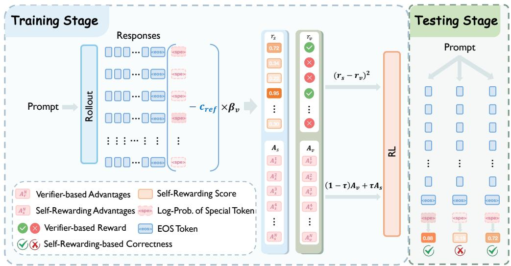
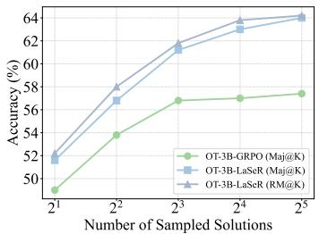
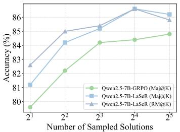
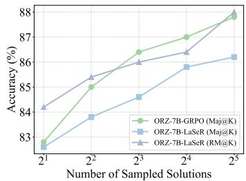
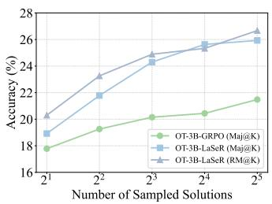
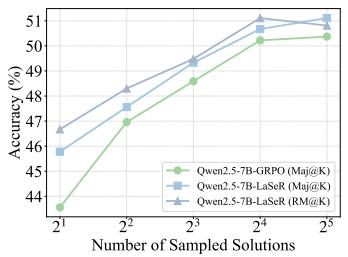
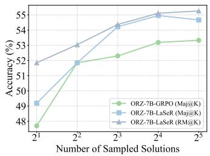
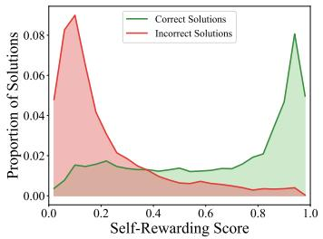
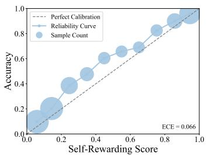
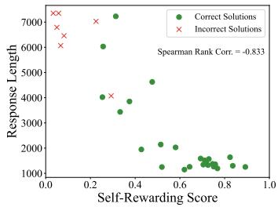

## ABSTRACT

Reinforcement Learning with Verifiable Rewards (RLVR) has recently emerged as a core paradigm for enhancing the reasoning capabilities of Large Language Models (LLMs). To address the lack of verification signals at test time after RLVR, prior studies incorporate the training of model’s self-verification capabilities into the standard RLVR process, thereby unifying reasoning and verification capabilities within a single LLM. However, previous practice requires the LLM to sequentially generate solutions and self-verifications using two separate prompt templates, which doubles the inference cost per sample and significantly reduces efficiency. In this work, we theoretically reveal that the closed-form solution to the RL objective of self-verification training can be approximately reduced to a remarkably simple form: the true reasoning reward of a solution is equal to its last-token self rewarding score, which is computed as the difference between the policy model’s next-token log-probability assigned to any pre-specified token at the solution’s last token and a pre-calculated constant, scaled by the KL coefficient. Based on this insight, we propose LaSeR (Reinforcement Learning with Last-Token Self Rewarding), an algorithm that simply augments the original RLVR loss with a Mean Squared Error (MSE) loss that aligns the last-token self-rewarding scores with the verifier-based reasoning rewards, and jointly optimizes the reasoning and self-rewarding capabilities of LLMs. The optimized self-rewarding scores serve as auxiliary reward signals in both training and testing to enhance model performance. Notably, our algorithm derives these scores from the predicted nexttoken probability distribution of the last solution token immediately after solution generation, thereby incurring only the minimal extra cost of at most one additional token inference. Experimental results show that our method not only improves the reasoning performance of the model also equips it with remarkable self-rewarding capability, thereby further boosting its inference-time scaling performance.

## 1 INTRODUCTION

In the past few years, Large Language Models (LLMs) (Achiam et al., 2023; MetaAI, 2024a; Qwen Team, 2024; Liu et al., 2024a) have advanced significantly, excelling in various domains (Li et al., 2023; Wang et al., 2024b). However, they still face limitations in complex reasoning tasks (AI-MO, 2024a; OpenCompass, 2025; Rein et al., 2024; Jain et al., 2025). Recently, Reinforcement Learning with Verifiable Rewards (RLVR) has shown great promise in enhancing the complex reasoning abilities of LLMs, as demonstrated by OpenAI o1 (Jaech et al., 2024) and DeepSeek-R1 (Guo et al., 2025). By rewarding reasoning paths based on the consistency between final outcomes and ground-truth answers through a deterministic verifier, RLVR incentivizes LLMs to produce more deliberate reasoning chains while effectively mitigating the risk of reward hacking (Gao et al., 2023).

  
Figure 1: The full illustration of our method LaSeR. During training, our approach augments the standard RLVR process with an additional MSE loss between the verifier-based rewards $( r _ { v } )$ and the last-token self-rewarding scores $( r _ { s } )$ , where $r _ { s }$ is the difference between the policy model’s next-token log-probabilities of a pre-specified special token at the final response token and a pre-calculated constant $c _ { \mathrm { r e f } } ,$ scaled by the KL coefficient $\beta _ { v }$ . The optimized self-rewarding scores can serve as auxiliary reward signals in both training and testing to enhance model performance.

Despite its effectiveness, a limitation of standard RLVR is its inability to continue providing verifica tion signals for model outputs in scenarios where ground truth answers are unavailable, such as during test-time inference (Zuo et al., 2025). To address this, the standard approach has been to train an external verifier (Lightman et al., 2023; Snell et al., 2024; Zhang et al., 2024; Gao et al., 2024; Yang et al., 2025b) to evaluate candidate solutions. More recently, in pursuit of endowing models with the ability for autonomous and continual self-improvement (Zuo et al., 2025), several works (Sareen et al., 2025; Liu et al., 2025a; Zha et al., 2025; Jiang et al., 2025) have instead explored jointly optimizing the reasoning and self-verification capabilities of a single policy model within the RLVR framework. However, we argue that these methods have a major issue of inefficiency: the external verifier requires additional training on a separate LLM during or after reinforcement learning (RL); while joint optimization involves generating both solutions and self-verifications sequentially under two separate prompt templates, which doubles the per-sample inference cost and reduces generation efficiency.

In this work, we propose LaSeR (Reinforcement Learning with Last-Token Self-Rewarding), a lightweight and highly effective algorithm that achieves this goal, jointly optimizing reasoning and self-verification capabilities at nearly zero additional cost. Our core insight is that a model’s assessment in its own solution can be captured in the last token’s predicted probability distribution. We first show theoretically that the RL objective of self-verification has a closed-form solution, where the true reasoning reward from the verifier is equal to the next-token log-probability ratio between the policy and reference models for a pre-specified special token (an unused token like “<|vision start|>” that serves as the pre-defined ground truth for verifications on correct candidate solutions) at the last response token, scaled by the KL coefficient. We refer to this scaled logprobability ratio as the last-token self-rewarding score. Furthermore, we observe that for a randomly chosen special token, its predicted log-probability under the reference model is practically a constant, small value across all problems and solutions (see Figure 7 and Figure 8). This enables us to simplify the self-rewarding score into a remarkably simple form that depends only on the policy model’s outputs and a pre-calculated constant, making it exceptionally efficient to compute.

Building on above analysis, we replace the explicit RL optimization for self-verification with a simple Mean Squared Error (MSE) loss. As illustrated in Figure 1, we train the model to align its last-token self-rewarding score with the true reasoning reward from the verifier. In specific, after the policy model generates the solution for each problem, we calculate the last-token self-rewarding score based on its last token’s next-token log-probability for the pre-specified special token, and construct the corresponding MSE loss. This MSE objective is added directly to the standard RLVR loss, allowing for seamless joint optimization for both the reasoning and self-rewarding capabilities of the policy model. At both training and testing time, our method generates each candidate solution and computes the self-rewarding score in a single forward pass, incurring the cost of at most one additional token inference with no extra generation required. This is significantly more efficient than prior approaches, which require a separate inference step. The optimized self-rewarding scores can not only complement the original reasoning rewards during RLVR to further enhance training performance, but also be used at test time to rank and weight solutions for more accurate answer aggregation.

We conduct experiments on both LLaMA3.2 (MetaAI, 2024b) and Qwen2.5 (Qwen Team, 2024) architectures, including pre-trained, mid-trained and reinforced variants, to demonstrate the effectiveness of our method in broader math reasoning tasks. Experimental results show that our methods not only effectively improve the reasoning performance of the policy model, but also allows its self-rewarding accuracy to reach a high level, thereby equipping the model with better confidence calibration of its own outputs and improving its inference-time scaling performance.

## 2 RELATED WORK

RLVR for LLM Reasoning Reinforcement Learning with Verifiable Rewards (RLVR), which sorely calculates binary rewards based on the final answers, has been shown to be highly effective in enhanc ing the reasoning capabilities of LLMs (Jaech et al., 2024; Guo et al., 2025; Team et al., 2025b). Current studies can be categorized into several directions, including but not limited to (1) designing more efficient and effective RLVR algorithms (Schulman et al., 2017; Shao et al., 2024; Yu et al., 2025a; Yue et al., 2025b; Liu et al., 2025b; Zheng et al., 2025; Dai et al., 2026), (2) extending RLVR to gen eral reasoning domain (Ma et al., 2025; Zhou et al., 2025; Yu et al., 2025b) and agent scenarios (Wang et al., 2025b; Team et al., 2025a; Dong et al., 2025), (3) collecting diverse verifiable datasets (Hu et al., 2025; He et al., 2025; Liu & Zhang, 2025; Ma et al., 2025; Fan et al., 2025), and (4) analyzing the mechanisms of RLVR (Mukherjee et al., 2025; Yue et al., 2025a; Wen et al., 2025; Huan et al., 2025).

External Verifiers for LLM Reasoning Training external verifiers to identify the correctness of the LLM-generated solutions is an effective way to enhance the reasoning performance of LLMs in the in ference time. External verifiers usually fall into two categories: (1) Scalar Reward Models: Outcome supervised Reward Models (ORMs) (Cobbe et al., 2021; Yang et al., 2024) and Process-supervised Reward Models (PRMs) (Lightman et al., 2023; Wang et al., 2024a; Skywork-o1, 2024; Yuan et al., 2024) are two representative approaches. ORMs provide supervision by evaluating the final answer, while PRMs offer more fine-grained feedback by assessing the intermediate reasoning steps. (2) Generative Verifiers: Recent studies have explored the potential of training LLMs to perform natural language critiques of reasoning solutions generated by the LLM generators, and then to judge their final outcomes (Zhang et al., 2024; Gao et al., 2024; Yang et al., 2025b; Zhao et al., 2025). This paradigm has demonstrated stronger verification performance than scalar reward models, as it enables the LLM verifier to conduct deliberate chain-of-thought reasoning before arriving at the final judgment.

Self-Verification for LLM Reasoning Several recent studies (Sareen et al., 2025; Liu et al., 2025a; Zha et al., 2025; Jiang et al., 2025; Lu et al., 2025) aim to unify the roles of generator and verifier by equipping a single policy model with self-verification capability. The trained self-verification capability can be used in both the RL training and inference-time scaling stages to enhance the model performance. However, these approaches require generating solutions and self-verifications sequentially during training and inference. In contrast, our method derives the self-rewarding signal directly from the next-token probability distribution of the final token of the generated sequence, achieving a more efficient and effective unification of generation and self-verification. We note that a recent study (Lee et al., 2025) also aims to obtain the self-verification result after producing the solution. As discussed in Section 3.4 and Appendix C, our framework is more general and accommodates it as a special case.

## 3 METHODOLOGY

## 3.1 PRELIMINARIES

RL Objective We denote $\pi _ { \pmb { \theta } }$ as the target policy model to be optimized, and $\pi _ { \mathrm { r e f } }$ as the reference model from which $\pi _ { \theta }$ is initialized. D is the query set, x is an input and y is the generated response to x. The standard optimization objective of RL is formalized as

$$
\mathcal {O} _ {\pi_ {\boldsymbol {\theta}}} = \max _ {\pi_ {\boldsymbol {\theta}}} \mathbb {E} _ {\boldsymbol {x} \sim D, \boldsymbol {y} \sim \pi_ {\boldsymbol {\theta}} (\cdot | x)} \left[ r (\boldsymbol {x}, \boldsymbol {y}) - \beta \mathcal {D} _ {\mathrm{KL}} (\pi_ {\boldsymbol {\theta}} | | \pi_ {\mathrm{ref}}) \right],\tag{1}
$$

where $r ( { \pmb x } , { \pmb y } )$ is a reward function, $\mathcal { D } _ { \mathrm { K L } }$ is the Kullback–Leibler (KL) divergence loss.

RLVR Recently, RLVR (Guo et al., 2025; Hu et al., 2025) has emerged as an effective paradigm for enhancing the reasoning capabilities of LLMs. In RLVR, the reward function r is typically chosen as a deterministic verifier $r _ { v }$ , such as a rule-based verifier, to evaluate whether the final extracted answer $\mathbf { \mu } _ { a \subset \mathbf { \mathcal { y } } }$ matches the ground-truth answer $\pmb { a } ^ { * }$ , and to produce binary feedback $( \mathbf { e } . \mathbf { g } . , \{ 0 , 1 \} )$ . That is,

$$
r _ {v} (\boldsymbol {x}, \boldsymbol {y}) = \mathbb {1} _ {\{\boldsymbol {a} \equiv \boldsymbol {a} ^ {*} \}} = \left\{ \begin{array}{l l} 1 & \text { if   } \boldsymbol {a} \text {   is   semantically   equivalent   to   } \boldsymbol {a} ^ {*}, \\ 0 & \text { otherwise. } \end{array} \right.\tag{2}
$$

Policy Gradient Method Policy Gradient (Sutton et al., 1998) is a widely adopted algorithm to optimize the objective of Eq. (1), which updates the policy model via the estimated gradient

$$
\nabla_ {\pmb {\theta}} \mathcal {O} _ {\pi_ {\pmb {\theta}}} = \mathbb {E} _ {\pmb {x} \sim D, \pmb {y} \sim \pi_ {\pmb {\theta}} (\cdot | x)} \left[ \sum_ {t = 1} ^ {T} A _ {t} \nabla_ {\pmb {\theta}} \log \pi_ {\pmb {\theta}} (y _ {t} | \pmb {x}, \pmb {y} _ {<   t}) \right],\tag{3}
$$

where $A _ { t }$ is the advantage function measuring the relative value of the action $a _ { t } \ ( \mathrm { i . e . }$ , token $y _ { t } )$ compared to the baseline value under state $s _ { t } \ ( \mathrm { i . e . }$ , sequence $( { \pmb x } , { \pmb y } _ { < t } ) )$ . In practice, $A _ { t }$ can be estimated in various ways (Schulman et al., 2017; Ahmadian et al., 2024). For example, Group Relative Policy Optimization (GRPO) (Shao et al., 2024) estimates the baseline value as the average reward within a sampled group $\{ \pmb { y } ^ { 1 } , \cdots , \pmb { y } ^ { K } \}$ for the same problem, and computes the relative advantage for each token $y _ { t } ^ { \ i }$ in sequence $\boldsymbol { y } ^ { \imath }$ as

$$
A _ {t} ^ {i} = \left(r _ {v} ^ {i} - \operatorname{mean} \left(r _ {v} ^ {1}, \dots , r _ {v} ^ {K}\right)\right) / \operatorname{std} \left(r _ {v} ^ {1}, \dots , r _ {v} ^ {K}\right), \quad r _ {v} ^ {i} = r _ {v} \left(\boldsymbol {x}, \boldsymbol {y} ^ {i}\right).\tag{4}
$$

Implicit Reward Previous studies (Rafailov et al., 2023; Peters & Schaal, 2007) have identified that the optimal solution to the objective Eq. (1) satisfies that

$$
r _ {v} (\boldsymbol {x}, \boldsymbol {y}) = \beta \log \left[ \pi_ {\boldsymbol {\theta}} (\boldsymbol {y} | \boldsymbol {x}) / \pi_ {\text { ref }} (\boldsymbol {y} | \boldsymbol {x}) \right] + \beta \log Z (\boldsymbol {x}),\tag{5}
$$

where $\begin{array} { r } { Z ( \pmb { x } ) = \sum _ { \pmb { y } } \pi _ { \mathrm { r e f } } ( \pmb { y } | \pmb { x } ) \exp ( \frac { 1 } { \beta } r _ { v } ( \pmb { x } , \pmb { y } ) ) } \end{array}$ is a partition function. β log $\frac { \pi _ { \theta } ( y | x ) } { \pi _ { \mathrm { r e f } } ( y | x ) }$ is termed as the implicit reward, which has been used in prior works (Mitchell et al., 2024; Liu et al., 2024b) to analyze the behavioral shift induced by the alignment process.

## 3.2 LASER: REINFORCEMENT LEARNING WITH LAST-TOKEN SELF-REWARDING

## 3.2.1 FORMAL FORMULATION

In training, ground-truth answers can be reliably used to determine the correctness of solutions. At test time, however, when ground-truth answers are unavailable, the use of verifiers becomes crucial for evaluating solution quality and providing feedback signals. To address this problem, in this work, we explore the promising paradigm of jointly optimizing the self-verification and reasoning capabilities of LLMs within the RLVR framework, thereby enabling them not only to produce high-quality reasoning paths but also to evaluate their own outputs at test time.

According to Eq. (5), as $Z ( { \pmb x } )$ remains the same for all y, a straight-forward idea is to utilize the implicit reward β log $\frac { \pi _ { \theta } ( y | x ) } { \pi _ { \mathrm { r e f } } ( y | x ) }$ as the indicator to rank different generations at test time. However, this approach has a critical drawback: the absolute value of the implicit reward is length-biased, since the absolute value of β log $\begin{array} { r } { \frac { \pi _ { \theta } ( \pmb { y } | \pmb { x } ) } { \pi _ { \mathrm { r e f } } ( \pmb { y } | \pmb { x } ) } = \beta \sum _ { i } \log \frac { \pi _ { \theta } ( y _ { i } | \pmb { x } , \pmb { y } _ { < i } ) } { \pi _ { \mathrm { r e f } } ( y _ { i } | \pmb { x } , \pmb { y } _ { < i } ) } } \end{array}$ increases proportionally with the response length. In reasoning tasks, the incorrect solutions are usually longer than the correct solutions (Hassid et al., 2025), making the implicit reward unreliable in evaluating solution correctness (see Appendix D). Furthermore, disregarding $Z ( { \pmb x } )$ and directly aligning the implicit reward with the true reasoning reward during training degrades the policy model’s generation ability (Cui et al., 2025), since a fundamental gap $( \mathrm { i . e . , } \beta \log \breve { Z } ( { \pmb x } ) )$ ) exists between the solution to RLVR and that to reward modeling.

In this work, we begin by formulating our approach from the RL objective of verification. Given a problem x, and a candidate solution y, the model is required to produce a verification z to identify the correctness of the solution: $z \sim \pi _ { \pmb { \theta } } ( \cdot | \mathbf { x } , y )$ . Thus, the RL objective of verification can be written as

$$
\mathcal {V} _ {\pi_ {\boldsymbol {\theta}}} = \max _ {\pi_ {\boldsymbol {\theta}}} \mathbb {E} _ {\boldsymbol {x} \sim D, \boldsymbol {y} \sim \pi_ {g} (\cdot | x), \boldsymbol {z} \sim \pi_ {\boldsymbol {\theta}} (\cdot | \boldsymbol {x}, \boldsymbol {y})} \left[ \hat {r} (\boldsymbol {x}, \boldsymbol {y}, \boldsymbol {z}) - \beta_ {v} \mathcal {D} _ {\mathrm{KL}} (\pi_ {\boldsymbol {\theta}} | | \pi_ {\mathrm{ref}}) \right],\tag{6}
$$

where $\pi _ { g }$ is the generator to solve the problem (can also be the target model $\pi _ { \pmb { \theta } }$ itself in the self-verification setting), $\hat { r } ( { \pmb x } , { \pmb y } , z )$ is the verification reward that measures the consistency between the true correctness of y and the verification result of z. In practice, z can be either a single token—for instance, $\cdots \forall \in { \cal S } ^ { \prime \prime }$ or $\ " \mathsf { N o } ^ { \prime \prime }$ to directly indicate whether the solution is verified as correct or incorrect—or a sequence that includes both a chain of thought and the final judgment. In this work, we focus on the former setting and simplify the ground-truth label space to two single tokens $z _ { c } ( \mathrm { e . g . , \tilde { \mathrm { \ell 9 } } { e s ^ { 9 } } } )$ and $z _ { i } ( \mathrm { e . g . } , \mathrm { \uparrow } ^ { \circ } \mathsf { N o } ^ { \mathsf { 3 } } )$ . That is, the verification reward can be formulated $\mathrm { a s } ^ { 2 }$

$$
\hat {r} (\boldsymbol {x}, \boldsymbol {y}, \boldsymbol {z}) = \left\{ \begin{array}{l l} 1 & \left(\boldsymbol {z} = z _ {c} \text {   and   } r _ {v} (\boldsymbol {x}, \boldsymbol {y}) = 1\right) \text {   or   } \left(\boldsymbol {z} = z _ {i} \text {   and   } r _ {v} (\boldsymbol {x}, \boldsymbol {y}) = 0\right) \\ 0 & \text { otherwise. } \end{array} \right.\tag{7}
$$

Similarly, following from Eq. (5), the close-form solution to Eq. (6) can be written as

$$
\hat {r} (\boldsymbol {x}, \boldsymbol {y}, \boldsymbol {z}) = \beta_ {v} \log \frac {\pi_ {\boldsymbol {\theta}} (\boldsymbol {z} | \boldsymbol {x} , \boldsymbol {y})}{\pi_ {\text { ref}} (\boldsymbol {z} | \boldsymbol {x} , \boldsymbol {y})} + \beta_ {v} \log Z (\boldsymbol {x}, \boldsymbol {y}), \quad Z (\boldsymbol {x}, \boldsymbol {y}) = \sum_ {\boldsymbol {z}} \pi_ {\text { ref}} (\boldsymbol {z} | \boldsymbol {x}, \boldsymbol {y}) \exp \left(\frac {1}{\beta_ {v}} \hat {r} (\boldsymbol {x}, \boldsymbol {y}, \boldsymbol {z})\right).\tag{8}
$$

Now, let’s take a closer look at $Z ( { \pmb x } , { \pmb y } )$ . First, for $z \in \{ z _ { c } , z _ { i } \} , \pi _ { \mathrm { r e f } } ( z | x , y )$ is a extremely small positive value for any problem-solution pair $( x , y ) , \mathrm { i . e . , } \pi _ { \mathrm { r e f } } ( z | x , y ) \approx 0$ , for $z \in \{ z _ { c } , \bar { z _ { i } } \}$ . The reason is that the model is not specifically optimized for predicting the next token once it completes the generation and produces the final token (typically the $\cdots < E O S > ^ { , }$ token). We present a numerical analysis to validate this claim in Figure 7 and Figure 8, and we can see the value of $\pi _ { \mathrm { r e f } } ( z | \boldsymbol { x } , y )$ is less than $e ^ { - 9 }$ for common tokens and even less than $e ^ { - 2 0 }$ for unused special tokens. Then, under an appropriate choice of $\beta _ { v }$ we can get

$$
\begin{array}{l} Z (\boldsymbol {x}, \boldsymbol {y}) = \sum_ {\boldsymbol {z}} \pi_ {\mathrm{ref}} (\boldsymbol {z} | \boldsymbol {x}, \boldsymbol {y}) \exp (\frac {1}{\beta_ {v}} \hat {r} (\boldsymbol {x}, \boldsymbol {y}, \boldsymbol {z})) = \sum_ {\boldsymbol {z} \notin \{z _ {c}, z _ {i} \}} \pi_ {\mathrm{ref}} (\boldsymbol {z} | \boldsymbol {x}, \boldsymbol {y}) \exp (\frac {1}{\beta_ {v}} \hat {r} (\boldsymbol {x}, \boldsymbol {y}, \boldsymbol {z})) \\ + \pi_ {\mathrm{ref}} (z _ {c} | \boldsymbol {x}, \boldsymbol {y}) \exp (\frac {1}{\beta_ {v}} \mathbb {I} _ {r _ {v} (\boldsymbol {x}, \boldsymbol {y}) = 1}) + \pi_ {\mathrm{ref}} (z _ {i} | \boldsymbol {x}, \boldsymbol {y}) \exp (\frac {1}{\beta_ {v}} (1 - \mathbb {I} _ {r _ {v} (\boldsymbol {x}, \boldsymbol {y}) = 1})) \\ \approx (1 - 0 - 0) \exp (0) + 0 + 0 = 1 \implies \log Z (\boldsymbol {x}, \boldsymbol {y}) \approx 0. \end{array}\tag{9}
$$

The above analysis reveals that, under our formulation, the partition function can be naturally discarded. Consequently, the optimal solution to Eq. (6) can be approximately reduced to:

$$
\hat {r} (\boldsymbol {x}, \boldsymbol {y}, \boldsymbol {z}) = \beta_ {v} \log [ \pi_ {\boldsymbol {\theta}} (\boldsymbol {z} | \boldsymbol {x}, \boldsymbol {y}) / \pi_ {\mathrm{ref}} (\boldsymbol {z} | \boldsymbol {x}, \boldsymbol {y}) ].\tag{10}
$$

In particular, the true verification reward when the model verifies a solution as correct is:

$$
\hat {r} (\boldsymbol {x}, \boldsymbol {y}, z _ {c}) = r _ {v} (\boldsymbol {x}, \boldsymbol {y}) = \beta_ {v} \log \left[ \pi_ {\boldsymbol {\theta}} (z _ {c} | \boldsymbol {x}, \boldsymbol {y}) / \pi_ {\text { ref }} (z _ {c} | \boldsymbol {x}, \boldsymbol {y}) \right].\tag{11}
$$

The first equation is derived from the definition in $\operatorname { E q . } \left( 7 \right)$ . The second equation reveals that the true reasoning reward is equal to log-probability ratio of the policy model to the reference model at $z _ { c } ,$ scaled by the KL coefficient. Thus, to optimize the model’s verification capability, we do not need to explicitly perform a RLVR procedure. Instead, we can directly optimize the following MSE loss:

$$
L = \mathbb {E} _ {\pmb {x} \sim D, \pmb {y} \sim \pi_ {g} (\cdot | x)} \left(\beta_ {v} \log \bigl [ \pi_ {\pmb {\theta}} (z _ {c} | \pmb {x}, \pmb {y}) / \pi_ {\mathrm{ref}} (z _ {c} | \pmb {x}, \pmb {y}) \bigr ] - r _ {v} (\pmb {x}, \pmb {y})\right) ^ {2}.\tag{12}
$$

Thus, in the self-verification setting where $\pi _ { g } = \pi _ { \theta }$ , we can directly adds the above loss into the origi nal RLVR loss to jointly optimize the reasoning and self-verification capabilities of the policy model:

$$
\mathcal {S} _ {\pi_ {\boldsymbol {\theta}}} = \max _ {\pi_ {\boldsymbol {\theta}}} \mathbb {E} _ {\boldsymbol {x} \sim D, \boldsymbol {y} \sim \pi_ {\boldsymbol {\theta}} (\cdot | x)} \left\{r _ {v} (\boldsymbol {x}, \boldsymbol {y}) - \beta \mathcal {D} _ {\mathrm{KL}} (\pi_ {\boldsymbol {\theta}} \| \pi_ {\text {ref}}) - \alpha \left[ \beta_ {v} \log \frac {\pi_ {\boldsymbol {\theta}} (z _ {c} | \boldsymbol {x} , \boldsymbol {y})}{\pi_ {\text {ref}} (z _ {c} | \boldsymbol {x} , \boldsymbol {y})} - r _ {v} (\boldsymbol {x}, \boldsymbol {y}) \right] ^ {2} \right\},\tag{13}
$$

where α is a loss balancing coefficient. We refer the term $r _ { s } = \beta _ { \imath }$ log $\frac { \pi _ { \theta } ( z _ { c } | \pmb { x } , \pmb { y } ) } { \pi _ { \mathrm { r e f } } ( z _ { c } | \pmb { x } , \pmb { y } ) }$ to the last-token self-rewarding score, since it depends on the log-probability distributions of the last token in $\mathbf { \pmb { y } } .$

## 3.3 OTHER TECHNIQUES

Here, we discuss several practical techniques to further simplify and improve the efficiency and effectiveness of the self-rewarding MSE loss introduced above.

Simplification of the Log-Probability in the Reference Model As illustrated in Figure 7 and Figure 8, the quantity log $\pi _ { \mathrm { r e f } } ( z _ { c } | \boldsymbol { x } , \boldsymbol { y } )$ remains almost constant and stable during policy model’s training. Therefore, we can regard it as a pre-calculated constant $c _ { \mathrm { r e f } }$ in calculating the last-token self-rewarding score during both training and inference. This eliminates the need for forwarding y through the reference model and thus further enhances efficiency. In specific, $c _ { \mathrm { r e f } }$ is the mean value of log $\pi _ { \mathrm { r e f } } ( z _ { c } | \boldsymbol { x } , \boldsymbol { y } )$ on a small set of pre-generated set of $( { \pmb x } , { \pmb y } )$ . Furthermore, based on the findings in Figure 7, we select an unused special token as $z _ { c }$ to make $\pi _ { \mathrm { r e f } } ( z _ { c } | \pmb { x } , \pmb { y } )$ closer to 0 and to further minimize its impact on the approximation of $Z ( { \pmb x } , { \pmb y } ) = 1$ and the stability of training.

Self-Rewarding Loss Re-Weighting During training, the numbers of correct and incorrect solutions are imbalanced, and their ratio dynamically changes. To prevent the last-token self-rewarding score from being biased toward the class with more samples, we apply a class-level loss re-weighting strategy within each optimization step. In each step, we calculate the total numbers of correct and incorrect solutions (identified by the verifier) for all problems in the current batch as $N _ { c }$ and $N _ { i }$ Then, we apply the loss re-weighting as

$$
l = \frac {1}{N _ {c} + N _ {i}} \sum_ {\pmb {x}} \sum_ {\pmb {y}} \left[ w _ {c} \mathbb {1} _ {\{r _ {v} (\pmb {x}, \pmb {y}) = 1 \}} + w _ {i} \mathbb {1} _ {\{r _ {v} (\pmb {x}, \pmb {y}) = 0 \}} \right] \left[ \beta_ {v} \log \pi_ {\pmb {\theta}} (z _ {c} | \pmb {x}, \pmb {y}) - \beta_ {v} c _ {\mathrm{ref}} - r _ {v} (\pmb {x}, \pmb {y}) \right] ^ {2},\tag{14}
$$

where $\begin{array} { r } { w _ { c } = \frac { N _ { c } + N _ { i } } { 2 \times N _ { c } } } \end{array}$ and $\begin{array} { r } { w _ { i } = \frac { N _ { c } + N _ { i } } { 2 \times N _ { i } } } \end{array}$ are re-weighting factors. This practice achieves a more balanced self-verification capability. We provide empirical validations on this in Appendix J.

Integration of Verifier-based and Self-Rewarding-based Advantages The last-token self-rewarding scores can not only be used at test time, but also facilitate the training process through the integration of verifier-based and self-rewarding-based advantages. We believe such practice can help mitigate the issue of misjudgments by rule-based verifiers, which often occur when the format of ground-truth answer is overly complex, and produce more fine-grained rewards. For example, in GRPO, the final advantage can be calculated as:

$$
\begin{array}{c} \hat {A} _ {t} ^ {i} = (1 - \tau) \frac {r _ {v} ^ {i} - \mathrm{mean} (r _ {v} ^ {1} , \cdots , r _ {v} ^ {K})}{\mathrm{std} (r _ {v} ^ {1} , \cdots , r _ {v} ^ {K})} + \tau \frac {r _ {s} ^ {i} - \mathrm{mean} (r _ {s} ^ {1} , \cdots , r _ {s} ^ {K})}{\mathrm{std} (r _ {s} ^ {1} , \cdots , r _ {s} ^ {K})}, \\ \text {where} r _ {v} ^ {i} = r _ {v} (\boldsymbol {x}, \boldsymbol {y} ^ {i}) \text {and} r _ {s} ^ {i} = \beta_ {v} \log \pi_ {\boldsymbol {\theta}} (z _ {c} | \boldsymbol {x}, \boldsymbol {y} ^ {i}) - \beta_ {v} c _ {\mathrm{ref}}. \end{array}\tag{15}
$$

To stabilize training, we adopt a filtering strategy that sets $\tau = 0$ for any group whenever the standard deviation $\mathrm { s t d } ( r _ { s } ^ { 1 } , \cdots , r _ { s } ^ { K } )$ within this group falls below a threshold T, which is set to 0.1.

Separate Warm-Up of Reasoning and Self-Rewarding Capabilities During the initial phase of training, we optimize only the last-token self-rewarding score, without integrating self-rewardingbased advantages into the learning process. After a certain steps when the last-token self-rewarding loss is sufficiently small, we proceed to integrate verifier-based and self-rewarding-based advantages. Moreover, when training from base $( \mathrm { i . e . }$ , pre-trained) models, we first perform standard RLVR without incorporating the last-token self-rewarding loss in order to warm up the model’s reasoning capability, followed by a warm-up phase for the self-rewarding capability before the advantage integration.

By combining all the aforementioned techniques, our full algorithm Reinforcement Learning with Last-Token Self-Rewarding (LaSeR), is summarized in Algorithm 1 and illustrated in Figure 1. During the testing phase, once the model generates a solution, we compute the last-token selfrewarding score based on $r _ { s } = \beta _ { v } \log \pi _ { \theta } \big ( z _ { c } | \pmb { x } , \pmb { y } \big ) - \beta _ { v } c _ { \mathrm { r e f } }$ . We then clip it into the interval [0, 1]. Notably, we point out that this clipping is optional: after optimization, the self-rewarding scores naturally fall within [0, 1] (refer to Table 7), further validating the boundedness of our self-scoring mechanism. The comparison between this score and 0.5 determines the self-verification outcome of the solution, or the score itself can be further used to perform weighted majority voting.

## 3.4 BRIEF DISCUSSION

Comparison Between LaSeR and Prior Approaches Compared with previous methods (Sareen et al., 2025; Liu et al., 2025a; Zha et al., 2025) that requires the policy model to perform separate generations for solutions and verifications, our method directly derives the self-rewarding result from the next-token log-probability of the final solution token. In the RL process, the computation of token log-probabilities is typically carried out after all the generations are completed (Sheng et al., 2024). Therefore, we can directly replace the token id of the first padding token with the token id of the pre-specified token before computing the log-probabilities of the sequences, thereby incurring no additional computation cost during training. During inference, our method requires only one more token inference after the solution is completed, which substantially reduces the computational cost compared to previous methods.

Difference Between Last-Token Self-Rewarding Loss and Supervised Fine-Tuning Loss An alternative to train the self-verification capability is to optimize the following SFT/BCE loss by maximizing the next-token probability of the token $z _ { c } \ 0 \mathrm { r } \ z _ { i }$ based on the context $( { \pmb x } , { \pmb y } )$

$$
L _ {S F T} = - \mathbb {E} _ {\boldsymbol {x} \sim D, \boldsymbol {y} \sim \pi_ {g} (\cdot | x)} \left[ r _ {v} (\boldsymbol {x}, \boldsymbol {y}) \cdot \log \pi_ {\boldsymbol {\theta}} (z _ {c} | \boldsymbol {x}, \boldsymbol {y}) + (1 - r _ {v} (\boldsymbol {x}, \boldsymbol {y})) \cdot \log \pi_ {\boldsymbol {\theta}} (z _ {i} | \boldsymbol {x}, \boldsymbol {y}) \right].\tag{16}
$$

The major difference between SFT loss and our last-token self-rewarding loss in Eq. (12) is that the SFT loss drives $\pi _ { \pmb { \theta } } ( z _ { c } | \pmb { x } , \pmb { y } )$ to fit 1 when $r _ { v } ( { \pmb x } , { \pmb y } ) = 1$ , which may lead to strong interference with the optimization of reasoning capability. In contrast, our loss drives $\pi _ { \pmb { \theta } } ( z _ { c } | \pmb { x } , \pmb { y } )$ toward $\exp ( 1 / \beta _ { v } )$ $\pi _ { \mathrm { r e f } } ( z _ { c } | \pmb { x } , \pmb { y } )$ for $r _ { v } ( { \pmb x } , { \pmb y } ) = 1 . 0 $ . When $\beta _ { v }$ is relatively large, $\pi _ { \pmb { \theta } } ( z _ { c } | \pmb { x } , \pmb { y } )$ remains still very small, thereby exerting only a negligible influence on the original RLVR optimization $( \mathrm { e . g . , } \pi _ { \theta } \big ( z _ { c } | \mathbf x , \pmb y ) =$ $e ^ { - 1 3 }$ when $\pi _ { \mathrm { r e f } } \widetilde { ( z _ { c } | \mathbf { x } , \mathbf { y } ) } = \overline { { e } } ^ { - \widetilde { 2 } 3 }$ and $\beta _ { v } = 0 . 1 )$ . We provide further discussions in Appendix C and put the empirical comparison in Appendix K.

## 4 EXPERIMENTS

## 4.1 EXPERIMENTAL SETTINGS

Base Models and Baselines We conduct empirical validations on both LLaMA3.2 MetaAI (2024b) and Qwen2.5 (Qwen Team, 2024) architectures, including three base models: OctoThinker-3B-Short Base (Wang et al., 2025a) (mid-trained version of LLaMA3.2-3B-Base), Qwen2.5-7B-Base (Qwen Team, 2024) (pre-trained model) and Open-Reasoner-Zero-7B (Hu et al., 2025) (reinforced version of Qwen2.5-7B-Base). In principle, our method can be seamlessly integrated into any RLVR framework, as it only introduces an additional MSE loss term. In the main experiments, we adopt the widely used GRPO (He et al., 2025) as the base algorithm and primarily investigate the effectiveness of applying our method within GRPO. We also conduct experiments with PPO (Schulman et al., 2017) to demonstrate the generalizability of our method, and present the corresponding results in Appendix Q.

Training and Evaluation Datasets We adopt DeepMath-103K (He et al., 2025), a large-scale and high-quality mathematical reasoning dataset, for our RL training data. In testing, we evaluate both the reasoning and self-verification performance of each model on five typical math reasoning benchmarks: MATH500 (Hendrycks et al., 2021), AMC23 (AI-MO, 2024b), AIME24 (AI-MO, 2024a), AIME25 (OpenCompass, 2025), and OlympiadBench (He et al., 2024). Additionally, we also perform experiments in the general reasoning domain to validate the effectiveness of our method in general reasoning tasks beyond math reasoning. The results and analysis are in Appendix R.

Training Settings The detailed training hyper-parameters of GRPO are put in Appendix G. The prompt template for each model is in Appendix T. When applying our method, we set the hyperparameters $\bar { ( \beta _ { v } , \alpha , \tau ) } = ( 0 . 1 , 0 . 1 , 0 . 1 )$ (refer to Appendix $\mathrm { I } ) . \ z _ { c }$ is selected as “<vision start>” for Qwen2.5-7B-Base and Open-Reasoner-Zero-7B, and “<reserved special token $\mathbf { \nabla } _ { - } \boldsymbol { \theta } > ^ { , , }$ for OctoThinker-3B-Short-Base. The simplified constant of the reference log-probability, $c _ { \mathrm { r e f } } , \mathrm { i s - 2 3 . 0 }$ for Qwen2.5-7B-Base and Open-Reasoner-Zero-7B, and −25.0 for OctoThinker-3B-Short-Base, as estimated from the results in Figure 7. More details are in Appendix G.

Evaluation Settings During generation, we set both the temperature and top p to 1.0 for all models. The max generation len is 8192. On MATH500 and OlympiadBench, we sample 2 solutions for each problem; whereas on AMC23, AIME24, and AIME25, we sample 32 solutions per problem. We then report the average Pass@1 accuracy of each model on each benchmark. We also evaluate the self-verification performance of each model by computing the self-verification F1 score, defined as the harmonic mean of self-verification accuracy on self-generated correct and incorrect solutions. Baselines perform self-verification based on the prompt in Appendix T. Any solution without a final answer is automatically treated as incorrect and excluded from the verification accuracy calculation. Detailed self-verification accuracy results are provided in Appendix N.

## 4.2 MAIN RESULTS AND ANALYSIS

We put the main results in Table 1. The key conclusion is that, across different model variants, our method not only yields better reasoning performance for the policy model compared with

Table 1: Reasoning and self-verification performance of each model on five mathematical reasoning benchmarks. We do not report the results of OctoThinker-based models on AIME24-25, as the number of correct solutions is quite insufficient for a reliable evaluation.

<table><tr><td rowspan="2">Method</td><td colspan="6">Reasoning Accuracy</td><td colspan="6">Self-Verification F1 Score</td></tr><tr><td>MATH-500</td><td>AMC-23</td><td>AIME-24</td><td>AIME-25</td><td>Olym.-Bench</td><td>Avg.</td><td>MATH-500</td><td>AMC-23</td><td>AIME-24</td><td>AIME-25</td><td>Olym.-Bench</td><td>Avg.</td></tr><tr><td colspan="13">OctoThinker-3B-Short-Base</td></tr><tr><td>Base</td><td>3.7</td><td>1.3</td><td>-</td><td>-</td><td>1.0</td><td>2.0</td><td>22.3</td><td>11.2</td><td>-</td><td>-</td><td>13.7</td><td>15.7</td></tr><tr><td>GRPO</td><td>49.8</td><td>25.3</td><td>-</td><td>-</td><td>17.3</td><td>30.8</td><td>56.9</td><td>47.3</td><td>-</td><td>-</td><td>48.8</td><td>51.0</td></tr><tr><td>LaSeR</td><td>53.1</td><td>27.0</td><td>-</td><td>-</td><td>18.2</td><td>32.8</td><td>73.6</td><td>70.2</td><td>-</td><td>-</td><td>73.6</td><td>72.5</td></tr><tr><td>-SWA</td><td>52.9</td><td>26.1</td><td>-</td><td>-</td><td>18.2</td><td>32.4</td><td>80.4</td><td>70.9</td><td>-</td><td>-</td><td>66.0</td><td>72.4</td></tr><tr><td colspan="13">Qwen2.5-7B-Base</td></tr><tr><td>Base</td><td>35.8</td><td>20.6</td><td>3.5</td><td>1.6</td><td>12.3</td><td>14.8</td><td>36.4</td><td>30.8</td><td>27.6</td><td>32.9</td><td>36.9</td><td>32.9</td></tr><tr><td>GRPO</td><td>79.9</td><td>55.9</td><td>16.2</td><td>13.8</td><td>43.3</td><td>41.8</td><td>54.6</td><td>59.7</td><td>36.6</td><td>41.5</td><td>53.5</td><td>49.2</td></tr><tr><td>LaSeR</td><td>80.2</td><td>58.1</td><td>15.4</td><td>15.7</td><td>44.1</td><td>42.7</td><td>83.2</td><td>82.5</td><td>79.6</td><td>74.3</td><td>78.3</td><td>79.6</td></tr><tr><td>-SWA</td><td>78.0</td><td>58.3</td><td>15.4</td><td>12.3</td><td>41.7</td><td>41.1</td><td>79.7</td><td>80.2</td><td>81.3</td><td>74.9</td><td>83.3</td><td>79.9</td></tr><tr><td colspan="13">Open-Reasoner-Zero-7B</td></tr><tr><td>Base</td><td>81.9</td><td>60.3</td><td>15.6</td><td>15.1</td><td>46.9</td><td>44.0</td><td>26.7</td><td>51.3</td><td>45.9</td><td>55.2</td><td>37.5</td><td>43.3</td></tr><tr><td>GRPO</td><td>83.1</td><td>61.9</td><td>18.1</td><td>15.0</td><td>47.1</td><td>45.0</td><td>57.1</td><td>44.8</td><td>14.6</td><td>28.1</td><td>49.5</td><td>38.8</td></tr><tr><td>LaSeR</td><td>82.8</td><td>62.7</td><td>19.1</td><td>15.1</td><td>47.8</td><td>45.5</td><td>87.2</td><td>79.7</td><td>64.6</td><td>77.7</td><td>78.7</td><td>77.6</td></tr><tr><td>-SWA</td><td>83.2</td><td>62.6</td><td>19.0</td><td>14.5</td><td>47.6</td><td>45.4</td><td>87.5</td><td>77.7</td><td>63.3</td><td>77.3</td><td>77.9</td><td>76.7</td></tr></table>

Table 2: Comparison of verification F1 scores between LaSeR (self-rewarding) and external reward models on responses generated by the same policy model Open-Reasoner-Zero-7B-LaSeR. Bold indicates the best result, and underline indicates the second-best.

<table><tr><td>Method</td><td>MATH500</td><td>AMC23</td><td>AIME24</td><td>AIME25</td><td>Olym.</td><td>Avg.</td></tr><tr><td>Qwen2.5-Math-7B-PRM800K (7B RM)</td><td>56.3</td><td>42.5</td><td>51.4</td><td>50.8</td><td>38.5</td><td>47.9</td></tr><tr><td>Qwen2.5-Math-PRM-7B (7B RM)</td><td>86.0</td><td>79.6</td><td>70.8</td><td>67.3</td><td>76.0</td><td>75.9</td></tr><tr><td>Qwen2.5-Math-RM-72B (72B RM)</td><td>86.8</td><td>79.4</td><td>71.0</td><td>71.4</td><td>75.5</td><td>76.8</td></tr><tr><td>Open-Reasoner-Zero-7B-RM (7B RM)</td><td>85.9</td><td>78.1</td><td>73.8</td><td>79.2</td><td>77.3</td><td>78.9</td></tr><tr><td>LaSeR (7B Self-Rewarding)</td><td>87.2</td><td>79.7</td><td>64.6</td><td>77.7</td><td>78.7</td><td>77.6</td></tr></table>

## the baseline, but also substantially enhances its self-verification capability by enabling the self-rewarding scores to achieve remarkably high F1 scores.

Regarding reasoning performance, applying our algorithm leads to higher accuracy in most settings and consistently yields higher average accuracy on the three base models. We think there are two main reasons for this improvement: (1) First, our method encourages the model to encode its assessment of the overall solution in the final response token, which leads to better confidence calibration. Improved calibration itself can have a positive impact on the model’s learning. (2) Second, by integrating self rewarding-based advantages into verifier-based advantages, our approach enables more fine-grained advantage estimation, which in turn facilitates more effective learning. For comparison, we report the results without self-rewarding-based advantages (-SWA) in Table 1. Regarding self-verification performance, applying a simple last-token self-rewarding MSE loss substantially enhances the selfrewarding capability of the models, achieving around 80% F1 scores. This demonstrates strong self-verification accuracy on both correct and incorrect solutions. To further highlight the selfrewarding capabilities, we display the comparison results of verification F1 scores between LaSeR and several advanced external reward models (Qwen2.5-Math-7B-PRM800K (Zhang et al., 2025), Qwen2.5-Math-PRM-7B (Zhang et al., 2025), and Qwen2.5-Math-RM-72B (Yang et al., 2024)) on evaluating the solutions generated by the different reinforced models by LaSeR. The full results are in Table 6, while here we only display the results on Open-Reasoner-Zero-7B-LaSeR in Table 2. Moreover, to ensure a fairer comparison, we additionally train an ORM using the same backbone (Open-Reasoner-Zero-7B) and on the same data distribution (a total of 500K responses generated by Open-Reasoner-Zero-7B-LaSeR on DeepMath-103K), resulting in Open-Reasoner-Zero-7B-RM. The comparison results demonstrate the great effectiveness of self-rewarding. Moreover, it is worth noting that training and employing external reward models introduces additional computational overhead during both training and inference. In contrast, our method jointly optimizes the reasoning and self-rewarding capabilities within the RLVR framework and obtains the verification outcomes directly after solution generation, incurring no extra computational cost at either training or test time. Furthermore, in Appendix P, we show that the model optimized through LaSeR can even score the outputs of other models, demonstrating strong generalization in cross-model verification.

  
(a) Results of OT-3B-based models on MATH500

  
(b) Results of Qwen2.5-7B-based models on MATH500

  
(c) Results of ORZ-7B-based models on MATH500

  
(d) Results of OT-3B-based models on OlympiadBench

  
(e) Results of Qwen2.5-7B-based models on OlympiadBench

  
(f) Results of ORZ-7B-based models on OlympiadBench  
Figure 2: The majority voting (Maj@K) and weighted majority voting (RM@K) results.

## 4.3 INFERENCE-TIME SCALING RESULTS

Here, we explore the effectiveness of self-rewarding in the inference-time scaling via weighted majority voting. We compare majority voting results with (RM@K) and without (Maj@K) weighting by the last-token self-rewarding scores, on MATH500 and OlympiadBench. The results are shown in Figure 2. We denote the three base models by “OT-3B”, “Qwen2.5-7B”, and “ORZ-7B”. The suffixes “-GRPO” and “-LaSeR” indicate the variants trained with GRPO and our method LaSeR, respectively. The results show that the optimized self-rewarding capability of the model is highly effective on improving its own inference-time scaling performance.

## 5 ANALYSIS

## 5.1 MORE CALIBRATION ANALYSIS OF SELF-REWARDING SCORES

In this section, we conduct additional calibration analysis to better understand the properties of our self-rewarding scores. We take Open-Reasoner-Zero-7B-LaSeR as the experimental model. To ensure reliability, we sample 32 times for each query in the following analysis.

We first visualize the distribution of optimized self-rewarding scores on OlympiadBench in Figure 3. Furthermore, we analyze the average AUROC score of the self-rewarding scores with respect to correctness. The AUROC is defined as the probability that, within the same query group (solutions generated for the same query), a correct solution receives a higher self-rewarding score than an incorrect one. The full results are in Table 9. These results re-validate the high discriminative power of the self-rewarding score between correct and incorrect solutions.

Then, we calculate and report the Expected Calibration Error (ECE) of all self-rewarding scores on each test set. ECE quantifies the discrepancy between a self-rewarding score and its empirical accuracy. The results on OlympiadBench are in Figure 4, while we put the full results in Table 10. As shown, our method demonstrates strong confidence calibration results.

  
Figure 3: Self-rewarding score distribution on OlympiadBench.

  
Figure 5: Relationship between response lengths and selfrewarding scores.

Table 3: Comparison of reasoning and self-verification performance with and without reference log-probability simplification in our method. Base model is Open-Reasoner-Zero-7B.

<table><tr><td rowspan="2">Method</td><td colspan="6">Reasoning Accuracy</td><td colspan="6">Self-Verification F1 Score</td></tr><tr><td>MATH-500</td><td>AMC-23</td><td>AIME-24</td><td>AIME-25</td><td>Olym.-Bench</td><td>Avg.</td><td>MATH-500</td><td>AMC-23</td><td>AIME-24</td><td>AIME-25</td><td>Olym.-Bench</td><td>Avg.</td></tr><tr><td>w/ Simpl.</td><td>82.5</td><td>61.6</td><td>18.8</td><td>16.2</td><td>46.5</td><td>45.1</td><td>82.3</td><td>79.3</td><td>77.9</td><td>79.2</td><td>78.4</td><td>79.4</td></tr><tr><td>w/o Simpl.</td><td>81.0</td><td>61.2</td><td>17.3</td><td>17.3</td><td>48.3</td><td>45.0</td><td>81.8</td><td>79.2</td><td>79.0</td><td>78.9</td><td>77.5</td><td>79.3</td></tr></table>

Finally, we analyze the effect of response lengths. We visualize the relationship between response lengths and self-rewarding scores within a single chosen query group from OlympiadBench in Figure 5 as a preliminary analysis. Then, we calculate and report the average Spearman Rank Correlation between self-rewarding scores and response lengths over all query groups on each test set in Table 11. These results reveal that shorter responses generally tend to receive higher self-rewarding scores, which is consistent with recent findings (Hassid et al., 2025; Yang et al., 2025c) that shorter CoTs on the same query are generally more preferable.

## 5.2 THE IMPACT OF SIMPLIFYING THE REFERENCE LOG-PROBABILITIES TO A CONSTANT

As discussed in Section 3.3, we approximate the log-probability of the pre-specified token under the reference model, log $\pi _ { \mathrm { r e f } } ( z _ { c } | \boldsymbol { x } , \boldsymbol { y } )$ , by its mean computed over a small sample set when calculating the last-token self-rewarding scores. Here, we empirically validate this practice by conducting comparison experiments on Open-Reasoner-Zero-7B, with and without reference log-probability simplification in our method. We evaluate the checkpoint after 200 optimization steps in each setting (corresponding to the last checkpoint before advantage integration). The results are reported in Table 3. As shown, the simplification does not affect the optimization of reasoning and selfrewarding capabilities, since the performance under the two settings remains comparable. However, it effectively reduces the computational cost of calculating the last-token self-rewarding value by half.

## 6 CONCLUSION

In this work, we propose LaSeR, a lightweight and effective algorithm that jointly optimizes the reasoning and self-rewarding capabilities of LLMs. By deriving the closed-form solution to the RL objective of verification, we uncover a concise yet intriguing formula: the true reasoning reward provided by the verifier is equal to the last-token self-rewarding score produced by the model. This self-rewarding score depends on the model’s next-token log-probability for a pre-specified token at the final response token, a pre-calculated constant, and the KL coefficient. Based on this insight, our method simply adds a MSE loss between the verifier-based reasoning rewards and the corresponding last-token self-rewarding scores into the standard RLVR process. The optimized self-rewarding scores can not only be incorporated back into the RL process to further enhance training, but also achieve high verification accuracy at test time, thereby improving solution ranking and selection.