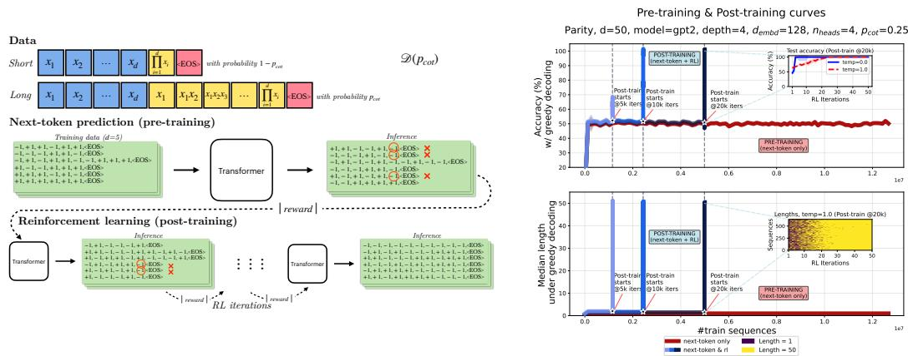
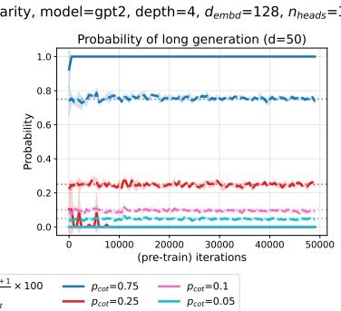
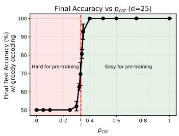
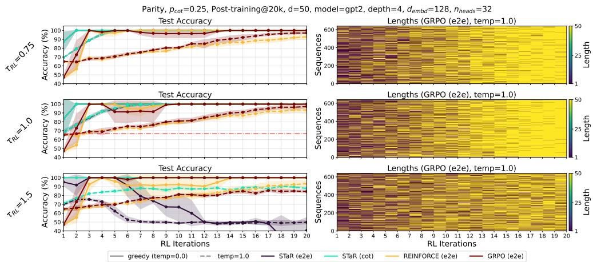
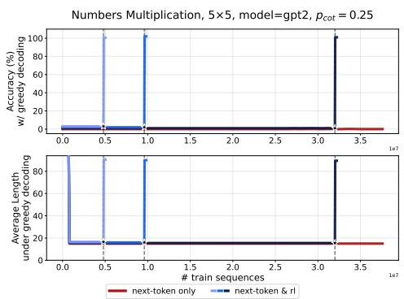
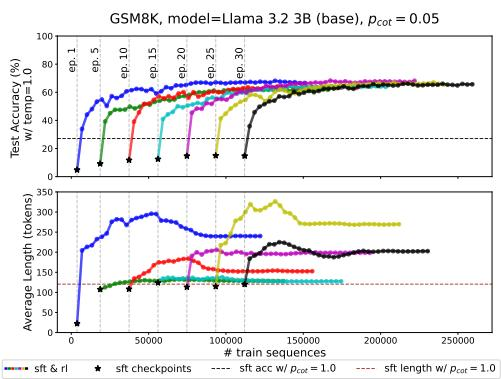

## ABSTRACT

Recent advances in reasoning domains with neural networks have primarily been enabled by a training recipe that optimizes Large Language Models, previously trained to predict the next-token in a sequence, with reinforcement learning algorithms. We introduce a framework to study the success of this paradigm, and we theoretically expose the optimization mechanisms by which reinforcement learning improves over next-token prediction in this setting. We study learning from mixture distributions of short and long “chain-of-thought” sequences encoding a single task. In particular, when the task consists of predicting the parity of d bits and long sequences are rare, we show how reinforcement learning after next-token prediction enables autoregressive transformers to generalize, whereas mere next-token prediction requires extreme statistical or computational resources to do so. We further explain how reinforcement learning leverages increased test-time computation, manifested in longer responses, to facilitate this learning process. In a simplified setting, we theoretically prove that autoregressive linear models following this training recipe can efficiently learn to predict the parity of d bits as long as the proportion of long demonstrations in the data mix is not exponentially small in the input dimension d. Finally, we demonstrate these same phenomena in other settings, including the post-training of Llama-series models on mixture variations of common mathematical reasoning benchmarks.

## 1 INTRODUCTION

The application of reinforcement learning techniques to large neural networks has led to many machine learning advances and successes (Silver et al., 2016; 2017; Berner et al., 2019; Bakhtin et al., 2023). In the realm of Large Language Models (LLMs), a recent paradigm that leverages reinforcement learning consists of two main ingredients: training a large model, such as an autoregressive transformer (Vaswani et al., 2017) on diverse types of data (sequences) from the web with a next-token prediction objective (Radford et al., 2019), followed by a fine-tuning stage with a reinforcement learning algorithm that seeks to improve model generations with respect to a reward function $^{1}$ . The latter part is, simply put, a guess-and-check procedure (Recht, 2025): the model generates one or more guesses per prompt, a reward function evaluates them (usually for correctness), and training proceeds on (prompts, guesses) with a next-token prediction loss that weights each sequence according to its reward. When this procedure is applied on a frontier model using a mathematical, logical or reasoning reward, it leads to rapid increase in the model's capabilities in related domains and is often accompanied by a significant length increase in model response. Prominent examples of such “reasoning” language models include OpenAI’s o1 model (Jaech et al., 2024) and Deepseek’s R1 model (DeepSeek-AI et al., 2025). The prolonged LLM generation that precedes an answer has been dubbed the “thinking process” of the model, as it often resembles the “chain-of-thought” (Nye et al., 2021; Wei et al., 2022) of a human expert solving said task.

  
Figure 1: Left: An illustration of our main learning setting: a mixture of long and short sequences encoding the parity of d bits, along with a representation of pre-training and post-training for d=5. Right: Advantage of next-token prediction followed by reinforcement learning over mere next-token prediction in predicting the parity of d=50 bits with a transformer trained from scratch. The red line corresponds to pre-training using next-token prediction, while blue lines correspond to the same pre-training runs, each followed by GRPO (with a final token accuracy reward) from a different checkpoint. Lines correspond to median across 3 seeds. Top: Test accuracy under greedy decoding. Bottom: Median length of model response under greedy decoding. The inset figures zoom-in on the curves during post-training. Accuracy plateaus around 50% (random guess) during pre-training and then immediately grows during post-training. Also, length increases during post-training.

In this paper, we study how autoregressive models succeed in solving challenging prediction tasks by following this training recipe (next-token prediction followed by reinforcement learning $^{2}$ ). To provide a theoretical account, we make a central simplification: we assume that pre-training data already contain correct and elaborate but perhaps rare demonstrations for a task of interest. We argue this is a natural and productive way to view internet-scale data, even for the most challenging tasks. Based on this modeling assumption, we study and explain:

1. Why in certain cases it is difficult for a model to generalize during pre-training.

2. How reinforcement learning (RL) leads to a rapid improvement in terms of samples, and

3. What optimization pressures cause increase in the length of the response.

Specifically, we study learning from a distribution that contains both short and long, chain-of-thought-like, sequences encoding a single task. The first part of the paper (Sections 2, 3, 4) is devoted to the task of predicting the parity of d bits, while later on we consider more variations of this learning setup. Predicting the parity, or XOR, of objects has been an influential learning problem in the study of artificial neural networks (Minsky & Papert, 1969; Shalev-Shwartz et al., 2017; Daniely & Malach, 2020; Abbe et al., 2023; Barak et al., 2022; Glasgow, 2024), statistical learning more broadly (Kearns, 1998) and biological learning in animals (Howard et al., 2022). Through extensive empirical simulations on transformers trained from scratch (Section 3), we show that if the task complexity is high (large input dimension d) and long demonstrations are scarce, then mere next-token prediction results in a model that fails to predict the parity on unseen examples. On the other hand, when switching to an RL algorithm with a correctness reward, model performance improves rapidly and the length of the generated sequences increases. The results hold for a large array of model choices, problem and optimization hyperparameters, and reinforcement learning algorithms. Figure 1 (Left: Illustration, Right: Simulations) summarizes the landscape.

We demonstrate that this learning behaviour is primarily driven by two factors: (a) during pre-training, the model learns much faster from long demonstrations than from short ones and remains calibrated in how often it generates long versus short responses, and (b) during post-training, when we reward successful generations and train with a reward-weighted loss, we tend to amplify the presence of long responses in the training batches, as the model has a much higher probability of being correct when the response is long rather than short. This is the mechanism that leads to length increase which in turn enables generalization. We must emphasize that the transformer's inability to learn during pre-training in this setup is not due to insufficient model size or depth, but rather due to insufficient number of samples; an estimation, not an approximation, limitation.

In Section 4, we theoretically capture most of the previously observed phenomena in a simplified setting. Let $p_{\mathrm{cot}}$ be the proportion of long data in the parity mixture distribution $\mathcal{D}(p_{\mathrm{cot}})$ . We analyze pre-training (next-token prediction) with Stochastic Gradient Descent on $\mathcal{D}(p_{\mathrm{cot}})$ for an autoregressive architecture that consists of a series of linear models (Malach, 2024), while for post-training, we consider the STaR algorithm (Zelikman et al., 2022) (which is a REINFORCE (Williams, 1992)-type algorithm) with a reward that verifies correctness of the whole chain-of-thought. In this setting, we prove that the model: (a) fails to generalize under greedy decoding during the course of pre-training if long demonstrations are rare (i.e., if $p_{\mathrm{cot}} < 1/3$ , which matches the empirical threshold observed with transformers) (Theorem 1), (b) learns fast from long demonstrations and remains length-calibrated (Theorem 1), and (c) succeeds in generalizing after the completion of both pre- and post-training in $O(\mathrm{poly(d)})$ SGD iterations, provided that long demonstrations are not exponentially rare in the data distribution, while this is accompanied with length increase during RL (Theorem 2). The analysis captures the immediate progress during RL seen in practice: as we show, only $O\left(\log \frac{1 - p_{\mathrm{cot}}}{p_{\mathrm{cot}}}\right)$ RL rounds suffice to obtain a generalizing model. To the best of our knowledge, this suite of results provides the first theoretical separation between next-token prediction and next-token prediction combined with RL in the autoregressive setting, as well as the first optimization result demonstrating length increase during RL in LLMs.

Finally, in Section 5, we experimentally probe the same behavior in other settings, including GPT2 (Radford et al., 2019) models trained from scratch on the task of number multiplication, and pre-trained Llama 3-8B models (Dubey et al., 2024) that are fine-tuned (first to predict the next-token and then with RL) on a short/long mixture version of common reasoning benchmarks (GSM8K (Cobbe et al., 2021) and MATH (Hendrycks et al., 2021) datasets).

## 2 SETUP: MIXTURE OF LONG AND SHORT SEQUENCES ENCODING PARITY

In this section, we present our main learning problem and the models and algorithms we consider.

Data We study the task of predicting the parity of d bits given access to a source of sequences which either consist of: (i) input bits and their parity, or (ii) input bits, intermediate computations and the final parity – see Figure 1 for a demonstration. Let $X = \{\pm1\}^{d}$ be the input space of d bits and $Y = \{\pm1, <EOS>\}^{*}$ be the output space of sequences, where $<EOS>$ is a special symbol denoting the end of a string. Let $\mathcal{D}(p_{\mathrm{cot}})$ be a distribution over $X \times Y$ , parameterized by $p_{\mathrm{cot}} \in [0, 1]$ , such that $^{3}$ : $x_{1}, \ldots, x_{d} \sim \operatorname{Rad}(1/2)$ and $(y_{1}, \ldots, y_{d+1}) = Z(x_{1}, x_{1}x_{2}, \ldots, \prod_{i=1}^{d} x_{i}, <EOS>) + (1 - Z)\left(\prod_{i=1}^{d} x_{i}, <EOS>\right)$ where $Z \sim \operatorname{Ber}(p_{\mathrm{cot}})$ . We will primarily be focused on the case where the mixture weight $p_{cot}$ is small, i.e., where the distribution contains more short responses than long.

Predicting the parity of uniform random bits is a difficult learning problem for neural networks, as it is believed to require exponentially many samples/iterations (Shalev-Shwartz et al., 2017; Daniely & Malach, 2020; Shoshani & Shamir, 2025). On the other hand, when intermediate computations are available in the form of an elaborate chain of thought, the parity function, as any other binary computable function, can be learned efficiently (Joshi et al., 2025; Malach, 2024; Wies et al., 2023).

Models In our experiments, we train decoder-only transformers (Vaswani et al., 2017), a standard approach for language and sequence modeling. We experiment with the GPT-2 (Radford et al., 2019) and Mistral (Jiang et al., 2023) variants of the transformer architecture. See Appendix C.1 for further details on the specifics of the architectures.

  
Figure 2: Pre-training of transformers on mixture of long and short sequences encoding the parity of $d$ bits. Left: Test accuracy during the course of pre-training. Center: The probability that a model's generation length is equal to the maximum length present in the training distribution (which equals $d$ ). Solid lines correspond to greedy decoding, while dashed lines correspond to sampling with temperature 1. Each color denotes a training distribution with a separate mixture coefficient $p_{\mathrm{cot}}$ . Figure shows average and 1 standard deviation across 3 seeds. Right: Test accuracy with greedy decoding at the end of pre-training (50k iterations) versus mixture coefficient $p_{\mathrm{cot}}$ . The red dashed line corresponds to the critical threshold. Each bullet is the median of 3 runs.

Pre-training In the first stage of training (pre-training), we train a transformer to estimate the probability of the next token on sequences drawn from $\mathcal{D}(p_{\mathrm{cot}})$ (Radford et al., 2019). We consider online learning, sampling a fresh batch of data at each iteration.

Post-training After several steps of pre-training, we switch training algorithm and further optimize the model with reinforcement learning methods. We consider three reinforcement learning algorithms: STaR (Zelikman et al., 2022), REINFORCE (Williams, 1992) and GRPO (Shao et al., 2024). At a high level, all three algorithms seek to maximize the reward of model generations. We defer their description to Appendix A due to space constraints. We focus on two types of rewards:

End-to-end correctness: The reward function assesses whether the last token is equal to the correct answer: $r_{\mathrm{e2e}}(\mathbf{x},y) = \mathbb{1}\left\{y[-1] = \prod_{i=1}^{d} x_i\right\}$ , where $y[-1] \in \{\pm 1\}$ denotes the token appearing right before the <EOS> token in sequence y.

Chain-of-thought correctness: The reward function assesses whether the whole sequence is valid: $r_{\mathrm{cot}}(\mathbf{x},y)=1\left\{y=\left(x_{1},x_{1}x_{2},\ldots,\prod_{i=1}^{d}x_{i},<\mathrm{EOS}>\right)\vee y=\left(\prod_{i=1}^{d}x_{i},<\mathrm{EOS}>\right)\right\}$ . For all post-train methods, we can optionally set the sampling temperature $\tau_{RL}$ to a value different than 1.

## 3 EXPERIMENTS ON PARITY

We present our experiments with autoregressive transformers trained on the mixture distribution $\mathcal{D}(p_{\mathrm{cot}})$ of long and short sequences encoding the parity of d bits. Throughout training, we evaluate (test) accuracy in the prediction task, by measuring whether the token generated before <EOS> equals the parity of the input. We also measure the length of the generated sequence.

## 3.1 PRE-TRAINING VS (PRE- & POST-TRAINING)

First, we fix the input dimension d to a large value (e.g. d=50) and consider pre-training (next-token prediction) on data sampled from $\mathcal{D}(p_{\mathrm{cot}})$ for various values of mixture weight $p_{cot}$ . We present results in Figure 2 for a GPT2 architecture. As we can see, performance under greedy decoding is determined by the value of $p_{cot}$ : if the percentage of long sequences in the data is large enough (e.g. $p_{cot}=0.75$ ), then the model quickly learns to predict the parity of the input correctly by generating long responses and continues to generalize perfectly until the end of training. On the other hand, when the long sequences are under-represented in the source distribution, the model – under greedy decoding – generates short responses and performs on par with random guessing even after training on several millions of sequences (256 sequences per iteration for 50,000 iterations). In fact, the critical threshold is around $p_{cot}=1/3$ – see Figure 2 (right).

  
Figure 3: Post-training of transformers on mixture of long and short sequences encoding the parity of d bits with various RL methods and generation temperatures ( $\tau_{RL}$ ). Left: Test accuracy during the course of post-training with greedy decoding (solid lines) and sampling with temperature 1 (dashed lines) for various RL methods. Figure shows average and 1 standard deviation across 3 seeds. Right: Length of generated response (sampled with temperature 1) during the course of a post-training run (GRPO with end-to-end reward) for 640 test inputs, after 20k pre-training iterations. Note: The sample size n of each RL iteration differs amongst the RL algorithms: n=64 for GRPO, REINFORCE and n=3,200 sequences for STaR.

For the distributions with small $p_{cot}$ where the models did not manage to generalize during pre-training, we consider switching to post-training: at some iteration, we stop training with the next-token objective of equation 5 and resume model training with a reinforcement learning algorithm. We show results in Figure 3 for $p_{cot}=0.25$ , where we plot post-training accuracy as a function of RL iterations for all post-train algorithms described in Sections 2, A and for a few different values of sampling temperature $\tau_{RL}$ . Progress during RL is immediate: after training on only a handful of sequences, model performance under greedy decoding grows from random guessing to 100% accuracy. This improvement is accompanied with concurrent increase in the length of the model's generations, which grows from 1 (min train length) to 50 (max train length). The previous observations are robust with respect to changes on the reinforcement learning algorithm and the hyperparameters of post-training (e.g. sampling temperature), with the notable exception of STaR with high sampling temperature $\tau_{RL}$ and end-to-end reward, where the lack of negative rewards and the sparsity of the reward function $r_{e2e}$ cause unstable post-training.

To further emphasize the difference between the two paradigms, we show aggregated results (pre- & post-training combined) in Figure 1 for $d = 50$ , $p_{\mathrm{cot}} = 0.25$ and post-training with GRPO starting from various checkpoints. Observe that if post-training starts too early, then it might not lead to a generalizing model despite the length increase. However, GRPO, when started from later checkpoint, improves performance rapidly, and the number of post-training samples required for generalization is a miniscule fraction of the overall number of samples. On the other hand, mere next-token prediction does not result in a generalizing model (and the median greedy response remains short) even with access to $\sim 10^7$ training samples. This demonstrates the enormous sample-complexity gap between the two approaches for this task. Note that when the input dimension $d$ is smaller, pre-training eventually does lead to a well-generalizing model (if we optimize for sufficiently long) and post-training does not seem strictly necessary (see Figure 11 for $d \in \{11, 12\}$ ). However, for larger values of $d$ , the amount of SGD iterations required is unreasonably large. In other words, the transformers' inability to succeed during pre-training does not stem from insufficient model capacity (small number of parameters or lack of depth $^4$ ), but it is rather because next-token prediction on this distribution requires many samples to lead to a good predictor. In fact, as the complexity of the task increases, so does the advantage of reinforcement learning after next-token prediction over mere next-token prediction (Figure 12). Appendix C.1 contains more experimental results for various model and task hyperparameters.

## 3.2 DIFFERENT SPEEDS OF LEARNING & GROWTH OF TEST-TIME COMPUTE

We now describe what makes reinforcement learning so effective and why post-training leads to length increase in our simple setting. First, notice the curves in Figure 2 that correspond to sampling with temperature 1 during pre-training. Even when $p_{cot} < 1/3$ , the accuracy of the models at the end of pre-training is greater than 50% – Figure 2 (Left). In fact, it is equal to $\frac{p_{cot}+1}{2} \times 100\%$ for all cases of $p_{cot}$ . Furthermore, notice in the length plot of the same figure (Figure 2 (Center)) that the models are calibrated with respect to length, i.e., they generate long responses with probability $p_{cot}$ . These two simple observations directly suggest that the models learn the two parts of the mixture “in parallel” during pre-training: after a few training iterations, when prompted with d bits $x_{1}, \ldots, x_{d}$ , the models learn to generate long and correct responses containing the parity $\prod_{i=1}^{d} x_{i}$ with probability $p_{cot}$ and short responses with probability $1 - p_{cot}$ . As mentioned before, learning from the short sequences requires learning the parity of d bits in a single prediction step, which belongs to a class of computationally difficult problems (Kearns, 1998) and is believed to be hard for standard neural networks to learn in practice (Shalev-Shwartz et al., 2017; Shoshani & Shamir, 2025). As a result, we do not expect the model to learn using any reasonable amount of samples, and hence it resorts to short, random guessing with probability $1 - p_{cot}$ . Learning from long demonstrations, on the other hand, can be performed efficiently (Malach, 2024). This asymmetric learning difficulty leads to accuracy equal to $p_{cot} \times 100\% + (1 - p_{cot}) \times 50\% = \frac{p_{cot}+1}{2} \times 100\%$ .

The learning process during pre-training sets the stage for what follows in post-training. It is perhaps simpler to understand the RL dynamics in the case of the STaR algorithm with the chain-of-thought correctness reward $r_{cot}$ (cyan lines in Figure 3). The objective of equation 6 implements next-token prediction solely on model-generated sequences which contain a correct chain of thought and a correct final answer. If, at the end of pre-training, the probability of a long, correct generation is $p_{cot}$ and the probability of a short, correct one is $(1 - p_{\mathrm{cot}})/2$ (as suggested by Figure 2), then the model fits a data mixture which contains both long and short, correct sequences with proportions equal to $p_{1} := \frac{p_{\mathrm{cot}}}{p_{\mathrm{cot}} + (1 - p_{\mathrm{cot}})/2}$ and $\frac{(1 - p_{\mathrm{cot}})/2}{p_{\mathrm{cot}} + (1 - p_{\mathrm{cot}})/2}$ , respectively. If, further, the model succeeds in fitting them, then the conditional distribution of model generations at the end of the first round of STaR has the same weights, provided the model remains length-calibrated and did not manage to learn from the short sequences. Continuing inductively, at the start of the n'th round, we effectively sample from distribution $\mathcal{D}(p_{n})$ , where $p_{0} = p_{\mathrm{cot}}$ and $p_{n} = \frac{2p_{n-1}}{1+p_{n-1}}$ converges to 1 exponentially fast. Once the effective coefficient $p_{n}$ becomes larger than $\frac{1}{3}$ (which happens when accuracy with temp. 1 exceeds $\frac{1/3+1}{2} = \frac{2}{3} - red$ dashed line in Figure 3), the model starts generating long, correct responses with greedy decoding, thus generalizing perfectly at the task. This is the mechanism that causes length increase in model response, which in turns allows the model to learn to generalize.

In Appendix C.2, we consider a variation of our setting, where the data include a third type of sequence consisting of a partial cot. We demonstrate how this affects length distributions at the end of RL, and the effectiveness of length penalties during RL as a function of prior pre-train iterations.

## 4 THEORY

Next, we theoretically capture the main empirical findings of the previous section and prove the identified mechanisms. We seek a theoretical model that, when $p_{cot}$ is small, fails to generalize during pre-training, while being capable of learning the long component of the distribution. As we show, the analysis of a linear autoregressive model (Malach, 2024) satisfies the above desiderata.

Architecture We study an autoregressive model that consists of a series of $d+1$ linear predictors. We reduce next-token prediction on $(\mathbf{x}, y) \sim \mathcal{D}(p_{\mathrm{cot}})$ to a series of binary classification problems. At a high-level, the feature embedding used in each one of them involves (at most) second-degree monomials of the input, which is a canonical embedding choice. In particular, for the first output position, we consider a linear hypothesis class $H_{1} = \left\{ x \mapsto \langle w_{1}, x \rangle : x \in \{\pm 1\}^{d}, w_{1} \in R^{d} \right\}$ . For the second output position, we need to learn a mapping from $\{\pm 1\}^{d+1}$ to $\{\pm 1, <E \odot S>\}$ , as all three characters are valid second output tokens under distribution $\mathcal{D}(p_{\mathrm{cot}})$ . We build such a mapping in two stages: first, a linear model decides whether the halting symbol needs to be outputted and, if not, we then make a decision between $\pm 1$ with a different linear model. This makes the analysis of the output of SGD simpler than directly considering a single multiclass model. That is, we define $\mathcal{H}_{2a} = \{\mathbf{x} \mapsto \langle \mathbf{w}_{2a}, \phi_2(\mathbf{x}) \rangle + b_{2a} : \mathbf{x} \in \{\pm 1\}^{d+1}, \mathbf{w}_{2a} \in \mathbb{R}^{2d+1}, b \in \mathbb{R}\}$ , where $\phi_2$ is a feature map that augments the input with all second-degree monomials involving the last input bit. For the second piece of the second position and for the rest of the positions, we proceed in a similar fashion $^5$ : we define $\mathcal{H}_l = \{\mathbf{x} \mapsto \langle \mathbf{w}_l, \phi_l(\mathbf{x}) \rangle : \mathbf{x} \in \{\pm 1\}^{d+l-1}, \mathbf{w}_l \in \mathbb{R}^{2d+l-1}\}$ . The embedding function is defined as $\phi_l: \mathbf{x} \mapsto [x_1, \ldots, x_{d+l-1}, x_{d+l-1}x_1, \ldots, x_{d+l-1}x_d]^T$ for $2 \leq l \leq d$ . Our final model is a function $h$ that belongs to the product of these classes $\mathcal{H}_{\mathrm{AR}}^{\mathrm{Lin}} = \mathcal{H}_1 \times \mathcal{H}_{2a} \times \mathcal{H}_2 \ldots \times \mathcal{H}_d$ . For all $d+1$ models, the output space is $\{\pm 1\}$ and we map the label to a character in $\{\pm 1, <\mathrm{EOS}>, \epsilon\}$ accordingly. Note that the token at position $d+1$ is a constant function of the input and hence we omit it from our analysis. Furthermore, we define GREEDY to be the operation of greedy decoding from the model logits (takes the sign of each model's output). By composing each individual component of $h$ with the sigmoid function, we also define the probability measure induced by $h$ , namely $\pi_h(\cdot | \mathbf{x}) \in \Delta(\mathcal{Y})$ . This corresponds to sampling from the model with temperature 1. Despite their apparent simplicity, linear autoregressive models can be efficient universal learners (Malach, 2024; Joshi et al., 2025). Our architecture with our embedding choices, in particular, is capable of identifying and learning any sparse parity function, hence we argue the model is not particularly tailored to the full parity function. Appendix E contains background and formal definitions.

Our first result characterizes the model during pre-training. We consider minimization of the (regularized) next-token prediction objective (logistic loss evaluated at all output positions) with SGD.

Theorem 1. (Pre-training, Informal) Let $d \geq 2$ , $p_{\mathrm{cot}} \in (0,3/4)$ . Consider distribution $\mathcal{D}(p_{\mathrm{cot}})$ , as defined in Section 2, and linear hypothesis classes $\mathcal{H}_1, \mathcal{H}_{2a}, \mathcal{H}_2, \ldots, \mathcal{H}_d$ as defined earlier. Consider running Stochastic Gradient Descent (SGD) for minimizing the next-token prediction objective over $\mathcal{H}_{\mathrm{AR}}^{\mathrm{Lin}} = \mathcal{H}_1 \times \mathcal{H}_{2a} \times \mathcal{H}_2 \ldots \times \mathcal{H}_d$ with an additional $\ell_2$ regularization term. Then, for any $0 < \varepsilon < (d + 1) \min \left\{\frac{1}{2}, \ln \frac{1 + p_{\mathrm{cot}}}{1 - p_{\mathrm{cot}}}, \left|\ln \frac{1 - p_{\mathrm{cot}}}{2p_{\mathrm{cot}}}\right|\right\}$ and after $O(\text{poly}(d, 1/\varepsilon, 1/p_{\mathrm{cot}}))$ iterations, with high probability over sampling from $\mathcal{D}(p_{\mathrm{cot}})$ , SGD returns model $h_{\mathrm{pre}} \in \mathcal{H}_{\mathrm{AR}}^{\mathrm{Lin}}$ for which the following hold:

1. Length calibration: When prompted with input $x \in \{\pm1\}^{d}$ , model $h_{pre}$ generates a long, correct sequence with probability approximately equal to $p_{cot}$ and a short, correct one with probability approximately equal to $\frac{1-p_{cot}}{2}$ . That is, for any $x \in \{\pm1\}^{d}$ ,

$$
\left| \pi_ {h _ {\mathrm{pre}}} \left(\left(x _ {1}, x _ {1} x _ {2}, \dots , \prod_ {i = 1} ^ {d} x _ {i}, <   E O S >\right) \mid \mathbf {x}\right) - p _ {\mathrm{cot}} \right| \lesssim \varepsilon ,
$$

$$
\left| \pi_ {h _ {\mathrm{pre}}} \left(\left(\prod_ {i = 1} ^ {d} x _ {i}, <   E O S >\right) \middle | \mathbf {x}\right) - \frac {1 - p _ {\mathrm{cot}}}{2} \right| \lesssim \varepsilon .\tag{1}
$$

2. Failure of greedy decoding: For any $\mathbf{x} \in \{\pm 1\}^d$ , it holds:

$$
G R E E D Y (h _ {\text { pre }} (\mathbf {x})) = \left\{ \begin{array}{l} (x _ {1}, <   E O S >),   i f p _ {\text { cot }} <   1 / 3, \\ \left(x _ {1}, x _ {1} x _ {2}, \ldots , \prod_ {i = 1} ^ {d} x _ {i}, <   E O S >\right),   o t h e r w i s e. \end{array} \right.\tag{2}
$$

That is, test accuracy under greedy decoding is on par with random chance if $p_{\mathrm{cot}} < 1/3$ , and perfect otherwise.

Theorem 1 proves the main phenomena identified in the pre-training of transformers in Section 3, i.e., length calibration and failure of greedy decoding, in our linear autoregressive setting. Its formal statement (Theorem 4) and proof can be found in Appendix E. The proof proceeds by analyzing the output of SGD on each binary classification problem independently. Precisely, a standard convex learning result (Shalev-Shwartz & Ben-David, 2014) implies that SGD's output has generalization error comparable to the best-in-class. Then, strong convexity (afforded by the regularization term) and a case-to-case analysis establishes calibration and performance under greedy for each model.

Remark 1. The model's length calibration at the end of pre-training arises from the use of the logistic loss, which is a proper loss, in the next-token prediction objective.

Remark 2. The critical threshold $p_{\mathrm{cot}} = 1/3$ , which is the same as the empirical critical threshold observed in transformers in Section 3, arises from the model's greedy decision at the first and second token. Indeed, in absence of a parity feature $\prod_{i=1}^{d} x_i$ , it holds: $\mathbb{P}[y_1 = x_1] = p_{\mathrm{cot}} + \frac{1 - p_{\mathrm{cot}}}{2} = \frac{1 + p_{\mathrm{cot}}}{2} > \frac{1 - p_{\mathrm{cot}}}{2} = \mathbb{P}[y_1 = -x_1]$ . Thus, a calibrated model's "hard" decision for the first token will be $x_1$ for any $p_{\mathrm{cot}}$ . For the second step, we calculate the conditional probabilities: $\mathbb{P}[y_2 = x_1 x_2 | y_1 = x_1] = \frac{\mathbb{P}[y_2 = x_1 x_2, y_1 = x_1]}{\mathbb{P}[y_1 = x_1]} = \frac{2p_{\mathrm{cot}}}{1 + p_{\mathrm{cot}}}$ , while $\mathbb{P}[y_2 = <\mathrm{EOS}>|y_1 = x_1] = 1 - \frac{2p_{\mathrm{cot}}}{1 + p_{\mathrm{cot}}} = \frac{1 - p_{\mathrm{cot}}}{1 + p_{\mathrm{cot}}}$ . That is, as long as $p_{\mathrm{cot}} < 1/3$ , the prediction for the second token after $x_1$ will be $<\mathrm{EOS}>$ . That is, greedy decoding will generate a short sequence $(x_1, <\mathrm{EOS}>)$ . See also Appendix E.2. Theorem 1 asserts that SGD after sufficient many iterations returns a model that approximately matches these conditional probabilities.

Next, we study reinforcement learning with (regularized) STaR objective and with chain of thought reward $r_{cot}$ (defined in Section 2). Theorem 2 below is the main result of the paper: it shows that pre-training followed by post-training can be an efficient recipe for learning the parity from $\mathcal{D}(p_{\mathrm{cot}})$ , and an indispensable element of this success is the increase of model response during RL.

Theorem 2. (Post-training, Informal) Let $h_{\mathrm{pre}}$ be the output of SGD after pre-training under the conditions of Theorem 1 for $p_{\mathrm{cot}} < 1/3$ and $\varepsilon \leq c_0 \frac{p_{\mathrm{cot}}}{1 - p_{\mathrm{cot}}}$ for a sufficiently small constant $c_0 > 0$ . Consider post-training of $h_{\mathrm{pre}}$ with the STaR algorithm using reward $r_{\mathrm{cot}}$ . Suppose each STaR round uses $O(\text{poly}(d, 1/\varepsilon, 1/p_{\mathrm{cot}}))$ SGD iterations, and let $h^{(n)}$ denote the model after $n$ rounds. Then, there exists an integer $n^{\star} = O\left(\log \frac{1 - p_{\mathrm{cot}}}{p_{\mathrm{cot}}}\right)$ such that with high probability over sampling from $\mathcal{D}(p_{\mathrm{cot}})$ , and the model-sampled outputs used by STaR in rounds $1, \ldots, n^{\star} - 1$ , the following hold:

1. Length increases: The probability of a long generation increases:

$$
\left| \pi_ {h ^ {(n)}} \left(\left(x _ {1}, x _ {1} x _ {2}, \dots , \prod_ {i = 1} ^ {d} x _ {i}, <   E O S >\right) \mid \mathbf {x}\right) - q _ {n} \right| \lesssim \varepsilon , \quad \forall \mathbf {x} \in \{\pm 1 \} ^ {d}\tag{3}
$$

where $|q_n - p_n| \lesssim 2^n \varepsilon$ and $p_{n+1} = \frac{2p_n}{1+p_n}$ for all $n \leq n^\star$ with $p_0 = p_{\mathrm{cot}}$ .

2. Perfect generalization: After $n^{\star}$ RL rounds, the model under greedy decoding is only generating long responses and generalizes perfectly:

$$
\text { GREEDY } \left(h ^ {(n ^ {\star})} (\mathbf {x})\right) = \left(x _ {1}, x _ {1} x _ {2}, \dots , \prod_ {i = 1} ^ {d} x _ {i}, <   E O S >\right), \quad \forall \mathbf {x} \in \{\pm 1 \} ^ {d}.\tag{4}
$$

The proof, which appears in Appendix E.4, proceeds in two steps. We first observe that the STaR objective for the $n$ 'th round is equivalent to next-token prediction with respect to a re-weighted version $\mathcal{D}(q_n)$ of the original distribution. Then, we bound the deviation of sequence $q_n$ from a "noise-less" sequence $p_n = \frac{2p_{n-1}}{1+p_{n-1}}$ that describes the evolution of the proportion of long data in the data mix.

Remark 3. Consider the case where long demonstrations are very rare, that is $p_{\mathrm{cot}} \to 0$ as $d \to \infty$ , which is perhaps the most interesting case. Theorem 2 shows that as long as $p_{\mathrm{cot}} = \Omega(d^{-\kappa})$ for some constant $\kappa \in \mathbb{N}$ , then we can learn the parity using $O(\mathrm{poly}(d))$ SGD steps. This should be contrasted with the hardness of learning parities (Kearns, 1998; Shoshani & Shamir, 2025).

## 5 EXPERIMENTS WITH MATHEMATICAL REASONING BENCHMARKS

Next, we consider the same training recipe (next-token prediction followed by RL) in less idealized settings (including large pre-trained models) and for mixture distributions encoding tasks computationally deeper than parity, such as 5-digit multiplication and mathematical reasoning benchmarks.

Numbers Multiplication First, we study the task of multiplying n-digit numbers. Following our previous setup, we construct datasets that contain the n digits of the multiplier and multiplicand, together with the execution trace of the grade-school multiplication algorithm and the final answer, with probability $p_{cot}$ , and just question, answer with probability $1 - p_{cot}$ (Figure 22). We train GPT2 models from scratch on these datasets. Aggregated results for n=5, $p_{cot}=0.25$ are shown in Figure 4 (left). Full description and results (n=4, 7, $p_{cot} \in \{0.1, 0.25, 0.5\}$ ), along with detailed figures, are deferred to Appendix C.4. In summary, we observe similar learning dynamics as in the previous sections, except that here accuracy can even increase from $\sim0\%$ to 100% when switching to RL.

  
Figure 4: Advantage of next-token prediction followed by reinforcement learning over mere next-token prediction in (Left) multiplying two 5-digit numbers with a GPT2 model trained from scratch, and in (Right) solving grade-school math problems with Llama 3.2 3B (base). Left: Red line: pre-training on a 5×5 dataset with $p_{cot}=0.25$ using next-token prediction. Blue lines: the same pre-training runs, each followed by GRPO from a different checkpoint. Top: median test accuracy under greedy decoding (3 seeds). Bottom: median average response length (median over seeds, averaged over sequences). Right: ★ markers: supervised fine-tuning checkpoints on GSM8k with $p_{cot}=0.05$ (epochs 1–30). Colored curves: GRPO post-training from these checkpoints. Training sequences are reused across epochs; during post-training, multiple generations per input are counted.

Grade School & High School Mathematics (GSM8K & MATH datasets) Finally, we experiment with pre-trained LLMs and mathematical reasoning benchmarks. We train Llama pre-trained models (Dubey et al., 2024) on variations of two standard mathematical benchmarks (GSM8k (Cobbe et al., 2021) and MATH (Hendrycks et al., 2021)). We format the data by surrounding the chain of thought of each sample with special “thinking” tokens. As previously, the cot is replaced by the empty string with probability $p_{cot}$ . We first perform supervised fine-tuning (SFT) on these mixture datasets, and then switch to RL with GRPO and a reward that assesses both correctness of the response and consistency with the specified data format. For experimental details, see Appendices B.3,B.4.

We plot results for Llama 3.2 3B (base) on GSM8k, $p_{cot}=0.05$ , in Figure 4 (right). We show test accuracy and average response length for the SFT checkpoints (stars) and the post-training curves starting from these checkpoints. As a baseline, we also plot the best SFT model trained with full chain of thought data; the $p_{cot}=1.0$ runs can be found in Figure 27. Early in SFT, accuracy is low and the average length of the model response is much smaller than the baseline. As training with the next-token objective continues, accuracy improves and length increases, but accuracy does not reach the baseline and appears to saturate at a lower value. Once we switch to RL with GRPO, the model rapidly reaches baseline accuracy while increasing its average response length. Notice how few samples RL requires to reach the baseline, even when starting from the first epoch checkpoint. This sample count should be contrasted with the number of SFT updates needed to reach comparable accuracy. Furthermore, in Figures 30 to 32, we provide examples of model completions during RL for this first checkpoint. We observe that early on, the model respects the SFT format but primarily generates short responses (Figure 30). As RL progresses, the model learns to produce longer responses with greater probability (Figure 31), eventually reaching a point where it consistently generates correct elaborate responses that mimic the chain of thoughts in the long-form part of the training distribution (Figure 32). These training patterns are consistent with the mechanisms observed in the parity setting of the previous sections. In Figure 27, we repeat this experiment for various $p_{cot}$ values. Beyond the point where accuracy exceeds the SFT baseline, the model continues to improve and its response length grows even further. This phase of post-training differs from the situations observed in the previous sections and is likely due to the model leveraging pre-training data. Indeed, in Figure 33, we show that model generations at the end of RL are qualitatively different from the train sequences. Based on these observations, we hypothesize that the initial steep phase of RL reflects in-distribution learning (where the model “mines” SFT data), while the later phase reflects out-of-distribution gains. MATH experiments with Llama 3.2 3B, 3.1 8B (instruct) are deferred to Appendix C.5.

## 6 DISCUSSION

In this work, we introduced a theoretical framework to study the success of reinforcement learning applied after next-token prediction in Large Language Models. We demonstrated and proved that when the data contain rare elaborate sequences encoding a challenging target function, RL can help the model to learn by effectively up-sampling the presence of the long demonstrations in the data mix. Future work can address the limitations of our setting, by understanding better, for example, how noisy chains of thought affect the conclusions, as well as considering separate pre-train and post-train target functions.

Learning with chain of thought data Recently, a few theoretical works have attempted to capture the success of autoregressive modeling with LLMs (Wies et al., 2023; Malach, 2024; Joshi et al., 2025). In particular, Joshi et al. (2025); Malach (2024) showed that next-token prediction can lead to computationally efficient learning of any efficiently computable binary function, which stands in sharp contrast to standard supervised learning where only a limited class of functions can be learned efficiently. However, these results rely on the assumption that a learner has access to a dataset with perfect chain of thought data. While this has turned out to be a very productive assumption for the theoretical study of autoregressive learning, it nonetheless constitutes a strong assumption. Our work takes a step forward in relaxing this requirement; it instead assumes that the dataset contains a small but nonzero (possibly polynomially small in the context length) fraction of chain of thought data. This is arguably a more natural assumption for modeling the presence of elaborate “good” demonstrations in the vast ocean of internet text. As we showed in Section 4, this is enough to guarantee efficient learning of the parity function and, interestingly, the guarantee is achieved through a variation of the popular post-training recipe used in state-of-the-art LLMs. We believe our proof strategy can be modified to show that pre-training followed by post-training can lead to efficient learning for other “hard” functions. We leave such a study for future work.

Length increase as a learning phenomenon The common wisdom in the literature has been that the chain of thought during RL grows to enable the approximation of complex algorithmic tasks. Indeed, some computational problems require large computational depth to be executed with reasonable resources (Hastad, 1987) and the standard decoder-only transformer architecture with context length $n$ appears limited in what it can represent exactly with constant depth. On the other hand, a transformer augmented with $O(\text{poly}(n))$ chain of thought can simulate any function described by a circuit of polynomial size (Feng et al., 2023; Li et al., 2024; Merrill & Sabharwal, 2023), as the additional chain of thought provides computational depth to the model. As such, it seems theoretically satisfying that when chain of thought grows during RL, the model's performance improves on complex tasks. One shortcoming of this perspective is that it does not aim to explain why or how optimization pressures lead to length increase, which was the main focus of our work. On a more abstract level, the approximation advantage of long responses suggested by prior work is indeed fundamental, as one cannot hope to learn a task without the capacity to represent it $^{6}$ . Nevertheless, the learning advantage we captured in this paper can be more prevalent as it even appears in cases where representation is not an issue (such as the parity task we considered). Based on the above, we suggest interpreting the growth of the length during reinforcement learning of autoregressive models as a bona fide learning phenomenon.