## ABSTRACT

The development of autonomous agents for complex, long-horizon tasks is a central goal in AI. However, dominant training paradigms face a critical limitation: reinforcement learning (RL) methods that optimize solely for final task success often reinforce flawed or inefficient reasoning paths, a problem we term inefficient exploration. This leads to agents that are brittle and fail to generalize, as they learn to find solutions without learning how to reason coherently. To address this, we introduce RLVMR, a novel framework that integrates dense, process-level supervision into end-to-end RL by rewarding verifiable, meta-reasoning behaviors. RLVMR equips an agent to explicitly tag its cognitive steps—such as planning, exploration, and reflection—and provides programmatic, rule-based rewards for actions that contribute to effective problem-solving. These process-centric rewards are combined with the final outcome signal and optimized using a critic-free policy gradient method. On the challenging ALFWorld and ScienceWorld benchmarks, RLVMR achieves new state-of-the-art results, with our 7B model reaching an 83.6% success rate on the most difficult unseen task split. Our analysis confirms these gains stem from improved reasoning quality, including significant reductions in redundant actions and enhanced error recovery, leading to more robust, efficient, and interpretable agents.

## 1 INTRODUCTION

The quest to build autonomous agents capable of solving complex, long-horizon tasks has gained significant momentum with the rise of Large Language Models (LLMs) (Wang et al., 2022; Zeng et al., 2024; Bai et al., 2024). However, dominant training paradigms face a fundamental trade-off. On one hand, Supervised Fine-Tuning (SFT) on expert trajectories can teach agents efficient behaviors, but these policies are often brittle and fail to generalize to novel situations (Chu et al., 2025). On the other hand, RL from environmental feedback encourages exploration and can lead to better generalization, but it typically optimizes for a single, sparse reward signal: final task success.

This reliance on outcome-only rewards raises a critical, yet underexplored question: Are agents learning to reason coherently, or are they just finding brittle shortcuts to success? Our work investigates a pervasive issue we term inefficient exploration, where agents are rewarded for successful outcomes even when their path to success is built on flawed, or redundant reasoning. This leads to agents that exhibit high rates of repetitive actions and struggle to adapt to unseen tasks, because their underlying problem-solving process is unsound. Standard RL inadvertently reinforces any successful trajectory, failing to distinguish between robust and flawed reasoning processes. This deficiency undermines agent reliability and generalization, especially as tasks grow in complexity.

We argue that to build truly robust and generalizable agents, we must move beyond rewarding only the final outcome and begin to supervise the reasoning process itself. Inspired by metacognitive theory (Martinez, 2006), which posits that effective problem-solving depends on “thinking about thinking”, we propose to directly reward beneficial cognitive behaviors. Our key insight is that high-level skills like planning, monitoring progress, exploring alternatives, and reflecting on errors can be operationalized as distinct, verifiable steps within an agent’s reasoning process.

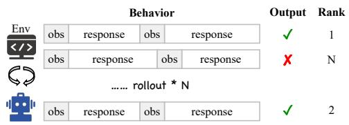  
(a) Standard RLVR (GRPO)

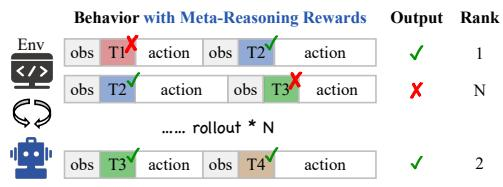  
(b) RLVMR (Ours)  
Output RankBehavior with Meta-Reasoning RewardsFigure 1: Comparison of LLM agent RL training paradigms: (a) Standard RL with outcome-only obs T1 obs action ✓ 1action T2✘ ✓Envrewards (e.g., GRPO) inadvertently reinforces trajectories with inefficient or illogical intermediate ✓ ✘reasoning steps. (b) Our RLVMR approach provides dense, verifiable rewards for beneficial metareasoning behaviors (e.g., T1-T4), directly shaping a more robust and coherent reasoning process.

To this end, we introduce Reinforcement Learning with Verifiable Meta-Reasoning Rewards (RLVMR), a novel framework that integrates dense, process-level supervision into end-to-end RL. As illustrated in Figure 1, RLVMR contrasts with standard RL by rewarding not only the final outcome but also the intermediate reasoning steps. Our framework defines a set of core metareasoning behaviors — planning, exploration, and reflection/monitoring — and enables the agent to articulate its cognitive state through special tags. During online interaction, we use lightweight, programmatic rules to grant verifiable rewards for these behaviors. For example, an ‘exploration’ tag is rewarded when the agent discovers a new state, while a ‘reflection’ tag is rewarded when it leads to the correction of a prior mistake. These process-centric rewards are combined with the global outcome reward and optimized using a policy gradient method. After a brief “cold-start” supervised fine-tuning (SFT) phase on only 200 trajectories to learn the tag syntax, the agent is trained entirely through environmental interaction.

We demonstrate the effectiveness of RLVMR on two challenging long-horizon benchmarks, ALF-World and ScienceWorld. Our experiments show that RLVMR achieves new state-of-the-art results across all settings. Notably, on the hardest unseen task split (L2), our 7B model achieves an 83.6% success rate, and surpasses the performance of the much larger models. In-depth analysis reveals that these gains are driven by a tangible improvement in reasoning quality: RLVMR-trained agents exhibit significant reductions in repetitive and invalid actions. This confirms that by rewarding the process of good reasoning, we create agents that are not only more successful but also more robust, efficient, and generalizable.

## In summary, our contributions are as follows:

1. We identify and analyze a critical inefficient exploration issue in outcome-only end-to-end RL for long-horizon LLM agents, where spurious state–action correlations override genuine reasoning, leading to redundant reasoning steps and illogical action loops.

2. We introduce a novel framework, RLVMR, that provides dense, verifiable rewards for meta-reasoning behaviors like planning, exploration, and reflection, enabling more robust and efficient problem-solving.

3. We achieve SOTA performance on ALFWorld and ScienceWorld, with in-depth analysis confirming reductions in redundant actions and improved generalization to unseen tasks.

## 2 INEFFICIENT EXPLORATION IN LONG-HORIZON AGENTS

This section investigates the phenomenon of “inefficient exploration” in agents designed for longhorizon tasks. We analyze its detrimental effects on performance, which manifest as brittle efficiency on previously seen tasks and poor generalization to unseen ones.

## 2.1 EXPERIMENTAL SETUP

Benchmarks To evaluate foundational capabilities and generalization, we conduct experiments on the widely-used and challenging ALFWorld benchmark (Shridhar et al., 2020), which comprises embodied household tasks. To systematically measure generalization, we define three evaluation splits based on the original benchmark:

• L0 (seen-L0): seen task variants and seen task categories;

• L1 (unseen-L1): unseen held-out task variants but seen task categories;

• L2 (unseen-L2): unseen held-out task variants and unseen task categories.

L0 and L1 follow the official benchmark splits. For L2, we further partition ALFWorld by task category, holding out entire categories from training for exclusive use in evaluation.

Training Paradigms We experiment with Qwen2.5-1.5B-Instruct and Qwen2.5-7B-Instruct models using the ReAct (Yao et al., 2023) framework, which alternates between reasoning and acting steps. We evaluate two dominant training paradigms:

• SFT (Yang et al., 2023; Tang et al., 2023; Xi et al., 2024): A widely adopted paradigm that applies supervised fine-tuning on high-quality expert trajectories.

• GRPO (Feng et al., 2025a; Wang et al., 2025b): An end-to-end RL method that optimizes the policy by comparing the final rewards of multiple trajectories sampled from the same initial state.

Evaluation Metrics We assess performance using the following metrics:

• Success Rate (%, ↑): The percentage of tasks successfully completed by the agent on each evaluation split.

• Invalid Action Rate (%, ↓): The proportion of generated actions that are invalid in the current state, reflecting basic comprehension and error frequency.

• Repetitive Action Rate (%, ↓): The percentage of steps where the agent executes a meaningless repeated action, as defined in prior work (Yuan et al., 2025; Fu et al., 2025; Feng et al., 2025b). This metric quantifies inefficient exploration, indicating that the agent’s policy may be overfitting to familiar action sequences rather than being guided by robust reasoning.

## 2.2 THE INEFFICIENT EXPLORATION PROBLEM

While aggregate statistics show that methods like GRPO can improve agent success rates, a closer look at individual trajectories reveals a critical flaw: the inefficient exploration problem. Even when an agent successfully completes a task, its path to a solution is often littered with redundant or illogical steps. This behavior, illustrated qualitatively in Appendix A, indicates a gap between achieving a correct outcome and demonstrating robust reasoning. Our large-scale empirical results (Figure 2) quantify the pervasiveness of this issue and expose a fundamental trade-off in current training paradigms.

SFT creates efficient but brittle policies that fail to generalize. Supervised Fine-Tuning (SFT) models achieve high success rates and efficiency on tasks they have seen during training. For instance, the 7B SFT model’s success rate on in-distribution tasks (L0) jumps from 23.1% (ReAct baseline) to 63.3%, with a low invalid action rate of 6.2%. However, this performance is brittle. On the most challenging out-of-distribution split (L2), the model’s success rate plummets to 37.5%, and its repetitive action rate nearly doubles. This reveals that when faced with novel situations, the agent falls into non-productive loops, demonstrating that SFT teaches mimicry without instilling a generalizable reasoning process.

GRPO improves generalization but fosters inefficient, flawed reasoning. In contrast, reinforcement learning with outcome-only rewards (GRPO) achieves substantially better generalization, with the 7B model attaining success rates of 77.3% on L1 and 52.3% on L2. This success, however, comes at the cost of severe inefficiency, validating our core hypothesis. The agent’s performance is undermined by high invalid and repetitive action rates across all difficulty levels; on the hardest L2 tasks, the 7B model’s repetitive action rate is a staggering 31.2%. By optimizing solely for task success, GRPO reinforces any path to a positive outcome, even those built on illogical steps and inefficient exploration.

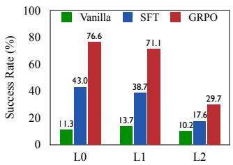  
(a) Success Rate (1.5B)

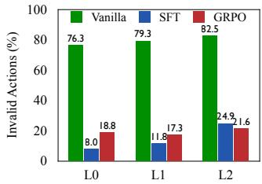  
(b) Invalid Actions (1.5B)

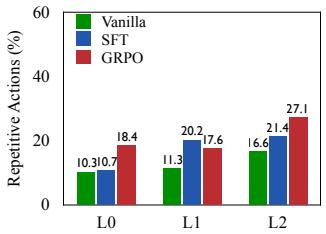  
(c) Repetitive Actions (1.5B)

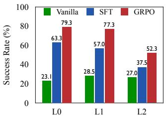  
(d) Success Rate (7B)

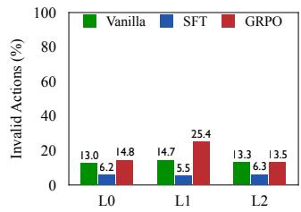  
(e) Invlaid Actions (7B)

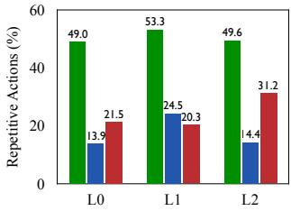  
(f) Repetitive Actions (7B)  
Figure 2: Performance on ALFWorld. While SFT excels on seen tasks (L0) but fails to generalize, GRPO achieves better generalization at the cost of significant inefficiency. This highlights a fundamental trade-off between brittle efficiency and inefficient generalization.

Scaling model size does not fix the underlying reasoning deficiencies. While scaling from a 1.5B to a 7B model improves overall success rates, it does not resolve this fundamental issue. Notably, while the 7B GRPO model is more successful on L2 tasks than its 1.5B counterpart (52.3% vs. 29.7%), it also exhibits a higher repetitive action rate (31.2% vs. 27.1%). This suggests a larger model’s enhanced capacity can be misdirected to more effectively exploit flawed strategies rather than to reason more coherently. This finding underscores that the limitation is rooted in the training objective itself, not merely model capacity, and that simply increasing model size is not a panacea.

Current paradigms force a trade-off between brittle efficiency and inefficient generalization. Our analysis reveals a core dilemma: SFT produces efficient but brittle policies that fail to generalize, while GRPO achieves generalization at the cost of reinforcing inefficient and logically flawed reasoning. Neither paradigm effectively teaches the agent how to reason well. This establishes a clear need for a new framework that moves beyond sparse, outcome-only signals to provide direct, process-level supervision. By rewarding coherent and efficient reasoning steps, we can guide agents to not only find solutions but to do so robustly and intelligently — the precise goal of our work.

## 3 METHODOLOGY: RLVMR

Our methodology equips LLM agents with an explicit meta-reasoning framework to mitigate inefficient exploration in complex tasks. As shown in Figure 3, the agent is trained in two phases: an initial SFT stage to bootstrap the agent’s meta-reasoning capabilities, followed by a reinforcement learning phase that uses a custom policy optimization algorithm to refine these skills based on task outcomes and process-centric rewards.

Cold Start: Initial Meta-Reasoning Acquisition via SFT To equip the base LLM with the foundational ability to generate structured meta-reasoning, we begin with a supervised fine-tuning phase. This step is crucial, as reasoning patterns learned during subsequent reinforcement learning are heavily influenced by the base model’s capabilities. The SFT data is constructed as follows:

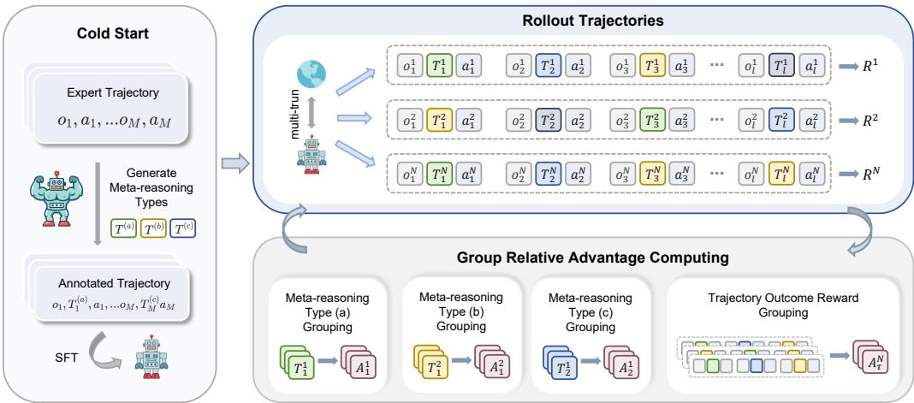  
Figure 3: A schematic diagram of the RLVMR framework, which consists of two training phases: cold start and reinforcement learning. Our method provides rule-verifiable feedback signals based on the final outcome and the relative advantages of different types of meta-reasoning behaviors.

1. We collect a dataset of successful task trajectories containing only observation-action pairs.

2. We employ a more powerful teacher model (e.g., GPT-4) to annotate these trajectories with our meta-reasoning tags, inferring the most likely cognitive step preceding each action. This process creates synthetic, reasoning-rich expert demonstrations.

3. The target LLM is fine-tuned on these annotated trajectories, learning to imitate the expert’s meta-reasoning and action generation patterns.

## 3.1 META-REASONING FRAMEWORK

We begin by formalizing the agent-environment interaction as a Markov Decision Process. We then introduce a novel meta-reasoning framework that extends existing agent architectures by operational izing principles from cognitive science.

Task Formulation as a Markov Decision Process We formalize the interaction between an agent and its environment in long-horizon tasks as a Markov Decision Process (MDP). An MDP is defined by a tuple $( S , A , O , F , R )$ , where S is the set of environment states, A is the action space, O is the observation space, $F : S \times A  S$ is the state transition function, and $R : S \times A $ R is the reward function. In our setting, which is tailored for LLM agents, the state, action, and observation spaces $( S , A , O )$ are all represented as natural language sequences over a finite token vocabulary.

At each timestep t, the agent’s policy $\pi _ { \theta }$ generates a thought process $t h _ { t }$ and an action $a _ { t }$ based on the current state $s _ { t } \colon ( t h _ { t } , a _ { t } ) \sim \pi _ { \theta } ( \cdot \mid s _ { t } )$ . The agent’s interaction with the environment produces a trajectory $\tau = \{ ( o _ { 1 } , t h _ { 1 } , a _ { 1 } ) , ( o _ { 2 } , t h _ { 2 } , a _ { 2 } ) , \ldots , ( o _ { n } , t h _ { n } , a _ { n } ) \}$ . In many long-horizon tasks, reward signals are sparse, typically provided only as a final outcome reward $\dot { R } ( \tau )$ at the end of an episode. This sparsity poses significant challenges for credit assignment. The agent’s objective is to learn an optimal policy $\pi _ { \theta }$ that maximizes the expected cumulative reward:

$$
\max _ {\theta} \mathbb {E} _ {\tau \sim \pi_ {\theta}} [ R (\tau) ].\tag{1}
$$

Operationalizing Meta-Reasoning in LLM Agents Our approach is grounded in metacognitive theory (Martinez, 2006; Lai, 2011), which emphasizes “thinking about thinking”. Metacognition comprises two key components: metacognitive knowledge (an agent’s self-awareness of its own reasoning strategies) and metacognitive regulation (the active control of these processes, including planning, monitoring, and adaptive revision). This theoretical lens suggests that for LLM agents to solve complex tasks, they require not just domain knowledge but also the capacity for dynamic planning, self-monitoring, and creative exploration.

To operationalize these principles, we extend the ReAct framework. While ReAct interleaves reasoning and actions $( \mathrm { e . g . , \ ' { T h i n k : } } \ . . . , \mathrm { A c t : } \ . . . ^ { \prime } )$ , it treats reasoning as a monolithic process. We refine this by introducing a structured set of meta-reasoning tags to explicitly represent distinct cognitive functions. This decouples reasoning from actions and enables fine-grained analysis and supervision. Specifically, we define four meta-reasoning tags, each enclosed in XML-style tags (e.g., <planning>), while all actions are contained within the <action> tag.

• Planning (<planning>): Decomposes the task into high-level steps to formulate an overall strategy. Used at the start of a task or when replanning is needed.

• Exploration (<explore>): Generates hypotheses or options to navigate uncertainty or bottlenecks, encouraging creative problem-solving.

• Reflection (<reflection>): Reviews history to analyze errors and formulate corrective actions. Typically triggered after unsuccessful attempts.

• Monitoring (<monitor>): Tracks task progress against the overall plan, ensuring actions remain aligned with subgoals. Applied during routine execution.

## 3.2 META-REASONING-AWARE REWARD SHAPING

During reinforcement learning, we guide the agent with a composite reward signal that combines task completion with the quality of the reasoning process. This signal comprises a sparse outcome reward and a dense, process-based meta-reasoning reward.

Outcome Reward $( R ( \tau ) )$ : A binary signal awarded at the end of a trajectory: $R ( \tau ) = r _ { s }$ s for task success and 0 otherwise, where r is a positive constant.

Meta-Reasoning Reward $( r _ { t } ^ { \mathrm { { M R } } } ) { : }$ A dense reward assigned at each step t to incentivize locally beneficial behaviors.

• Planning Reward $( r _ { \mathrm { p l a n n i n g } } ) { : }$ Awarded for a <planning> step if the trajectory succeeds.

• Exploration Reward $( r _ { \mathrm { e x p l o r e } } ) { : }$ Awarded if the current action targets a new object or location, discouraging redundancy.

• Reflection Reward $( r _ { \mathrm { r e f l e c t i o n } } )$ : Awarded if a <reflection> step is followed by a corrective action after a sequence of failures.

Format Reward $( r _ { t } ^ { \mathrm { f o r m a t } } )$ ): A penalty, $- \lambda _ { \mathrm { f o r m a t } }$ , is applied if the model’s output at step t does not conform to the expected $\textsf { < t a g > . . . < / t a g > < a c t i o n > . . . < / a c t i o n > }$ structure.

The total step-level reward is the sum of the process-based rewards: $r _ { t } = r _ { t } ^ { \mathrm { M R } } + r _ { t } ^ { \mathrm { f o r m a t } }$

## 3.3 GROUP RELATIVE POLICY OPTIMIZATION WITH META-REASONING (GRPO-MR)

To effectively leverage our composite reward signal, we introduce Meta-Reasoning Group Policy Optimization (GRPO-MR). GRPO-MR computes a step-level advantage by combining global trajectory performance with local, context-aware reasoning quality.

Trajectory-level Relative Advantage: For a batch of K trajectories collected from the same environment, we first calculate a normalized trajectory-level advantage to capture overall performance:

$$
A _ {k} ^ {\mathrm{traj}} = \frac {R (\tau_ {k}) - \mu_ {R}}{\sigma_ {R}},\tag{2}
$$

where $\mu _ { R }$ and $\sigma _ { R }$ are the mean and standard deviation of outcome rewards across the batch.

Meta-reasoning Level Relative Advantage: The core of GRPO-MR is the computation of a contextaware advantage. We group all steps within a batch that share the same meta-reasoning tag (e.g., all <explore> steps) and normalize their rewards within that group:

$$
A _ {t, \mathrm{tag}} ^ {\mathrm{MR}} = \frac {r _ {t , \mathrm{tag}} ^ {\mathrm{MR}} - \mu_ {\mathrm{tag}}}{\sigma_ {\mathrm{tag}}},\tag{3}
$$

Table 1: Performance comparison on the benchmarks. We report the success rate (%) on seen (L0: seen task variants and categories) and unseen (L1: unseen task variants but seen task categories; L2: unseen task variants and categories) task variations. We also report the average cumulative reward (score) on the ScienceWorld benchmark.

<table><tr><td rowspan="3">Model</td><td rowspan="3">Method</td><td colspan="3">ALFWorld</td><td colspan="6">ScienceWorld</td></tr><tr><td>L0</td><td>L1</td><td>L2</td><td colspan="2">L0</td><td colspan="2">L1</td><td colspan="2">L2</td></tr><tr><td>succ.</td><td>succ.</td><td>succ.</td><td>succ.</td><td>score</td><td>succ.</td><td>score</td><td>succ.</td><td>score</td></tr><tr><td>GPT-4o</td><td>ReAct</td><td>57.3</td><td>66.0</td><td>68.8</td><td>45.4</td><td>54.3</td><td>49.2</td><td>57.0</td><td>41.0</td><td>52.0</td></tr><tr><td>DeepSeek-V3</td><td>ReAct</td><td>60.2</td><td>65.9</td><td>53.9</td><td>27.3</td><td>39.1</td><td>35.2</td><td>43.0</td><td>26.5</td><td>37.1</td></tr><tr><td>DeepSeek-R1</td><td>ReAct</td><td>68.8</td><td>70.2</td><td>67.3</td><td>22.2</td><td>32.0</td><td>31.4</td><td>39.5</td><td>29.1</td><td>37.9</td></tr><tr><td>AgentGym</td><td>SFT+RL</td><td>76.6</td><td>63.3</td><td>-</td><td>46.9</td><td>56.3</td><td>33.6</td><td>45.2</td><td>-</td><td>-</td></tr><tr><td rowspan="7">Qwen2.5-1.5B</td><td>ReAct</td><td>11.3</td><td>13.7</td><td>10.2</td><td>1.2</td><td>9.0</td><td>0.8</td><td>7.8</td><td>0.8</td><td>7.4</td></tr><tr><td>+SFT</td><td>43.0</td><td>38.7</td><td>17.6</td><td>20.3</td><td>30.9</td><td>18.0</td><td>27.8</td><td>12.5</td><td>20.9</td></tr><tr><td>+ETO</td><td>64.1</td><td>66.4</td><td>25.8</td><td>39.1</td><td>47.3</td><td>22.7</td><td>29.8</td><td>15.6</td><td>23.4</td></tr><tr><td>+ GLIDER</td><td>66.0</td><td>68.8</td><td>35.2</td><td>40.2</td><td>50.2</td><td>25.8</td><td>32.0</td><td>19.5</td><td>25.1</td></tr><tr><td>+ GRPO</td><td>76.6</td><td>71.1</td><td>29.7</td><td>21.1</td><td>31.7</td><td>13.7</td><td>22.5</td><td>10.9</td><td>21.2</td></tr><tr><td>+ GiGPO</td><td>86.7</td><td>83.2</td><td>48.0</td><td>25.8</td><td>35.6</td><td>15.2</td><td>22.8</td><td>4.7</td><td>11.2</td></tr><tr><td>+ RLVMR</td><td>89.1</td><td>87.9</td><td>56.3</td><td>46.9</td><td>60.3</td><td>34.4</td><td>45.2</td><td>26.5</td><td>33.9</td></tr><tr><td rowspan="7">Qwen2.5-7B</td><td>ReAct</td><td>23.1</td><td>28.5</td><td>27.0</td><td>7.8</td><td>17.4</td><td>11.3</td><td>19.6</td><td>6.3</td><td>16.5</td></tr><tr><td>+SFT</td><td>63.3</td><td>57.0</td><td>37.5</td><td>36.7</td><td>43.5</td><td>32.0</td><td>41.6</td><td>23.4</td><td>32.2</td></tr><tr><td>+ETO</td><td>70.3</td><td>74.2</td><td>51.6</td><td>62.5</td><td>71.2</td><td>40.6</td><td>50.4</td><td>28.1</td><td>35.0</td></tr><tr><td>+ GLIDER</td><td>75.4</td><td>74.6</td><td>53.1</td><td>62.9</td><td>68.8</td><td>41.4</td><td>52.8</td><td>25.8</td><td>32.5</td></tr><tr><td>+ GRPO</td><td>79.3</td><td>77.3</td><td>52.3</td><td>49.1</td><td>61.8</td><td>30.1</td><td>43.1</td><td>26.6</td><td>34.3</td></tr><tr><td>+ GiGPO</td><td>89.5</td><td>90.2</td><td>67.2</td><td>53.4</td><td>69.2</td><td>35.2</td><td>50.7</td><td>25.8</td><td>33.2</td></tr><tr><td>+ RLVMR</td><td>91.4</td><td>91.8</td><td>83.6</td><td>67.2</td><td>77.8</td><td>43.0</td><td>59.4</td><td>32.2</td><td>49.1</td></tr><tr><td rowspan="7">Llama3.1-8B</td><td>ReAct</td><td>19.5</td><td>22.3</td><td>17.6</td><td>8.6</td><td>18.8</td><td>11.7</td><td>19.9</td><td>11.7</td><td>20.3</td></tr><tr><td>+SFT</td><td>62.5</td><td>60.9</td><td>39.1</td><td>39.8</td><td>47.6</td><td>30.1</td><td>39.8</td><td>22.3</td><td>32.6</td></tr><tr><td>+ETO</td><td>69.5</td><td>67.5</td><td>47.3</td><td>57.0</td><td>64.3</td><td>36.8</td><td>45.2</td><td>29.3</td><td>35.4</td></tr><tr><td>+ GLIDER</td><td>72.7</td><td>73.4</td><td>50.8</td><td>64.4</td><td>71.2</td><td>38.7</td><td>53.8</td><td>28.5</td><td>35.6</td></tr><tr><td>+ GRPO</td><td>73.0</td><td>70.7</td><td>45.3</td><td>45.6</td><td>55.2</td><td>28.8</td><td>40.1</td><td>25.8</td><td>33.7</td></tr><tr><td>+ GiGPO</td><td>86.0</td><td>87.1</td><td>68.8</td><td>60.2</td><td>73.5</td><td>39.1</td><td>55.2</td><td>30.1</td><td>42.3</td></tr><tr><td>+ RLVMR</td><td>92.2</td><td>91.0</td><td>83.2</td><td>71.1</td><td>80.3</td><td>49.2</td><td>63.7</td><td>38.7</td><td>51.2</td></tr></table>

where $\mu _ { \mathrm { t a g } }$ and $\sigma _ { \mathrm { t a g } }$ are the mean and standard deviation of meta-reasoning rewards for all steps with that specific tag. The final step-level advantage $A _ { t }$ is a weighted combination of these two signals:

$$
A _ {t} = \alpha \cdot A _ {k} ^ {\mathrm{traj}} + (1 - \alpha) \cdot A _ {t, \mathrm{tag}} ^ {\mathrm{MR}},\tag{4}
$$

where $\alpha \in [ 0 , 1 ]$ is a hyperparameter balancing the influence of the global outcome and local reasoning quality. Finally, we optimize the policy $\pi _ { \theta }$ using a clipped surrogate objective with KL divergence regularization:

$$
\mathcal {L} _ {\text { final }} = \mathbb {E} _ {t} \left[ \min \left(r _ {t} (\theta) A _ {t}, \operatorname{clip} \left(r _ {t} (\theta), 1 - \epsilon , 1 + \epsilon\right) A _ {t}\right) \right] - \lambda_ {\mathrm{KL}} D _ {\mathrm{KL}} \left(\pi_ {\theta} \| \pi_ {\text { ref }}\right),\tag{5}
$$

where $r _ { t } ( \theta )$ is the importance sampling ratio, ϵ is the clipping hyperparameter, and $\lambda _ { \mathrm { K L } }$ controls the KL penalty against a reference policy $\pi _ { \mathrm { r e f } } .$

## 4 EXPERIMENT

## 4.1 MAIN RESULTS

In this section, we present the core experimental results to evaluate the effectiveness of our proposed RLVMR. In addition to ALFWorld, we also conduct experiments on ScienceWorld (Wang et al., 2022), which focuses on text-based scientific experimentation.

We compare our approach with two major categories of advanced RL training methods in addition to SFT: (1) Offline RL, including (i) ETO (Song et al., 2024), which iteratively refines actions using step-level feedback along trajectories; (ii) GLIDER (Hu et al., 2025b), which decomposes complex tasks into coherent sub-tasks to improve transferability. (2) Online End-to-end RL, including (iii) Multi-turn GRPO (Wang et al., 2025b), which adapts the original GRPO (Shao et al., 2024) for online multi-turn RL tasks; (iv) GiGPO (Feng et al., 2025b), which introduces a two-level structure for finer-grained credit assignment. For broader comparison, we also report the performance of GPT-4o, DeepSeek-V3/R1, and AgentGym (Xi et al., 2024). Detailed information is provided in Appendix B.

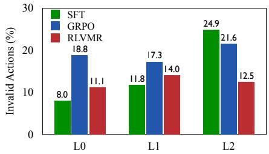  
(a) Invalid Actions

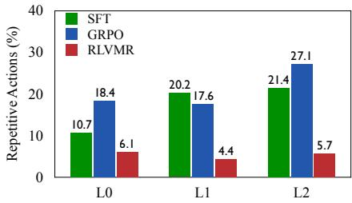  
(b) Repetitive Actions

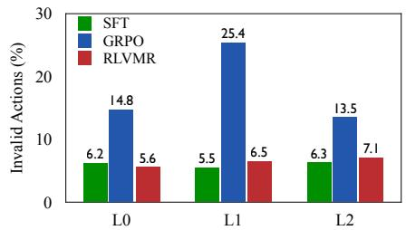  
(c) Invlaid Actions (7B)

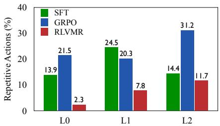  
(d) Repetitive Actions (7B)  
Figure 4: Exploration efficiency of RLVMR compared to SFT and GRPO baselines on ALFWorld.

RLVMR achieves new SOTA performance across all benchmarks and model sizes. As listed in Table 1, our RLVMR framework consistently sets a new standard for performance, outperforming all baseline methods on both ALFWorld and ScienceWorld. With the Qwen-7B model, RLVMR achieves success rates of 91.4% on seen ALFWorld tasks and 67.2% on seen ScienceWorld tasks, surpassing the next-best method, GiGPO. This consistent superiority highlights the broad applicability and effectiveness of integrating verifiable meta-reasoning rewards into the RL training loop, leading to more capable and successful agents.

Rewarding meta-reasoning significantly enhances generalization to unseen tasks. A primary contribution of this work is addressing the inefficient exploration issue to improve generalization. Our results validate this claim, showing that RLVMR excels in novel scenarios, especially on the most challenging Unseen-L2 split, which involves entirely new task categories. On ALFWorld’s L2 split, our 7B model reaches an impressive 83.6% success rate, a substantial 16.4 percentage point improvement over the strongest baseline (GiGPO). Similarly, on ScienceWorld’s L2 split, RLVMR outperforms all other methods. This demonstrates that by learning how to reason effectively—rather than just memorizing solutions—our agent develops more robust and transferable problem-solving skills, leading to superior performance on unfamiliar challenges.

## 4.2 ANALYSIS

Our analysis reveals that RLVMR’s verifiable meta-reasoning rewards lead to superior exploration and training efficiency, enabling the agent to find more direct solutions with greater stability than strong baselines. Unless otherwise stated, we report results based on Qwen2.5-1.5B on ALFWorld.

Exploration Efficiency We analyze agent exploration efficiency by measuring invalid and repetitive actions (Figure 4). RLVMR’s verifiable meta-reasoning rewards cultivate more efficient problemsolving strategies, significantly reducing flawed or redundant steps. On seen tasks, our 1.5B model slashes the invalid action rate from 18.1% (GRPO) to 11.1% and the repetitive action rate from 18.4% to 6.1%. This efficiency gain is robustly maintained on novel challenges; while GRPO’s repetitive action rate worsens on the hardest unseen tasks (from 21.4% to 27.1%), RLVMR’s rate remains controlled at 5.7%. This demonstrates that RLVMR learns generalizable problem-solving principles rather than overfitting to familiar paths.

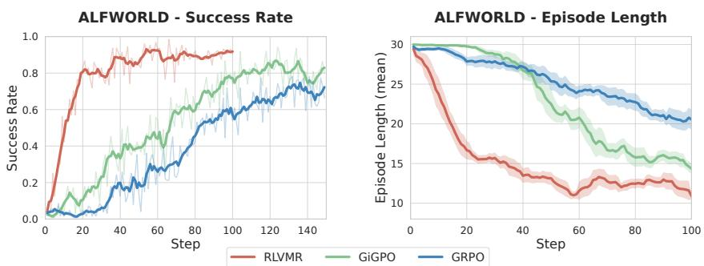  
Figure 5: Success rate and step count curves of different approaches on ALFWorld during RL training.

Training Efficiency We evaluate training efficiency via learning stability (convergence) and policy quality (action sequence length) in Figure 5. Agents trained with RLVMR learn more direct solutions and converge faster and more stably than baselines. In contrast, baselines like GRPO are unstable and produce longer solution paths. This stems from its process-level rewards, which provide a clearer and more robust learning signal that prevents inefficient and unproductive loops.

## 5 RELATED WORK

LLM Reinforcement Learning RL is widely used to align LLMs with human preferences (RLHF, DPO) (Ouyang et al., 2022; Rafailov et al., 2023). Beyond alignment, RL has been applied to improve reasoning and emotional intelligence (Hu et al., 2025a; Muennighoff et al., 2025; Wang et al., 2025a). Group-based methods such as GRPO, Dr.GRPO, and DAPO estimate advantages from multiple samples of the same prompt, removing the critic and improving efficiency over actor-critic approaches like PPO (Feng et al., 2025a; Liu et al., 2025; Yu et al., 2025; Schulman et al., 2017). These methods achieve strong results on mathematical reasoning, search, and tool use (Yu et al., 2025; Hu et al., 2025a). However, applying RL to multi-turn, long-horizon tasks remains difficult due to sparse, delayed rewards – a challenge we address (Wang et al., 2025b).

LLM Agents LLMs increasingly act as agents for code generation, web interaction, embodied control, and affective tasks (Huang et al., 2023; Zhang et al., 2024; Bai et al., 2024; Agashe et al., 2024; Abuelsaad et al., 2024; Zeng et al., 2024; Qiao et al., 2024; Fu et al., 2025; Zhang et al., 2025). Early systems relied on prompting and external tools (e.g., ReAct) (Yao et al., 2023; Shinn et al., 2023), but smaller models often lack strong reasoning; SFT can improve decisions (Zhang & Zhang, 2024; Xi et al., 2024; Qin et al., 2024). Other work studies single-step or offline RL (Yu et al., 2024; Xiong et al., 2024; Zhou & Zanette, 2024), while recent efforts train agents end to end with online RL, learning directly from interaction and reducing reliance on complex data preparation or steplevel reward models (Wang et al., 2025b; Feng et al., 2025b). Despite progress, fine-grained credit assignment and generalization remain challenging (Wang et al., 2025b). We employ reward shaping grounded in verifiable meta-cognitive behaviors to promote effective reasoning and robustness.

## 6 CONCLUSION

We tackled the challenge of inefficient exploration in long-horizon agents by introducing RLVMR, a new framework that guides agents using process-level supervision. Instead of relying solely on sparse success-based rewards, RLVMR provides dense, verifiable feedback for key reasoning behaviors like planning, exploration, and reflection. Our approach combines a lightweight initialization phase with end-to-end training to develop more effective and adaptable agents. Experiments on ALFWorld and ScienceWorld show that RLVMR achieves state-of-the-art performance, with better generalization to new tasks and noticeable improvements in reasoning quality—fewer redundant actions and better recovery from mistakes. These results highlight the value of directly supervising reasoning steps. Future research could extend RLVMR to multi-modal environments, explore adaptive reward mecha nisms that dynamically adjust to task complexity, and apply the framework to real-world domains such as robotics and software engineering.

## REFERENCES

Tamer Abuelsaad, Deepak Akkil, Prasenjit Dey, Ashish Jagmohan, Aditya Vempaty, and Ravi Kokku. Agent-e: From autonomous web navigation to foundational design principles in agentic systems. arXiv preprint arXiv:2407.13032, 2024.

Saaket Agashe, Jiuzhou Han, Shuyu Gan, Jiachen Yang, Ang Li, and Xin Eric Wang. Agent s: An open agentic framework that uses computers like a human. arXiv preprint arXiv:2410.08164, 2024.

Hao Bai, Yifei Zhou, Jiayi Pan, Mert Cemri, Alane Suhr, Sergey Levine, and Aviral Kumar. Digirl: Training in-the-wild device-control agents with autonomous reinforcement learning. Advances in Neural Information Processing Systems, 37:12461–12495, 2024.

Tianzhe Chu, Yuexiang Zhai, Jihan Yang, Shengbang Tong, Saining Xie, Dale Schuurmans, Quoc V Le, Sergey Levine, and Yi Ma. Sft memorizes, rl generalizes: A comparative study of foundation model post-training. arXiv preprint arXiv:2501.17161, 2025.

Lang Feng, Zhenghai Xue, Tingcong Liu, and Bo An. Group-in-group policy optimization for llm agent training. arXiv preprint arXiv:2505.10978, 2025a.

Lang Feng, Zhenghai Xue, Tingcong Liu, and Bo An. Group-in-group policy optimization for llm agent training. arXiv preprint arXiv:2505.10978, 2025b.

Dayuan Fu, Keqing He, Yejie Wang, Wentao Hong, Zhuoma Gongque, Weihao Zeng, Wei Wang, Jingang Wang, Xunliang Cai, and Weiran Xu. Agentrefine: Enhancing agent generalization through refinement tuning. arXiv preprint arXiv:2501.01702, 2025.

Jingcheng Hu, Yinmin Zhang, Qi Han, Daxin Jiang, Xiangyu Zhang, and Heung-Yeung Shum. Open-reasoner-zero: An open source approach to scaling up reinforcement learning on the base model. arXiv preprint arXiv:2503.24290, 2025a.

Zican Hu, Wei Liu, Xiaoye Qu, Xiangyu Yue, Chunlin Chen, Zhi Wang, and Yu Cheng. Divide and conquer: Grounding LLMs as efficient decision-making agents via offline hierarchical reinforcement learning. In Forty-second International Conference on Machine Learning, 2025b. URL https://openreview.net/forum?id=pdNtji3ktF.

Dong Huang, Jie M Zhang, Michael Luck, Qingwen Bu, Yuhao Qing, and Heming Cui. Agentcoder: Multi-agent-based code generation with iterative testing and optimisation. arXiv preprint arXiv:2312.13010, 2023.

Emily R Lai. Metacognition: A literature review. 2011.

Zichen Liu, Changyu Chen, Wenjun Li, Penghui Qi, Tianyu Pang, Chao Du, Wee Sun Lee, and Min Lin. Understanding r1-zero-like training: A critical perspective. arXiv preprint arXiv:2503.20783, 2025.

Michael E Martinez. What is metacognition? Phi delta kappan, 87(9):696–699, 2006.

Niklas Muennighoff, Zitong Yang, Weijia Shi, Xiang Lisa Li, Li Fei-Fei, Hannaneh Hajishirzi, Luke Zettlemoyer, Percy Liang, Emmanuel Candes, and Tatsunori Hashimoto. s1: Simple test-time\` scaling. arXiv preprint arXiv:2501.19393, 2025.

Long Ouyang, Jeffrey Wu, Xu Jiang, Diogo Almeida, Carroll Wainwright, Pamela Mishkin, Chong Zhang, Sandhini Agarwal, Katarina Slama, Alex Ray, et al. Training language models to follow instructions with human feedback. Advances in neural information processing systems, 35:27730– 27744, 2022.