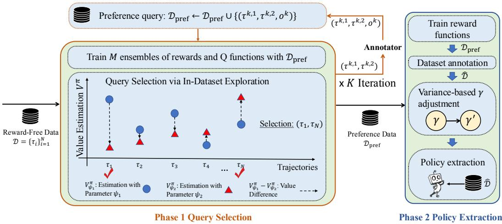
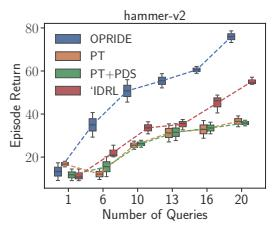
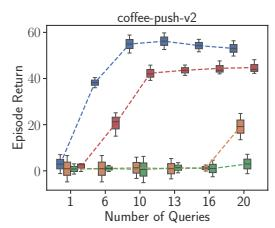
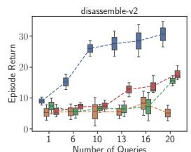
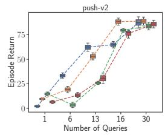

## ABSTRACT

Preference-based reinforcement learning (PbRL) can help avoid sophisticated reward designs and align better with human intentions, showing great promise in various real-world applications. However, obtaining human feedback for preferences can be expensive and time-consuming, which forms a strong barrier for PbRL. In this work, we address the problem of low query efficiency in offline PbRL, pinpointing two primary reasons: inefficient exploration and overoptimization of learned reward functions. In response to these challenges, we propose a novel algorithm, Offline PbRL via In-Dataset Exploration (OPRIDE), designed to enhance the query efficiency of offline PbRL. OPRIDE consists of two key features: a principled exploration strategy that maximizes the informativeness of the queries and a discount scheduling mechanism aimed at mitigating overoptimization of the learned reward functions. Through empirical evaluations, we demonstrate that OPRIDE significantly outperforms prior methods, achieving strong performance with notably fewer queries. Moreover, we provide theoretical guarantees of the algorithm’s efficiency. Experimental results across various locomotion, manipulation, and navigation tasks underscore the efficacy and versatility of our approach.

## 1 INTRODUCTION

Reinforcement learning (RL) has proven effective across a range of sequential decision-making tasks, from mastering games like Go (Silver et al., 2016) to controlling complex systems such as robots (Ahn et al., 2022) and plasma reactors (Degrave et al., 2022). However, in many real-world applications, designing an appropriate reward function is a daunting challenge, as these tasks often involve objectives that are difficult to formalize with numerical rewards (Yang et al., 2021; 2023).

Preference-based RL (PbRL) (Akrour et al., 2012; Christiano et al., 2017) has emerged as a promising paradigm, leveraging human feedback in the form of pairwise preferences, which are inherently more interpretable yet still information-rich. This paradigm allows agents to learn from relative judgments rather than numerical reward signals, significantly reducing the complexity of reward design. Recent advancements in PbRL have illustrated its efficacy in enabling agents to learn novel behaviors (Christiano et al., 2017; Kim et al., 2023) and in achieving better alignment with human preferences (Ouyang et al., 2022; Yang et al., 2025), which are often difficult to encapsulate in a reward function. Despite these advantages, PbRL methods still face critical challenges, particularly in acquiring human feedback efficiently. Querying human preferences is both time-consuming and resource-intensive, limiting the scalability of PbRL in real-world applications.

To address this challenge, we propose Offline PbRL via In-Dataset Exploration (OPRIDE), a novel algorithm designed to systematically enhance the query efficiency of offline PbRL, as depicted in Figure 1. OPRIDE introduces a principled exploration strategy that identifies the most informative queries by analyzing value differences between trajectories, ensuring that each query maximally contributes to learning the optimal policy. Additionally, to prevent overoptimization of the learned reward function (Gao et al., 2023; Zhu et al., 2024), particularly in regions with high uncertainty, we incorporate a discount factor scheduling mechanism that dynamically adjusts the discount based on the variance in the reward estimation. Based on the pessimistic property of the smaller discount factor, we can address the overestimation issue of the value function and, subsequently, a better policy performance and higher query efficiency.

  
Figure 1: The procedure of OPRIDE consists of two phases. In the first offline phase, we select query based on exploration mechanism. The blue circles • and red triangles ▲ represent the value estimation $V _ { \psi _ { 1 } }$ and $V _ { \psi _ { 2 } }$ , respectively. In the second stage, we first learn an reward function based on the preference dataset and then annotate the reward-free dataset. Next, we adjust the discount factor to reduce the impact of noise in the reward learning.

Experimental evaluations on diverse locomotion and manipulation tasks, including AntMaze (Fu et al., 2020) and Meta-World (Yu et al., 2019), demonstrate the efficacy of our approach in achieving strong performance with significantly fewer queries compared to state-of-the-art baselines. Remarkably, our method achieves compelling results with as few as ten queries on Meta-World tasks, underscoring its efficiency and scalability. Furthermore, we provide theoretical insights into the efficiency of our algorithm, demonstrating that our exploration strategy is provably efficient under mild assumptions.

Our contributions are threefold: (1) We introduce OPRIDE, a novel offline PbRL algorithm that achieves superior query efficiency through in-dataset exploration; (2) We conduct extensive ablation studies that highlight the effectiveness of each component, providing insights into the factors driving query efficiency; and (3) We provide theoretical analyses establishing the provable efficiency of our algorithm involving a principled exploration strategy under mild assumptions.

## 1.1 RELATED WORK

Preference-based RL. Various methods have been proposed to leverage human preferences (Akrour et al., 2012; Ibarz et al., 2018) and have demonstrated success in tackling complex control tasks (Chris tiano et al., 2017; Lee et al., 2021) and in aligning large language models (Stiennon et al., 2020; Ouyang et al., 2022; Rafailov et al., 2023; 2024). In the realm of offline Preference-based Reinforcement Learning (PbRL), a benchmark including several baselines (e.g., disagreement based method) is introduced by OPRL (Shin et al., 2023), which selects queries based on disagreement between the reward models and is inefficient in determining the optimal policy. Kim et al. (2023) apply Transformer models to effectively capture preferences for better credit assignment. Kang et al. (2023) present a direct approach to learning policy based on preferences. A recent work by Lindner et al. (2021) proposes an information-directed query selection method for PbRL, using the Laplacian approximation and the Hessian matrix for posterior computation. In contrast, our method selects queries to maximize the information gain about the optimal policy rather than the reward function, ensuring higher query efficiency.

Our work is also related to recent two-stage offline PbRL methods that enhance reward learning or query design. CLARIFY (Mu et al.) employs contrastive learning to disambiguate preferences in noisy queries by refining trajectory representations, differing from our direct exploration of value differences within the dataset. LiRE (Choi et al., 2024) introduces listwise ranking to replace pairwise queries, improving feedback efficiency through sequential comparisons. Differently, we focus on maximizing policy-relevant information per query via value ensemble disagreement. Additionally, we note emerging single-stage paradigms that bypass explicit reward modeling: IPL (Hejna & Sadigh, 2023) and CPL (Hejna et al.) derive policies directly from preferences via inverse learning or contrastive objectives, while DPPO (An et al., 2023) optimizes policies using preference logits without reward intermediates. These methods represent an alternative direction, whereas OPRIDE retains the two-stage structure to leverage established offline RL algorithms.

In addition to empirical achievements, prior studies have also explored the theoretical aspects of PbRL. Pacchiano et al. (2021) propose a provable PbRL algorithm tailored for linear MDPs. Chen et al. (2022) extend this approach to scenarios where the Eluder dimension is finite. Zhan et al. (2023a) delve into the study of PbRL within an offline setting where a preference dataset is provided. Wang et al. (2023) propose an efficient randomized algorithm for PbRL in linear MDP and an efficient TS-based algorithm for nonlinear cases with finite Eluder dimensions. Sekhari et al. (2023) provides a PbRL algorithm with PAC guarantees. Novoseller et al. (2020) proposes the dueling posterior sampling algorithm that has an information-theoretic guarantee. Xu et al. (2020) provide a gap-dependent analysis for preference-based contextual bandit and imitation learning. Wu & Sun (2023) analyze the complexity of learning with utility-based preferences and general preferences.

## 2 PRELIMINARIES

We consider infinite-horizon Markov Decision Processes (MDPs), defined by the tuple $( S , { \mathcal { A } } , \gamma , { \mathcal { P } } , r )$ with state space $s ,$ , action space ${ \mathcal { A } } ,$ horizon $H ,$ transition function $\mathcal { P } : \mathcal { S } \times \mathcal { A }  \Delta ( \mathcal { S } )$ and reward function $r : \bar { \mathcal { S } } \times \mathcal { A }  [ 0 , 1 ]$ . Without loss of generality, we assume a fixed start state $s _ { 0 }$

A policy $\pi : S  \Delta ( { \mathcal { A } } )$ specifies a decision-making strategy in which the agent chooses actions adaptively based on the current state, that is, $a \sim \pi ( \cdot | s )$ . The value function $V ^ { \pi } : { \cal S }  \mathbb { R }$ and the action-value function (Q-function) $Q ^ { \pi } : S \times { \cal A } $ R are defined as

$$
V ^ {\pi} (s) = \mathbb {E} _ {\pi} \Big [ \sum_ {t = 1} ^ {\infty} r (s _ {t}, a _ {t})   \Big |   s _ {0} = s \Big ], \quad Q ^ {\pi} (s, a) = \mathbb {E} _ {\pi} \Big [ \sum_ {t = 1} ^ {\infty} r (s _ {t}, a _ {t})   \Big |   s _ {0} = s, a _ {0} = a \Big ],\tag{1}
$$

where the expectation is w.r.t. the trajectory τ induced by $\pi .$ . We define the Bellman evaluation operator as

$$
(\mathbb {T} ^ {\pi} f) (s, a) = \mathbb {E} _ {s ^ {\prime} \sim \mathcal {P} (\cdot | s, a), a ^ {\prime} \sim \pi (\cdot | s ^ {\prime})} \big [ r (s, a) + \gamma f (s ^ {\prime}, a ^ {\prime}) \big ].\tag{2}
$$

We use $\pi ^ { \star } , Q ^ { \star }$ , and $V ^ { \star }$ to denote an optimal policy, the corresponding optimal Q-function and optimal value function, respectively. We have the Bellman optimality equation

$$
V ^ {\star} (s) = \max _ {a \in \mathcal {A}} Q ^ {\star} (s, a), \quad Q ^ {\star} (s, a) = \mathbb {E} _ {s ^ {\prime} \sim \mathcal {P} (\cdot | s, a)} \big [ r (s, a) + \gamma V ^ {\star} (s ^ {\prime}) \big ].\tag{3}
$$

Meanwhile, the optimal policy $\pi ^ { \star }$ satisfies $\pi ^ { \star } ( \cdot  { | } s ) = \mathrm { a r g m a x } _ { \pi } \langle Q ^ { \star } ( s , \cdot ) , \pi ( \cdot  { | } s ) \rangle _ { \cal A }$ . We aim to learn a policy π from the candidate policy class Π that maximizes the expected cumulative reward. Correspondingly, we define the performance metric as the sub-optimality compared with the optimal policy, i.e.,

$$
\operatorname{SubOpt} (\pi) = V ^ {\pi^ {\star}} \left(s _ {0}\right) - V ^ {\pi} \left(s _ {0}\right).\tag{4}
$$

## 2.1 BELLMAN CONSISTENT PESSIMISM

A unique challenge in offline RL is that the learned policy may induce a state-action density that is different from the data distribution $\mu ,$ which may lead to large extrapolation errors when we do not impose any coverage assumption on $\mu .$ . Therefore, it is important to carefully characterize the distribution shift, which we measure using the coverage coefficient. Specifically, we adopt the one used in Xie et al. (2021) that considers the distribution shift of Bellman errors:

Definition 1 (Bellman shift coefficient (Xie et al., 2021)). We define $\mathcal { C } ( \nu ; \mu , \mathcal { Q } , \pi )$ as follows to measure the distribution shift from an arbitrary distribution ν to the data distribution $\mu ,$ w.r.t. $\mathcal { Q }$ and π,

$$
\mathcal {C} (\nu ; \mu , \mathcal {Q}, \pi) := \max _ {q \in \mathcal {Q}} \frac {\| q - \mathbb {T} ^ {\pi} q \| _ {2 , \nu} ^ {2}}{\| q - \mathbb {T} ^ {\pi} q \| _ {2 , \mu} ^ {2}}.
$$

Here $\mathcal { Q }$ is the Q-function approximation class we consider. Intuitively, $\mathcal { C } ( \nu ; \mu , \mathcal { Q } , \pi )$ measures how well Bellman errors under π transfer between the distributions ν and $\mu .$ For instance, a small value of $\mathcal { C } ( d ^ { \pi } ; \mu , \mathcal { Q } , \pi )$ enables accurate policy evaluation for π using data collected under $\mu .$ Definition 1 is a generalization compared to prior works that is defined specific to linear function approximation (Agarwal et al., 2021; Jin et al., 2021). More generally, we have ${ \mathcal { C } } ( \nu ; \mu , \mathcal { Q } , \pi ) \leq \mathbf { \bar { \mu } } \mathbf { | } \nu / \mu \mathbf { | } | _ { \infty } : =$ $\operatorname* { s u p } _ { s , a } { \frac { \nu ( s , a ) } { \mu ( s , a ) } }$ holds for any π and Q.

## 2.2 PREFERENCE-BASED REINFORCEMENT LEARNING

To learn reward functions from preference labels, we consider the Bradley-Terry pairwise preference model (Bradley & Terry, 1952) as used by most prior works (Christiano et al., 2017; Ibarz et al., 2018; Palan et al., 2019). Specifically, the preference label between two given trajectories $\tau _ { i }$ and $\tau _ { j }$ is defined as

$$
\mathbb {P} \left(\tau_ {i} \succ \tau_ {j}   \Big |   R\right) = \frac {1}{\exp \left(R (\tau_ {j}) - R (\tau_ {i})\right) + 1},\tag{5}
$$

where ${ \boldsymbol { \tau } } = ( s _ { t } , a _ { t } ) _ { t = 0 } ^ { T }$ is a trajectory and $\begin{array} { r } { R ( \tau ) = \sum _ { t = 0 } ^ { T } \gamma ^ { t } r \bigl ( s _ { t } , a _ { t } \bigr ) } \end{array}$ is the return function. To simplify the theoretical analysis, we consider learning a return model instead of a reward model. The return model $\widehat { R }$ is trained to minimize the cross-entropy loss between the predicted preference and the ground truth with a given preference dataset $\mathcal { D } _ { \mathrm { p r e f } }$ as follows:

$$
\mathcal {L} _ {\mathrm{CE}} (R) = - \underset {(\tau^ {1}, \tau^ {2}, o) \sim \mathcal {D} _ {\mathrm{pref}}} {\mathbb {E}} \left[ o \log \mathbb {P} \left(\tau_ {1} \succ \tau_ {2}   \Big |   R\right) + (1 - o) \log (1 - \mathbb {P} \left(\tau_ {1} \succ \tau_ {2}   \Big |   R\right)) \right],\tag{6}
$$

where o is the ground truth label given by human labelers. We assume that the difference of return functions $\Delta \mathcal { R } : = \{ \Delta R ( \tau _ { 1 } , \tau _ { 2 } ^ { \circ } ) : \mathrm { T r a j } \times \mathrm { T r a j } \to \mathbb { R } | \exists R \in \mathcal { R } , \Delta R ( \tau _ { 1 } , \tau _ { 2 } ) = R ( \tau _ { 1 } ) - R ( \tau _ { 2 } ) \}$ has a finite Eluder dimension, which is a common general function approximation class in RL literature (Russo & Van Roy, 2013; Chen et al., 2022).

Definition 2 (Eluder Dimension (Russo & Van Roy, 2013)). Suppose $\mathcal { F }$ is a function class defined in $x ,$ the α-Eluder dimension $d _ { E l u } ( \mathcal { F } , \alpha )$ is the longest sequence $\{ { \bar { x } } _ { 1 } , x _ { 2 } , \cdot \cdot \cdot , { \bar { x } } _ { n } \} \in \mathcal X$ such that there exists $\alpha ^ { \prime } \geq$ α where $x _ { i }$ is $\alpha ^ { \prime }$ -independent of $\{ x _ { 1 } , \cdot \cdot \cdot , x _ { i - 1 } \} f o r a l l i \in [ n ]$

The above defined Eluder dimension is used to establish a suboptimality upper bound for our proposed algorithm in Section 4. The following generalized linear preference model considered by many prior works (Pacchiano et al., 2021; Zhan et al., 2023b) is a special case of finite Eluder dimension (Chen et al., 2022). We include it to show that our analysis in Section 4 is general.

Definition 3 (Generalized Linear Preference Model). In d-dimensional generalized linear models, the preference function can be represented as $\mathbb { P } ( \tau _ { 1 } \sim \tau _ { 2 } | \theta ) = \sigma ( \langle \phi ( \tau _ { 1 } , \tau _ { 2 } ) , R \rangle )$ where σ is an increasing Lipschitz continuousfunction, ϕ : Traj $\times \mathrm { T r a j } \stackrel { \cdot } { \to } \mathbb { R } ^ { d }$ is a knownfeature map satisfying $\| \phi ( \tau _ { 1 } , \tau _ { 2 } ) \| _ { 2 } \leq H$ and $\theta \in \mathbb { R } ^ { d }$ is the unknown parameter.

## 3 METHOD

In this section, we present our proposed algorithm, Offline Preference-based Reinforcement Learning with In-Dataset Exploration (OPRIDE), illustrated in Figure 1. The key idea of OPRIDE is to enhance the query efficiency of offline PbRL by conducting optimistic exploration with in-dataset queries and then utilizing the learned reward function pessimistically with discount factor scheduling. The overall algorithm is shown in Algorithm 1.

## 3.1 OFFLINE QUERY SELECTION WITH IN-DATASET EXPLORATION

Generating informative queries is crucial for calibrating the reward function. Various methods have been proposed to generate queries for offline preference-based RL, like disagreement-based approaches (Christiano et al., 2017) and information-gain-based approaches (Wilson et al., 2012; Shin et al., 2023), but it may lead the algorithm to focus on refining reward estimates in regions of the state space that are irrelevant to the optimal policy. This naturally leads to the idea of employing an exploration objective (Akrour et al., 2011) into offline query selection, where we maximize the information gain about the optimal policy rather than the rewardfunction.

Inspired by principled exploration strategies for PbRL, analyzed in Section 4, we propose to use the difference of value differences as the exploration criteria. Specifically, we first train a set of reward functions $\{ r _ { \theta _ { i } } \} _ { i = 1 } ^ { M }$ using bootstapping, then train a set of value functions $\{ V _ { \psi _ { i } } \} _ { i = 1 } ^ { M }$ using offline algorithms like IQL (Kostrikov et al., 2021; Ma et al., 2021) with the reward functions. Finally, we select two trajectories $\tau _ { 1 }$ and $\tau _ { 2 }$ that maximize the difference of value differences between the two trajectories:

$$
\operatorname *{argmax}_{(\tau_{1},\tau_{2})\in \mathcal{D}}\operatorname *{argmax}_{i,j\in [M]}\bigl |\bigl (V_{\psi_{i}}(\tau_{1}) - V_{\psi_{j}}(\tau_{1})\bigr) - \bigl (V_{\psi_{i}}(\tau_{2}) - V_{\psi_{j}}(\tau_{2})\bigr)\bigr |  ,\tag{7}
$$

The reward function $r _ { \theta _ { i } }$ and the value functions $Q _ { \phi _ { i } } , V _ { \psi _ { i } }$ are iteratively updated after each preference query. Intuitively, Equation $^ { 7 }$ aims to select queries that most effectively minimize the diameter of the uncertainty set for the value function. The diameter represents the maximum possible disagreement between any two candidate value functions on any two policies. Reducing this diameter is proportional to the information gain from a query. Therefore, minimizing this diameter is equivalent to maximizing the information gain for each query. This objective is directly linked to the information gain via information ratio Γ (Lu & Van Roy, 2019; Russo & Van Roy, 2016). The diameter of the uncertainty set is upper-bounded by $P \left( \mathrm { d i a m } ( \mathcal { R } ) \leq \Gamma _ { \delta } \sqrt { I ( \mathcal { R } ; \mathcal { D } ) } \right) \geq 1 - \delta ,$ , where $\begin{array} { r } { \dim ( \mathcal { R } ) = \operatorname* { m a x } _ { R _ { 1 } , R _ { 2 } \in { \mathcal R } } \operatorname* { m a x } _ { \pi _ { 1 } , \pi _ { 2 } \in \Pi } \left| \left( R _ { 1 } ( \pi _ { 1 } ) - R _ { 1 } ( \pi _ { 2 } ) \right) - \left( R _ { 2 } ( \pi _ { 1 } ) - R _ { 2 } ( \pi _ { 2 } ) \right) \right| } \end{array}$ , and $I ( \mathcal { R } ; \mathcal { D } )$ is the mutual information between the reward function class R and the query dataset D. Maximizing the information gain I directly corresponds to reducing the diameter. Mathematically, the sample complexity of reward function estimation is proportional to the Eluder dimension of the reward function class, $d _ { \mathrm { E l u } } ( \mathcal { R } )$ , while Equation $7 \mathrm { { : } }$ complexity relates to the Eluder dimension of the optimal value function class. It is often the case that ${ \dot { d _ { \mathrm { E l u } } } } ( { \mathcal { V } } ^ { * } ) \ll { \dot { d _ { \mathrm { E l u } } } } ( { \mathcal { R } } )$ . Please refer to Section 4 for the complete theoretical analysis

## 3.2 POLICY EXTRACTION WITH VARIANCE-BASED DISCOUNT SCHEDULING

After obtaining the preference feedback, we can train the reward function using the cross-entropy loss in Equation 6 and annotate the reward-free dataset $\mathcal { D } = \{ \{ ( s _ { t } ^ { n } , a _ { t } ^ { n } ) \} _ { t = 0 } ^ { T } \} _ { n = 1 } ^ { N }$ to obtain a labeled dataset $\widehat { \mathcal { D } } = \{ \{ ( s _ { t } ^ { n } , a _ { t } ^ { n } , \widehat { r } _ { t } ^ { n } ) \} _ { t = 0 } ^ { T } \} _ { n = 1 } ^ { N }$ where $\textstyle \widehat { r } = 1 / M \sum _ { i = 1 } ^ { M } r _ { \theta _ { i } }$ . However, it is well-known that a learned reward function is prone to overoptimization (Gao et al., 2023; Zhu et al., 2024), leading to overestimation of the value function and, subsequently, a suboptimal policy.

Learning from preference feedback is more vulnerable to this issue, as the feedback is binary and sparse. To solve this issue, we propose to adjust the discount factor based on the variance of the value function estimates that serve as a stronger regulator. Using a smaller discount factor is known to provide pessimistic and robust guarantees and performs well in various settings like imitation learning (Liu et al., 2024). Specifically, we reduce the discount factor where there is a higher variance in value estimation, thereby alleviating the impact of reward function overestimation.

$$
\widehat{\gamma} (s,a) = \left\{ \begin{array}{ll}\gamma_{\text{small}}, & \text{if}\quad \operatorname{Var}\{Q_{\phi_{i}}(s,a)\}_{i = 1}^{M} > \operatorname{Top}m\% (\{\operatorname{Var}_{j}\{Q_{\phi_{i}}(s_{j},a_{j})\}_{i = 1}^{M}\}_{j = 1}^{| \text{Batch}|})\\ \gamma , & \text{else} \end{array} \right.\tag{8}
$$

where $\widehat { \gamma }$ is the adjusted discount factor. Please note that if the variance of the value estimation for a data point is greater than the top m% in the batch, we consider that the reward function for this data point has overestimation noise and reduces the corresponding discount factor. Subsequently, we can learn a corresponding Q-value function and extract the policy from the labeled datasets $\widehat { \mathcal { D } }$ by adopting the standard offline reinforcement learning algorithms, like IQL (Kostrikov et al., 2021). We also consider a softer confidence discount mechanism, which is detailed in the Appendix E.

## 4 THEORETICAL ANALYSIS

In this section, we investigate the theoretical guarantees for generating queries with an explorative objective. Specifically, we consider the strategy consisting of the following procedures: (1) construct a confidence set for the return function based on existing queries; (2) construct a candidate policy set using pessimistic value estimation as the criteria; and (3) select a pair of policies that maximize disagreement on values for new queries. A detailed strategy description is available in Algorithm 2.

Construct Confidence Set. For the return function, we can use the cross entropy loss as in Equation 6 to get the maximum likelihood estimator (MLE) for the return function $\widehat { R } _ { k }$ :

$$
\widehat {R} _ {k} = \underset {R \in \mathcal {R}} {\operatorname{argmin}} L _ {k} (R),\tag{9}
$$

where $\begin{array} { r } { L _ { k } ( R ) = \sum _ { i = 1 } ^ { k } ( o _ { i } \log \mathbb { P } ( \tau _ { i } ^ { 1 } \succ \tau _ { i } ^ { 2 } ; R ) + ( 1 - o _ { i } ) \log ( 1 - \mathbb { P } ( \tau _ { i } ^ { 1 } \succ \tau _ { i } ^ { 2 } ; R ) ) ) } \end{array}$ is the MLE loss. Then we can constuct the confidence set for the reward function as follows:

$$
\mathcal {C} _ {k} (\mathcal {R}) = \left\{R \in \mathcal {R} \Big | \sum_ {i = 1} ^ {k} \left(\left(R \left(\tau_ {i} ^ {1}\right) - R \left(\tau_ {i} ^ {2}\right)\right) - \left(\widehat {R} _ {k} \left(\tau_ {i} ^ {1}\right) - \widehat {R} _ {k} \left(\tau_ {i} ^ {2}\right)\right)\right) ^ {2} \leq \beta_ {k} \right\}\tag{10}
$$

where $\beta _ { k }$ is the confidence parameter to be specified later. Given the confidence set for the return function R, we can subsequently construct a confidence set for policies using a pessimistic value function. Specifically, we consider the pessimistic value function $\widehat { q _ { R } }$ that leads to the worst-case value for the optimal policy over the Bellman uncertainty of the value function. Please refer to Algorithm 3 in Appendix A.1 for more details. The candidate policy set $\Pi _ { k }$ is constructed as follows:

$$
\Pi_ {k} = \Bigl \{\widehat {\pi} | \exists R \in \mathcal {C} _ {k} (\mathcal {R}), \widehat {\pi} = \underset {\pi \in \Pi} {\operatorname{argmax}} \widehat {q} _ {R} (s _ {1}, \pi). \Bigr \}.\tag{11}
$$

Intuitively speaking, $\Pi _ { k }$ consists of policies that are possibly optimal within the current level of uncertainty over reward and dynamics. By constraining exploration policies in $\Pi _ { k }$ , we achieve proper exploitation by avoiding unnecessary explorations.

Selecting Exploratory Policies. For a given pair of policies $( \pi _ { 1 } , \pi _ { 2 } )$ in $\Pi _ { k }$ , we determine their exploration power by measuring how much disagreement can be made for different reward functions in the confidence set. Specifically, we select explorative policies via the following criteria:

$$
\pi_ {1} ^ {k}, \pi_ {2} ^ {k} = \underset {\pi_ {1}, \pi_ {2} \in \Pi_ {k}} {\operatorname{argmax}} \underset {R _ {1}, R _ {2} \in \mathcal {C} _ {k} (\mathcal {R})} {\max} \left(\left(\widehat {v} _ {R _ {1}} ^ {\pi_ {1}} - \widehat {v} _ {R _ {2}} ^ {\pi_ {1}}\right) - \left(\widehat {v} _ {R _ {1}} ^ {\pi_ {2}} - \widehat {v} _ {R _ {2}} ^ {\pi_ {2}}\right)\right).\tag{12}
$$

Intuitively, we choose two policies $\pi _ { 1 } , \pi _ { 2 }$ such that there is a $R _ { 1 } \in { \mathcal { C } } _ { k } ( { \mathcal { R } } )$ that strongly prefers $\pi _ { 1 }$ over $\pi _ { 2 }$ , and there is a $R _ { 2 } \in \mathcal { C } _ { k } ( \mathcal { R } )$ that strongly prefer $\pi _ { 2 }$ over $\pi _ { 1 }$ . We sample two trajectories $\tau ^ { k , 1 } \sim \pi ^ { k , 1 } , \tau ^ { k , 2 } \sim \pi ^ { k , 2 }$ , query the preference between them, and add it to the preference dataset. Choosing the pair of trajectories that maximize disagreement helps us explore efficiently. Then, we have the following theoretical guarantee:

Theorem 4. Let $\beta _ { k } \ = \ c _ { 1 } \sqrt { \log ( K | \Delta \mathcal { R } | ) / K }$ and $\epsilon = c _ { 2 } \sqrt { \log ( N | \boldsymbol { \Pi } | | \boldsymbol { \mathcal { Q } } | ) / N }$ , where $c _ { 1 } , c _ { 2 }$ are universal constants. Then the expected suboptimality of π¯ from Algorithm 2 is upper bounded by

$$
\operatorname{SubOpt} (\bar {\pi}) \leq \mathcal {O} \left(\underbrace {\sqrt {\frac {C ^ {\dagger} \log (N | \mathcal {Q} | | \Pi |)}{N (1 - \gamma) ^ {2}}}} _ {\text {Offline Error}} + \underbrace {\sqrt {\frac {\kappa d _ {E l u} (\Delta \mathcal {R} , 1 / K) \log (K | \Delta \mathcal {R} |)}{K (1 - \gamma)}}} _ {\text {Preference Error}}\right),\tag{13}
$$

where $\kappa$ is the degree of non-linearity of the link function $\sigma , \ C ^ { \dag }$ is the coverage coefficient in Definition $^ { l , }$ N is the size of the offline dataset and $\check { K }$ is the number of queries.

Proof. See Appendix B for a detailed proof.

Algorithm 1 Offline Preference-Based Reinforcement Learning with In-Dataset Exploration
1: Input: Unlabeled offline dataset $\mathcal{D} = \{\tau_n = \{(s_t^n, a_t^n)\}_{t=0}^T\}_{n=1}^N$, query budget $K$, ensemble number $M$
2: Initialized the preference dataset $\mathcal{D}_{\text{pref}} \leftarrow \emptyset$.
3: for episode $k = 1, \cdots, K$ do
4: Train $M$ ensembles of reward network $r_{\theta_i}$ with $\mathcal{D}_{\text{pref}}$ using $\mathcal{L}_{\text{CE}}$ in Equation 6.
5: Train $M$ corresponding value functions $V_{\psi_i}, Q_{\phi_i}$ with each reward function $r_{\theta_i}$.
6: Select trajectories $\tau^{k,1}, \tau^{k,2}$ that maximize the exploration objective according to Equation 7.
7: Receive the preference $o_k$ between $\tau^{k,1}$ and $\tau^{k,2}$ and add it to the preference dataset, i.e.,
$\mathcal{D}_{\text{pref}} \leftarrow \mathcal{D}_{\text{pref}} \cup \{(\tau^{k,1}, \tau^{k,2}, o_k)\}$.
8: end for
9: Annotate the unlabeled offline dataset $\mathcal{D}$ with the reward function $\widehat{\theta}$ and obtain $\widehat{\mathcal{D}}$.
10: Adjust the discount facto $\gamma$ to $\widehat{\gamma}$ based on Equation 8.
11: Extract policy $\pi_\xi$ via offline RL from $\widehat{\mathcal{D}}$.
12: Output: The learned policy $\pi_\xi$
Domain Task OPRL PT PT+PDS IDRL OPRIDE
Metaworld lever-pull 63.2±10.4 49.2±3.7 51.7±0.1 33.1±1.2 51.8±1.6
peg-insert-side 3.5±1.8 16.8±0.1 12.4±1.4 67.4±0.1 79.0±0.2
plate-slide 77.4±1.6 4.9±0.0 37.3±2.3 79.6±3.5 79.9±4.6
push 10.6±1.5 16.7±5.0 1.8±0.4 30.7±5.3 59.1±5.4
push-back 0.8±0.0 1.1±0.4 1.1±0.1 14.0±1.1 17.7±2.0
push-wall 7.4±4.2 74.8±14.4 3.4±0.9 89.2±3.2 102.2±1.2
reach 63.5±2.9 82.0±0.8 84.3±0.9 75.8±1.8 88.0±0.5
soccer 34.3±4.0 51.3±4.1 41.5±11.9 44.3±2.1 45.4±3.9
sweep-into 37.1±13.9 9.8±0.2 9.2±0.1 63.1±3.5 71.6±0.1
sweep 6.8±1.8 8.0±0.4 8.0±0.1 73.0±2.8 78.5±1.0
Average | 30.4±4.2 31.4±2.9 25.0±1.8 57.0±6.3 65.3±3.3

Table 1: Performance of offline RL algorithm on the reward-labeled dataset with different preference reward learning methods on the Meta-World tasks over five random seeds.

Equation 13 decomposes the suboptimality of Algorithm 2 into two terms nicely: the offline error term and the preference error term. The first error is due to the finite sample bias of the dataset, and the preference error is due to the limited amount of preference queries. Compared to pure online learning, the preference error is reduced by a factor of $1 / ( 1 - \gamma )$ . Therefore, querying with an offline dataset can be much more sample-efficient than pure online queries when $N \gg K .$ . This is because the offline dataset contains rich information about dynamics and can reduce the effective horizon of the problem (Hu et al., 2023). This also aligns with our empirical findings that ∼ 10 queries are usually sufficient for reasonable performance in offline settings.

## 5 EXPERIMENTS

In this section, we aim to answer the following questions: (1) How does our method perform on various navigation and manipulation tasks compared to other offline PbRL methods? (2) How effective is the proposed exploration-based query selection and discounted-based pessimism? (3) How does our method perform across different numbers of queries?

## 5.1 EXPERIMENTAL DETAILS

Environment Setup. We perform empirical evaluations on Meta-World (Yu et al., 2019) and the Antmaze task on the D4RL benchmark (Fu et al., 2020). In the preference query, we use a segment length of 50 for all tasks. Our setup begins with a dataset of unlabeled trajectories. We use a preference-based RL method (e.g., OPRIDE) to select queries from this dataset. These queries are then used to train a reward model. Subsequently, this learned reward model is used to relabel the entire trajectory dataset with rewards, which is then used to train a policy with a standard offline RL algorithm. We adopt the normalized score metric proposed by the D4RL benchmark. Please refer to Appendix F for more experimental details.

<table><tr><td>Domain</td><td>Task</td><td>OPRL</td><td>PT</td><td>PT+PDS</td><td>IDRL</td><td>OPRIDE</td></tr><tr><td rowspan="6">Antmaze</td><td>umaze</td><td>76.3±3.7</td><td>77.5±4.5</td><td>84.5±8.5</td><td>85.5±3.4</td><td>87.5±5.6</td></tr><tr><td>umaze-diverse</td><td>72.5±3.4</td><td>68.0±3.0</td><td>78.0±6.0</td><td>69.1±4.2</td><td>73.1±2.4</td></tr><tr><td>medium-play</td><td>0.0±0.0</td><td>63.5±0.5</td><td>72.5±6.5</td><td>63.8±4.1</td><td>62.2±2.0</td></tr><tr><td>medium-diverse</td><td>0.0±0.0</td><td>63.5±4.5</td><td>58.0±4.0</td><td>65.7±4.1</td><td>69.4±5.2</td></tr><tr><td>large-play</td><td>7.3±0.9</td><td>6.5±2.5</td><td>9.0±8.0</td><td>18.7±3.4</td><td>27.5±12.5</td></tr><tr><td>large-diverse</td><td>6.9±2.4</td><td>23.5±0.5</td><td>8.5±2.5</td><td>14.3±2.5</td><td>21.5±1.5</td></tr><tr><td>Average</td><td></td><td>27.1±1.7</td><td>50.4±2.5</td><td>51.7±5.9</td><td>52.8±3.6</td><td>56.8±4.8</td></tr></table>

Table 2: Performance of offline RL algorithm on the reward-labeled dataset with different preference reward learning methods on the Antmaze tasks over five random seeds.

<table><tr><td>Task</td><td>PT</td><td>PDS + Random Query</td><td>VDS + Random Query</td><td>VDS + Disagreement</td><td>OPRIDE (VDS+IDE)</td></tr><tr><td>bin-picking</td><td>31.9±16.2</td><td>53.4±19.0</td><td>71.9±9.0</td><td>78.5±17.8</td><td>93.3±3.2</td></tr><tr><td>button-press-wall</td><td>58.8±0.9</td><td>59.4±0.9</td><td>77.2±0.8</td><td>67.4±5.4</td><td>77.7±0.1</td></tr><tr><td>door-close</td><td>65.1±10.1</td><td>62.4±8.7</td><td>72.3±0.1</td><td>88.3±0.7</td><td>94.8±1.1</td></tr><tr><td>faucet-close</td><td>57.8±0.9</td><td>46.2±0.2</td><td>59.4±8.5</td><td>48.7±0.6</td><td>73.1±0.8</td></tr><tr><td>peg-insert-side</td><td>16.8±0.1</td><td>12.4±1.4</td><td>13.8±4.4</td><td>9.7±8.5</td><td>79.0±0.2</td></tr><tr><td>reach</td><td>82.0±0.8</td><td>84.3±0.9</td><td>83.3±0.1</td><td>86.6±0.1</td><td>88.0±0.5</td></tr><tr><td>sweep</td><td>8.0±0.4</td><td>8.0±0.1</td><td>28.7±1.8</td><td>18.2±2.9</td><td>78.5±1.0</td></tr></table>

Table 3: Ablation of the query selection module on the Meta-World tasks. We report the performance of offline RL algorithm on the reward-labeled dataset with various query selection and policy extration mechanism. IDE and VDS represent the In-Dataset Exploration module and the Variance-based Discount Scheduling module proposed in Section 3.1, respectively.

Baselines. We compare OPRIDE with several state-of-the-art offline PbRL methods, including Offline Preference-based Reinforcement Learning (OPRL; Shin et al., 2023), Preference Transformer (PT; Kim et al., 2023) and Information Directed Reward Learning (IDRL; Lindner et al., 2021). To illustrate the effectiveness of our proposed variance-based discount, we compare our method with Provable Data Sharing (PDS; Hu et al., 2023) as a baseline algorithm. For OPRL, we employ disagreement-based query selection, as it yields the best performance. We adopt the same architecture as in Preference Transformer (PT) for a fair comparison.

## 5.2 EXPERIMENTAL RESULTS

Answer to Question 1: To show that OPRIDE can generate valuable rewards with a few queries, we conducted a comprehensive comparative analysis of OPRIDE against several baseline methods, utilizing Meta-World and Antmaze tasks as our testing grounds. Specifically, we use a budget of 10 queries on each task for all offline preference-based reinforcement learning methods. Then, we let all algorithms employ the IQL algorithm for subsequent offline training for a fair comparison. The experimental results in Table 1 and Table 2 are normalized episode returns averaged over five random seeds. In most tasks in Meta-World and Antmaze, OPRIDE demonstrates superior performance compared to baseline algorithms. Moreover, unlike IDRL, which relies on the Laplacian approxima tion and the Hessian matrix for posterior computation, our method leverages critic values for query selection, ensuring easier implementation and superior empirical performance, as demonstrated in our comparative experiments.

<table><tr><td>Domain</td><td>Tasks</td><td>Zero</td><td>Random</td><td>Negative</td><td>OPRIDE</td></tr><tr><td rowspan="7">Metaworld</td><td>coffee-push</td><td>7.6±4.3</td><td>5.8±2.7</td><td>0.7±0.1</td><td>59.4±24.8</td></tr><tr><td>disassemble</td><td>9.3±0.4</td><td>16.8±7.3</td><td>10.1±0.2</td><td>26.6±4.9</td></tr><tr><td>hammer</td><td>38.1±6.4</td><td>46.1±2.4</td><td>22.6±1.8</td><td>50.3±3.2</td></tr><tr><td>push</td><td>57.5±1.5</td><td>34.4±17.3</td><td>4.6±2.3</td><td>59.1±5.4</td></tr><tr><td>push-wall</td><td>81.9±3.8</td><td>80.1±0.9</td><td>17.6±1.9</td><td>102.2±1.2</td></tr><tr><td>soccer</td><td>33.3±1.6</td><td>41.1±8.8</td><td>44.0±6.4</td><td>45.4±3.9</td></tr><tr><td>sweep</td><td>29.0±0.2</td><td>29.0±2.6</td><td>24.9±0.3</td><td>78.5±1.0</td></tr></table>

Table 4: Comparison between the survival instinct and OPRIDE.  

  
Figure 2: Performance of offline preference-based RL algorithms with various queries. OPRIDE achieves a better query efficiency across tasks and number of queries.

We also compare OPRIDE with the recent research work Survival Instinct (Li et al., 2024) since they find that wrong rewards can also lead to good offline RL performance. Specifically, we used three types of rewards, the same as the author: (1) zero: the zero reward, (2) random: labeling each transition with a reward value randomly sampled from Unif [0, 1], and (3) negative: the negation of true reward. Then, we trained the same offline learning algorithm as OPRIDE on the reward-labeled dataset. The experimental results in Table 4 indicate that OPRIDE still outperforms these baselines in most tasks. We attribute the above experimental results to the challenging nature of the dataset we created. Specifically, in Li et al. (2024), the perturbed script policy data accounts for 100% of the dataset. However, in our created dataset, the perturbed script policy data only accounts for 5% of the dataset. We conduct additional experiments on Mujoco and Kitchen tasks. Please refer to Appendix E for the complete experimental results.

Answer to Question 2: To study the contribution of each component in our framework, we conduct several ablation studies to verify the effectiveness of each part, as shown in Table 3. Comparing our method with the VDS + Random Query and the VDS + Disagreement baseline, we can see that disagreement-based approaches offer little improvement over the random query selection baseline, while our exploration criteria lead to vast performance improvement, showcasing that our method is able to collect useful information within a few queries. Comparing the PDS + Random Query and the VDS + Random Query baseline, we can conclude that while PDS is helpful on some tasks like bin-picking-v2, it fails to prevent reward overoptimization and makes the performance worse on some other tasks. On the contrary, VDS + Random Query is able to improve over the PT baseline on most tasks, showing its robust ability to reduce reward overestimation.

We have conducted ablation experiments to determine the sensitivity of the discount factor hyperparameter. Specifically, we vary the $\gamma _ { \mathrm { s m a l l } }$ values from 0.5 to 0.95 for the data points with the high variance. The experimental results in Table 7 in Appendix E indicate that 0.7∼0.8 is an appropriate range for $\gamma _ { \mathrm { s m a l l } } .$ , and the performance is robust across different $\gamma _ { \mathrm { s m a l l } }$ values. We conduct additional ablation studies for the In-Dataset Exploration module, the Variance-based Discount Scheduling module and the hyperparameter m. Please refer to Appendix E for the complete results.

Answer to Question 3: To investigate how the number of queries affects OPRIDE ’s overall perfor mance, we vary the number of queries and compare our method with various baselines. The results presented in Figure 2 demonstrate that OPRIDE achieves a superior query efficiency and significantly outperforms the baselines across various numbers of queries. In most tasks, OPRIDE achieves good performance with just ten queries, and its performance continues to improve as the number of queries increases. In contrast, the baseline methods require multiple times the number of queries to achieve performance on par with OPRIDE (e.g., hammer-v2). Even with 20 queries, the baseline algorithm shows no significant improvement on some hard tasks (e.g., coffee-push-v2).

Computational Cost: To improve computational efficiency, we implement the following modifications. (1) When training reward functions, instead of traversing the entire dataset, we sample S segments at each iteration. (2) Furthermore, we utilize a multi-head mechanism instead of separate training for each reward function. This means different reward functions share the same backbone, with only the last layer being distinct. Therefore, the computational cost of our overall method is $S \times ( 1 \dot { + } ( M - 1 ) / \dot { L } ) \times K$ instead of $N \times M \times K$ , where L is the number of neural network layers. Please refer to Appendix E for the complete computational cost results.

## 6 CONCLUSION

This paper proposes a new framework, in-dataset exploration, to improve query efficiency in offline PbRL. Compared with disagreement-based approaches, using an exploration strategy helps reduce the burden of learning an accurate reward function in the low-return region, improving learning efficiency. Our proposed algorithm, OPRIDE, conducts in-dataset exploration by weighted trajectory queries, and a principled exploration strategy deals with pairwise queries. Our method has provable guarantees, and our practical variant achieves strong empirical performance on various tasks. Compared to prior methods, our method significantly reduces the required queries. Overall, our method provides a promising and principled way to reduce queries required from human labelers in PbRL.

## REPRODUCIBILITY STATEMENT

We have provided the source code in the supplementary materials, which will be made public after the paper is accepted. We have provided theoretical analysis in the Appendix A and Appendix B. We have also provided implementation details in the Appendix F.

## ACKNOWLEDGMENTS

This work is supported by the National Key R&D Program of China (No.2022ZD0116405) and Amazon Research Award.

## REFERENCES

Agarwal, A., Kakade, S., Krishnamurthy, A., and Sun, W. Flambe: Structural complexity and representation learning of low rank mdps. Advances in neural information processing systems, 33: 20095–20107, 2020.

Agarwal, A., Kakade, S. M., Lee, J. D., and Mahajan, G. On the theory of policy gradient methods: Optimality, approximation, and distribution shift. Journal of Machine Learning Research, 22(98): 1–76, 2021.

Ahn, M., Brohan, A., Brown, N., Chebotar, Y., Cortes, O., David, B., Finn, C., Fu, C., Gopalakrishnan, K., Hausman, K., et al. Do as i can, not as i say: Grounding language in robotic affordances. arXiv preprint arXiv:2204.01691, 2022.

Akrour, R., Schoenauer, M., and Sebag, M. Preference-based policy learning. In Machine Learning and Knowledge Discovery in Databases: European Conference, ECML PKDD 2011, Athens, Greece, September 5-9, 2011. Proceedings, Part I 11, pp. 12–27. Springer, 2011.

Akrour, R., Schoenauer, M., and Sebag, M. April: Active preference learning-based reinforcement learning. In Machine Learning and Knowledge Discovery in Databases: European Conference, ECML PKDD 2012, Bristol, UK, September 24-28, 2012. Proceedings, Part II 23, pp. 116–131. Springer, 2012.

An, G., Lee, J., Zuo, X., Kosaka, N., Kim, K.-M., and Song, H. O. Direct preference-based policy optimization without reward modeling. Advances in Neural Information Processing Systems, 36: 70247–70266, 2023.